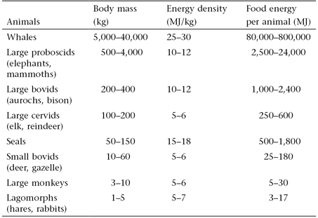
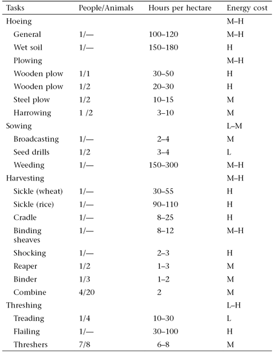
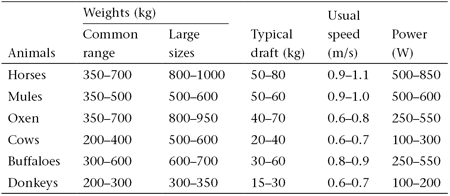
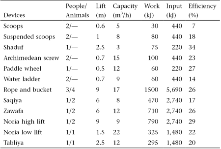
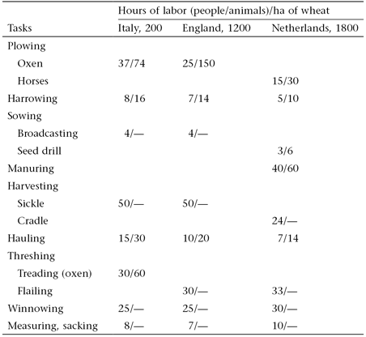
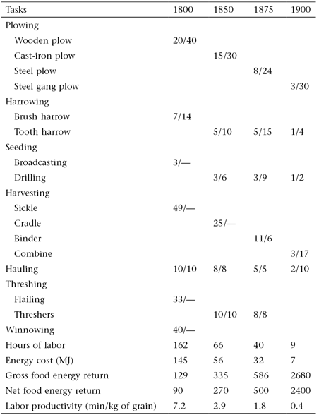

[豆瓣书评](https://book.douban.com/subject/35418848/)

# Preface and Acknowledgments

I finished writing _Energy in World History_ in July 1993; the book came
out in 1994, and it remained in print for two decades. Since 1994 energy
studies have been through a period of great expansion, and I have added
to it by publishing nine books dealing explicitly with energy matters
and a dozen interdisciplinary books with significant energy components.
Consequently, once I decided to revisit this fascinating topic it was
obvious that superficial updating would not do. As a result, this is a
substantially new book with a new title: the text is nearly 60% longer
than the original, and there are 40% more images and more than twice as
many references. Boxes sprinkled throughout the book contain some
surprising calculations, as well as many detailed explanations of
important topics and essential tables. I have also quoted from sources
ranging from the Classics---Apuleius, Lucretius, Plutarch---to
nineteenth- and twentieth-century observers such as Braudel, Eden,
Orwell, and Senancour. Graphics were updated and created by Bounce
Design in Winnipeg; two dozen archival photographs were secured from
Corbis in Seattle by Ian Saunders and Anu Horsman. As is always the case
with interdisciplinary studies of this kind, this book would not have
been possible without the work of hundreds of historians, scientists,
engineers, and economists.

_Winnipeg, August 2016_

# 1 Energy and Society

Energy is the only universal currency: one of its many forms must be
transformed to get anything done. Universal manifestations of these
transformations range from the enormous rotations of galaxies to
thermonuclear reactions in stars. On Earth they range from the
terra-forming forces of plate tectonics that part ocean floors and raise
new mountain ranges to the cumulative erosive impacts of tiny raindrops
(as the Romans knew, *gutta cavat lapidem non vi, sed saepe cadendo---*A
drop of water hollows a stone not by force but by continually dripping).
Life on Earth---despite decades of attempts to catch a meaningful
extraterrestrial signal, still the only life in the universe we know
of---would be impossible without the photosynthetic conversion of solar
energy into phytomass (plant biomass). Humans depend on this
transformation for their survival, and on many more energy flows for
their civilized existence. As Richard Adams (1982, 27) put it,

> We can think thoughts wildly, but if we do not have the wherewithal to
> convert them into action, they will remain thoughts. ... History acts
> in unpredictable ways. Events in history, however, necessarily take on
> a structure or organization that must accord with their energetic
> components.

The evolution of human societies has resulted in larger populations, a
growing complexity of social and productive arrangements, and a higher
quality of life for a growing number of people. From a fundamental
biophysical perspective, both prehistoric human evolution and the course
of history can be seen as the quest for controlling greater stores and
flows of more concentrated and more versatile forms of energy and
converting them, in more affordable ways at lower costs and with higher
efficiencies, into heat, light, and motion. This tendency has been
generalized by Alfred Lotka (1880--1949), an American mathematician,
chemist, and statistician, in his law of maximum energy: "In every
instance considered, natural selection will so operate as to increase
the total mass of the organic system, to increase the rate of
circulation of matter through the system, and to increase the total
energy flux through the system so long as there is present an unutilized
residue of matter and available energy" (Lotka 1922, 148).

The history of successive civilizations, the largest and most complex
organisms in the biosphere, has followed this course. Human dependence
on ever higher energy flows can be seen as an inevitable continuation of
organismic evolution. Wilhelm Ostwald (1853--1932, recipient of the 1909
Nobel Prize in Chemistry for his work on catalysis) was the first
scientist to expand explicitly "the second law of energetics to all and
any action and in particular to the totality of human actions. ... All
energies are not ready for this transformation, only certain forms which
have been therefore given the name of the free energies. ... Free energy
is therefore the capital consumed by all creatures of all kinds and by
its conversion everything is done" (Ostwald 1912, 83). This led him to
formulate his energetic imperative: "Vergeude keine Energie, verwerte
sie"---"Do not waste any energy, make it useful" (Ostwald 1912, 85).

Three quotations illustrate how Ostwald's followers have been restating
his conclusions and how some of them have made the link between energy
and all human affairs even more deterministically explicit. In the early
1970s Howard Odum (1924--2002) offered a variation on Ostwald's key
theme: "The availability of power sources determines the amount of work
activity that can exist, and control of these power flows determines the
power in man's affairs and in his relative influence on nature" (Odum
1971, 43). In the late 1980s Ronald Fox concluded a book on energy in
evolution by writing that "a refinement in cultural mechanisms has
occurred with every refinement of energy flux coupling" (Fox 1988, 166).

One does not have to be a scientist to make the link between energy
supply and social advances. This is Eric Blair (George Orwell,
1903--1950), writing in 1937 in the second chapter of _The Road to Wigan
Pier_, after his visit to an underground coal mine:

> Our civilization, pace Chesterton, is founded on coal, more completely
> than one realizes until one stops to think about it. The machines that
> keep us alive, and the machines that make machines, are all directly
> or indirectly dependent upon coal. In the metabolism of the Western
> world the coal-miner is second in importance only to the man who
> ploughs the soil. He is a sort of caryatid upon whose shoulders nearly
> everything that is not grimy is supported. For this reason the actual
> process by which coal is extracted is well worth watching, if you get
> the chance and are willing to take the trouble. (Orwell 1937, 18)

But restating that fundamental link (as Orwell did) and claiming that
cultural refinements have taken place with every refinement of energy
flux (as Fox does) are two different things. Orwell's conclusion is
unexceptionable. Fox's phrasing is clearly a restatement of a
deterministic view expressed two generations earlier by the
anthropologist Leslie White (1900--1975), who called it the first
important law of cultural development: "Other things being equal, the
degree of cultural development varies directly as the amount of energy
per capita per year harnessed and put to work" (White 1943, 346). While
there can be no dispute either about Ostwald's fundamental formulation
or about energy's all-encompassing effect on the structure and dynamics
of evolving societies (pace Orwell), a deterministic linking of the
level of energy use with _cultural_ achievements is a highly arguable
proposition. I examine that causality (or the lack of it) in the book's
closing chapter.

The fundamental nature of the concept is not in doubt. As Robert Lindsay
(1975, 2) put it,

> If we can find a single word to represent an idea which applies to
> every element in our existence in a way that makes us feel we have a
> genuine grasp of it, we have achieved something economical and
> powerful. This is what has happened with the idea expressed by the
> word energy. No other concept has so unified our understanding of
> experience.

But what is energy? Surprisingly, even Nobel Prize winners have great
difficulty in giving a satisfactory answer to that seemingly simple
question. In his famous _Lectures on Physics,_ Richard Feynman
(1918--1988) stressed that "it is important to realize that in physics
today, we have no knowledge of what energy is. We do not have a picture
that energy comes in little blobs of a definite amount" (Feynman 1988,
4--2).

What we do know is that all matter is energy at rest, that energy
manifests itself in a multitude of ways, and that these distinct energy
forms are linked by numerous conversions, many of them universal,
ubiquitous, and incessant, others highly localized, infrequent, and
ephemeral ([]{#c10752_001.xhtml#fig_001a}[fig.
1.1](#c10752_001.xhtml#fig_001)). The understanding of these stores,
potentials, and transformations was rapidly expanded and systematized
mostly during the nineteenth century, and this knowledge was perfected
during the twentieth century when---a telling comment on the
complexities of energy transformations---we understood how to release
nuclear energy sooner (theoretically by the late 1930s, practically by
1943, when the first reactor began to operate) than we knew how
photosynthesis works (its sequences were unraveled only during the
1950s).

![[]{#c10752_001.xhtml#fig_001}[[Figure
1.1](#c10752_001.xhtml#fig_001a)]{.figureLabel} Matrix of energy
conversions. Where more possibilities exist, no more than two leading
transformations are
identified.](vertopal_c7b1276959634ad39553458bb92e4366/images/10752_001_fig_001.jpg)

## []{#c10752_001.xhtml#S1}[]{#c10752_001.xhtml#d2e147}Flows, Stores, and Controls

All known forms of energy are critical for human existence, a reality
precluding any rank ordering of their importance. Much in the course of
history has been determined and circumscribed by both universal and
planetary flows of energy and by their regional or local manifestations.
The fundamental features of the universe are governed by gravitational
energy, which orders countless galaxies and star systems. Gravity also
keeps our planet orbiting at just the right distance from the Sun, and
it holds a sufficiently massive atmosphere that makes Earth habitable
(box 1.1).

## Box 1.1 Gravity and the habitability of Earth {.featuretitle}

Extreme tolerances of carbon-based metabolism are determined by the
freezing point of water, whose liquid form is required for the formation
and reactions of organic molecules (the lower bound), and by
temperatures and pressures that destabilize amino acids and break down
proteins (the upper bound). Earth's continuously habitable zone---the
range of orbital radius ensuring optimal conditions for a
life-supporting planet---is very narrow (Perkins 2013). A recent
calculation concluded that we are even closer to the limit than
previously thought: Kopparapu and co-workers (2014) concluded that,
given its atmospheric composition and pressure, Earth orbits at the
inner edge of the habitable zone, just outside the radius where the
runaway greenhouse effect would bring intolerably high temperatures.

About two billion years ago enough carbon dioxide (CO~2~) was
sequestered by the ocean and by archaea and algae to prevent this effect
on Earth, but if the planet had been a mere 1% farther from the Sun,
virtually all of its water would have been locked in glaciers. And even
with temperatures within an optimum band the planet could not support
highly diversified life without its unique atmosphere, dominated by
nitrogen, enriched by oxygen from photosynthesis, and containing a
number of important trace gases regulating surface temperature---but
this thin gaseous envelope could not persist without the planet being
sufficiently large to exert enough gravity to hold the atmosphere in
place.

As with all active stars, fusion powers the Sun, and the product of
those thermonuclear reactions reaches Earth as electromagnetic (solar,
radiant) energy. Its flux ranges over a broad spectrum of wavelengths,
including visible light. About 30% of this enormous flow is reflected by
clouds and surfaces, about 20% is absorbed by the atmosphere and clouds,
and the remainder, roughly half of the total inflow, is absorbed by
oceans and continents, gets converted to thermal energy, and is
reradiated into space (Smil 2008a). The geothermal energy of Earth adds
up to a much smaller heat flux: it results from the original
gravitational accretion of the planetary mass and from the decay of
radioactive matter, and it drives grand tectonic processes, which keep
reordering oceans and continents and cause volcanic eruptions and
earthquakes.

Only a tiny part of the incoming radiant energy, less than 0.05%, is
transformed by photosynthesis into new stores of chemical energy in
plants, providing the irreplaceable foundation for all higher life.
Animate metabolism reorganizes nutrients into growing tissues and
maintains bodily functions and constant temperature in all higher
species. Digestion also generates the mechanical (kinetic) energy of
working muscles. In their energy conversions, animals are inherently
limited by the size of their bodies and by the availability of
accessible nutrition. A fundamental distinguishing characteristic of our
species has been the extension of these physical limits through a more
efficient use of muscles and through the harnessing of energies outside
our own bodies.

Unlocked by human intellect, these extrasomatic energies have been used
for a growing variety of tasks, both as more powerful prime movers and
as fuels whose combustion releases heat. The triggers of energy supplies
depend on the flow of information and on an enormous variety of
artifacts. These devices have ranged from such simple tools as
hammerstones and levers to complex fuel-burning engines and reactors
releasing the energy of nuclear fission. The basic evolutionary and
historical sequence of these advances is easy to outline in broad
qualitative terms. As with any nonphotosynthesizing organism, the most
fundamental human energy need is for food. Foraging and scavenging by
hominins were very similar to the food acquisition practices of their
primate ancestors. Although some primates---as well as a few other
mammals (including otters and elephants), some birds (ravens and
parrots), and even some invertebrates (cephalopods)---have evolved a
small repertory of rudimentary tool-using capabilities (Hansell 2005;
Sanz, Call, and Boesch 2014; []{#c10752_001.xhtml#fig_002a}[fig.
1.2](#c10752_001.xhtml#fig_002)), only hominins made toolmaking a
distinguishing mark of their behavior.

![[]{#c10752_001.xhtml#fig_002}[[Figure
1.2](#c10752_001.xhtml#fig_002a)]{.figureLabel} Chimpanzee (*Pan
troglodytes*) in Gabon using tools to crack nuts
(Corbis).](vertopal_c7b1276959634ad39553458bb92e4366/images/10752_001_fig_002.jpg)

Tools have given us a mechanical advantage in the acquisition of food,
shelter, and clothing. The mastery of fire greatly extended our range of
habitation and set us further apart from animals. New tools led to the
harnessing of domesticated animals, the building of more complex
muscle-powered machines, and the conversion of a tiny fraction of the
kinetic energies of wind and water to useful power. These new prime
movers multiplied the power under human command, but for a very long
time their use was circumscribed by the nature and magnitude of the
captured flows. Most obviously, this was the case with sails, ancient
and effective tools whose capabilities were restricted for millennia by
prevailing wind flows and persistent ocean currents. These grand flows
steered the late fifteenth-century European transatlantic voyages to the
Caribbean. They also prevented the Spaniards from discovering Hawaii,
even though Spanish trading ships, the Manila Galleons (Galeón de
Manila), sailed once or twice a year across the Pacific from Mexico
(Acapulco) to the Philippines for 250 years between 1565 and 1815
(Schurz 1939).

Controlled combustion in fireplaces, stoves, and furnaces turned the
chemical energy of plants into thermal energy. This heat has been used
directly in households and in smelting metals, firing bricks, and
processing and finishing countless products. The combustion of fossil
fuels made all of these traditional direct uses of heat more widespread
and more efficient. A number of fundamental inventions made it possible
to convert thermal energy from the burning of fossil fuels to mechanical
energy. This was done first in steam and internal combustion engines,
then in gas turbines and rockets. We have been generating electricity by
burning fossil fuels, as well by harnessing the kinetic energy of water,
since 1882, and by fissioning a uranium isotope since 1956.

The combustion of fossil fuels and the generation of electricity created
a new form of high-energy civilization whose expansion has now
encompassed the whole planet and whose primary energy sources now
include small but rapidly rising shares of new renewable sources,
especially solar (harnessed by photovoltaic devices or in concentrating
solar power plants) and wind (converted by large wind turbines). In
turn, these advances have been predicated on a concatenation of other
developments. To use a flow-model analogy, a combination of gates
(valves) had to be set up and activated in proper sequence to enable the
flow of human ingenuity.

The most notable gates required to release great energy potentials
include requisite educational opportunities, predictable legal
arrangements, transparent economic rules, the adequate availability of
capital, and conditions conducive to basic research. Not surprisingly,
it usually takes generations to allow much increased or qualitatively
improved energy flows or to harness entirely new sources of energy on a
significant scale. Timing, overall power, and the composition of the
resulting energy flows are exceedingly difficult to predict, and during
the earliest phases of such transitions it is impossible to appraise all
eventual impacts that changing prime movers and fuel bases will have on
farming, industries, transport, settlements, warfare, and Earth's
environment. Quantitative accounts are essential to appreciate the
constraints of our actions and the extent of our achievements, and they
require knowledge of basic scientific concepts and measures.

## []{#c10752_001.xhtml#S2}[]{#c10752_001.xhtml#d2e210}Concepts and Measures

Several first principles underlie all energy conversions. Every form of
energy can be turned into heat, or thermal energy. No energy is ever
lost in any of these conversions. Conservation of energy, the first law
of thermodynamics, is one of the most fundamental universal realities.
But as we move along conversion chains, the potential for useful work
steadily diminishes (box 1.2). This inexorable reality defines the
second law of thermodynamics, and entropy is the measure associated with
this loss of useful energy. While the energy content of the universe is
constant, conversions of energies increase its entropy (decrease its
utility). A basketful of grain or a barrelful of crude oil is a
low-entropy store of energy, capable of much useful work once
metabolized or burned, and it ends up as the random motion of slightly
heated air molecules, an irreversible high-entropy state that represents
an irretrievable loss of utility.

## Box 1.2 Diminishing utility of converted energy {.featuretitle}

Any energy conversion illustrates the principle. If an American reader
uses electric light to illuminate this page, the electromagnetic energy
of that light is only a small part of the chemical energy contained in
the lump of coal used to generate it (in 2015 coal was used to produce
33% of the electricity generated in the United States). At least 60% of
coal's energy was lost as heat through a plant chimney and in cooling
water, and if a reader uses an old incandescent light, then more than
95% of delivered electricity ends up as heat generated as the metal of
the bulb's coiled filament resists the electric current. The light
reaching the page either is absorbed by it or is reflected and absorbed
by its surroundings and reradiated as heat. The initial low-entropy
input of coal's chemical energy has been dissipated as diffused
high-entropy heat that warmed the air above the station, along the
wires, and around the light bulb and caused an imperceptible temperature
increase above a page. No energy has been lost, but a highly useful form
was degraded to the point of no practical utility.

This unidirectional entropic dissipation leads to a loss of complexity
and to greater disorder and homogeneity in any closed system. But all
living organisms, whether the smallest bacteria or a global
civilization, temporarily defy this trend by importing and metabolizing
energy. This means that every living organism must be an open system,
maintaining a continuous inflow and outflow of energy and matter. As
long as they are alive, these systems cannot be in a state of chemical
and thermodynamic equilibrium (Prigogine 1947, 1961; von Bertalanffy
1968; Haynie 2001). Their negentropy---their growth, renewal, and
evolution---results in greater heterogeneity and increasing structural
and systemic complexity. As with so many other scientific advances, a
coherent understanding of these realities came only during the
nineteenth century, when the rapidly evolving disciplines of physics,
chemistry, and biology found a common concern in studying
transformations of energy (Atwater and Langworthy 1897; Cardwell 1971;
Lindsay 1975; Müller 2007; Oliveira 2014; Varvoglis 2014).

These fundamental interests needed a codification of standard
measurements. Two units became common for measuring **_energy_**:
calorie, a metric unit, and the British thermal unit (Btu). Today's
basic scientific unit of energy is the joule, named after an English
physicist, James Prescott Joule (1818--1889), who published the first
accurate calculation of the equivalence of work and heat (box 1.3).
**_Power_** denotes the rate of energy flow. Its first standard unit,
horsepower, was set by James Watt (1736--1819). He wanted to charge for
his steam engines on a readily understandable basis, and so he chose the
obvious comparison with the prime mover they were to replace, a
harnessed horse commonly used to power a mill or a pump
([]{#c10752_001.xhtml#fig_003a}[fig. 1.3](#c10752_001.xhtml#fig_003),
box 1.3).

## Box 1.3 Measuring energy and power {.featuretitle}

The official definition of a joule is the work accomplished when a force
of one newton acts over a distance of one meter. Another option is to
define a basic energy unit through heat requirements. One calorie is the
amount of heat needed to raise the temperature of 1 cm^3^ of water by
1°C. That is a tiny amount of energy: to do the same for 1 kg of water
calls for a thousand times more energy, or one kilocalorie (for the
complete list of multiplier prefixes, see "Basic Measures" in the
Addenda). Given the equivalence of heat and work, all that is required
to convert calories to joules is to remember that one calorie equals
roughly 4.2 joules. The conversion is equally simple for the still
common nonmetric English measure, the British thermal unit. One Btu
contains roughly 1,000 J (1,055, to be exact). A good comparative
yardstick is the average daily food need. For most moderately active
adults it is 2--2.7 Mcal, or about 8--11 MJ, and 10 MJ could be supplied
by eating 1 kg of whole wheat bread.

In 1782 James Watt calculated in his _Blotting and Calculation Book_
that a mill horse works at a rate of 32,400 foot-pounds a minute---and
the next year he rounded this to 33,000 foot-pounds (Dickinson 1939). He
assumed an average walking speed of about 3 feet per second, but we do
not know where he got his figure for an average pull of about 180
pounds. Some large animals were that powerful, but most horses in
eighteenth-century Europe could not sustain the rate of one horsepower.
Today's standard unit of power, one watt, is equal to the flow of one
joule per second. One horsepower is equal to about 750 watts (745.699,
to be exact). Consuming 8 MJ of food a day corresponds to a power rate
of 90 W (8 MJ/24 h × 3,600 s), less than the rating of a standard light
bulb (100 W). A double toaster needs 1,000 W, or 1 kW; small cars
deliver around 50 kW; a large coal-fired or nuclear power plant produces
electricity at the rate of 2 GW.

![[]{#c10752_001.xhtml#fig_003}[[Figure
1.3](#c10752_001.xhtml#fig_003a)]{.figureLabel} Two horses turning a
capstan geared to pumping well water in a mid-eighteenth-century French
carpet manufactory (reproduced from the *Encyclopédie* [Diderot and
d'Alembert 1769--1772]). An average horse of that period could not
sustain a steady work rate of one horsepower. James Watt used an
exaggerated rating to ensure customers' satisfaction with his
horsepower-denominated steam engines installed to place harnessed
animals.](vertopal_c7b1276959634ad39553458bb92e4366/images/10752_001_fig_003.jpg)

Another important rate is **_energy density_**, the amount of energy per
unit mass of a resource (box 1.4). This value is of a critical
importance for foodstuffs: even where abundant, low-energy-density foods
could never become staples. For example, the pre-Hispanic inhabitants of
the basin of Mexico always ate plenty of prickly pears, which were easy
to gather from the many species of cacti belonging to the genus
_Opuntia_ (Sanders, Parsons, and Santley 1979). But, as with most
fruits, pear's pulp is overwhelmingly (about 88%) water, with less than
10% carbohydrates, 2% protein, and 0.5% lipids, and has an energy
density of just 1.7 MJ/kg (Feugang et al. 2006). This means that even a
small woman surviving only on the carbohydrates of cactus pears
(assuming, unrealistically, virtually no need for the other two
macronutrients) would have to eat 5 kg of the fruit every day---but she
could get the same amount of energy from only about 650 g of ground corn
consumed as tortillas or tamales.

## Box 1.4 Energy densities of foodstuffs and fuels {.featuretitle}

```{=html}
<figure>
```

```{=html}
<figcaption>
```

```{=html}
</figcaption>
```

Ranking Examples Energy density (MJ/kg)

---

Foodstuffs  
  Very low Vegetables, fruits 0.8--2.5
 Low Tubers, milk 2.5--5.0
 Medium Meats 5.0--12.0
 High Cereal and legume grains 12.0--15.0
 Very high Oils, animal fats 25.0--35.0
Fuels  
  Very low Peats, green wood, grasses 5.0--10.0
 Low Crop residues, air-dried wood 12.0--15.0
 Medium Dry wood 17.0--21.0
Bituminous coals 18.0--25.0
 High Charcoal, anthracite 28.0--32.0
 Very high Crude oils 40.0--44.0

_Sources:_ Specific energy densities for individual foodstuffs and fuels
are listed in Merrill and Watt (1973), Jenkins (1993), and USDA (2011).

```{=html}
</figure>
```

**_Power density_** is the rate at which energies are produced or
consumed per unit of area and hence is a critical structural determinant
of energy systems (Smil 2015b). For example, city size in all
traditional societies depended on fuelwood and charcoal, and it was
clearly limited by the inherently low power density of phytomass
production (box 1.5, []{#c10752_001.xhtml#fig_004a}[fig.
1.4](#c10752_001.xhtml#fig_004)). The power density of sustainable
annual tree growth in temperate climates is at best equal to 2% of the
power density of energy consumption for traditional urban heating,
cooking, and manufactures. Consequently, cities had to draw on nearby
areas at least 30 times their size for fuel supply. This reality
restricted their growth even where other resources, such as food and
water, were adequate.

## Box 1.5 Power densities of phytomass fuels {.featuretitle}

Photosynthesis converts less than 0.5% of incoming solar radiation into
new phytomass. The best annual fuelwood productivities of traditional
fast-growing species (poplars, eucalyptus, pines) were no more than 10
t/ha, and in drier regions the rates were between 5 and 10 t/ha (Smil
2015b). With the energy density of dry wood averaging 18 GJ/t, the
harvest of 10 t/ha would translate into a power density of about 0.6
W/m^2^: (10 t/ha × 18 GJ)/3.15 × 107 (seconds in one year) = \~5,708 W;
5,708 W/10,000 m^2^ (ha) = \~0.6 W/m^2^. A large eighteenth-century city
would have required at least 20--30 W/m^2^ of its built-up area for
heating, cooking, and artisanal manufactures, and its fuelwood would
have had to come from an area at least 30 and up to 50 times its size.

But cities required plenty of charcoal, the only preindustrial smokeless
fuel preferred for indoor heating by all traditional civilizations, and
charcoaling entailed further substantial energy loss. Even by the
mid-eighteenth century the typical charcoal-to-wood ratio was still as
high as 1:5, which means that in energy terms (with dry wood at 18 GJ/t
and charcoal \[virtually pure carbon\] at 29 GJ/t), this conversion was
only about 30% efficient (5 × 18/29 = 0.32), and the power density of
wood harvests destined for charcoal production was only about 0.2
W/m^2^. Consequently, large preindustrial cities located in a northern
temperate climate and relying heavily on charcoal (China's Xi'an or
Beijing would be good examples) would have required a wooded area at
least 100 times their size to ensure a continuous supply of that fuel.

![[]{#c10752_001.xhtml#fig_004}[[Figure
1.4](#c10752_001.xhtml#fig_004a)]{.figureLabel} Charcoaling in early
seventeenth-century England as depicted in John Evelyn's *Silva*
(1607).](vertopal_c7b1276959634ad39553458bb92e4366/images/10752_001_fig_004.jpg)

Yet another rate, one that has assumed great importance with advancing
industrialization, is the **_efficiency of energy conversions_**. This
ratio of output/input describes the performance of energy converters, be
they stoves, engines, or lights. While we cannot do anything about the
entropic dissipation, we can improve the efficiency of conversions by
lowering the amount of energy required to perform specific tasks (box
1.6). There are fundamental (thermodynamic, mechanical) constraints to
these improvements, but we have pushed some processes close to the
practical efficiency limits, though in most instances, including such
common energy converters as internal combustion engines and lights,
there is still much room for further improvement.

## Box 1.6 Efficiency improvements and the Jevons paradox {.featuretitle}

Technical advances have brought many impressive efficiency gains, and
the history of lighting offers one of the best examples (Nordhaus 1998;
Fouquet and Pearson 2006). Candles convert just 0.01% of chemical energy
in tallow or wax to light. Edison's light bulbs of the 1880s were
roughly ten times as efficient. By 1900, coal-fired
electricity-generating plants had efficiencies of just 10%; light bulbs
turned no more than 1% of electricity into light, and hence about 0.1%
of coal's chemical energy appeared as light (Smil 2005). The best
combined-cycle gas turbine plants (using hot gas exiting a gas turbine
to produce steam for a steam turbine) are now about 60% efficient, while
fluorescent lights have efficiencies up to 15%, as do light-emitting
diodes (USDOE 2013). This means that about 9% of energy in natural gas
ends up as light, a 90-fold gain since the late 1880s. Such gains have
saved capital and operation costs and lowered environmental impacts.

But in the past, the rise of conversion efficiency did not necessarily
result in actual energy savings. In 1865 Stanley Jevons (1835--1882), an
English economist, pointed out that the adoption of more efficient steam
engines was accompanied by large increases in coal consumption and
concluded, "It is wholly a confusion of ideas to suppose that the
economical use of fuels is equivalent to a diminished consumption. The
very contrary is the truth. As a rule, new modes of economy will lead to
an increase of consumption according to a principle recognized in many
parallel instances" (Jevons 1865, 140). This reality has been confirmed
by many studies (Herring 2004, 2006; Polimeni et al. 2008), but in
affluent countries, those whose high per capita energy use has
approached, or already reached, saturation levels, the effect has been
getting weaker. As a result, rebounds attributable to higher efficiency
at the end-use level are often small and decrease over time, and
specific economy-wide rebounds may be trivial, and even net positive
(Goldstein, Martinez, and Roy 2011).

When efficiencies are calculated for the production of foodstuffs
(energy in food/energy in inputs to grow it), fuels, or electricity they
are usually called **_energy returns_**. Net energy returns in every
traditional agriculture relying solely on animate power had to be
considerably greater than one: edible harvests had to contain more
energy than the amount consumed as food and feed needed not only by
people and animals producing those crops but also by their nonworking
dependents. An insurmountable problem arises when we try to compare
energy returns in traditional agricultures that were powered solely by
animate energies (and hence involved only transformations of recently
received solar radiation) with those in modern farming, which is
subsidized directly (fuel for field operations) and indirectly (the
energies needed to synthesize fertilizers and pesticides and to build
farm machinery) and hence has, invariably, lower energy returns than
traditional cropping (box 1.7).

## Box 1.7 Comparison of energy returns in food production {.featuretitle}

Since the early 1970s, energy ratios have been used to illustrate the
superiority of traditional farming and the low energy returns of modern
agriculture. Such comparisons are misleading owing to a fundamental
difference between the two ratios. Those for traditional farming are
simply quotients of the food energy harvested in crops and the food and
feed energy needed to produce those harvests by deploying human and
animal labor. In contrast, in modern farming the denominator is composed
overwhelmingly of nonrenewable fossil fuel inputs needed to power field
machinery and to make machines and farm chemicals; labor inputs are
negligible.

If the ratios were calculated merely as quotients of edible energy
output to labor input, then modern systems, with their miniscule amount
of human effort and with no draft animals, would look superior to any
traditional practice. If the cost of producing a modern crop included
all converted fossil fuels and electricity converted to a common
denominator, then the energy returns in modern agriculture would be
substantially below traditional returns. Such a calculation is possible
because of the physical equivalence of energies. Both food and fuels can
be expressed in identical units, but an obvious "apples and oranges"
problem remains: there is no satisfactory way to compare, simply and
directly, the energy returns of the two farming systems that depend on
two fundamentally different kinds of energy inputs.

Finally, **_energy intensity_** measures the cost of products, services,
and even of aggregate economic output, in standard energy units---and of
energy itself. Among the commonly used materials, aluminum and plastics
are highly energy-intensive, while glass and paper are relatively cheap,
and lumber (excluding its photosynthetic cost) is the least
energy-intensive widely deployed material (box 1.8). The technical
advances of the past two centuries have brought many substantial
declines in energy intensities. Perhaps most notably, the coke-fueled
smelting of pig iron in large blast furnaces now requires less than 10%
of energy per unit mass of hot metal than did the preindustrial
charcoal-based production of pig iron (Smil 2016).

## Box 1.8 Energy intensities of common materials {.featuretitle}

```{=html}
<figure>
```

```{=html}
<figcaption>
```

```{=html}
</figcaption>
```

Material Energy cost (MJ/kg) Process

---

Aluminum 175--200 Metal from bauxite
Bricks 1--2 Fired from clay
Cement 2--5 From raw materials
Copper 90--100 From ore
Explosives 10--70 From raw materials
Glass 4--10 From raw materials
Gravel \<1 Excavated
Iron 12--20 From iron ore
Lumber 1--3 From standing timber
Paper 23--35 From standing timber
Plastics 60--120 From hydrocarbons
Plywood 3--7 From standing timber
Sand \<1 Excavated
Steel 20--25 From pig iron
Steel 10--12 From scrap metal
Stone \<1 Quarried

_Source:_ Data from Smil (2014b).

```{=html}
</figure>
```

The energy cost of energy (often called EROI, energy return on
investment, although EROEI, energy return on energy investment, would be
more correct) is a revealing measure only if we compare values that have
been calculated by identical methods using standard assumptions and
clearly identified analytical boundaries. Modern high-energy societies
have preferred to develop fossil fuel resources with the highest net
energy returns, and that is a major reason why we have favored crude oil
in general, and the rich Middle Eastern fields in particular; oil's high
energy density, and hence easy transportability, are other obvious
advantages (box 1.9).

## Box 1.9 Energy returns on energy investment {.featuretitle}

Differences in the quality and accessibility of fossil fuels are
enormous: thin underground seams of low-quality coal versus a thick
layer of good bituminous coal that can be extracted in open-cast mines,
or supergiant Middle Eastern hydrocarbons fields versus low-productivity
wells that require constant pumping. As a result, specific EROEI values
differ substantially---and they can change with the development of more
efficient recovery techniques. The following ranges are only approximate
indicators, illustrating differences among leading extraction and
conversion methods (Smil 2008a; Murphy and Hall 2010). For coal
production they range between 10 and 80, while for oil and gas they have
ranged from 10 to far above 100; for large wind turbines in the windiest
locations they may approach 20 but are mostly less than 10; for
photovoltaic solar cells they are no higher than 2; and for modern
biofuels (ethanol, biodiesel) they are at best only 1.5, but their
production has often entailed an energy loss or no net again (an EROEI
of just 0.9--1.0).

## []{#c10752_001.xhtml#S3}[]{#c10752_001.xhtml#d2e787}Complexities and Caveats

Using standard units to measure energy storages and flows is physically
straightforward and scientifically impeccable---yet these reductions to
a common denominator are also misleading. Above all, they cannot capture
critical qualitative differences among various energies. Two kinds of
coal may have an identical energy density, but one may burn very cleanly
and leave behind only a small amount of ash, while the other may smoke
heavily, emit a great deal of sulfur dioxide, and leave a large
incombustible residue. An abundance of high-energy-density coal ideal
for fueling steam engines (the often used adjective "smokeless" must be
seen in relative terms) was clearly a major factor contributing to the
British dominance of nineteenth-century maritime transport, as neither
France nor Germany had large coal resources of comparable quality.

Abstract energy units cannot differentiate between edible and inedible
biomass. Identical masses of wheat and dry wheat straw contain virtually
the same amount of heat energy, but straw, composed mostly of cellulose,
hemicellulose, and lignin, cannot be digested by humans, while wheat
(comprised of about 70% complex starchy carbohydrates and up to 14%
protein) is an excellent source of basic nutrients. They also hide the
specific origin of food energy, a matter of great importance for proper
nutrition. Many high-energy foods contain no, or hardly any, protein and
lipids, two nutrients required for normal body growth and maintenance,
and they may not provide any essential micronutrients---vitamins and
minerals.

There are other important qualities hidden by abstract measures. Access
to energy stores is obviously a critical matter. Tree stem wood and
branch wood have the same energy densities, but without good axes and
saws, people in many preindustrial societies could only gather the
latter fuel. That is still the norm in the poorest parts of Africa or
Asia, where children and women gather woody phytomass; and its form, and
hence its transportability, also matters because they have to carry wood
(branch) loads home on their heads, often for considerable distances.
Ease of use and conversion efficiency can be decisive in choosing a
fuel. A house can be heated by wood, coal, fuel oil, or natural gas, but
the best gas furnaces are now up to 97% efficient, hence far cheaper to
operate than any other option.

Burning straw in simple stoves requires frequent stoking, while large
wood pieces can be left burning unattended for hours. Unvented (or
poorly vented, through a hole in the ceiling) indoor cooking with dry
dung produces much more smoke than the burning of seasoned wood in a
good stove, and indoor biomass combustion remains a major source of
respiratory illnesses in many low-income countries (McGranahan and
Murray 2003; Barnes 2014). And unless their origins are specified,
densities or energy flows do not differentiate between renewable and
fossil energies---yet this distinction is fundamental to understanding
the nature and durability of a given energy system. Modern civilization
has been created by the massive, and increasing, combustion of fossil
fuels, but this practice is clearly limited by their crustal abundance,
as well as by the environmental consequences of burning coals and
hydrocarbons, and high-energy societies can ensure their survival only
by an eventual transition to nonfossil sources.

Further difficulties arise when comparing the efficiencies of animate
and inanimate energy conversions. In the latter case it is simply a
ratio of fuel or electricity inputs and useful energy output, but in the
former case daily food (or feed) intake should not be counted as an
energy input of human or animal labor because most of that energy is
required for basal metabolism---that is, to support the functioning of
the body's vital organs and to maintain steady body temperature---and
basal metabolism operates regardless of whether people or animals rest
or work. Calculating the net energy cost is perhaps the most
satisfactory solution (box 1.10).

## Box 1.10 Calculating the net energy cost of human labor {.featuretitle}

There is no universally accepted way to express the energy cost of human
labor, and calculating the net energy cost is perhaps the best choice:
it is a person's energy consumption above the existential need that
would have to be satisfied even if no work were done. This approach
debits human labor with its actual incremental energy cost. Total energy
expenditure is a product of basal (or resting) metabolic rate and
physical activity level (TEE = BMR × PAL), and the incremental energy
cost will obviously be the difference between TEE and BMR. The BMR of an
adult man weighing 70 kg would be about 7.5 MJ/d, and for a 60 kg woman
it would be about 5.5 MJ/day. If we assume that hard work will raise the
daily energy requirement by about 30%, then the net energy cost would be
about 2.2 MJ/day for men and 1.7 MJ/day for women, and hence I will use
2 MJ/day in all approximate calculations of net daily energy
expenditures in foraging, traditional farming, and industrial work.

Daily food intake should not be counted as an energy input of labor:
basal metabolism (to support vital organs, circulate the blood, and
maintain a steady body temperature) operates regardless of whether we
rest or work. Studies of muscle physiology, especially the work of
Archibald V. Hill (1886--1977, recipient of the Nobel Prize in
Physiology in 1922), made it possible to quantify the efficiency of
muscular work (Hill 1922; Whipp and Wasserman 1969). The net efficiency
of steady aerobic performances is about 20%, and this means that 2
MJ/day of metabolic energy attributable to a physical task would produce
useful work equal to about 400 kJ/day. I will use this approximation in
all relevant calculations. In contrast, Kander, Malanima, and Warde
(2013) used total food intake rather than actual useful energy
expenditure in their historical comparison of energy sources. They
assumed an average annual food intake of 3.9 GJ/capita, unchanged
between 1800 and 2008.

But even in much simpler societies than ours a great deal of labor was
always mental rather than physical---deciding how to approach a task,
how to execute it with the limited power available, how to lower energy
expenditures---and the metabolic cost of thinking, even very hard
thinking, is very small compared to strenuous muscular exertion. On the
other hand, mental development requires years of language acquisition,
socialization, and learning by mentoring and the accumulation of
experience, and as societies progressed, this learning process became
more demanding and longer lasting through formal schooling and training,
services that have come to require considerable indirect energy inputs
to support requisite physical infrastructures and human expertise.

A circle is closed. I have noted the necessity of quantitative
evaluations, but the real understanding of energy in history requires
much more than reducing everything to numerical accounts in joules and
watts and treating them as all-encompassing explanations. I will
approach the challenge in both ways: I will note energy and power
requirements and densities and point out improving efficiencies, but I
will not ignore the many qualitative attributes that constrain or
promote specific energy uses. And while the imperatives of energy needs
and uses have left a powerful imprint on history, many details,
sequences, and consequences of these fundamental evolutionary
determinants can be explained only by referring to human motivations and
preferences, and by acknowledging those surprising, and often seemingly
inexplicable, choices that have shaped our civilization's history.

[]{#c10752_002.xhtml}

# 2 Energy in Prehistory

Understanding the origins of the genus _Homo_ and filling in the details
of its subsequent evolution is a never-ending quest as new findings push
back many old markers and complicate the overall picture with the
discovery of species that do not fit easily into an existing hierarchy
(Trinkaus 2005; Reynolds and Gallagher 2012). In 2015 the oldest
reliably dated hominin remains were those of _Ardipithecus ramidus_ (4.4
million years ago, found in 1994) and _Australopithecus anamensis_
(4.1--5.2 million years ago, found in 1967). A notable 2015 addition was
_Australopithecus deyiremeda_ (3.3--3.5 million years ago) from Ethiopia
(Haile-Selassie et al. 2015). The sequence of younger hominins includes
_Australopithecus afarensis_ (unearthed in 1974 in Laetoli, Tanzania,
and in Hadar, Ethiopia), _Homo habilis_ (discovered in 1960 in
Tanzania), and _Homo erectus_ (beginning 1.8 million years ago, with
many finds in Africa, Asia, and Europe extending to about 250,000 years
ago).

Reanalysis of the first _Homo sapiens_ bones---Richard Leakey's famous
discoveries in Ethiopia starting in 1967---dated them to about 190,000
years ago (McDougall, Brown, and Fleagle 2005). Our direct ancestors
thus spent their lives as simple foragers, and it was only about 10,000
years ago that the first small populations of our species began a
sedentary existence based on the domestication of plants and animals.
This means that for millions of years, the foraging strategies of
hominins resembled those of their primate ancestors, but we now have
isotopic evidence from East Africa that by about 3.5 million years ago
hominin diets began to diverge from those of extant apes. Sponheimer and
co-workers (2013) showed that after that time, several hominin taxa
began to incorporate ^13^C-enriched foods (produced by C~4~ or
crassulacean acid metabolism) in their diets and had a highly variable
carbon isotope composition atypical of African mammals. Reliance on C~4~
plants is thus of ancient origin, and in modern agriculture two C~4~
cultivars, corn and sugar cane, have higher average yields than any
other species grown for its grain or sugar content.

The first evolutionary departure that eventually led to our species was
not a larger brain size or toolmaking but bipedalism, a structurally
improbable yet immensely consequential adaptation whose beginnings can
be traced as far back as about seven million years ago (Johanson 2006).
Humans are the only mammals whose normal way of locomotion is walking
upright (other primates do so only occasionally), and hence bipedalism
can be seen as the critical breakthrough adaptation that made us
eventually human. Yet bipedalism---essentially a sequence of arrested
falls---is inherently unstable and clumsy: "Human walking is a risky
business. Without split-second timing man would fall flat on his face;
in fact, with each step he takes, he teeters on the edge of catastrophe"
(Napier 1970, 165). And besides making us prone to musculoskeletal
injuries, bipedalism also leads to age-related bone loss, osteopenia
(lower than normal bone density), and osteoporosis (Latimer 2005).

Many answers have been offered to the obvious question of why, then, do
it, and some of them, as Johanson (2006) summarily argues, appear quite
unpersuasive. To appear taller in order to intimidate predators would
have had no effect on wild dogs or cheetahs or hyenas, who are not
intimidated by much larger mammalian species. To become upright just to
look over tall grass would only have attracted predators; reaching for
fruit on low-hanging branches could be done without surrendering rapid
quadruped running; and the cooling of bodies could be achieved by
resting in shade and foraging only during cooler mornings or evenings.
Differences in overall energy expenditure may offer the best explanation
(Lovejoy 1988). Hominins, much like other mammals, spend most of their
energy in reproduction, feeding, and ensuring safety, and if bipedalism
helped to do all of these, then it would have been adopted.

As Johanson (2006, 2) puts it, "Natural selection cannot _create_ a
behavior like bipedalism, but it can act to select the behavior once it
has arisen." Viewed in a narrower sense, it is not clear that bipedalism
offered sufficient biomechanical advantage to promote its selection just
on the basis of the energy cost of walking (Richmond et al. 2001),
though Sockol, Raichlen, and Pontzer (2007), after measuring energy
expenditure in walking chimpanzees and adult humans, found that human
walking costs about 75% less energy than both quadrupedal and bipedal
walking in chimpanzees. The difference owes to the biomechanical
differences in anatomy and gait, and above all to the more extended hip
and longer hind limb in humans.

Bipedalism started a cascade of enormous evolutionary adjustments
(Kingdon 2003; Meldrum and Hilton 2004). Upright walking liberated
hominin arms for carrying weapons and for taking food to group sites
instead of consuming it on the spot. But bipedalism was necessary to
trigger hand dexterity and tool use. Hashimoto and co-workers (2013)
concluded that adaptations underlying tool use evolved independently of
those required for human bipedalism because in both humans and monkeys,
each finger is represented separately in the primary sensorimotor
cortex, just as the fingers are physically separated in the hand. This
creates the ability to use each digit independently in the complex
manipulations required for tool use. But without bipedalism it would be
impossible to use the trunk for leverage in accelerating the hand during
toolmaking and tool use. Bipedalism also freed the mouth and teeth to
develop a more complex call system as the prerequisite of language
(Aiello 1996). These developments required larger brains whose energy
cost eventually reached three times the level for chimpanzees,
accounting for up to one-sixth of the total basal metabolic rate (Foley
and Lee 1991; Lewin 2004). The average encephalization quotient
(actual/expected brain mass for body weight) is 2--3.5 for primates and
early hominins, while for the humans is a bit higher than 6. Three
million years ago _Australopithecus afarensis_ had a brain volume of
less than 500 cm^3^; 1.5 million years ago the volume had doubled in
_Homo erectus,_ and then it increased by roughly 50% in _Homo sapiens_
(Leonard, Snodgrass, and Robertson 2007).

A higher encephalization quotient was critical for the rise of social
complexity (which raised the survival odds and set hominins apart from
other mammals) and was closely related to changes in the quality of food
consumed. The brain's specific energy need is roughly 16 times that of
skeletal muscles, and the human brain claims 20--25% of resting
metabolic energy, compared to 8--10% in other primates and just 3--5% in
other mammals (Holliday 1986; Leonard et al. 2003). The only way to
accommodate large brain size while maintaining the overall metabolic
rate (the human resting metabolism is no higher than that of other
mammals of similar mass) was to reduce the mass of other metabolically
expensive tissues. Aiello and Wheeler (1995) argued that reducing the
size of the gastrointestinal tract was the best option because the gut
mass (unlike the mass of hearts or kidneys) can vary substantially,
depending on the diet.

Fish and Lockwood (2003), Leonard, Snodgrass, and Robertson (2007), and
Hublin and Richards (2009) confirmed that diet quality and brain mass
have a significantly positive correlation in primates, and better
hominin diets, including meat, supported larger brains, whose high
energy need was partly offset by a reduced gastrointestinal tract (Braun
et al. 2010). While extant nonhuman primates have more than 45% of their
gut mass in the colon and only 14--29% in the small intestine, in humans
those shares are reversed, with more than 56% in the small intestine and
only 17--25% in the colon, a clear indication of adaptation to
high-quality, energy-dense foods (meat, nuts) that can be digested in
the small intestine. Increased meat consumption also helps to explain
human gains in body mass and height, as well as smaller jaws and teeth
(McHenry and Coffing 2000; Aiello and Wells 2002). But a higher meat
intake could not change the energy basis of evolving hominins: to secure
any food they had to rely only on their muscles and on simple stratagems
while gathering, scavenging, hunting, and fishing.

Tracing the genesis of the first wooden tools (sticks and clubs) is
impossible as only those artifacts that were preserved in anoxic
environments, most commonly in bogs, were able to survive for extended
periods. Disintegration is not a problem with the hard stones used to
fashion simple tools, and new findings have been pushing back the date
of the earliest verifiable hominin stone tools. For several decades the
consensus dated the earliest stone tools to about 2.5 million years ago.
Cobble-based, these relatively small and simple Oldowan hammerstones
(cores with an edge), choppers, and flakes made it much easier to
butcher animals and to break their bones (de la Torre 2011). But the
latest findings at the Lomekwi site in West Turkana, Kenya, pushed the
date of the oldest known stone toolmaking to about 3.3 million years ago
(Harmand et al. 2015).

About 1.5 million years ago hominins started to quarry larger flakes to
make bifacial hand axes, picks, and cleavers of Acheulean (1.2--0.1
million years ago) style. The chipping of a single core yielded sharp
cutting edges less than 20 cm long, and these practices produced a large
variety of special handheld stone tools
([]{#c10752_002.xhtml#fig_001a}[fig. 2.1](#c10752_002.xhtml#fig_001)).
Wooden spears were essential for hunting larger animals. In 1948 a
nearly complete spear found inside an elephant skeleton in Germany was
dated to the last interglacial period (115,000--125,000 years ago), and
in 1996 throwing spears found at a Schöningen open-cast lignite mine
were dated to 400,000--380,000 years ago (Thieme 1997), and stone points
were hafted to wooden spears beginning about 300,000 years ago.

![[]{#c10752_002.xhtml#fig_001}[[Figure
2.1](#c10752_002.xhtml#fig_001a)]{.figureLabel} Acheulean stone tools,
first made by *Homo ergaster,* were formed by the removal of stone
flakes to create specialized cutting blades
(Corbis).](vertopal_c7b1276959634ad39553458bb92e4366/images/10752_002_fig_001.jpg)

But new discoveries in South Africa put the earliest date of making
hafted multicomponent tools about 200,000 years earlier than previously
reported: Wilkins and co-workers (2012) concluded that stone points from
Kathu Pan, made about 500,000 years ago, functioned as spear tips. True
long-range projectile weaponry evolved in Africa between 90,000 and
70,000 years ago (Rhodes and Churchill 2009). Another recent South
African discovery showed that a significant technical advance---the
production of small bladelets (microliths), primarily from heat-treated
stone, to be used in making composite tools---took place as early as
71,000 years ago (Brown et al. 2012). Larger composite tools became
common only about 25,000 years ago (Europe's Gravettian period) with the
production of ground and hafted adzes and axes, and with the more
efficient flaking of flint, yielding many sharp-edged tools; harpoons,
needles, saws, pottery, and items from woven fibers (clothes, nets,
baskets) were also invented and adopted during that time.

Magdalenian techniques (between 17,000 and 12,000 years ago; the era is
named after a rock shelter at La Madeleine in southern France where the
tools were discovered) produced up to 12 m of microblade edges from a
single stone, and experiments with their modern replicas (mounted on
spears) show their hunting efficacy (Pétillon et al. 2011). A
stone-tipped spear became an even more potent weapon after the invention
of spear throwers during the late Paleolithic. A leveraged throw easily
doubled the velocity of the weapon and reduced the necessity for a
closer approach. Stone-tipped arrows carried these advantages further,
with an added gain in accuracy.

We will never know the earliest dates for the controlled use of fire for
warmth and cooking: in the open, any relevant evidence was removed by
many subsequent events, and in occupied caves it was destroyed by
generations of later use. The earliest date for a well-attested use of
controlled fire has been receding: Goudsblom (1992) put it at about
250,000 years ago; and a dozen years later Goren-Inbar and co-workers
(2004) pushed it as far back as 790,000 years ago, while the fossil
record suggests that the consumption of some cooked food took place as
early as 1.9 million years ago. But without any doubt, by the Upper
Paleolithic---30,000 to 20,000 years ago, when _Homo sapiens sapiens_
displaced Europe's Neanderthals---the use of fire was widespread
(Bar-Yosef 2002; Karkanas et al. 2007).

Cooking has been always seen as an important component of human
evolution, but Wrangham (2009) believes that it had a "monstrous" effect
on our ancestors because it greatly expanded the range and quality of
available food, and also because its adoption brought many physical
changes (including smaller teeth and a less voluminous digestive tract)
and behavioral adjustments (such as the need to defend stores of
accumulated food, which promoted protective female-male bonds) that led
eventually to complex socialization, sedentary lives and
"self-domestication." All prehistoric cooking was done with open fires,
with meat suspended above the flames, buried in hot embers, placed on
hot rocks, encased in a tough skin, covered by clay, or put with hot
stones into leather pouches filled with water. Owing to the variety of
settings and methods, it is impossible to quote typical fuel conversion
efficiencies. Experiments show that 2--10% of wood's energy ends up as
useful heat for cooking, and plausible assumptions indicate annual wood
consumption maxima of 100--150 kg/year/capita (box 2.1).

## Box 2.1 Wood consumption in open-fire cooking of meat {.featuretitle}

Realistic assumptions for setting plausible maxima of wood consumption
in open-fire meat cooking during the late Paleolithic are as follows
(Smil 2013a): average daily food energy intake of 10 MJ/capita (adequate
for adults, higher than the mean for entire populations), with meat
being 80% (8 MJ) of the total food intake; a food energy density of
animal carcasses of 8--10 MJ/kg (typical for mammoths, generally 5--6
MJ/kg for large ungulates); an average ambient temperature of 20°C in
warm and a mean of 10°C in colder climates; cooked meat at 80°C (77°C
suffices for well-done meat); a heat capacity of meat of about 3
kJ/kg°C; cooking efficiency of an open fire at just 5%; and an average
energy density of air-dried wood of 15 MJ/kg. These assumptions imply an
average daily per capita intake of nearly 1 kg of mammoth meat (and
about 1.5 kg of large ungulate meat) and a daily need for about 4--6 MJ
of wood. The annual total would be 1.5--2.2 GJ or 100--150 kg of (some
fresh and some air-dried) wood. For 200,000 people who lived 20,000
years ago the global need would be 20,000--30,000 t, a negligible share
(on the order of 10^--8^) of the standing pre-agricultural woody
phytomass.

In addition to warming and cooking, fire was also used as an engineering
tool: modern humans were heat-treating stones to improve their flaking
properties as early as 164,000 years ago (Brown et al. 2009). And
Mellars (2006) suggested there is evidence for the controlled burning of
vegetation in South Africa as early as 55,000 years ago. Woodland
burning as a tool of environmental management by foragers during the
early Holocene would have been done to aid hunting (by promoting the
regrowth of forage to attract animals and improving visibility), to make
human mobility easier, or to improve or synchronize the gathering of
plant foods (Mason 2000).

The great spatial and temporal variability of the archaeological record
precludes making any simple generalizations concerning the energy
balances of prehistoric societies. Descriptions of first contacts with
surviving foragers and their anthropological studies provide uncertain
analogies: information on groups that survived in extreme environments
long enough to be studied by modern scientific methods offers a limited
insight into the lives of prehistoric foragers in more equable climates
and more fertile areas. Moreover, many studied foraging societies were
already affected by prolonged contact with pastoralists, farmers, or
overseas migrants (Headland and Reid 1989; Fitzhugh and Habu 2002). But
the absence of a typical foraging pattern does not preclude recognition
of a number of biophysical imperatives governing energy flows and
determining the behavior of gathering and hunting groups.

## []{#c10752_002.xhtml#S2}[]{#c10752_002.xhtml#d2e220}Foraging Societies

The most comprehensive collections of reliable evidence show that the
average population densities of modern foraging populations---reflecting
a variety of natural habitats and food acquisition skills and
techniques---ranged over three orders of magnitude (Murdock 1967; Kelly
1983; Lee and Daily 1999; Marlowe 2005). The minima were less than a
single person/100 km^2^ to several hundred people/100 km^2^, with the
global mean of 25 people/100 km^2^ for 340 studied cultures, too low to
support more complex societies with increasing functional specialization
and social stratification. The average densities of foragers were lower
than the densities of similarly massive herbivorous mammals that were
able to digest abundant cellulosic phytomass.

Whereas allometric equations predict about five 50 kg mammals/km^2^,
chimpanzee densities are between 1.3 and 2.4 animals/km^2^, and the
densities of hunter-gatherers surviving into the twentieth century were
well below one person/km^2^ in warm climates, only 0.24 in the Old World
and 0.4 in the New World (Marlowe 2005; Smil 2013a). Population
densities were significantly higher for groups combining the gathering
of abundant plants with hunting (well-studied examples include groups in
postglacial Europe and, more recently, in the basin of Mexico) and for
coastal societies heavily dependent on aquatic species (with
well-documented archaeological sites in the Baltic region and more
recent anthropological studies in the Pacific Northwest).

Mollusk collecting, fishing, and near-shore hunting of sea mammals
sustained the highest foraging densities and led to semipermanent, even
permanent, settlements. The coastal villages of the Pacific Northwest,
with their large houses and organized communal hunting of sea mammals,
were exceptional in their sedentism. These large density variations were
not a simple function of biospheric energy flows: they were not
uniformly decreasing poleward and increasing equatorward (in proportion
to higher photosynthetic productivity), or corresponding to the total
mass of animals available for hunting. They were determined by
ecosystemic variables, by a relative dependence on plant and animal
foods, and by the use of seasonal storage. Much like nonhuman primates,
all foragers were omnivorous, but killing larger animals was a major
energetic challenge as it targeted a much smaller reservoir of edibles
than plant gathering, a natural consequence of the diminishing energy
transfer between trophic levels.

Herbivores consume only 1--2% of the net primary productivity in
deciduous temperate forests and up to 50--60% in some tropical
grasslands, with 5--10% most representative of terrestrial grazing (Smil
2013a). Generally less than 30% of the ingested phytomass is digested;
most of it is respired, and in mammals and birds only 1--2% of it is
converted into zoomass. As a result, the most commonly hunted herbivores
embodied less than 1% of the energy initially stored in the phytomass of
the ecosystems they inhabited. This reality explains why hunters
preferred to kill animals that combined a relatively large adult body
mass with high productivity and high territorial density: wild pigs (90
kg) and deer and antelopes (mostly 25--500 kg) were common targets.

Where such animals were relatively common, such as on tropical or
temperate grasslands or in tropical woodlands, hunting was more
rewarding, but, contrary to the common perception of an abundance of
animal species, tropical forests were an inferior ecosystem to be
exploited by hunting. Most tropical forest animals are small arboreal
folivorous and fructivorous species (monkeys, birds) that are active and
inaccessible in high tree canopies (many are also nocturnal), and
hunting them yields low energy returns. Sillitoe (2002) found that both
gathering and hunting in a tropical rain forest of the Papua New Guinea
highlands to be costly, with foragers expending up to four times more
energy on hunting than they obtained in food. Obviously, such a poor
energy return would not allow hunting to be a primary means of food
provision (the negative energy return could be explained only by the
capture of animal protein), and some forms of shifting farming were
required to provide enough food.

Bailey and co-workers (1989) concluded that there were no unambiguous
ethnographic accounts of foragers who lived in tropical rain forests
without some reliance on domesticated plants and animals. Bailey and
Headland (1991) later changed that conclusion as archaeological evidence
from Malaysia indicated that high densities of sago and pigs would allow
exceptions. Similarly, gathering was often surprisingly unrewarding in
the species-rich tropics, as well as in temperate forests. These
ecosystems store most of the planet's phytomass, but they do so mostly
in the dead tissues of tall tree trunks, whose cellulose and lignin
humans cannot digest (Smil 2013a). Energy-rich fruits and seeds are a
very small portion of total plant mass and are often inaccessible in
high canopies; seeds are often protected by hard coats and need
energy-intensive processing before consumption. Gathering in tropical
forests also needed more searching: a great variety of species means
there may be considerable distances between the trees or vines whose
parts are ready for collection ([]{#c10752_002.xhtml#fig_002a}[fig.
2.2](#c10752_002.xhtml#fig_002)). The harvesting of Brazil nuts is a
perfect example of these constraints (box 2.2).

![[]{#c10752_002.xhtml#fig_002}[[Figure
2.2](#c10752_002.xhtml#fig_002a)]{.figureLabel} Tropical rain forests
are rich in species but relatively poor in plants that would support
larger foraging populations. This image shows canopies at La Fortuna,
Costa Rica
(Corbis).](vertopal_c7b1276959634ad39553458bb92e4366/images/10752_002_fig_002.jpg)

## Box 2.2 Harvesting Brazil nuts {.featuretitle}

Because of their high lipid content (66%), Brazil nuts contain about 27
MJ/kg (compared to about 15 MJ/kg for cereal grains), are about 14%
protein, and are also a source of potassium, magnesium, calcium,
phosphorus, and high levels of selenium (Nutrition Value 2015).
Harvesting the nuts is both demanding and dangerous. _Bertholletia
excelsa_ grows up to 50 m, with individual trees widely scattered.
Between 8 and 24 nuts are contained in heavy (up to 2 kg) capsules
covered with a coconut-like hard endocarp. Nut foragers must time their
harvest: too early, and the pods are still inaccessible in the canopies
and gatherers must waste energy on another trip; too late, and agoutis
(_Dasyprocta punctata_), which are large rodents and the only animals
able to open the fallen pods, will eat the seeds right away or bury some
of them in food caches (Haugaasen et al. 2010).

In contrast to the often frustrating hunting in tropical and boreal
forests, grasslands and open woodlands offered excellent opportunities
for collecting and hunting. They store much less energy per unit area
than a dense forest, but a higher share of it comes in the form of
easily collectible and highly nutritious seeds and fruits, or as
concentrated patches of large starchy roots and tubers. High energy
density (as much as 25 MJ/kg) made nuts particular favorites, and some
of them, such as acorns and chestnuts, were also easy to harvest. And
unlike in forests, many animals grazing on grasslands can grow to very
large sizes, often move in massive herds, and give excellent returns on
energy invested in the hunt.

And hominins could secure meat on grasslands and woodlands even without
any weapons, as scavengers, as unmatched runners, or as clever schemers.
In light of the unimpressive physical endowment of early humans and the
absence of effective weapons, it is most likely that our ancestors were
initially much better scavengers than hunters (Blumenschine and Cavallo
1992; Pobiner 2015). Large predators---lions, leopards, saber-toothed
cats---often left behind partially eaten herbivore carcasses. This meat,
or at least the nutritious bone marrow, could be reached by alert early
humans before it was devoured by vultures, hyenas, and other scavengers.
But Domínguez-Rodrigo (2002) has argued that scavenging would not
provide enough meat and that only hunting could secure sufficient animal
protein on grasslands. In any case, human bipedalism and ability to
sweat better than any other mammal made it also possible to chase to
exhaustion even the fastest herbivores (box 2.3).

## Box 2.3 Running and heat dissipation by humans {.featuretitle}

All quadrupeds have optimum speeds for different gaits, such as walk,
trot, and canter in horses. The energy cost of human running is
relatively high compared to the running cost of similarly massive
mammals, but unlike them, humans can uncouple that cost from running
speed for common velocities between 2 and 6 m/s (Carrier 1984; Bramble
and Lieberman 2004). Bipedalism and efficient heat dissipation explain
this feat. Quadrupedal ventilation is limited to one breath per
locomotor cycle. The thoracic bones and muscles must absorb the impact
on the front limbs as the dorsoventral binding rhythmically compresses
and expands the thorax, but human breath frequency can vary relative to
stride frequency: humans can run at a variety of speeds, whereas optimal
quadruped speed is structurally determined.

The extraordinary human ability to thermoregulate rests on very high
rates of sweating. Horses lose water at an hourly rate of 100 g/m^2^ of
their skin, and camels lose up to 250 g/m^2^, but people lose more than
500 g/m^2^, with peak rates of more than 2 kg/hour (Torii 1995; Taylor
and Machado-Moreira 2013). Perspiration rate translates to heat loss of
550--625 W, enough to regulate temperature even during extremely hard
work. People can also drink less than they perspire, and make up for any
temporary partial dehydration hours later. Running turned humans into
diurnal, high-temperature predators that could chase animals to
exhaustion (Heinrich 2001; Liebenberg 2006). Documented chases include
those of the Tarahumara Indians of northern Mexico running down deer and
of Paiutes and Navajos besting pronghorn antelopes. The Kalahari Basarwa
could chase duikers, gemsbok, and, during the dry season, even zebras to
exhaustion, as some Australian Aborigines did with kangaroos. Hunters
running barefoot reduced their energy costs by about 4% (and had fewer
acute ankle and chronic lower leg injuries) than modern runners with
athletic shoes (Warburton 2001).

Carrier (1984) believes that the outstanding rates of human heat
dissipation provided a notable evolutionary advantage that served our
ancestors well in appropriating a new niche, that of diurnal,
hot-temperature predators. The human ability to sweat profusely and
hence to work hard in hot environments was retained by populations that
migrated to colder climates: there are no major differences in the
density of eccrine glands among populations of different climate zones
(Taylor 2006). People from middle and high latitudes can match the
sweating rates of hot-climate natives after a short period of
acclimatization.

But once adequate tools were invented and adopted, hunting with them was
preferable to running down the prey, and Faith (2007) confirmed, after
examining 51 assemblages from the Middle Stone Age and 98 from the Later
Stone Age, that early African hunters were fully competent at killing
large ungulate animals, including buffaloes. The energy imperatives of
hunting large animals had also made an incalculable contribution to
human socialization. Trinkaus (1987, 131--132) concluded that "most of
the distinguishing human characteristics, such as bipedalism, manual
dexterity, and elaborate technology, and marked encephalization can be
viewed as having been promoted by the demands of an opportunistic
foraging system."

Hunting's role in the evolution of human societies is self-evident.
Individual success in hunting large animals with primitive weapons was
unacceptably low, and viable hunting groups had to maintain minimum
cooperative sizes in order to track wounded animals, butcher them,
transport their meat, and then pool the gains. Communal hunting brought
by far the greatest rewards, with well-planned and well-executed herding
of animals into confined runs (using brush and stone drive lines, wooden
fences, or ramps) and capturing them in prepared pens or natural traps,
or---perhaps the simplest and most ingenious solution---stampeding them
over cliffs (Frison 1987). Many large herbivores---mammoths, bison,
deer, antelopes, mountain sheep---could be slaughtered in such ways,
providing caches of frozen or processed (smoked, pemmican) meat.

Head-Smashed-In Buffalo Jump near Fort Mcleod, Alberta, a UNESCO World
Heritage Site, is one of the more spectacular sites of this inventive
hunting strategy, which was used at the site for about 5,700 years. "To
start the hunt ... young men ... would entice the herd to follow them by
imitating the bleating of a lost calf. As the buffalo moved closer to
the drive lanes (long lines of stone cairns were built to help the
hunters direct the buffalo to the cliff kill site), the hunters would
circle behind and upwind of the herd and scare the animals by shouting
and waving robes" and stampeded the herd over the cliff (UNESCO 2015a).
The net energy return in animal protein and fat was high. Late
Pleistocene hunters may have become so skillful that many students of
the Quaternary era concluded that hunting was largely (even completely)
responsible for a relatively rapid disappearance of the late Paleolithic
megafauna, animals with a body mass greater than 50 kg (Martin 1958,
2005; Fiedel and Haynes 2004), but the verdict remains uncertain (box
2.4).

## Box 2.4 Extinction of the Late Pleistocene megafauna {.featuretitle}

The persistent killing of slow-breeding animals (those with a single
offspring born after a long gestation) could lead to their extinction.
If we assume that Late Pleistocene foragers had a high daily food
requirement of 10 MJ/capita, that they ate mostly meat, and that most of
it (80%) came from megafauna, then their population of two million
people would need nearly 2 Mt (fresh weight) of meat (Smil 2013a). If
mammoths were the only hunted species, that would have required the
annual killing of 250,000--400,000 animals. Megaherbivore hunting also
targeted other large mammals (elephants, giant deer, bison, aurochs),
and procuring 2 Mt of meat from a mixture of these species would have
required an annual kill of some two million animals. A more likely
explanation for the Late Pleistocene extinctions is a combination of
natural (climate and vegetation change) and anthropogenic (hunting and
fire) factors (Smil 2013a).

All pre-agricultural societies were omnivorous; they did not have the
luxury of ignoring any available food resource. Although foragers ate a
large variety of plant and animal species, usually only a few principal
foodstuffs dominated their diets. A preference for seeds among gatherers
was inevitable. Besides being rather easy to collect and store, seeds
combine a high energy content with relatively high protein shares. Wild
grass seeds have as much food energy as cultivated grains (wheat is at
15 MJ/kg), while nuts have an energy density up to about 80% higher
(walnuts contain 27.4 MJ/kg).

All wild meat is an excellent source of protein, but most of it contains
very little fat, and hence it has very low energy density---less than
half that of grains for small, lean mammals. Not surprisingly, there was
a widespread hunting preference for large and relatively fatty species.
A single small mammoth provided as much edible energy as 50 reindeer,
while a bison was easily equal to 20 deer (box 2.5). This is why our
Neolithic ancestors were willing to ambush huge mammoths with their
simple stone-tipped weapons, or why Indians on the North American
plains, seeking fatty meat for preparing long-lasting pemmican, spent so
much energy in pursuing bison.

## Box 2.5 Body masses, energy densities, and food energy content of hunted animals {.featuretitle}



But energy considerations alone cannot provide a full explanation of
foraging behavior. If they were always dominant, then optimal
foraging---whereby gatherers and hunters try to maximize their net
energy gain by minimizing the time and effort spent in foraging---would
have been their universal strategy (Bettinger 1991). Optimal foraging
explains the preference for hunting large, fatty mammals or for
collecting less nutritious plant parts that do not need processing
rather than energy-dense nuts, which may be hard to crack. Many foragers
undoubtedly behaved in ways that maximized their net energy return, but
other existential imperatives often worked against such behavior. Among
the most important ones were the availability of safe night shelters,
the need to defend territories against competing groups, and the needs
for reliable water sources and for vitamins and minerals. Food
preferences and attitudes toward work were also important (box 2.6).

## Box 2.6 Food preferences and attitudes toward work {.featuretitle}

Food preferences are convincingly illustrated by a comparison of two
otherwise highly similar foraging groups. The !Kung Basarwa (in
Botswana) owe their notoriety in the anthropological literature to their
dependence on abundant and highly nutritious mongongo nuts, which gave
them the best energy returns documented in food gathering. But the
/Aise, another Basarwa group with access to the nuts, did not eat them
because to them, the nuts did not taste good (Hitchcock and Ebert 1984).
Similarly, coastal groups in southern Australia achieved high energy
densities through fishing, but across the strait archaeological evidence
shows scale fish refuse missing from middens in Tasmania (Taylor 2007).

An excellent example of cultural realities at variance with simplistic
energy models is Lizot's (1977) comparison of two nearby groups of
Yanomami Indians (northern Amazonia). The group surrounded by forest
consumed less than half the amount of animal food energy and protein
that its neighbors did, living in an environment less well endowed with
wild pigs, tapirs, and monkeys and possessing the same hunting skills
and tools. His explanation: people of the first group were simply
lazier, hunted infrequently, and, briefly, preferred to eat less well.
"During one of the weeks ... the men did not go hunting once, they had
just collected their favorite hallucinogen (_Anadenanthera peregrina_)
and spent entire days taking drugs; the women complained there was no
meat, but the men turned a deaf ear" (Lizot 1977, 512).

This represents a common case of a major variation in energy provided by
hunting that bears no relationship either to resource availability (the
presence of animals) or to the energy cost of the hunt (given simple and
virtually identical weapons) but is solely a function of attitude toward
work. Another example of actions not conforming to energetic
explanations comes from an analysis of data on meat sharing among
Tanzanian Hadza (Hawkes, O'Connell, and Jones 2001). The best
explanation for the widespread sharing of meat of large animals is to
reduce the risk inherent in big-game hunting---but Hadza sharing was not
motivated by the expectation of risk-reducing reciprocity but was done
primarily to enhance a hunter's status as a desirable neighbor.

Our inability to reconstruct prehistoric energy balances has provoked
some inadmissible generalizations. For some groups the total foraging
effort was relatively low, only a few hours a day. This finding led to
foragers being portrayed as "the original affluent society," living in a
kind of material plenty filled with leisure and sleep (Sahlins 1972).
Most notably, Dobe !Kung people of the Kalahari Desert in Botswana,
living on wild plants and meat, were thought to provide an excellent
window on the lives of prehistoric foragers, who allegedly led
contented, healthy, and vigorous lives (Lee and DeVore 1968). This
conclusion, based on very limited and dubious evidence, must be---and
has been---challenged (Bird-David 1992; Kaplan 2000; Bogin 2011.

Simplistic theorizing about affluent foragers ignored both the reality
of much of the hard and often dangerous work in foraging and the
frequency with which environmental stresses and infectious diseases
ravaged most foraging societies. Seasonal food shortages forced the
eating of unpalatable plant tissues and led to weight loss, and often to
devastating famines. They also resulted in high infant mortality
(including infanticide) and promoted low fertility rates. And, not
surprisingly, a reanalysis of energy expenditure and demographic data
collected in the 1960s found that the nutritional status and health of
Dobe !Kung "were, at best, precarious and, at worst, indicative of a
society in danger of extinction" (Bogin 2011, 349). As Froment (2001, 259) put it, "Coping with hazards and a heavy burden of diseases,
hunter-gatherers do not live----and have never lived----in the Garden of
Eden; they are not affluent, but poor, with limited needs and limited
satisfaction."

Approximate calculations for a small number of twentieth-century
foraging groups show the highest net energy returns for the gathering of
some roots. As many as 30--40 units of food energy were acquired for
every unit expended. In contrast, many hunting forays, above all those
for smaller arboreal or ground mammals in tropical rain forests, had a
net energy loss or bare equivalence (box 2.7). Typical gathering returns
were 10--20-fold, similar to those of hunting large mammals. Prehistoric
returns were undoubtedly much higher in many biomass-rich environments,
allowing for a gradual increase in social complexity.

## Box 2.7 Net energy returns in foraging {.featuretitle}

I use the method described in box 1.10 and assume smaller statures of
prehistoric foragers (average adult weight of just 50 kg). That would
have required about 6 MJ/day (about 250 kJ/h) for basal metabolism, and
a minimum existential adult food energy need of about 8 MJ, or roughly
330 kJ/h. Plant collecting required mostly light to moderate labor,
while hunting and fishing tasks ranged from light to heavy exertions.
Typical foraging activities needed about four times the basal metabolic
rate for men and five times that for women, or almost 900 kJ/h.
Subtracting the basic existential need puts the net energy input in
foraging at roughly 600 kJ/h. Energy output is simply the value of
edible portions of collected plants or killed animals.

In fact, many foraging societies reached levels of complexity usually
associated only with later agricultural societies. They had permanent
settlements, high population densities, large-scale food storage, social
stratification, elaborate rituals, and incipient crop cultivation. Upper
Paleolithic mammoth hunters in the Moravian loess region had well-built
stone houses, produced a variety of excellent tools, and could fire clay
(Klima 1954). The social complexity of the Upper Paleolithic groups of
southwestern France was promoted by the strong Atlantic influence, which
resulted in fairly cool summers but also exceptionally mild winters, and
extended the growing season and intensified the productivity of the
continent's most southerly open tundra or steppelike vegetation, which
supported herbivorous herds larger than anywhere in periglacial Europe
(Mellars 1985). The complexity of these Paleolithic cultures is best
attested by their remarkable sculptures, carvings, and cave paintings
(Grayson and Delpech 2002; French and Collins 2015)
([]{#c10752_002.xhtml#fig_003a}[fig. 2.3](#c10752_002.xhtml#fig_003)).

![[]{#c10752_002.xhtml#fig_003}[[Figure
2.3](#c10752_002.xhtml#fig_003a)]{.figureLabel} Charcoal paintings of
animals on a wall of the Chauvet Cave in southern France. These
remarkable likenesses were dated to between 32,900 and 30,000 years ago
(Corbis).](vertopal_c7b1276959634ad39553458bb92e4366/images/10752_002_fig_003.jpg)

The highest productivities in complex foraging were associated with the
exploitation of aquatic resources (Yesner 1980). Excavations of
Mesolithic sites in southern Scandinavia showed that once the
postglacial hunters had depleted the stocks of large herbivores they
became hunters of porpoises and whales, fishers, and collectors of
shellfish (Price 1991). They lived in larger, often permanent
settlements that included cemeteries. Northwestern Pacific tribes
dependent on fishing had settlements of several hundred people living in
well-built wooden houses. Regular runs of salmon species guaranteed a
reliable and easily exploitable resource that could be safely stored
(smoked) to provide excellent nutrition. Thanks to its high fat content
(about 15%), salmon has an energy density (9.1 MJ/kg) nearly three times
that of cod (3.2 MJ/kg). The superior case of high population density
dependent on maritime hunting is that of northwestern Alaskan Inuit,
whose net energy returns in killing migrating baleen whales were more
than 2,000-fold (Sheehan 1985) (box 2.8).

## Box 2.8 Alaskan whalers {.featuretitle}

In less than four months of near-shore hunting of baleen whales, whose
migration routes led along the Alaskan coast, men in umiak (boats with a
driftwood or whalebone frame covered with sealskin and crewed by up to
eight people) amassed food for settlements whose precontact population
reached almost 2,600 people (Sheehan 1985; McCartney 1995). The largest
adult baleen whales weigh up to 55 t, but even the most commonly landed
immature two-year-old animals averaged nearly 12 t. The high energy
density of blubber (about 36 MJ/kg) and muktuk (skin and blubber, which
also has a vitamin C content comparable to that of grapefruit) resulted
in a more than 2,000-fold energy gain in hunting.

Lower but still exceptionally high energy returns resulted from
exploiting annual salmon runs by the coastal tribes of the Pacific
Northwest: the density of fish returning upstream was often so high that
fishers could simply scoop them into boats or onto the shore. These high
energy returns supported large permanent settlements, social complexity,
and artistic creativity (large wooden totems). Eventual limits on the
population growth of these coastal settlements were imposed by the
necessity to hunt other marine species and land game in order to secure
raw materials for clothing, bedding, and hunting equipment.

A food supply dependent on a few seasonal energy flows required
extensive, and often elaborate, storage. Storage practices included
caching in permafrost; drying and smoking of seafood, berries, and
meats; storing of seeds and roots; preservation in oil; and the making
of sausages, nut-meal cakes, and flours. Large-scale, long-term food
storage changed foragers' attitudes toward time, work, and nature and
helped stabilize populations at higher densities (Hayden 1981; Testart
1982; Fitzhugh and Habu 2002). The need to plan and budget time was
perhaps the most important evolutionary benefit. This new mode of
existence precluded frequent mobility and introduced a different way of
subsistence based on surplus accumulation. The process was
self-amplifying: the quest for the manipulation of an ever larger share
of solar energy flows set the societies on the road toward higher
complexity.

Although our understanding of hominin evolution has increased
impressively during the last two generations, one key area of
uncertainty remains: contrary to all popular claims about the benefits
of Paleolithic diets, we still cannot reconstruct the representative
composition of pre-agricultural subsistence. This should not be a
surprise (Henry, Brooks, and Piperno 2014). Readily degradable plant
remains of food consumption very rarely survive for tens of thousands of
years and almost never for millions, making it exceedingly difficult to
quantify the share of plant foods in typical diets. Bones often survive,
but their accumulations from animal predations must be carefully
distinguished from hominin acquisition, and even then it is impossible
to interpret how representative they were of particular diets.

As Pryor and co-workers (2013) note, the widely accepted image of
European Upper Paleolithic hunter-gatherers as proficient hunters of
large mammals inhabiting largely treeless landscapes stems from the poor
preservation of plant remains at such ancient sites. Their study showed
that the potential of such sites to provide macrofossil remains of
plants consumed by humans has been underestimated, and that "the ability
to exploit plant foods may have been a vital component in the successful
colonisation of these cold European habitats" (Pryor et al. 2013, 971).
And Henry, Brooks, and Piperno (2014) analyzed plant
microremains---starch grains and phytoliths---left in dental calculus
and on stone tools and concluded that both modern humans and their
Neanderthal coevals consumed a similarly wide range of plant foods,
including rhizomes and grass seeds.

Changes in body height and mass and in cranial features (gracilization
of the mandible) are indirect indicators of prevailing diets and could
have arisen from a variety of food mixtures. The findings of stone tools
used to kill and butcher animals cannot be readily related to average
per capita meat intake over extended periods of time, and hence only
direct stable isotope evidence (ratios of ^13^C/^12^C and ^15^N/^14^N)
provides an accurate determination of long-term protein sources, their
trophic levels, and their terrestrial and marine origins; distinguishes
phytomass synthesized by the two principal pathways (C~3~ and C~4~) and
heterotrophs feeding on those plants; and informs us about the basic
makeup of the total diet. Even these studies cannot be translated into
reliable patterns of average macronutrient (carbohydrates, proteins,
lipids) intake, but isotope data indicate that during the Gravettian
period in Europe, animal protein was the main source of dietary protein,
with aquatic species contributing about 20% of the total, and even more
at coastal sites (Hublin and Richards 2009).

Before leaving the forager energetics I should note that foraging
retained an important role in all early agricultural societies. In
Çatalhöyük, a large Neolithic agricultural settlement on the Konya Plain
dated to about 7200 BCE, early farmers had diets dominated by grains and
wild plants, but excavations also show the bones of hunted animals,
ranging from large aurochs to foxes, badgers, and hares (Atalay and
Hastorf 2006). And at Tell Abu Hureyra in northern Syria, hunting
remained a critical source of food for 1,000 years after the beginning
of plant domestication (Legge and Rowley-Conwy 1987). In predynastic
Egypt (earlier than 3100 BCE), the cultivation of emmer wheat and barley
was complemented by the hunting of waterfowl, antelopes, wild pigs,
crocodiles, and elephants (Hartmann 1923; Janick 2002).

## []{#c10752_002.xhtml#S3}[]{#c10752_002.xhtml#d2e604}Origins of Agriculture

Why did some foragers start to farm? Why did these new practices diffuse
so widely, and why did their adoption proceed at what, in evolutionary
terms, is a fairly rapid rate? These challenging questions may be
sidestepped by agreeing with Rindos (1984) that agriculture has no
single cause but arose from a multitude of interdependent interactions.
Or, as Bronson (1977, 44) put it, "What we are dealing with is a
complex, multifaceted adaptive system, and in human adaptive systems ...
single all-efficient 'causes' cannot exist." But many anthropologists,
ecologists, and historians have been trying to find precisely such
principal causes, and there are many publications surveying diverse
explanatory theories about the origin of agriculture (Cohen 1977; Pryor
1983; Rindos 1984; White and Denham 2006; Gehlsen 2009; Price and
Bar-Yosef 2011).

Overwhelming evidence for the evolutionary character of agricultural
advances makes it possible to narrow down the possibilities. The most
persuasive explanation of agricultural origins lies in the combination
of population growth and environmental stress, in recognizing that the
transition to permanent cropping was driven by both natural and social
factors (Cohen 1977). Because the climate was too cold and CO~2~ levels
were too low during the late Paleolithic and because these conditions
changed with the subsequent warming, Richerson, Boyd, and Bettinger
(2001) have argued that agriculture was impossible during the
Pleistocene but mandatory during the Holocene. This argument is
strengthened by the fact that between 10,000 and 5,000 years before the
present, cropping evolved independently in at least seven locations on
three continents (Armelagos and Harper 2005).

Fundamentally, crop cultivation is an effort to ensure an adequate food
supply, and hence agriculture's origins could be fully explained as yet
another instance of an energy imperative. Diminishing returns from
gathering and hunting led to the gradual extension of incipient
cultivation present in many foraging societies. As already noted,
foraging and cultivation coexisted in various shares of food output for
very long periods. But no sensible explanation of agriculture's origins
can ignore the many social advantages of farming. Sedentary crop
cultivation was an efficient way for more people to stay together; it
made it easier to have larger families, to accumulate material
possessions, and to organize for both defense and offense.

Orme (1977) even concluded that food production may have been
unimportant as an end in itself, but there is no doubt that both the
genesis and diffusion of agriculture had critical social cofactors. Any
simplistic energy-driven explanation of agricultural origins is also
weakened by the fact that the net energy returns of early farming were
often inferior to those of earlier or concurrent foraging activities.
Compared to foraging, early farming usually required higher human energy
inputs---but it could support higher population densities and provide a
more reliable food supply. This explains why so many foraging societies
had continuous interaction (and often much trade) with neighboring
farming groups for thousands, or at least hundreds, of years before they
adopted permanent farming (Headland and Reid 1989).

There was no single center of domestication from which cultivated plants
and milk- and meat-producing animals spread, but in the Old World the
most important region of agricultural origin was not, as previously
thought, the southern Levant but rather the upper reaches of the Tigris
and Euphrates rivers (Zeder 2011). This means that food production
started along the margins, rather than in the core areas, of optimal
zones. The botanical record from Chogha Golan in the foothills of the
Iranian Zagros Mountains provides the most recent confirmation of this
reality (Riehl, Zeidi, and Conard 2013): cultivation of wild barley
(_Hordeum spontaneum_) began there about 11,500 years ago, later
augmented by the cultivation of wild wheat and wild lentils.

In process terms, it is essential to stress that there are no clear
thresholds or sharp divides between foraging and agriculture, as
extended periods of managing wild plants and animals precede their true
domestication, which is characterized by clearly identifiable
morphological changes. And, contrary to earlier understandings, the
domestication of plants and animals proceeded almost concurrently and
yielded an effective arrangement fairly rapidly (Zeder 2011). The oldest
approximate dates for the first appearance are about 11,500--10,000
years before the present for the plant species emmer (_Triticum
dicoccum_) and einkorn wheat (_Triticum monococcum_) and barley
(_Hordeum vulgare_) in the Middle East
([]{#c10752*002.xhtml#fig_004a}[fig. 2.4](#c10752_002.xhtml#fig_004)),
10,000 years for China's millets (\_Setaria italica*), 7,000 years for
rice (_Oryza sativa_), 10,000 years for Mexican squash (_Cucurbita_
species), and 9,000 years for corn (_Zea mays_) and 7,000 years for
Andean potatoes, _Solanum tuberosum_ (Price and Bar-Yosef 2011). The
earliest animal domestications go back to 10,500--9,000 years ago,
starting with goats and sheep, followed by cattle and pigs.

![[]{#c10752_002.xhtml#fig_004}[[Figure
2.4](#c10752_002.xhtml#fig_004a)]{.figureLabel} The earliest
domesticated cereals. a--c. Emmer wheat (*Triticum dicoccum*), einkorn
wheat (*Triticum monococcum*), and barley (*Hordeum vulgare*) were the
foundation of the origins of agriculture in the Middle East
(Corbis).](vertopal_c7b1276959634ad39553458bb92e4366/images/10752_002_fig_004.jpg)

The two main explanations of Europe's Neolithic transition to farming
have been through indigenous action animated by imitation (cultural
diffusion) or driven by dispersing populations (demic diffusion).
Radiocarbon dating of material from early Neolithic sites by Pinhasi,
Fort, and Ammerman (2005) yielded results consistent with the prediction
of demic diffusion, radiating most likely from the northern Levant and
the Mesopotamian area and proceeding northwestward at an average pace of
0.6--1.1 km/year. This conclusion is supported by comparisons of
mitochondrial DNA sequences from late European hunter-gatherer skeletons
with those from early farmers and from modern Europeans: they show
persuasively that the first farmers were not the descendants of local
foragers but had immigrated at the onset of the Neolithic (Bramanti et
al. 2009).

Early agriculture often took the form of shifting cultivation (Allan
1965; Spencer 1966; Clark and Haswell 1970; Watters 1971; Grigg 1974;
Okigbo 1984; Bose 1991; Cairns 2015). This practice alternated usually
short (1--3 years) periods of cultivation with fairly long (a decade or
more) fallow spells. Despite many differences (determined by ecosystems,
climates, and dominant crops) there were many similarities, most of them
clearly driven by efforts to minimize energy expenditures. The cycle
started with the clearing of natural vegetation, and its slashing or
burning was often sufficient to prepare the surface for planting. To
minimize the walking distance, fields or gardens were opened as close to
the settlements as possible, and clearing of the secondary growth was
the preferred option: for example, Rappaport (1968) found that only one
out of 381 Tsembaga (New Guinea) gardens was cleared in virgin forest.
Some plots had to be fenced to prevent damage by animals: in that case,
tree felling for fences needed the highest labor inputs. Plant nitrogen
was largely lost in combustion, but mineral nutrients enriched the soil.

Men did the heavy work (in the absence of good tools, vegetation was
simply burned; some trees had to be cut down for fencing), while women's
labor was dominated by weeding and harvesting, and, because of their
relatively high yields, cereals and tubers were the staples (Rappaport
1968). In all warmer regions there was much interplanting, particularly
in intensively cultivated gardens; intercropping; and staggered
harvesting. Shifting agriculture was important on all continents except
Australia. In South America its ancient practice (mostly between 500 BCE
and 1000 CE) left its marks throughout the Amazon basin in the form of
_terra preta_, up to 2 m deep dark soils containing charred wood and
crop residues, human waste, and bones (Glaser 2007; Junqueira, Shepard,
and Clement 2010). In North America it reached as far north as Canada,
where the Hurons cultivated corn and beans in long (35--60 years)
rotation cycles and supported 10--20 people/ha (Heidenreich 1971).

In areas of low population density and abundant land availability, the
practice was a fitting part of the evolutionary sequence from foraging
to permanent cropping. A diminishing supply of land, environmental
degradation, and increasing pressures for more intensive cropping have
been steadily reducing its importance. Net energy returns have varied
widely. Tsembaga horticulture in the highlands of New Guinea yielded
approximately a 16-fold energy return (Rappaport 1968). Another New
Guinea study found returns no higher than 6- to 10-fold (Norgan et al.
1974)---but the corn harvest of Kekchi Maya (Guatemala) brought at least
a 30-fold energy return (Carter 1969). Most net returns were 11--15 for
small grains and 20--40 for most root crops, bananas, and also for corn,
while maxima were close to 70 for some roots and legumes (box 2.9).
Feeding one person required mostly 2--10 ha of land to be cleared
periodically, with the actually cultivated area ranging from just 0.1 to
1 ha/person. Even moderately productive shifting agriculture supported
population densities an order of magnitude higher than the best
foraging.

## Box 2.9 Energy costs and population densities in shifting cultivation {.featuretitle}

Net energy cost is used to calculate returns of shifting farming. I
assume that an average labor input requires 700 kJ/h. Outputs are edible
harvests uncorrected for storage losses and seed needs.


Where scarcity of precipitation, or its long seasonal absence, made
cropping unrewarding or impossible, nomadic pastoralism has been an
effective alternative (Irons and Dyson-Hudson 1972; Galaty and Salzman
1981; Evangelou 1984; Khazanov 2001; Salzman 2004). Managed grazing has
been the energetic foundation of scores of Old World societies, and
though some of them remained poor and isolated, others were among the
most feared long-distance interveners in history: Xiongnu were in
conflict with the early Chinese dynasties for hundreds of years, and the
Mongol invasion of 1241 reached as far west as today's Poland and
Hungary.

Animal husbandry is a form of prey conservation, a strategy of deferred
harvests whose opportunity costs are greater for larger animals,
especially bovids (Alvard and Kuznar 2001). Larger animals are
preferred, but higher growth rates favor sheep and goats. Animals can
convert grasses into milk, meat, and blood with remarkably low inputs of
human energy ([]{#c10752_002.xhtml#fig_005a}[fig.
2.5](#c10752_002.xhtml#fig_005)). Pastoralists' labor was confined to
herding the animals, guarding them against predators, watering them,
helping with deliveries, milking regularly, and butchering infrequently,
and sometimes building temporary enclosures. The sustainable population
densities of such societies were no higher than those of foraging groups
(box 2.10).

![[]{#c10752_002.xhtml#fig_005}[[Figure
2.5](#c10752_002.xhtml#fig_005a)]{.figureLabel} Maasai herder with his
cattle
(Corbis).](vertopal_c7b1276959634ad39553458bb92e4366/images/10752_002_fig_005.jpg)

## Box 2.10 Nomadic pastoralists {.featuretitle}

Helland (1980) illustrated low labor requirements in pastoral societies
by pointing out the large numbers of major livestock species managed by
a single herder in the East African setting: up to 100 camels, 200
cattle, and 400 sheep and goats. Khazanov (1984) lists similarly large
figures for Asian pastoralists: two mounted shepherds for 2,000 sheep in
Mongolia, an adult shepherd and a boy to tend 400--800 cattle in
Turkmenia. The appeal of low labor needs was one of the key reasons for
the reluctance of many pastoralists to abandon their peregrinations and
to become settled farmers. As a result, many nomadic societies existed
for generations as neighbors of sedentary farmers and abandoned their
herds only because of devastating drought or substantial loss of
available pastures.

Minimum per capita counts for pastoral subsistence were 5--6 heads of
cattle, 2.5 3 camels, or 25--30 goats or sheep. Much higher cattle
ownership among traditional Maasai (13--16 heads/capita) is explained by
the minimum requirements for blood harvesting, done by piercing a
tightened jugular vein and drawing 2--4 L every 5--6 weeks. During the
periods of drought a herd of 80 cattle was needed to provide blood for a
family of 5--6 people, or 13--16 animals/capita (Evangelou 1984). In all
cases, nomadic population densities were low compared with those of
settled farmers, in East Africa mostly between 0.8--2.2 people/km^2^,
and 0.03--0.14 heads/ha (Helland 1980; Homewood 2008).

For millennia, nomadic grazing dominated parts of Europe and the Middle
East, and large regions of Africa and Asia. In all of these places it
sometimes blended into mixtures of seminomadic agropastoralism,
especially in parts of Africa with a significant component of foraging.
Often hemmed in by more productive farmers, and commonly dependent on
barter with settled societies, some of these nomads had little impact
beyond their confined worlds. But many groups exercised great influence
on the Old World's history through their repeated invasions and
temporary conquests of agricultural societies (Grousset 1938; Khazanov
2001). Some pure pastoralists and agropastoralists survive even
today---above all in Central Asia and in Sahelian and eastern
Africa---but it has been an increasingly marginal existence.

[]{#c10752_003.xhtml}

# 3 Traditional Farming

While the transition from foraging to farming cannot be explained solely
by energetic imperatives, the evolution of agriculture can be seen as a
continuing effort to raise land productivity (to increase digestible
energy yield) in order to accommodate larger populations. Even within
that narrowed framework, important nonenergy considerations (such as an
adequate supply of micronutrients, vitamins, and minerals) should not be
forgotten, but because of the overwhelmingly vegetarian diets of all
traditional peasant societies it is not a distorting simplification to
focus on the output of digestible energy produced in staple crops in
general and grains in particular.

Only grains combine fairly high yields---initially only about 500 kg/ha;
eventually, in the most intensive traditional agricultures, more than 2
t/ha---with high shares of easily digestible carbohydrates and a
moderately high level of proteins (some, above all corn, also have a
significant amount of lipids). Their energy density at maturity (15--16
MJ/kg) is roughly five times that of fresh tubers, and their moisture
content when air-dried is low enough to allow long-term storage (in
vessels by households, on a large scale in granaries). Staple grains
also mature fast enough---traditional varieties mature in 100--150
days---to permit increased food productivity through annual rotations
with other crops (mainly oilseeds and grain legumes) or by
double-cropping of cereals.

Boserup (1965, 1976) conceptualized the link between food energy and the
evolution of peasant societies as a matter of choices. Once a particular
agricultural system reaches the limits of its productivity, people can
decide to migrate, to stay and stabilize their numbers, to stay and let
their numbers decline---or to adopt a more productive way of farming.
The last option may not be necessarily more appealing or more probable
than the other solutions, and its adoption is often postponed or chosen
only reluctantly because such a shift almost invariably requires higher
energy inputs---in most cases of both human and animal labor. Increased
productivity will support larger populations by cultivating the same (or
even smaller) areas, but the net energy return of intensified cropping
may not increase and may actually decline.

Reluctance to expand permanently cultivated land (a choice that entailed
higher energy inputs, beginning with the clearing of primeval forests,
the draining of swamps, or the building of terraced fields) led to much
delayed reclamation of marginal lands. The villages of Carolingian
Europe were overpopulated and their grain supplies were chronically
inadequate, but only in parts of Germany and Flanders were new fields
created in less easily cultivable areas (Duby 1968). Medieval Europe saw
waves of German peasants moving from densely populated western regions
to open up new farmland in wooded or grassland areas of Bohemia, Poland,
Romania, and Russia that were seen as undesirable by nearby cultivators.
Similarly, China began its colonization of the fertile but cold
Northeast (Manchuria) only during the eighteenth century, and even now
cultivation on outlying Indonesian islands is of low intensity compared
to the high productivities on densely populated Java. And everywhere, it
took millennia to shift from regular, extensive fallowing to annual
cropping and then to multicropping.

Despite many differences in agronomic practices and in cultivated crops,
all traditional agricultures shared the same energetic foundation. They
were powered by the photosynthetic conversion of solar radiation,
producing food for people, feed for animals, recycled wastes for the
replenishment of soil fertility, and fuels for smelting the metals
needed to make simple farm tools. Consequently, traditional farming was,
in principle, fully renewable. In reality, it often led to the depletion
of accumulated energy stocks, above all in its pioneering stages when
new farmland was created through the widespread clearance of primeval
forests. In any case, the whole enterprise relied on virtually immediate
conversions of solar energy flows (with typical delays ranging from just
the several months required to harvest crops to several decades before
cutting down mature trees).

Yet even where cropping replaced natural grasslands (entailing a much
smaller loss of stored phytomass), this renewability was no guarantee of
sustainability. Poor agronomic practices lowered soil fertility or
caused excessive erosion or desertification, resulting in reduced yields
and even the abandonment of cultivation. In most regions traditional
farming progressed from extensive to intensive cultivation: its prime
movers---human and animal muscles---remained unchanged for millennia,
but cropping practices, cultivated varieties, and the organization of
labor were greatly transformed. Thus both constancy and change mark the
history of traditional farming.

The advancing intensification of farming sustained higher population
densities, but it also demanded higher energy expenditures, not only for
direct farming activities but also for such critical supportive measures
as the digging of wells, the building of irrigation canals, roads, and
food storage structures, and the terracing of fields. In turn, these
improvements required more energy to make a larger variety of better
tools and simple machines, powered by domestic animals or by water and
wind. More intensive cultivation relied on animal labor at least for
plowing, usually by far the most energy-demanding field task. The
Americas were notable exceptions: neither Mesoamerican cultivators nor
Inca potato and corn growers had any draft animals. Keeping domestic
animals required more intensive cropping to produce feeds. Animals were
also used extensively for many other field tasks, as well as in grain
threshing and milling, and were indispensable for the land-borne
distribution of food. Their stabling, feeding, and breeding and the
production of harnesses, shoes, and implements introduced new complexity
and skills.

But not all steps toward intensive farming were as energy-intensive as
multicropping, which put a recurrent strain on available labor during
planting and harvesting periods; increased the reliance on more powerful
draft animals, which led to a requirement for more land to produce their
feed; or had to be supported through the construction and maintenance of
irrigation canals, labor that entailed repeated heavy exertion. To use a
mechanical analogy, some changes that made it possible to harness a
higher share of the available photosynthetic potential involved the
opening of critical nonenergy gates (valves) that were either throttling
the existing flows or virtually preventing their conversion into
digestible phytomass.

The availability of nitrogen, the key plant macronutrient, is perhaps
the most important example of this effect, and the rotation of
nitrogen-fixing leguminous crops with cereals and tubers increased
overall food output while also bringing important agroecosystemic
benefits. Similarly, advances in the design of irrigation devices and
the adoption of new cultivars and new crop varieties helped boost
productivities and annual harvests. In turn, intensified farming brought
not only energetic benefits (more food and feed) but also contributed to
the advancement of preindustrial civilizations as it demanded long-range
planning, long-term investment, and improved labor organization even as
it promoted wider social and economic integration.

Of course, not every form of cropping intensification required
centralized organization and oversight. The digging of short, shallow
irrigation canals or wells or the building of a few terraces or raised
fields originated repeatedly with individual peasant families or
villages. But the increasing scale of such activities eventually
demanded hierarchical coordination and supralocal management. And the
need for more powerful energy sources to process larger amounts of grain
and oilseeds for growing cities was an important stimulus for the
development of the first important substitutes for human and animal
muscles, the use of water and wind flows for grain milling and oilseed
pressing. Millennia of farming evolution resulted in a wide range of
operating modes and productivities within the constraints of shared
agronomic practices and common energetic imperatives.

Principal commonalities included basic field and postharvest operations,
a widespread dominance of cereals in cropping, and sequences of
production cycles that were determined largely by environmental
conditions. Four major steps toward the intensification of traditional
farming were a more efficient use of animal labor, advances in
irrigation, increasing fertilization, and crop rotation and
multicropping. Despite many environmental and technical constraints,
traditional agricultures could support population densities that were
orders of magnitude higher than those of all but a few foraging
societies. Relatively early in their existence they began creating an
energy surplus that allowed initially small but significant numbers of
adults to engage in an expanding range of nonfarming activities, which
eventually led to highly diversified and stratified preindustrial
societies. Productive limits on traditional agricultures were removed
only by rising inputs of fossil fuels, an energy subsidy that reduced
agricultural labor to only a small fraction of the total labor force and
enabled the rise of modern high-energy urban societies.

## []{#c10752_003.xhtml#S1}[]{#c10752_003.xhtml#d2e116}Commonalities and Peculiarities

The requirements of crop growing imposed a general pattern on the
sequence of field work. Cultivation of identical crops led to the
invention or adoption of very similar agronomic practices, tools, and
simple machines. Some of these innovations came early, diffused rapidly,
and then remained largely unchanged for millennia. Other inventions
remained restricted to their regions of origin for very long time but,
once diffused, underwent rapid improvement. The sickle and flail are in
the first category, the iron moldboard plow and seed drill in the
second. Tools and simple machines made field operations easier (thus
providing a mechanical advantage) and faster, raised productivity, and
enabled fewer people to grow more food, and the resulting energy surplus
could be invested in structures and actions: without sickle and plow
there would be no cathedrals---or no European voyages of discovery. I
will first provide brief surveys of field operations, tools, and simple
machines and then describe the dominance of cereal grains and the
peculiarities of cropping cycles.

### []{#c10752_003.xhtml#S1-1}[]{#c10752_003.xhtml#d2e123}Field Work

A great deal of traditional farming required heavy work, but such spells
were often followed by extended periods of less demanding activities or
seasonal rest, an existential pattern quite different from the nearly
constant high mobility of foraging. The shift from foraging to farming
left a clear physical record in our bones. Examination of skeletal
remains from nearly 2,000 individuals in Europe whose lives spanned
33,000 years, from the Upper Paleolithic to the twentieth century,
revealed a decrease in the bending strength of leg bones as the
population shifted to an increasingly sedentary lifestyle (Ruff et al.
2015). This process was complete by about two millennia ago, and there
has been no further decline in leg bone strength since then, even as
food production has become more mechanized, an observation confirming
that the shift from foraging to farming, from mobility to sedentism, was
a truly epochal divide in human evolution.

Environmental imperatives dictated the timing of field work in
traditional farming, a requirement stressed in _De agri cultura_, the
oldest extant compendium of farming advice, written by Marcus Cato
during the second century BCE: "See that you carry out all farm
operations betimes, for this is the way with farming: if you are late in
doing one thing you will be late in doing everything." Seeding was done
for millennia by hand, but all other field tasks required tools, whose
assortment increased with time, and although there were some early
designs of farm machines, such implements began to diffuse only during
the early modern era (1500--1800).

Reviews of traditional farm tools, implements, and machines are
available in books dealing with the history of agriculture in specific
regions or countries that are cited later in this chapter, and in
greater detail in more specialized volumes by White (1967) for the Roman
world, Fussell (1952) and Morgan (1984) for Britain, Lerche (1994) for
Denmark, Ardrey (1894) for the United States, and Bray (1984) for China.
I have used all of these sources in describing all important implements
and key cultivation practices and advances in the following pages; only
animal harnesses will be dealt with in the section on traditional draft
power.

In all of the Old World's high cultures the sequence started with
plowing. In the words of a classic Chinese treatise, "No king or ruler
of a state could dispense with it." Its indispensability is also
reflected in ancient writing. Both the Sumerian cuneiform records and
the Egyptian glyphs have pictograms for plows (Jensen 1969). Plowing
prepares the ground for seeding much more thoroughly than hoeing: it
breaks up the compacted soil, uproots weeds, and provides loosened,
well-aerated ground in which seedlings can germinate and thrive. The
first primitive scratch plows (ards), commonly used after 4000 BCE in
Mesopotamia, were just pointed wooden sticks with a handle.

Later most of them were tipped with metal, but for centuries they
remained symmetrical (depositing soil on both sides) and light. Such
simple plows, which merely opened up a shallow furrow for seeds and left
cut weeds on the surface, were the mainstay of both Greek and Roman
farming (_aratrum_ in Latin). They were used in large parts of the
Middle East, Africa, and Asia until the twentieth century. In the
poorest places they were, in extremis, pulled by people. Only in
lighter, sandier soils would such an effort be speedier than hoeing
(Bray 1984). The addition of a moldboard was by far the most important
improvement. A moldboard guides the plowed-up soil to one side, turns it
(partially or totally) over, buries the cut weeds, and cleans the furrow
bottom for the next turn. A moldboard also makes it possible to till a
field in one operation rather than by cross-plowing it, as required with
ards. The first moldboards were just straight pieces of wood, but before
the first century BCE the Han Chinese had introduced curved metal plates
joined to the plowshare ([]{#c10752_003.xhtml#fig_001a}[fig.
3.1](#c10752_003.xhtml#fig_001)).

![[]{#c10752_003.xhtml#fig_001}[[Figure
3.1](#c10752_003.xhtml#fig_001a)]{.figureLabel} Evolution of curved
moldboard plows. Traditional Chinese plow (top) had small but smoothly
curving moldboard made from nonbrittle cast iron. Heavy European
medieval plow, attached to a forecarriage (bottom left), had a pointed
coulter in front of the share to cut the roots. The efficient American
beam plow of the mid-nineteenth-century (bottom right) had its share and
moldboard fused into a smoothly curving steel shape. *Sources:* Hopfen
(1969), Diderot and D'Alembert (1769--1772) and Ardrey
(1894).](vertopal_c7b1276959634ad39553458bb92e4366/images/10752_003_fig_001.jpg)

Heavy medieval European plows had a wooden moldboard and a coulter that
cut an edge into the soil ahead of the wrought-iron share. During the
second half of the eighteenth century Western plows still retained their
heavy wooden wheels but carried well-curved iron moldboards ([fig.
3.1](#c10752_003.xhtml#fig_001)). These moldboard plows became common in
Europe and North America only with the availability of inexpensive
steel, produced first by the Bessemer process during the 1860s, and soon
afterward in much larger quantities in open-hearth furnaces (Smil 2016)
([fig. 3.1](#c10752_003.xhtml#fig_001)). In most soils plowing leaves
behind relatively large clods, which must be broken before seeding.
Hoeing will work, but it is too slow and too laborious. That is why
harrows have been used by all old plow cultures. Their development led
from primitive brush harrows to a variety of wooden or metal frames to
which were fastened wooden pegs or metal teeth or disks. Inverted
harrows or rollers were often used to further smooth the surface.

After plowing, harrowing, and leveling, the ground was ready to be
seeded. Although seed drills were used in Mesopotamia as early as 1300
BCE, and sowing plows were used by the Han Chinese, broadcast seeding by
hand---wasteful and resulting in uneven germination---remained common in
Europe until the nineteenth century. Simple drills that dropped seeds
through a tube from a bin attached to a plow started to spread, first in
northern Italy, during the late sixteenth century. Before long, many
further innovations turned them into complex seeding machines. The
intercultivation of growing crops was done largely by hoeing. Manures
and other organic wastes were brought to fields on carts, in wooden
cisterns, or in buckets carried at the end of shoulder beams, a common
practice in East Asia. Then the wastes were pitchforked, poured, or
ladled onto the field.

Sickles were the first harvesting tools to replace the short sharp stone
cutters used by many foraging societies, and large scythes with cutting
edges up to 1.5 m long are documented from Roman Gaul (Tresemer 1996;
Fairlie 2011). Sickles have serrated (the oldest designs) or smooth
edges and semicircular, straight, or slightly curved blades. Cutting
with sickles was slow, and scythes, equipped with cradles for grain
reaping, were preferred for harvesting larger areas
([]{#c10752_003.xhtml#fig_002a}[fig. 3.2](#c10752_003.xhtml#fig_002)).
But sickle harvesting caused lower grain losses from ear shattering than
broad sweeps with scythes, and the practice was retained in Asia for
harvesting easily shattered rice. Mechanical reapers came to American
and European grain fields only in the early part of the nineteenth
century (Aldrich 2002). Harvests were brought home as sheaves carried on
heads, in panniers hung on shoulder beams or the sides of animals, and
in wheelbarrows, carts, or wagons pushed or pulled by people or draft
animals.

![[]{#c10752_003.xhtml#fig_002}[[Figure
3.2](#c10752_003.xhtml#fig_002a)]{.figureLabel} Sickle and scythes
pictured in the French *Encyclopédie* (Diderot and d'Alembert
1769--1772). The simple scythe on the right was used for grass mowing,
the cradled one for cereal harvesting. Also shown are tools for
hammering (straightening) and sharpening the scythes, as well as a rake
and pitchforks. The bottom illustrations show nineteenth-century
American grain harvesting by sickle and cradled
scythe.](vertopal_c7b1276959634ad39553458bb92e4366/images/10752_003_fig_002.jpg)

A considerable amount of energy went into crop processing. Grain spread
on a threshing floor was beaten with sticks or flails; sheaves were hit
against grates or pulled across special combs. Animals were used to
tread on the spread grain or to pull heavy sleds or rollers over it.
Before the adoption of crank-turned fans, winnowing, the separation of
chaff and dirt from grain, was done manually with baskets and sieves.
Tedious manual labor was also needed for grain milling before animals
and water and windmills were used to mechanize the task. Oil was
extracted from seeds by manual or animal-operated presses, as was the
sweet juice from cane.

### []{#c10752_003.xhtml#S1-2}[]{#c10752_003.xhtml#d2e197}The Dominance of Grains

Although all traditional agricultures grew a variety of grain, oil,
fiber, and feed crops, the described sequence of common field tasks was
performed most often in cultivating cereals. Besides plowing, the
dominance of cereal grains in annual cropping was certainly the other
most obvious common trait of all Old World agricultures. Plowless
Mesoamerican societies shared this trait with their reliance on corn,
and even the Incas were only a partial exception: at high elevations and
on steep mountain slopes they planted a wide range of potato varieties,
but they also cultivated corn in lower altitudes, and quinoa grain on
the high-lying Andean altiplano (Machiavello1991). That cultivation
relied on the _chaki taklla_, a foot plow consisting of a wooden pole
with a curved and sharp point and a crossbar to be pushed by foot to
make a furrow.

Many other cereals were of only local or regional importance, among them
Incan quinoa, recently in vogue in vegan Western diets, but the main
genera of staple grains had gradually diffused worldwide from their
areas of origin. Wheat spread from the Near East, rice from Southeast
Asia, corn from Mesoamerica, and millets from China (Vavilov 1951;
Harlan 1975; Nesbitt and Prance 2005; Murphy 2007). The importance of
grains owed to a combination of evolutionary adjustments and energetic
imperatives. Foraging societies gathered a wide variety of plants, and,
depending on the exploited ecosystem, either tubers or seeds provided
most of their food energy. In settled societies the tuber option as
staple food was restricted.

The water content of freshly harvested tubers is too high for long-term
storage in the absence of effective temperature and humidity controls.
Even if this challenge could be overcome, their bulkiness requires large
storage volumes to tide densely settled populations of more northerly
latitudes (or in higher altitudes) over winter months. High-altitude
Andean societies solved the problem by preserving potatoes as _chuño_.
This dehydrated foodstuff, produced by Quechua and Aymara by an
alternating process of freezing, trampling, and drying, can be stored
for months, even years (Woolfe 1987). Tubers are low in protein
(typically about one-fifth of that in cereals: some durum wheats have up
to 13% protein, white potatoes just 2%). Legumes have twice as much
protein as cereals (peas about 20%, beans and lentils between 18% and
26%) and soybeans more than three times as much (35--38%, with some
cultivars reaching 40% by weight). But average yields of leguminous
crops are a fraction of staple grain harvests: average yields for U.S.
cereals were 2.5 t/ha in 1960 and 7.3 t/ha in 2013, with analogical
pulse yields at 1.4 t/ha and 2.5 t/ha (FAO 2015a).

Dependence on cereal grains is thus a matter of clear energy advantages.
Their primacy stems from the combination of fairly high yields, good
nutritional value (high in filling carbohydrates, moderately rich in
proteins), a relatively high energy density at maturity (roughly five
times higher than for tubers), and a low moisture content suitable for
long-term storage (in well-ventilated storage they do not spoil when
grains contain less than 14.5% water). The dominance of a particular
species is largely a matter of environmental circumstances (above all
the length of the vegetation period, the presence of suitable soils, and
the availability of adequate water) and taste preferences. In terms of
total energy content, all cereals are remarkably similar: differences
between mature seeds of various grains are mostly less than 10% (box
3.1).

## Box 3.1 Energy density and carbohydrate and protein content of principal grains {.featuretitle}


The bulk of cereals' food energy is in carbohydrates, present mostly as
highly digestible polysaccharides (starches). Rising share of starches
in human diet resulted in a remarkable dietary adaptation of the first
domesticated animal: genetic mutations increased starch digestion in
dogs relative to the carnivorous diet of wolves, a crucial step in
domesticating the species (Axelsson et al. 2013). The protein content of
cereals has a wider range, from less than 10% for many rice cultivars to
13% for hard summer wheat and up to 16% for quinoa. Proteins have the
same energy density as carbohydrates (17 MJ/kg), but their primary role
in human nutrition is not as a source of energy but as a provider of
nine essential amino acids whose ingestion is essential to build and
repair body tissues (WHO 2002). We cannot synthesize body proteins
without consuming these essential amino acids in plant and animal foods.

All animal foods and all mushrooms supply perfect proteins (with
adequate proportions of all nine essential amino acids), but all four
leading staple grains (wheat, rice, corn, millet) and other important
cereals (barley, oats, rye) are deficient in lysine, while tubers and
most legumes are short of methionine and cysteine. Complete protein can
be supplied even with the strictest vegetarian diets by combining
foodstuffs with particular amino acid deficiencies. All traditional
agricultural societies subsisting on largely vegetarian diets dominated
by cereal grains have found independently (and obviously in the absence
of any biochemical knowledge: amino acids and their role in nutrition
were discovered only in the nineteenth century) a simple solution of
this fundamental deficiency by including grains and legumes in mixed
diets.

In China, soybeans (one of the few important food plants with complete
protein), beans, peas, and peanuts have supplemented northern millets
and wheat and southern rice. In India, protein from dal (a generic Hindi
term for pulses, including lentils, peas, and chickpeas) has always
enriched diets based on wheat and rice. In Europe the most common
legume-cereal combinations relied on peas and beans and on wheat,
barley, oats, and rye. In West Africa, peanuts and cowpeas were consumed
alongside millets. And in the New World, corn and beans were not only
eaten together in a variety of dishes, they were also commonly
intercropped, grown together in alternating rows in the same field.

This means that even purely vegetarian diets could provide adequate
protein intakes. At the same time, nearly all traditional societies
valued meat highly, and where its consumption was proscribed they
resorted either to dairy products (India) or fish (Japan) to consume
high-quality animal protein. Two proteins in wheat are unique, not
nutritionally but because of their physical (viscoelastic) properties.
Monomeric gluten proteins (gliadin) are viscous; polymeric gluten
proteins (glutenin) are elastic. When combined with water they form a
gluten complex that is sufficiently elastic to allow a leavened dough to
rise, yet strong enough to retain carbon dioxide bubbles formed during
the yeast fermentation (Veraverbeke and Delcour 2002).

Without these wheat proteins there would be no leavened bread, the basic
food of Western civilization. Yeast was never a problem: wild (naturally
occurring) _Saccharomyces cerevisiae_ is present on the skins of many
fruits and berries, and many strains have been domesticated, resulting
in changes in gene expressions and colony morphology (Kuthan et al.
2003). The dominance of cereals in traditional diets makes the energy
balances of grain production the most revealing indicators of
agricultural productivity. Data on typical agricultural labor
requirements and their energy costs are available for a large variety of
individual field and farmyard tasks (box 3.2).

## Box 3.2 Labor and energy requirements in traditional farming {.featuretitle}



But this level of detail is not necessary for calculating approximate
energy balances. Using a representative average of typical net energy
costs in traditional farming works quite well. The typical energy needs
of moderate activities are about 4.5 times the basal metabolic rate for
men, and five times for women, or 1 and 1.35 MJ/h (FAO 2004).
Subtracting the respective basic existential needs results in net labor
energy costs of 670 and 940 kJ/h. The simple mean is roughly 800 kJ/h,
and I will use it as the net food energy cost of an average hour of
labor in traditional agriculture. Similarly, gross grain output is
calculated by multiplying the harvested mass by appropriate energy
equivalents (typically by 15 GJ/t for grain with less than 15% moisture
that can be stored).

The ratio of these two measures indicates the gross energy return, and
hence the productivity, of these critical farming tasks. Net energy
returns---after subtracting seed requirements and milling and storage
losses---were substantially lower. Farmers had to set aside a portion of
every harvest for the next year's seeding. The combination of low yields
and high seed waste in hand broadcasting could mean that as much
one-third or even one-half of medieval grain crops had to be set aside.
With increasing harvests these shares fell gradually to less than 15%.
Some grains are eaten whole, but before actual food preparation (cooking
or baking) most cereals are milled first, and in the process lose a
significant share of the whole grain's mass (box 3.3).

## Box 3.3 Cereal milling {.featuretitle}

Whole grain flours incorporate the complete kernel, but white wheat
flour is made only of the gain's endosperm (about 83% of total weight),
with bran (about 14%) and germ (about 2.5%) separated for other uses
(Wheat Foods Council 2015). The production of white rice entails even
higher milling loss. The husk layer makes up 20% of rice grain mass; its
removal produces brown rice. The bran layer makes up 8--10% of the
grain, and different degrees of its removal produce more or less
polished (white) rice that contains only 70--72% of the grain's initial
weight (IRRI 2015).

Japanese testimonies of food shortages refer to people forced to eat
brown rice, and when matters got worse brown rice mixed with barley, and
ultimately just barley (Smil and Kobayashi 2011). Corn milling removes
the tip cap, bran coat, and germ, leaving the endosperm, about 83% of
the kernel. Corn flour for making tortillas and tamales, _masa harina,_
is produced by nixtamalization, or the wet milling of kernels soaked in
lime solution (Sierra-Macías et al. 2010; Feast and Phrase 2015). This
loosens the hulls from the kernels, softens the kernels by dissolving
hemicellulose, reduces the presence of mycotoxins, and enhances the
bioavailability of niacin (vitamin B~3~).

Storage losses on traditional farms---to fungi and insect infestations
and to rodents able to access bins or jars---would commonly reduce the
edible grain total by anywhere between a few percent to more than 10%.
As already noted, grain with less than 15% moisture can be stored for
long periods of time; higher moistures, especially when combined with
higher temperatures, provide perfect conditions for seed germination and
for the growth of insects and fungi. In addition, improperly stored
grain can be consumed by rodents. Even as recently as the mid-eighteenth
century a combination of seeding requirements and storage losses could
have reduced the gross energy gain of European grains by around 25%.

### []{#c10752_003.xhtml#S1-3}[]{#c10752_003.xhtml#d2e738}Cropping Cycles

The commonalities of annual crop cycles and the dominance of cereal
cultivation obscured an astonishing variety of local and regional
peculiarities. Some of them were of distinctly cultural origins, but
most developed as responses and adaptations to different environments.
Most notably, environmental conditions determined the choice of leading
crops, and hence the makeup of typical diets. They also molded the
rhythm of annual farming cycles, which determined the management of
agricultural labor. Wheat was able to spread from the Middle East to all
continents because it does well in many climates (in semideserts as well
as in rainy temperate zones, and it is the leading food cultivar in the
temperate zone between 30 and 60°N) and elevations (from sea level to as
high as 3,000 m above sea level) and on many soils, as long as they are
well drained (Heyne 1987; Sharma 2012).

In contrast, rice is originally a semiaquatic plant of tropical lowlands
and grows in fields flooded with water until just before the harvest
(Smith and Anilkumar 2012). Its cultivation has also spread far beyond
the original South Asian core, but the best yields have always been in
rainy tropical and subtropical regions (Mak 2010). Constructing and
maintaining ridged wet fields, germinating seeds in nurseries,
transplanting seedlings, and providing subsidiary irrigation add up to
much higher labor requirements than for wheat cultivation. Unlike wheat,
corn yields best harvests in regions with warm and rainy growing
seasons, but it, too, prefers well-drained soils (Sprague and Dudley
1988). Potatoes grow best where summers are cool and rains abundant.

Annual farming cycles were governed by water availability in both arid
subtropics and in monsoonal regions, and by the length of growing
seasons in temperate climate. In Egypt the Nile's floods determined the
annual cycle of cultivation until the adoption of widespread perennial
irrigation in the second half of the nineteenth century. Sowing began as
soon as the water receded (usually in November), and no field work could
be done between the end of June, when the waters started to rise, and
the end of October, when they rapidly receded, with harvests 150--185
days later (Hassan 1984; Janick 2002). This pattern prevailed largely
unchanged until the nineteenth century.

In monsoonal Asia, rice cultivation had to rely on summer precipitation,
usually abundant but often delayed. For example, in intensive Chinese
cropping, seedlings of early rice were transplanted from nurseries to
fields in April. The first crop's harvest in July was followed
immediately by the transplanting of the late rice, which was harvested
in the late fall and, in turn, followed by a winter crop.
Double-cropping in temperate zones worked under much less pressure. In
Western Europe the overwintering crops planted in the fall were
harvested five to seven months later. They were followed by
spring-seeded crops, which matured in four to five months. In cold
northern regions the ground would thaw by April but the planting of a
single annual crop had to wait until late May, when the danger of
killing frosts would have receded, and a crop could have only about
three months to mature before the return of killing frosts.

A climatically dictated rhythm of cultivation put highly fluctuating
demands on the mobilization and management of human and animal labor.
Regions with a single annual crop had long months of winter idleness, so
characteristic of grain farming in northern Europe and on the North
American plains. Taking care of domestic animals was, of course, a
yearlong task, but it still left much free time, and some of it was
spent in domestic craft work, in repairing farming equipment, or in
construction. Many days during the shorter winter in North China were
devoted to maintaining and extending irrigation works.

Spring plowing and seeding called for a few weeks of hard work, followed
by a few months of an easier routine (though the weeding of rice fields
could be arduous). Harvest was the most taxing time, and the fall
plowing could extend over a much longer period. Where less extreme
climates allowed the planting of a winter crop---in Western Europe, on
the North China Plain, in most of the eastern North America---there were
two to three months between harvesting the summer crop and putting in
the winter one. In contrast, in countries with much less evenly
distributed precipitation, and especially in monsoonal Asia, there were
only limited slots for performing field tasks. Timeliness in planting
and harvesting was especially critical. Even a week's delay beyond the
optimum planting period could cause a substantial yield reduction. An
early grain harvest may need labor-intensive drying because of its high
moisture, a delayed one may cause losses because of the shattering of
overripe ears.

Before the introduction of reapers and binders, manual grain harvesting
was the most time-consuming task, taking three to four times longer than
plowing, and it put clear limits on the maximum area manageable by a
single family. When a crop had to be harvested fast in order to plant
the next one, the labor demand soared. An old Chinese proverb captured
this need: "When both the millet and the wheat are yellow ripe, even the
spinning girls have to come out to help." Buck (1937) quantified this
requirement in his comprehensive studies of China's traditional farming:
planting and harvesting (between March and September) in China's
double-cropping area used virtually all (average of 94--98%) available
labor. In parts of India the two peak summer months required more than
110% or even 120% of actually available labor, and a similar situation
prevailed in other parts of monsoonal Asia (Clark and Haswell 1970).
This common energetic bottleneck could be overcome only if all families
worked arduously long hours---or by relying on migrant labor.

The use of animal labor, reserved in many agricultures just for the most
demanding field tasks, was even more uneven. For example, the maximum
work periods for South China's water buffaloes were two months of
planting, harrowing, and grading in the early spring, six weeks of
summer harvest, and a month of field preparation (again, plowing and
harrowing) for a winter crop, altogether about 130--140 days, or less
than 40% of the year (Cockrill 1974). In single-cropping regimes of
northern Europe draft horses would do only 60--80 days of strenuous
field work during the fall and spring plowing and the summer harvesting,
but most of them were used extensively for transport. A typical working
day ranged from just five hours for oxen in many African locations to
more than ten hours for water buffaloes in Asian rice fields and for
horses during European or North American grain harvests.

## []{#c10752_003.xhtml#S2}[]{#c10752_003.xhtml#d2e768}Routes to Intensification

No quest for higher yields could succeed without three essential
advances. The first one was a partial replacement of human work by
animal labor. In rice farming this eliminated usually only the most
exhaustive human work as tedious hoeing was replaced by deep plowing
using water buffalos. In dryland farming animal labor replaced human
labor and sped up considerably many field as well as farmyard tasks,
freeing people to pursue other productive activities or to work shorter
hours. This prime mover shift did more than make the work quicker and
easier; it also improved its quality, whether in plowing, seeding, or
threshing. Second, irrigation and fertilization moderated, if not
altogether removed, the two key constraints on crop productivity,
shortages of water and nutrients. Third, growing a greater variety of
crops, either by multicropping or in rotations, made traditional
cultivation both more resilient and more productive.

Two Chinese peasant sayings convey the importance of removing the two
constraints and diversifying the output: "Whether there is a harvest
depends on water; how big it is depends on fertilizer" and "Plant millet
after millet and you will end up weeping." The use of draft animals was
a fundamental energetic advance with implications beyond field
cultivation and harvesting. Draft animals became indispensable for
fertilization, both as the source of nutrients in manures and as the
prime mover distributing them to crops. In many places they also
energized irrigation. More powerful prime movers and better water and
nutrient supply also brought more multicropping and crop rotations. In
turn, these advances could support large numbers of more powerful
animals as the three intensification paths were linked by mutually
reinforcing feedback loops.

### []{#c10752_003.xhtml#S2-1}[]{#c10752_003.xhtml#d2e778}Draft Animals

Domestication has resulted in many working breeds with distinctive
characteristics, with weights spanning an order of magnitude, from just
over 100 kg for small donkeys to just over 1,000 kg for the heaviest
draft horses. Indian bullocks weighed less than 400 kg; Italian
Romagnola or Chianina cattle were easily twice as heavy (Bartosiewicz et
al. 1997; Lenstra and Bradley 1999). Most horses in Asia and parts of
Europe were just ponies, less than 14 hands tall and weighing no more
than an Asian ox. A hand, a traditional English measure, is four inches
(10.16 cm), and the animal's height was measured from the ground to its
withers, the ridge between the shoulder blades below its neck and head.
Roman horses were 11--13 hands. The heaviest European breeds of the
early modern era---Belgian Brabançons, French Boulonnais and Percherons,
Scottish Clydesdales, English Suffolks and Shires, German Rheinlanders,
Russia's Heavy Draft---approached and even topped 17 hands and weighed
close to, or even just above, 1,000 kg (Silver 1976; Oklahoma State
University 2015). Water buffaloes can range from just 250 kg to 700 kg
(Cockrill 1974; Borghese 2005).

Traditional agricultures used animals for a variety of field and
farmyard tasks, but plowing was undoubtedly the activity where they made
the greatest difference (Leser 1931). In general, the tractive force of
working animals is roughly proportional to their weight, and other
variables determining their actual performance include the animal's sex,
age, health, and experience, the efficiency of the harness, and soil and
terrain conditions. As all of these variables can vary rather widely, it
is preferable to summarize the useful power of common working species in
terms of typical ranges (Hopfen 1969; Cockrill 1974; Goe and Dowell
1980). A typical draft is 15% of animal's body weight but for horses it
is up to 35% during brief exertions (about 2 kW) and even more during a
few seconds of supreme effort (Collins and Caine 1926). The combination
of large mass and relatively high speed makes horses the best draft
animals, but most horses could not work steadily at the rate of one
horsepower (745 W), and usually delivered between 500 and 850 W (box
3.4, []{#c10752_003.xhtml#fig_003a}[fig.
3.3](#c10752_003.xhtml#fig_003)).

## Box 3.4 Typical weights, drafts, working speeds, and power of domestic animals {.featuretitle}



![[]{#c10752_003.xhtml#fig_003}[[Figure
3.3](#c10752_003.xhtml#fig_003a)]{.figureLabel} Comparisons of animal
draft power showing the clear superiority of horses. Plotted from data
in Hopfen (1969), Rouse (1970), and Cockrill
(1974).](vertopal_c7b1276959634ad39553458bb92e4366/images/10752_003_fig_003.jpg)

Actual draft requirements varied widely with the task (the extremes of
heavy and light work might be deep plowing and harrowing) and with soil
type (demanding in heavy clay soils, much easier in sandy soils).
Shallow plowing (with a single plowshare) and grass mowing needed a
sustained draft of 80--120 kg, deep plowing required drafts of 120--170
kg, and a 200-kg pull was needed for a mechanical grain reaper and
binder. Even an average horse pair can do all of these tasks, but a pair
of oxen was inadequate for deep plowing or harvesting with a reaper. At
the same time, mechanical imperatives favored smaller animals:
everything else being equal, their line of pull is more parallel to the
direction of traction, resulting in higher efficiency, and in plowing, a
lower pull line also reduces the uplift on the plow, making it easier
for a plowman to guide it. Lighter animals are also often more agile,
and they may compensate for their lower weight with tenacity and
endurance.

Draft potential could be translated into effective performance only with
practical harnesses (Lefebvre des Noëttes 1924; Haudricourt and
Delamarre 1955; Needham 1965; Spruytte 1983; Weller 1999; Gans 2004).
Traction must be transferred to the point of work---whether plowshare or
reaper's edge---by a gear that allows its efficient transmission and
also enables human control of the animal's movements. Such designs may
look simple, but they took a long time to emerge. Cattle, the first
working animals, were harnessed by yokes, straight or curved wooden bars
fastened to the animal's horns or neck.

The oldest Mesopotamian harness (best used with strong, short-necked
animals, and later common in Spain and Latin America) was the double
head yoke, fixed either at the front or the back of the head
([]{#c10752_003.xhtml#fig_004a}[fig. 3.4](#c10752_003.xhtml#fig_004)).
That was a primitive harness: merely a long wooden beam whose throat
fastenings may choke the animal in heavier labor and whose traction
angle is too large. Moreover, to avoid excessive choking of one ox or
cow, the animals must be of identical height, and a pair must be
harnessed even when a single animal would do for lighter work. A more
comfortable single head yoke was used in several parts of Europe (the
eastern Baltic region, southwestern Germany). The single neck yoke,
connected to two shafts or to traces and a swingletree, was common
throughout East Asia, and also in Central Europe ([fig.
3.4](#c10752_003.xhtml#fig_004)). Africa, the Middle East, and South
Asia favored a double neck yoke.

![[]{#c10752_003.xhtml#fig_004}[[Figure
3.4](#c10752_003.xhtml#fig_004a)]{.figureLabel} The head yoke was the
first, and rather inefficient, harness for working oxen. The neck yoke
became the dominant way of harnessing cattle throughout the Old World.
Adapted from Hopfen (1963) and from a late Ming dynasty (1637)
illustration.](vertopal_c7b1276959634ad39553458bb92e4366/images/10752_003_fig_004.jpg)

Horses are the most powerful draft animals. Unlike cattle, whose body
mass is almost equally divided between the front and the rear, horses'
fronts are notably heavier than their rears (ratio of about 3:2), and so
the pulling animal can take a better advantage of inertial motion than
cattle (Smythe 1967). Except in heavy, wet soils, horses can work in
fields steadily at speeds of around 1 m/s, easily 30--50% faster than
oxen. Maximum two-hour pulls for paired heavy horses can be almost twice
as high as for the best cattle pairs. The largest horses can thus work
for short spells at rates surpassing 2 kW, or more than three standard
horsepower. But humpback cattle are superior in the tropics thanks to
their efficient heat regulation; they are also less susceptible to tick
infestation. And water buffaloes thrive in wet tropics and convert
roughage feed more efficiently than cattle and can graze on aquatic
plants while fully submerged.

The oldest existing images of working horses do not show them laboring
in fields but rather pulling light ceremonial or attack carriages.
During most of antiquity, draft horses were harnessed by a dorsal yoke
(Weller 1999). The dorsal yoke was a forked device, wooden or metal,
that was placed on the animal directly behind its withers and held in
place by a chest strap that ran across the animal's breast and was
fastened on both sides of the yoke and by a surcingle (a strap running
over the back and under the belly). Inaccurate reconstruction of the
Roman harness by Lefebvre des Noëttes (1924) led to a mistaken but for
decades a widely accepted conclusion that this was a very inefficient
arrangement because it choked the animal, as the breast collar tended to
ride up (box 3.5).

## Box 3.5 Comparing harnesses and draft power {.featuretitle}

For decades many writings repeated the claim that the ancient
throat-and-girth harness was not suitable for heavy field tasks because
of its excessively high point of traction and its choking effect created
by the throat strap. This conclusion was based on actual experiments
with a reconstructed harness done in 1910 by a French officer, Richard
Lefebvre des Noëttes (1856--1936), and published in 1924 in his book,
_La Force Motrice à travers les Âges._ These findings were accepted not
only by many classicists but also by three leading twentieth-century
historians of technical advances, Joseph Needham (1965), Lynn White
(1978), and Jean Gimpel (1997).

But they were based on a mistaken reconstruction: experiments done by
Jean Spruytte during the 1970s with a properly reconstructed dorsal yoke
harness (placed directly behind the withers and fastened by chest
straps) did not result in any choking, and the harness performed well
when two horses were pulling a load of nearly 1 t (Spruytte 1977). This
disproved the idea that "the classical cultures were 'blocked' by a
defective system of harnessing animals" (Raepsaet 2008, 581). But in his
tests, Spruytte used a light nineteenth-century carriage (much lighter
than a Roman wagon), and hence, even if the difference in horse size is
ignored, his tests did not fully replicate the conditions common two
millennia ago. In any case, because of the weight limit (500 kg) put on
the horse-drawn wagons by the Theodosian Code (439 CE), "It seems
certain that the Romans were aware of the distress caused in horses by
pulling heavy loads" (Gans 2004, 179).

The breastband harness, introduced in China no later than the early Han
dynasty, had its point of traction too far away from the animal's most
powerful pectoral muscles ([]{#c10752_003.xhtml#fig_005a}[fig.
3.5](#c10752_003.xhtml#fig_005)). Nonetheless, the design spread across
Eurasia, reaching Italy as early as the fifth century, most likely with
migrating Ostrogoths, and northern Europe some 300 years later. But it
took another Chinese invention to turn horses into superior working
animals. The collar harness was first used in China perhaps as early as
the first century BCE as a soft support for the hard yoke; only
gradually was it transformed into a single component. By the fifth
century CE its simple variant can be seen on the Donghuang frescoes.
Philological evidence suggests that by the ninth century it had reached
Europe, where it was in general use within about three centuries, and
the design remained largely unchanged until horses were replaced by
machines more than 700 years later. It is still used on a diminishing
number of China's working horses.

![[]{#c10752_003.xhtml#fig_005}[[Figure
3.5](#c10752_003.xhtml#fig_005a)]{.figureLabel} The breastband harness,
reproduced here from the *Encylopédie* (Diderot and D'Alembert
1769--1772), remained in use for lighter duty until the twentieth
century.](vertopal_c7b1276959634ad39553458bb92e4366/images/10752_003_fig_005.jpg)

The standard collar harness consists of a single oval wooden (later also
metal) frame (hame), lined for a comfortable fit onto horse's shoulders,
often with a separate collar pad underneath. Draft traces are connected
to the hame just above the horse's shoulder blades
([]{#c10752_003.xhtml#fig_006a}[fig. 3.6](#c10752_003.xhtml#fig_006)).
The horse's movements are controlled by the bridle, a metal bit in its
mouth attached to reins and braced by a headstall. The collar harness
provided a desirably low traction angle and allowed a heavy exertion
through deployment of the animal's powerful breast and shoulder muscles.
The collar harness also allowed for effective teaming of animals in a
single or double file for exceptionally heavy labor.

![[]{#c10752_003.xhtml#fig_006}[[Figure
3.6](#c10752_003.xhtml#fig_006a)]{.figureLabel} Components of a typical
late nineteenth-century collar harness (based on Telleen 1977 and
Villiers 1976)---and a variety of mid-eighteenth-century horseshoes
(Diderot and d'Alembert 1769--1772). The shapes (starting on the left)
are, respectively, typical English, Spanish, German, Turkish, and French
horseshoes.](vertopal_c7b1276959634ad39553458bb92e4366/images/10752_003_fig_006.jpg)

An efficient harness was not the only precondition of a horse's superior
performance, and hence its introduction did not launch an agricultural
revolution (Gans 2004). Hard-working horses were fed grain, which
required a planting cycle, and needed relatively expensive harnessing
and shoeing, while weaker and slower-working oxen could be fed with just
straw and chaff and harnessed cheaply. Horseshoes are narrow U-shaped
metal plates fitting the hoof's rim and fastened with nails driven into
the insensitive hoof wall ([fig. 3.6](#c10752_003.xhtml#fig_006)). Their
use prevented excessive wear of the animal's soft hooves and improved
its traction and endurance. This was especially important in the cool
and wet climate of Western and northern Europe. The Greeks did not have
them; they encased hooves in leather sandals filled with straw. The
Romans knew of horseshoes (but their _soleae ferreae_ were fastened by
clips and laces), but nailed shoes became common only after the ninth
century.

Whippletrees (swingletrees), attached to traces, interconnected, and
then fastened to field implements, equalized strain resulting from
uneven pulling. They made it easier to lead the animals and allowed the
harnessing of an even or odd number of horses. Horses also have better
endurance (working 8--10 hours a day compared to 4--6 hours for cattle)
and they live longer, and while both oxen and horses started working at
3--4 years of age, oxen lasted usually just for 8--10 years, while
horses carried on commonly for 15--20 years. Finally, a horse's leg
anatomy gives the animal a unique advantage by virtually eliminating the
energy costs of standing. The horse has a very powerful suspensory
ligament running down the back of the cannon bone and a pair of tendons
(superficial and deep digital flexors) that can "lock" the limb without
engaging muscles. This allows the animals to rest, even to doze, while
standing, with hardly any metabolic cost, and to spend little energy
while grazing (Smythe 1967). All other mammals need about 10% more
energy when standing as compared to lying down.

Even smaller and poorly harnessed animals made a great difference (Esmay
and Hall 1968; Rogin 1931; Slicher van Bath 1963). A peasant working
with a hoe would need at least 100 hours, and in heavy soils up to 200
hours, to prepare a hectare of land for planting cereals. Even with a
simple ox-drawn wooden plow that task could be done in just over 30
hours. Hoe-dependent farming could never have attained the scale of
cultivation made possible by animal-drawn plowing. Besides speeding up
plowing and harvesting, animal labor also made it possible to lift large
volumes of irrigation water from deeper wells. Animals were used to
operate such food-processing machines as mills, grinders, and presses at
rates far surpassing human capabilities. Relief from long hours of
tiresome labor was no less important than the higher output rates, but
more animal work required more cultivated land to grow feed crops. This
was easily done in North America and in parts of Europe, where the
upkeep of horses at times claimed up to one-third of all agricultural
area.

Not surprisingly, in China and other densely populated Asian nations,
cattle were the preferred draft animals. Being ruminants, they could be
maintained solely on roughage from straw and from grazing. And when
working they do not have to be fed much grain either: concentrate feed
can come largely from such crop-processing residues as brans and oil
cakes. I estimated that in China's traditional farming the cultivation
of feed for draft animals claimed only about 5% of the annually
harvested area. In India, fodder crops also accounted traditionally for
about 5% of all cultivated land but most of this feed went to milking
animals, and some of it ended up nourishing sacred cows (Harris 1966;
Heston 1971). Feed for the working bullocks probably claimed less than
3% of all farmland. In the most densely populated parts of the Indian
subcontinent cattle survived on a combination of roadside and canal-bank
grazing and on the feeding of crop by-products, ranging from rice straw
and mustard oil cakes to chopped banana leaves (Odend'hal 1972).

Indian or Chinese draft animals were clear energetic bargains. Many of
them did not compete for crop harvests with people at all, while some
preempted at most an area of cultivated land, which would grow food for
one person a year. But their useful annual labor was the equivalent of
three to five peasants working 300 days a year. An average
nineteenth-century European or American horse could not give such a high
relative return, but it, too, was an energetic boon (box 3.6). Its
annual useful labor was an equivalent of about six working farmers, and
the land used for its feeding (including all the nonworking animals)
could have grown food for about six people. Even if the
nineteenth-century draft horse were to be seen merely as a substitute
for tedious human labor, it would have earned its keep, but strong,
well-fed horses could perform tasks beyond human capacity and endurance.

## Box 3.6 Energy cost, efficiency, and performance of a draft horse {.featuretitle}

A mature 500-kg horse needs about 70 MJ of digestible energy per day to
maintain its weight (Subcommittee on Horse Nutrition 1978). If its feed
is high in grains, this may imply just 80 MJ of gross energy intake; if
it is mostly less digestible hay then it may rise to 100 MJ. Depending
on the task, feed requirements during the working periods were 1.5--1.9
times the maintenance need. Brody(1945) found a 500-kg Percheron working
at a rate of about 500 W expending about 10 MJ/h. With 6 hours of work
and 18 hours of rest (at 3.75 MJ/h), this adds up to about 125 MJ/day.

Not surprisingly, traditional feeding recommendations concur: at the
beginning of the twentieth century American farmers were advised to feed
their working horses 4.5 kg of oats and 4.5 kg of hay a day (Bailey
1908), which translates to about 120 M J/day. With an average power of
500 W, a horse would do about 11 MJ of useful work during six hours, and
while an average male human would contribute less than 2 MJ, though he
could not maintain steady exertion above 80 W and managed only brief
peaks above 150 W, a horse could work steadily at 500 W and have brief
peak pulls in excess of 1 kW, an effort that would require the exertions
of a dozen men.

Horses could drag logs and pull out stumps when humans converted forests
to cropland, break up rich prairie soils by deep plowing, or pull heavy
machinery. There were, of course, additional energy costs of animal
labor beyond maintaining a breeding herd and providing adequate feeding
for field labor; these additional energy costs appeared above all in the
making of harnesses and shoes and the stabling of the animals. But there
were also additional benefits derived from the recycled manure and from
milk, meat, and leather. Manure recycling has been important in all
intensive traditional agricultures as the source of scarce nutrients and
organic matter. In largely vegetarian societies, meat (including
horsemeat in parts of Europe) and milk were valuable sources of perfect
protein. Leather was used in making a large number of tools essential in
farming and in traditional manufactures. And, of course, the animals
were self-reproducing.

### []{#c10752_003.xhtml#S2-2}[]{#c10752_003.xhtml#d2e1074}Irrigation

The water demand of crops depends on many environmental, agronomic, and
genetic variables, but the total seasonal need is commonly about 1,000
times the mass of the harvested grain. Up to 1,500 t of water are needed
to grow 1 t of wheat, and at least 900 t must be supplied for every
tonne of rice. About 600 t will suffice for a tonne of corn, a more
water-efficient C~4~ crop and the staple grain with the highest water
use efficiency (Doorenbos et al. 1979; Bos 2009). This means that for
wheat yields of between 1 and 2 t/ha, the total water needs during the
four months of the growing season were 15--30 cm. In contrast, annual
precipitation in the arid and semiarid regions of the Middle East ranged
from a mere trace to no more than 25 cm.

Cropping in such locations thus required irrigation as soon as the
fields were established beyond the reach of seasonal floods, which
saturated valley soils and allowed for the maturation of one harvest or
as soon as the growing population required the planting of a second crop
during the low-water season. Irrigation was also necessary to cope with
seasonal water shortages. These are especially pronounced in the most
northerly reaches of monsoonal Asia, in Punjab, and on the North China
Plain. And, of course, rice growing required its own arrangements for
flooding and draining the fields.

Gravity-fed irrigation---using canals, ponds, tanks, or dams---requires
no water lifting and has the lowest energy cost. But in river valleys
with minimal stream gradients and on large cultivated plains, it has
always been necessary to lift large volumes of surface or underground
water. Many lifts were only across a low embankment, but often they had
to surmount steep stream banks or come from deep wells. Unavoidable
inefficiencies, aggravated by the rough finishing of moving parts and
often by the absence of lubricants, prolonged the task. Irrigation
powered by human muscles represented a large labor burden even in
societies where tedious work was the norm. Much ingenuity went into
designing mechanical devices using animal power or water flow to ease
that work---as well as to make higher lifts possible.

An impressive variety of mechanical devices was invented to lift water
for irrigation (Ewbank 1870; Molenaar 1956; Oleson 1984, 2008; Mays
2010). The simplest ones---tightly woven or lined shovel-like scoops,
baskets, or buckets---were used to raise water less than 1 m. A scoop or
a bucket suspended by a rope from a tripod was slightly more effective.
Both these devices were used in East Asia and the Middle East, but the
oldest water-lifting method in widespread use was the counterpoise lift,
commonly known as the Arabic _shaduf_. Recognizable first on a
Babylonian cylinder seal of 2000 BCE and widely used in ancient Egypt,
it reached China by about 500 BCE and eventually spread all over the Old
World. A shaduf, basically a long wooden pole pivoted as a lever from a
crossbar or a pole, was easily made and repaired
([]{#c10752_003.xhtml#fig_007a}[fig. 3.7](#c10752_003.xhtml#fig_007)).

![[]{#c10752_003.xhtml#fig_007}[[Figure
3.7](#c10752_003.xhtml#fig_007a)]{.figureLabel} Nineteenth-century
engraving of Egyptian peasants using a shaduf
(Corbis).](vertopal_c7b1276959634ad39553458bb92e4366/images/10752_003_fig_007.jpg)

Its bucket dipper was suspended from the longer arm and counterpoised by
a large stone or a ball of dry mud. Its effective lift was usually 1--3
m, but serial deployment of the devices in two to four successive levels
was common in the Middle East. A single man could raise about 3 m^3^/h
to the height of 2--2.5 m. Pulling on a rope could be very tiresome, but
cranking an Archimedean screw (Roman _cochlea_, Arabic _tanbur_) to
rotate a wooden helix inside a cylinder was even more demanding and
allowed only low lifts (25--50 cm). Paddle wheels were commonly used in
Asia. Chinese water ladders (dragon backbone machines, _long gu che_)
operated as square-pallet wooden chain pumps, with a series of small
boards passing over sprocket wheels and forming an endless chain to lift
water through a wooden trough ([]{#c10752_003.xhtml#fig_008a}[fig.
3.8](#c10752_003.xhtml#fig_008)). The driving sprocket was inserted into
a horizontal pole trodden by two or more men who supported themselves by
leaning on a pole. Some ladders were operated by hand cranks or by
animals walking in a circle.

![[]{#c10752_003.xhtml#fig_008}[[Figure
3.8](#c10752_003.xhtml#fig_008a)]{.figureLabel} China's ancient "dragon
backbone machine" was powered by peasants leaning on a pole and treading
a spoked axle. Adapted from a late Ming dynasty
illustration.](vertopal_c7b1276959634ad39553458bb92e4366/images/10752_003_fig_008.jpg)

All of the following devices were always powered either by animals or by
running water. The rope and bucket lift, common in India (_monte_ or
_charsa_), was powered by one or two pairs of oxen walking down an
incline while lifting a leather bag fastened to a long rope. An endless
chain of clay pots on two loops of rope carried upside down below a
wooden drum to fill at the lower end and to discharge into a flume at
the top was used already by the Greeks. The arrangement is best known by
its Arabic name, _saqiya,_ and the device spread throughout the
Mediterranean. When powered by a single blindfolded animal walking in a
circular path, it raised water from wells usually less than 10 m deep at
a rate not surpassing 8 m^3^/h. An improved Egyptian version, the
_zawafa_, delivered water at a higher rate (up to 12 m^3^/h from a 6 m
deep well).

_Noria_, yet another device widely used both in Muslim countries and in
China (_hung che_), had clay pots, bamboo tubes, or metal buckets
fastened to the rim of a single wheel. The wheels could be driven
through right-angle gears by circle-walking animals or by a water
current when equipped with paddles. The need to lift the buckets another
wheel radius above the level of the receiving trough was a source of
considerable inefficiency, which was eliminated by the Egyptian
_tabliya_. This improved device, powered by oxen, included a
double-sided all-metal wheel that scooped up water at the outer edge and
discharged it at the center into a side trough. Comparisons of typical
power requirements, lifts, and hourly outputs of traditional
water-raising devices make the limits of human performance obvious (box
3.7, []{#c10752_003.xhtml#fig_009a}[fig.
3.9](#c10752_003.xhtml#fig_009)).

## Box 3.7 Power requirements, lifts, and capacities of traditional water-lifting devices {.featuretitle}



![[]{#c10752_003.xhtml#fig_009}[[Figure
3.9](#c10752_003.xhtml#fig_009a)]{.figureLabel} Comparison of lifts,
volumes, and power requirements of preindustrial water-raising devices
and machines. Plotted from data in Molenaar (1956), Forbes (1965), and
Needham and colleagues
(1965).](vertopal_c7b1276959634ad39553458bb92e4366/images/10752_003_fig_009.jpg)

The energy cost of human-powered irrigation was extraordinarily high. A
worker could cut a hectare of wheat with a cradle scythe in eight hours,
but he would need three months (8 h/day) to lift half of its water
requirement just 1 m from an adjoining canal or stream. Large
differences in crop response to watering make any generalizations
regarding the energy return of traditional irrigation impossible. Not
only are there substantial variations among crops, but yield response
also depends on the timing of water availability (peanuts are fairly
insensitive to a temporary water deficit, corn is rather vulnerable). A
realistic example shows that energy returns could be easily 10-fold or
higher (box 3.8).

## Box 3.8 Energy returns of wheat irrigation {.featuretitle}

A single specific calculation demonstrates the considerable energy
returns of traditional irrigation. Field studies indicated that winter
wheat yield declines by half when a 20% shortfall in annual water supply
is concentrated during the critical flowering period (Doorenbos et al.
1979). A good late Qing dynasty harvest of 1.5 t/ha would be thus
reduced by about 150 kg on a typical small field of 0.2 ha. Making up
the deficit of 10 cm of rain by irrigation would require 200 t of
water---but as ridge-and-furrow irrigation was only 50% efficient (owing
to soil seepage and evaporation), the actual supply from a canal had to
be twice as large. Lifting 400 t of water less than 1 m by a ladder
operated by two treading peasants would take about 80 hours and require
about 65 MJ of additional food energy, while the increased wheat yield
would contain (after subtracting about 10% for seed and storage losses)
about 2 GJ of digestible energy. Consequently, water ladder treading
would return about 30 times more food energy than its food cost.

In contrast, for some Inca projects, net energy returns had to be low.
Gravity irrigation required no water lifting, but carving long and wide
canals (main lines up to 10--20 m wide) out of rocks with simple tools
was labor-intensive. The main arterial canal between Parcoy and Picuy
ran for 700 km to irrigate pastures and fields (Murra 1980), and the
conquering Spaniards were astonished to see well-built canals carrying
water to a small group of corn fields. All major irrigation projects
required careful planning and execution in order to maintain appropriate
gradients, and large numbers of workers had to be mobilized. The
pay-off---a food energy output from irrigated crops surpassing the huge
investment of labor---was obviously postponed for many years, even for
decades. Only well-established central governments able to shift
resources among different parts of its realm could undertake such
programs of public construction. In most cases, water management for
higher crop yields has involved field irrigation, but some agricultures
intensified their cropping through an opposite process.

In many regions continuous farming would have been unthinkable without
draining away the excessive water. Emperor Yu (2205--2198 BCE), one of
the seven great pre-Confucian sages, owes his place in Chinese history
largely to his master plan and heroic organization of a prolonged quest
to drain away flood waters (Wu 1982). And the Mayas and successive
inhabitants of the basin of Mexico adopted more intensive forms of crop
cultivation that required water management ranging from simple terracing
and spring irrigation to elaborate drainage systems and the extensive
construction of raised fields (Sanders, Parsons, and Santley 1979;
Flannery 1982; Mays and Gorokhovich 2010). A unique kind of drainage
agriculture evolved over a period of many centuries in a part of China's
Guangdong province (Ruddle and Zhong 1988). Intensively cropped dikes
separate ponds stocked with several species of carp. Recycling of
organic wastes---human, pig, and silkworm excreta, crop residues,
grasses, weeds, and pond deposits---sustained high yields of mulberries
for silkworms, sugar cane, rice, and numerous vegetables and fruits, as
well as a high output of fish.

### []{#c10752_003.xhtml#S2-3}[]{#c10752_003.xhtml#d2e1499}Fertilization

Atmospheric CO~2~ and water supply carbon and hydrogen, the two elements
forming the bulk of plant tissues as new carbohydrates. But other
elements are absolutely necessary for photosynthesis. Depending on the
amount needed, they are classified as macronutrients or micronutrients.
The latter are more numerous, including above all iron, copper, sulfur,
silica and calcium. There are only three macronutrients: nitrogen,
phosphorus, and potassium (N, P, and K). Nitrogen is by far the most
important one: it is present in all enzymes and proteins and is the
element to be most likely in short supply in continuously cultivated
soils (Smil 2001; Barker and Pilbeam 2007). Harvest of 1 t/ha of wheat
(a typical French or U.S. harvest around 1800) removes (in grain and
straw) about 1 kg each of calcium and magnesium (Ca and Mg), 2.5 kg of
sulfur (S), 4 kg of potassium, 4.5 kg of phosphorus, and 20 kg of
nitrogen (Laloux et al. 1980).

Rain, dust, weathering, and the recycling of crop residues would, in
most cases, replenish withdrawals of phosphorus, potassium, and
micronutrients, but continued cropping without fertilization would
create nitrogen deficits, and because nitrogen's availability largely
determines the grain size and protein content, these shortages caused
stunted growth, poor yields, and poor nutritional quality. Traditional
farming could replace nitrogen in only three ways: by directly recycling
unwanted crop residues, that is, by plowing in part of straws or stalks
that were not removed from the fields for feed, fuel, and other
household uses; by applying a variety of organic matter, above all by
spreading (usually composted) animal and human urine and feces and other
organic wastes; and by cultivating leguminous crops to enhance nitrogen
soil content for a subsequent nonleguminous crop (Smil 2001; Berklian
2008).

Cereal straws were a major potential source of nitrogen, but their
direct recycling was limited. Unlike modern short-stalked plants, the
traditional cultivated varieties yielded much more straw than grain,
with straw-to-grain ratios commonly at 2:1. Plowing in so much plant
mass could have been a great strain on many animals---but such a
situation almost never arose. Only a small fraction of crop residues was
returned directly to the soil because they were needed as animal feed
and bedding (and only then recycled in manures), as household fuel, and
as a raw material for construction and manufacturing. But in wooded
regions straws and stalks were often simply burned in the field, with a
virtually complete nitrogen loss.

The recycling of urine and excrement was perfected over centuries in
Europe and East Asia. In Chinese cities, high shares of human waste
(70--80%) were recycled. Similarly, by the 1650s virtually all of Edo's
(today's Tokyo) human wastes were recycled (Tanaka 1998). But the
usefulness of this practice is limited by the availability of such
wastes and their low nutrient content, and the practice entails much
repetitive, heavy labor. Even before storage and handling losses, the
annual yield of human wastes averaged only about 3.3 kg N/capita (Smil
1983). The collection, storage, and delivery of these wastes from cities
to the surrounding countryside created large-scale malodorous
industries, which even in Europe persisted for most of the nineteenth
century before canalization was completed. Barles (2007) estimated that
by 1869, Paris was generating annually about 4.2 Mt N, about 40% from
horse manure and about 25% from human wastes; by the late nineteenth
century about half of the city's excreta was collected and industrially
processed to make ammonium sulfate (Barles and Lestel 2007).

The recycling of much more copious animal wastes---which involved
cleaning of stalls and sties, liquid fermentation or composting of mixed
wastes before field applications, and the transfer of wastes to
fields---was even more time-consuming. And because most manures have
only about 0.5% N, and preapplication and field losses of the nutrient
had commonly added up to 60% of the initial content, massive
applications of organic wastes were required to produce higher yields.
In the eighteenth century Flanders fields received on the average 10
t/ha, and some up to 40 t/ha, of manure, night soil, oil cakes, and ash,
and typical rates in prerevolutionary France were about 20 t/ha (Slicher
van Bath 1963; Chorley 1981). Similarly, detailed accounts for the 1920s
China show nationwide average above 10 t/ha, and small farms in China's
southwest averaging almost 30 t/ha (Buck 1937).

Every conceivable organic waste was used as a fertilizer in traditional
farming. Cato's _De agri cultura_ lists pigeon, goat, sheep, cattle,
"and all other dung," as well as composts made of straw, lupines, chaff,
bean stalks, husks, and ilex and oak leaves, and the Romans knew that
rotating grain crops with legumes (they relied on lupines, beans, and
vetch) would raise the yields. The Asian use of organic wastes was even
more eclectic, ranging from wastes relatively rich in nitrogen (oilseed
cakes, fish waste) to canal and river mud with a mere trace of the
nutrient. As cities grew, food wastes, above all plant remains, created
a new source of recyclable matter.

The organic fertilizer with the highest nitrogen content (around 15% for
the best deposits) is guano, droppings of seabirds preserved in the dry
climate of islands along the Peruvian coast. The conquering Spaniards
were impressed with its use by the Incas (Murra 1980). Imports to the
United States began in 1824, to England in 1840; the 1850s saw their
rapid rise, but by 1872 the exports of the richest deposits, from Peru's
Chincha Islands, had ended (Smil 2001). Afterward Chilean nitrates
became the world's most important source of traded nitrogen as the
agricultures of industrializing countries began to subsidize their
harvests with inputs of fuels, metals, machines, and inorganic
fertilizers, a process described in some detail in chapter 5.

Actual field applications varied widely with shares of recoverable
manure (very high with penned animals, negligible with grazing animals),
attitudes toward the handling human wastes (ranging from proscriptions
to routine recycling), and the intensity of cropping. Any theoretical
estimates of nitrogen in recycled wastes are far removed from its
eventual contribution. This is because of very high losses (mainly
through ammonia volatilization and leaching into groundwater) between
voiding, collection, composting, application, and eventual nitrogen
uptake by crops (Smil 2001). These losses, commonly of more than
two-thirds of the initial nitrogen, further increased the need to apply
enormous quantities of organic wastes. Consequently, in all intensive
traditional agricultures, large shares of farm labor had to be devoted
to the unappealing and heavy tasks of collecting, fermenting,
transporting, and applying organic wastes.

Green manuring was effectively used in Europe since ancient Greek and
Roman times and has been also widely employed in East Asia. The practice
has relied mainly on nitrogen-fixing leguminous crops, initially on
vetches (_Astragalus_, _Vicia_) and clovers (_Trifolium,_ _Melilotus_),
later also on alfalfa (_Mecdicago sativa_). These plants can fix as much
as 100--300 kg N/ha per year and, when rotated with other crops (usually
planted as a winter crop in milder climates), will add, in the three to
four months before they are plowed in, 30--60 kg N to the soil, to be
tapped by a subsequent cereal or oil crop and raise its yield.

Higher population density favors the planting of yet another food crop
during the winter months. This practice inevitably decreases the total
nitrogen availability and affects the yield. In the short run it will be
energetically more advantageous, producing additional carbohydrates and
oils. In the long run the provision of adequate nitrogen is of such
importance that intensive agricultures cannot do without the
nitrogen-fixing legumes and must plant them instead in edible varieties.
This desirable practice, repeated every year or as part of longer
crop-rotation sequences, represents perhaps the most admirable energetic
optimization in traditional farming. Not surprisingly, it formed the
core of all intensive agricultural systems relying on complex crop
rotations, but it was only between 1750 and 1880 when standard
rotations, including legume cover crops (exemplified by Norfolk's
four-year succession of wheat, turnips, barley, and clover), were widely
adopted in Europe and at least tripled the rate of symbiotic nitrogen
fixation and secure rising yields of nonleguminous crops (Campbell and
Overton 1993).

Chorley (1981, 92) recognized that this change was truly epochal,
justifying his label of Agricultural Revolution:

> Although advance was broad-fronted, the outcome of many small changes,
> there was one big change of overriding importance: the generalization
> of leguminous crops and the consequent increase in the nitrogen
> supply. Is it not fanciful to suggest that this neglected innovation
> was of comparable significance to steam power in the economic
> development of Europe in the period of industrialization?

Wrigley (2002) illustrated the resulting achievements of English
agriculture by contrasting its performance in 1300 and 1800, and Muldrew
(2011) documented how the post-1650 changes led to an increasingly
varied and nutritious diet and how these improvements in the worker's
diet promoted higher productivity, steady employment, and rising
affluence.

### []{#c10752_003.xhtml#S2-4}[]{#c10752_003.xhtml#d2e1567}Crop Diversity

Modern farming is dominated by monocultures, annual plantings of the
same crop, reflecting the regional specialization of commercial
agriculture. But repeated plantings of the same species have high energy
and environmental costs. They need fertilizers to replace the removed
nutrients, as well as chemicals to control pests, which thrive on vast
uniform plantings. Monocultures of row crops such as corn, where much of
the soil remains exposed to rain before the closing of canopies, promote
heavy erosion when planted on sloping lands. And the constant
cultivation of rice in flooded soils deprived of oxygen degrades the
quality of the soils.

Long experience taught many ancient cultivators the perils of
monocultures. In contrast, the rotation of cereals and leguminous crops
either replenishes the soil nitrogen or at least eases the drain on its
soil reserves. The cultivation of a variety of grain, tuber, oil, and
fiber crops lowers the risk of total harvest failure, discourages the
establishment of persistent pests, reduces erosion, and maintains better
soil properties (Lowrance et al. 1984; USDA 2014). Crop rotations can be
chosen to fit climatic and soil conditions and to satisfy specific
dietary preferences; they are highly desirable from an agronomic point
of view, but where more than one crop is grown per year (multicropping)
they obviously require more labor. In places with dry spells, irrigation
will be needed, and for intensive multicropping, with three or even four
different species grown every year in the same field, substantial
fertilization will be also needed. Where two or more crops are grown in
the same field at the same time (intercropping), labor demands may be
even higher. The fundamental reward of multicropping is its ability to
support larger populations from the same amount of cultivated land.

The traditional variety of crops and their rotation schemes was
enormous. For example, Buck's second survey of Chinese farming counted
an astonishing 547 different cropping systems in 168 localities (Buck
1937). But several key commonalities are clear. None is more remarkable
than the already noted nearly global practice of linking leguminous
grains with cereals. Besides their contribution to soil fertility and
protein supply, some legumes, most notably soybeans and peanuts, also
yield good edible oils that were always welcome in traditional diets.
Oilseed cakes, the compact material remaining after oil is expressed,
became either high-protein feeds for domestic animals or excellent
organic fertilizers.

The second commonality has also been noted already: rotations of green
manures with food crops had an important place in every intensive
traditional agriculture. A third commonality, rotation of crops,
reflected the desire to produce fibers along with staple carbohydrates
(grains, tubers) and oil crops. Consequently, traditional Chinese
cropping included numerous schemes of rotating wheat, rice, and barley
with soybeans, peanuts, or sesame and with cotton and jute. Besides
staple cereals (wheat, rye, barley, oats) and legumes (peas, lentils,
beans) European peasants cultivated flax and hemp for fiber. Mayan crops
included the three staples of the New World farming---corn, beans, and
squash---but also tubers (sweet potato, manioc, jicama) and agave and
cotton for fiber (Atwood 2009).

## []{#c10752_003.xhtml#S3}[]{#c10752_003.xhtml#d2e1583}Persistence and Innovation

The inertia of traditional farming practices was, in many instances,
unmistakable even after several millennia: sowing dryland grains by hand
broadcasting and the backbreaking labor of transplanting rice seedlings
to wet fields; harnessing slow-moving oxen and guiding simple wooden
plows; hand harvesting with sickles or scythes and threshing by flails
or by using animals. But this apparent constancy of recurrent processes
was also hiding numerous, though almost always very gradual, changes.
These innovations ranged from the spread of better agronomic techniques
to the adoption of new crops.

Crop diffusion had a profound effect by introducing new carbohydrate
staples (corn, potatoes) and new micronutrient-rich vegetables and
fruits. Some diffusions were relatively slow and followed more than one
route. For example, cucumber (_Cucumis sativus_) was introduced to
Europe through two independent diffusions, first (before the rise of
Islam) overland from Persia (to eastern and northern Europe), then by a
maritime route into Andalusia (Paris, Daunay, and Janick 2012).
Undoubtedly the most consequential diffusion of new crops followed the
European conquest of the Americas, which brought the worldwide adoption
of potatoes, corn, tomatoes, and peppers and the pantropical cultivation
of pineapples, papayas, vanilla, and cacao trees (Foster and Cordell
1992; Reader 2008). Perhaps the best way to appreciate agricultural
evolution is to take a long look at the four most persistent traditional
farming arrangements, and then at the rapid advances of North American
preindustrial agriculture.

Historically the first one is the Middle Eastern agriculture,
exemplified by Egyptian practices. There the natural limitations (a
restricted availability of arable land and the virtual absence of
precipitation) and an extraordinary environmental bounty (the Nile's
annual floods bringing predictable water and nutrient supply) combined
to produce a highly productive agriculture already during early dynastic
times. At the beginning of the twentieth century, after a long period of
stagnation, Egyptian peasants still produced some of the highest outputs
achievable in solar farming (unsubsidized by any inputs of fossil
energies).

Traditional Chinese farming is illustrative of East Asia's admirably
productive cropping. These practices supported the world's largest
culturally cohesive populations, and they survived surprisingly intact
until the 1950s. This persistence made it possible to study them by
modern scientific methods and to produce some reliable quantifications
of their performance. Complex Mesoamerican societies depended on a
unique and highly productive cropping done without plowing and without
draft animals. European agriculture evolved from simple Mediterranean
beginnings to rapid advances during the eighteenth and nineteenth
centuries. The transfer of traditional European farming techniques to
North America, and the unprecedented rate of agricultural innovation in
the United States during the nineteenth century, created the world's
most efficient traditional farming arrangement.

### []{#c10752_003.xhtml#S3-1}[]{#c10752_003.xhtml#d2e1602}Ancient Egypt

Predynastic Egyptian agriculture, traceable from shortly before 5000
BCE, coexisted with a great deal of hunting (of antelopes and pigs, as
well as crocodiles and elephants), fowling (geese, ducks), fishing
(especially easy in flooded shallows), and plant gathering (herbs,
roots). Emmer wheat and two-row barley were the first cereals, and sheep
(_Ovis aries_) were the first domesticated animals. October and November
seeding followed the receding waters of the Nile, crop weeding was rare,
and the harvests came after five to six months. Calculations based on
archeological records indicate that predynastic Egyptian farming could
feed perhaps as many as 2.6 people/ha of cultivated land, but a more
likely long-term mean was about half that rate.

Egyptian farming has always prospered because of irrigation, but in both
the Old Kingdom (2705--2205 BCE) and the New Kingdom (1550--1070 BCE),
this involved relatively simple manipulation of annual flood waters.
This was done by building higher and stronger levees, blocking off
drainage channels, and subdividing the flood basins (Butzer 1984; Mays
2010). Unlike in Mesopotamia or the Indus valley, perennial canal
irrigation was not an option: the Nile's very small gradient (1:12,000)
made radial canalization impossible, and its first limited use was in
the Faiyum depression during Ptolemaic times (after 330 BCE).

Similarly, the absence of effective water-lifting devices greatly
limited the dynastic irrigation of higher-lying farmland. Counterpoise
lifts, used since the Amarna period of the fourteenth century BCE, were
suitable only for irrigating small gardenlike plots. The animal-drawn
saqiya, needed for continuous high-capacity lifts, was adopted only
during Ptolemaic times. Consequently, there was no dynastic cultivation
of summer crops, just more extensive winter cropping. Wheat and barley
were the dominant grains, harvesting was done with wooden sickles set
with short notched or serrated flint blades, and the straw was cut high
above the ground, sometimes just below the heads. This practice, also
common in medieval Europe, made for easy harvesting, easier transport of
the crop to the threshing floor, and cleaner threshing. In Egypt's dry
climate the standing straw could be cut later as needed for use in
weaving, brickmaking, or as cooking fuel, and the stubble was grazed by
domestic animals.

Paintings from Egyptian tombs bring these scenes alive. Scenes from the
tomb of Unsou show peasants hoeing, casting seed, harvesting with
sickles, and carrying cut grain in panniers to be threshed by oxen
([]{#c10752_003.xhtml#fig_010a}[fig. 3.10](#c10752_003.xhtml#fig_010)).
Inscriptions from Paheri's tomb express eloquently the energetic
constraints and realities of the time (James 1984). An overseer prods
the laborers: "Buck up, move your feet, the water is coming and reaches
the bundles." Their reply---"The sun is hot! May the sun be given the
price of barley in fish!"---sums up perfectly both their weariness and
their awareness that grain destroyed by flood may be compensated by
fish.

![[]{#c10752_003.xhtml#fig_010}[[Figure
3.10](#c10752_003.xhtml#fig_010a)]{.figureLabel} Scenes of Egyptian
farming activities from the eighteenth dynasty (New Kingdom) tomb of
Unsou in East Thebes
(Corbis).](vertopal_c7b1276959634ad39553458bb92e4366/images/10752_003_fig_010.jpg)

And the boy whipping the oxen tries to cheer the working animals:
"Thresh for yourselves, thresh for yourselves. ... Chaff to eat for
yourselves, and barley for your masters. Don't let your hearts grow
weary! It is cool." Besides chaff, oxen were fed barley and wheat straw
and grazed on wild grasses of the floodplain and on the cultivated
vetches. As the cultivation intensified, cattle were seasonally driven
to graze in the delta marshes. For plowing, oxen were harnessed by
double head yokes, clods were broken by wooden hoes and mallets, and the
scattered seed was trampled into the ground by sheep. Records from the
Old Kingdom indicate not only large numbers of oxen but also substantial
cow, donkey, sheep, and goat herds.

Butzer's (1976) reconstruction of Egypt's demographic history has the
Nile valley's population density rising from 1.3 persons/ha of arable
land in 2500 BCE to 1.8 people/ha in 1250 BCE and 2.4 people/ha by the
time of Rome's destruction of Carthage (149--146 BCE). During Roman
rule, Egypt's total cultivated land was about 2.7 Mha, with about 60% of
it in the Nile Delta. This land could produce about 1.5 times as much
food as was needed for its nearly five million people. The surplus was a
matter of great importance for the prosperity of the expanding Roman
Empire: Egypt was its largest grain supplier (Rickman 1980; Erdkamp
2005). Afterward Egyptian farming declined and stagnated.

Even as recently as the second decade of the nineteenth century the
country cultivated only half as much land as it did during Roman rule.
But because of higher yields this land supported about as many people as
the area twice as large fed, at home and abroad, nearly two millennia
before. Productivity rose rapidly only with the spread of perennial
irrigation after 1843, when the first Nile barrages provided adequate
water heads to feed canal networks. The national multicropping index
rose from just 1.1 during the 1830s to 1.4 by 1900, and during the 1920s
it surpassed 1.5 (Waterbury 1979). Farming was still powered by animate
energies but, already helped by inorganic fertilizers, fellahin were
feeding six people from every hectare of cultivated land.

### []{#c10752_003.xhtml#S3-2}[]{#c10752_003.xhtml#d2e1644}China

Imperial China also underwent long periods of turmoil and stagnation,
but its traditional farming was considerably more innovative than
Egyptian agriculture (Ho 1975; Bray 1984; Lardy 1983; Li 2007). As
elsewhere, the early stages of Chinese farming were not at all
intensive. Before the third century BCE there was no large-scale
irrigation and little or no double-cropping or crop rotation. Dryland
millet in the north and rain-fed rice in the lower Yangzi basin were the
dominant crops. Pigs were the oldest domesticated animals---the earliest
evidence for them is about 8,000 years before present (Jing and Flad
2002)---and also by far the most abundant, but clear evidence of
manuring emerges only after 400 BCE.

By the time Egypt was supplying the Roman Empire with surplus grain
(during the Han dynasty, 206 BCE--220 CE), the Chinese had developed
several tools and practices that Europe and the Middle East adopted only
centuries, or even more than a millennium, later. These advances
included, above all, iron moldboard plows, collar harness for horses,
seed drills, and rotary winnowing fans. All of these innovations came
into widespread use during the early Han dynasty (206 BCE--9 CE).
Perhaps the most important was the widespread adoption of the cast-iron
moldboard plow.

Made from nonbrittle metal (whose casting was perfected by the third
century BCE), these mass-produced plows extended the possibilities of
cultivation while easing the heavy work. Although heavier than wooden
plows, they created much less friction and could be pulled by a single
animal even in water-logged clay soils. Multitube planting drills
reduced seed waste associated with hand broadcasting, and crank-operated
winnowing fans greatly shortened the time needed to clean threshed
grain. Efficient collar harness for horses did not make that much of a
difference in field work because throughout the poor North, the less
demanding oxen remained a more affordable choice than horses (whose
feeding required good forage or grain), and only water buffaloes,
harnessed by neck yokes, could be used in the southern wet fields.

No other dynastic period can compare with the Han in terms of
fundamental changes in farming (Xu and Dull 1980). Subsequent advances
were slow, and after the fourteenth century CE rural techniques were
nearly stagnant. Slightly more than half of the increased grain output
between the Ming dynasty (1368--1644) and the early period of the Qing
dynasty (1644--1911) came from the expansion of cultivated area (Perkins
1969). Higher labor inputs---above all, more irrigation and
fertilization---accounted for most of the remaining increase. Better
seeds and new crops, most notably corn, made some regional difference.

Undoubtedly the most important, and lasting, contribution to intensified
cropping in China was the design, construction, and maintenance of
extensive irrigation systems ([]{#c10752_003.xhtml#fig_011a}[fig.
3.11](#c10752_003.xhtml#fig_011)). The antiquity of these schemes is
best shown by the fact that nearly half of all projects operating by the
year 1900 had been completed before the year 1500 (Perkins 1969). The
origins of perhaps the most famous one, Sichuan's Dujiangyan, which
still waters fields growing food for several tens of million people, go
back to the third century BCE (UNESCO 2015b). Min Jiang's bed was cut at
the river's entrance to the plain at Guanxian, and the stream was then
repeatedly subdivided through the building of rocky arrowheads in the
midflow.

![[]{#c10752_003.xhtml#fig_011}[[Figure
3.11](#c10752_003.xhtml#fig_011a)]{.figureLabel} Small area of extensive
longji (dragon's back) rice terraces north of Guilin in Guangxi whose
origins go back to Yuan Dynasty (1271--1368). *Source:*
<https://en.wikipedia.org/wiki/Longsheng_Rice_Terrace#/media>.](vertopal_c7b1276959634ad39553458bb92e4366/images/10752_003_fig_011.jpg)

Water was diverted into branch canals and its flow was regulated by
dikes and dams. Baskets of woven bamboo filled with rocks were the main
building ingredient. Dredging and dike repairs during low-water seasons
have kept the irrigation system working for more than 2,000 years. The
construction and unceasing maintenance of such irrigation projects (as
well as the building and dredging of lengthy ship canals) required
long-range planning, the massive mobilization of labor, and major
capital investment. None of these requirements could be met without an
effective central authority. There was clearly a synergistic
relationship between China's impressive large-scale water projects and
the rise, perfection, and perpetuation of the country's hierarchical
bureaucracies.

Human-powered water lifting was tedious and time-consuming, and its
energy costs were rather high---but so were the rewards of higher
yields. When irrigation supplied additional water to crops during their
critical growth periods its net food direct energy return (excluding the
cost of building and maintaining irrigation canals) was easily around 30
(see box 3.8). Making up water shortfalls during less sensitive growth
periods could still return around 20 times as much food energy in the
additional harvest as the food consumed by peasants while treading water
ladders.

## Box 3.9 Nitrogen content of organic materials recycled in China {.featuretitle}

Scale of traditional recycling (and hence the energies devoted to
gathering, handling and applying the waste biomass) had to be so large
because the organic materials applied to field or plowed in (as green
manures) had very low nitrogen content: human and animal wastes are
largely water, as are green manures; only oil cakes (residues after
pressing edible oils) have relatively high nitrogen content. For
comparison, urea, the leading modern synthetic fertilizer, contains 46%
of nitrogen.

```{=html}
<figure>
```

```{=html}
<figcaption>
```

```{=html}
</figcaption>
```

Materials Nitrogen content (% of nitrogen in fresh weight)

---

Pig manure 0.5--0.6
Night soil (human waste) 0.5--0.6
Green manures (vetches and beans) 0.5--0.3
Oil cakes (soybean, peanut, rapeseed) 4.5--7.0
River and lake silt 0.1--0.2

_Sources:_ Ranges are from data assembled in Smil (1983, 2001) and cited
in a variety of historical and modern Chinese sources.

```{=html}
</figure>
```

In China's rice-growing areas applications of animal manure and night
soil commonly averaged 10 t/ha during the late nineteenth and early
twentieth centuries. Huge amounts of organic wastes were collected in
cities and towns and moved to the countryside, creating a large
waste-handling and transportation industry (box 3.9). This high
intensity of Chinese manuring was admired by Western travelers, who were
curiously unaware of how closely it was matched by earlier European
experience (King 1927). But no culture surpassed the highest known
applications of organic wastes that supported intensive farming in the
dike-and-pond region of Guangdong province in South China, between 50
and 270 t of pig and human excrements per hectare (Ruddle and Zhong
1988).

Composting and regular applications of many other organic
wastes---ranging from silkworm pupae to canal and pond mud, and from
waterweeds to oilseed cakes---further increased the burden of
collecting, fermenting, and distributing. Not surprisingly, at least 10%
of all labor in Chinese traditional farming was devoted to managing
fertilizers, and on the North China Plain heavy fertilization of wheat
and barley was commonly the most time-consuming part of the human labor
(close to one-fifth) as well as of the animal draft power (about
one-third) devoted to those crops. But this investment was very
rewarding: its net energy return was commonly over 50 (box 3.10).

## Box 3.10 Net energy return of fertilization {.featuretitle}

A good late Qing dynasty winter wheat harvest of about 1.5 t/ha required
just over 300 hours of human and about 250 hours of animal labor.
Fertilization took, respectively, 17% and 40% of these totals. I assume,
conservatively, that 10 t of fertilizer applied per hectare contained
only 0.5% of nitrogen (Smil 2001). After inevitable leaching and
volatilization losses, only half of it would be actually available to
the crop. Each kilogram of nitrogen will result in an additional
production of about 10 kg of grain. Compared to an unfertilized crop,
there is a yield increment of at least 250 kg of grain. No more than
3--4% of this grain was used as animal feed. After milling, the grain
yielded at least 200 kg of flour, or about 2.8 GJ of food energy,
compared to an investment of about 40 MJ of additional food for human
labor. The net energy return of fertilization was thus around 70, an
impressive benefit/cost ratio.

Overall food energy returns in traditional Chinese cropping were not so
high even during the period of its peak performance in the early decades
of the twentieth century. The main reason was the minimal mechanization
of cropping, which meant the continuing dominance of human labor. A
wealth of quantitative information on virtually all aspects of
traditional Chinese farming of the 1920s and 1930s (Buck 1930, 1937)
makes it possible to describe the system in much detail and to prepare
accurate energy accounts. Most fields were very small (only about 0.4
ha) and were just five to ten minutes away from a farmhouse. Nearly half
of the farmland was irrigated, and a quarter was terraced.

More than 90% of the cropped land was planted in grains, less than 5%
with sweet potatoes, 2% with fibers, and 1% with vegetables. Only about
one-third of all northern farms had at least one ox, and less than a
third of southern holdings owned a water buffalo. Crops required most of
the draft labor (90% for rice, 70% for wheat), but, except for plowing
and harrowing, Chinese field work relied almost exclusively on human
labor. Both oxen and water buffaloes were fed hardly any grain and hence
energy returns can be calculated just by considering human labor.
Unirrigated northern wheat yielded usually no more than 1 t/ha, its
production required more than 600 hours of labor, and it returned
between 25 and 30 units of food energy in unmilled grain for every unit
of food energy needed for field work and crop processing.

Local and regional rice yields were rather high already during the Ming
dynasty, and the national average was around 2.5 t/ha during the early
decades of the twentieth century, second only to Japan. About 2,000
hours of labor were needed to produce such harvests, giving gross energy
returns of 20- to 25-fold. Gross energy returns for corn were up to 40,
but cornmeal was never a favored food in China. For grain legumes
(soybeans, peas, beans), the returns were rarely higher than 15, and
commonly just around 10. That was also the return for plant oils pressed
from rapeseed, peanuts, or sesame seeds. Grains supplied about 90% of
all food energy, and meat consumption in peasant families was negligible
(usually only on festive occasions). But these monotonous vegetarian
diets eventually supported high population densities.

Ancient Chinese population densities could not have been much different
from the Egyptian means, ranging from just around 1 person/ha in the
poorest northern regions to well over 2 people/ha in southern rice
areas, and there were also large intraregional differences, with the
Northeast out of bounds for Chinese immigration during the first two
centuries of Manchu-ruled Qing dynasty, and with very low densities in
parts of the mountainous South. The gradual intensification of cropping
combined with simple diets did eventually support much higher rates. An
approximate reconstruction for the Ming (1368--1644) and Qing
(1644--1911) dynasties starts with about 2.8 people/ha of farmland in
1400 and rises to 4.8 people/ha by 1600 (Perkins 1969). A slight decline
during the prosperous Qianlong reign (1736--1796) was the result of an
expanded population opening up new farmland. The increase in population
densities resumed during the nineteenth century, and at its close the
average rate was above 5 people/ha, higher than the contemporary mean
for Java and at least 40% above the mean for India
([]{#c10752_003.xhtml#fig_012a}[fig. 3.12](#c10752_003.xhtml#fig_012)).

![[]{#c10752_003.xhtml#fig_012}[[Figure
3.12](#c10752_003.xhtml#fig_012a)]{.figureLabel} China's population
density in long-term perspective. A substantial expansion of cultivated
area during the Qing dynasty was soon overwhelmed by the country's
continuing population growth. Density bars indicate the uncertainty of
historical estimates. Based on data in Perkins (1969) and Smil
(2004).](vertopal_c7b1276959634ad39553458bb92e4366/images/10752_003_fig_012.jpg)

Buck's (1937) surveys for the early 1930s indicate a national average of
at least 5.5 people/ha of cultivated land. This was nearly as much as in
contemporary Egypt, but in Egypt all land was irrigated, and inorganic
fertilizers were already used. In contrast, China's nationwide crop
productivity average was depressed by northern dryland farming. The
southern rice region surpassed the rate of 5 people/ha already by 1800,
and large parts of it supported more than 7 people/ha by the late 1920s.
In comparison to dryland wheat cropping, net energy returns were
invariably lower in wet rice farming but that was more than
counterbalanced by greater yields per hectare: double-cropping of rice
and wheat in the most fertile areas could feed 12--15 people/ha.

### []{#c10752_003.xhtml#S3-3}[]{#c10752_003.xhtml#d2e1795}Mesoamerican Cultures

Without any draft animals (and hence without any plowing), agricultures
of the classical Mesoamerican civilizations differed substantially from
those of the Old World cultures. But they, too, evolved more intensive
cropping methods that could support impressively high population
densities, and they domesticated several food crops that are now
cultivated worldwide, above all corn, peppers (_Capsicum annuum_), and
tomatoes (_Solanum lycopersicum_). The most important nonfood crop
originating in Mesoamerica is cotton (_Gossypium barbadense_). Molecular
analyses indicate the Yucatán Peninsula as the site of cotton's original
domestication, while the gene pool of modern cotton cultivars has its
origins in southern Mexico and Guatemala (Wendel et al. 1999).

The tropical Mayan lowlands and a much drier, high-lying basin of Mexico
were the regions of greatest achievements. Although there was a great
deal of interaction between the people of these regions, and although
they shared corn as their staple crop, their history was substantially
different. The reasons for the decline of the first culture remain
contentious (Haug et al. 2003; Demarest 2004), while the other one was
destroyed by the Spanish invasion (Leon 1998). Mayan society was
developing gradually for a long time before the beginning of the Classic
period, about 300 CE. The region encompassing parts of today's Mexico
(Yucatán), Guatemala, and Belize sustained a complex civilization until
about 1000 CE. Then, in one of the most enigmatic turns in world
history, the classic Mayan society disintegrated and its population
declined from about three million during the eighth century CE to just
around 100,000 by the time of the Spanish conquest (Turner 1990).

Agricultural malpractice---excessive erosion and a breakdown in water
management---has been suggested as one of the reasons for the Mayan
collapse (Gill 2000). In the early stages of their development Mayans
were shifting cultivators, but they gradually turned to intensive forms
of cropping (Turner 1990). Upland Mayas built extensive rock-wall
terraces that conserved water and prevented heavy erosion on
continuously cultivated slopes. Lowland Mayas built some impressive
canal networks and raised fields above the floodplain level to prevent
seasonal inundation. Ancient Mayan elevated ridged fields, some dating
from as early as 1400 BCE, are still discernible on modern aerial
photographs. Their clear identification and dating during the 1970s
disproved the long-prevailing notion of Mayas being limited to shifting
agriculture (Harrison and Turner 1978).

The basin of Mexico had a succession of complex cultures, starting with
the Teotihuacanos (100 BCE--850 CE), followed by the Toltecs (960--1168)
and, since the early fourteenth century, by the Aztecs (Tenochtitlan was
founded in 1325). There was a long transition from plant gathering and
deer hunting to settled farming. Intensification of cropping through
water regulation started early in the Teotihuacan era, and gradually
evolved to such a degree that by the time of the Spanish conquest, at
least one-third of the region's population depended on water management
for its food (Sanders, Parsons, and Santley 1979).

Permanent canal irrigation around Teotihuacan was able to support about
100,000 people, but the most intensive cultivation in Mesoamerica relied
on _chinampas_ (Parsons 1976). These rectangular fields were raised up
to between 1.5 and 1.8 m above the shallow waters of the Texcoco, Xalco,
and Xochimilco lakes. Excavated mud, crop residues, grasses, and water
weeds were used in their construction. Their rich alluvial soils were
cropped continuously, or with only a few months of rest, and their edges
were reinforced with trees. Chinampas turned unproductive swamps into
high-yielding fields and gardens, and solved the problem of soil
waterlogging. Accessibility by boats made for easy transportation of
harvests to city markets. Chinampa cultivation provided an outstanding
return on the invested labor, and the high benefit/cost ratio explains
the frequency of the practice, which started as early as 100 BCE and
reached its peak during the last decades of the Aztec rule (box 3.11).

## Box 3.11 Raised fields in the basin of Mexico {.featuretitle}

A chinampa could yield up to four times as much as nonirrigated land. An
excellent corn harvest of 3 t/ha would produce, after subtracting about
one-tenth for seed and waste, about 30 GJ more food energy than a
dryland plot. Fields were raised at least 1.5 m above the water level,
so 1 ha of chinampa required a build-up of some 15,000 m^3^ of lake silt
and mud. A man working five to six hours a day would emplace no more
than 2.5 m^3^. Raising 1 ha of fields thus required about 6,000 man-days
of labor. With a labor energy cost of 900 kJ/h, the task called for
about 30 GJ of additional food energy---an amount gained in increased
harvest in just a single year.

At the time of the Spanish conquest the Texcoco, Chaco, and Xochimilco
lakes had about 12,000 ha of chinampa fields (Sanders, Parsons, and
Santley 1979). Their construction required at least 70 million man-days
of labor. The average peasant had to spend no less than 200 days a year
to grow enough food for his own family, so he could not work more than
about 100 days on large hydraulic projects. As a good portion of this
time had to be devoted to the maintenance of existing embankments and
canals, seasonal labor of at least 60 and up to 120 peasants was needed
to add 1 ha of a new chinampa. The means were different---but the
pre-Hispanic basin of Mexico was clearly as much a hydraulic
civilization as Ming China, its great Asian contemporary. Long-term,
well-planned, centrally coordinated effort and an enormous expenditure
of human labor were the key ingredients of its agricultural success.

Irrigated corn is an inherently higher-yielding crop than wheat, and
population densities supported by the best Mesoamerican farming were
very high. A hectare of a high-yielding chinampa could feed as many as
13--16 people deriving 80% of their food energy from the grain.
Naturally, averages for the whole basin of Mexico were considerably
lower, ranging from less than 3 people/ha in fringe areas to about 8
people/ha in well-drained soils with permanent irrigation (Sanders,
Parsons, and Santley 1979). The basin's pre-Conquest (1519) population
of around one million people, using all cultivable land in the valley,
had an average density of about 4 people/ha. Nearly identical densities
were supported by raised-field cultivation of potatoes in the wetlands
around Lake Titicaca, the core area of the Incas, between today's Peru
and Bolivia (Denevan 1982; Erickson 1988).

### []{#c10752_003.xhtml#S3-4}[]{#c10752_003.xhtml#d2e1852}Europe

In Europe, much as in China, periods of relatively steady improvements
alternated with stagnation in productivity, and major regional peacetime
famines persisted until the nineteenth century. But until the
seventeenth century European farming was generally inferior to Chinese
accomplishments, always belatedly adopting innovations coming from the
east. Greek farming, of which we know little, was certainly not as
impressive as its contemporary Middle Eastern counterparts. The Romans
had gradually evolved a moderately complex agriculture whose
descriptions survive in the works of Cato (_De agri cultura_), Varro
(_Rerum rusticarum libri III_), Columella (_De re rustica_), and
Palladius (_Opus agriculturae_). These writings were often
reprinted---perhaps their best single-volume collection with
commentaries and notes was published by Gesner (1735)---and they exerted
significant influence up to the seventeenth century (White 1970; Fussell
1972; Brunner 1995).

Unlike densely populated core regions of China, where the shortage of
grazing land and a high population density precluded extensive ownership
of livestock, European farming always had a strong component of animal
husbandry. Roman mixed farming included rotations of cereal and legume
crops, composting, and the plowing in of legumes as green manure.
Recycling of all possible organic wastes was often intensive, ranging
from the highly valued pigeon excreta to oil cakes. Repeated liming
(chalk or marl applications) of fields was done to reduce soil acidity.
At least one-third of fields were in fallow.

Oxen, often shod, were the principal draft animals. Plows were wooden,
sowing was done by hand, and harvesting was done with sickles. A
mechanical Gallic reaper, described by Pliny and pictured on a few
surviving reliefs, was of limited use. Threshing was done by treading
animals or with flails, and yields were low and highly variable.
Reconstruction of inputs into Roman wheat farming during the first
centuries of the Common Era comes up with between 180 and 250 hours of
human labor (and around 200 hours of animal labor) to produce typical
harvests of merely close to 0.5 t/ha. Even so, gross food energy
returns, ranging mostly between 30 and 40, were fairly high (box 3.12).

## Box 3.12 Labor requirements of European wheat harvests, 200--1800 {.featuretitle}



The productivity of European farming changed very slowly during the
millennium between the demise of the Western Roman Empire and the
beginnings of the great European expansion. In the early thirteenth
century, wheat production proceeded by largely unchanged means, and
could not support population densities higher than the predynastic
Egyptian average. But the Middle Ages were definitely not a period
devoid of important technical innovation (Seebohm 1927; Lizerand 1942;
Slicher van Bath 1963; Duby 1968, 1998; Fussell 1972; Grigg 1992; Astill
and Langdon 1997; Olsson and Svensson 2011). One of the most important
changes was the adoption of the collar harness for draft horses.

Largely because of this improved harness horses started to replace oxen
as the principal draft animals in every richer region of the continent.
But the transition was very slow, and it commonly took centuries to
accomplish. In better-off regions of Europe it occurred between the
eleventh century, when horseshoeing and the collar harness became the
norm, and the sixteenth century. Well-documented progress in England
shows that horses made up only 5% of all demesne draft animals at the
time of the Domesday count (1086), but about 35% on peasant holdings
(Langdon 1986). By 1300 these shares had risen, respectively, to 20% and
45%, and after a period of stagnation, horses became the majority of
draft animals only by the end of sixteenth century.

The relative richness of English data also illustrates the complexity of
this transition. For long time horses were simply substituted for oxen
as pacesetters in mixed teams. Their adoption had a clear regional
pattern (East Anglia was far ahead of the rest of England), and
smallholders were much more progressive in using them on their farms.
Differences in prevailing soil types (clays favored oxen), the
availability of feed (extensive pastures favored oxen), and access to
markets to buy good working animals and to sell the meat (proximity to
towns favored horses) combined to produce a complex outcome. Other
countervailing factors included conservatism and resistance to change,
and striving for lower operating costs and pioneering spirit. The
transition was further hindered by poorly designed plows and by the
weakness of most medieval horses.

The combination of wide wooden soles, heavy wooden wheels, and large
wooden moldboards resulted in enormous friction. In wet soils it was not
uncommon to use four to six animals, whether oxen or horses, to overcome
this resistance. Despite its relative inefficiency, the combination of
flat moldboard plows and larger animal teams (increasingly including
horses) was essential in extending the land under cultivation. By
dividing fields into raised lands and sunken furrows, moldboard plowing
created a pattern of effective artificial drainage. Although certainly
much less spectacular than chinampas, this form of controlling excessive
field water had far more widespread spatial and historical
repercussions. Moldboard plowing opened up the extensive water-logged
plains of northern Europe to the cultivation of wheat and barley, crops
native to dry Middle Eastern environments.

By the late Middle Ages the frontier of German settlement marked the
easternmost extent of moldboard plowing. The technique encompassed
European flatlands between the North Sea and the Urals only by the
nineteenth century, and it was absent until that time also throughout
most of the Balkans. Clearly, its use was both a revolutionary change
ensuring agronomic advances in northwestern and Central Europe and in
the Baltics and a key ingredient of the continuing agricultural
prosperity of cool and wet lowlands. Heavy draft horses, common on
European farms and roads during the nineteenth century, were a product
of many centuries of breeding (Villiers 1976), but the progress was
slow, and medieval horses were hardly larger than their Roman
predecessors (Langdon 1986). Even during the late Middle Ages most of
animals were no taller than 13--14 hands, and draft horse power started
to rise appreciably only after animals measuring 16--17 hands and
weighing close to 1 t became more common in Western Europe during the
seventeenth century ([]{#c10752_003.xhtml#fig_013a}[fig.
3.13](#c10752_003.xhtml#fig_013)).

![[]{#c10752_003.xhtml#fig_013}[[Figure
3.13](#c10752_003.xhtml#fig_013a)]{.figureLabel} European draft horses
ranged from small, ponylike animals less than 12 hands (1.2 m) tall to
tall (more than 16 hands), heavy beasts (weighing around 1 t). Animal
silhouettes, based on Silver (1976), have been scaled to
size.](vertopal_c7b1276959634ad39553458bb92e4366/images/10752_003_fig_013.jpg)

This explains the medieval English complaints that horses were useless
in heavy clay soils. In contrast, the heavy draft horses of the
nineteenth century were outstanding on wet land, in heavy soils, and on
uneven ground. During the nineteenth century a pair of good horses
easily did 25--30% more field work in a day than a team of four oxen.
Three intensification gains resulted from this speed: a more frequent
cultivation of existing fields (especially the plowing of fallow land to
kill weeds), extension of cropping on a new land, and the freeing of
labor for other field or farmyard activities. And in most European
regions crop rotations could easily provide enough concentrate feed to
make the maintenance of a two-horse team cheaper than the upkeep of four
oxen. The combination of the slow rate of transition from oxen to
horses, major regional fluctuations of farm output, and the persistence
of very low staple grain harvests makes it impossible to show a steadily
improving productivity attributable to a growing number of draft horses.

Their superiority became obvious only when the more powerful animals
made up the majority of the draft stock, and when they started to work
as a part of much more intensified farming during the seventeenth and
eighteenth centuries. In road transport their advantages were recognized
much earlier. Working horses also posed a major energy supply challenge.
The heavy work possible with efficient harnessing and horseshoes had to
be energized by better feed than just the roughages (grasses or straws)
sufficient for working cattle. Powerful working horses needed
concentrates, cereal or legume grains. Consequently, farmers had to
intensify their cropping to provide for both their families and their
animals, and intensive agriculture was born in regions where population
densities were still too low to generate it without the need for animal
feed.

The abundance of historical price figures makes it possible to
reconstruct long-term production trends for a number of countries (Abel
1962). Naturally, there were substantial regional differences but
large-scale cyclical fluctuations are unmistakable. Times of relative
prosperity (most notably 1150--1300, the sixteenth century, and
1750--1800) were marked by extensive conversions of wetlands and forests
to fields. They also spurred the colonization of remote areas, and
brought a greater variety of foods to supplement bread, the ubiquitous
staple. Periods of major economic declines and wars brought famines,
large population losses and extensive abandonment of fields and villages
(Centre des Recherches Historiques 1965; Beresford and Hurst 1971).
Epidemics and wars brought great population losses in the fourteenth
century. In the early decades of the fifteenth century Europe had about
one-third less population than in 1300, and Germany lost about
two-fifths of its peasants between 1618 and 1648.

Insecurity remained the persistent attribute of European peasant farming
right up to the end of the eighteenth century, and peasantry's miserable
condition was still evident even in richer parts of Europe during the
first decades of the nineteenth century. Cobbett (1824, 111), traveling
through France in 1823, was astounded to see "women spreading dung with
their hands!" and noted that the farming implements used in French
fields "seem to be about the same as ... used in England a great many
years, perhaps a century, ago." But soon afterward a fairly intensive
cultivation finally became the norm in most of Atlantic Europe.

Its hallmarks were the gradual abandonment of fallowing and general
adoption of several standard crop rotations. The cultivation of potatoes
became widespread after 1770, livestock production was expanded, and
heavier manuring became regular. In eighteenth-century Flanders annual
applications of manure, night soil, oil cakes, and ash easily averaged
10 t/ha (Slicher van Bath 1963). The Netherlands emerged as the leader
in crop productivity. Around 1800 Dutch farms cultivated wheat as the
principal food crop, as well as barley, oats, rye, beans, peas,
potatoes, rapeseed, clover, and green fodder; less than 10% of farmland
was fallow, and there was a close integration with livestock production
(Baars 1973).

The hours of labor required to cultivate a hectare of Dutch wheat
changed little compared to medieval or Roman practices, and, as powerful
horses replaced oxen, the hours of draft labor actually declined, but
better cultivars and intensive fertilization resulted in the best wheat
yields about four times higher than in the Middle Ages. As a result, the
net energy return of the early nineteenth-century Dutch farming was more
than 160-fold compared to less than 40-fold gain in medieval English
wheat cultivation and a less than 25-fold return in Roman grain farming
in Italy around 200 CE (box 3.13).

## Box 3.13 Energy costs and returns of European wheat harvests, 200--1800 {.featuretitle}


Farming intensification continued in most European countries after the
recovery from an overproduction-induced depression in the early
nineteenth century. Two German examples illustrate these changes (Abel
1962). In 1800 about a quarter of German fields were fallowed, but the
share was less than 10% by 1883. Average annual per capita meat
consumption was less than 20 kg before 1820, but it was almost 50 kg by
the end of the century. Earlier three-crop rotations were replaced by a
variety of four-crop sequences. In a popular Norfolk cycle, wheat was
followed by turnips, barley, and clover, and six-crop rotations were
also spreading. Applications of calcium sulfate, and of marl or lime to
correct excessive soil acidity, became common in better-off areas.

The adoption of better-designed implements also accelerated during the
nineteenth century, and it was accompanied by increasing numbers of
draft livestock: between 1815 and 1913 the total of horses, oxen, and
donkeys (in horse equivalents) rose by 15% in the UK, 27% in the
Netherlands, and by 57% in Germany (Kander and Warde 2011). By 1850
yields were rising in every important farming region as the rapidly
intensifying agriculture was able to supply food for growing urban
populations. After centuries of fluctuation, population densities in the
most intensively cultivated regions of the continent---the Netherlands,
parts of Germany, France, and England---reached 7--10 people/ha of
arable land by the year 1900. These levels already reflected
considerable energy support received indirectly through machinery and
fertilizers produced with coal. European farming of the late nineteenth
century became a hybrid energy system: still critically dependent on
animate prime movers but increasingly benefiting from many inputs of
fossil energy.

### []{#c10752_003.xhtml#S3-5}[]{#c10752_003.xhtml#d2e2264}North America

The history of postrevolutionary American farming is remarkable because
of the fairly high, and accelerating, rate of innovation. These changes
resulted in the world's most labor-efficient crop cultivation by the end
of the nineteenth century (Ardrey 1894; Rogin 1931; Schlebecker 1975;
Cochrane 1993; Hart 2004; Mundlak 2005). During the last decades of the
eighteenth century, cropping in the northeastern states, and even more
so in southern states, lagged behind the European advances. Wooden plows
with wrought-iron shares and wooden moldboards shoddily covered with
metal pieces caused high friction, heavy clogging, and strain on the
yoked oxen. Sowing was done by hand, harvesting by sickle, and threshing
by flailing, though in the South primitively by animal treading.

All of this changed rapidly during the new century. Changes in plowing
came first (Ardrey 1894; Rogin 1931). Charles Neubold introduced a
cast-iron plow in 1797; Jethro Wood's patents (1814 and 1819) made its
interchangeable version practicable; and by the early 1830s improved
cast-iron plows began to be replaced by steel plows. The first one was
made from saw-blade steel by John Lane in 1833, and the production was
commercialized by John Deere, whose original (1843) advertisement for
moldboard made of wrought iron promised that the metal, ground smooth,
would "scour perfectly bright in any soil, and will not choke in the
foulest of ground" (Magee 2005).

And the production of inexpensive steel in Bessemer converters made
moldboards readily available: Lane introduced his layered steel plow in 1868. Two- and three-wheel riding plows also became common during the
1860s ([]{#c10752_003.xhtml#fig_014a}[fig.
3.14](#c10752_003.xhtml#fig_014)). Gang plows, with up to ten shares,
drawn by as many as a dozen horses, were used before the end of the
century to open up new farmland in the northern Plains states and the
Canadian Prairie provinces of Manitoba, Saskatchewan, and Alberta.
Massive, steel moldboard plows made it possible to cut the heavily
sodded grasslands and to open up North America's vast plains for grain
cropping.

![[]{#c10752_003.xhtml#fig_014}[[Figure
3.14](#c10752_003.xhtml#fig_014a)]{.figureLabel} The three-wheeled steel
riding plow (made by Deere & Co. in Moline, Illinois, during the 1880s)
and the twine grain harvester (made during the last decades of the
nineteenth century in Auburn, New York). These two innovations opened up
the American plains for large-scale grain cropping. Reproduced from
Ardrey
(1894).](vertopal_c7b1276959634ad39553458bb92e4366/images/10752_003_fig_014.jpg)

Advances in plowing were matched by other innovations. Seed drills and
horse-powered threshing machines were widely used by 1850. The first
mechanical grain reapers were patented in England between 1799 and 1822,
and two American inventors, Cyrus McCormick and Obed Hussey, built on
this foundation to develop practical mass-produced machines starting in
the 1830s (Greeno 1912; Aldrich 2002). They started to sell heavily
during the 1850s, and 250,000 of them were in use by the end of the
Civil War. The first harvester was patented in 1858 by C. W. and W. W.
Marsh, with two men binding the cut grain, and the first successful
twine knotter was introduced by John Appleby in 1878.

This invention was the last ingredient needed for a fully mechanical
grain harvester that discharged tied grain sheaves ready for stooking
([fig. 3.14](#c10752_003.xhtml#fig_014)). The rapid diffusion of these
machines before the end of the nineteenth century together with gang
plowing made it possible to open up huge expanses of grasslands not only
in North America but also in Argentina and Australia. But the
performance of the best twine-binding harvester was soon surpassed with
the introduction of the first horse-drawn combines, marketed by
California's Stockton Works during the 1880s. Housers, the company's
standard combines after 1886, cut two-thirds of California's wheat by
1900, when more than 500 machines were working in the state's fields
(Cornways 2015).

The largest ones needed up to 40 horses and could harvest a hectare of
wheat in less than 40 minutes---but they tested the limits of
animal-powered machinery because harnessing and guiding up to 40 horses
was an enormous challenge. But their deployment is the best illustration
of the labor shift that took place in traditional American agriculture
during the nineteenth century. At its beginning, a farmer (80 W) working
in a field was aided by about 800 W of draft power (two oxen); by its
end, a farmer combining his Californian wheat field had at his disposal
18,000 W (a team of 30 horses) as he became a controller of energy flows
and ceased to be an indispensable energizer of farm work.

In 1800 New England farmers (seeding by hand, with ox-drawn wooden plows
and brush harrows, sickles, and flails) needed 150--170 hours of labor
to produce their wheat harvest. By 1900 in California, horse-drawn
gang-plowing, spring-tooth harrowing, and combine harvesting could
produce the same amount of wheat in less than nine hours (box 3.14). In
1800 New England farmers needed more than seven minutes to produce a
kilogram of wheat, but less than half a minute was needed in
California's Central Valley in 1900, roughly a 20-fold labor
productivity gain in a century.

## Box 3.14 Labor requirements (human/animal) in hours/hectare and the energy cost of American wheat, 1800--1900 {.featuretitle}



The first representative case (1800) is a typical New England
cultivation on which two oxen and one to four men powered all the tasks.
The second sequence (1850) traces inputs in the horse-powered midcentury
farming in Ohio. The third one (1875) shows further advances in
Illinois, and the last account (1900) reviews the most productive form
of horse-powered U.S. wheat growing in California. Figures in the table
are total hours (men/animals) spent per hectare of wheat growing.
Because the yields of American wheat did not show any upward trend
during the nineteenth century, I assume a constant yield of 20 bushels
per acre, or 1,350 kg/ha (18.75 GJ/ha). Accounts are based largely on
performance rates compiled by Rogin (1931).

In terms of net energy expenditures, these differences were slightly
larger: most of the longer labor hours in 1800 were spent in much
heavier labor, with walking plows, scythes, flails, than in later
decades, and seeding and storage losses declined appreciably. Compared
to 1800, every unit of food energy needed for farm labor produced, on
the average, about 25 times more edible energy in wheat grain in 1900.
Naturally, these huge advances were only partially due to much higher
efficiencies resulting from better machinery. The other principal reason
for the rapidly rising energy returns of human labor was the
substitution of horse power for human muscles. American inventors
produced a vast range of efficient implements and machines, but they had
only limited success in displacing draft animals as farming prime
movers.

Threshing was the only major operation in which horses were gradually
replaced by steam engines. America's rapidly expanding agriculture had
to rely on growing stocks of horses and mules. These were generally
powerful, large and well-fed animals---and their energy costs were
surprisingly high. By 1900 they needed about 50% more energy in their
feed than New England oxen in 1800, and they required not just hay or
straw but also oats or corn. Growing this feed grain reduced the
production of crops for humans, and it is possible to quantify these
costs fairly accurately (USDA 1959). During the first two decades of the
twentieth century the numbers of American horses and mules stayed around
25 million. Growing enough feed for their maintenance and work required
about one quarter of America's cultivated land (box 3.15). This huge
claim was possible only because of America's plentiful farmland. In 1910
the country had almost 1.5 ha/capita, twice as much as in 1990 and about
ten times as much as contemporary China.

## Box 3.15 Feeding America's draft horses {.featuretitle}

In 1910 America had 24.2 million farm horses and mules (and only 1,000
small tractors); in 1918 the draft animal herd peaked at 26.7 million
and the number of tractors rose to 85,000 (USBC 1975). With an average
daily need of 4 kg of grain for working animals and 2 kg of concentrate
feed for the rest (Bailey 1908), the annual feed requirements were
roughly 30 Mt of oats and corn. With grain yields of about 1.5 t/ha,
this would have required planting at least 20 Mha to feed grains. To
supply roughage, working horses needed at least 4 kg/day of hay, while
the rest could be maintained with about 2.5 kg/day, requiring an annual
total of roughly 30 Mt of hay. With average hay yields of about 3 t/ha,
at least 10 Mha of hay had to be harvested. Land devoted to horse feed
had to be no less than about 30 Mha, compared to around 125 Mha of
annually harvested land, which means that America's farm horse herd
(working and nonworking animals) required almost 25% of the country's
cultivated land. The USDA's (1959) calculation came up with a nearly
identical total of 29.1 Mha.

During the last decades of the nineteenth century it was not only a
combination of clever designs and plentiful horse power that made
American farming so productive. During the 1880s American coal
consumption surpassed wood combustion, and crude oil started to gain in
importance. The production and distribution of tools, implements and
machines, and shipments of agricultural products became dependent on
inputs of coal and oil. American farmers ceased to be just skilled
managers of renewable solar flows: their outputs were subsidized by
fossil fuels.

## []{#c10752_003.xhtml#S4}[]{#c10752_003.xhtml#d2e2720}The Limits of Traditional Farming

The enormous socioeconomic contrasts between life during the Qin
dynasty, China's first period of unification (221--207 BCE), and the
closing decades of the Qing Empire (1644--1911), or between the Roman
Gallia Celtica and prerevolutionary France, make us forget the
immutability of prime movers and the constancy of basic cultivation
practices across millennia of preindustrial history. Populations
supported solely by the exertion of people and animals and by the
recycling of organic wastes and the planting of legumes had increased
with more efficient use of animate power and with greater intensity of
cropping practices.

In such highly productive regions as northwestern Europe, central Japan,
and the coastal provinces of China, yields approached the limits imposed
by the maximum rates of available energy and nutrient flows by the end
of the nineteenth century. At the same time, preindustrial agricultures
brought only very limited improvements in average harvests. They also
provided no more than basic subsistence diets for most of the people
even in good years, and could not prevent a great deal of chronic
malnutrition and recurrent famines. Productive arrangements that were
durable, resilient, and adaptable were also fragile, vulnerable, and
inadequate to meet the rising needs.

### []{#c10752_003.xhtml#S4-1}[]{#c10752_003.xhtml#d2e2730}Achievements

Advances in traditional farming were slow, and the adoption of new
methods did not mean a general disappearance of old practices. Fallow
fields, scythes, and inefficiently harnessed oxen did not disappear in
late nineteenth-century Europe when annual cropping, grain harvesters,
and good horse teams became common. The only way to reduce human labor
in a system whose field tasks were powered solely by animate power was
through the more widespread use of draft animals. This shift required
not only better harnessing, feeding, and breeding but also innovation in
the design of field tools and machines for specific operations replacing
human labor.

Slow at first, these advances accelerated during the eighteenth century.
Comparisons of wheat cultivation are perhaps the best markers of this
progress. During the early decades of the eighteenth century farming a
hectare of wheat in Europe and North America took almost 200 hours, or
nearly as much time as during the high Middle Ages. By 1800 the U.S.
mean had fallen below 150 hours, by 1850 below 100 hours. By 1900 it was
less than 40 hours, and the most productive practices (California
gang-plowing and combining) needed less than nine hours to accomplish
the task ([]{#c10752_003.xhtml#fig_015a}[fig.
3.15](#c10752_003.xhtml#fig_015)).

![[]{#c10752_003.xhtml#fig_015}[[Figure
3.15](#c10752_003.xhtml#fig_015a)]{.figureLabel} Improving efficiency of
American wheat cultivation during the nineteenth century can be charted
fairly accurately on the basis of data compiled by Rogin (1931) and the
USDA
(1959).](vertopal_c7b1276959634ad39553458bb92e4366/images/10752_003_fig_015.jpg)

The gradual intensification of traditional farming achieved by the
substitution of human labor by animal draft increased productivity, but
for a long time it had a barely discernible effect on average yields.
Scarcity and inaccuracy of available information make all long-term
assessments difficult, but it is clear that stagnation and marginal
gains were the norm in both Europe and Asia. Until the early decades of
the nineteenth century we have no reliable national or regional
averages. Most of the older figures in European sources are given as the
relative returns of planted seed, usually in volume, rather than in mass
terms. As those seeds were smaller than today's highly bred varieties,
conversions to mass are uncertain. Moreover, even the best monastic or
estate records have frequent gaps, and virtually all of them show wide
year-to-year fluctuations. During the Middle Ages weather extremes could
even bring yields too low to produce enough seed for the next planting.

The best estimates indicate that returns in the early Middle Ages were
just twofold for wheat. The best long-term reconstructions of a national
trend for the past seven centuries are available for England (Bennett
1935; Stanhill 1976; Clark 1991; Brunt 1999). In the thirteenth century,
English wheat seed returns ranged mostly between three and four, with
recorded maxima up to 5.8. This translates to a mean of just above 500
kg/ha. Careful analyses of all available English evidence show that
doubling of this very low yield was irreversibly achieved only some five
centuries later. English wheat yields remained at nearly medieval levels
until about 1600, but afterward they increased steadily.

The countrywide mean for 1500 was doubled before 1800 and tripled by
1900, largely as a result of extensive land drainage and the widespread
adoption of crop rotation and intensive manuring
([]{#c10752_003.xhtml#fig_016a}[fig. 3.16](#c10752_003.xhtml#fig_016)).
By 1900 British agriculture was already greatly benefiting from much
improved machinery and even more from the rapid advances of the nation's
economy fueled by rising coal combustion. The effect of these fossil
energy subsidies is also clearly discernible in the case of Dutch
yields; in contrast, French wheat yields showed only a much milder
upward trend even during the nineteenth century, and there was actually
a decline for the efficiently but extensively grown American crop ([fig.
3.16](#c10752_003.xhtml#fig_016)). Using the best available yield
averages, an hour of medieval labor produced no more than 3--4 kg of
grain. By 1800 the average rates were around 10 kg. A century later they
were close to 40 kg, and the best performances were much above 100 kg.

![[]{#c10752_003.xhtml#fig_016}[[Figure
3.16](#c10752_003.xhtml#fig_016a)]{.figureLabel} English wheat yields
show a long period of stagnation followed by a post-1600 take-off. Yield
gains during the nineteenth century were even more impressive in the
Netherlands, but marginal in France, while in the United States the
westward expansion of wheat farming to the drier interior had actually
resulted in declining average yields. Plotted from data in USDA (1955),
USBC (1975), Stanhill (1976), Clark (1991), and Palgrave Macmillan
(2013).](vertopal_c7b1276959634ad39553458bb92e4366/images/10752_003_fig_016.jpg)

Energy returns increased a bit faster as an average hour of late
nineteenth-century field work called for less physical exertion than the
typical medieval efforts: hand plowing with a heavy wooden moldboard
plow pulled by oxen required much greater effort than riding on a steel
plow pulled by a team of powerful horses. A complete late Roman or early
medieval wheat-growing sequence would yield a roughly 40-fold net energy
gain in the harvested grain. At the beginning of the nineteenth century
good Western European harvests returned about 200 times more energy in
wheat than they spent on its production. By the century's end the ratio
was commonly above 500, and the best returns were above 2,500.

Net energy gains (after subtracting seed requirements and storage
losses) were necessarily lower, no more than 25 for usual medieval
harvests, 80--120 by the beginning of the nineteenth century, and
typically 400--500 by its end. But these soaring labor productivities
were bought with the growing deployment of draft power, and hence with
substantial energy investment in animal feeding. In the Roman case every
unit of useful power available from human work was supplemented by about
eight units of animal-labor capacity. In early nineteenth-century Europe
the typical ratio of human/animal power capacity rose to around 1:15,
but on the most productive American farms it was well above 1:100 during
the 1890s. Human labor became a negligible source of mechanical energy,
and the value of farmers' work shifted mostly to management and control,
tasks of low-power needs but high-output rewards.

The energy costs of draft power grew even faster. A pair of Roman oxen
subsisting on roughages did not need any grain to perform its field
tasks, and hence its use did not lower peasant's potential grain supply.
A medium-sized pair of early nineteenth-century European horses would
consume almost 2 t of feed grain a year, about nine times the total of
food grain eaten per capita. During the 1890s a dozen powerful American
horses needed some 18 t of oats and corn per year, about 80 times the
total of food grain eaten by their master. Only a few land-rich
countries could provide so much feed. Feeding 12 horses would have
required about 15 ha of farmland. An average U.S. farm had almost 60 ha
of land in 1900, but only one-third of it was cropland. Clearly, even in
the United States, only large grain growers could afford to keep a dozen
or more working animals; the 1900 average was only three horses per farm
(USBC 1975).

Not every traditional society could intensify its farming by relying on
higher inputs of animal labor. Cropping intensification based on more
elaborate cultivation of a limited amount of arable land became the norm
in the rice-growing Asia. The most notable examples of this development
were Japan, parts of China and Vietnam, and Java, the most densely
settled island of the Indonesian archipelago. This approach, aptly
called by Geertz (1963) agricultural involution, rested on the high
yield potential of irrigated rice and on heavy energy investment
embodied over decades and centuries in the construction and maintenance
of irrigation systems, wet fields, and terraces.

While cropping intensification in dryland farming can easily lead to
environmental degradation (above all to soil erosion and nutrient loss),
paddy agroecosystems are much more resilient. Their assiduous
cultivation is an enormous absorber of human labor. The process starts
with the careful leveling of fields and the sprouting of seedlings in
nurseries, and involves such micromanagement techniques as carefully
spaced planting, weeding by hand, and harvesting of individual plants.
Once established, this introversive tendency is difficult to break. The
process supports progressively higher population densities but it leads
eventually to extreme impoverishment. Labor productivity first
stagnates, then starts declining as larger populations rely on
increasingly marginal diets. Many regions of China showed clear signs of
agricultural involution during the Ming and Qing dynasties.

After the conflicts of the first half of the twentieth century, Maoist
policies based on mass rural labor in communal farming perpetuated the
involution until the late 1970s. At that time 800 million peasants still
represented more than 80% of China's total population, and they
continued to subsist on barely adequate, although more equitably
distributed, rations. Only Deng Xiaoping's abolition of communes and de
facto privatization of farming during the early 1980s radically reversed
the trend. A number of Asian rice-growing countries followed the
involution spiral even after 1950. In contrast, Japan broke the trend
with the Meiji Restoration in 1868. Between the early 1870s and the
1940s its total population grew 2.2 times. This rate was matched by
increases in average rice yields, while the rural population declined by
half, to just 40% of the total (Taeuber 1958).

Despite their fundamental differences, the two grand patterns of farming
intensification---one based on substitution of human labor by animal
draft, the other on maximization of peasant labor inputs---pushed
agricultural production in the same direction, toward slowly increasing
population densities. This process was essential for releasing a growing
share of labor for nonagricultural work, a trend that led to
occupational specialization, larger size of settlements, and the
emergence and growing complexity of urban civilizations.

These changes can be reconstructed only in approximate terms. Past
population totals are highly uncertain even for societies with a long
tradition of relatively comprehensive counts (Whitmore et al. 1990). But
it is much more difficult to find any reliable data for cultivated land,
and even more so for the shares of cultivable land that were actually
planted to annual or permanent crops. Consequently, it is impossible to
present reliable trends in population densities. What can be done with
confidence is to contrast the minima characteristic of early
agricultures with a number of typical later performances (derived from
written records), and then with the best achievements of the most
intensive preindustrial ways of farming (well documented by modern
research).

The average rates for all ancient civilizations appear to start around 1
person/ha of arable land. Only after many centuries of slow advances did
this rate double. In Egypt this doubling took about 2,000 years, and it
appears that a very similar amount of time was needed both in China and
in Europe ([]{#c10752_003.xhtml#fig_017a}[fig.
3.17](#c10752_003.xhtml#fig_017)). By 1900 the best national averages
were about 5 people/ha of cultivated land, and the best regional
achievements peaked at more than twice that level (and during the
twentieth century they grew much faster: by the year 2000 there were
nearly 25 people/ha in Egypt, 12 in China, and 3 in Europe). But
comparisons of population densities should also take into account the
nutritional adequacy and variety of diets.

![[]{#c10752_003.xhtml#fig_017}[[Figure
3.17](#c10752_003.xhtml#fig_017a)]{.figureLabel} Approximate long-term
trends of population densities per hectare of cultivated land in Egypt,
China, the basin of Mexico, and Europe, 2500 BCE--1900 CE. Calculations
are based on estimates and data in Perkins (1969), Mitchell (1975),
Butzer (1976), Waterbury (1979), Richards (1990), and Whitmore and
co-workers
(1990).](vertopal_c7b1276959634ad39553458bb92e4366/images/10752_003_fig_017.jpg)

### []{#c10752_003.xhtml#S4-2}[]{#c10752_003.xhtml#d2e2817}Nutrition

Numbers tracing the population densities of preindustrial societies
reveal little about the adequacy and quality of typical diets.
Calculating the average food requirements of a traditional society
cannot be done with a reasonable certainty: too many assumptions are
required to fill in the missing information. Production estimates must
also rely on cumulative assumptions, and actual consumption was also
affected by high, and highly variable, postharvest losses. Perhaps the
only acceptable generalization, based on documentary and anthropometric
evidence, is that there is no clear upward trend in per capita food
supply across the millennia of traditional farming. Some early
agricultural societies were in certain aspects relatively better off, or
at least no worse off, than their successors. For example, Ellison's
(1981) reconstruction of ancient Mesopotamian ration lists indicates
that daily energy supplies between 3000 and 2400 BCE were about 20%
above the early twentieth-century mean for the same region.

Calculations based on the Han dynasty records show that during the
fourth century BCE in the state of Wei a typical peasant was expected to
provide each of his five family members with nearly half a kilogram of
grain a day (Yates 1990). That total is identical to the North Chinese
mean during the 1950s, before the introduction of pumped irrigation and
synthetic fertilizers (Smil 1981a). More reliable figures for early
modern Europe also show some notable declines of staple food consumption
even in cities enjoying privileged food deliveries. For example, the
yearly per capita supply of grain in the city of Rome fell from 290 kg
during the late sixteenth century to about 200 kg by the year 1700, and
the average per capita availability of meat also declined, from almost
40 kg to just around 30 kg (Revel 1979).

And in most cases, the more recent diets were also less diverse. They
contained less animal protein than the earlier intakes with higher
consumption of wild animals, birds, and aquatic species. This
qualitative decline was not offset by a more equitable availability of
basic foodstuffs: major consumption inequalities, both regional and
socioeconomic, were common by the end of the eighteenth century and
persisted until the nineteenth century. Large shares, and recurrently
even majorities, of people in all traditional farming society had to
live with food supplies that were below the level necessary for a
healthy and vigorous life.

In his 1797 survey of the state of the English poor, Frederick Morton
Eden found that even in the richer southern part of the country staple
foods were just dry bread and cheese, and in the household of a
Leicestershire worker there was

> seldom any butter, but occasionally a little cheese and sometimes meat
> on Sunday. ... Bread, however, is the chief support of the family, but
> at present they do not have enough, and his children are almost naked
> and half starved. (Eden 1797, 227)

Reconstruction of food intakes by poor English and Welsh rural laborers
found that between 1787 and 1796 they averaged just 8.3 kg of meat a
year (Clark, Huberman, and Lindert 1995), and meat consumption by the
poorer half of the English population was barely above 10 kg by the
1860s (Fogel 1991). And in eastern Prussia a third of the rural
population could not afford enough bread as late as 1847 (Abel 1962).

Even during fairly prosperous times the typical diets---supplying more
than adequate nutrition in terms of total energy and basic
nutrients---were highly monotonous and not very palatable. In large
parts of Europe bread (mostly dark, in northern regions with little or
no wheat flour), coarse grains (oats, barley, buckwheat), turnips,
cabbage, and later potatoes were the everyday staples. They were often
combined in thin soups and stews, with evening meals indistinguishable
from breakfasts and midday food. Typical rural Asian diets were, if
anything, even more dominated by a few cereals. In premodern China
millets, wheat, rice, and corn supplied more than four-fifths of all
food energy. The Indian situation was almost identical.

Seasonally abundant vegetables and fruits regularly enlivened this
monotony. Asian favorites included cabbages, radishes, onions, garlic,
and ginger and pears, peaches, and oranges. Cabbages and onions were
also among European mainstays, besides turnips and carrots; apples,
pears, plums, and grapes brought the largest fruit harvests. The most
important Mesoamerican species were tomato, chayote, chili, papaya, and
avocado. Typical Asian rural diets were always overwhelmingly
vegetarian, as were those of the Mesoamerican societies, which, dogs
aside, never had any sizable domesticated animal. But some parts of
Europe enjoyed relatively high meat intakes during prosperous periods.
Still, typical diets had only occasional small servings of meat. Animal
proteins were eaten largely in dairy products. Roasts, stews, beer,
cakes, and wine were common only on such festive occasions as religious
holidays, weddings, or guild banquets (Smil 2013d).

Even when everyday diets supplied enough energy and protein there could
be frequent deficiencies of vitamins and minerals. Mesopotamian diets,
with their staple of high-yielding barley, were short in vitamins A and
C: ancient inscriptions carry references to blindness and a scurvylike
disease (Ellison 1981). During subsequent millennia these two
deficiencies were common in most extratropical societies. Very low meat
intakes caused chronic iron deficiencies where leafy green vegetables
were rarely eaten. Rice-dominated diets had major calcium deficits,
especially for child growth: in southern China the mean was less than
half of the recommended daily intake (Buck 1937). Monotonous and
inadequate diets and widespread malnutrition remain a norm today in many
poor countries where population densities have surpassed the limits
sustainable by even the most intensive traditional farming.

### []{#c10752_003.xhtml#S4-3}[]{#c10752_003.xhtml#d2e2850}Limits

Despite the slow progress in yields and labor productivities,
traditional farming was an enormous evolutionary success. There would be
no complex cultures without high population densities supported by
permanent cropping. Even an ordinary staple grain harvest could feed, on
the average, ten times as many people as the same area used by shifting
farmers. But there were clear limits to population densities achievable
with traditional farming. Moreover, average food supply was rarely much
above the existential minimum, and seasonal hunger and recurrent famines
weakened even the societies with rather low population densities, good
soils, and relatively good farming techniques.

Energy supply was the most common limit to the process of substituting
animal draft for human labor. The production of concentrate feed needed
for working animals could not be allowed to compromise adequate harvests
of food grains. Even in land-rich agricultures with extraordinary feed
production capacities the substitution trend could not have continued
much beyond the American achievements of the late nineteenth century.
Heavy gang plows and combines took animal-drawn cultivation to its
practical limit. Besides the burden of feeding large numbers of animals
used for relatively short periods of field work, much labor had to go
into stabling, cleaning, and shoeing the animals. Harnessing and guiding
large horse teams were also logistical challenges. There was a clear
need for a much more powerful prime mover---and it was soon introduced
in the form of internal combustion engines.

The limits to population density in societies undergoing agricultural
involution were reached by the ability to subsist on gradually
diminishing per capita returns of human labor. These gains became
eventually limited by the maximum possibilities of nitrogen recycling.
The most intensive application of traditional nitrogen sources---from
recycling of organic wastes and planting of green manures---provided
enough of the nutrient to support 12--15 people/ha of cultivated land.
The production of manures could not be increased beyond the limit set by
the availability of animal feed. In intensively cultivated regions they
can come only from crop and food-processing residues. Moreover, heavy
manuring and the use of human wastes is quite taxing in terms of the
strenuous, repetitive labor needed to collect, transport, and distribute
the organic matter.

The only universally available, effective alternative was to rotate the
crops demanding fertilization with leguminous plants. Yet this is also a
limited solution. Frequent planting of leguminous green manures would
maintain high soil fertility---but it would inevitably lower the average
annual output of staple cereals. Leguminous grains can be cultivated
largely without an external nitrogen supply, but the two classes of
foodstuffs are interchangeable only as far as their gross food energy
content is concerned. Legumes are high in protein---but they are also
difficult to digest and often have low palatability. Moreover, they
cannot be used to bake bread or, with a few exceptions, to make noodles.
Unfailingly, as soon as societies get richer one of the most notable
nutritional shifts is their declining consumption of legumes.

Regardless of the historical period, environmental setting, or
prevailing mode of cropping and intensification, no traditional
agriculture could consistently produce enough food to eliminate
extensive malnutrition. All of them were vulnerable to major famines,
and even the societies practicing the most intensive cultivation were
not immune to recurrent catastrophes, with droughts and floods being the
most common natural triggers. In China in the 1920s peasants recalled an
average of three crop failures within their lifetime that were serious
enough to cause famines (Buck 1937).

These famines lasted on average about ten months, and forced a quarter
of the affected population to eat bark and grasses. Nearly one-seventh
of all people left their villages in search of food. A similar pattern
would be found in most Asian and African societies. Some famines were so
exceptionally devastating that they remained in collective memory for
generations and led to major social, economic, and agronomic changes.
Notable examples of such events are the frost- and drought-induced
failures of corn harvests in the basin of Mexico between 1450 and 1454
(Davies 1987), the famous collapse of _Phytophthora_-infested Irish
potato crops between 1845 and 1852 (Donnelly 2005), and the great Indian
drought-induced famine of 1876--1879 (Seavoy 1986; Davis 2001).

Why could not preindustrial societies insulate themselves better from
the recurrence of such drastic food shortages? They could---either by
extending cultivated land, or by intensifying their cropping, or by
doing both---and they were constantly trying to do so. But in an
overwhelming majority of cases these moves were undertaken reluctantly,
and they were commonly postponed for so long that natural disasters were
repeatedly translated into major famines. There is a clear energetic
reason for this tardiness. Both the extended and the intensified
cultivation required a higher investment of energy. Even in societies
that could afford a larger number of draft animals, most of those
additional energy inputs had to come from longer hours and harder
exertion of human labor.

Moreover, intensified food production often had a lower energy
benefit/cost ratio than its less intensive predecessors. Not
surprisingly, traditional cultivators tried to postpone these greater
labor burdens and lower relative returns. Usually they expanded or
intensified their cropping only when forced to provide basic needs for
gradually increasing populations. In the long run this reluctant
expansion and intensification could support substantially larger
populations---but per capita food availabilities, and the quality of
average diets, had hardly changed centuries or even millennia later.

This reluctance to expand and intensify was repeatedly manifested by a
great persistence of less energy-intensive agricultural practices. There
was usually a very long transition from shifting to permanent cropping,
and peasants were reluctant to expand farming into new areas or to
intensify their cropping. When gradual population increases could not be
sustained by local or regional production they were primarily
accommodated by extending the cultivated area rather than by
intensifying the cropping of existing land. Consequently, it took
centuries, even several millennia, to adopt annual cropping instead of
extensive and prolonged fallowing.

There is no shortage of historical examples illustrating each of these
reluctant steps. Shifting cultivation in forest environments offered
basic subsistence and meager material possessions---but for many
societies it remained the preferred way of life even after many
generations of contact with permanent farmers. Sharp contrasts between
the alluvial farmers and mountain dwellers could be seen well into the
twentieth century in southern Chinese provinces, throughout Southeast
Asia, and in many parts of Latin America and sub-Saharan Africa, but the
practice was surprisingly persistent even in Europe.

In the Île-de-France, the fertile region surrounding Paris, shifting
cultivation (with fields abandoned after just two harvests) was still
common in the early twelfth century (Duby 1968). And on the margins of
the continent, in northern Russia and Finland, it was still practiced
during the nineteenth century and in some places well into the twentieth
century (Darby 1956; Tvengsberg 1995)
([]{#c10752_003.xhtml#fig_018a}[fig. 3.18](#c10752_003.xhtml#fig_018)).
Reluctance to expand cultivation is best seen in an aversion of lowland
peasants to colonize the nearby marginal mountain or wetland soils. The
villages of Carolingian Europe were overpopulated and their grain
supplies constantly insufficient---but except in parts of Germany and
Flanders there was little effort to create new fields beyond the most
easily cultivable lands (Duby 1968). Later European history is replete
with waves of German migrations from densely populated western regions.
Armed with superior moldboard plows, they opened up farmlands in areas
considered inferior by local peasants in Bohemia, Poland, Romania, and
Russia---and set the stage for nationalist conflicts for centuries to
come.

![[]{#c10752_003.xhtml#fig_018}[[Figure
3.18](#c10752_003.xhtml#fig_018a)]{.figureLabel} Slash-and-burn
cultivation in late nineteenth-century Europe. In this photograph, taken
by I. K. Inha in 1892 in Eno, Finland, women clear-burn slopeland before
it is plowed and planted with a grain or root
crop.](vertopal_c7b1276959634ad39553458bb92e4366/images/10752_003_fig_018.jpg)

The expansion of cropping required additional labor to open up new
farmland---but in most instances this one-time energy investment was a
fraction of the additional inputs needed for multicropping, manuring,
terracing, irrigation, ditching, or field raising in intensive
agriculture. And so, even in relatively densely populated regions of
Asia and Europe, it took millennia to move gradually from extensive
fallowing to annual cropping and multicropping. In China, every dynasty
adopted in its early years a policy of extending the cultivated land as
the primary means of feeding a growing population (Perdue 1987). In
Europe the fallowing of 35--50% of land was still common as recently as
the beginning of the seventeenth century. And the more intensive
triennial system coexisted in England with the biennial one since the
twelfth century---and it generally prevailed only during the eighteenth
century (Titow 1969).

Not surprisingly, the transition from shifting to permanent farming and
its subsequent intensification happened generally first in areas with
poorer soils, limited arable land, high aridity, or uneven
precipitation. Environmental stress and high population density
certainly do not explain every instance and timing of cropping
intensification, but a strong relationship is unmistakable. An excellent
early example comes from the archaeological findings in northwestern
Europe. There is clear evidence that the transition from the Neolithic
to the Bronze Age started first in areas with limited arable land, in
today's Switzerland and Britain (Howell 1987).

An abundance of potential farmland in the core area of the
Seine-Oise-Marne culture simply led to further expansion of extensive
cropping rather than to its intensification and the attendant
centralization. Archaeological evidence also indicates that
intensification in Yucatan Maya started first in the environments that
were either more marginal (drier) or more fertile (hence more densely
settled) than the average locations (Harrison and Turner 1978). The
historical record is in obvious accord: intensification usually
proceeded first either in stressed environments (arid and semiarid
climates, poor soils) or in densely inhabited regions.

For example, Hunan province, with good alluvial soils and usually
abundant precipitation, is now by far the largest rice producer in
China. In the early fifteenth century---more than a millennium after the
dry and erosion-prone valley of the Wei He (the site of Xi'an, China's
ancient dynastic capital) turned to intensive farming---it was still a
sparsely peopled frontier. And farmers in densely settled Flanders were
one to two centuries ahead of most of their German or French
counterparts in reclaiming its wetlands and heavily fertilizing its
soils (Abel 1962). These realities could be generalized as a fundamental
preference of peasant societies to minimize the labor needed to secure
basic food supply and essential possessions. Cultural differences aside,
nearly all traditional peasants behaved as gamblers. They tried to stay
on the slim margins of food surplus too long, betting that the weather
would help to produce another fair harvest next year. But given the low
staple grain yields and relatively high seed/harvest ratios they lost
repeatedly, and often catastrophically.

Seavoy (1986) labeled this behavior---acquiring minimum levels of food
safety and material welfare with the least expenditure of physical
labor---a subsistence compromise. He also saw high birth rates as the
other key strategy to reduce per capita labor exertion. The energy cost
of pregnancy and of bringing up another child is negligible compared to
its labor contribution, which can start at a very early age. According
to Seavoy (1986, 20), "Having many children (an average of four to six)
and transferring labor to them at the earliest possible age is highly
rational behavior in peasant societies, where the good life is equated
with minimal labor expenditures, not with the possession of abundant
material goods."

But Seavoy's insistence on a universal peasant preference for practicing
indolence as a primary social value is unacceptable. Similarly, Clark
(1987), apparently unaware of Seavoy's hypothesis, attempted to explain
the substantial difference between the early nineteenth-century
agricultural productivity in the United States and Britain, on one side,
and Central and Eastern Europe on the other, almost solely by faster
work rates in the two English-speaking nations. Such sweeping
generalizations ignore the influence of many other critical factors.
Environmental conditions---soil quality, the amount and reliability of
precipitation, the per capita availability of land, fertilizer, and
food, the capability to support draft animals---have always made much
difference. So did socioeconomic peculiarities (land tenure, corvée,
taxation, tenancy, ownership of animals, and access to capital) and
technical innovation (better agronomic methods, animal breeds, plows,
and cultivation and harvesting implements).

Komlos (1988) considered some of these factors in his persuasive
refutation of Clark's exaggerations. Undoubtedly, many cultures did put
a low social value on the physical labor of cultivation, and there were
important differences in work rates among traditional agricultures. But
these realities arose from a complex combination of social and
environmental factors, not merely from a simplistic distinction between
indolent subsistence peasants devoid of any motivation to accumulate
material wealth, on one side, and hard-working farmers driven by
accumulation of commercial wealth on the other.

A much less contentious generalization concerning the physical work is
that it was spread as much as possible. In practice this meant
transferring much of it to women and children, generally persons of
lower status in peasant societies. Women were responsible for a high
share of field and household tasks in virtually every traditional
society. And because even pregnancy and lactation did not have to be
much of a burden in terms of additional food, and because the children
often started working as early as four to five years of age, large
families were the least energy-intensive way to minimize adult labor and
to secure food in old age when infirmities set in.

In those traditional agricultures that were powered overwhelmingly by
human labor it was clearly rational to minimize individual workloads by
having large families. At the same time, this strategy made it much more
difficult to increase average per capita food availability, and to avoid
recurrent famines. Those traditional agricultures in which draft animals
performed most, or virtually all, of the heavy tasks weakened the link
between human labor and crop productivity---but could function only when
a significant share of land (and harvests) was set aside to feed the
working animals.

Only the inputs of fossil energies---directly as fuels and electricity,
and indirectly in agricultural chemicals and machinery---could sustain
both an expanding population and a higher per capita supply of food.
Hybrid agricultures---with the first (indirect) fossil energy
inputs---began to emerge first in the UK, then in Western Europe and the
United States, with the adoption of iron and steel tools and machinery
made from the metal smelted (first in 1709 in England) by using coke
rather than charcoal. But even by 1850 Western farming was still
overwhelmingly solar, and although metal devices and machines spread
during the second half of the nineteenth century, fossil subsidies began
to make a major difference only after 1910 with the diffusion of
tractors, trucks, and synthetic nitrogenous fertilizers, advances I
trace in the fifth chapter.

[]{#c10752_004.xhtml}

# 4 Preindustrial Prime Movers and Fuels

Most people in preindustrial societies had to spend their lives as
peasants, laboring in ways that in some societies remained largely
unchanged for millennia. But the inconsistent food surpluses that they
produced with the aid of a few simple tools and the exertion of their
muscles and the draft of their animals sufficed to support the unevenly
advancing complexity of urban societies. Physically, these achievements
were reflected above all in the construction of remarkable structures
(ranging from ancient Egypt's pyramids to the Baroque churches of the
early modern era), the rising capacities and increasing reach of
transportation (ranging from slow wheeled transfers on land to faster
ships capable of circumnavigating the planet), and improvements in a
multitude of manufacturing techniques, spearheaded above all by advances
in metallurgy.

The prime movers and fuels energizing these advances remained unchanged
for millennia, but human ingenuity improved their performance in many
remarkable ways. Eventually, some of these conversions became so
powerful and so efficient that they were able to energize the initial
stages of modern industrialization. Two principal roads led to higher
outputs and better efficiencies. The first one was multiplication of
small forces, primarily a matter of superior organization, especially
with the application of animate energies. The second one was technical
innovation, which introduced new energy conversions or increased the
efficiencies of established processes. In practice, the two approaches
often melded. For example, monumental structures built by virtually
every old high culture demanded both massed labor and extensive
applications of labor-easing devices, starting with simple levers and
inclined planes and eventually including pulleys, cranes, windlasses,
and treadwheels.

The differences between the first documented mechanical energy
converters and their successors, used at the beginning of the industrial
era, are often quite remarkable. Early designs of spoon tilt-hammers,
the simplest machines powered by falling water, did not even involve
continuous rotary motion; they were just repeatedly actuated simple
levers ([]{#c10752_004.xhtml#fig_001a}[fig.
4.1](#c10752_004.xhtml#fig_001)). Later, vertical waterwheels turned
trip hammers into reliable helpers in Asian and European forges, and
some nineteenth-century water-powered forge hammers were impressive,
complex, high-performance pieces of machinery ([fig.
4.1](#c10752_004.xhtml#fig_001)).

![[]{#c10752_004.xhtml#fig_001}[[Figure
4.1](#c10752_004.xhtml#fig_001a)]{.figureLabel} Flowing water powered
these three hammers, but their complexity and performance were vastly
different. The primitive Chinese spoon tilt-hammer of the early
fourteenth century was a simple lever actuated by falling water (top).
European forge hammers of the late sixteenth century were energized by
waterwheels whose rotary power was transferred by connecting rods
(middle). Tilt-hammers at a nineteenth-century English foundry were
high-performance, adjustable machines (bottom). Reproduced from drawings
in Needham (1965) and Reynolds
(1970).](vertopal_c7b1276959634ad39553458bb92e4366/images/10752_004_fig_001.jpg)

Similar comparisons can be made for every class of water- and
wind-powered prime movers. What a difference there is between rough-hewn
medieval horizontal wooden waterwheels, whose power was just a few
hundred watts (less than half a horsepower), the much better built
seventeenth-century vertical machines, with power ratings easily ten
times higher, and the Lady Isabella, England's largest iron overshot
wheel, capable of delivering more than 400 kW, power equivalent to that
of nearly 600 strong horses! Or between inefficient and heavy European
medieval post mills that had to be laboriously turned into the wind,
only to lose more than 80% of their potential power to poor sails and
rough gearing, and their automatically regulated nineteenth-century
American counterparts with spring sails and smooth transmissions, whose
operation---they were often used to pump water---helped open up the
Great Plains.

Contrasts are no less impressive for animate conversions and the
combustion of phytomass fuels. A nineteenth-century heavy draft horse
with iron horseshoes and a collar harness hitched to a light flat-top
wagon on a hard-top road could easily pull a load 20 times as heavy as
its much lighter, unshod, breast-harnessed ancestor linked to a heavy
wooden cart on a muddy road could. And an eighteenth-century blast iron
furnace consumed less than one-tenth the charcoal per unit of hot metal
output than was needed by its early medieval predecessor (Smil 2016).
The human capacity for heavy work, however, changed little between
antiquity and the onset of industrialization. Even in those societies
where average body weight increased over time, such a gain had only a
marginal effect on maximum muscular exertion, and heavy exertions have
always required the combined power of many individuals.

To move a 327 t Egyptian obelisk from the site where it was left by the
Romans (Caligula had it placed at the central _spina_ of his circus, the
spot that is now just south of San Pietro) 269 m eastward, Domenico
Fontana used huge (up to 15 m long) wooden levers and pulleys to lift it
from its ancient base, and on September 10, 1586, when he raised it in
the center of St. Peter's Square in Rome, he relied on 900 men and 75
horses to pull pulley-guided ropes and set it on a new foundation
(Fontana 1590; Hemphill 1990). The entire project was accomplished in 13
months and the erection took one day. Later famous relocations of
obelisks included the structures now standing at Place de la Concorde in
Paris (completed in 1833), on the Thames Embankment (1878), and (since 1881) in New York's Central Park (Petroski 2011).

When the world's heaviest column---604 t of red Finnish granite erected
to commemorate Russia's victory over Napoleon's invading army---was
raised in Saint Petersburg on August 30, 1832, the French architect
Auguste de Montferrand relied on 2,400 men (1,700 engaged in the actual
pulling), who did the job in less than two hours (box 4.1). And the two
essential devices that provided the necessary mechanical advantage for
these two lifts and that have allowed men to execute many prodigious
moves and lifts and emplacements, inclined planes and levers, have been
with us not only since the time of ancient empires but, necessarily,
long before that---or how else did Stonehenge's 40 t outer stones get
raised?

## Box 4.1 Raising Alexander's column {.featuretitle}

The large piece of red granite that became Alexander's Column was
quarried at Virolahti in Finland, rolled onto a purpose-built barge able
to carry 1,100 t (the column nearly fell into the water during loading),
shipped about 190 km to the Neva's embankment in Saint Petersburg,
offloaded onto a solid wood deck, moved up 10.5 m on an inclined plane,
and positioned on a platform at a right angle to the pedestal in the
center of Palace Square. A solid wooden scaffolding erected above the
pedestal was 47 m tall, with pulley blocks hanging from five double oak
beams. Montferrand built a 1/12 scale model of the scaffolding to guide
the carpenters in its construction (Luknatskii 1936). Lifting was
accomplished by 60 capstans mounted on the scaffolding in two staggered
rows. Ratchets were iron drums mounted in a wooden frame, the upper
blocks were hung from the double oak beams, and 522 ropes, each tested
to lift 75 kg (triple the actual load), were attached to the shaft of
the column. The total mass of the monolith with all devices was 757 t.

Lifting the column was done on August 30, 1832, and employed directly
1,700 soldiers and 75 officers, supervised by foremen who coordinated
speed and a steady pace depending on the tension on the rope.
Montferrand's assistants stood at the four corners of the scaffolding
with 100 sailors who watched the blocks and ropes and kept them
straight; 60 workers stood on the tower itself; and carpenters,
stonecutters, and other craftsmen also stood in reserve. The total labor
force for the lift was about 2,400 people, and the task was completed in
just 105 minutes. Remarkably, the column has kept its upright position
without being fastened to the pedestal: the 25.45 m tall, slightly
conical (3.6 m diameter at the bottom, 3.15 m at the top) mass simply
rests on its foundations.

In this chapter I first appraise the kinds, capacities, and limits of
all traditional prime movers---human and animal muscles, wind, and
water---as well as the combustion of phytomass fuels, mostly wood and
charcoal made from it, but in deforested regions also many kinds of crop
residues (particularly cereal straw) and on grasslands also dried dung.
Afterward I look in some detail at the uses of prime movers and fuels in
critical segments of traditional economies: in food preparation, in the
provision of heat and light, in land and waterborne transportation, in
construction, and in color and ferrous metallurgy.

## []{#c10752_004.xhtml#S2}[]{#c10752_004.xhtml#d2e143}Prime Movers

Animate labor and conversions of the kinetic energies of water and wind
(by sails and mills) were the only prime movers in traditional societies
before the diffusion of steam engines. Although the subsequent retreat
of traditional prime movers was relatively rapid, waterwheels and
windmills retained (or even increased) their importance during the first
half of the nineteenth century, sail ships became marginal means of
ocean transportation only after 1880, and draft animals dominated even
the most advanced Western agricultures until after World War I. The
early phases of industrialization had actually increased the demand for
human labor, ranging from some extremely heavy exertions in coal mining
and the iron and steel industry to the myriad tiresome tasks involved in
manufacturing, with child labor common in Western countries even at the
beginning of the twentieth century: in 1900 about 26% of boys aged
10--15 years worked, and the percentage of children in agricultural
employment was as high as 75% for girls (Whaples 2005).

And heavy exertions and child labor are still common in most rural areas
of sub-Saharan African countries and in the poorest regions of Asia: in
Africa, women carry heavy head loads of firewood; in India, women break
stones with small hammers; in India, Pakistan, and Bangladesh, men
dismantle massive ships on hot beaches (Rousmaniere and Raj 2007); in
China, peasants dig coal in small rural mines. And millions of people
are still subjected to different forms of forced and slave labor and
human trafficking (International Labour Organization 2015). A continuing
reliance on human labor (including its most offensive variants) is one
of the most obvious marks of the great divide between the rich and poor
worlds. But even in the West, heavy exertions (in underground coal
mining, steelmaking, forestry, fishing) were not uncommon until the
1960s, and the use of animate prime movers is more than a matter of
historical interest: it is the not so distant foundation of our present
affluence.

This account of preindustrial prime movers would be incomplete without
noting the medieval invention, diffusion, and historical importance of
gunpowder. Awe of thunder and lightning can be seen in every old high
culture. The aspiration to emulate their destructive power recurs in
many narratives and fantasies (Lindsay 1975). But for millennia the only
pale imitation was to attach incendiary materials to arrowheads, or to
hurl them in containers from catapults. Sulfur, petroleum, asphalt, and
quicklime were used in these incendiary mixtures. Only the invention of
gunpowder combined the propulsive force with great explosive and
inflammatory power.

### []{#c10752_004.xhtml#S2-1}[]{#c10752_004.xhtml#d2e156}Animate Power

Animate energies remained the most important prime mover for most of
humanity until the middle of the twentieth century. Their limited power,
circumscribed by the metabolic requirements and mechanical properties of
animal and human bodies, restricted the reach of preindustrial
civilizations. Societies that derived their kinetic energy almost solely
(as in the case of ancient Mesopotamia or Egypt, with sail ships being
the only exception) or largely from animate power---medieval Europe is
an excellent example, with water and wind power limited only to certain
tasks, and in rural China that was the case until two generations
ago---could not provide a reliable food supply and material affluence to
most of their inhabitants.

There were only two practical ways in which the delivery of useful
animate power could be increased: either by concentrating individual
inputs or by using mechanical devices to redirect and amplify muscular
exertions. The first approach soon runs into practical limitations,
especially with the direct deployment of human muscles. Even unlimited
labor force is of little use for directly grasping and moving a
relatively small but very heavy object as only a limited number of
people can fit around its perimeter. And while a group of people can
carry a heavy object, lifting it first in order to insert slings or
poles could be a challenging problem. Human capacities in lifting and
moving loads are limited to weights substantially smaller than their
body mass. Traditional sedan chairs (litters), used by most of the Old
World societies, were carried by two men, each bearing at least 25 kg
and up to 40 kg, with heavier loads supported by poles resting on their
shoulders.

When unloading and loading ships and wagons, Roman _saccarii_ lifted and
carried (over short distances) sacks of 28 kg (Utley 1925). Heavier
burdens were manageable only with the help of simple devices that
conferred significant mechanical advantage, usually by deploying a
lesser force over a longer distance. Five such devices were widely used
during the Old World's antiquity: Philo (during the third century BCE)
listed them as a wheel and axle, a lever, a system of pulleys, a wedge
(an inclined plane), and an endless screw. Their common variations and
combinations ranged from screws to treadwheels. By using these tools and
simple machines, people could deploy smaller forces over longer
distances, thereby enlarging the scope of human action (box 4.2). The
three simplest aids providing mechanical advantage---levers, inclined
planes, and pulleys---were used by virtually all old high cultures
(Lacey 1935; Usher 1954; Needham 1965; Burstall 1968; Cotterell and
Kamminga 1990; Wei 2012).

## Box 4.2 Work, force, and distance {.featuretitle}

Work is done when a force---no matter whether provided by animate or
inanimate prime movers---changes a body's state of motion. Its magnitude
is equal to the product of exerted force and the displacement in the
direction in which the force acts. In formal terms, a force of one
newton and the displacement of one meter will require the energy of one
joule (J = Nm). Just to get the feel for relevant orders of magnitude:
lifting a 1 kg book from a desk (0.7 m above the floor) and placing it
on a shelf (1.6 m above the floor) requires work of almost 9 J. Lifting
an average stone (about 2.5 t) of Khufu's pyramid one course higher
(about 75 cm) required about 18,000 J (18 kJ), or 2,000 times more
energy than shelving the book.

Naturally, the same amount of work can be accomplished by applying a
greater force over a shorter distance or a smaller force over a longer
distance: any device that converts a small input force into a larger
output force provides a mechanical advantage whose magnitude is measured
simply as a dimensionless ratio of the two forces. This mechanical
advantage has been exploited since the prehistoric era by using levers
and inclined planes, and later also by deploying pulleys. There are
countless examples of these actions in everyday life, from opening locks
with a key (a row of wedges, that is, inclined planes, moving the pins
inside a lock) to pulling a nail from a piece of wood by using a claw
hammer (a lever action).

Levers are rigid, slender pieces of wood or metal. As they pivot around
a fulcrum they convey an mechanical advantage that is easily calculated
as a quotient of effort-arm and load-arm lengths (measured from the
pivot point; the higher the number, the easier and faster the task). The
ancient use of levers ranged from driving oared ships to moving heavy
loads ([]{#c10752_004.xhtml#fig_002a}[fig.
4.2](#c10752_004.xhtml#fig_002)). Levers are classified according to the
position of fulcrum ([fig. 4.2](#c10752_004.xhtml#fig_002)). In the
first class of lever the fulcrum is between the load and the applied
force, which acts in the opposite direction to a displaced load. In the
second class of lever the fulcrum is at one end and the force acts in
the same direction as the load. Levers of the third class do not provide
any mechanical advantage but increase the load's speed, as is clear from
the operation of catapults, hoes, and scythes.

![[]{#c10752_004.xhtml#fig_002}[[Figure
4.2](#c10752_004.xhtml#fig_002a)]{.figureLabel} Three classes of levers
are distinguished by the point at which the force is applied in relation
to the object (whose weight, *W*, always acts in a downward direction)
and the fulcrum (*F*). In levers of the first class, the force moves in
a direction opposite to that of the object. In levers of the second
class, the force moves in the same direction as the object, but both
levers confer the same mechanical advantage: they gain power at the
expense of distance. In levers of the third class, the force moves over
a shorter distance than the object, resulting in a velocity gain. The
first two classes of levers have had countless applications in lifting
and moving objects and in machinery construction. A detail from a
partially reconstructed Assyrian bas-relief at Kuyunjik (about 700 BCE)
shows a large lever used to move a giant statue of a winged bull with a
man's head. Reproduced from Layard
(1853).](vertopal_c7b1276959634ad39553458bb92e4366/images/10752_004_fig_002.jpg)

Common hand tools using levers of the first class are crowbars,
scissors, and (a double lever) pliers. Wheelbarrows have been among the
most often used levers of the second class (Needham 1965; Lewis 1994).
Chinese barrows, used since the Han dynasty, usually had a large (90 cm
diameter) central wheel surrounded by a wooden framework. With the load
right above the axle they could carry large loads (commonly 150 kg);
they were used by peasants to take products to markets and sometimes
also to transport people, who sat on the sides (Hommel 1937). Little
sails could be erected to ease propulsion. European barrows are first
convincingly documented during the high Middle Ages (late twelfth and
early thirteenth centuries) and subsequently were used mostly in England
and France, usually in construction and mining. Their fulcrum was at the
end, which put more strain on people pushing them, but they still
offered a considerable (typically threefold) mechanical advantage.

The wheel and axle form a circular lever, with the long arm being the
distance between the axle and the wheel's outer rim and the short arm
being the axle's radius, which produces a large mechanical advantage,
even for heavy wheels on a rough surface. The first wheels (used in
Mesopotamia before 3000 BCE) had solid wooden wheels; spoked wheels
appeared about 1,000 years later, first on chariots, and friction was
reduced by iron rims. The wheel's enormous importance in the Old World
can be seen in the rapid diffusion of the invention of wheeled vehicles
and in their countless mechanical uses ever since. Curiously, the
Americas had no native wheels, and the desert environments in many
Muslim lands made pack camels more important than wheeled transport
pulled by oxen (Bulliet 1975, 2016).

Neglecting friction, the mechanical advantage of an inclined plane is
equal to the quotient of the length of slope and the height to which an
object is raised. Friction can reduce this gain quite substantially, and
that is why smooth surfaces and some form of lubrication (water being
the easiest obtainable and the cheapest lubricant) were needed for the
best practical performance. According to Herodotus, an inclined plane
was the principal means of conveying heavy stones from the Nile shore to
the building site of the great pyramids, and there has been much
speculation on its further use during their actual construction (later
in this chapter I explain why we should discount that choice). The most
common modern use of inclined planes is as ramps, ranging from strong
metal plates to load cargo on vehicles and ships to soft plastic
surfaces to offload airplane passengers in an emergency.

Wedges are just double inclined planes exerting large sideways forces
across small distances. They have commonly been used for splitting
rocks, by means of pieces of wood inserted into stone cracks and wetted,
and as the cutting edges of adzes and axes. Screws, first used in
ancient Greek olive and grape presses, are nothing but circular inclined
planes wrapped around a central cylinder. As already noted in the
previous chapter, a screw design was also used for shallow water lifts.
Their large mechanical advantage means that workers are able to exert
high pressure with minimal effort. In many applications small screws
(now mass-produced and usually tightened with a clockwise rotation) are
used as irreplaceable fasteners.

A simple pulley, consisting of a grooved wheel guiding a rope or a
cable, invented during the eighth century BCE, makes the handling of
loads easier by redirecting the force, but it confers no mechanical
advantage, and its use can result in accidental load falls. Ratchet and
pawl take care of the last problem and multiple pulleys address the
first deficiency, as the force required to lift an object is nearly
inversely proportional to the number of deployed pulleys
([]{#c10752*004.xhtml#fig_003a}[fig. 4.3](#c10752_004.xhtml#fig_003)).
\_Mechanica*, attributed to but not written by Aristotle (Winter 2007),
shows a clear understanding of the mechanical advantage afforded by such
devices.

![[]{#c10752_004.xhtml#fig_003}[[Figure
4.3](#c10752_004.xhtml#fig_003a)]{.figureLabel} Equilibrium forces in
pulleys are determined by the number of suspension cords. There is no
mechanical advantage in A. In B the weight *P* is suspended by two
parallel cords and hence the free end needs to be loaded only by *P*/2
to be in equilibrium, in C by *P*/6, and so on. A worker raising
building materials with Archimedean potential pulley (D) could lift
(ignoring friction) a 200 kg stone with a force of only 25 kg, but a
lift of 10 m will require pulling 80 m of the counterweight cord. A
ratchet and pawl can be used to interrupt this effort
anytime.](vertopal_c7b1276959634ad39553458bb92e4366/images/10752_004_fig_003.jpg)

The ancient Chinese were such frequent users of pulleys that even palace
entertainments could not do without them, and once a whole corps de
ballet of 220 girls in boats was pulled up a slope from a lake (Needham
1965). But certainly the most famous ancient testimony to the efficacy
of compound pulleys is Archimedes' demonstration to King Hiero, recorded
in Plutarch's _Lives_. When Archimedes "declared that, if there were
another world, and he could go to it, he could move this," Hiero asked
him for a suitable demonstration of such powers.

> Archimedes therefore fixed upon a three-masted merchantman of the
> royal fleet, which had been dragged ashore by the great labours of
> many men, and after putting on board many passengers and the customary
> freight, he seated himself at a distance from her, and without any
> great effort, but quietly setting in motion with his hand a system of
> compound pulleys, drew her towards him smoothly and evenly, as though
> she were gliding through the water. (Plutarch 1961, iv:78--79)

Three classes of mechanical devices---windlasses and capstans,
treadwheels, and gearwheels---became critical for applying continuous
human power, needed in lifting, grinding, crushing, and pounding
(Ramelli 1976 \[1588\]). Windlasses were commonly used not only in
lifting water from wells and raising building materials with cranes but
also in winding the most destructive stationary weapons of antiquity,
the large catapults used in besieging towns and fortresses (Soedel and
Foley 1979). Horizontal windlasses (winches), requiring the grip to be
shifted four times during each revolution
([]{#c10752_004.xhtml#fig_004a}[fig. 4.4](#c10752_004.xhtml#fig_004),
left side), and vertical capstans ([]{#c10752_004.xhtml#fig_005a}[fig.
4.5](#c10752_004.xhtml#fig_005)) made it possible to transmit power by
ropes or chains through simple rotary motion. Cranks, first used in
China during the second century CE and introduced to Europe seven
centuries later ([fig. 4.4](#c10752_004.xhtml#fig_004), right side),
made this even easier, except that the speed of hand cranking (or foot
treading) had to match the speed of a driven machine (often a lathe).

![[]{#c10752_004.xhtml#fig_004}[[Figure
4.4](#c10752_004.xhtml#fig_004a)]{.figureLabel} Miners using both a
horizontal windlass (left) and a crank (right) to lift water from a
shaft. A heavy wooden wheel, sometimes with pieces of lead fastened to
its spokes, helped to conserve the momentum and make the lifting easier.
Reproduced from Agricola, *De re metallica* (1912
[1556]).](vertopal_c7b1276959634ad39553458bb92e4366/images/10752_004_fig_004.jpg)

![[]{#c10752_004.xhtml#fig_005}[[Figure
4.5](#c10752_004.xhtml#fig_005a)]{.figureLabel} Eight men rotating a
large vertical capstan in a mid-eighteenth-century French workshop. The
capstan winds a cord fastened to pincers, drawing a gold wire through a
die. Reproduced from the *Encyclopédie* (Diderot and d'Alembert
1769--1772).](vertopal_c7b1276959634ad39553458bb92e4366/images/10752_004_fig_005.jpg)

This limitation was eliminated by using a crank to power a large wooden
or iron wheel (the great wheel) that was independently mounted on a
heavy shaft and whose rotation was transmitted to a lathe by a crossed
belt. This allowed the use of many gear ratios, and the momentum of a
large wheel helped maintain even revolutions even as muscular exertion
rose and faded. This medieval innovation enabled accurate machining of
wood and metal parts, used to construct a wide variety of precise
mechanisms ranging from clocks to the first steam engines, but it could
not eliminate the hard work needed when cutting hard metals
([]{#c10752_004.xhtml#fig_006a}[fig. 4.6](#c10752_004.xhtml#fig_006)).
George Stephenson's workers, who used a great wheel to make parts for
the first steam locomotive, had to rest every five minutes (Burstall
1968).

![[]{#c10752_004.xhtml#fig_006}[[Figure
4.6](#c10752_004.xhtml#fig_006a)]{.figureLabel} The great wheel powered
by a crank, used to turn a metalworking lathe. The smaller wheel was
used for working with larger diameters, and vice versa. In the
background of this image a man works on a foot-powered lathe machining
wood. Reproduced from the *Encyclopédie* (Diderot and d'Alembert
1769--1772).](vertopal_c7b1276959634ad39553458bb92e4366/images/10752_004_fig_006.jpg)

Deployment of the body's largest back and leg muscles on treadwheels
delivered much more useful power than hand-turned rotaries. The largest
treadwheels (also called, confusingly, great wheels) were two wheels
whose rims, connected by planking, formed a pavement trodden by men. A
bas-relief in the Roman tomb of the Haterii (100 CE) is the first extant
image of a large internal treadwheel (Greek _polyspaston_). Roman
treadwheels could lift up to 6 t, and such large machines became a
common sight during medieval and early modern Europe at major
construction sites and docks and also at mines, where they were used to
pump water ([]{#c10752_004.xhtml#fig_007a}[fig.
4.7](#c10752_004.xhtml#fig_007)).

![[]{#c10752_004.xhtml#fig_007}[[Figure
4.7](#c10752_004.xhtml#fig_007a)]{.figureLabel} Details of treadwheels
with different torque. a. Internal treadwheel. b. External treadwheel
(maximum torque). c. Inclined treadwheel. Reproduced from Agricola, *De
re metallica* (1912
[1556]).](vertopal_c7b1276959634ad39553458bb92e4366/images/10752_004_fig_007.jpg)

The difference between the radius of the wheel and the radius of the
axle drum gave these treadwheels a large mechanical advantage, and they
could lift such heavy burdens as keystones, massive timbers, or bells to
the tops of cathedrals and other tall buildings. In 1563 Pieter Bruegel
the Elder painted such a crane lifting a large stone to the second level
of his imaginary Tower of Babel (Parrott 1955; Klein 1978). His device,
with treadwheels on both sides, was powered by six to eight men.
Externally driven vertical wheels were less common, but they allowed the
maximum torque when treading on a level with the axle ([fig.
4.7](#c10752_004.xhtml#fig_007)). There were also inclined treadwheels,
with laborers leaning against a bar ([fig.
4.7](#c10752_004.xhtml#fig_007)), and in English prisons treadmills
became common in the early nineteenth century (box 4.3,
[]{#c10752_004.xhtml#fig_008a}[fig. 4.8](#c10752_004.xhtml#fig_008)).

## Box 4.3 Working on a treadmill {.featuretitle}

The largest treading devices operated during the nineteenth century in
English prisons, where William Cubitt (1785--861) introduced them as a
means of punishment, but soon they were deployed to grind grain and pump
water, and sometimes were used simply for exercise (Mayhew and Binney
1862). These long inclined penal treadmills had wooden steps around a
cylindrical iron frame and could accommodate as many as 40 prisoners
standing side by side, holding on to a horizontal handrail for stability
and being forced to step up at the same time. The use of penal
treadmills was banned only in 1898.

But writing in 1823, a Devon prison governor, in answer to an inquiry,
replied, "I consider the labour at the Tread Mill not as injurious, but
conducive to the health of prisoners" (Hippisley 1823, 127). Millions of
enthusiastic modern treadmill users might agree, and Landels (1980,
11--12), while noting that we cannot talk or even think about these
machines unemotionally, stressed nevertheless that a well-designed
treadwheel was not only a highly efficient mechanical device but also
one most comfortable for the operator "in so far as any continuous,
monotonous physical work can be comfortable."

![[]{#c10752_004.xhtml#fig_008}[[Figure
4.8](#c10752_004.xhtml#fig_008a)]{.figureLabel} Prisoners on a treadmill
at the Brixton House of Correction
(Corbis).](vertopal_c7b1276959634ad39553458bb92e4366/images/10752_004_fig_008.jpg)

All types of treadwheels could be also designed or adjusted for animal
operation. All drumlike devices had the added advantage of relatively
easy mobility: they could go from job to job by rolling along on a
fairly flat surface. Until the introduction of steam-powered railway
cranes they were the only practical way of tackling heavy lifting.
Maximum power inputs on treadwheels were limited by their size and
design. With a single worker the power output would be no more than
150--200 W during brief spells of hard effort, and no more than 50--80 W
during episodes of sustained effort with tired muscles, while the
largest treadwheels, powered by eight men, could operate briefly at
about 1,500 W.

On the end of the exertion spectrum were the tasks powered by a single
worker using cranks, treadles, pedals, or screws. This hand- or
footwork-powered machines ranged from small wood-turning lathes and
printing presses to sewing machines, whose first commercial models came
during the 1830s but whose widespread use (both hand-turned and
treadle-operated designs) began during the 1850s (Godfrey 1982). During
the same period, large numbers of boys and men continued to flap (using
pulleys) _punkha_ (_pangkha_ in Hindi), cloth or palm frond ceiling
fans, the only means of making India's monsoon heat a bit more bearable
for all those who could afford to pay a _punkhawallah,_ who operated the
fan.

The question of how much useful work a man could do in a single day
remained unsettled for long time, and comparisons of the man-day effort
with the work of horses had ranged widely, with extreme values differing
as much as sevenfold (Ferguson 1971). Watt's definition of
horsepower---equal to 33,000 pound-feet per minute, or 745.7 W
(Dickinson 1939)---implied an equivalent of about seven workers. The
first reliably measured rate was by Guillaume Amontons (1663--1705), who
equated the work of glass polishers during a 10-hour shift with raising
continuously a weight of 25 pounds at a speed of 3 ft/s (Amontons 1699).
In modern scientific units that would amount to total useful work of
3.66 MJ at a rate of 102 W.

How powerful are people as prime movers, and how efficient? The first
question was answered quite accurately long before the beginning of
systematic energy studies of the nineteenth century. The early estimates
ranged from equating the labor of one horse with the exertion of just
two to as many as 14 men (Ferguson 1971). Before 1800, rates converged
on the correct maxima of 70--150 W for most adults steadily working for
many hours. When working steadily at a rate of 75 W, ten men would be
needed to equal the power of one standard horse.

In 1798, Charles-Augustin de Coulomb (1736--1806) took a more systematic
look at the different ways in which men used their strength during their
daily work (Coulomb 1799). These experiences ranged from climbing
Tenerife (2,923 m) in the Canaries in a bit less than 8 hours to a day's
work by wood carriers ascending 12 m 66 times a day with burdens of 68
kg. The former effort adds to a total work of 2 MJ and a power of 75 W,
the latter to about 1.1 MJ and a power of about 120 W. All subsequent
evaluations could only confirm the power range established by Coulomb's
investigations: most adult men can sustain useful work at 75--120 W
(Smil 2008a). During the early twentieth century, studies of human basal
metabolic rate (BMR), led by Francis G. Benedict (1870--1957) of the
Carnegie Institution in Boston, made it possible to formulate equations
of expected energy expenditures and establish typical BMR multipliers
for different levels of physical activity (Harris and Benedict 1919),
and both are valid for a wide range of body types and ages
(Frankenfield, Muth, and Rowe 1998).

As already noted, comparing the exertions of people and animals yields a
wide range of men-to-horse ratios. Nicholson (1825, 55) concluded that
"the worst way of applying the force of a horse, is to make him carry or
draw up hill; for if the hill be steep, three men will do more than a
horse. ... On the other hand, ... in a horizontal direction ... a man
... cannot exert above one-seventh part of the force of a horse employed
to the same purpose." And employing animals was not always practical. As
Coulomb (1799) noted, people require less space to work than animals and
are easier to transport, and their efforts may be easier to combine.

The performance of small, often poorly fed beasts of antiquity and the
early Middle Ages was much closer to human exertion than was the effort
of powerful nineteenth-century draft horses. Animals were usually
blindfolded (or blind) and harnessed directly to the beams, which were
fastened to a central axle whose rotation would be used to mill (mostly
grains, but also clays for tiles), extract (oil from seeds, juice from
cane and fruits), or wind up a rope tied to a burden (when raising
water, coal, ore, or men from mines). In some enterprises animals also
rotated whims attached to geared assemblies to multiply the mechanical
advantage.

Poor feeding and abuse of these animals forced to walk for hours in a
small circle were common, as attested by Lucius Apuleius in his _Golden
Ass_ (second century CE, here in a classic William Adlington translation
from 1566):

> But how should I speake of the horses my companions, how they being
> old and weake, thrust their heads into the manger: they had their
> neckes all wounded and worne away: they rated their nosethrilles with
> a continuall cough, their sides were bare with their harnesse and
> great travell, their ribs were broken with beating, their hooves were
> battered broad with incessant labour, and their skinne rugged by
> reason of their lancknesse. When I saw this dreadfull sight, I began
> to feare, least I should come to the like state.

This use of horses continued well into the nineteenth century: by the
1870s horses were powering thousands of whims (sweeps) in Appalachian
states and throughout the U.S. South, both on farms (grinding grain,
extracting oil, compacting cotton bales) and in water pumping and
hoisting loads from mines (Hunter and Bryant 1991). They walked in
circles often less than 6 m in diameter (see [fig.
1.3](#c10752_001.xhtml#fig_003); 8--10 m was more comfortable), and
before the adoption of electric streetcars Western cities had many urban
horses harnessed to omnibuses and carts (box 4.4; see also
[]{#c10752_004.xhtml#fig_018a}[fig. 4.18](#c10752_004.xhtml#fig_018)).

## Box 4.4 Draft horses in urban transportation {.featuretitle}

Draft horses were employed in cities to deliver food, fuel, and
materials (pulling carts of different sizes) and for personal transport,
pulling hackney carriages and, since 1834, their modernized versions,
cabs patented by Joseph Hansom (1803--1882) and widely known as hansoms.
But as Western cities grew, the need for more efficient public
transportation led to the introduction of horse-drawn omnibuses
(horse-buses). Their use began in 1828 in Paris; a year later they
appeared in London and in 1833 in New York, and then in most of
America's large eastern cities (McShane and Tarr 2007). In New York
their number peaked at 683 vehicles in 1853.

Horsecars (streetcars drawn by horses) on tracks made transport more
efficient, and such lines were common before the introduction of
electric street cars during the 1880s. Light omnibuses (with just a
dozen passengers) were drawn by just two horses, but four horses were
common, and carriages made for up to 28 passengers were often
overcrowded. There were hourly departures, and many lines followed
established suburban coach stages, reaching destinations 8--10 km from
downtowns in about one hour. Hard-working horses had to be well fed, and
data collected by McShane and Tarr (2007) show that typical daily
rations per animal were 5--8 kg of oats and a similar mass of hay.
Supplying urban horses with this feed was an important service in all
large nineteenth-century cities.

The use of horses for transportation or in construction was constrained
by the same factors that limited their employment as draft animals in
farming. Neither good pastures nor a sufficient supply of feed grains
were available in dry Mediterranean countries or in the densely
populated lowlands of Asia, while poor harnessing converted their power
quite inefficiently. In Eurasia's arid regions, much less demanding
camels were used for many of the tasks done by oxen and horses in
Atlantic Europe, but in Asia domesticated elephants (used in harvesting
heavy timber, in construction, and in war) also put a considerable
strain on feed resources (Schmidt 1996). A classic Indian source of
elephant lore extols their effectiveness, but it also prescribes
expensive feeding of newly caught elephants in training with boiled rice
and plantains mixed with milk and sugar cane (Choudhury 1976). If the
animals stayed healthy, such high energy costs were well compensated by
their power and remarkable longevity.

Animals used for transport and stationary work ranged from small donkeys
to massive elephants, and in some places dogs turned spits over kitchen
fires or pulled small carts or wheelbarrows. But, not surprisingly, the
modest nutritional demands of bovines---oxen and water buffaloes and
yaks---made them the leading working animals both on farms and
elsewhere. Yaks were invaluable as pack animals not because of any
extraordinary power but because of their ability to walk in high
mountains and in snow. The typical draft performance of bovines in
transportation was at best moderate. For short spells on good roads they
could pull loads as much as three or four times their body weight, but
their steady work delivered no more than 300 W. Old and weak horses,
which were often used for turning a whim, a beam attached to a central
axle for work in small manufactures requiring steady rotary power, could
not deliver much more, and before the introduction of steam engines many
of them were replaced by much more powerful waterwheels and windmills.

### []{#c10752_004.xhtml#S2-2}[]{#c10752_004.xhtml#d2e464}Water Power

Antipater of Thessalonica, writing during the first century BCE, left
the first literary reference to a simple water mill doing away with the
hard work of manual grain milling (translated in Brunck 1776, 119):

> Set not your hands to the mill, O women that turn the millstone! Sleep
> sound though the cock's crow announces the dawn, for Ceres has charged
> the nymphs with the labours which employed your arms. These, dashing
> from the summit of a wheel, make its axle revolve, which by the help
> of moving radii, sets in action the weight of four hollow mills. We
> taste anew the life of the first men, since we have learnt to enjoy,
> without fatigue, the produce of Ceres.

And with the notable exception of ancient sailing ships, the harnessing
of wind started even later. Al-Masudi's report, dated 947, is one of the
first reliable records of simple vertical shaft windmills (Forbes 1965;
Harverson 1991). His description portrayed Seistan (in today's eastern
Iran) as a land of winds and sand where the wind drove the mills and
raised water from streams to irrigate gardens. The barely changed
successors of these early mills---with plaited reed sails behind narrow
openings in high mud walls creating faster wind flow---could be seen in
the region well into the twentieth century. Both kinds of machines
diffused fairly rapidly throughout the medieval world, but water mills
were far more abundant.

Their ubiquity is attested by the Domesday Book count of 1086, when
there were 5,624 mills in southern and eastern England, or one for every
350 people (Holt 1988). The earliest horizontal waterwheels are often
referred to as either Greek or Norse wheels, but the origin of their
design remains uncertain. They became common in many regions of Europe
and everywhere east of Syria. The impact of flowing water, usually
directed through a sloping wooden trough onto wooden paddles that were
often fitted to a hub at an incline, rotated a sturdy shaft that could
be directly attached to a millstone rotating above
([]{#c10752_004.xhtml#fig_009a}[fig. 4.9](#c10752_004.xhtml#fig_009)).
This simple and relatively inefficient design was best suited for
small-scale milling. Later designs, with water led through a wooden
trough with a tapered bore (Wulff 1966), had efficiencies above 50% and
a maximum power above 3.5 kW.

![[]{#c10752_004.xhtml#fig_009}[[Figure
4.9](#c10752_004.xhtml#fig_009a)]{.figureLabel} The horizontal
waterwheel, also called the Greek or Norse wheel. The wheel was powered
by the impact of running water and rotated directly the runner stone
above. Reproduced from Ramelli (1976
[1588]).](vertopal_c7b1276959634ad39553458bb92e4366/images/10752_004_fig_009.jpg)

Vertical wheels supplanted the horizontal machines because of their
superior efficiency. They turned the millstones by right-angle gears,
and in the Western literature they became known as Vitruvian mills,
after the Roman builder gave the first clear description of
_hydraletae,_ dated to 27 BCE. But Lewis (1997) thought the water mill
originated during the first half of the third century BCE, most likely
in the Ptolemaic Alexandria, and that by the first century CE water
power was already in more common use. In any case, because of their
eventual ubiquity and persistence we have a large body of literature
dealing with their history, design, performance, and uses (Bresse 1876;
Müller 1939; Moritz 1958; Forbes 1965; Hindle 1975; Meyer 1975; White
1978; Reynolds 1983; Wölfel 1987; Walton 2006; Denny 2007).

But one thing that is impossible to do is to estimate reliably the
contribution of waterwheels to the overall primary energy supply of
ancient and medieval societies. Wikander (1983) showed that waterwheels
were more common during the Roman era than is usually assumed, and
although only 20 early medieval water mill sites have been identified,
about 6,500 localities had mills in eleventh-century England (Holt
1988). But my estimates show that even with very liberal assumptions
regarding the unit power and adoption of waterwheels throughout the
Roman Empire, water power contributed only a fraction of 1% of the
useful mechanical energy supplied by people and draft animals (Smil
2010c).

Vertical waterwheels are classified according to the point of impact.
Undershot wheels were propelled by the kinetic energy of moving water
([]{#c10752_004.xhtml#fig_010a}[fig. 4.10](#c10752_004.xhtml#fig_010)).
They worked well in a slow but steady flow, but location on
swift-flowing streams was especially desirable because the maximum
theoretical power of undershot wheels is proportional to the cube of the
water speed: doubling the speed boosts the capacity eightfold (box 4.5).
Where the stream flow was first impounded, undershots were used only
with low heads of between 1.5 and 3 m. Radial boards were later fitted
with backs to prevent water shooting over the floats.

![[]{#c10752_004.xhtml#fig_010}[[Figure
4.10](#c10752_004.xhtml#fig_010a)]{.figureLabel} Engravings of a large
undershot wheel running a French royal paper mill (top) and of an
overshot wheel powering ore-washing machinery in a French forge
(bottom). Reproduced from the *Encyclopédie* (Diderot and d'Alembert
1769--1772).](vertopal_c7b1276959634ad39553458bb92e4366/images/10752_004_fig_010.jpg)

## Box 4.5 Power of undershot wheels {.featuretitle}

The kinetic energy of flowing water (in joules) is 0.5ρ*v*^2^, one-half
the product of its density (ρ = 1,000 kg/m^3^) and squared velocity (_v_
in m/s). The number of unit volumes of water impacting at waterwheel
paddles per unit of time equals the flow speed, and hence the
theoretical power of the stream is equal to its energy multiplied by
velocity. Water flowing at a speed of 1.5 m/s and turning vanes with a
cross section of about 0.15 m^2^ (roughly 50 × 50 cm) could ideally
develop just over 400 W of power---but an inefficient wooden medieval
undershot could actually deliver no more than a fifth of this rate, or
about 80 W, as useful rotary motion.

The efficiency of undershot wheels could be further improved by forming
the base below the waterwheel rim into a closely fitting breast over a
30° arc at the bottom center to increase the water retention. Their most
efficient design, introduced around 1800 by Jean-Victor Poncelet
(1788--1867), had curved blades and could convert about 20% of water's
kinetic energy into useful power; later in the century the best
performance rose to 35--45%. Wheel diameters were roughly three times as
large as the head for paddle wheels and two to four times for Poncelet
wheels.

Breast wheels were powered by a combination of water flow and gravity
fall in streams with heads between 2 and 5 m. Close-fitting breastworks,
preventing premature water spillage, were essential for good
performance. Low breast designs, with water entering below the elevation
of the center shaft, had efficiencies no better than those of
well-designed undershot wheels. High breast machines, with water
impacting above the elevation of the center shaft, approached the
outputs of overshot wheels. Traditional overshot wheels, powered largely
by gravitational potential energy, operated with heads over 3 m, and
their diameters were usually equal to about three quarters of the head
([fig. 4.10](#c10752_004.xhtml#fig_010)). Water was fed through troughs
or flumes into bucketlike compartments at rates of less than 100 L/s to
more than 1,000 L/s and at speeds of 4--12 rpm. Because most of the
rotary power was generated by the weight of the descending water,
overshot wheels could be placed on slowly flowing streams (box 4.6).

## Box 4.6 Power of overshot waterwheels {.featuretitle}

The potential energy of water (in joules) is equal to _mgh_, the product
of its mass (in kg), gravitational acceleration (9.8 m/s^2^), and head
(height in m). Consequently, an overshot wheel bucket containing 0.2
m^3^ of water (200 kg) poised 3 m above the discharge channel has a
potential energy of roughly 6 kJ. With a water flow rate of 400 kg/s,
the wheel would have a theoretical power of nearly 12 kW. The useful
mechanical power of such a machine would have ranged from less than 4 kW
for a heavy wooden wheel to well over 9 kW for a carefully crafted and
properly lubricated nineteenth-century metal machine.

This advantage was partially negated by the need for a well-directed and
carefully regulated water supply, which required the frequent building
of storage ponds and races. Overshot wheels operating with excess
carrying capacity, that is, with reduced spillage from buckets, could be
more efficient, though less powerful, than machines under full flow.
Until the early decades of the eighteenth century, overshot wheels were
considered to be less efficient than the undershots (Reynolds 1979).
This error was disproved during the 1750s in the writings of Antoine de
Parcieux, and Johann Albrecht Euler, and above all by careful
experiments with scale models conducted by John Smeaton (1724--1792),
who compared the waterwheel capacities with those of other prime movers
(Smeaton 1759).

Smeaton's subsequent promotion of efficient overshot wheels helped slow
down the diffusion of steam engines, and his experiments (when he
correctly concluded that a wheel's power rises with the cube of the
water's velocity) set an efficiency range for overshot wheels at 52--76%
(average 66%), compared to 32% for the best undershot wheels (Smeaton
1759). Denny's (2004) modern theoretical analysis of waterwheel
efficiency produced very similar results: 71% for overshot wheels, 30%
for undershot wheels (and about 50% for Poncelet wheels). In practice,
properly designed and well-maintained twentieth-century overshot wheels
had potential shaft efficiencies of nearly 90% and could convert up to
85% of water's kinetic energy to useful work (Muller and Kauppert 2004),
but a generally achievable rate was 60--70%, while the best German
all-metal undershot wheels, designed and made during the 1930s, were up
to 76% efficient (Müller 1939).

Undershot wheels could be placed directly in a stream, but such a
location naturally increased the chances of flood damages. Breast wheels
and overshot wheels needed a regulated water supply. The water bypass
usually consisted of a weir across a stream and a channel diverting the
flow to the wheel. In regions of low or irregular rainfall it was common
to impound water in ponds or behind low dams. No less attention had to
be paid to returning water to the stream. Backed-up water would have
impeded wheel rotation, and smooth tail races were also needed to
prevent channel silting. Even in England, wheels, shafts, and gears were
almost completely wooden until the beginning of the eighteenth century.
Afterward came a growing use of cast iron for hubs and shafts. The first
all-iron wheel was built early in the nineteenth century (Crossley
1990). Besides fixed stream waterwheels there were also the much less
common floating wheels, installed on barges, and tidal mills. Floating
grain mills were successfully used for the first time on the Tiber in
the year 537 when Rome was besieged by the Goths, who cut off the
aqueduct water turning the milling wheels.

They were a common sight in or near cities and towns in medieval Europe,
with many remaining until the eighteenth century. The use of
intermittent power from the sea was first documented in Basra during the
tenth century. During the Middle Ages small tidal mills were built in
England, the Netherlands, Brittany, and on the Atlantic coast of the
Iberian Peninsula; later came the installations in North America and the
Caribbean (Minchinton and Meigs 1980). Perhaps the most important and
long-lived tide-powered machinery supplied drinking water for London.
The first large vertical tidal waterwheels, built after 1582, were
destroyed by the 1666 fire, but their replacements operated until 1822
(Jenkins 1936). Three wheels, driven by water passing through the
narrowed arches of the old London Bridge, turned in either direction
(other wheels usually worked only with the ebbing tide) and powered 52
water pumps forcing 600,000 L of water to a height of 36 m.

Grain milling remained the dominant use of water power: in medieval
England it accounted for about 90% of all milling activity, with most of
the rest used for cloth fulling (fluffing up and thickening woolens) and
only 1% for other industrial activities (Lucas 2005). The late Middle
Ages saw the widespread use of water power in ore crushing and smelting
(blast furnace bellows) and in stone and wood sawing, wood turning, oil
pressing, papermaking, tanning, wire pulling, stamping, cutting, metal
grinding, blacksmithing, majolica glazing, and polishing. English
waterwheels were also used for winding and water pumping in underground
mines (Woodall 1982; Clavering 1995).

All of these tasks were done by waterwheels with a higher efficiency
than people or animals could provide, and hence also with much increased
labor productivity. Moreover, the unprecedented magnitude, continuity,
and reliability of power provided by waterwheels opened up new
productive possibilities. This was especially true in mining and
metallurgy. Indeed, the energy foundations of Western industrialization
rest to a significant degree on these specialized uses of waterwheels.
Human and animal muscles could never convert energy at such high,
concentrated, continuous, and reliable rates---but only such deliveries
could increase the scale, speed, and quality of countless
food-processing and industrial tasks. Yet it took a long time for
typical waterwheels to reach capacities surpassing the power of large
harnessed animal teams.

For centuries, the only way to achieve larger power outputs was to
install a series of smaller units in a suitable location. The best-known
example of this concentration is the famous Roman mill line at Barbegal,
near Arles, which had 16 wheels, each with about 2 kW of capacity, for a
total of just over 30 kW (Sellin 1983). Greene (2000, 39) called it "the
greatest known concentration of mechanical power in the ancient world,"
and Hodge (1990, 106) described it as "something that, according to all
the textbooks, never existed at all---an authentic, ancient Roman,
power-driven, mass-production, assembly-line factory." A closer look
shows a less impressive reality (box 4.7).

## Box 4.7 Barbegal waterwheels {.featuretitle}

Water for the Barbegal's 16 overshot wheels (most likely built during
the early second century CE) was diverted from a nearby aqueduct into
two parallel channels on 30° slope (Benoit 1940). Sagui (1948) used
highly unrealistic assumptions (a water flow of 1,000 L/s, a speed of
2.5 m/s, an average productivity of 24 t of flour a day) to conclude
that the establishment produced enough flour to make bread for about
80,000 people. But Sellin (1983) used more realistic numbers (a water
flow of 300 L/s, a speed around 1 m/s), and estimated that each wheel
had about 2 kW of useful power, hence a total of 32 kW and (with a 50%
capacity factor) a daily output of 4.5 t of flour.

But Sellin adopted Sagui's assumption of 65% of the kinetic energy of
water getting converted to kinetic energy of a rotating
millstone---while Smeaton's (1759) careful calculations showed 63% to be
the maximum efficiency of far better-designed eighteenth-century
overshot wheels. The combination of a lower flow---Leveau (2006) argued
for 240 or 260 L/s---and a lower efficiency (say, 55%) would translate
to 1.5 kW/unit. That would be equal to the combined power of three (or
four weak) Roman horses harnessed to a whim, and enough to produce daily
about 3.4 t of flour to feed about 11,000 people: certainly a much
higher performance than for typical mills of the second century CE but
less than a prototype of mass production.

In any case, larger water mills remained rare for centuries to come.
Even during the early decades of the eighteenth century European
waterwheels averaged less than 4 kW. Only a few machines surpassed 7 kW,
and crude finishing and poor (high-friction) gearing resulted in low
conversion efficiencies. Even the most admired machines of that
time---14 large waterwheels (12 m in diameter) built on the Seine at
Marly between 1680 and 1688---fell short of the intended task of pumping
water for 1,400 fountains and cascades in Versailles. The site's
potential was nearly 750 kW, but inefficient transmission of rotary
motion (through the use of long reciprocating rods) reduced the useful
output to only about 52 kW, not enough to supply every fountain
(Brandstetter 2005).

But even small waterwheels had a major economic impact. Even when
assuming that flour supplied half of an average person's daily food
energy intake, a small water mill, manned by fewer than 10 workers,
would grind enough in a day (10 hours of milling) to feed some 3,500
people, a fair-sized medieval town, while hand milling would have
required at least 250 laborers. And when combined with innovative
machine design, the late eighteenth-century waterwheels made an enormous
difference in productivity. A perfect example is the introduction of
water-powered machinery for cutting and heading 200,000 nails a day,
patented in the United States in 1795 (Rosenberg 1975). The widespread
use of these machines brought nail prices down by nearly 90% during the
next 50 years.

Waterwheels were the most efficient traditional energy converters. Their
efficiencies were superior even when compared to the best steam engines,
whose operation converted less than 2% of coal into useful power by
1780, and usually no more than 15% even by the end of the nineteenth
century (Smil 2005). No other traditional prime mover could deliver so
much continuous power. Waterwheels were indispensable during the early
stages of both European and North American industrialization.
Waterwheels reached their apogee---whether evaluated in terms of
individual or total capacities or in terms of efficiency of
design---during the nineteenth century, at the same time that steam
engines were being adopted for new stationary and transportation uses,
and the rise and eventual dominance of the new prime mover overshadowed
the importance of water power.

But more water power capacity was added during the first six decades of
the nineteenth century than ever before, and most of these machines
continued to operate even as steam power, and later electricity, were
conquering the prime mover markets. Daugherty (1927) estimated that in
the United States in 1849, total installed capacity in waterwheels was
nearly 500 MW (\<7% of all prime movers, including working animals but
excluding human labor) compared to about 920 MW installed capacity in
steam engines. Comparing actual work performed is more revealing: Schurr
and Netschert (1960) calculated that in 1850, U.S. waterwheels delivered
about 2.4 PJ, or 2.25 times the total for coal-powered steam engines;
that they were still ahead (by about 30%) in 1860; and that their useful
work was surpassed by steam power only during the late 1860s. As
recently as 1925, 33,500 waterwheels were in operation in Germany
(Muller and Kauppert 2004), and some European wheels worked even after 1950.

The new nineteenth-century large textile plants were especially
dependent on water power. For example, the Merrimack Manufacturing
Company, America's first fully integrated clothmaker (mainly of calico
fabrics), opened in 1823 in Lowell, Massachusetts, and relied on about 2
MW of water power from a large (10 m) drop in the Merrimack River
(Malone 2009). By 1840 the largest British installation---the 1.5 MW
Shaw's waterworks at Greenock, near Glasgow, on the Clyde---had 30
wheels built in two rows on a steep slope and fed from a large
reservoir. The largest individual waterwheels had diameters around 20 m,
a width of 4--6 m, and capacities well above 50 kW (Woodall 1982).

The world's largest wheel was the Lady Isabella, designed by Robert
Casement and built in 1854 by the Great Laxey Mining Company on the Isle
of Man to pump water from the Laxey mines. The wheel was a pitchback
overshot machine (2.5 rpm) with a diameter of 21.9 m and a width of 1.85
m; its 48 spokes (9.75 m long) were wooden, but the axle and diagonal
drawing rods were made of cast iron (Reynolds 1970). All the streams on
the slope above the wheel were channeled into the collecting tanks, and
the water was then piped into the base of the masonry tower and rose
into a wooden flume. The power was transmitted to the pump rod, reaching
451 m to the bottom of the lead-zinc mine shaft, by the main-axle crank
and by 180 m of timber connecting rods. The wheel's theoretical peak
power was about 427 kW. In normal operation it generated about 200 kW of
useful power. The wheel worked until 1926 and was restored after 1965
(Manx National Heritage 2015) ([]{#c10752_004.xhtml#fig_011a}[fig.
4.11](#c10752_004.xhtml#fig_011)).

![[]{#c10752_004.xhtml#fig_011}[[Figure
4.11](#c10752_004.xhtml#fig_011a)]{.figureLabel} The Great Laxey
waterwheel after restoration
(Corbis).](vertopal_c7b1276959634ad39553458bb92e4366/images/10752_004_fig_011.jpg)

But the era of giant waterwheels was short-lived. Just as these machines
were being built during the first half of the nineteenth century, the
development of water turbines brought the first radical improvement in
water-driven prime movers since the introduction of vertical wheels
centuries earlier. Benoît Fourneyron's first reaction turbine with
radial outward flow was built in 1832 to power forge hammers in
Fraisans. Even with a very low head of just 1.3 m and a rotor diameter
of 2.4 m, it had a capacity of 38 kW. Five years later two improved
machines working at the Saint Blaisien spinning mill rated at about 45
kW under heads of 108 and 114 m (Smith 1980).

The performance of Fourneyron's machine was soon surpassed by an
innovative design of an inward-flow turbine, a product that Layton
(1979) called a prototypical industrial research product but now is
generally known as the Francis turbine, named after James B. Francis
(1815--1892), a British American engineer. Later came the jet-driven
turbines of Lester A. Pelton (patented in 1889) and the axial flow
turbines of the Viktor Kaplan type (in 1920). New turbine designs
replaced waterwheels as the prime movers in many industries. For
example, in Massachusetts they accounted for 80% of installed power by 1875. That was also the time of the greatest importance of water-driven
machines in a rapidly industrializing society.

For example, each of the three leading textile mill centers on the lower
Merrimack River in Massachusetts and southern New Hampshire, Lowell,
Lawrence, and Manchester, had water machines totaling about 7.2 MW. The
whole river basin had about 60 MW of installed capacity, averaging some
66 kW per manufacturing establishment (Hunter 1975). Even in the
mid-1850s steam was still about three times more expensive as a prime
mover in New England than water. The era of water turbines as direct
prime movers rotating geared and belted shafts ended rather abruptly. By
1880 large-scale coal mining and more efficient engines had made steam
cheaper than water power virtually anywhere in the United States. Before
the end of the nineteenth century most water turbines had stopped
delivering direct power and had started to turn electricity generators
instead.

### []{#c10752_004.xhtml#S2-3}[]{#c10752_004.xhtml#d2e669}Wind Power

The history of harnessing wind for stationary power (as opposed to the
much longer history of converting wind into motion through the clever
use of sails) and the evolution of windmill designs toward complex and
powerful machines of the early industrial era have been well covered by
both general and specific national reviews. Notable contributions in the
first category are those of Freese (1957), Needham (1965), Reynolds
(1970), Minchinton (1980), and Denny (2007). Important national surveys
are Skilton (1947) and Wailes (1975) on British mills, Boonenburg
(1952), Stockhuyzen (1963), and Husslage (1965) on the much-talked-about
Dutch designs, and Wolff (1900), Torrey (1976), Baker (2006), and
Righter (2008) on the American machines, which played such a key but
underappreciated role in opening the West. Windmills became the most
powerful prime movers of the preindustrial era in flatlands where almost
nonexistent water heads precluded the construction of small waterwheels
(in the Netherlands, Denmark, and parts of England) and in a number of
arid Asian and European regions with seasonally strong winds.

The contribution of windmills to worldwide economic intensification was
less decisive than that of waterwheels, mainly because their use
eventually became common only in parts of Atlantic Europe. The first
clear records of European windmills come from the last decades of the
twelfth century. According to Lewis (1993), their use spread first from
Persia to the Byzantine territory, where they were transformed into
vertical machines, encountered by the Crusaders. Unlike the Eastern
machines, whose sails rotated in a horizontal plane around a vertical
axis, these mills were vertically mounted rotaries on a horizontal axis
whose driving shafts could be turned into the wind. With the exception
of Iberian octagonal sail mills working with with triangular cloth (an
import from the eastern Mediterranean), early European machines were all
post mills. Their wooden structure, housing gears, and millstones
pivoted on a massive central post that was supported by four diagonal
quarter-bars ([]{#c10752_004.xhtml#fig_012a}[fig.
4.12](#c10752_004.xhtml#fig_012)). Because they could not realign
themselves once the wind direction changed, they had to be turned to
face the wind. They were also unstable in high winds and vulnerable to
storm damage, and their relatively low height limited their highest
performance (box 4.8).

![[]{#c10752_004.xhtml#fig_012}[[Figure
4.12](#c10752_004.xhtml#fig_012a)]{.figureLabel} Post windmill. The main
wooden, almost always oaken, post on which the whole structure was
balanced was held up by four quarter-bars attached to massive
cross-trees. Windmill rotations were transferred to the millstone by a
lantern-and-crown gear and the only access was by ladder. Reproduced
from the *Encyclopédie* (Diderot and d'Alembert
1769--1772).](vertopal_c7b1276959634ad39553458bb92e4366/images/10752_004_fig_012.jpg)

## Box 4.8 Wind energy and power {.featuretitle}

Average wind speed increases roughly with one-seventh the power of
height. This means, for example, that it will be about 22% higher 20 m
above the ground than at a height of 5 m. The kinetic energy of 1 m^3^
of air (in joules) is equal to 0.5ρ*v*^2^, where ρ is air density (about
0.12 kg/m^3^ near the ground) and _v_ is its average wind speed (in
m/s). Wind power (in watts) is the product of wind energy, an area
perpendicular to the wind direction swept by the machine's blades (_A_,
in m^2^), and wind speed cubed: 0.5ρ*A*V^3^. As the wind power goes up
with the cube of the average speed, doubling the speed increases the
available power eightfold. Early (relatively heavy and poorly geared)
windmills also needed winds of at least 25 km/h (7 m/s) in order to
start milling or pumping; at lower speeds they just turned slowly, but
sails had to be trimmed at wind speeds above 10 m/s (and furled at
speeds above 12 m/s), providing only a narrow window (5--7 hours of
daily rotation) for useful work (Denny 2007).

These realities obviously favored locations with sustained brisk winds.
Later, more efficient, smoothly geared, and properly lubricated designs
would work well with winds above 4 m/s, delivering 10--12 hours of
useful operation a day. Preindustrial societies could capture only wind
flowing near the ground, with the spans of most of the windmills being
less than 10 m. Wind flows also have large temporal and spatial
variation. Even in windy places the annual wind speed means fluctuate by
up to 30%, and shifting a machine's location by just 30--50 m may cut or
increase the average speed easily by half. The limited capacities of
preindustrial land transport precluded location at the windiest sites,
and the mills were often motionless. No wind machine can extract all of
the available wind power: this would require a complete stopping of the
airstream! The maximum extractable power is equal to 16/27, or nearly
60%, of the kinetic energy flux (Betz 1926). The actual performance was
20--30% for preindustrial windmills. An eighteenth-century tower mill
with a blade diameter of 20 m thus had a theoretical power of about 189
kW with a velocity of 10 m/s---but it delivered less than 50 kW.

While post mills continued to work in parts of Eastern Europe until the
twentieth century, in Western Europe they were gradually replaced by
tower mills and smock mills. In both these designs only the top cap was
turned into the wind, either from the ground or, with tall towers, from
galleries. Smock mills had a wooden frame, usually octagonal, that was
covered with clapboards or shingles. Tower mills were typically rounded,
tapering stone structures. Only after 1745 did the English introduction
of a fantail to power a winding gear start to turn the sails
automatically into the wind. Curiously, the Dutch, with the largest
number of windmills in Europe, adopted this innovation only in the early
nineteenth century.

But Dutch millers were the first ones to introduce more efficient blade
designs. They started to add canted leading-edge boards to previously
flat blades around 1600. The resulting arching (camber) gave blades more
lift while reducing drag. Later innovations included improvements in
sail mounting, cast-metal gearings, and a centrifugal regulating
governor. This device did away with the difficult and often dangerous
task of adjusting the canvas to different wind speeds. By the end of the
nineteenth century the English were starting to install true airfoils,
aerodynamically contoured blades with thick leading edges. Grain milling
and water pumping (also on ships, with small portable machines) were the
most common applications. Windmills were also used both in Europe and in
the Islamic world in grinding and crushing (of chalk, sugar cane,
mustard, cocoa), papermaking, sawing, and metalworking (Hill 1984).

In the Netherlands they did all of these things, but their greatest
contribution was in draining the country's low-lying land and reclaiming
polders for crop fields. The first Dutch drainage mills date from the
early fifteenth century, but they became common only in the sixteenth
century. Hollow-post _wipmolen_ turned big wooden wheels with scoops,
and smaller mobile _tjasker_ rotated Archimedean screws, but only
efficient smock mills could deliver the power required for large-scale
reclamation of polders. Zaanse Schans in North Holland had 600 windmills
built after 1574, a few of them preserved (Zaanse Schans 2015). The
tallest Dutch windmills (33 m) were in Schiedam (five of the original 30
are still standing), grinding grain for the production of jenever (Dutch
gin).

Old American windmills, such as those in coastal Massachusetts, were
often used for salt extraction, but their numbers remained low. New
American windmills appeared right after the middle of the nineteenth
century with the westward expansion across the Great Plains, where the
scarcity of small streams and the erratic rainfall precluded use of
small waterwheels but where the shortage of natural springs required
pumping water from wells. Rather than extracting the power in the manner
of heavy (and expensive) Dutch mills (that is, by using a few large and
wide sails), American windmills were smaller, simple, affordable and yet
efficient machines serving individual railway stations and farms.

They consisted usually of a large number of fairly narrow blades or
slats that were fastened to solid or sectional wheels and were equipped
either with the centrifugal or the side-vane governor and independent
rudders. Placed on top of lattice towers 6--25 m tall, they were used to
pump water for households, cattle, or steam locomotives
([]{#c10752_004.xhtml#fig_013a}[fig. 4.13](#c10752_004.xhtml#fig_013)).
These windmills, barbed wire, and railroads were the iconic artifacts
that helped open up the Great Plains (Wilson 1999). Daugherty's (1927)
estimates show the U.S. nationwide capacity of windmills rising from
about 320 MW in 1849 to nearly 500 MW in 1899 and peaking at 625 MW in 1919.

![[]{#c10752_004.xhtml#fig_013}[[Figure
4.13](#c10752_004.xhtml#fig_013a)]{.figureLabel} Halladay windmill.
During the last decade of the nineteenth century, Halladay windmills
were the most popular American brand. They were a common sight at
western railway stations, where they pumped water for steam locomotives.
Reproduced from Wolff
(1900).](vertopal_c7b1276959634ad39553458bb92e4366/images/10752_004_fig_013.jpg)

We have no information on the capacities of early windmills. The first
reliable experimental measurements date from the late 1750s, when John
Smeaton put the power of a common Dutch mill with 9 m sails equal to the
power of ten men or two horses (Smeaton 1759). This calculation, based
on measurements with a small model, was corroborated by actual
performance in oilseed pressing. While the windmill-powered runners
turned seven times a minute, two horses made scarcely 3.5 turns in the
same time. A typical large eighteenth-century Dutch mill with a 30 m
span could develop about 7.5 kW (Forbes 1958). Modern measurements at a
well-preserved 1648 Dutch drainage mill capable of lifting 35 m^3^ with
8--9 m/s winds indicated a windshaft power of about 30 kW, but large
transmission losses lowered the useful output to less than 12 kW.

All of these results confirm Rankine's comparison of traditional prime
movers. He credited post windmills with 1.5--6 kW of useful power and
tower mills with 4.5--10.5 kW (Rankine 1866). Measurements of American
windmills put their useful power from a mere 30 W for 2.5 m mills to as
much as 1,000 W for large 7.6 m machines (Wolff 1900). Typical ratings
(in terms of useful power) were 0.1--1 kW for the nineteenth-century
American designs, 1--2 kW for small and 2--5 kW for large post mills,
4--8 kW for common smock and tower mills, and 8--12 kW for the largest
nineteenth-century machines. This means that typical medieval windmills
were as powerful as contemporaneous waterwheels, but by the early
nineteenth century many waterwheels were up to five times more powerful
than the largest tower mills, and that difference only grew with the
subsequent development of water turbines.

As in the case of waterwheels, the contribution of windmills as
providers of stationary power peaked during the nineteenth century. In
the UK their total reached 10,000 in 1800; during the late nineteenth
century 12,000 worked in the Netherlands while18,000 worked in Germany;
and by 1900 about 30,000 mills (with a total capacity of 100 MW) were
installed in countries around the North Sea (De Zeeuw 1978). In the
United States, several million units were erected between 1860 and 1900
during the country's westward expansion, and their numbers began to
decline only in the early 1920s. By 1889 there were 77 manufacturers,
with Halladay, Adams, and Buchanan being the leading brands (Baker
2006). Large numbers of American-type water-pumping windmills were used
during the twentieth century in Australia, South Africa, and Argentina.

## []{#c10752_004.xhtml#S3}[]{#c10752_004.xhtml#d2e791}Biomass Fuels

Nearly all traditional societies could produce heat and light only by
burning biomass fuels. Woody phytomass, the charcoal derived from it,
crop residues, and dried dung provided all the energy needed for
household heating, cooking, and lighting and for small-scale artisanal
manufactures; later, in larger proto-industrial enterprises, those fuels
were used in firing relatively large quantities of bricks and ceramics,
making glass, and smelting and shaping metals. The only notable
exceptions were found in ancient China, where coal was used in the north
in iron making and natural gas was burned in Sichuan to evaporate brines
and produce salt (Adshead 1997), and in medieval England (Nef 1932).

The provision of biomass fuels could be as easy as making an everyday
short trip to a nearby forest or bush or mountainside to collect fallen
branches and break off dry twigs, or to gather dry grasses, or to gather
some dry straw after the grain harvest and store it under house eaves.
More often, however, it could entail long walks, mostly by women and
children, to gather combustible biomass; laborious tree cutting;
exhausting charcoal making; and the long-distance transport of the fuel
in ox-drawn carts or in camel caravans to cities in the middle of
long-deforested plains or in desert regions. The abundance or scarcity
of fuel affected house design, as well as dressing and cooking
practices. Provision of these energies was one of the principal reasons
for traditional deforestation.

In West European countries this dependence diminished rapidly after 1850. The best reconstructions of the primary energy supply show that in
France, coal began to provide more than half of all fuel energy by the
mid-1870s, and in the United States, coal and oil (and a small volume of
natural gas) surpassed the energy content of fuelwood by 1884 (Smil
2010a). But elsewhere the dependence on phytomass fuels continued well
into the twentieth century: in the most populous nations of Asia it
remained dominant until the 1960s or 1970s, and in sub-Saharan Africa it
remains the single largest source of primary energy.

This ongoing use has allowed us to study the modalities and consequences
of the inefficient combustion of traditional fuels and its widespread
health impact, and observations and analyses done in recent decades
(Earl 1973; Smil 1983; RWEDP 2000; Tomaselli 2007; Smith 2013) thus help
us understand the long history of preindustrial biomass combustion. Many
of these recent findings are perfectly applicable to preindustrial
settings because the basic needs have not changed: for most people in
traditional societies, energy needs have always amounted just to cooking
two or three meals a day, in cold climates heating at least one room,
and in some regions also preparing feed for animals and drying food.

### []{#c10752_004.xhtml#S3-1}[]{#c10752_004.xhtml#d2e807}Wood and Charcoal

Wood was used in any available form: as fallen, broken, or lopped-off
branches, twigs, bark, and roots---but chopped stem wood became
available only where good cutting tools---adzes, axes, later saws---were
common. Wood variety made surprisingly little difference. There are
thousands of woody plants, and though their physical differences are
substantial---the specific density of some oaks is almost twice as high
as that of some poplars---their chemical composition is remarkably
uniform (Smil 2013a). Wood is about two-fifths cellulose, roughly
one-third hemicelluloses, and the rest is lignin; in elemental terms,
carbon accounts for 45--56% and oxygen for 40--42% of the total mass.
The energy content of wood rises with shares of lignin and resins (these
contain, respectively, 26.5 MJ/kg and up to 35 MJ/kg, compared to 17.5
MJ/kg for cellulose), but the differences among common woody species are
fairly small, mostly 17.5--20 MJ/kg for hardwoods and, because of their
higher resin content, 19--21 MJ/kg for softwoods (box 4.9).

## Box 4.9 Energy content of biomass fuels {.featuretitle}

```{=html}
<figure>
```

```{=html}
<figcaption>
```

```{=html}
</figcaption>
```

Biomass fuel Water content (%) Energy content of dry matter (MJ/kg)

---

Hardwoods 15--50 16--19
Softwoods 15--50 21--23
Charcoal \<1 28--30
Crop residues 5--60 15--19
Dry straws 7--15 17--18
Dried dung 10--20 8--14

_Source:_ Based on Smil (1983) and Jenkins (1993).

```{=html}
</figure>
```

The energy density of wood should always refer to absolutely dry matter,
but wood burned in traditional societies had a widely varying moisture
content. Freshly cut mature hardwoods (leafy trees) are typically 30%
water, while softwoods (conifers) are well over 40%. Such wood burns
inefficiently as a significant part of the released heat goes into
vaporizing released moisture rather than heating a cooking pot or a
room. When wood has more than 67% of moisture it will not ignite. That
is why dry fallen branches and twigs or hacked-off pieces of dead trees
were always preferable to fresh wood, and why wood was usually air-dried
before combustion. Cut wood was stacked, sheltered, and let dry for at
least a few months, but even in dry climates it still retained about 15%
moisture. In contrast, charcoal contains only a trace of moisture, and
it was a biomass fuel always preferred by those who could afford its
price.

This high-quality fuel is virtually smokeless, and its energy content,
equal to that of good bituminous coal, is roughly 50% higher than that
of air-dried wood. Charcoal's other main advantage is its high purity.
Because it is virtually pure carbon, it contains hardly any sulfur or
phosphorus. This makes it the best possible fuel not only for indoor
uses but also in kilns producing bricks, tiles, and lime and in the
smelting of ores. A further advantage for smelting is charcoal's high
porosity (with a specific density of merely 0.13--0.20 g/cm^3^),
facilitating the ascent of reducing gases in furnaces (Sexton 1897). But
traditional production of this excellent fuel was very wasteful.

Partial combustion of the heaped wood inside primitive earth or pit
kilns generates the heat necessary for carbonization. Consequently,
there is no need for additional fuel, but both the quality and the
quantity of the final products are difficult to control. Typical
charcoal yields in such kilns were only between 15% and 25% those of
air-dried wood. This means that about 60% of the original energy was
lost in making charcoal, and in volumetric terms up to 24 m^3^ of wood
(and no less than 9--10 m^3^) were required to make 1 t of charcoal
([]{#c10752_004.xhtml#fig_014a}[fig. 4.14](#c10752_004.xhtml#fig_014)).
But the payoff was in the fuel's quality: its combustion could produce
temperature of 900°C, and with a supplementary air supply, achieved most
efficiently by using bellows, that could be raised to nearly 2000°C,
more than enough to melt even iron ores (Smil 2013a).

![[]{#c10752_004.xhtml#fig_014}[[Figure
4.14](#c10752_004.xhtml#fig_014a)]{.figureLabel} Charcoal production
started with leveling the ground and setting up the central pole; cut
wood was stacked around it and covered up by clay before ignition.
Reproduced from the *Encyclopédie* (Diderot and d'Alembert
1769--1772).](vertopal_c7b1276959634ad39553458bb92e4366/images/10752_004_fig_014.jpg)

The harvesting of wood for fuel (as well as for construction and
shipbuilding) led to widespread deforestation, and the cumulative effect
reached worrisome levels in previously heavily wooded regions. At the
beginning of the eighteenth century about 85% of Massachusetts was
covered by forests, but by 1870 only about 30% of the state was covered
by trees (Foster and Aber 2004). Not surprisingly, on March 6, 1855,
Henry David Thoreau (1817--1862) wrote in his _Journals_ that

> our woods are now so reduced that the chopping this winter has been a
> cutting to the quick. At least we walkers feel it as such. There is
> hardly a wood-lot of any consequence left but the chopper's axe has
> been heard in it this season. They have even infringed fatally on
> White Pond, on the south of Fair Haven Pond, shaved off the top-knot
> of the Cliffs, the Colburn farm, Beck Stow's, etc., etc. (Thoreau
> 1906, 231)

Studies of traditional societies that remained dependent on biomass
fuels into the second half of twentieth century indicate annual fuel
requirements of less than 500 kg/capita in the poorest villages of
tropical regions. Up to five times as much biomass was used in latitudes
with pronounced winters and with a substantial wood-based production of
bricks, glass, tiles, and metals and evaporation of brines. In Germany
up to 2 t of wood (almost all of it burned to obtain potassium rather
than to produce heat) were needed for to make 1 kg of glass, while
evaporation of brines in large wood-heated iron pans consumed up to 40
kg of wood per 1 kg of salt (Sieferle 2001).

There are no records of typical biomass fuel consumption during
antiquity, and only a few reliable quantities were recorded for some
medieval societies. I estimated that average annual energy requirements
in the Roman Empire around 200 CE added up to 650 kg/capita, that is,
roughly 10 GJ, or about 1.8 kg/day (box 4.10). The best available
reconstruction of firewood demand in medieval London (around 1300)
resulted in an annual mean of about 1.75 t of wood, or roughly 30
GJ/capita (Galloway, Keene, and Murphy 1996). Estimates for Western
Europe and North America just before their switch to coal show even
higher average needs.

## Box 4.10 Wood consumption in the Roman Empire {.featuretitle}

My conservative estimate accounts for all major wood consumption
categories (Smil 2010c). Bread and stews were the Roman staple, and
urban _pistrinae_ and _tabernae_ needed at least 1 kg of wood per day
per capita. At least 500 kg of wood per year were needed for space
heating, which was required for the roughly one-third of the empire's
population that lived beyond the warm Mediterranean in temperate
climates. To this must be added an average annual per capita consumption
of 2 kg of metals, which required about 60 kg of wood per kilogram of
metal. This adds up to 650 kg/capita (roughly 10 GJ, about 1.8 kg/day),
but as the Roman combustion efficiencies were uniformly low (\<15%),
useful energy derived from burning that wood was only on the order of
1.5 GJ/year, an equivalent of nearly 50 L, or one tankful, of gasoline.

For comparison, when Allen (2007) constructed his two Roman household
consumption baskets, he assumed an average consumption of nearly 1 kg of
wood per capita per day for what he called a respectable alternative,
and just 0.4 kg/capita for a bare-bones budget, but his rates excluded
fuel used for metallurgy and artisanal manufacturing. And Malanima
(2013a) put the average per capita wood consumption in the early Roman
Empire at 4.6--9.2 GJ/year, half of the total energy use, with the other
half split roughly 2:1 between food and fodder energy. His higher total
was 16.8 GJ/capita, while my estimate for food, fodder, and wood was
18--19 GJ/capita (Smil 2010c).

Those nineteenth-century northern European, New England, Midwestern, or
Canadian communities heating and cooking only with wood consumed
annually anywhere between 3 and 6 t of the fuel per capita. That was the
range of German household consumption during the eighteenth century
(Sieferle 2001). The Austrian mean in 1830 was close to 5 t/capita
(Krausmann and Haberl 2002), and so was the American nationwide average
in the middle of the nineteenth century (Schurr and Netschert 1960).
Although that figure also included growing industrial (mainly
metallurgical charcoal) and transportation uses, household combustion
was still the leading consumer of American wood during the 1850s.

### []{#c10752_004.xhtml#S3-2}[]{#c10752_004.xhtml#d2e968}Crop Residues and Dung

Crop residues were indispensable fuels on deforested, densely settled
agricultural plains and in arid, sparsely treed regions. Cereal straws
and stalks were usually the most abundant, but many other residues were
locally and regionally important. These included legume straws and tuber
vines, cotton stalks and roots, jute sticks, sugar cane leaves, and
branches and twigs pruned from fruit trees. Some crop residues needed
drying before combustion. Ripe straws are only between 7% and 15% water,
and their energy content is comparable to that of deciduous trees
(hardwood).

But their density is obviously much lower, and so storing enough straw
to last through the winter could never be as easy as stacking chopped
wood. The low density of crop residues also meant that open fires and
simple stoves had to be stoked almost constantly. Because of a number of
competitive nonenergy uses, crop residues were often in short supply.
Legume residues were an excellent high-protein feed and fertilizer.
Cereal straw makes a good ruminant food and animal bedding; many
societies (including England and Japan) used it for thatching house
roofs, and it was also a raw material for manufacturing simple tools and
domestic articles.

Consequently, every bit of combustible phytomass was often gathered for
household use. Throughout the Middle East thorny shrubs were often
burned, and date kernels were used to make charcoal. On the North China
Plain women and children with rakes, sickles, baskets, and bags
collected fallen twigs, leaves, and dry grasses (King 1927). And in the
interior of Asia, as well as throughout the Indian subcontinent, parts
of the Middle East, Africa, and both Americas, dried dung was the most
important source of heat for cooking. Air-dried dung's heat value is
comparable to that of crop residues or grasses (box 4.9).

A little-appreciated reality is dung's essential contribution to
America's westward expansion (Welsch 1980). Wild buffalo and cattle dung
made possible the early continental crossings and the subsequent
colonization of the Great Plains during the nineteenth century.
Travelers on the Oregon and Mormon Trails collected "buffalo wood," and
the early settlers stacked winter supplies in igloo shapes or against
house walls. Known as cow wood or Nebraska oak, the fuel burned evenly
and with little smoke and odor, but its rapid combustion required almost
continuous stoking. In South America llama dung was the principal fuel
on the altiplano of the Andes, the core of the Inca Empire in southern
Peru, eastern Bolivia, and northern Chile and Argentina (Winterhalder,
Larsen, and Thomas 1974). Cattle and camel dung was used in the Sahelian
region of Africa, as well as in Egyptian villages. Cattle dung was
gathered in largest quantities in both arid and monsoonal Asia, and
Tibetans always relied on yak dung. Only sheep dung has generally been
avoided because its burning produces acrid smoke.

In India, where dung use is still common in many rural areas, both cow
and water buffalo droppings are gathered regularly, mostly by _harijan_
(untouchable) children and women, both for their own household use and
for sale (Patwardhan 1973). Dung was (and is) collected either as dry
chips or as a fresh biomass. Fresh dung is mixed with straw or chaff,
hand-molded into patties and cakes, and sun-dried in rows, plastered on
house walls, or stacked in piles ([]{#c10752_004.xhtml#fig_015a}[fig.
4.15](#c10752_004.xhtml#fig_015)). A recent survey of rural energy use
in South Asia found that 75% of Indian, 50% of Nepali, and 47% of
Bangladeshi households are still using dung for cooking (Behera et al.
2015).

![[]{#c10752_004.xhtml#fig_015}[[Figure
4.15](#c10752_004.xhtml#fig_015a)]{.figureLabel} Rows and piles of cow
patties left to dry in Varanasi, Uttar Pradesh, India
(Corbis).](vertopal_c7b1276959634ad39553458bb92e4366/images/10752_004_fig_015.jpg)

## []{#c10752_004.xhtml#S4}[]{#c10752_004.xhtml#d2e1006}Household Needs

An ancient Chinese proverb had the right order of things that people
cannot do without every day: firewood, rice, oil, salt, sauce, vinegar,
and tea. In traditional agricultural societies where grains supplied
most of the food energy, their cooking (by steaming, boiling, or baking)
was necessary to make the hard seeds edible. But before the grains
(stored in baskets, jars, or bins) could be cooked, they had to be
processed, and grain milling has been a virtually universal, and also
historically almost always the first, processing step; the extraction of
oils by pressing a variety of seeds, fruits, and nuts came later. Tubers
were processed to remove antinutritive factors or to enable their
long-term storage, and sugar cane was crushed to express its sweet
juice. In all of these tasks, human energy was only gradually augmented
by animal labor.

As already noted, the first use of inanimate power in grain
milling---horizontal waterwheels rotating small millstones---is about
two millennia old.

Cooking required relatively little heat energy in East Asian stir-frying
and steaming. In contrast, considerable fuel inputs were needed for
baking bread, the staple throughout the rest of the Old World, and for
the roasting done commonly in the Middle East, Europe, and Africa. In
some societies fuel was also required to prepare feed for domestic
animals, above all for pigs. Seasonal heating was necessary in the
midlatitudes, but (save for sub-Arctic locations) preindustrial houses
were usually heated only for short periods and to relatively low
temperatures.

In some fuel-short regions there was no winter heating at all despite
months of cold weather: there was no heating in the deforested lowlands
of Ming and Qing China south of the Yangzi. But the northernmost parts
of the Jiangnan (China south of the Yangzi) have mean January and
February temperatures just between 2 and 4°C, with minima going below
−10°C. And the chill of traditional English interiors, even after the
introduction of coal stoves, is proverbial. The total household energy
needs of East Asian or Middle Eastern societies were thus very low. The
absolute fuel demand of some northern European and colonial North
American societies was rather high, but low combustion efficiencies
resulted in relatively low shares of useful heat. Consequently, even in
nineteenth-century America, endowed with plenty of fuelwood, an average
household claimed only a small fraction of the useful energy flows that
became available to its twentieth-century counterpart.

### []{#c10752_004.xhtml#S4-1}[]{#c10752_004.xhtml#d2e1025}Food Preparation

In light of the dominance of cereals in the nutrition of all high
cultures, milling of grains was certainly the most important
food-processing need in history. Whole grain is not very palatable; it
is difficult to digest and, obviously, it could not be used for baking.
Milling produces flours of various fineness that could be used for the
preparation of highly digestible foods, above all breads and noodles.
The evolutionary sequence of grain milling started with slightly
hollowed rubbing stones and stone pestles and mortars. An oblong, oval
saddlestone worked from a kneeling position was common in ancient Middle
Eastern societies, as well as in preclassical Europe.

Push mills with hoppers and grooved bedstones were the first major
innovation. The Greek hourglass mill had a cone-shaped hopper and a
conical grinder. The productivity of muscle-driven processing was very
low (Moritz 1958). Tedious labor with rubbing stones or mortars and
pestles would yield no more than 2--3 kg of roughly ground flour per
hour Two Roman slaves laboriously grinding flour with rotary _mola
manualis_ (used since the third century BCE) could produce less than 7
kg of coarse flour per hour. The more efficient _mola asinalis_ (known
as the Pompeian mill, confined to cities and towns) was made from rough
volcanic rock, with the _meta_ (the lower cylindrical part) covered by
the hourglass _catillus,_ which was rotated by a harnessed donkey
walking in a tight circle, though in confined places slaves were
commonly used, and slaves also powered dough-kneading machines in large
bakeries: the empire's staple was paid for by terrible suffering (box
4.11).

## Box 4.11 Lucius Apuleius (_Metamorphoses_ IX, 12, 3.4) on Roman mill slaves {.featuretitle}

> Ye gods, what a set of men I saw! Their skins were seamed all over
> with marks of the lash, their scarred backs were shaded rather than
> covered with tattered frocks. Some wore only aprons, all were so
> poorly clothed that their skin was visible through the rents in their
> rags! Their foreheads were branded with letters, their heads were
> half-shaved. They had irons on their legs. They were hideously sallow.
> Their eyes were bleared, sore, and raw, from the smoke of the ovens.
> They were covered with flour as athletes with dust! (J. A. Hanson
> translation)

A donkey-powered mill (energy input at the rate of 300 W) produced from
less than 10 kg/h to 25 kg/h (Forbes 1965), while millstones driven by a
small waterwheel (1.5 kW) would grind flour at rates between 80 and 100
kg/h. Flour would have been used to bake bread supplying at least half
of all food energy in average dietary intake (but bread's share was
often more than 70%). Consequently, a single mill would have produced
enough flour in a 10-hour shift to feed 2,500--3,000 people, a
fair-sized medieval town. Millstones could be rotated directly by
horizontal waterwheels, but all vertical waterwheels and all windmills
required the reasonably efficient transmission of rotary power by wooden
gears. And no mill could produce good flour without accurately set and
well-dressed millstones, the top runner and the stationary bedstone
(Freese 1957). By the eighteenth century the stones were usually 1--1.5
m in diameter, up to 30 cm thick, weighed close to 1 t, and rotated
125--150 times a minute. Grain was fed from the hopper into the opening
(eye) of the runner, and it was crushed and milled between lands, the
stones' flat surfaces.

These massive stones had to be precisely balanced. If they rubbed
against each other they could be badly damaged, and they could also
spark a fire. If they were too far apart they produced rough meal rather
than fine flour. Tolerance requirements were no more than the thickness
of a heavy brown paper between the stones at the eye---and that of a
tissue paper at the edge. Ground flour and milling by-products were
channeled outward along incised grooves (furrows). Skilled craftsmen
used sharp tools (mill bills) to deepen these furrows (dress the stone).
They did this at regular intervals determined by the quality of the
stone and the rate of milling, usually every two to three weeks. Solid
granites or hard sandstones, or pieces of cellular quartz (buhrstones)
cemented together and held by iron hoops, were the most common millstone
choices, and none could do a perfect job in a single run. After the
coarse bran was separated from the fine flour the intermediate particles
were reground. The whole process could be repeated several times. Final
sieving (bolting) separated flour from bran and the flours into
different grades.

For centuries, milling with water or wind still required a great deal of
heavy labor. Grain had to be unloaded and hoisted with pulleys to
hoppers; the freshly milled flour had to be cooled by raking, sorted by
sieving, and bagged. Sieves driven by water power were introduced during
the sixteenth century. A fully automatic flour mill was first designed
only in 1785 by an American engineer, Oliver Evans, who proposed using
endless bucketed belts to lift grain and augers (Archimedean screws) to
transport it horizontally and to spread the freshly ground flour for
cooling. Evans's invention was not an immediate commercial success, but
his self-published book on milling became a classic of the genre (Evans
1795).

The history of cooking shows remarkably few advances until the onset of
the industrial era. Open hearths and fireplaces were used for roasting
(in the fire or on spits, skewers, or gridirons), boiling, frying, and
stewing. Braziers were used for boiling water and for grilling, and
simple clay or stone ovens were used for baking. Flat breads were stuck
to the sides of clay ovens (still the only way to bake proper Indian
naan) and leavened breads were placed on flat surfaces. Fuel shortages
contributed to the introduction of low-energy cooking methods. The
Chinese used cooking pots on three hollow legs (_li_) already before
1500 BCE. Shallow sloping pans---Indian and Southeast Asian _kuali_, and
the Chinese _kuo_, better known in the West as the Cantonese wok---sped
up frying, stewing, and steaming (E. N. Anderson 1988).

The origin of kitchen stoves remains uncertain, but their wide
acceptance obviously required the construction of chimneys. Even in the
richest parts of Europe they were uncommon before the beginning of the
fifteenth century as people continued to rely on smoky, inefficient
fireplaces (Edgerton 1961). Many Chinese clay or brick stoves still did
not have chimneys during the first decades of the twentieth century
(Hommel 1937). Iron stoves fully enclosing the fire started to replace
open fireplaces for cooking and heating only during the eighteenth
century. Benjamin Franklin's famous stove, conceived in 1740, was not a
self-standing device but rather a stove within a fireplace, able to cook
and heat with a much higher efficiency (Cohen 1990). In 1798 Benjamin
Thompson (Count Rumford, 1753--1814) designed a brick range with top
openings for placing the pots and with a cylindrical oven; the range was
first adopted by large kitchens (Brown 1999).

### []{#c10752_004.xhtml#S4-2}[]{#c10752_004.xhtml#d2e1090}Heat and Light

The primitive nature and inefficiency of traditional heating and
lighting are especially remarkable when contrasted with the often
impressive mechanical inventions of ancient civilizations. The contrast
is even greater in the context of the wide range of technical advances
in post-Renaissance Europe. Open fires and simple fireplaces supplied
generally inadequate heat during most of the early modern era
(1500--1800). The glow of the fire and the flickering, weak flames of
the (often smoking) oil lamps and of (mostly expensive) candles provided
poor illumination for millennia of preindustrial evolution.

In heating, the much-needed transition from wasteful, unregulated open
fires to more efficient arrangements was very slow. Merely moving an
open fire into a three-sided fireplace brought only a marginal
efficiency gain. Well-stoked fireplaces could keep an unattended fire
overnight, but their heating efficiencies were poor. The best rates were
close to 10%, but more typical performances were just around 5%. And
often a working fireplace, warming its immediate vicinity with radiated
heat but drawing the warm inside air outside, was actually causing an
overall heat loss in the room. When this draft was impeded the
combustion could produce dangerous, even lethal, levels of carbon
monoxide.

The efficiencies of traditional brick or clay stoves varied not only
with design (often mandated by cooking preferences) but also with the
dominant fuel. Modern measurements of Asian rural stoves, whose design
has not changed for centuries, make it possible to fix the highest
practical efficiencies. Grated, massive brick stoves with long flues and
tightly fitting tops, fueled with chopped wood, had efficiencies mostly
around 20%. In less massive, drafty stoves with short flues, fueled with
straw or grasses, the typical performance was closer to 15%, or even
just 10%. But not all traditional heating arrangements were wasteful. At
least three space-heating systems used wood and crop residues in
ingeniously efficient ways while providing a great degree of comfort.

They were the Roman _hypocaust_, the Korean _ondol,_ and the Chinese
_kang_. The first two designs led hot combustion gases through raised
room floors before exhausting them through a chimney. The hypocaust was
a Greek invention, with the oldest remains found in Greece and Magna
Graecia, the coastal areas of southern Italy settled by the Greeks, and
dating to the third century BCE (Ginouvès 1962); the Romans used it
first in the hot rooms (_caldaria_) of their public baths (_thermae_)
and then to heat stone houses in colder provinces of the empire
([]{#c10752_004.xhtml#fig_016a}[fig. 4.16](#c10752_004.xhtml#fig_016)).
Trials with a preserved hypocaust showed that just 1 kg of charcoal per
hour could maintain a temperature of 22°C in a room 5 × 4 × 3 m when the
outside temperature was 0°C (Forbes 1966). The third traditional heating
setup is still found throughout North China. The kang, a large brick
platform (at least 2 × 2 m and 75 cm tall) is warmed by the waste heat
from the adjacent stove; it serves as a bed at night and as a resting
place during the day (Hommel 1937).

![[]{#c10752_004.xhtml#fig_016}[[Figure
4.16](#c10752_004.xhtml#fig_016a)]{.figureLabel} Part of a Roman
hypocaust (with the skeleton of a dog killed by fumes) displayed at
Homburg-Schwarzenacker Roman Museum in Saarland. Photograph courtesy of
Barbara F.
McManus.](vertopal_c7b1276959634ad39553458bb92e4366/images/10752_004_fig_016.jpg)

Yates (2012) did a detailed engineering analysis of this traditional
bed-stove (or heat exchanger) and offered suggestions for improving its
efficiency. These arrangements conducted heat slowly over relatively
large areas. In contrast, brazier heaters, common in most Old World
societies, offered only limited point sources of warmth but could
produce high concentrations of carbon monoxide. Japanese, great
exploiters of Chinese and Korean inventions, could not introduce the
ondol or kang into their flimsy wooden houses. They relied instead on
charcoal braziers (_hibachi_) and on foot warmers (_kotatsu_). These
small containers of charcoal, set into the floor and covered with wadded
cloth, were used well into the twentieth century. They survive even
today in the form of an electric kotatsu, a small heater built into a
low table. And even the British House of Commons was heated by large
charcoal pots until 1791.

Biomass fuels were also the principal sources of traditional lighting in
all preindustrial societies. Fire glow, torches of resinous wood, and
burning splinters were the simplest but also the least efficient and the
least convenient solutions. The first fat-burning oil lamps appeared in
Europe during the Upper Paleolithic, nearly 40,000 years ago (de Beaune
and White 1993). Candles were used in the Middle East only after 800
BCE. Both oil lamps and candles offered inefficient, weak, and smoky
illumination, but they were at least easily portable and safer to use.
They burned a variety of animal and plant fats and waxes---olive,
castor, rapeseed, and linseed oils and whale oil, beef tallow, and
beeswax---with papyrus, rush pith, flaxen, or hempen wicks. Until the
end of the eighteenth century artificial indoor light came only in units
of one candle. Bright illumination was possible only through the massive
multiplication of these tiny sources.

Candles convert only about 0.01% of their chemical energy into light.
The bright spot in their flame has an average irradiance (rate of energy
falling on a unit area) just 20% higher than clear sky. The invention of
matches, dating to China of the late sixth century, made kindling fires
and lighting lamps much easier than igniting tinder. The earliest
matches were slender pinewood sticks impregnated with sulfur; they
reached Europe only in the early sixteenth century. Modern safety
matches, incorporating red phosphorus in the striking surface, were
first introduced in 1844, and soon captured most of the market (Taylor
1972). In 1794, Aimé Argand introduced lamps that could be regulated for
maximum luminosity using wick holders, with a central air supply and
chimneys to draw in the air (McCloy 1952).

Soon afterward came the first lighting gas made from coal. Outside large
cities, tens of millions of households around the world continued to
depend for their light for more than half of the nineteenth century on
an exotic biomass fuel, oil rendered from the blubber of sperm whales.
The poorly paid, wearying, and dangerous hunt for these giant
mammals---portrayed so unforgettably in Herman Melville's great book,
_Moby-Dick_ (1851)---reached its peak just before 1850 (Francis 1990).
The American whaling fleet, by far the world's largest, had a record
total of more than 700 vessels in 1846. During the first half of that
decade about 160,000 barrels of sperm oil were brought each year to New
England's ports (Starbuck 1878). The subsequent decline in sperm whale
numbers and competition from coal gas and kerosene led to a rapid
decline of the hunt.

## []{#c10752_004.xhtml#S5}[]{#c10752_004.xhtml#d2e1166}Transportation and Construction

The preindustrial evolution of transportation and construction shows a
highly uneven pattern of advances and stagnation, or even decline.
Ordinary sail ships of the late eighteenth century were greatly superior
to the best vessels of classical antiquity, both in their speed and in
their ability to sail much closer into the wind. Similarly,
well-upholstered coaches sitting on good springs and drawn by
efficiently harnessed horses offered an incomparably more comfortable
ride than travel on horseback or in unsprung carts. But at the same
time, even in the richest European countries typical roads were hardly
better, and often much worse, than during the last centuries of the
Roman Empire. And the skills of the Athenian architects who designed the
Parthenon, or of the Roman masons who finished the Pantheon, were hardly
inferior to the abilities of their successors building late Baroque
palaces and churches. Everything changed, and rather rapidly, only with
the diffusion of a much more powerful prime mover and a superior
construction material. The steam engine and cheap cast iron and steel
revolutionized transportation as well as construction.

### []{#c10752_004.xhtml#S5-1}[]{#c10752_004.xhtml#d2e1173}Moving on Land

Walking and running, the two natural modes of human locomotion, have
accounted for most of the personal movements in all preindustrial
societies. Energy costs, average speeds, and maximum daily distances
have always depended primarily on individual fitness and on the
prevailing terrain (Smil 2008a). The efficiency cost of walking
increases both below and above the optimum speeds of 5--6 km/h, and
uneven surfaces, mud, or deep snow will raise the costs of walking on
the level by up to 25--35%. The cost of walking uphill is a function of
both gradient and speed, and detailed studies show a nearly linear
increase in energy needs across a broad range of speeds and inclines
(Minetti et al. 2002).

Running requires power outputs mostly between 700 and 1,400 MW,
equivalent to 10--20 times the basal metabolic rate. A slowly running 70
kg man will produce 800 W; the power of an accomplished marathoner
running the race (32.195 km) in 2.5 hours will average about 1,300 W
(Rapoport 2010); and when Usain Bolt set the world record for 100 m at
9.58 seconds, his maximum power (a few seconds into the run, and at time
when his speed was only half of the maximum) was 2,619.5 W, that is, 3.5
horsepower (Gómez, Marquina, and Gómez 2013). The energy cost of running
for humans is relatively high, but, as already noted (chapter 2), people
have a unique capability of virtually uncoupling this cost from speed
(Carrier 1984). Arellano and Kram (2014) showed that body weight support
and forward propulsion account for about 80% of the total cost of
running; leg swinging claims about 7%, and maintaining lateral balance
about 2%---but arm swinging cuts the overall cost by about 3%.

Modern record performances in running improved steadily during the
twentieth century (Ryder, Carr, and Herget 1976) and they are
undoubtedly well above the best historical achievements. But there is no
shortage of outstanding examples of long-distance running in many
traditional societies. Pheidippides' fruitless run from Athens to Sparta
just before the battle of Marathon in 490 BCE is, of course, the
prototype of great running endurance. He covered the distance of 240 km
in just two days (his average power output, assuming he weighed about 70
kg, would have been about 800 W, slightly more than 1 hp), only to find
that the Spartans refused to help.

The domestication of horses not only introduced a new and more powerful
and faster means of personal transport, it was also associated with the
diffusion of Indo-European languages, bronze metallurgy, and new ways of
warfare (Anthony 2007). Horses were ridden for a long time before they
were first harnessed; the beginnings of horseback riding have been
placed in the Asian steppes around the middle of the second millennium
BCE. But Anthony, Telegin, and Brown (1991) concluded that it may have
begun much earlier, around 4000 BCE, among the people of Sredni Stog
culture in today's Ukraine.

They based the claim on still inconclusive evidence on the difference
between the premolars of feral and domestic horses: animals that have
been bitted show distinctive fractures and beveling on micrographs of
their teeth. Similarly, Outram and co-workers (2009) used the signs of
bitting damage (and other evidence) to conclude that the first horse
domestication took place among the people of the Botai Culture and that
some of those animals were bridled and perhaps ridden. When walking,
bitted animals were no faster than humans, but trotting (in excess of 12
km/h) and cantering (up to 27 km/h) speeds easily covered the distance
that would have require major human effort. Galloping horses have a
great mechanical advantage: their muscular work is halved by storing and
returning elastic strain energy in their spring-like muscles and tendons
(Wilson et al. 2001).

Experienced riders on a fit animal had no difficulty riding 50--60
km/day, and by changing horses they could cover more than 100 km/day in
emergencies.The longest distances ridden routinely in a day during the
medieval era were those by the riders of the Mongolian _yam_ (message
delivery) service (Marshall 1993), and in the modern era William F. Cody
(1846--1917) claimed that as a young rider with the Pony Express he
covered, after his relief ride was killed, 515 km in 21 hours 40 minutes
using 21 horses (Carter 2000). Minetti (2003) showed that the typical
performances of long-distance services were carefully optimized. Relay
postal systems preferred an average speed of 13--16 km/h and a daily
distance of 18--25 km/animal to minimize the risk of damage to horses,
and these optimum performance bands were followed by the ancient Persian
service established by Cyrus between Susa and Sardis after 550 BCE, by
_yam_ riders of the thirteenth century, and by the Overland Pony
Express, which served California before the construction of the
telegraph and railway links.

But riding a horse has always been a major physical challenge. Because a
horse's fore-end contains about three-fifths of its body weight, the
only way for the vertical planes intersecting rider's and animal's
center of gravity to coincide is for the rider to sit forward. But an
upright forward position leaves the rider's center of gravity much
higher than that of the horse. This can produce a rapid lever action by
the rider's back when the horse moves forward, jumps, or stops fast.
Consequently, the most efficient position requires the rider to put his
center of gravity not only forward but also low. The jockey's crouch
("monkey on a stick") is the best way to do it. Curiously, this optimum
was irrefutably established only before the end of the nineteenth
century by Federico Caprilli (Thomson 1987).

Pfau and co-workers (2009) found that major horse race times and records
improved by up to 7% around 1900 when the crouched posture was first
adopted. The posture isolates the rider from the movement of his mount:
inevitably, the horse supports the rider's body weight but does not have
to move the jockey through each cyclical stride path. Maintaining that
posture requires substantial exertion, as reflected by the near-maximum
heart rates of jockeys during racing. The forward-low position, used in
the most exaggerated version in modern showjumping, differs radically
from riding styles portrayed in historical sculptures and images. For a
variety of reasons riders sat too far back and were too much extended to
make the most efficient motion possible. Classical riders were even more
disadvantaged because they did not have stirrups. Only the universal
adoption of stirrups in early medieval Europe made armored riding,
fighting, and jousting possible.

The simplest way of transporting loads is to carry them. Where roads
were absent people could often do better than animals: their weaker
performance was often more than compensated for by flexibility in
loading, unloading, moving on narrow paths, and scrambling uphill.
Similarly, donkeys and mules with panniers were often preferred to
horses: steadier on narrow paths, with harder hooves and lower water
needs they were more resilient. The most efficient method of carrying is
to place the load's center of gravity above the carrier's own center of
gravity---but balancing a load is not always practical. Poles slung over
a shoulder and wooden yokes hung with loads or buckets are preferable to
carrying with the hands or in the arms. Long-distance transfers in
difficult terrain are best accomplished with backpacks fastened by good
shoulder or head straps. Nepali Sherpas, carrying supplies of Himalayan
expeditions, are generally acknowledged as the best porters. They can
move between 30 and 35 kg (close to half their body weight) up to base
camp, and less than 20 kg on steeper slopes in rarer air above it.

As already noted, the Roman saccarii who reloaded Egyptian grain at
Ostia harbor from ships to barges carried sacks of 28 kg over short
distances. In the light version of the traditional Chinese sedan chair
two men carried a single customer, a load prorating to as much as 40 kg
per carrier. These loads corresponded to as much as two-thirds of a
carrier's body weight, and walking speeds usually did not exceed 5 km/h.
In relative terms, people were better carriers than animals. Typical
loads were only about 30% of an animal's weight (that is, mostly just
50--120 kg) on the level and 25% in the hills. Men aided by a wheel
could move loads far surpassing their body weight. Recorded peaks are
more than 150 kg in Chinese barrows where the load was centered right
above the wheel's axle. European barrows, with their eccentric front
wheel, were usually loaded with no more than 60--100 kg.

Massed applications of human labor, aided by simple mechanical devices,
could accomplish some astonishingly demanding tasks. Undoubtedly the
most taxing transport tasks in traditional societies were the deliveries
of large-sized building stones or finished components to construction
sites. Large stones were quarried, moved, and emplaced by every old high
culture (Heizer 1966). A few ancient images offer firsthand
illustrations of how this work was accomplished. Certainly the most
impressive one is depicted in an already mentioned Egyptian painting
from the tomb of Djehutyhotep at el-Bersheh, dated to 1880 BCE
(Osirisnet 2015). The scene portrays 166 men dragging a colossus on a
sledge whose path is lubricated by a worker pouring liquid from a vessel
([]{#c10752_004.xhtml#fig_017a}[fig. 4.17](#c10752_004.xhtml#fig_017)).
With lubrication cutting the friction by about half, their massed labor,
reaching a peak power of over 30 kW, could move a 50 t load. Yet even
such efforts were greatly surpassed in a number of preindustrial
societies.

![[]{#c10752_004.xhtml#fig_017}[[Figure
4.17](#c10752_004.xhtml#fig_017a)]{.figureLabel} Moving a massive (6.75
m tall, weighing more than 50 t) alabaster statue of Dje­hutyhotep, Great
Chief of the Hare Nome (Osirisnet 2015). The drawing reconstructs a
damaged wall painting in the tomb of Djehutyhotep at the site of
el-Bersheh, Egypt
(Corbis).](vertopal_c7b1276959634ad39553458bb92e4366/images/10752_004_fig_017.jpg)

Inca builders used enormous irregular stone polygons whose smoothed
sides were fitted with amazing precision. Pulling a 140 t stone, the
heaviest block at Ollantaytambo in southern Peru, up the ramp required
the coordinated force of about 2,400 men (Protzen 1993. The brief peak
power of this group would have been around 600 kW, but we know nothing
of the logistics of such an enterprise. How were more than 2,000 men
harnessed to pull in concert? How were they arranged to fit into the
confines of narrow (6--8 m) Inca ramps? And how did the people in
ancient Brittany handle the Grand Menhir Brise (Niel 1961), at 340 t the
largest stone erected by a European megalithic society?

The superiority of horses could be realized only with a combination of
horseshoes and an efficient harness. Performance in land transport also
depended on success in reducing friction and allowing higher speeds. The
state of roads and the design of vehicles were thus two decisive
factors. The differences in energy requirements between moving a load on
a smooth, hard, dry road and on a loose, gravelly surface are enormous.
In the first case a force of only about 30 kg is needed to wheel a 1 t
load, the second instance would call for five times as much draft, and
on sandy or muddy roads the multiple can be seven to ten times higher.
Axle lubricants (tallow and plant oils) were used at least since the
second millennium BCE. Celtic bronze bearings had inner grooves that
contained cylindrical wooden rollers during the first century BC (Dowson
1973). Chinese rolling bearings may be of even greater antiquity, but
ball bearings are firmly documented for the first time only in early
seventeenth-century Europe.

The roads in ancient societies were mostly just soft tracks that
seasonally turned into muddy ruts, or dusty trails. The Romans, starting
with the Via Appia (Rome to Capua) in 312 BCE, invested a great deal of
labor and organization in an extensive network of hard-top roads
(Sitwell 1981). Well-built Roman _viae_ were topped with gravel
concrete, cobblestones, or slabs set in mortar. By Diocletian's reign
(285--305) the Roman system of trunk roads, the _cursus publicus_, had
grown to some 85,000 km. The overall energy cost of this enterprise was
equivalent to at least one billion labor-days. This large total prorates
to easily manageable requirements over the centuries of ongoing
construction (box 4.12) In Western Europe the Roman achievements in road
building were surpassed only during the nineteenth century, in the
eastern regions of the continent only during the twentieth.

## Box 4.12 Energy cost of Roman roads {.featuretitle}

If we assume that the average Roman road was just 5 m wide and 1 m deep,
construction of 85,000 km of trunk roads would have required the
emplacement of about 425 Mm^3^ of sand, gravel, concrete, and stone,
after first removing at least some 800 Mm^3^ of earth and rock for the
roadbed, embankments, and ditches. Assuming that a worker handled only 1
m^3^ of building materials a day, the tasks of quarrying, cutting,
crushing, and moving stones, excavating sand for foundations, ditches,
and roadbeds, preparing concrete and mortar, and laying the road would
have added up to about 1.2 billion labor-days. Even if the maintenance
and repair needs would have eventually tripled this requirement,
prorating this grand total over 600 years of construction would result
in an annual average of six million labor-days, an equivalent of some
20,000 full-time construction workers. This would represent (at 2
MJ/day) an annual energy investment of nearly 12 TJ of labor.

The Muslim world had no roads network comparable to the Roman _cursus
publicus_, although it had intense communication (Hill 1984). Its
far-flung parts were connected by much-traveled caravan routes, which,
technically, were mere tracks. This was the result of pack camels
replacing wheeled transport in the arid region between Morocco and
Afghanistan. This development, preceding the Muslim conquest, was driven
largely by economic imperatives (Bulliet 1975). In comparison with oxen,
pack camels are not only more powerful and faster, they also have
greater endurance and longevity. They can move over a rougher ground,
subsist on inferior forage, and tolerate longer spells of feed and water
shortages. These economic advantages were strengthened with the
introduction of the North Arabian saddle sometime between 500 and 100
BCE. The saddle provided an excellent riding and carrying arrangement,
and allowed caravans to displace carts in the Old World's arid region
before the Arab expansion.

The Incas, consolidating their empire between the thirteenth and
fifteenth centuries, built an impressive road network by corvée labor.
Its length totaled about 40,000 km, including 25,000 km of all-weather
roads crossing culverts and bridges and equipped with distance markers.
Of the two main royal roads, the one winding through the Andes was
stone-surfaced. Its width ranged from up to 6 m on river terraces to
just 1.5 m when cut through solid rock (Kendall 1973). The unsurfaced
coastal link was about 5 m wide. Neither road had to support any wheeled
vehicles, just caravans of people and pack llamas carrying 30--50 kg per
animal and covering less than 20 km/day.

During the Qin and Han dynasties, the Chinese built an extensive road
system totaling about 40,000 km (Needham et al. 1971). The contemporary
Roman cursus was more extensive, both in its total length and in the
road density per unit area, as well as more sturdily built. This is how
Statius (Mozley 1928, 220) in his _Silvae_ described the building of the
Via Domitiana in 90 CE:

> The first labour was to prepare furrows and mark out the borders of
> the road, and to hollow out the ground with deep excavation; then to
> fill up the dug trench with other material, and to make ready a base
> for the road's arched ridge, lest the soil give way and a treacherous
> bed provide a doubtful resting-place for the o'erburdened stones; then
> to bind it with blocks set close on either side and frequent wedges.
> Oh! how many gangs are at work together ! Some cut down the forest and
> strip the mountain-sides, some plane down beams and boulders with
> iron; others bind the stones together, and interweave the work with
> baked sand and dirty tufa; others by dint of toil dry up the thirsty
> pools, and lead far away the lesser streams.

Chinese roads were constructed by tamping rubble and gravel with metal
rammers. This provided a more elastic but less durable surface than the
best Roman roads. An excellent messenger service survived the decline of
the Han dynasty, but the land-borne transport of goods and people
generally deteriorated. Only in some parts of the country was this
decline more than made up for by the development of efficient canal
transportation. Ox-drawn carts and wheelbarrows carried most of the
goods. People were moved in two-wheeled carts and in sedan chairs well
into the twentieth century. The first documented vehicles come from Uruk
around 3200 BCE. They had heavy, solid-disk wheels up to 1 m in diameter
made of dowelled and mortised planks. Their subsequent diffusion across
different European cultures was remarkably rapid (Piggott 1983). Some
early wheels rotated about a fixed axle; others turned together with it.
Subsequent developments were in the direction of much lighter,
free-turning spoked wheels (in the early second millennium BCE) and the
use of a pivoted front axle in four-wheel vehicles, making sharp turns
possible.

Inefficiently harnessed horses moving on poor roads were slow even when
pulling relatively light loads. Maximum specifications restricted loads
on Roman roads of the fourth century to 326 kg for horse-drawn, and up
to 490 kg for slower ox-drawn, post carriages (Hyland 1990). The low
speeds of this transport method limited its daily range to 50--70 km for
passenger horse carts on good roads, 30--40 km for heavier horse-drawn
wagons, and up to half those distances for oxen. Men with wheelbarrows
would cover about 10--15 km/day. Of course, much longer distances were
covered by messengers on fast horses. Recorded maxima on Roman roads are
up to 380 km/day. Low speeds and low capacities of land transport
translated into excessive costs, as illustrated by the figures in
Diocletian's _edictum de pretiis_. In 301 CE it cost more to move grain
just 120 km by road than to ship it from Egypt to Ostia, Rome's harbor.
And after the Egyptian grain arrived at Ostia, just some 20 km away from
Rome, it was reloaded onto barges and moved against the Tiber's stream
rather than be hauled by ox-drawn wagons.

Similar limitations persisted in most societies well into the eighteenth
century. At its beginning it was cheaper to import many goods into
England by sea from Europe rather than to carry them by pack animals
from the country's interior. Travelers described the state of English
roads as barbarous, execrable, abominable, and infernal (Savage 1959).
Rain and snow made poorly laid-out soft dirt or gravel roads impassable;
in many cases their limited width allowed only pack traffic. Roads in
continental Europe were in similarly bad shape, and coach horses
harnessed in teams of four to six animals lasted on average less than
three years. Fundamental improvements came only after 1750 (Ville 1990).
Initially they included widening and better drainage of roads, and later
their surfacing with durable finishes (gravel, asphalt, concrete). Heavy
European horses could finally demonstrate their great performance in
hauling. By the mid-nineteenth century the maximum allowable French load
was increased to nearly 1.4 t, about four times the Roman limit.

In urban transportation horses reached the peak of their importance also
only during the railway age, between the 1820s and the end of the
nineteenth century (Dent 1974). While the railways were taking over
long-distance shipments and travel, the horse-drawn transport of goods
and people dominated in all rapidly growing cities of Europe and North
America. Steam engine had actually expanded the deployment of horses
(Greene 2008). Most railway shipments had to be collected and
distributed by horse-drawn vans, wagons, and carts. These vehicles also
delivered food and raw materials from the nearby countryside. Greater
urban affluence brought many more private coaches and hansoms, cabs and
omnibuses (first in London in 1829), and delivery wagons ([fig.
4.18](#c10752_004.xhtml#fig_018)).

![[]{#c10752_004.xhtml#fig_018}[[Figure
4.18](#c10752_004.xhtml#fig_018a)]{.figureLabel} Engraving from the
*Illustrated London* *News* of November 16, 1872, captures perfectly the
high density of horse-drawn traffic (hansom cabs, omnibuses, heavy
wagons) in the rapidly industrializing cities of late nineteenth-century
Europe.](vertopal_c7b1276959634ad39553458bb92e4366/images/10752_004_fig_018.jpg)

The stabling of the animals in mews and the provision and storage of hay
and straw made an enormous demand on urban space (McShane and Tarr
2007). At the end of Queen Victoria's reign, London had some 300,000
horses. City planners in New York were thinking about setting aside a
belt of suburban pastures to accommodate large herds of horses between
the peak demands of rush-hour transport. The direct and indirect energy
costs of urban horse-drawn transport---the growing of grain and hay,
feeding and stabling the animals, grooming, shoeing, harnessing,
driving, and removal of wastes to periurban market gardens---were among
the largest items on the energy balance of the late nineteenth-century
cities. This equine dominance ended rather abruptly. Electricity and
internal combustion engines were becoming practicable just as the
numbers of urban horses rose to record totals during the 1890s. In less
than a generation, horse-drawn city traffic was largely displaced by
electric streetcars, automobiles, and buses.

Curiously, it was also only during that time that European and American
mechanics came up with a practical version of the most efficient
human-powered locomotive vehicle, the modern bicycle. For generations
bicycles were clumsy, even dangerous, contrivances that had no chance of
mass adoption as vehicles of convenient personal transport. Rapid
improvements came only during the 1880s. John Kemp Starley and William
Sutton introduced bicycles with equal-sized wheels, direct steering, and
a diamond-shaped frame of tubular steel (Herlihy 2004; Wilson 2004;
Hadland and Lessing 2014), and these designs have been closely followed
by virtually all twentieth-century machines
([]{#c10752_004.xhtml#fig_019a}[fig. 4.19](#c10752_004.xhtml#fig_019)).
The evolution of the modern bicycle was largely complete with the
addition of pneumatic tires and the back-pedal brake in 1889.

![[]{#c10752_004.xhtml#fig_019}[[Figure
4.19](#c10752_004.xhtml#fig_019a)]{.figureLabel} The development of the
bicycle started surprisingly late and advanced rather slowly. Riders had
to push themselves on Baron von Drais's 1816 clumsy draisine. Pedals
were first applied to the axle of the drive wheel in 1855, an advance
leading to the velocipedes of the 1860s. Subsequent design regression
led to huge front wheels and plenty of accidents. Only the late 1880s
brought the safety, efficiency, and simplicity of the modern bicycle.
Adapted from Byrn
(1900).](vertopal_c7b1276959634ad39553458bb92e4366/images/10752_004_fig_019.jpg)

Improved bicycles equipped with lights, various load carriers, and
tandem seats became common for commuting, shopping, and recreation in a
number of European nations, most prominently the Netherlands and
Denmark. Later diffusion throughout the poor world multiplied European
totals. The history of Communist China has been particularly closely
connected with a massive use of the machine. Until the early 1980s there
were no private cars in China, and until the late 1990s most commuters
rode bicycles even in the country's large cities. The subsequent
construction of subways in all major cities and a surge in car ownership
reduced urban bicycle use (a shift that has been only partially offset
by the rising popularity of e-bikes), but rural demand remains strong,
and China is still the world's largest producer of bicycles, with more
than 80 million units a year, of which more than 60% are exported (IBIS
World 2015).

### []{#c10752_004.xhtml#S5-2}[]{#c10752_004.xhtml#d2e1327}Oared Ships and Sail Ships

Human**-**powered waterborne movement achieved much higher power ratings
than animate transport on land. Oared vessels were ingeniously designed
to integrate the efforts of tens and even hundreds of oarsmen.
Naturally, prolonged strenuous pulling of heavy oars required very hard
labor, and when done in confined quarters below the deck it was
extremely exhausting. Our admiration of the complex design and
organizational mastery of large oared ships must be tempered by the
realization of the human suffering exacted by their speedy motion.
Ancient Greek oared ships have been particularly well studied (Anderson
1962; Morrison and Gardiner 1995; Morrison, Coates, and Rankov 2000).
The vessels that took the Greek troops to Troy, _penteconteres_ with 50
oarsmen, could receive briefly useful power inputs of up to 7 kW.

Triple-tiered _trieres_ (Roman triremes), the best-performing warships
of the classical era, were powered by 170 rowers
([]{#c10752_004.xhtml#fig_020a}[fig. 4.20](#c10752_004.xhtml#fig_020)).
Strong oarsmen could propel them with more than 20 kW of power, enough
to produce maximum speeds of close to 20 km/h. Even when moving at more
common top speeds of 10--15 km/h, the highly maneuverable triremes were
powerful fighting machines. Their bronze ram could hole the hulls of
enemy ships with devastating effect. One of the decisive battles of
Western history, the defeat of a larger Persian fleet by a smaller Greek
force at Salamis (480 BCE), was won in this fashion by triremes. They
were also the most important warships of republican Rome. A full-scale
reconstruction was finally accomplished during the 1980s (Morrison and
Coates 1986; Morrison, Coates, and Rankov 2000).

![[]{#c10752_004.xhtml#fig_020}[[Figure
4.20](#c10752_004.xhtml#fig_020a)]{.figureLabel} Side view, partial
plan, and cross section of the reconstructed Greek trireme *Olympias*.
Six files arranged in a V shape accommodate 170 rowers, and the topmost
oars have their pivots on outriggers. Based on Coates
(1989).](vertopal_c7b1276959634ad39553458bb92e4366/images/10752_004_fig_020.jpg)

Larger ships---quadriremes, quinquiremes, and so on---followed in rapid
succession after Alexander's death in 323 BCE. As there is no indication
that any of these ships had more than three tiers, two or more men
presumably powered a single oar. The end of this progression was reached
with the construction of _tessarakonteres_ during Ptolemaios
Philopator's reign (222--204 BCE). The 126 m long ship was to carry more
than 4,000 oarsmen and nearly 3,000 troops, and could theoretically be
propelled with over 5 MW of power. But its weight, including the heavy
catapults, made it virtually immovable, a costly shipbuilding
miscalculation.

In the Mediterranean, large oared vessels retained their importance well
into the seventeenth century: at that time the largest Venetian galleys
had 56 oars, each crewed by five men (Bamford 1974; Capulli 2003). Large
Maori dugout canoes were oared by almost as many warriors (up to 200).
The general limits of aggregate human power in sustained rowing
applications were thus between 12 and 20 kW. There were also ships
powered by pedaling or stepping on treadmills. During the Sung dynasty
the Chinese built increasingly larger paddle-wheel warships powered by
up to 200 men treading pedals (Needham 1965). In Europe, smaller tugs
powered by 40 men turning capstans or treadmills appeared in the middle
of the sixteenth century. Animate power was also the principal prime
mover for moving goods and people by canal boats and barges (box 4.13).

## Box 4.13 Ancient canal transportation {.featuretitle}

The earliest description of their sluggish progress (snoring waterman,
grazing mule) was left by Horace (Quintus Horatius Flaccus, 65--8 BCE)
in his _Satires_ (Buckley 1855, 160):

> While the waterman and a passenger, well-soaked with plenty of thick
> wine, vie with one another in singing the praises of their absent
> mistresses: at length the passenger being fatigued, begins to sleep;
> and the lazy waterman ties the halter of the mule, turned out
> a-grazing, to a stone, and snores, lying flat on his back. And now the
> day approached, when we saw the boat made no way; until a choleric
> fellow, one of the passengers, leaps out of the boat, and drubs the
> head and sides of both mule and waterman with a willow cudgel. At last
> we were scarcely set ashore at the fourth hour.

Canals were particularly important catalysts of economic development in
the core area of the Chinese state (in the lower basin of the Huang He
and on the North China Plain) beginning in the Han dynasty (Needham et
al. 1971; Davids 2006). By far the longest and most famous of these
transport arteries is _da yunhe_, the Grand Canal. Its first section was
opened in the early seventh century, and its completion in 1327 made it
possible to move barges from Hangzhou to Beijing. This is a latitudinal
difference of 10° and an actual distance of nearly 1,800 km. Early
canals used inconvenient double slipways on which oxen hauled boats to a
higher level. The invention of the canal pound-lock in 983 made it
possible to raise boats safely and without wasting water. A progression
of locks raised the Grand Canal's highest point to just over 40 m above
sea level. Chinese canal boats were pulled by gangs of laborers or by
oxen or water buffaloes.

In Europe, canals reached their greatest importance during the
eighteenth and nineteenth centuries. Horses or mules moving on adjoining
tow paths pulled the barges with speeds of about 3 km/h when loaded, and
up to 5 km/h when empty. The mechanical advantages of this form of
transport are obvious. On a well-designed canal a single heavy horse
could pull a load of 30--50 t, an order of magnitude more than a horse
could manage on the best hard-top road. Steam engines gradually replaced
barge-towing animals, but many horses still worked on smaller canals
during the 1890s.

The European construction of transportation canals, an unmistakable
import from China, started in North Italy during the sixteenth century.
The 240 km long French Canal du Midi was completed by 1681. The longest
continental and British links came only after 1750, and the German canal
system actually postdated railroads (Ville 1990). Canal barges moved
large quantities of raw materials and import commodities for expanding
industries and growing cities, and they also took out their wastes. They
handled a large share of European traffic just before the introduction
of railways and for a few decades afterward (Hadfield 1969).

In contrast to canal shipping and to warships, the long-distance
seaborne transport of goods and people was dominated by sail ships from
the very beginning of high civilizations. The history of sail ships may
be understood primarily as a quest for the better conversion of the
kinetic energy of the wind into the efficient motion of vessels. Sails
alone could not do this, but they were obviously the key to nautical
success. They are basically fabric aerofoils (as they are inflated by
wind they form a foil shape) designed to maximize lift force and
minimize drag (box 4.14). But this force from the sail's foil shape must
be combined with the balancing force of the keel; otherwise the vessel
will drift downwind (Anderson 2003).

## Box 4.14 Sails and sailing near the wind {.featuretitle}

When wind strikes a sail, the difference in pressure generates two
forces: lift, whose direction is perpendicular to the sail, and drag,
which acts along the sail. With wind astern, the lift force will
obviously be much stronger than the drag force, and a ship will make
good progress. With wind on the beam, or slightly ahead it, the force
pushing the vessel sideways is obviously stronger than the force
propelling it forward. If the ship were to try to steer even closer to
the wind, the drag would surpass the lift and the vessel would be pushed
backward. The maximum capabilities for sailing near the wind have
advanced by more than 100° since the beginning of sailing. Early
Egyptian square-sailed ships could manage only a 150° angle, while
medieval square rigs could proceed slowly with the wind on their beam
(90°), and their post-Renaissance successors could move at an angle of
just about 80° into the wind. Only the use of asymmetrical sails mounted
more in line with the ship's long axis and capable of swiveling around
their masts made sailing closer to the wind possible.

Ships combining square sails with triangular mizzens could manage 60°,
and fore-and-aft rigs (including triangular, lug, sprit and gaff sails)
could come as close as 45° to the wind. Modern yachts come very close to
30°, the aerodynamic maximum. The only way to circumvent the earlier
limits was to proceed under the best manageable angle and keep changing
the course. Square-rigged ships had to resort to wearing, or making a
complete downwind turn. Ships with fore-and-aft sails tried tacking,
turning their bows into the wind, and eventually catching the wind on
the opposite side of the sail.

Square sails set at right angles across the ship's long axis were
efficient energy converters only with the wind astern. Roman ships
pushed by the northwesterlies could make the Messina-Alexandria run in
just 6--8 days, but the return could take 40--70 days. Irregular
sailings, substantial seasonal differences, and the cessation of all
travel during winter (shipping between Spain and Italy was closed
between November and April) make it almost impossible to say what speeds
were typical (Duncan-Jones 1990). Longer voyages against the wind were
primarily the result of lengthy course changes. All ancient ships were
rigged with square sails, and there was a long interval before the
introduction and widespread diffusion of radically different designs
([]{#c10752_004.xhtml#fig_021a}[fig. 4.21](#c10752_004.xhtml#fig_021)).

![[]{#c10752_004.xhtml#fig_021}[[Figure
4.21](#c10752_004.xhtml#fig_021a)]{.figureLabel} Principal types of
sails. Square sails, straight (a) or flared (b), are the oldest types.
Triangular sails include the Pacific boom (d), and lateens without or
with a luff edge (e, f). Sprit sails (h) were common in Polynesia,
Melanesia (i), the Indian Ocean (j), and Europe (k, l). Masts and all
supporting structures (booms, sprits, gaffs) are drawn with thicker
lines, and the sails are not shown to scale. Based on Needham and
co-workers (1971) and White
(1984).](vertopal_c7b1276959634ad39553458bb92e4366/images/10752_004_fig_021.jpg)

Ships with fore-and-aft rigging had sails aligned with the vessel's long
axis, and their masts were pivots for the sails to swing around and to
catch the wind. They could change direction much more easily by simply
turning into the wind and proceeding on a zig-zag course. The earliest
fore-and-aft rigging most likely came from Southeast Asia in the form of
a rectangular canted sail. Modifications of this ancient design were
eventually adopted both in China and, through India, in Europe. The
characteristic batten-strengthened Chinese lug sails were in use since
the second century BCE. The canted square sail became common in the
Indian Ocean during the third century BCE, a clear precursor of the
triangular (lateen) sails that were so typical of the Arab world after
the seventh century.

Viking expansion (which eventually reached as far west as Greenland and
Newfoundland) was made possible by the deployment of a large number of
massive rectangular or square woolen sails. Production of those large
sails was very labor-intensive (a single 90 m^2^ one-ply sail took one
craftsman, using vertical warp and horizontal weft, up to five years to
produce), and the need to convert land for pasture and to maintain
extensive sheep herds in order to produce enough wool for large Norse
fleets were likely based on slave labor (Lawler 2016). After the Viking
voyages ended, large woolen sails were used in the Northeastern Atlantic
(between Iceland and Scandinavia, including the Hebrides and the
Shetlands) until the nineteenth century (Vikingeskibs Museet 2016).

In Europe, only the late medieval combination of square rigging and
triangular sails made sailing close to the wind possible. Gradually,
these ships were rigged with a larger number of loftier and better
adjustable sails ([]{#c10752_004.xhtml#fig_022a}[fig.
4.22](#c10752_004.xhtml#fig_022)). Better and deeper hull designs, a
stern-post rudder (in use in China since the first century CE, in Europe
only a millennium later), and a magnetic compass (in China after 850, in
Europe around 1200) turned them into uniquely efficient wind energy
converters. This combination was made almost irresistibly powerful by
the addition of accurate heavy guns. The gunned ship, developed in
Western Europe during the fourteenth and fifteenth centuries, launched
the era of unprecedented long-distance expansion. In Cipolla's (1965, 137) apt characterization, the ship

![[]{#c10752_004.xhtml#fig_022}[[Figure
4.22](#c10752_004.xhtml#fig_022a)]{.figureLabel} Evolution of sail
ships. Ancient Mediterranean societies used square-rigged sails. Before
they were adopted by Europeans, triangular sails were dominant in the
Indian Ocean. A large seagoing junk from Jiangsu typifies efficient
Chinese designs. Columbus's *Santa Maria* had square sails, a
foretopsail, a lateen on mizzen, and the spritsail under the bowsprit.
*Flying Cloud,* a famous mid-nineteenth-century record-breaking U.S.
clipper, was rigged with triangular jibs fore, a spanker aft, and lofty
main royal and skysails. Simplified outlines are based on images in
Armstrong (1969), Daumas (1969), and Needham and co-workers (1971) and
are drawn to
scale.](vertopal_c7b1276959634ad39553458bb92e4366/images/10752_004_fig_022.jpg)

> was essentially a compact device that allowed a relatively small crew
> to master unparalleled masses of inanimate energy for movement and
> destruction. The secret of the sudden and rapid European ascendancy
> was all there.

These ships reached their largest sizes and became equipped with an
increasing number of guns during the late eighteenth and the early
nineteenth centuries. The French-British naval rivalry eventually ended
in a clear British maritime supremacy, but it was an original French
design of a large two-decked battleship (about 54 m long at the gun
deck, with 74 guns and crew of 750 men) that became the dominant class
of sailing vessels before being displaced by steam-powered ships. The
British Royal Navy eventually commissioned nearly 150 of those large
ships (Watts 1905; Curtis 1919), and they ensured the country's naval
dominance before and after the Napoleonic age. Starting in the early
fifteenth century the simplest ships of this innovative design carried
the audacious Portuguese sailors on longer voyages (box 4.15).

## Box 4.15 Portuguese voyages of discovery {.featuretitle}

Portuguese sailors advanced first southward, along the western coast of
Africa: the mouth of the Senegal Rover was reached in 1444, the equator
was crossed in 1472, today's Angola was sighted in 1486, and in 1497
Vasco da Gama (1460--1524) rounded the Cape of Good Hope and crossed the
Indian Ocean to India (Boxer 1969; Newitt 2005). Luís de Camões
(1525--1580), in his great epic poem _Os Lusíadas,_ published in 1572
and cited here in Richard Burton's translation (Burton 1880, 11),
captured their progress:

> They walked the water's vasty breadth of blue,
>
> parting the restless billows on their way;
>
> fair favouring breezes breathed soft and true,
>
> the bellying canvas bulging in their play:
>
> The seas were sprent with foam of creamy hue,
>
> flashing where'er the Prows wide open lay
>
> the sacred spaces of that ocean-plain
>
> where Proteus' cattle cleave his own domain.

In 1492 the Atlantic was crossed to America by three Spanish ships
captained by Christopher Columbus (1451--1506). In 1519 Ferdinand
Magellan (1480--1521) traversed the Pacific, and after his death in the
Philippines his _Victoria_ was captained by Juan Sebastián Elcano
(1476--1526), who completed the first circumnavigation of the world.
Rich historical records enable us to chart the progress in tonnages and
speeds of both typical and best sail ships used during the colonial
expansion and for the rising volume of maritime trade (Chatterton 1914;
Anderson 1926; Cipolla 1965; Morton 1975; Casson 1994; Gardiner 2000).
Although the Romans built ships with capacities of more than 1,000 t,
their standard cargo vessels carried less than 100 t.

More than a millennium later, Europeans embarked on their explorations
with ships nearly as small. In 1492 Columbus's _Santa Maria_ had a
capacity of 165 t, and the _Trinidad,_ Magellan's ship, had a mere 85 t.
A century later vessels of the Spanish Great Armada (sailing in 1599)
averaged 515 t. By 1800 British ships in the Indian fleet had capacities
of about 1,200 t. And while Roman cargo ships could not go faster than
2--2.5 m/s, the best mid-nineteenth-century clippers could surpass 9
m/s. In 1853 the Boston-built and British-crewed _Lightning_ logged the
longest daily run under sail: its 803 km prorate to an average speed of
9.3 m/s (Wood 1922). And in 1890 the _Cutty Sark_, perhaps the most
famous tea clipper, ran 6,000 km in 13 consecutive days, averaging 5.3
m/s (Armstrong 1969).

Too many questionable assumptions would have to be made to calculate the
total energy needed to move either individual ships on long voyages or
harnessed annually by a nation's merchant or military fleets. According
to Unger (1984), the contribution of sail ships to the nationwide energy
use during the Dutch Golden Age was about equal to the output of all
Dutch windmills---but that was equivalent to less than 5% of the
country's huge peat consumption (box 4.16). While it may be elusive to
quantify aggregate energies in sailing, there is no doubt that an
expansion of shipping (preceding that of the economy as a whole) and its
rising productivity were critical contributions to Europe's economic
growth between 1350 and 1850 (Lucassen and Unger 2011).

## Box 4.16 Contribution of sail ships to Dutch energy use {.featuretitle}

Information on tonnages and speeds that would allow us to calculate the
energies needed to move individual ships on long voyages, or to come up
with the aggregate annual contributions of wind power harnessed by
merchant or military fleets, is inadequate. Critical variables---hull
designs, sail areas and cuts, cargo weights, and utilization rates---are
far too heterogeneous to allow for estimation of meaningful averages.
Still, Unger (1984) made a set of assumptions to calculate the
contribution of sail ships to the Dutch nation's energy use during the
Dutch Golden Age and ended up with an annual total of roughly 6.2 MW
during the seventeenth century. For comparison, this is almost exactly
equal to the total power of all Dutch windmills as estimated by De Zeeuw
(1978)---but it was only a small fraction (\<5%) of the country's huge
peat consumption.

But such quantitative comparisons are misleading: no amount of peat
would have made the trips to the East Indies possible; useful energy
gained from the peat was most likely less than a quarter of its gross
heat value; and, of course, there is the fundamental contrast in
comparing limited and nonrenewable (or not renewable on a historical
time scale) deposits of a young fossil fuel and an abundant and
renewable resource constantly recharged by differences in atmospheric
pressure. Comparisons of aggregate power thus make no greater sense than
those of specific conversion efficiencies (in this case, contrasting the
efficiency of a sail with the performance of a peat stove).

### []{#c10752_004.xhtml#S5-3}[]{#c10752_004.xhtml#d2e1559}Buildings and Structures

The enormous variety of building styles and ornaments can be reduced to
only four fundamental structural members: walls, columns, beams, and
arches. Only human labor aided by a few simple tools was needed to
create them from the three basic building materials of the preindustrial
world, timber, stone, and bricks, either sun-dried or kiln-burned. Trees
could be cut and roughly shaped with axes and adzes. Stone could be
quarried with only hammers and wedges and shaped with chisels. Sun-dried
bricks could be made with readily available alluvial clays. Shortages of
large trees limited the use of timber in many regions, and the expensive
transport of stone restricted its choice largely to local varieties.
Subsequent, and often very elaborate, fine shaping and surface detailing
of timber and stone could greatly increase the energy cost of using
these building materials.

Sun-dried mud bricks, common throughout the Middle East and
Mediterranean Europe, were the least energy-intensive building blocks.
Their output reached prodigious quantities even in the earliest settled
societies. This how the Sumerian capital Uruk is described in the
Sumerian epic _Gilgamesh_, one of the first preserved literary
documents, from before 2500 BCE (Gardner 2011): "One part is city, one
part orchard, and one part claypits. Three parts including the claypits
make up Uruk." They were made from loams or clays, water, and chaff or
chopped straw, sometimes with the addition of dung and sand; the mixture
was compacted, rapidly shaped in wooden molds (up to 250 pieces per
hour), and left to dry in the sun. Dimensions ranged from chunky square
Babylonian pieces (40 × 40 × 10 cm) to slimmer, oblong (45 × 30 × 3.75
cm) Roman bricks. Mud bricks are poor heat conductors, helping to keep
buildings cool in hot arid climate. They also had an important
mechanical advantage: building a mud-brick vault requires no wooden
beams for support (Van Beek 1987). With suitable clays and requisite
labor they could be produced in prodigious quantities.

Burned bricks were used in ancient Mesopotamia, and later became common
in both the Roman Empire and Han China. For centuries, most of the
firings were in unenclosed piles or pits, resulting in a great waste of
fuel and uneven baking. Later, firing in regular mounds or stacks could
reach temperatures up to 800°C, yielding a more uniform product with a
much higher efficiency. Completely enclosed horizontal kilns ensured
better consistency and a higher combustion efficiency. They had properly
spaced flues, and the rising hot gases were reflected downward from
domed roofs---but they needed wood or charcoal for their operation. In
Europe, these needs increased during the sixteenth century when bricks
started to replace wattle-and-daub or timber studding, and when they
began to be more commonly used for foundations as well as for walls.

Regardless of their principal materials, preindustrial structures
demonstrate a skillful integration of large numbers of men (including
some experienced builders), or men and animals, accomplishing tasks that
appear extraordinarily demanding even by the standards of today's
mechanized world. All quarrying was done by hand. Animal teams
transported quarried stone to a site, and animals were sometimes used to
power hoisting machines used to lift heavy pieces to a higher elevation,
but otherwise traditional construction relied solely on human labor.
Craftsmen used saws, axes, hammers, chisels, planes, augers, and trowels
and worked compound pulleys or cranes and treadwheels for lifting
timber, stones, and glass (Wilson 1990).

Cranes powered by men turning capstans or windlasses or treading drums
could do that task readily, if slowly, and some machines---including
Filippo Brunelleschi's (1377--1446) ox-powered hoist, used to raise
masonry materials for building the spectacular cupola of the Cathedral
of Santa Maria del Fiore in Florence, and a rotary crane to set the
lantern top (Prager and Scaglia 1970)---were designed for specific
demanding tasks (box 4.17). Some projects were completed speedily: the
Parthenon in just 15 years (447--432 BCE), the Pantheon in about eight
(118--125 CE), and Constantinople's Hagia Sophia, a high-vaulted
Byzantine church later converted into a mosque, in less than five years
(527--532).

## Box 4.17 Brunelleschi's ingenious machines {.featuretitle}

Filippo Brunelleschi's work on the Cathedral of Santa Maria del Fiore is
a perfect demonstration of the roles played by ingenious inventions in
deploying the needed amount of energy in a suitable manner. Draft
animals and laborers were readily available to supply the requisite
power, but the record size of the cathedral's cupola (an inner span of
41.5 m in diameter) and, even more, the unprecedented manner of its
construction (without any ground-based scaffolding) could not have been
accomplished without Brunelleschi's new ingenious machines (Prager and
Scaglia 1970; King 2000; Ricci 2014). Those machines were dismantled
once the construction ended, but fortunately, their drawings have been
preserved in Buonaccorso Ghiberti's _Zibaldone_.

They included ground-supported and elevated cranes and a reversible
hoist, a rotary crane used in the construction of the lantern, elaborate
winches, and, perhaps the most ingenious machine of all, a load
positioner (not necessarily Brunelleschi's original invention but
certainly an excellent execution of the idea). Materials for the cupola
were lifted by a central (ox-powered) hoist. Bricks were easily moved to
masons building the ascending curved structure, but the heavy stone
blocks used for the tie rings (needed to arrest any spreading of the
structure) could not be moved from the central elevated location to
their precisely predetermined sites by pulling or pushing: the task was
done by the load positioner with two horizontal screw-actuated slideways
mounted on a vertical rod and using a counterweight.

Several types of large construction projects stand out. By far the best
known are various ceremonial structures, above all funerary monuments
and places of worship. The most remarkable structures in the first
group, pyramids and tombs, are distinguished by their massiveness, while
temples and cathedrals combine monumentality with complexity and beauty.
Among the preindustrial utilitarian structures I would single out
aqueducts because of their length and the combination of canals,
tunnels, bridges, and inverted siphons. No accurate energy accounts can
be prepared for the construction of any ancient structures, and even the
energy cost of building medieval projects is not easy to estimate. But
approximate calculations reveal substantial differences in total energy
requirements, and even greater differences in average power flows.

Impressive funerary or religious structures requiring huge and sustained
energy flows---long-range planning, outstanding organization, and
large-scale labor mobilization---were built by every preindustrial high
culture (Ching, Jarzombek, and Prakash 2011). These tombs and temples
express the universal human striving for permanence, perfection, and
transcendence ([]{#c10752_004.xhtml#fig_023a}[fig.
4.23](#c10752_004.xhtml#fig_023)). I would very much like to say
something definite about the construction process and energy
requirements of building the Egyptian pyramids, the grandest structures
of the ancient world. We know that their construction required a meshing
of long-range planning, efficient grand-scale logistics, effective
supervision and servicing, and admirable, though nearly completely
obscured, technical skills.

![[]{#c10752_004.xhtml#fig_023}[[Figure
4.23](#c10752_004.xhtml#fig_023a)]{.figureLabel} Khufu's pyramid at
Giza, Pyramid of the Sun at Teotihuacan, the Jetavana stupa at
Anuradhapura, and the Choga Zanbil ziggurat at Elam. Detailed
information about these structures is available in Bandaranayke (1974),
Tompkins (1976), and Ching, Jarzombek, and Prakash
(2011).](vertopal_c7b1276959634ad39553458bb92e4366/images/10752_004_fig_023.jpg)

The largest pyramid, the pharaonic tomb of Khufu of the Fourth Dynasty,
best embodies all these qualities. Built of nearly 2.5 million stones
weighing on average about 2.5 t, this mass of over 6 Mt within a volume
of 2.5 Mm^3^ was assembled with remarkable precision, and with admirable
speed. From the orientation of the Great Pyramid (using the alignment of
two circumpolar stars, Mizar and Kochab) we can narrow the beginning of
its construction to between 2485 and 2475 BCE (Spence 2000), and the
structure was completed in 15--20 years. Egyptologists concluded that
core stones were quarried at the Giza site, that the facing stones had
to be brought from Tura quarries across the Nile, and that the most
massive granite blocks, those forming the corbel roof inside the pyramid
(the heaviest one weighing nearly 80 t), had to be shipped from southern
Egypt (Lepre 1990; Lehner 1997).

All of that seems quite intelligible. Ancient Egyptians mastered the
craft of stone quarrying, in terms of both the mass output of similarly
seized blocks and extracting massive monoliths. They could also move
heavy objects on land and on boats. A well-known painting shows how a 50
t colossus from a cave at el-Bersheh (1880 BCE) was moved by 127 men
(developing peak useful power of over 30 kW) on a sledge whose friction
was reduced by a worker pouring water from a vessel. And that very large
stones were transported on boats is attested by a unique image from Deir
el-Bahari: two 30.7 m long Karnak obelisks were carried on a 63 m long
barge pulled by about 900 oarsmen in 30 boats (Naville 1908).

But beyond quarrying and moving stones to the building site, all is
conjecture; we still do not know how the largest pyramids were actually
built (Tompkins 1971; Mendelssohn 1974; Hodges 1989; Grimal 1992; Wier
1996; Lehner 1997; Edwards 2003). The Egyptian hieroglyphic and
pictorial record, so rich in many other aspects, provides no
contemporaneous depictions or descriptions. The most common modern
assumptions specify the use of clay, brick, and stone ramps, with no
consensus about their form (a single inclined plane, multiple planes, an
encircling ramp?) or slope (with suggested ratios as high as 1:3 and as
low as 1:10). But such disagreements do not matter as it is highly
unlikely that any construction ramps were used (Hodges 1989).

A single inclined plane would have to be completely rebuilt after every
layer of stonework was finished, and with a manageable slope of 10:1 its
volume would have far surpassed that of the pyramid itself. Ramps
encircling the pyramid would have been narrow; quite difficult to build,
buttress, and maintain under heavy use; and perilous if not impossible
to negotiate. Pivoting ropes at right angles around corner posts was
suggested as a solution, but we have no proof that Egyptians could do
that or that it would actually work. In any case, there are no remnants
of vast volumes of the ramp-building rubble anywhere on the Giza
Plateau.

The earliest description of pyramid building was written by Herodotus
(484--425 BCE) two millennia after their completion. During his Egyptian
travels he was told that

> for the making of the pyramid itself there passed a period of twenty
> years; and the pyramid is square, each side measuring eight hundred
> feet, and the height of it is the same. ... This pyramid was made
> after the manner of steps, which some call "rows" and others "bases":
> and when they had first made it thus, they raised the remaining stones
> with machines made of short pieces of timber, raising them first from
> the ground to the first stage of the steps, and when the stone got up
> to this it was placed upon another machine standing on the first
> stage, and so from this it was drawn to the second upon another
> machine; for as many as were the courses of the steps, so many
> machines there were also, or perhaps they transferred one and the same
> machine, made so as easily to be carried, to each stage successively,
> in order that they might take up the stones; for let it be told in
> both ways, according as it is reported. However that may be, the
> highest parts of it were finished first, and afterwards they proceeded
> to finish that which came next to them, and lastly they finished the
> parts of it near the ground and the lowest ranges.

Might this be the description of the actual construction method?
Proponents of lifting think so, and they have offered many solutions as
to how the work could have been done with the help of levers or simple
but ingenious machines. Hodges (1989) argued for the simplest method of
using wooden levers to lift stone blocks and then rollers to emplace
them. Objections to this process rest above all on the large number of
vertical transfers required for every block placed in higher rows and on
the need for constant vigilance and accuracy to prevent accidental falls
during the manipulation of stones weighing 2--2.5 t.

Construction specifics aside, first principles allow us to quantify the
total energy required to build the Great Pyramid and hence to estimate
the required labor force: my calculations (erring on a generous side
rather than assuming theoretical minima) show that it could have been as
low as 10,000 people (box 4.18). One of the few certainties regarding
the pyramid construction is that order-of-magnitude-higher claims of
required labor force are indefensible exaggerations. Feeding very large
numbers of workers, most of them concentrated on the Giza Plateau, might
have been a factor as limiting as or even more limiting than delivering
and lifting the stones.

## Box 4.18 Energy cost of the Great Pyramid {.featuretitle}

The Great Pyramid's potential energy (required to lift the mass of 2.5
Mm^3^ of stones) is about 2.5 TJ. Wier (1996) got that total right, but
his assumption of 240 kJ/day of average useful work was too low. These
are my conservative assumptions. To cut 2.5 Mm^3^ of stone in 20 years
(the length of Khufu's reign) would require 1,500 quarrymen working 300
days per year and producing 0.25 m^3^ of stone per capita by using
copper chisels and dolerite mallets. Even assuming that three times as
many stonemasons were needed to square and dress the stones (although
many interior blocks were only rough-hewn) and to move them to the
construction site, the total labor force supplying the building material
would be on the order of 5,000 men.

With net daily inputs of useful energy at 400 kJ/capita, lifting the
stones would have required about 6.25 million workdays, and prorated
over 20 years and 300 workdays per year it could have been accomplished
by about 1,000 workers. If the same number were needed to emplace the
stones in the rising structure, and even if that number were doubled,
reflecting the additional labor needed as organizers and overseers and
for transport, repair of the tools, delivery of food, cooking of meals,
and washing of clothes, the grand total would still be fewer than 10,000
men. During the peak labor periods pyramid workers at the Giza site were
investing collectively at least 4 GJ of useful mechanical energy every
hour, that is, an overall power of 1.1 MW, and to maintain this effort
they consumed every day an additional 20 GJ of food energy, the
equivalent of nearly 1,500 t of wheat.

Wier (1996) calculated the maximum of 13,000 pyramid builders for the
20-year period. Hodges (1989) calculated that 125 teams could have
jacked up all the stones into position during 17 years of work, and that
the numbers would add up to only about 1,000 permanent workers for stone
lifting; he also allowed three years for the dressing of casing stones
in place, proceeding from the top. In contrast, Herodotus was told of
100,000 men working for three months a year for 20 years, while
Mendelssohn (1974) estimated the total at 70,000 seasonal laborers and
perhaps as many as 10,000 permanent masons. Both of these are
indefensible exaggerations.

Other ancient structures that required a long-term labor commitment
included the Mesopotamian stepped temple towers (ziggurats) built after
2200 BCE, and stupas (or _dagobas_), monuments built to honor Buddha and
often housing relics (Ranaweera 2004). Falkenstein (1939) calculated
that the construction of the Anu ziggurat near Warqa in Iraq required at
least 1,500 men working 10 hours a day for five years, adding up to
embodied energy of nearly 1 TJ. And Leach (1959) estimated that
Jetavanaramaya, the largest Anuradhapura stupa (122 m tall, built with
about 93 million roughly laid baked bricks), needed about 600 laborers
for100 days a year for 50 years, or just over 1 TJ of useful energy (see
[fig. 4.23](#c10752_004.xhtml#fig_023)).

Mesoamerican pyramids, especially those at Teotihuacan (built during the
second century CE) and Cholula, are also quite imposing. Teotihuacan's
flat-topped Pyramid of the Sun was the tallest, probably just over 70 m,
including the temple (see [fig. 4.23](#c10752_004.xhtml#fig_023)). Its
construction was much easier than the building of the three stone
structures at Giza. The pyramid's core is made up of earth, rubble, and
adobe bricks, and only the exterior was faced with cut stone, which was
anchored by projecting catches and plastered with lime mortar (Baldwin
1977). Still, its completion could have required the work of up to
10,000 laborers for more than 20 years.

In contrast to our conjectures about the construction of the largest
pyramids, there is little mystery about the way such classical
structures as the Parthenon or the Pantheon were built (Coulton 1977;
Adam 1994; Marder and Jones 2015). The Pantheon's remarkable design is
often cited as an ingenious use of concrete, but the often repeated
claim that the Romans were the first builders to use this material is
inaccurate. Concrete is a mixture of cement, aggregates (sand, pebbles),
and water, and cement is produced by high-temperature processing of a
carefully formulated and finely ground mixture of lime, clay, and
metallic oxides in an inclined rotating kiln---and there was no cement
in the Roman _opus caementicium_ used to build the Pantheon or in any
other building until the 1820s (box 4.19).

## Box 4.19 Rome's Pantheon {.featuretitle}

The Roman _opus caementicium_ was a mixture of aggregates (sand, gravel,
stones, often also broken bricks or tiles) and water, but its bonding
agent was not cement (as it is in concrete) but lime mortar (Adam 1994).
The mixture was prepared on a building site, and the unique combination
of slaked lime and volcanic sand---excavated near Puteoli (modern-day
Pozzuoli, just a few kilometers west of Mount Vesuvius) and known as
_pulvere puteolano_ (later as _pozzolana_)---made a sturdy material that
could harden even under water. Although inferior in comparison with
modern concrete, the pozzolanic aggregate and a high-quality lime
produced material that was strong enough not only for massive and
durable walls but also for large vaults and domes (Lancaster 2005).

The Roman use of _opus caementicium_ reached its design apogee in the
Pantheon, whose construction was completed in 126 CE during Hadrian's
rule. The large dome, 43.3 m in diameter (the structure's interior could
fit into a sphere of the same diameter), was never topped by any
preindustrial builders, although Saint Peter's dome, designed by
Michelangelo and completed in 1590, came close, at 41.75 m (Lucchini
1966; Marder and Jones 2015). Besides its obvious visual appeal, the
dome's most remarkable property is its vertically decreasing specific
mass: the five rows of square coffered ceiling not only diminish in size
as they converge on the central oculus but are built of progressively
thinner layers of masonry using lighter aggregates, from travertine at
the bottom to pumice at the top (MacDonald 1976). The entire dome weighs
about 4,500 t.

We know that massive architraves (such as those at the Parthenon,
weighing almost 10 t) had to be lifted by a crane (and could be rolled
to the site encased in circular frames), and very similar crane designs
were used nearly two millennia later in building cathedrals, the most
elaborate structures of the European Middle Ages. Their builders
included many experienced craftsmen and required the use of many special
tools (Wilson 1990; Erlande-Brandenburg 1994; Recht 2008; Scott 2011).
Much of the labor was seasonal, but a typical need would be an
equivalent of hundreds of full-time workers---lumbermen, quarrymen,
wagon drivers, carpenters, stonemasons, glass workers---engaged for one
to two decades. The total energy investment was thus two orders of
magnitude smaller than in pyramid building, with peak labor flows only a
few hundred kilowatts.

Although some cathedrals were completed quickly (Chartres took only 27
years, the original Notre-Dame de Paris took 37), construction was
commonly interrupted by epidemics, labor disputes, regime changes, money
shortages, and intra- and international conflicts. As a result, the
building of a cathedral usually lasted several generations, and in some
cases even centuries were needed for the completion: Prague's Saint
Vitus cathedral, begun by Charles IV in 1344, was abandoned in the early
fifteenth century, and the unfinished (and provisionally walled-off)
structure was completed (with the erection of two Gothic spires) only in
1929 (Kuthan and Royt 2011).

Extensive waterworks, including dams, canals, and bridges, are well
documented from Jerusalem, Mesopotamia, and Greece. But Roman
achievements are certainly the best-known examples of bold engineering
solutions to an urban water supply. Virtually every sizable Roman town
had a well-planned water supply. This accomplishment was surpassed only
by industrializing Europe. Roman aqueducts were especially impressive
([]{#c10752*004.xhtml#fig_024a}[fig. 4.24](#c10752_004.xhtml#fig_024)).
Pliny in his \_Historia Naturalis* called them "the most remarkable
achievement anywhere in the world."

![[]{#c10752_004.xhtml#fig_024}[[Figure
4.24](#c10752_004.xhtml#fig_024a)]{.figureLabel} Roman aqueducts carried
water from rivers, springs, lakes, or reservoirs by combining at least
two or three of the following structures (from the top): shallow
rectangular channels running on a foundation, tunnels accessible by
shafts, embankments pierced by arches, single- or double-tiered arched
bridges, and inverted lead-pipe siphons to take water across deep
valleys. Rome's aqueducts, supplying about 1 Mm^3^/day of water, formed
an impressive system built over a period of more than 500 years. Based
on Ashby (1935) and Smith (1978). Aqueduct slope is
exaggerated.](vertopal_c7b1276959634ad39553458bb92e4366/images/10752_004_fig_024.jpg)

Starting with the Aqua Appia in 312 BCE, the water supply system
eventually comprised 11 lines, totaling almost 500 km (Ashby 1935; Hodge
2001). By the end of the first century CE the total daily water supply
was just above 1 Mm^3^ (1 GL)/day, averaging more than 1,500 L/capita,
while by the end of the twentieth century Rome (with a population of
about 3.5 million) averaged (including all industrial use) about 500
L/capita (Bono and Boni 1996). Equally impressive was the scale of
Rome's underground sewage canal system, with _cloaca maxima_ arches
about 5 m in diameter.

Throughout the Roman Empire, aqueducts consisted of a number of common
structural elements ([fig. 4.24](#c10752_004.xhtml#fig_024)). Starting
from springs, lakes, or artificial impoundments, water channels had a
rectangular cross section and were built of stone slabs or concrete
lined with fine cement. Channels with the usual gradient of no less than
1:200 followed slopes in order to avoid tunneling whenever possible.
Where an underground course was unavoidable, the channel could be
accessed from above by shafts. Only in valleys too long to skirt or too
deep for simple embankments did the Romans resort to bridges. No more
than about 65 km of Rome's aqueducts were carried on (sometimes shared)
arches. The Augustan bridges at Gard (more than 50 m high), Merida, and
Taragona are the finest examples of this art. The cleaning and repair of
channels, tunnels, and bridges, which were often threatened by erosion,
was a continuous task.

If crossing a valley would have required a bridge taller than 50--60 m,
Roman engineers opted for an inverted siphon. Its pipes connected a
header tank on one side of the valley with a slightly lower-lying
receiving tank on the opposite side (Hodge 1985; Schram 2014). Crossing
the stream at the valley bottom still required building a bridge. The
high energy cost of these structures primarily reflected the large
amounts of lead needed for high-pressure pipes---they could withstand up
to 1.82 MPa (18 atmospheres)---and the cost of transporting the metal
over often considerable distances from its smelting centers. For
example, the total amount of lead for nine siphons in the Lyon water
supply was about 15,000 t.

## []{#c10752_004.xhtml#S6}[]{#c10752_004.xhtml#d2e1784}Metallurgy

The beginnings of all old high cultures are marked by the use of color
(nonferrous) metals. Besides copper, early metallurgists also recognized
tin (which was combined with copper to make bronze), iron, lead,
mercury, and the two precious elements, silver and gold. Mercury is a
liquid at ambient temperatures, while gold's relative scarcity and
softness precluded its use beyond the minting of coins and ornamental
items. Although much more abundant, silver was also too rare for
mass-produced items. The softness of lead and tin limited their
unalloyed uses largely to pipes and food containers. Only copper and
iron were relatively abundant and possessed, especially when alloyed,
great tensile strength and hardness. The combination of their abundance
and their properties made them the only two practical choices for the
mass production of durable items. Copper and bronze dominated the first
two millennia of recorded history, while iron and its alloys (an
enormous variety of steels) are now dominant more than ever.

Charcoal fueled the smelting of both nonferrous and iron ores, as well
as the subsequent refining and finishing of crude metals and metallic
objects. Hard human labor did all ore mining and crushing, tree cutting
and charcoal making, furnace building and charging, casting, refining,
and repeated forging. In many societies, ranging from sub-Saharan Africa
to Japan, metallurgy remained solely manual until the introduction of
modern industrial methods. In Europe and later in North America, animals
and above all water power took over such repetitive, exhausting tasks as
ore crushing, water pumping from mines, and metal forging. The
availability of wood, and later also the accessibility and reliability
of water power resources needed to energize larger bellows and hammers,
were thus the key determinants of metallurgical progress.

### []{#c10752_004.xhtml#S6-1}[]{#c10752_004.xhtml#d2e1794}Nonferrous Metals

Copper tools and weapons bridged the stone and the iron eras of human
evolution. The first copper uses, datable to the sixth millennium BCE,
did not involve any smelting. Pieces of naturally pure metal were merely
shaped by simple tools or worked by annealing, alternating heating and
hammering (Craddock 1995). The earliest evidence of exploiting native
metal (in the form of beads of malachite and copper in southeastern
Turkey) goes as far back as 7250 BCE (Scott 2002). Smelting and casting
of the metal became common after the middle of the fourth millennium BCE
in a number of regions with rich and relatively accessible oxide and
carbonate ores (Forbes 1972). Numerous copper objects---rings, chisels,
axes, knives, and spears---were left behind by the early Mesopotamian
societies (before 4000 BCE), predynastic Egypt (before 3200 BCE), the
Mohenjodaro culture in the Indus valley (2500 BCE), and the ancient
Chinese (after 1500 BCE).

The copper-mining centers of antiquity included most notably Egypt's
Sinai peninsula, North Africa, Cyprus, today's Syria, Iran, and
Afghanistan, the Caucasus region, and Central Asia. Italy, Portugal, and
Spain later became production regions. Because of the metal's relatively
high melting point (1083°C), the production of pure copper was fairly
energy-intensive. Ore reduction was done with wood or charcoal, first
just in clay-lined pits and later in simple, low shaft clay furnaces
with a natural draft. The first clear evidence of bellows use comes from
Egypt of the sixteenth century BCE, but their use is almost certainly
older than that. Impure metal was refined by heating in small crucibles,
after which it was cast into stone, clay, or sand molds. Castings were
fashioned into utilitarian or ornamental products by hammering,
grinding, piercing, and polishing.

Much higher technical skills were necessary for producing the metal from
abundant sulfide ores (Forbes 1972). They had to be first crushed and
roasted in heaps or furnaces to remove sulfur and other impurities
(antimony, arsenic, iron, lead, tin, and zinc), which would change the
metal's properties. For millennia, the crushing of ores was done by hand
hammering, a practice common in Asia and Africa until the twentieth
century. In Europe, waterwheels and horses harnessed to whims gradually
took over this work. The roasting of crushed ores needed relatively
little fuel. The smelting of roasted ores in shaft furnaces was followed
by smelting of the coarse metal (only 65--75% of copper) and its
resmelting to produce nearly pure (95--97%) blister copper. This product
could be further refined by oxidation, slagging, and volatilization. The
sequence added up to high fuel requirements.

Calculating the annual and cumulative fuel demand of ancient smelting
operations is an inherently uncertain exercise, strongly influenced by
the estimates of total slag mass and by assumptions about the length of
the extraction and the energy intensity of smelting. All these
uncertainties are perfectly illustrated by the ancient world's largest
smelting concentration, Rio Tinto, in southwestern Spain, less than 100
km west of Seville (box 4.20). In any case, the extent of Roman smelting
operations remained unsurpassed for another 1,500 years. Summaries of
the late medieval metallurgical expertise (Agricola 1912 \[1556\];
Biringuccio 1959 \[1540\]) describe copper smelting in ways that hardly
differ from the Rio Tinto practices.

## Box 4.20 Fuelwood needs for Roman copper and silver smelting at Rio Tinto {.featuretitle}

The first mapping of Rio Tinto's enormous slag heaps resulted in
estimates of 15.3 Mt of slag from lead and silver mining and 1 Mt of
slag from copper mining; these estimates led Salkield (1970) to conclude
that the Romans had to cut down 600,000 mature trees a year to fuel the
smelting, an impossible total for southern Spain. New mapping (based on
extensive drilling) ended with about 6 Mt of slag, and although copper
was the main product during the Roman era, there was an extensive
pre-Roman smelting of silver (Rothenberg and Palomero 1986). With a 1:1
slag:charcoal ratio and a 5:1 wood:charcoal ratio, the production of 6
Mt of slag would have needed 30 Mt of wood, or 75,000 t/year during 400
years of large-scale operations.

Supplying this fuel by cutting down natural forest (storing no more than
100 t/ha) would have required clearing annually about 750 ha of forest,
the equivalent of a circle with a radius of about 1.5 km: that would
have been a major but manageable undertaking, and one resulting in
extensive deforestation. Similarly, centuries of copper smelting on
Cyprus (starting around 2600 BCE) left behind more than 4 Mt of slag.
Clearly, ancient smelting was a major cause of deforestation in the
Mediterranean region, as well as in Transcaucasia and Afghanistan, and
local wood shortages eventually limited the extent of smelting.

From the very beginning of copper smelting some of the metal was
incorporated into bronze, the first practical alloy, chosen by Christian
Thomsen for his now classical division of human evolution into Stone,
Bronze, and Iron Ages (Thomsen 1836). This is a highly generalized
division. Some societies, most notably Egypt before 2000 BCE, went
through a pure copper era, while others, above all in sub-Saharan
Africa, moved directly from the Stone Age to the Iron Age. The first
bronzes came out of the inadvertent smelting of copper ores containing
tin. Later they were produced by cosmelting of the two ores, and only
after 1500 BCE were they made by smelting two metals together. With its
low melting point of a mere 231.97°C, tin was produced with relatively
little charcoal from its crushed oxide ores. The total energy cost of
bronze was thus lower than that of pure copper, but it was an alloy with
superior properties.

As the shares of tin varied anywhere between 5% and 30% (and,
consequently, the melting points ranged between 750°C and 900°C), it is
impossible to speak of a typical bronze. An alloy preferred for casting
guns, composed of 90% copper and 10% tin, had both the tensile strength
and hardness about 2.7 times higher than the best cold-drawn copper
(Oberg et al. 2012; box 4.21). The availability of bronze thus brought
the first good metallic axes, chisels, knives, and bearings, as well as
the first reliable swords, of both cutting and thrusting type. Bronze
bells usually were 25% tin.

Brass has been the other historically important copper alloy combining
the element (\<50% up to about 85% of the total) with zinc. As with
bronze, its production needs less energy than the smelting of pure
copper (zinc's melting point is only 419°C). A higher zinc content
improves the alloy's tensile strength and hardness. For a typical brass
they are about 1.7 times higher than for cold-drawn copper, but there is
no reduction of the alloy's malleability and corrosion resistance. The
first uses of brass date to the first century BCE. The alloy became
widely used in Europe only during the eleventh century, and became
common only after 1500.

### []{#c10752_004.xhtml#S6-2}[]{#c10752_004.xhtml#d2e1839}Iron and Steel

The replacement of copper and bronze by iron proceeded slowly. Small
iron objects were produced in Mesopotamia during the first half of the
third millennium BCE, but ornaments and ceremonial weapons became more
common only after 1900 BCE. The extensive use of iron dates only to
after 1400 BCE, and the metal became truly abundant after 1000 BCE.
Egypt's iron era dates from the seventh century BCE, China's from the
sixth. African iron making is also ancient, but the metal was never
smelted by any New World society. Iron smelting was necessarily bound up
with the large-scale production of charcoal. Iron melts at 1535°C; an
unaided charcoal fire can reach 900°C, but a forced air supply can raise
its temperature close to 2000°C. Charcoal thus fueled all iron ore
smelting in every traditional society except China (where coal was also
used since the Han dynasty), but the efficiency of its production and of
its metallurgical use had gradually improved.

The development of iron making began with fires enclosed in shallow, and
often clay- or stone-lined, pits where crushed iron ore was smelted with
charcoal. These primitive hearths were commonly located on hilltops to
maximize the natural draft. Later a few narrow clay tubes (tuyères) were
used to deliver a blast into the hearth, first from small hand-operated
leather bellows, then from larger bellows driven by a treadle or a
rocking bar, and throughout Europe eventually powered by waterwheels.
Simple clay walls were erected to contain the smelting: they were just a
few decimeters to more than a meter tall, but in some parts of the Old
World (including Central Africa) they eventually reached more than 2 m
(van Noten and Raymaekers 1988).

Archaeologists have unearthed thousands of these temporary structures
throughout the Old World, from the Iberian peninsula to Korea and from
northern Europe to Central Africa (Haaland and Shinnie 1985; Olsson
2007; Juleff 2009; Park and Rehren 2011; Sasada and Chunag 2014). The
temperature inside these small charcoal-fueled furnaces reached no more
than 1100--1200°C, high enough to reduce iron oxide but far below iron's
melting point (pure Fe liquefies at 1535°C): their final product was a
bloom (whose typical medieval mass was just 5--15 kg, later 30--50 kg or
even more than 100 kg), a spongy mass of iron, and an iron-rich slag
full of nonmetallic impurities (Bayley, Dungworth, and Paynter 2001).

This bloomery iron contained 0.3--0.6% carbon and had to be repeatedly
reheated and hammered to produce a lump of tough and malleable wrought
iron containing less than 0.1% carbon. Wrought iron was used in making
objects and tools ranging from nails to axes. The European demand for
bloomery iron began to rise in the eleventh century thanks to the
adoption of iron mail and the increased production of hand weapons and
helmets, as well as of common tools and implements ranging from sickles
and hoes to hoops and horseshoes. Metal bands were also used in the
building of cathedrals, and the new papal palace, the Palais des Papes,
in Avignon, whose construction began in 1252, required 12 t of the
construction metal (Caron 2013).

Han dynasty (207 BCE--220 CE) Chinese were the first craftsmen to
produce liquid iron. Their furnaces, built with refractory clays and
often strengthened by vine cables or heavy timbers, eventually reached
just over 5 m. They could take a charge of nearly 1 t of iron ore, and
produced cast iron in two tappings a day. The high phosphorus content,
which lowered the iron's melting point, and the invention of
double-acting bellows, which delivered a strong air blast, were critical
ingredients of this early success (Needham 1964). Later came the use of
coal packed around the batteries of tubelike crucibles containing the
ore and the powering of larger bellows by waterwheels. Casting into
interchangeable molds was used commonly to mass produce iron tools,
thin-walled cooking pots and pans, and statues before the end of the Han
dynasty (Hua 1983). There were few subsequent substantial improvements,
and China's small blast furnaces did not start the lineage of today's
huge structures.

These originated in the slow evolution of European shaft furnaces, from
the simple Catalan forge to the rock-lined osmund furnaces of
Scandinavia to the _Stuckofen_ of Styria. Higher stacks and better
shapes lowered fuel consumption. Higher temperatures and longer contact
between the ore and the fuel produced liquid iron. European blast
furnaces originated most likely in the lower Rhine valley region just
before 1400. Blast furnaces produce cast, or pig, iron, an alloy with
1.5--5% of carbon that cannot be directly forged or rolled. Its tensile
strength is no higher than copper's (and it can be up to 55% weaker) but
it is two to three times harder (Oberg et al. 2012; box 4.21).

## Box 4.21 Tensile strength and hardness of common metals and alloys {.featuretitle}

```{=html}
<figure>
```

```{=html}
<figcaption>
```

```{=html}
</figcaption>
```

Metal or alloy Tensile strength (MPa) Hardness (Brinell scale)

---

Copper  
  Annealed 220 40
 Cold drawn 300 90
Bronze (90% Cu, 10% Sn) 840 240
Brass (70% Cu, 30% Zn) 520 150
Cast iron 130--310 190--270
Steel 650--\>2,000 280-- \>500

_Source:_ Based on Oberg and co-workers (2012).

```{=html}
</figure>
```

The number of blast furnaces grew steadily during the sixteenth and
seventeenth centuries. Perhaps the most notable improvement of that time
was the introduction of larger leather bellows. Their tops and bottoms
were made of wood, their sides of bull hides. After 1620 came double
bellows operated alternatively by the cams on the waterwheel axle, as
well as a gradual elongation of the stack. Both these trends soon ran
into limits imposed by the maximum power of waterwheels and by
charcoal's physical properties. By 1750 the largest waterwheels were
delivering up to 7 kW of useful power. But during the summer smelting
campaigns there often was not enough water to generate the maximum
output. Charcoal's main disadvantage is its high friability: it crushes
under heavier loads, and its use limited the mass of charged ore and
limestone and hence the height of blast-furnace stacks to less than 8 m
(Smil 2016; []{#c10752_004.xhtml#fig_025a}[fig.
4.25](#c10752_004.xhtml#fig_025)). Before 1800 both of these limits were
removed, the first one by Watt's steam engine, the other one by the use
of coke.

![[]{#c10752_004.xhtml#fig_025}[[Figure
4.25](#c10752_004.xhtml#fig_025a)]{.figureLabel} Charcoal-fueled blast
furnace of the mid-eighteenth century, with bellows powered by an
overshot waterwheel. Reproduced from the *Encyclopédie* (Diderot and
d'Alembert
1769--1772).](vertopal_c7b1276959634ad39553458bb92e4366/images/10752_004_fig_025.jpg)

Medieval bloomery hearths needed 3.6--8.8 times more fuel than the mass
of the charged ore (Johannsen 1953). Even with ores containing about 60%
Fe, bloomeries would have needed at least 8 and as much as 20 kg of
charcoal per kilogram of hot metal. By the end of the eighteenth century
typical charcoal/metal ratios were around 8:1; they fell to just around
1.2 by 1900, and to 0.77 in Swedish charcoal furnaces (Campbell 1907;
Greenwood 1907). A good late nineteenth-century charcoal-fueled furnace
thus needed only about one-tenth the energy of its medieval counterpart.
The high energy requirements of pre-1800 charcoal-fueled smelting
inevitably caused extensive deforestation around furnace sites. A
typical early eighteenth-century English furnace needed about 1,600 ha
of trees for a sustainable supply (box 4.22).

## Box 4.22 Fuel needs of an eighteenth-century English blast furnace {.featuretitle}

Early eighteenth-century English blast furnaces worked only from October
to May, and during that time their average output was just 300 t of pig
iron (Hyde 1977). Assumptions of as little as 8 kg of charcoal per
kilogram of iron and 5 kg of wood per kilogram of charcoal translate
into annual requirements of some 12,000 t of wood for a single furnace.
After 1700, nearly all accessible natural forest growth was gone, and
the wood was cut in 10- to 20-year rotations from coppicing hardwoods,
whose annual harvestable increment would be between 5 and 10 t/ha. A
medium productivity of 7.5 t/ha would have required about 1,600 ha of
coppicing hardwoods for perpetual operation. For comparison, a much less
efficient, large seventeenth-century English furnace in the Forest of
Dean needed about 5,300 ha of coppice growth, while the smaller Wealden
ironworks needed around 2,000 ha for each furnace-forge combination
(Crossley 1990).

The total national wood requirements of charcoal-based iron making can
be fairly well estimated for England of the early 1700s, before the
industry began to adopt coke-based smelting: a sustainable supply would
have required harvesting coppiced or natural wood growth from about
1,100 km^2^ of wood groves or forests (box 4.22). A century later the
United States had no problems energizing its iron ore smelting with
charcoal made from wood from its rich natural forests, but by the
beginning of the twentieth century it would have been impossible, and
only the use of coke allowed the country to become the world's larger
producer of pig iron (box 4.23).

## Box 4.23 Energy needs in British and American iron production {.featuretitle}

In 1720, 60 British furnaces produced about 17,000 t of pig iron,
requiring, with 40 kg of wood per kilogram of metal, about 680,000 t of
wood. Forging the metal to produce 12,000 t of bars added, with 2.5 kg
of charcoal per kilogram of bars, another 150,000 t, for a total annual
consumption of some 830,000 t of charcoaling wood. With an average
productivity of 7.5 t/ha, this would have required about 1,100 km^2^ of
forests and coppiced growth for sustainable harvests.

For the United States, the earliest available pig iron total is for the
year 1810, when about 49,000 t of the metal needed (assuming 5 kg of
charcoal, or at least 20 kg of wood per kilogram of hot metal) about 1
Mt of wood. At that time, all that wood could come from clear-cutting
natural old-growth hardwood forests, rich ecosystems that stored around
250 t/ha (Brown, Schroeder, and Birdsey 1997), and if all aboveground
phytomass were used in charcoaling, an area of about 4,000 ha (a square
with a side of 6.3 km) would have to be cleared every year to sustain
that level of production. The rich U.S. forests could support an even
higher rate, and by 1840 all U.S. iron was still smelted with charcoal,
but after a subsequent rapid switch to coke energized nearly 90% of iron
production by 1880 and future increases in iron production could not be
based on charcoal: in 1910---with an iron output at 25 Mt, and even with
much reduced charges of 1.2 kg of charcoal and 5 kg of wood per kilogram
of hot metal---the country would have required 125 Mt of wood a year.

Even when assuming a high average increment of 7 t/ha in
secondary-growth forests, a sustainable supply of that wood would have
required annual harvests from nearly 180,000 km^2^ of forest, an area
equal to Missouri (or a third of France), represented by a square whose
side would reach from Philadelphia to Boston or from Paris to Frankfurt.
Obviously, even a forest-rich America could not afford to energize its
iron ore smelting with charcoal.

Not surprisingly, during the wooden era communities surrounded by
traditional iron mills and forges found themselves in a desperate
situation. Already in 1548 anguished inhabitants of Sussex wondered how
many towns were likely to decay if furnaces continued working: they
would have no wood to build houses, water mills, wheels, barrels, piers,
and hundreds of other necessities---and they asked the king to close
down many of the mills (Straker 1969; see also Smil 2016). The limiting
role of energy in traditional iron smelting was thus unmistakable. When
a single furnace could strip each year a circle of forest with a radius
of about 4 km, it is easy to appreciate the cumulative impact of scores
of furnaces over a period of many decades.

This effect was necessarily concentrated in wooded mountainous regions.
There the radius of animal-drawn charcoal transport could be kept to a
minimum (a restriction further aggravated by the fuel's fragility), and
the need to power furnace and forge bellows was readily satisfied by
installing waterwheels. Proximity to the ore was also important, but
because the ore charge was only a fraction of charcoal's weight, it was
easier to transport. Deforestation was the inevitable environmental
price paid for making nails, axes, and horseshoes, as well as mail
shirts, lances, guns, and cannonballs. The early expansion of iron
making and the limited supply of domestic wood led to a clear energy
crisis in Britain during the seventeenth century. That situation was
further aggravated by the high timber demand in the country's burgeoning
shipbuilding industry.

While iron was relatively abundant in many preindustrial societies,
steel was available only for special uses. Like cast iron, steel is also
an alloy, but one containing only between 0.15% and 1.5% of carbon and
often also small amount of other metals (mainly nickel, manganese and
chromium). The metal is superior to cast iron or to any copper alloys:
the best tool steels have a tensile strength an order of magnitude
higher than either copper or iron (Oberg et al. 2012; box 4.21). Some
simple ancient smelting techniques could produce directly relatively
high-quality steel, but only in small amounts. Traditional East African
steelmakers used low (\< 2 m), circular, cone-shaped charcoal-fueled
slag and mud furnaces built over a pit of charred grass. Eight men
operating goatskin bellows connected to ceramic tuyères were able to
achieve temperatures above 1800°C (Schmidt and Avery 1978). This method,
apparently known since the early centuries of the Common Era, made it
possible to produce directly small amounts of good-quality medium carbon
steel.

But preindustrial societies usually followed one of the two effective
ancient routes toward steel: either by carburizing wrought iron or by
decarburizing cast iron. The first, older technique entailed prolonged
heating of the metal in charcoal, resulting in gradual inward diffusion
of carbon. Without further forging this method produced a hard steel
layer over a core of softer iron. This was a perfect material for
plowshares---or for body armor. Repeated forging distributed the
absorbed carbon fairly evenly and produced excellent sword blades.
Decarburization, the removal of carbon from cast iron by oxygenation,
was done in China already during the Han dynasty and produced the metal
for such exacting applications as chains for suspension bridges.

The spreading availability of iron and steel gradually led to a number
of profound social changes. Iron saws, axes, hammers, and nails sped up
house construction and improved its quality. Iron kitchenware and a
variety of other utensils and objects, ranging from rings to rakes, from
grates to graters, made it easier to cook and run a household. Iron
horseshoes and plowshares were instrumental in advancing the
intensification of cropping. On the destructive side, warfare was
revolutionized first by flexible chain-mail suits, helmets, and heavy
swords, later by guns, iron cannonballs, and more reliable firearms.
These trends were greatly accelerated with the introduction of
coke-based iron smelting and the emergence of the steam engine.

## []{#c10752_004.xhtml#S7}[]{#c10752_004.xhtml#d2e2042}Warfare

Armed conflicts have always had a formative role in history: they
require the mobilization of energy resources (often on an extraordinary
scale, be it by marshalling masses of foot soldiers equipped with simple
weapons or by producing highly destructive explosives and machines and
laying down supplies for prolonged wars), and they have repeatedly
resulted in the most concentrated and the most devastating releases of
destructive power. Moreover, the basic energy supplies, whether of food
or fuel, of populations exposed to armed conflicts are affected not only
during the conflict's duration (through the acquisition of food for
roaming armies, the destruction of crops, or the interruption of normal
economic activities with the mobilization of young males and the damage
inflicted on settlements and infrastructures) but often for years after
its end.

All historical conflicts have been fought with weapons, but weapons are
not the prime movers of war: two exceptions aside, until the invention
of gunpowder the only prime movers of wars were human and animal
muscles. The first exception was the use of incendiary materials; the
second, of course, was the use of wind-powered sails to speed up and
facilitate naval maneuvers. Traditional mechanical weapons---handheld
(daggers, swords, lances) and projectile (spears, arrows, heavy weights
discharged by catapults and trebuchets)---were designed to maximize
physical damage through the sudden release of kinetic energy. Only the
invention of gunpowder introduced a new, and much more powerful, prime
mover. The explosive reaction of chemicals could propel projectiles
faster and farther and increase their destructive impact. For centuries
this impact was limited by the clumsy designs of personal weapons
(front- and breach-loading rifles), but gunpowder gained ever greater
importance as the propellant of cannonballs.

### []{#c10752_004.xhtml#S7-1}[]{#c10752_004.xhtml#d2e2052}Animate Energies

All prehistoric land warfare and all conflicts of ancient and early
medieval eras were powered solely by human and animal muscles. Warriors
wielded daggers, axes, and swords in close combat, on foot or on
horseback. They used spears and lances, and they drew bows and much more
powerful crossbows (both the Chinese and the Greeks used them since the
fourth century BCE) to shoot arrows whose impact would injure and kill
unprotected enemies as far as 100--200 m away. The antiquity of archery
warfare is attested by the fact that the Egyptian hieroglyph for soldier
is a man kneeling on his left knee, bow in his outstretched right arm
and a quiver on his left shoulder (Budge 1920). Animate energies also
wound winches of massive catapults and took advantage of leveraged
gravity to hurl massive weights by trebuchets in order to breach city
walls and destroy castle fortifications.

Handheld weapons could cause grievous injuries, and well-aimed cuts or
thrusts could kill instantly, but they required a commingling of
fighting forces, and their power was obviously limited by the
capabilities of a warrior's muscles. Bows and arrows allowed the
separation of fighting forces, and master archers achieved admirable
accuracy over relatively long distances, but archery battles wasted too
many arrows through inaccurate targeting and the relatively low kinetic
energy of light arrows (box 4.24), and the time needed to reset the
arrows between successive discharges limited the magnitude and frequency
of injuries that could be inflicted by these weapons. The limits of
human performance also determined the daily range of advancing armies,
and even if well-rested and well-fed men were able to move swiftly, the
army's progress was often limited by the speed of its supply train, made
up of slow-moving animals.

## Box 4.24 Kinetic energy of swords and arrows {.featuretitle}

Even heavy medieval swords weighed no more than 2 kg, usually less than
1.5 kg. Kinetic energy increases with the square value of speed: it is
only 9 J for a 2 kg sword clumsily wielded at just 3 m/s, 75 J for a 1.5
kg Japanese katana the (traditional Japanese curved, slender, 60--70 cm
long single-edged sword) swung by an expert swordsman at 10 m/s. This
appears to be rather low, but the impact of a slashing cut was highly
concentrated, aimed at a narrow part of a body (neck, shoulder, arm),
while the piercing thrust penetrated deeply into soft body tissues. A
typical lightweight arrow weighing just 20 g and launched by a good
archer from a compound bow would fly at up to 40 m/s (Pope 1923) and its
kinetic energy would be 16 J. Again, this may seem low, but the
projectile's impact is basically punctiform and hence deeply
penetrating: flint- or metal-tipped arrows could easily penetrate a coat
of mail when shot from distances of up to 40--50 m and, when well aimed,
could kill unprotected men from more than 200 m away.

The two most powerful military machines of antiquity and the early
Middle Ages relied on the mechanical advantage of levers. Catapults were
large-scale mechanized bows powered by a sudden release of the elastic
deformation of twisted ropes or sinews
([]{#c10752_004.xhtml#fig_026a}[fig. 4.26](#c10752_004.xhtml#fig_026)).
They were in use from the fourth century BCE (Soedel and Foley 1979;
Cuomo 2004). They could shoot arrows or throw objects; mangonel
catapults, used in city sieges, were third-class levers: their base was
a fulcrum, force was provided by tension bands, and the load was thrown
with a speed unattainable by the direct deployment of human muscles.
Typical medieval catapults throwing stones of 15--30 kg could do only
limited damage to city walls, however.

![[]{#c10752_004.xhtml#fig_026}[[Figure
4.26](#c10752_004.xhtml#fig_026a)]{.figureLabel} Roman catapults
(Corbis).](vertopal_c7b1276959634ad39553458bb92e4366/images/10752_004_fig_026.jpg)

In contrast, trebuchets, invented in China before the third century BCE,
were first-class levers with beams that pivoted around an axle and a
projectile loaded at the end of the throw arm that was four to six times
the length of the short arm (Hansen 1992; Chevedden et al. 1995). The
earliest, smaller trebuchets were operated by men pulling ropes attached
to the short arm; later large machines had massive counterweights and
were able to throw objects weighing hundreds of kilograms (with record
weights around or even surpassing 1 t) farther than the range of early
medieval artillery. They were also used in defense against sieges, with
trebuchets positioned on the high ramparts of castles or city walls,
ready to hurl massive stones at any siege construction within their
reach.

Animals in preindustrial warfare had two distinct roles: as the enablers
of rapid and long-distance thrusts and as an indispensable means of
transportation, making it possible to field larger armies whose supplies
were carried by pack or draft beasts. In the earliest recorded
depictions horses were harnessed to light chariots with spoked wheels
(first used around 2000 BCE). No other traditional military innovation
preceding the use of gunpowder was as consequential, owing to the
combination of speed and the possibility of rapid tactical adjustments,
as archers on horseback. Riding small horses and shooting arrows with
powerful compound bows, mounted archers (first Assyrians and Parthians,
later Macedonians and Greeks) were a formidable and highly mobile
fighting force centuries before the introduction of stirrups (Drews
2004).

These simple pieces of metal providing footholds for a rider were first
used in China in the early third century CE and then diffused westward;
they gave riders unprecedented support and stability in the saddle (Dien
2000). Without them a fighter clad in armor could not even mount a
larger (and sometimes also partially armored) horse, and would have been
unable to fight effectively with a lance or a heavy sword while on its
back. This does not mean that riders equipped with stirrups enjoyed easy
supremacy in battle. Asian riders, unarmored and with small but
extraordinarily hardy horses, created especially effective fighting
units: they could move with high speed and enjoyed superior
maneuverability.

This combination brought the Mongolian horsemen from eastern Asia to the
center of Europe between 1223 and 1241 (Sinor 1999; Atwood 2004; May 2013) and enabled several empires of the steppes to survive in Central
Asia until the early modern era (Grousset 1938; Hildinger 1997; Amitai
and Biran 2005; Perdue 2005). The most spectacular series of
long-distance forays by armored riders brought the Crusaders from many
European countries to the eastern Mediterranean, where they established
(between 1096 and 1291) temporary rule over fluctuating coastal and
interior areas of what is now Israel and parts of Jordan, Syria, and
Turkey (Grousset 1970; Holt 2014).

The importance of horses, both in cavalry units and harnessed to heavy
wagons and field artillery, persisted in all major Western conflicts of
the early modern era (1500--1800), as well in the epoch-defining
Napoleonic Wars. Large armies projected far from their home base had to
rely on animals to move their supplies: pack animals (donkeys, mules,
horses, camels, llamas) were used in difficult terrain; draft animals
(mostly oxen, in Asia also elephants) pulled heavy supply wagons and
increasingly heavier field guns. The mass requirements of large military
campaigns relying on draft power are well illustrated by the list of
provisions and animals that occupied Prussia agreed to supply to
Napoleon's armies for their invasion of Russia in 1812 (box 4.25).
Without oxen---44,000 of them---pulling the supply wagons, the army
could not have advanced.

## Box 4.25 Prussian supplies and animals for the Russian invasion {.featuretitle}

Opening the road to Russia to Napoleon: that is how Philip Paul, comte
de Ségur (1780--1873), one of Napoleon's young generals and perhaps the
most famous chronicler of the disastrous Russian invasion, described the
Prussian contribution:

> By this treaty, Prussia agreed to furnish two hundred thousand
> quintals of rye, twenty-four thousand of rice, two million bottles of
> beer, four hundred thousand quintals of wheat, six hundred and fifty
> thousand of straw, three hundred and fifty thousand of hay, six
> million bushels of oats, forty-four thousand oxen, fifteen thousand
> horses, three thousand six hundred waggons, with harness and drivers,
> each carrying a load of fifteen hundred weight; and finally, hospitals
> provided with everything necessary for twenty thousand sick. (Ségur
> 1825, 17)

Western armed conflicts fought after 1840 would use the first modern
inanimate prime mover, the steam engine, to mobilize troops and animals
and move them to the front lines by trains (or, in the case of troops
sent to colonial wars on other continents, to embarkation ports to be
loaded on steamships), but movement on the battlefield was still solely
powered by human and animal muscles. And although World War I saw the
first deployment of new inanimate mechanical prime movers (internal
combustion engines powering trucks, tanks, ambulances and airplanes) in
or near combat zones, horses remained indispensable.

By late 1917 the British armies on the Western front relied on 368,000
horses (with two-thirds of them engaged in transporting supplies, the
rest in cavalry units), and although the Wehrmacht's advances in France
(in spring 1940) and Russia (in summer 1941) are often cited as textbook
examples of rapid mechanized tank-led warfare, Germany mobilized 625,000
horses for its invasion of Russia, and by the war's end the Wehrmacht
had about 1.25 million animals (Edgerton 2007). Similarly, the Soviet
armies deployed hundreds of thousands of horses in their advance from
Moscow and Stalingrad to Berlin ([]{#c10752_004.xhtml#fig_027a}[fig.
4.27](#c10752_004.xhtml#fig_027)). Hay and oats thus remained in the
category of strategic matériel until the end of World War II.

![[]{#c10752_004.xhtml#fig_027}[[Figure
4.27](#c10752_004.xhtml#fig_027a)]{.figureLabel} Soviet cavalry in Red
Square, Moscow, on November 7, 1941, a week before the start of the
German offensive to reach Moscow
(Corbis).](vertopal_c7b1276959634ad39553458bb92e4366/images/10752_004_fig_027.jpg)

### []{#c10752_004.xhtml#S7-2}[]{#c10752_004.xhtml#d2e2142}Explosives and Guns

The only inanimate energies used in the pregunpowder warfare were
incendiary materials prepared by combining sulfur, asphalt, petroleum,
and quicklime and either fastened to arrowheads or hurled at targets
across moats and walls from catapults and trebuchets. Gunpowder's
origins stem undoubtedly from the long experience of Chinese alchemists
and metallurgists (Needham et al. 1986; Buchanan 2006). They worked with
the three ingredients---potassium nitrate (KNO~3~, saltpeter), sulfur,
and charcoal---long before they started to combine them. The first
incipient gunpowder formula comes from the mid-ninth century; clear
directions for preparing gunpowders were published in 1040. The early
mixtures consisted of only about 50% saltpeter and were not truly
explosive. Eventually the mixtures capable of detonation settled at 75%
saltpeter, 15% charcoal, and 10% sulfur.

Unlike in ordinary combustion, where oxygen must be drawn from the
surrounding air, ignited KNO~3~ readily provides its own oxygen, and the
gunpowder rapidly produces a roughly 3,000-fold expansion of its volume
in gas. When appropriately confined and directed in rifled gun barrels,
a small amount of gunpowder can impart to bullets kinetic energy an
order of magnitude greater than that of a heavy crossbow arrow used to
propel heavy projectiles, and larger charges can propel heavy
projectiles from field artillery. Not surprisingly, the diffusion and
perfection of firearms and cannons followed rather rapidly after their
initial introduction.

Artillery developments started with Chinese fire-lances of the tenth
century. These bamboo, and later metal, tubes ejecting bits of materials
evolved first into simple bronze cannons inaccurately hurling loosely
fitting stones. The first true guns were cast in China before the end of
the thirteenth century, with Europe only a few decades behind (Wang
1991; Norris 2003). The pressures of frequent armed conflicts led to
rapid rates of innovation, resulting in more powerful and more accurate
guns. Already by 1400 the longest guns measured 3.6 m with a 35 cm
caliber; the Mons Meg cannon, built in France in 1499 and donated to
Scotland, was nearly 4.06 m long, could fire a 175 kg shot, and weighed
6.6 t (Gaier 1967). The destructive power increased with the general
replacement of stone balls by iron projectiles.

The strategic implications of gunpowder-powered warfare were immense,
both on the land and on the seas. There was no need to mount prolonged
and often desperate sieges of seemingly impregnable castles. The
combination of accurate artillery and iron cannonballs, whose higher
density made them much more destructive than their stone predecessors,
made them indefensible. Attackers able to destroy sturdy stone
structures from far beyond the range of archers put an end to the
defensive value of traditionally built castles and walled cities, and
the medieval practice of building relatively compact fortresses with
thick stone walls was superseded by new designs of low spreading
star-shaped polygons with massive earthen embankments and huge water
ditches.

These projects consumed enormous amounts of materials and energy. The
fortifications of Longwy in northeastern France, the largest project of
the famous French military engineer Sebastien Vauban (1633--1707),
required moving 640,000 m^3^ of rock and earth (a volume equal to about
a quarter of Khufu's pyramid) and emplacement of 120,000 m^3^ of masonry
(M. S. Anderson 1988). But they, too, went out of fashion with the more
mobile warfare of the eighteenth century when sieges became much less
common. During the Napoleonic Wars light Gribeauval guns (including a
12-pounder model firing 5.4 kg projectiles, and weighing, including
carriage, just below 2 t, compared to nearly 3 t for British guns) made
faster maneuvers easier (Chartrand 2003).

On the seas, gunned ships (once equipped with two other Chinese
innovations, compasses and good rudders) became the principal carriers
of European technical supremacy, the tools of aggressive expansion to
distant locations during all but the closing decades of the expansive
colonial era: their dominance ended only with the introduction of naval
steam engines, a process that began only in the 1820s. In the
continent's waters, long-range guns gave the English captains a decisive
advantage over the Spanish Armada in 1588 (Fernández-Armesto 1988;
Hanson 2011). A century later large men-of-war were fitted with up to
100 guns, and the British and Dutch ships engaged during the battle of
La Hogue in 1692 carried a total of 6,756 guns (M. S. Anderson 1988).
The concentrated discharges of destructive energy reached levels that
were not surpassed until the middle of the nineteenth century with the
introduction of nitrocellulose-based powders (during the 1860s) and
dynamite (patented by Alfred Nobel in 1867).

[]{#c10752_005.xhtml}

# 5 Fossil Fuels, Primary Electricity, and Renewables

Fundamentally, no terrestrial civilization can be anything else but a
solar society dependent on the Sun's radiation, which energizes a
habitable biosphere and produces all of our food, animal feed and wood.
Preindustrial societies used this solar energy flux both directly, as
incoming radiation (insolation)---every house has always been a solar
house, passively heated---and indirectly. Indirect uses included not
only the cultivation of field crops and trees (be it for fruits, nuts,
oil, wood, or fuel) and the harvesting of natural arboreal, grassy, and
aquatic phytomass but also conversions of wind and water flows to useful
mechanical energy.

Wind and water flows are almost immediate transformations of solar
radiation: atmospheric pressure gradients arise rapidly from the
differential heating of Earth's surfaces, and evaporation and
evapotranspiration constantly drive the global water cycle. Solar
radiation is converted to food and feed and to some biomass fuels with
delays ranging between a few days (for animal dung) and a few months
(for crop residues typically 90--180 days). And it takes only a few
years for domestic animals to reach their working ages, while children
in traditional societies started to help with adult work as soon as they
were five or six years old. Only when mature trees were cut down and
their wood burned or turned into charcoal was the use of solar radiation
postponed for several decades (later, when large saws made it possible
to cut down giant trees in old-growth rain forests, for several
centuries).

The origins of fossil fuels are also in the transformation of solar
radiation: peat and coals arose from the slow alteration of dead plants
(phytomass), hydrocarbons from more complex transformations of marine
and lacustrine single-celled phytoplankton (mostly cyanobacteria and
diatoms), zooplankton (mostly foraminifera), and some algae,
invertebrates, and fish (Smil 2008a). Pressure and heat were the
dominant transforming processes; they lasted at least a few thousand
years for the youngest peat to as long as hundreds of millions of years
for hard coals. This origin dictates their high carbon content, which,
combined with the low content of water and incombustible impurities,
translates into high energy densities (box 5.1)

## []{#c10752_005.xhtml#S1}[]{#c10752_005.xhtml#d2e93}

## Box 5.1 Fossil fuels {.featuretitle}

Plant mass is 45--55% C, anthracite is nearly 100% C, good bituminous
coals have in excess of 85% C, crude oils are mostly between 82% and 84%
C, and methane (CH~4~), the dominant constituent of natural gas, is 75%
C. Bituminous (black) coals make up the bulk of global solid fuel
extraction. Because they nearly always contain some ash and sulfur,
their combustion generates fly ash and SO~2~. Until after World War II
these were two common sources of industrial and urban air pollution,
causing visible deposition of particulate matter and dry acid deposition
and acidification of precipitation (Smil 2008a). Crude oils are mixtures
of complex hydrocarbons whose refining produces gasolines, jet and
diesel fuel for transportation, fuel oils for heat and steam generation,
lubricants, and paving materials. Natural gases, the cleanest fossil
fuels, are the lightest hydrocarbons. Hydrocarbons can be also produced
from coal. "Town gas" was widely used for lighting during the nineteenth
century, and modern coal gasification produces synthetic gas akin to
that of natural gases. Synthetic liquid fuels were produced for the
first time on a large scale by Germany during World War II.

Energy densities vary widely in coals but are relatively uniform for
hydrocarbons. Crude oils are always superior sources of energy: they
contain nearly twice as much energy per unit mass as do common
bituminous coals. International energy statistics use one of three
common denominators: standard coal equivalent (fuel containing 29.3
MJ/kg), oil equivalent (worth 42 MJ/kg), or values in standard energy
units (joules) or in two traditional units, calories (cal) and British
thermal units (Btu).

```{=html}
<figure>
```

```{=html}
<figcaption>
```

```{=html}
</figcaption>
```

Fuel Energy density

---

                      MJ/kg            MJ/m^3^

Coals  
  Anthracites 31--33  
  Bituminous coals 20--29  
  Lignites 8--20  
 Peats 6--8  
 Crude oils 42--44  
 Natural gases 29--39

```{=html}
</figure>
```

But only a small fraction of initially sedimented biomass carbon was
transformed into fossil fuels (Dukes 2003). During the formation of coal
up to 15% of plant carbon ended up as peat, up to 90% of that could be
preserved in coal, and in open-cast mines up to 95% of coal in place can
be extracted from thick seams. As a result, up to 13% of the original
ancient plant carbon can be extracted as coal; inversely, this means
that roughly eight units of ancient carbon ended up in marketed coal
(the range is mostly 5--20 units). In contrast, the overall carbon
recovery factor is much lower for crude oil and natural gas. These fuels
arose from organisms buried in marine and lacustrine sediments, and the
production of fossil hydrocarbon recovers at best close to 1% but
commonly just 0.01% of the carbon that was initially present in the
ancient biomass whose transformation yielded oil and gas. The recovery
rate of 0.01% means that 10,000 units of ancient carbon were required to
produce one unit of carbon sold as crude oil or natural gas.

But a society using fossil fuels simply as substitutes for traditional
uses of phytomass---that is, burning them inefficiently just to produce
heat and light---would look like a richer version of eighteenth-century
Europe or China. The transition to fossil fuels has also entailed two
classes of fundamental qualitative improvements, and only their
accumulation and combination have produced the energetic foundations of
the modern world. The first category of these advances was the
invention, development, and eventually mass-scale diffusion of new ways
to convert fossil fuels: by introducing new prime movers---starting with
steam engines and progressing to internal combustion engines, steam
turbines, and gas turbines---and by coming up with new processes to
transform raw fuels, including the production of metallurgical coke from
coal, the refining of crude oils to produce a wide range of liquids and
nonfuel materials, and the use of coals and hydrocarbons as feedstock in
new chemical syntheses.

The second class of inventions used fossil fuels to produce electricity,
an entirely new kind of commercial energy. Any solid, liquid, or gaseous
fuel could be burned, its released heat used to convert water into
steam, and the steam used to rotate turbogenerators and produce
electricity. But since the very beginning of electricity generation we
have also used the kinetic energy of water, rather than that of
expanding steam, to produce electricity. Hydroelectricity is thus
classified as a form of primary electricity (as opposed to electricity
derived from fuel combustion); later additions to this category have
included electricity generated in geothermal plants, by nuclear fission,
and, most recently, by large wind turbines and photovoltaic cells or
concentrated solar radiation.

The long-term trend is clear: we have been converting a steadily rising
share of fossil fuels to thermal electricity, and we have also been
expanding the capacities for primary electricity generation because
electricity is the most convenient, most versatile, and, at the point of
its use, the cleanest form of modern energy. In the first part of this
chapter I describe many key developments of the great transition from
phytomass fuels and animate energies to fossil fuels and inanimate prime
movers; in the second part I trace important technical innovations that
have combined to create the efficiency, reliability, and affordability
characteristic of modern high-energy societies.

## []{#c10752_005.xhtml#S2}[]{#c10752_005.xhtml#d2e204}The Great Transition

In some countries fossil fuels were used, though in relatively small
quantities, for centuries before the beginning of a rapid displacement
of biomass fuels and animate labor. Coal and natural gas in China and
coal in England are the best-known examples. Chinese used coal on a
small industrial scale during the Han dynasty (206 BCE--220 CE), and
England, Wales, and Scotland had many locations where coal was
outcropping and was dug up easily, some of it already during the Roman
rule, more of it during the Middle Ages. But as Nef (1932, 12) noted,

> Until the sixteenth century coal was hardly ever burned, either in the
> family hearth or the kitchen, at distances of more than a mile or two
> from the outcrops, and, even within the area thus circumscribed it was
> used only by the poor who could not afford to buy wood.

Coal was generally the dominant fossil fuel in the European transition.
The most notable exception energized one of the continent's most
influential economies of the early modern era: during the seventeenth
and the eighteenth centuries the Dutch Golden Age was fueled largely by
domestic peat. The extent of its recovery is illustrated by De Zeeuw's
(1978) estimate that of some 175,000 ha of high peatlands in the
Netherlands, only about 5,000 ha remained in a more or less undisturbed
state. U.S. and Canadian transitions also started with coal, but unlike
in Europe, those two economies switched sooner and faster to oil and
natural gas (Smil 2010a). Similarly, Russia was one of the pioneers of
large-scale commercial oil production, and later also took advantage of
its enormous natural gas resources.

And while most of Europe reduced its dependence on biomass fuels to very
low levels during the nineteenth century, the shift away from phytomass
fuels is still under way in many low-income countries. If patterns
differ, so do the fuels. We should use plurals to emphasize their
variability. Coals, crude oils, and natural gases have a wide range of
properties (see box 5.1). Heat released by their combustion can be used
directly for cooking, heating, or smelting metals and indirectly for
energizing various prime movers. Steam engine became the leading
inanimate prime mover of the nineteenth century. Internal combustion
engines and steam turbines started to make commercial inroads during the
1890s. Before 1950 gasoline and diesel engines became the dominant prime
movers in transportation and steam turbines in the large-scale
generation of electricity (Smil 2005); the widespread use of gas
turbines (stationary for electricity generation or powering jetliners
and ships) came only after 1960 (Smil 2010a).

Recent studies of energy transitions demonstrate many commonalities
governing these gradual shifts and identify major factors that have
promoted or impeded the process (Malanima 2006; Fouquet 2010; Smil
2010a; Pearson and Foxon 2012; Wrigley 2010, 2013). These have ranged
from technical imperatives, with prolonged periods of experimentation
followed by a peak growth phase and upscaling (Wilson 2012), to some
considerably earlier and faster transitions in small energy consumers
(Rubio and Folchi 2012). Moreover, some smaller countries skipped the
coal stage, even those with abundant coal deposits, and became rapidly
dependent on domestic or, more commonly, imported crude oil. But in all
cases the eventual outcome was a substantial increase in per capita
consumption of primary energy as societies previously limited by
harvests of phytomass fuels and the deployment of animate energies
entered a new era of diversifying fossil fuel supply and the mass-scale
deployment of mechanical prime movers.

### []{#c10752_005.xhtml#S2-1}[]{#c10752_005.xhtml#d2e228}The Beginnings and Diffusion of Coal Extraction

The beginnings of coal utilization go back to antiquity, when the most
important use of the fuel was by the Han dynasty Chinese in iron
production (Needham 1964). European records show the first extraction in
Belgium in 1113, the first shipments to London in 1228, the first
exports from the Tynemouth region to France by 1325, and England being
the first country to accomplish the shift from plant fuels to coal
during the sixteenth and seventeenth centuries (Nef 1932). After 1500
the country's serious regional wood shortages led to increases in the
cost of fuelwood, charcoal, and lumber. These shortages worsened during
the seventeenth century owing to the growing demand for iron and the
huge timber requirements for shipbuilding. They were only temporarily
alleviated by higher imports of bar iron and timber (Thomas 1986).
Rising domestic coal extraction was the obvious solution: almost all of
the country's coalfields were opened up between 1540 and 1640.

By 1650 annual English coal output had passed 2 Mt; 3 Mt/year were
extracted in the early eighteenth century and more than 10 Mt/year by
its end. The rising use of coal required solving many technical and
organizational problems connected with its mining, transport, and
combustion. The depletion of outcropping seams led to the development of
deeper pits. While the pits were rarely more than 50 m deep during the
late seventeenth century, the deepest shafts surpassed 100 m shortly
after 1700, 200 m by 1765, and 300 m after 1830. By that time daily
production was between 20 and 40 t per mine, compared to just a few
tonnes a century earlier. Deeper pits required more water pumping, and
more energy was also needed for mine ventilation, for hoisting the coal
from deeper shafts, and for its distribution. Waterwheels, windmills,
and horses powered these needs. Coal mining itself was energized by
heavy human labor.

Hewers, wielding picks, wedges, and mallets, extracted coal from seams
in positions ranging from standing upright to crawling through narrow
tunnels. Putters filled woven baskets with coal and dragged them on
wooden sledges to the pit bottom, where onsetters hung them on ropes.
Windsmen hauled them up and banksmen dumped them on piles. Adult men did
most of the extraction, but boys as young as six to eight years were
employed for lighter tasks. In many pits some of the heaviest work was
done by women or teenage girls. They had to carry coal to the surface by
ascending steep ladders with heavy baskets on their back fastened with
straps to the forehead ([]{#c10752_005.xhtml#fig_001a}[fig.
5.1](#c10752_005.xhtml#fig_001)). In 1812 Robert Bald, a Scottish civil
engineer and mineral surveyor, published an inquiry into the lives of
those women, and an extensive quotation is worthwhile not only because
of its painful description of hardships endured but also for its
accurate appraisal of actual physical exertion (box 5.2).

![[]{#c10752_005.xhtml#fig_001}[[Figure
5.1](#c10752_005.xhtml#fig_001a)]{.figureLabel} Coal carriers in a
Scottish mine in the early nineteenth century
(Corbis).](vertopal_c7b1276959634ad39553458bb92e4366/images/10752_005_fig_001.jpg)

## Box 5.2 _An Inquiry Into the Condition of the Women Who Carry Coals Under Ground in Scotland, Known by the Name of BEARERS_ {.featuretitle}

This was the title of the addition to _A General View of the Coal Trade
in Scotland,_ published in 1812; here are the key findings (Bald 1812,
131--132, 134):

> The mother ... descends the pit with her older daughters, when each,
> having a basket of suitable form, lays it down, and into it the large
> coals are rolled; and such is the weight carried, that it frequently
> takes two men to lift the burden upon their backs ... The mother sets
> out first, carrying a lighted candle in her teeth; the girls follow
> ... with weary steps and slow, ascend the stairs, halting occasionally
> to draw breath. ... It is no uncommon thing to see them, when
> ascending the pit, weeping most bitterly, from the excessive severity
> of labor. ... The execution of work performed ... in this way is
> beyond conception. ... The weight of coals thus brought to the pit top
> by a woman in a day, amounts to 4080 pounds ... and there have been
> frequent instances of two tons being carried.

Assuming a body weight of 60 kg, a daily lifting of 1.5 t of coal from a
depth of about 35 m would alone need about 1 MJ, and including the cost
of carrying the coal horizontally, or on a slight incline---belowground
to the pit's bottom and aboveground to the distribution point---and the
cost of return trips would bring the daily total to about 1.8 MJ.
Assuming a labor efficiency of 15%, an adult female bearer would expend
about 12 MJ of energy, averaging about 330 W during a ten-hour day.
Modern measurements of energy expenditures in heavy labor confirmed that
work at the rate of 350 W is sustainable during an eight-hour shift, but
only rarely can it be exceeded (Smil 2008a). Clearly, the bearers were
operating, day after day, many for years---they entered this work when
seven years old, and frequently continued till they were upward of
50---near the maximum of human capacity.

Bald's vivid description is also a perfect illustration of a fundamental
fact of energetics, an impressive example of how every transition to a
new form of energy supply has to be powered by the intensive deployment
of existing energies and prime movers: the transition from wood to coal
had to be energized by human muscles, coal combustion powered the
development of oil, and, as I stress in the last chapter, today's solar
photovoltaic cells and wind turbines are embodiments of fossil energies
required to smelt the requisite metals, synthesize the needed plastics,
and process other materials requiring high energy inputs.

In deeper pits, horses were employed for turning the whims hoisting coal
or pumping water. After 1650 they, and donkeys, were also used
underground. Horse-drawn wagons, sometimes on rails, were used to
distribute coal over shorter distances and move it to rivers or harbors
for loading onto canal boats or ships. By the beginning of the
seventeenth century coal was commonly used by households and in heating
forges, firing bricks, tiles, and earthenware, making starch and soap,
and extracting salt. But the transfer of impurities to the final product
made its direct use impossible in glassmaking, malt drying, and, most
important, in iron smelting. The glassmaking problem was solved first,
around 1610, with the introduction of reverberating (heat-reflecting)
furnaces, where the raw materials were heated in closed vessels. Only
the availability of coke satisfied the other needs (see the next
section).

Another important indirect use of coal came with production of coal, or
town, gas by the carbonization of bituminous coal, that is, by
high-temperature heating of the fuel in ovens with a limited oxygen
supply (Elton 1958). The first practical installations were done
independently in 1805--1806 in English cotton mills. A company to
provide centralized gas supply for London was chartered in 1812. Better
retorts, the removal of sulfur from the gas, a new technique to make
small-diameter wrought iron pipes, and more efficient burners ensured
the rapid diffusion of gas lighting. Its use did not end with the
introduction of light bulbs. An incandescent gas mantle, patented in
1885 by Carl Auer von Welsbach, enabled the gas industry to compete for
a few more decades with electrical lights.

Outside England, the diffusion of coal mining was rather slow during the
eighteenth century. Major output came first from northern France, the
Liege and Ruhr regions, and from parts of Bohemia and Silesia. North
American coal extraction started to matter nationwide only during the
early nineteenth century. Historical coal production statistics and the
best available (and much less reliable) estimates of nationwide fuel
wood consumption make it possible to narrow down, in a few cases even to
pinpoint, the dates when coal surpassed wood and began to contribute
more than half of a nation's primary energy supply (Smil 2010a). In
England and Wales this took place exceptionally early and the timing of
this earliest energy transitions can only be approximated.

Warde (2007) concluded that choosing a precise date for the tipping
point between wood and coal would be arbitrary, but his reconstructions
show that the most likely date when coal surpassed biomass as the source
of heat was around 1620, or maybe even a little earlier. By 1650 coal's
share was up to 65%, by 1700 about 75%, by 1800 about 90%, and by the
1850s more than 98% (the last two shares are for the UK). British coal
supremacy lasted for another century: in 1950 coal supplied 91% of the
country's primary energy and still 77% by 1960. As a result, coal
dominated (more than 75%) the country's energy use for 250 years, much
longer than in any other country.

Early Napoleonic France derived more than 90% of its primary energy from
wood, and the share was still about 75% in 1850, before declining to
below 50% by 1875 (Barjot 1991). Coal remained France's dominant fuel
until the late 1950s when imported oil became the leader. Coal mining in
colonial America began in 1758 in Virginia, and by the early nineteenth
century Pennsylvania, Ohio, Illinois, and Indiana had become
coal-producing states (Eavenson 1942). The fuel supplied just 5% of the
total primary energy by 1843, but the subsequent rapid rise of
extraction brought the share to 20% by the early 1860s, and in 1884
extracted coal contained more energy than the country's large fuel wood
consumption (Schurr and Netschert 1960). In 1880, the starting date of
Japan's historical statistics, wood (and charcoal derived from it)
supplied 85% of the country's primary energy, but by 1901 intensive
modernization had lifted coal's share above 50%, and to a peak of 77% by
1917 (Smil 2010a).

The Russian Empire, with its large boreal forest in its northern
European part and in Siberia, was a quintessential wooden society.
According to Soviet historical statistics, fuelwood supplied 20% of all
primary energy in 1913 production (TsSU 1977)---but that obviously
referred only to commercially produced fuel, which was only a fraction
of the energy needed to heat Russian interiors: even a small house would
have required no less than 100 GJ/year. My best estimate is that wood
provided 75% of all energy in by 1913, and that oil and coal began to
supply more than half of all primary energy only during the early 1930s
(Smil 2010a).

The latest leading economy to accomplish the transition from phytomass
to coal was China, where the process was delayed by the endless
twentieth-century crises: they started with the collapse of the imperial
rule in 1911, continued with the protracted civil war between the
Communists and the Kuomintang (1927--1936, 1945--1950) and the war with
Japan (1933--1945), and afterward came decades of Maoist economic
mismanagement, including the world's largest, Mao-made, Great Famine
(1958--1961) and the insanely named Cultural Revolution (1966--1976). As
a result, it was only in 1965 that biomass fuels began to supply less
than half of China's primary energy; by 1983 their share had fallen
below 25% and by 2006 below 10% (Smil 2010a).

### []{#c10752_005.xhtml#S2-2}[]{#c10752_005.xhtml#d2e303}From Charcoal to Coke

The replacement of charcoal by metallurgical coke in pig (or cast) iron
smelting belongs undoubtedly to the greatest technical innovations of
the modern era as it accomplished two fundamental changes, severing the
industry's dependence on wood (and hence requiring furnace locations in
or near forested regions) and allowing much larger furnace capacities
and hence a rapid increase in annual production. Moreover, it was also a
replacement by a superior metallurgical fuel. Pyrolysis (destructive
distillation) of coal---the heating of bituminous coals (with low ash
and low sulfur content) in the absence of oxygen---produces a nearly
pure carbon matrix with a low apparent density (0.8--1 g/cm^3^) but a
high energy density (31--32 MJ/kg) that is also much stronger in
compression than charcoal and hence can support the heavier charges of
iron ore and limestone in taller blast furnaces (Smil 2016).

Coke was used in England already during the early 1640s for drying malt
(coal would not do as its combustion emitted soot and sulfur oxides),
but its metallurgical use began only in 1709, when Abraham Darby
(1678--1717) pioneered the practice at Coalbrookdale. Coking offered a
virtually unlimited supply of a superior metallurgical fuel, but the
process was initially wasteful and costly, and its widespread adoption
came only after 1750 (Harris 1988; King 2011). English ironmasters of
the first half of the eighteenth century did not immediately follow
Darby's example largely because of depressed prices of bar iron, with
domestic production competing with Swedish imports. Once the market
improved in the mid-1750s the English ironmasters began building new
coke-fueled furnaces, and by 1770 coke was used to produce 46% of the
British iron (King 2005). This epochal change ended the unsustainable
pressure on wood resources, felt as much in the UK (see box 4.22) as it
was on the continent: for example, in 1820 52% of Belgium's forested
area was used to produce metallurgical charcoal (Madureira 2012).

The American situation was not as dire during the early nineteenth
century (see box 4.23), and by 1840 all U.S. pig iron was still smelted
with charcoal, but the subsequent expansion of the industry brought a
rapid switch, first to anthracite, then to coke, which became dominant
by 1875. For generations, coke was produced wastefully in enclosed
beehive ovens (Sexton 1897; Washlaski 2008). Radical improvement came
only with the adoption of by-product coking ovens: they recover CO-rich
gases for fuel, chemicals (tar, benzol, toluol) to be used as raw
materials, and ammonium sulfate as fertilizer. Their use began in Europe
in 1881, in the United States in 1895, and their improved designs
remained the mainstay of modern coking (Hoffmann 1953; Mussatti 1998).

The first coke-fueled blast furnaces were only as tall (about 8 m) and
as voluminous (\<17 m^3^) as their large contemporary charcoal-fired
structures, but by 1810 coke-fueled furnaces were commonly around 14 m
tall (\>70 m^3^). After 1840 Lowthian Bell (1816--1904), a leading
British metallurgist, introduced a major redesign, and by the end of the
nineteenth century large blast furnaces were nearly 25 m and had
internal volumes of around 300 m^3^ (Bell 1884; Smil 2016). Larger
furnaces capable of much higher productivities (\<10 t/day for the best
charcoal-fueled furnaces vs. \>250 t/day for coke-fueled furnaces by 1900) made it possible to boost the global pig iron output from only
about 800,000 t in 1750 to about 30 Mt in 1900, laying the foundation
for the post-1860 development of the modern steel industry and providing
the key metal of industrialization (Smil 2016).

### []{#c10752_005.xhtml#S2-3}[]{#c10752_005.xhtml#d2e337}Steam Engines

Steam engine was the first new prime mover successfully introduced since
the adoption of windmills, which preceded it by more than 800 years. The
machine was the first practical, economic, and reliable converter of
coal's chemical energy into mechanical energy, the first inanimate prime
mover energized by fossil fuel rather by an almost instant
transformation of solar radiation. The first engines of the early
eighteenth century delivered only reciprocating motion suitable for
pumping, but before 1800 came designs delivering more practical rotary
motion (Dickinson 1939; Jones 1973). Undoubtedly, the engine's adoption
was of a profound importance for global industrialization, urbanization,
and transportation, and much has been written about these impacts (von
Tunzelmann 1978; Hunter 1979; Rosen 2012).

At the same time, commercialization and the widespread adoption of steam
engines advanced slowly, taking more than a century, and even during the
years of their rapid diffusion, after 1820, they had to compete (as
already noted in chapter 4) with waterwheels and turbines. While their
use eliminated many kinds of animate labor (water pumping from mines,
numerous manufacturing tasks), absolute reliance on human labor and
animal draft kept on increasing during the entire nineteenth century.
These realities have led to a reexamination of a widely held
understanding that almost equates the adoption of steam engines with the
process that is generally but misleadingly known as the Industrial
Revolution.

The dominant perception of the era as a time of epoch-making economic
and social change (Ashton 1948; Landes 1969; Mokyr 2009) has been
questioned by those who see it as a much more restricted, even
localized, phenomenon, with technical changes affecting only some
industries (cotton, iron making, transportation) and leaving other
economic sectors in premodern stagnation until the middle of the
nineteenth century (Crafts and Harley 1992). Some critics have gone
further, arguing that the change was so small relative to the entire
economy that the very name of the Industrial Revolution is a misnomer
(Cameron 1982)---indeed, that the entire notion of a British industrial
revolution is a myth (Fores 1981).

More specifically, British data show that to relate the
nineteenth-century economic growth primarily to steam is a misconceived
conclusion (Crafts and Mills 2004). Steam engines notwithstanding, "the
British economy was largely traditional 90 years after 1760" (Sullivan
1990, 360), and "the typical British worker in the mid-nineteenth
century was not a machine-operator in a factory but still a traditional
craftsman or labourer or domestic servant" (Musson 1978, 141). But the
judgment is clearer when the process is seen in terms of overall energy
consumption: its enormous increase---Wrigley's (2010) annual totals for
England and Wales are about 117 PJ in 1650--1659, 231 PJ a century
later, and 1.83 EJ in 1850--1859, or roughly a 15-fold increase in 200
years---made exponential economic growth possible, and undoubtedly, the
steam engine was the key mechanical driver of industrialization and
urbanization.

But its full impact came only after 1840, with the rapid construction of
railroads and steamships and with more installations as a centralized
producer of kinetic energy (transmitted by belts to individual machines)
in manufacturing enterprises. The engine's practical evolution began
with Denis Papin's (1647--1712) experiments with a tiny model built in 1690. Soon after Papin's toylike machine came Thomas Savery's
(1650--1715) small (about 750 W, or a single horsepower) steam-driven
pump operating without a piston. By 1712 Newcomen (1664--1729) had built
a 3.75 kW engine to power mine pumps (Rolt 1963). Because this engine,
working at atmospheric pressure, condensed steam on the underside of the
piston, it had a very low efficiency, at best 0.7%
([]{#c10752_005.xhtml#fig_002a}[fig. 5.2](#c10752_005.xhtml#fig_002)).
By 1770 John Smeaton, whose work on the comparative power of prime
movers was noted in chapter 4, had improved the design and doubled the
low efficiency.

![[]{#c10752_005.xhtml#fig_002}[[Figure
5.2](#c10752_005.xhtml#fig_002a)]{.figureLabel} Newcomen's and Watt's
steam engines. a. In Newcomen's engine, built by John Smeaton in 1772,
the boiler was placed underneath the cylinder and the steam was
condensed inside the cylinder by injecting water from the pipe leading
to its lower right side. b. In Watt's engine, built in 1788, the boiler
was placed in a separate enclosure, the cylinder was enveloped by an
insulating steam jacket, and a separate condenser was connected to an
air pump maintaining vacuum. Reproduced from Farey
(1827).](vertopal_c7b1276959634ad39553458bb92e4366/images/10752_005_fig_002.jpg)

Newcomen's engines began to spread to English mines after 1750, but
their poor performance could be tolerated only with on-site access to
fuel, and that made them impractical where the fuel would have to be
transported. James Watt (1736--1819) captured the intent of his famous
redesign in the very title of his 1769 patent: _A New Invented Method of
Lessening the Consumption of Steam and Fuel in Fire Engines_ (Watt 1855
\[1769\]). The patent was granted on April 25, 1769, and Watt's
systematic listing of improvements makes it clear how the new machine
differed from its predecessors (box 5.3).

## Box 5.3 Watt's 1769 patent {.featuretitle}

This is how Watt explained his improved design:

> My method of lessening the consumption of steam, and consequently
> fuel, in fire engines consists of the following principles: First,
> that vessell in which the powers of steam are to be employed to work
> the engine, which is called the cylinder in common fire engines, and
> which I call the steam vessell, must during the whole time the engine
> is at work kept as hot as the steam that enters it. ...
>
> Secondly, in engines that are to be worked wholly or partially by
> condensation of steam, the steam is to be condensed in vessells
> distinct from the steam vessells or cylinders, although occasionally
> communicating with them. These vesselIs I call condensers, and whilst
> the engines are working, these condensers ought at least to be kept as
> cold as the air in the neighbourhood of the engines by application of
> water or other cold bodies.
>
> Thirdly, whatever air or other elastic vapour is not condensed by the
> cold of the condenser, and may impede the working of the engine, is to
> be drawn out of the steam vessells or condensers, by means of pumps
> wrought by the engines themselves, or otherwise. (Watt 1855 \[1769\], 2)

A separate condenser was clearly the most important innovation ([fig.
5.2](#c10752_005.xhtml#fig_002)). Later Watt also introduced a
double-acting engine (in which steam moved the piston on both the
up-stroke and the down-stroke) and a centrifugal governor that would
maintain constant speeds with varying loads. In a thoroughly modern
arrangement, Watt and his financial partner, Matthew Boulton
(1728--1809), were paid not for a delivered engine but for its improved
performance based on a comparison with the common Newcomen machine. Coal
mining and steam engines reinforced each other's development. The need
to pump more water from deeper mines was a key reason for developing
steam engines. The availability of cheaper fuel led to their
proliferation, and thus to a further expansion of mining. Soon the
engines also powered winding and ventilating machinery.

Watt's improved steam engine was an almost instant commercial success,
and it was easy to see its eventual impact beyond coal mining, in
manufacturing and transportation (Thurston 1878; Dalby 1920; von
Tunzelmann 1978). At the same time, it was a success measured against
the industrial backdrop of the late eighteenth century: the total
deployment of improved machines was miniscule when judged on the scale
of modern mass production. By 1800, when the 25-year extension (by the
Steam Engine Act of 1775) of the original patent expired, the company
owned by Watt and Boulton had completed about 500 engines, 40% of them
for water pumping. The engines' average capacity of about 20 kW was more
than five times higher than the mean for typical contemporary watermills
and nearly three times larger than that for windmills.

Watt's largest units (just over 100 kW) matched the most powerful
existing waterwheels. But the location of waterwheels was inflexible,
while steam engines could be sited with incomparably greater freedom,
particularly near any port or along canals, where cheap transport by
ships or boats could bring the requisite fuel. Though Watt's inventions
ushered in the engine's industrial success, the extension of his patent
actually impeded further innovation. Was a safety-minded Watt reluctant
to use high-pressure steam, or was Watt trying to prevent any similar
patents while his extension lasted? Watt and Boulton not only did not
make any attempt to develop steam-driven transportation, they
discouraged William Murdoch (1754--1839), the principal erector of their
engines, from developing such a machine, and when Murdoch persisted,
Boulton persuaded him not to file a patent (box 5.4)

## Box 5.4 Watt and Boulton delay the development of a steam carriage {.featuretitle}

In 1777, when he was 23 years old, William Murdoch walked nearly 500 km
to Birmingham to take a job with James Watt's steam engine company. Both
Watt and his partner, Matthew Boulton, soon found him a great asset.
Boulton's skilled installations of new machines ensured their efficient
and profitable operation. By 1784 Murdoch had made a small model of a
steam carriage, a three-wheeler with a boiler amid two back wheels.
Another model followed, and Murdoch eventually decided to have his steam
carriage patented (Griffiths 1992).

But on the way to London to do so he was intercepted in Exeter by
Boulton, who convinced him to return home without filing the patent: he
thought of Murdoch's persistence as a disorder. As Boulton wrote to
Watt:

> He said He was going to London to get Men but I soon found he was
> going there with his Steam Carg to shew it & to take out a patent. He
> having been told by Mr W. Wilkn what Sadler had said & he had likewise
> read in the news paper Simmingtons puff which had rekindled all Wms
> fire & impations to make Steam Carriages. However, I prevailed upon
> him readily to return to Cornwall by the next days diligence & he
> accordingly arivd here this day at noon ... I think it is fortunate
> that I met him, as I am persuaded I can either cure him of the
> disorder or turn evil to good. At least I shall prevent a mischief
> that would have been the consequence of his journey to London.
> (Griffiths 1992, 161)

But perhaps that made no difference for the future development of
steam-powered transportation because even the best conceivable road
carriage built in 1800 would have been unacceptably heavy, a burden made
even less acceptable by a near absence of well-paved roads able to
withstand heavy traffic. The only practical way to make it go was to put
it on rails---and even there it took a few decades from conceiving the
idea to making it commercial, once the expiry of Watt's patent in 1800
led to an intense period of innovation. The first essential advance was
the introduction of high-pressure boilers by Richard Trevithick
(1771--1833) in England in 1804 and by Oliver Evans (1755--1819) in 1805
in the United States. Other milestones included a uniflow design,
introduced by Jacob Perkins (1766--1849) in 1827, the invention of a
regulating valve gear in 1849 by George Henry Corliss (1817--1888), and
French improvements of compound locomotive engines after the mid-1870s.
A score of basic engine types gave rise to a large variety of
specialized designs (Watkins 1967).

The engine's original uses for pumping and winding in mines
([]{#c10752*005.xhtml#fig_003a}[fig. 5.3](#c10752_005.xhtml#fig_003))
were soon extended to a large variety of stationary and mobile
applications. By far the most notable uses were for belt drives in
countless factories, and in revolutionizing nineteenth-century
transportation on land and on water. The development of steamships and
steam locomotives proceeded concurrently. The first steamboats were
built during the 1780s in France, the United States, and Scotland, but
the first commercially successful ships came only in 1802 in England
(Patrick Miller's \_Charlotte Dundas*) and in 1807, with Robert Fulton's
_Clermont_, in the United States.

![[]{#c10752_005.xhtml#fig_003}[[Figure
5.3](#c10752_005.xhtml#fig_003a)]{.figureLabel} The C Pit of the Hebburn
Colliery was a typical English coal mine of the early steam engine era.
The mine's steam engine was housed in the building with a stack and
powered the winding and ventilation machinery. Reproduced from Hair
(1844).](vertopal_c7b1276959634ad39553458bb92e4366/images/10752_005_fig_003.jpg)

All early rivergoing ships were propelled by paddle wheels (astern or
amidship), as were still fully rigged ships for sea travel. The first
Atlantic crossing was the Quebec-London trip by the _Royal William_ in
1833 (Fry 1896). The first westward run was the race between the paddle
wheelers _Sirius_ and _Great Western_ in 1838, the year in which John
Ericsson deployed the first successful screw propeller. Gradually,
larger and faster steamships displaced sail ships from the busiest
passenger and cargo runs across the North Atlantic, and later from
long-distance routes to Asia and Australia. They transported most of the
60 million emigrants who left the continent between 1815 and 1930 for
overseas destinations, above all for North America (Baines 1991). At the
same time, coal-fired oceangoing ships became important instruments of
U.S. foreign policy (Shulman 2015).

The adoption of overland steam transport showed a similarly slow start,
followed by the speedy diffusion of railways. Richard Trevithick's 1804
experiment with a machine on cast-iron rails was followed by a number of
small private railroads. The first public railway, from Liverpool to
Manchester, opened only in 1830, its train pulled by George Stephenson's
(1781--1848) _Rocket_. A profusion of new designs brought more efficient
and faster machines. By 1900 the best locomotive engines operated at
pressures up to five times higher than in the 1830s, and with
efficiencies of more than 12% (Dalby 1920). Speeds over 100 km/h became
common, and during the 1930s streamlined locomotives approached, and
even surpassed, 200 km/h ([]{#c10752_005.xhtml#fig_004a}[fig.
5.4](#c10752_005.xhtml#fig_004)).

![[]{#c10752_005.xhtml#fig_004}[[Figure
5.4](#c10752_005.xhtml#fig_004a)]{.figureLabel} Notable machines of the
steam locomotive age. Stephenson's 1829 Rocket, the first commercial
machine, introduced two features of every subsequent design: separate
cylinders on each side that moved the wheels by short connecting rods,
and an efficient multitube boiler. Standard American designs have
dominated U.S. railways since the mid-1850s. The streamlined German
Borsig design reached 191.7 km/h in 1935. Based on Byrn (1900) and Ellis
(1983).](vertopal_c7b1276959634ad39553458bb92e4366/images/10752_005_fig_004.jpg)

Starting with the first 56 km intercity link, between Liverpool and
Manchester, in 1830, British railroads reached about 30,000 km by 1900,
when the European total was nearly 250,000 km. Elsewhere most of the
railroad expansion took place during the three closing decades of the
century: by 1900 the Russian network had reached 53,000 km (but the
trans-Siberian railroad to the Pacific was completed only in 1917), the
U.S. system was more than 190,000 km (including three transcontinental
routes), and the worldwide total (with much of the remainder in British
India) was 775,000 km (Williams 2006). As a result, railway expansion
was the main reason for an unprecedented demand for steel during the
second half of the nineteenth century.

Of course, metal was needed in ever larger quantities by many new
industrial markets: by the steel industry itself (to provide metal for
new iron- and steel-making capacities), by the new electrical industry
(for boilers and steam turbogenerators, transformers, and electrical
wires), in oil and gas extraction and transportation (for drilling
pipes, drill bits, well casings, pipelines, and storage tanks), in
shipping (for new steel-hulled vessels), in manufacturing (for machines,
tools, and components), and in traditional textile and food-processing
industries. But rails (previously made form wrought iron) were the most
important finished product made from affordable Bessemer steel (for
more, see chapter 6) introduced in the late 1860s, and remained so for
the rest of the century (Smil 2016).

The engine's apogee came more than a century after Watt's improved
patent: by the early 1880s its widespread adoption had laid the
energetic foundation of modern industrialization, and the affordable
availability of such concentrated power transformed both manufacturing
productivity and long-distance land and marine transportation. In turn,
these changes led to extensive urbanization, the rise of incipient
affluence, growth of international trade, and shifts in national
leadership. The cumulative technical progress was remarkable: the
largest machines designed during the 1890s were about 30 times more
powerful than those in 1800 (3 MW vs. about 100 kW), and the efficiency
of the best units was ten times better, 25% versus 2.5%
([]{#c10752_005.xhtml#fig_005a}[fig. 5.5](#c10752_005.xhtml#fig_005)).
This huge performance gain, translating into large fuel savings and less
air pollution, came mainly from a hundredfold rise in operating
pressures, from 14 kPa to 1.4 MPa.

![[]{#c10752_005.xhtml#fig_005}[[Figure
5.5](#c10752_005.xhtml#fig_005a)]{.figureLabel} Rising power and
improving efficiency of the best steam engines, 1700--1930. Plotted from
data in Dickinson (1939) and von Tunzelmann
(1978).](vertopal_c7b1276959634ad39553458bb92e4366/images/10752_005_fig_005.jpg)

These advances---combined with the engine's suitability for many
manufacturing, construction, and transportation uses, owing to its
ruggedness and durability---turned the machine into the inanimate prime
mover of nineteenth-century industrialization. Its stationary uses
ranged from tasks previously performed by animate prime movers, water
wheels, or windmills (such as water pumping, wood sawing, or grain
grinding) to new duties in expanding factories (powering the belt drives
to run drilling, turning, or polishing machinery, compressing air)---and
some of the largest steam engines ever built were used to turn the
dynamos of the first electricity-generating stations during the 1880s
and 1890s (Smil 2005).

The engine's mobile uses had (correct appraisal, not a commonly
hyperbolic statement) revolutionized both land and waterborne transport
with the rapid extension of railways and the launching of new
steamships. Other mobile applications that made heavy tasks easier
included steam cranes, pile drivers, and excavators (the first steam
shovel was patented already in 1839). The Panama Canal could not have
been completed so fast (1904--1914) without the deployment of about 100
large Bucyrus and Marion steam shovels (Mills 1913; Brodhead 2012), and
steam engines found their way even into the American fields with cable
plows.

But steam engines became victims of their own success: as their typical
efficiencies rose and their highest capacities reached unprecedented
levels (orders of magnitude above any traditional prime mover), they
began to encounter their inherent limitations as more was demanded of
them than they could deliver (Smil 2005). Even after more than a century
of improvements the most commonly used steam engines remained highly
inefficient: by 1900 the typical steam locomotive wasted 92% of coal fed
into its boiler. And they remained heavy, limiting mobile uses beyond
water and rails where it was easier to support their mass (box 5.5)

## Box 5.5 Mass/power ratio of steam engines and a _Megatherium_ {.featuretitle}

A medium-heavy horse weighing 750 kg and delivering one horsepower (745
W) will have a mass/power ratio of almost exactly 1,000 g/W---and so
will an 80 kg man working steadily at the rate of 80 W. The first steam
engines of the eighteenth century were exceedingly massive, with ratios
(600--700 g/W) nearly as high as those of people and draft animals. By
1800 the ratio had declined to about 500 g/W, and by 1900 the best
locomotive steam engines weighed just 60 g/W. But that was still too
heavy for two very different but fundamental applications: to power land
vehicles and to rotate large dynamos in new electricity-generating
stations.

In 1894 a new Daimler-Maybach gasoline engine installed in a car that
won the Paris-Bordeaux race rated less than 30 g/W (Beaumont 1902),
leaving no place for steam engines in road transportation. And even the
first commercial design of Charles Parsons's small steam turbines---a
100 kW unit built in 1891---rated only 40 g/W, and before the beginning
of World War I the ratio fell below 10 g/W and their efficiencies
surpassed 25%, far above the 11--17% for the best steam engines (Smil
2005). Consequently, 16 large Westinghouse-Corliss steam engines
installed in New York's Edison plant in 1902 were already outdated, and
yet three years later London's Council Tramway Greenwich station
installed "a megatherium of the engine world" (Dickinson 1939, 152), the
first of the 3.5-MW compound steam engines, in a cathedral-like space.
The massive Greenwich machines were nearly as high (14.5 m) as they were
wide---while a Parsons's generator of the same power would be only 3.35
m wide and 4.45 m high.

When steam engines reached their highest efficiency, greatest power, and
the lowest mass/power ratio, these were not achievements paving the way
for further dominance: despite its impressive improvements and its
recently achieved ubiquity in industry, on railroads, and in waterborne
transportation, the dominant prime mover of the nineteenth century could
not continue to be the leading prime mover of the twentieth century.
That role was split, as steam turbines had rapidly filled the demand for
the most powerful prime movers in electricity generation, and internal
combustion engines (first the gasoline-fueled machines, starting in the
1880s, then diesel engines) finally provided a prime mover that was
light, powerful, and affordable to energize road transport. The
ascendance of internal combustion engines was made possible by the
availability of inexpensive liquid fuels refined from crude oil: they
had higher energy density than coal, were cleaner to burn, and were
easier to move and store, a combination that still makes them the best
fuel choice for transportation.

### []{#c10752_005.xhtml#S2-4}[]{#c10752_005.xhtml#d2e538}Oil and Internal Combustion Engines

The beginnings of large-scale crude oil extraction and utilization were
concentrated in just a few decades of the late nineteenth century. Of
course, hydrocarbons (crude oils and natural gases) were well known for
millennia from seepages, bitumen pools, and "burning pillars,"
especially common in the Middle East (particularly in northern
Iraq)---but also found elsewhere. The Schedule of Property attached to
George Washington's will describes a burning spring in the Kanawha River
valley of West Virginia:

> The tract, of which the 125 acres is a moiety, was taken up by
> **General Andrew Lewis** and myself, for and on account of a
> bituminous spring which it contains, of so inflammable a nature as to
> burn as freely as spirits, and is nearly as difficult to extinguish.
> (Upham 1851, 385)

But the use of hydrocarbons in antiquity was limited almost solely to
building materials or protective coatings. Their use for combustion,
including the heating of Constantinople's _thermae_ during the late
Roman Empire, was rare (Forbes 1964). A remarkable exception was the
Chinese burning of natural gas to evaporate brines in the landlocked
Sichuan province (Adshead 1992). Used at least since the beginning of
the Han dynasty (200 BCE), this process was made possible by the Chinese
invention of percussion drilling (Needham 1964). Heavy iron bits
attached to long bamboo cables from bamboo derricks were raised
rhythmically by two to six men jumping on a lever. The deepest recorded
boreholes started with only 10 m during the Han dynasty, reached 150 m
by the tenth century, and culminated in the 1 km deep Xinhai well in
1835 (Vogel 1993). Natural gas, distributed by bamboo pipelines, was
used to evaporate brines in huge cast-iron pans.

This Chinese practice remained isolated, and the beginning of the
worldwide hydrocarbon age had to wait for two millennia. In North
America oil was collected from natural seeps in western Pennsylvania
during the late eighteenth century and sold as a medicinal "Seneca oil,"
and in France oil sands were exploited since 1745 in Alsace, near
Merkwiller-Pechelbronn, where the first small refinery was built in 1857
(Walther 2007). But there was only one place in the preindustrial world
with a long history of collecting crude oil, Baku's Absheron peninsula
on the Caspian Sea in today's Azerbaijan.

The area's oil pools and wells were described in medieval sources, and a
1593 inscription marks a 35 m deep well that was dug manually in
Balakhani (Mir-Babaev 2004). By 1806, when czarist Russia took control,
the Absheron peninsula had many shallow wells from which lighter oil was
collected and distilled to produce kerosene for local lighting and for
export by camels (in skin bags) and in wooden barrels. The world's first
commercial oil-distilling factory was built by the Russians in 1837 in
Balakhani, and in 1846 they sank the world's first (21 m deep)
exploratory oil well in Bibi-Heybat and thus began the exploitation of
one of the world's giant oil fields, still producing today.

Western histories of oil industry either omit these Baku developments or
mention them only after they describe the beginnings of the U.S. oil
industry in Pennsylvania. The American search for oil was motivated by
finding a replacement of expensive whale oil rendered on board ships
from the blubber of sperm whales and burned in lamps (Brantly 1971).
Americans had the world's largest whaling fleet---the total peaked in
1846 at more than 700 vessels---and during the early 1840s they brought
about 160,000 barrels of sperm oil to New England's ports every year
(Starbuck 1878; Francis 1990).

But the first North American well was dug manually in Canada in 1858, by
Charles Tripp and James Miller Williams near Black Creek in Lambton
County in southwestern Ontario, bringing the world's first oil boom and
the renaming of the hamlet as Oil Springs (Bott 2004). The famous first
drilled rather than dug well, described in all histories of oil
production, was completed under the supervision of Edwin Drake
(1819--1880), a former train conductor hired by George Henry Bissell
(1821--1884), who set up the Pennsylvania Rock Oil Company (Dickey
1959). Its site was an oil seep at Oil Creek near Titusville,
Pennsylvania, and the drillers struck oil at a depth of 21 m on August
27, 1859, the date commonly seen as the beginning of the modern oil era.
The task was accomplished with the percussion drill powered by a small
steam engine.

During the 1860s three countries---the United States, Canada, and
Russia---had new, growing oil industries. Canadian output rose
temporarily with the world's first gusher at Oil Springs in 1862 and
with new discoveries in nearby Petrolea in 1865, but well before the
century's end it became negligible, and Canada rejoined the ranks of
leading oil producers only after World War II with discoveries of giant
oil fields in Alberta. In contrast, American production kept on rising,
first from numerous small fields in the Appalachian basin (from New York
through Pennsylvania to West Virginia), then, starting in 1865, in
California. Extraction in the Los Angeles basin began in 1880, in the
San Joaquin basin in 1891 (its giant Midway-Sunset and Kern River fields
are still producing more than a century later), and in Santa Barbara
County after 1890 (including the world's first offshore wells drilled
from wooden piers).

Kansas joined the oil-producing states in 1892, Texas (Corsicana field)
in 1894, Oklahoma in 1897, and in 1901 Anthony Francis Lukas made a
spectacular discovery of the Spindletop field near Beaumont in southern
Texas with a gusher that produced 100,000 barrels/day on January 10,
1901 (Linsley, Rienstra, and Stiles 2002;
[]{#c10752_005.xhtml#fig_006a}[fig. 5.6](#c10752_005.xhtml#fig_006)).
The nascent Russian oil industry received plenty of foreign investment,
notably from Ludwig and Robert Nobel through their Nobel Brothers
Petroleum Company, set up in 1875, and from the Rothschild brothers'
Caspian and Black Sea Oil Industry and Trade Society, established in 1883. By 1890 Russia was producing more energy as oil than as coal, and
in 1899, before the discovery of oil in southern Texas, it became
briefly the world's largest producer of crude oil, just over 9 Mt/year
(Samedov 1988). Most of this fuel was exported by foreign investors.
Baku production began to decline after 1900, and by 1913 Russia's coal
consumption was more than twice as large as its oil use. Other
substantial pre-1900 oil discoveries were made in Romania, Indonesia
(Sumatra in 1883), and Burma (production began in 1887). Mexico joined
the ranks of oil producers in 1901; in 1908 came the first major Middle
Eastern discovery at Masjid-e-Soleiman in Iran; Trinidad oil was first
produced in 1913; and Venezuela's giant Mene Grande field on Lake
Maracaibo's coast began deliveries in 1914.

![[]{#c10752_005.xhtml#fig_006}[[Figure
5.6](#c10752_005.xhtml#fig_006a)]{.figureLabel} Oil gushing from the
Spindletop well near Beaumont, Texas, in January 1901
(Corbis).](vertopal_c7b1276959634ad39553458bb92e4366/images/10752_005_fig_006.jpg)

Most of these discoveries were hydrocarbon fields containing both crude
oil and associated natural gas, but gas was rarely used during the early
decades of the hydrocarbon industry because without compressors and
steel pipes it could not be moved over long distances, and it was simply
vented. In contrast, the high energy density of liquid fuels refined
from crude oil (gasoline, kerosene, and fuel oils) and their easy
portability made them the superior energy source for transportation, and
the invention and rapid adoption of the internal combustion engine
opened up a huge new market for their use.

Crude oil extraction was to produce a more affordable source of energy
for lighting, but less than 25 years after its U.S. beginnings,
commercial electricity generation and light bulbs (see the next section)
began to offer a superior alternative. When the oil extraction began to
expand during the 1860s there were no commercial internal combustion
engines capable of powering vehicles, but again within about 25 years,
two German engineers had built their first practical automotive engines
and created a new fuel demand that has yet to see its global peak more
than 130 years later.

The development of the internal combustion engine, a new prime mover
burning fuel within the cylinder, proceeded very rapidly. The designs
perfected during the first generation of its commercial use, between
1886 and 1905, remained fundamentally unchanged (though they were much
improved) for most of the twentieth century (Smil 2005). After several
decades of failed experiments and abandoned designs, the first
commercially successful internal combustion engine was patented in 1860
by Jean Joseph Étienne Lenoir (1822--1900). But his engine was
completely unsuitable for any mobile use: it was a horizontal
double-acting machine that burned an uncompressed mixture of
illuminating gas and air ignited with an electric spark, and its
efficiency was just 4% (Smil 2005).

In 1862, Alphonse Eugène Beau (Beau de Rochas, 1815--1893)
conceptualized the workings of a four-stroke engine, but it took another
15 years before Nicolaus August Otto (1832--1891) patented such a
machine, in 1877, and subsequently sold nearly 50,000 units (averaging 6
kW, with a compression ratio of just 2.6) to small workshops that could
not afford a steam engine (Clerk 1909). This slow and coal gas--fueled
engine could not serve as a prime mover in transportation. Such an
engine was designed by Gottlieb Daimler (1834--1900), a former employee
of Otto's company, and Wilhelm Maybach (1846--1929), to burn gasoline in
their workshop in Stuttgart (Walz and Niemann 1997). Gasoline has an
energy density of 33 MJ/L (about 1,600 times that of the town gas used
by Otto) and a very low flashpoint (−40°C), which makes engines easy to
start.

Daimler and Maybach built the first prototype in 1883. In November 1885
they used a subsequent air-cooled version to power the world's first
motorcycle, and in March 1886 their larger (0.462 L, 820 W), 600 rpm,
water-cooled design was mounted on a wooden-wheeled coach (Walz and
Niemann 1997). At the same time, working in Mannheim, about 120 km north
of Stuttgart, Karl Friedrich Benz (1844--1929) designed his first
two-stroke gasoline engine in 1883 and (after the expiry of Otto's
patent) a four-stroke engine, which he patented in January 1886. He
mounted the 500 W, 250 rpm engine on a three-wheel chassis and showed
the vehicle publicly on July 3, 1886. The combination of Daimler's
high-revolution engine, Benz's electrical ignition, and Wilhelm
Maybach's float-feed carburetor supplied the key components of modern
road vehicles, and as the new century began, the leading German
manufacturer designed the first essentially modern car (box 5.6,
[]{#c10752_005.xhtml#fig_007a}[fig. 5.7](#c10752_005.xhtml#fig_007)).

## Box 5.6 The first modern car {.featuretitle}

The car was a German invention, but a French engineer, Emile Levassor
(1844--1897), designed the first vehicle that was not merely a horseless
carriage---though it had the best German engine. Levassor was shown the
German V engine made by Daimler Motoren Gesselschaft (DMG) in 1891 and
designed a new chassis to accommodate it. During the 1890s cars with DMG
engines kept on winning European car races, but the company's
history-making car had a thoroughly commercial origin (Robson 1983;
Adler 2006). When Emil Jellinek (1853--1918), a businessman and the
Austro-Hungarian consul general in Monaco, established a dealership for
Daimler cars on April 2, 1900, he ordered 36 vehicles, and soon
afterward doubled the order. In return for this lucrative order he asked
for exclusive selling rights in the Austro-Hungarian Empire, France,
Belgium, and the United States and for the cars to carry the Mercedes
trademark, the given name of his daughter.

For this unique order Maybach designed a car that his successor company,
Mercedes-Benz, described as the first true automobile and that was
called the "first modern car in all essentials" (Flink 1988, 33). The
Mercedes 35 was conceived as a race car with a lengthened profile; it
had a very low center of gravity and a total weight of 1,200 kg. The car
had an exceptionally (for its time) powerful four-cylinder engine (5.9
L, 26 kW or 35 hp, 950 rpm) with two carburetors and with mechanically
operated inlet valves. Maybach cut the engine's weight to just 230 kg by
using an aluminum block and reducing its mass/power ratio to below 9
g/W, 70% lower than in the best DMG engine made in 1895. The new car
soon set the world speed record (64.4 km/h), and an even more powerful
Mercedes 60, with fancier bodywork, followed in 1903, the beginning of a
marquee that has lost little of its appeal 125 years later.

![[]{#c10752_005.xhtml#fig_007}[[Figure
5.7](#c10752_005.xhtml#fig_007a)]{.figureLabel} The Mercedes 35,
designed by Wilhelm Maybach and Paul Daimler in 1901. Photograph from
the Daimler
website.](vertopal_c7b1276959634ad39553458bb92e4366/images/10752_005_fig_007.jpg)

DMG may have embodied the highest car quality, but at the beginning of
the twentieth century it was typical in its focus on affluent market.
Two decades after its mid-1880s German debut, the passenger car remained
an expensive machine, made in small series by artisanal production
methods. And there was nothing special about American cars: a leading
British car expert wrote in 1906 that "progress in the design and
manufacture of motor vehicles in America has not been distinguished by
any noteworthy advance upon the practice obtaining in either this
country or on the Continent" (Beaumont 1906, 268). Two years later all
that changed when Henry Ford (1863--1947) introduced his mass-produced,
affordable Model T, built to meet the rigors of American driving: his
achievement and legacy are explained in the next chapter.

And two unlikely pioneers---Wilbur (1867--1912) and Orville (1871--1948)
Wright, bicycle makers from Dayton, Ohio---were the first innovators to
power the first successful flight by a light internal combustion engine
when their airplane lifted briefly above the dunes at North Carolina's
Kitty Hawk on December 17, 1903 (McCullough 2015). They were not the
first ones to try. Just nine days before their successful flight,
Charles M. Manly made a second attempt to launch _Aerodrome A_ by a
catapult from a barge on the Potomac. The plane was built with a U.S.
government grant received by Samuel Pierpoint Langley (1834--1906), the
secretary of the Smithsonian Institution, and was equipped with a
powerful (39 kW, 950 rpm) five-cylinder radial engine. But, just as
during Manly's first attempt on October 7, 1903, the plane immediately
plunged into the water.

Why did the Wrights succeed, and why did they do it less than five years
after they, without any previous knowledge, wrote to the Smithsonian to
request information on flight? After refusals from engine manufacturers
to build a machine to their specifications they designed it themselves,
and their mechanic, Charles Taylor, built it in only six weeks. The
engine had aluminum body, no carburetor, and no spark plugs, but its
four steel cylinders displaced 3.29 L and were to deliver 6 kW (Gunston
1986). The finished engine, weighing 91 kg, actually developed as much
as 12 kW in flight, for a mass/power ratio of 7.6 g/W. But this light,
powerful engine was only one key component of their success. The
brothers studied aerodynamics and came to understand the importance of
balance, stability, and control in flight, and solved this challenge in
their 1902 glider (Jakab 1990). They combined their engineering
experience with rigorous and systematic tests of airfoils and wing
shapes and with experimental glider flights. Their first flights, on
December 17, 1903, are well documented (box 5.7,
[]{#c10752_005.xhtml#fig_008a}[fig. 5.8](#c10752_005.xhtml#fig_008)).

## Box 5.7 The first flights {.featuretitle}

Nine days after Manly's second dunking, the Wright brothers were ready
to test the _Flyer_ at Kitty Hawk. The airplane was a fragile canard
biplane (with tailplane ahead of the wings) with a wooden (spruce) frame
and a fine-woven cotton cloth covering; its wing span was 12 m, and it
weighed just 283 kg. A sprocket chain drive powered two propellers
rotating in opposite directions. During the first flight, at about 10:35
a.m., Orville was the pilot, lying on his front on the lower wing and
steering by moving a cradle that pulled wires attached to the wings and
to the rudder. The first flight was more like a jump of 37 m, with the
pilot airborne for just 12 seconds.

The second flight, made after a skid damaged during the first landing
was repaired, went 53 m, the third one 61 m. During the fourth attempt
the plane began to pitch up and down before Wilbur regained control,
then it suddenly crash-landed and broke its front rudder frame---but not
before staying up 57 seconds in the air and traveling 260 m. Before they
began their return trip to Dayton the brothers sent a telegram to their
father, Reverend Milton Wright: "Success four flights Thursday morning
all against twenty one mile wind started from Level with engine power
alone average speed through air thirty one miles longest 57 second
inform Press home Christmas" (World Digital Library 2014).

![[]{#c10752_005.xhtml#fig_008}[[Figure
5.8](#c10752_005.xhtml#fig_008a)]{.figureLabel} The first flight of a
self-propelled machine heavier than air at Kitty Hawk, North Carolina,
at 10:35 a.m. on December 17, 1903, with Orville Wright at the controls.
Library of Congress
photograph.](vertopal_c7b1276959634ad39553458bb92e4366/images/10752_005_fig_008.jpg)

The patent (U.S. 821,393) was granted only in May 1906, and it was
widely infringed as designers in many countries began to build their
airplanes. Progress in flight control and duration was rapid. On
September 20, 1904, the Wrights flew the first complete circle, and on
November 9, 1904, they covered three miles (McCullough 2015). Less than
five years later, after a period of intensifying international
competition, Louis Charles Joseph Blériot (1872--1936), who had
previously built the world's first monoplane, made the first English
Channel crossing on July 25, 1909 (Blériot 2015), and by 1914 the major
powers had nascent air forces, which were deployed and enlarged in World
War I.

When gasoline spark engines were on the road to commercial success, an
entirely different mode of fuel ignition was introduced by Rudolf
Diesel's (1858--1913) invention, patented in 1892 (Diesel 1913). In
diesel engines fuel injected into the cylinder is ignited spontaneously
by high temperatures generated by compression ratios of 14--24, compared
to just 7--10 in the Otto cycle gasoline engines. This requires a higher
engine mass and lower speed, but diesels are inherently more efficient.
Even during the engine's first certification tests in February 1897 the
prototype had an efficiency above 25% (compared to 14--17% for the day's
best gasoline engines). By 1911 their rate had reached 41%, and now the
best large diesel engines rate just above 50%, double the rate for
gasoline engines (Smil 2010b). Moreover, the engines use heavier and
cheaper fuel. Diesel oil is nearly 14% heavier than gasoline (820--850
g/L vs. 720--750 g/L) and their energy density per mass is similar,
which means that the diesel engine's energy density per volume is, at
almost 36 MJ/L, about 12% higher.

Diesel had resolved to design a more efficient internal combustion
engine already during his university studies, and in December 1892 he
was finally (after two rejections) granted a patent

> for an internal combustion engine characterized by the fact that in a
> cylinder of pure air ... is so highly compressed by the piston that
> the resulting temperature is far above the ignition temperature of the
> fuel ... and addition of fuel ... occurs so gradually that combustion
> takes place without essential pressure or temperature increase because
> of the outward moving piston and the expansion of compressed air ...
> (Diesel 1893a, 1)

As filed, the patent could not be converted into a working engine; the
second patent was granted in 1895, and Diesel then secured practical
help from Heinrich von Buz (1833--1918), general director of the
Maschinenfabrik Augsburg, the country's leading mechanical engineering
enterprise, and the leading steel producer Friedrich Alfred Krupp
(1854--1902), whose companies spent considerably to develop a working
machine. The official certification test with a 13.5 kW engine on
February 17, 1897, indicated a net efficiency of 26.2% and a maximum
pressure of 34 atmospheres, one-tenth of Diesel's original
specifications (Diesel 1913). By the fall of 1897 the performance was up
to 30.2%. And so Diesel got a better machine, and his ambition was
largely realized, but his initial hopes for the machine's social impact
were completely misplaced---yet another instance of the unintended
consequences of a technical advance (box 5.8).

## Box 5.8 Diesel's engine: The intent and the outcome {.featuretitle}

Diesel's ambition was to produce a light, small (about the size of a
contemporary sewing machine), cheap engine that would be bought by
independent entrepreneurs (machinists, watchmakers, restaurant owners)
and would enable extensive decentralization of industry, one of his
great social dreams:

> It is undoubtedly better to decentralize small industry as much as
> possible and to try to get it established in the surroundings of the
> city, even in the countryside, instead of centralizing it in large
> cities where it is crowded together without air, light, or space. This
> goal can only be achieved by an independent machine, the one proposed
> here, which is easy to service. Undoubtedly, the new engine can give a
> sounder development to small industry than the recent trends which are
> false on economic, political, humanitarian, and hygienic grounds.
> (Diesel 1893b, 89)

A decade later, in _Solidarismus: Natürliche wirtschaftliche Erlösung
des Menschen_ (Diesel 1903), he promoted worker-run factories and
dreamed about the age of honesty, justice, brotherhood peacefulness,
compassion, and love, and saw workers' cooperatives as beehives and the
workers themselves as bees with ID cards and contracts. But only 300 of
10,000 copies of the book were sold, and modern societies have not
organized themselves around worker cooperatives. Diesel told his son
that his "chief accomplishment is that I have solved the social
question" (Diesel 1937, 395)---but his engines did not find their most
important uses in small workshops but in heavy machinery, trucks, and
locomotives, and, after World War II, in large tankers, bulk carriers,
and container ships, helping to create the very opposite of Diesel's
vision, an unprecedented concentration of mass-scale manufacturing and
the inexpensive distribution of its products in a new global economy
(Smil 2010b).

Commercialization of the new engine was slower than initially
anticipated, with fewer than 300 units sold by the end of 1901 (Smil
2010b). In 1903 the first diesel-powered vessel, the small oil tanker
_Vandal_, began to operate on the Caspian Sea and on the Volga; in 1904
the first diesel-powered electricity-generating station opened in Kiev,
and the French _Aigrette_ became the first submarine propelled by a
diesel. But the great advance came in February 1912 when the Danish
_Selandia_ (6,800 dwt freight and passenger ship) became the first
oceangoing ship powered by diesel engines. A year before his death, in
mid-1912, Diesel noted, "There is now a new verb in naval circles: 'to
diesel'. We do nothing but diesel ... they now say everywhere" (Diesel
1937, 421).

And yet the rapid success of internal combustion engines---powering road
vehicles, airplanes, and ships and beginning to take over agricultural
tasks as tractors, combines and irrigation pumps started to displace
draft animals in Western farming---did not end the steam era. Yet
another prime mover became commercially available before the end of the
nineteenth century, and its subsequent development determined much of
the twentieth-century industrial advances. That momentous invention was
the steam turbine, soon deployed as a superior prime mover to rotate
generators producing electricity in increasingly larger central
stations.

### []{#c10752_005.xhtml#S2-5}[]{#c10752_005.xhtml#d2e738}Electricity

A systematic understanding of the fundamental properties and laws of
electricity was gained through the labors of many European and American
scientists and engineers during the latter part of the eighteenth
century and the first six decades of the nineteenth century, and in many
cases their pioneering contributions were acknowledged by using their
surnames for basic physical units. Famous eighteenth-century milestones
included Luigi Galvani's (1737--1798) experiments with frog legs during
the 1790s (and hence his mistaken notion of "animal electricity"),
Charles Augustin Coulomb's (1736--1806) studies of electric force (the
coulomb is now the standard unit of electric charge), and Alessandro
Volta's (1745--1827) construction of the first electric battery (the
volt is the unit of electric potential).

In 1819 Hans Christian Ørsted (1777--1851) uncovered the magnetic effect
of electrical currents (the orsted is now a unit of magnetic field), and
during the 1820s André-Marie Ampère (1775--1836) formulated the concept
of a complete circuit and quantified the magnetic effects of electric
current (the ampere is the unit of electric current). None of these
early nineteenth-century discoveries was more important than Michael
Faraday's (1791--1867) demonstration of electromagnetic induction
([]{#c10752_005.xhtml#fig_009a}[fig. 5.9](#c10752_005.xhtml#fig_009)).
Faraday set out to answer a simple question---if, as Ørsted
demonstrated, electricity induces magnetism, can magnetism induce
electricity?---and we have an exact date and his detailed description of
the answer he discovered (box 5.9).

![[]{#c10752_005.xhtml#fig_009}[[Figure
5.9](#c10752_005.xhtml#fig_009a)]{.figureLabel} Michael Faraday.
Wellcome Library, London,
photograph.](vertopal_c7b1276959634ad39553458bb92e4366/images/10752_005_fig_009.jpg)

## Box 5.9 Faraday's discovery of electromagnetic induction {.featuretitle}

Faraday, a self-educated assistant at the Royal Institution, working
mostly with Humphry Davy (1778--1829), the first scientist to describe
the electric arc created by a slight separation of two carbon
electrodes, published his first major work on electricity (on
electromagnetic rotation) in 1821 when he outlined the principle of the
electric motor. He began a new series of experiments in 1831, which
eventually led to his discovery of electromagnetic induction on October
17, 1831. Concerned that his results might be an artifact of
experimental design, he ran the final experiment using a different
technique, producing continuous current. Faraday presented the results
in a Royal Society lecture on November 24, 1831. This is how he
described them in _Experimental Researches in Electricity_ (Faraday
1832, 128):

> In the preceding experiments the wires were placed near to each other,
> and the contact of the inducing one with the battery made when the
> inductive effect was required; but as some particular action might be
> supposed to be exerted at the moments of making and breaking contact,
> the induction was produced in another way. Several feet of copper wire
> were stretched in wide zigzag forms, representing the letter W, on one
> surface of a broad board; a second wire was stretched in precisely
> similar forms on a second board, so that when brought near the first,
> the wires should everywhere touch, except that a sheet of thick paper
> was interposed. One of these wires was connected with the
> galvanometer, and the other with a voltaic battery. The first wire was
> then moved towards the second, and as it approached, the needle was
> deflected. Being then removed, the needle was deflected in the
> opposite direction. By first making the wires approach and then
> recede, simultaneously with the vibrations of the needle, the latter
> soon became very extensive; but when the wires ceased to move from or
> towards each other, the galvanometer needle soon came to its usual
> position.
>
> As the wires approximated, the induced current was in the contrary
> direction to the inducing current. As the wires receded, the induced
> current was in the same direction as the inducing current. When the
> wires remained stationary, there was no induced current.

Faraday's demonstration that mechanical energy can be converted into
electricity (to generate alternating current) and vice versa opened the
way for the practical production and conversion of electricity that
would not be dependent on (and limited by) heavy, low-energy-density
batteries. But decades still had to pass before the combined efforts
turned this possibility into commercial reality. When Jules Verne
(1828--1905) published his _Twenty Thousand Leagues under the Sea_, he
had Captain Nemo explain to Aronnax that "there is a powerful agent,
obedient, rapid, easy, which conforms to every use, and reigns supreme
on board my vessel. Everything is done by means of it. It lights it,
warms it, and is the soul of my mechanical apparatus. This agent is
electricity," but in 1870 that was still science fiction, as electricity
could not be generated on a large scale and the capacities of electric
motors were restricted by power delivered from small batteries.

This delay is not at all surprising because the generation of
electricity, its transmission, and its conversion to heat, light,
motion, and chemical potential represented an unparalleled achievement
among energy innovations. Previously, new energy sources and new prime
movers had been designed to do specific tasks faster, cheaper, or with
more power, and they could easily be used within existing productive
arrangements (for example, millstones were turned by a waterwheel
instead of by animals). In contrast, the introduction of electricity
required the invention, development, and installation of a whole new
system required to generate it reliably and affordably, to transmit it
safely over long-distance transmission and distribute it locally to
individual consumers, and to convert it efficiently in order to deliver
the final forms of energy desired by users.

The commercialization of electricity began with the quest for better
lights. As already noted, Davy demonstrated the arc effect in 1808, but
the first electric arc lights were lit briefly in Place de la Concorde
in December 1844 and then in the portico of London's National Gallery in
November 1848. In 1871 Z. T. Gramme (1826--1901) presented the first
ring-wound armature dynamo---he called it the new _machine
magnéto-electrique produisant de courant continu_---to the Académie des
Sciences in Paris (Chauvois 1967). That design eventually opened the way
to arc lights powered by electricity generated by dynamos: since 1877
arcs have illuminated some famous public places in Paris and London, and
by the mid-1880s they had spread to many European and American cities
(Figuier 1888; Bowers 1998). But they required controls to maintain a
steady arc as the current consumes the positive electrode, they were
unsuited for indoor uses, and the resupply of spent electrodes was a
major logistical challenge: for 500 W arc spaced 50 m apart, every
kilometer of urban road would have required annually 3.6 km of 15 and 9
mm thick carbon electrodes (Garcke 1911).

The quest for indoor lighting produced by glowing filaments spanned four
decades---from Warren de La Rue's 1830s experiments with a platinum coil
to 1879, when Edison unveiled his first durable carbon filament lamp
(Edison 1880)---and it involved about two dozen prominent (but now
forgotten) inventors from the UK, France, Germany, Russia, Canada, and
the United States (Pope 1894; Garcke 1911; Howell and Schroeder 1927;
Friedel and Israel 1986; Bowers 1998). I must note at least Hermann
Sprengel, who invented the mercury vapor pump to produce a high vacuum
in 1865; Joseph Wilson Swan (1828--1914), who started his work in 1850
and eventually obtained the UK patent for a carbon filament lamp in
1880; and the Canadians Henry Woodward and Matthew Evans, whose 1875
patent served as the basis of Edison's work. So why did Edison's
achievements far surpass those of his many predecessors and competitors?

Edison succeeded because he realized that the race is not just to have
the first reliable light bulb but to put an entire practical commercial
system of electric lighting in place---and that included reliable
electricity generation, transmission, and metering (Friedel and Israel
1986; Smil 2005). As a result, the creation of the electrical industry
was driven, more than in any other case of nineteenth-century
innovation, by one man's vision. This required accurate identification
of technical challenges, solving them through tenacious
interdisciplinary research and development, and rapid introduction of
the resulting innovations into commercial use (Jehl 1937; Josephson
1959). There were other contemporary inventors of light bulbs or large
generators, but only Edison had both the vision of a complete system and
the determination and organizational talent to make the whole work (box
5.10, []{#c10752_005.xhtml#fig_010a}[fig.
5.10](#c10752_005.xhtml#fig_010)).

## Box 5.10 Edison's electrical system {.featuretitle}

The first durable electric lamp, demonstrated by Joseph Swan in
Newcastle-on-Tyne on December 18, 1878, had the same key components as
Edison's first longer-lasting lamp, patented ten months later: platinum
lead wires and a carbon filament (Electricity Council 1973; Bowers
1998). But Swan's filaments had a very low resistance (\<1--5 Ω), and
their large-scale use would have required very low voltages and hence
very high currents and massive transmission wires. Moreover,
pre-Edisonian lamps were connected in series and energized by a constant
current from a dynamo, making it impossible to switch on the lights
individually and shutting down the entire system with a single
interruption. Edison realized that a commercially viable lighting system
would have to minimize electricity consumption by using high-resistance
filaments connected in parallel in a constant-voltage system.

This understanding completely contradicted the technical consensus of
the day (Jehl 1937), but a simple comparison illustrates the practical
consequences of the two approaches. Common pre-Edisonian settings---a
lamp of 100 W and 2 Ω---required 7 A. Edison's choice of 140 Ω required
just 0.85 A, and greatly reduced the cost of copper conduits (Martin
1922). As Edison put it in his patent application submitted on April 12,
1879: "By the use of such high-resistant lamps I am enabled to place a
great number in multiple arc without bringing the total resilience of
all the lamps to such a low point as to require a large main conductor;
but, on the contrary, I am enabled to use a main conductor of very
moderate dimensions" (Edison 1880, 1). And Ohm's law requires that
Edison's specifications demanded a 118 V supply, and that voltage
(110--120 V) is still the North American (and Japanese) standard, with
Europe running at 240 V.

But the verdict is hardly unanimous. I agree with Hughes (1983, 18) that
"Edison was a holistic conceptualizer and determined solver of the
problems associated with the growth of systems. ... Edison's concepts
grew out of his need to find organizing principles that were powerful
enough to integrate and give purposeful direction to diverse factors and
components." But Friedel and Israel (1986, 227) concluded that "the
completeness of that system was more the product of opportunities
afforded by technical accomplishments and financial resources than the
outcome of a purposeful systems approach."

![[]{#c10752_005.xhtml#fig_010}[[Figure
5.10](#c10752_005.xhtml#fig_010a)]{.figureLabel} Thomas A. Edison in
1882, the year his first coal-fired electricity-generating station began
operating in lower Manhattan. Library of Congress
photograph.](vertopal_c7b1276959634ad39553458bb92e4366/images/10752_005_fig_010.jpg)

This remains undeniable: Edison was an exceptionally inventive and
hard-driving man (his mental commitment was surpassed only by his
legendary physical endurance) whose contradictory qualities of a
rational, dedicated innovator and a self-promoter offering dubious
claims could inspire as well as alienate those working with him. And he
could not have achieved so much without generous financing by some of
the era's richest businessmen---but he made good use of this investment
as his Menlo Park laboratory explored many new concept and options,
deserving to be seen as a precursor of the corporate R&D institutions
whose innovations have done much to create the twentieth century.

Edison's filament of a carbonized cotton sewing thread in a high vacuum
gave off steady light in Edison's first durable light bulb on October
21, 1879, and he demonstrated 100 of his new light bulbs in Menlo Park,
New Jersey, on December 31, 1879, by illuminating his laboratory, nearby
streets, and the railway station. Although the first light bulbs were
very inefficient, their performance was superior to that of any
contemporary light source. They were about ten times brighter than gas
mantles and a hundred times brighter than a candle. These huge advances
in lighting were no less important for industrial modernization and for
a higher quality of life than the introduction of better prime movers.

A durable light bulb was a mere beginning: in the three years after its
unveiling Edison filed nearly 90 new patents for filaments and lamps, 60
dealing with magneto- or dynamo-electric machines, 14 for the system of
lighting, 12 for electricity distribution, and 10 for electric and
electric meters and motors (Thomas Edison Papers 2015). And
concurrently, he and his co-workers translated these ideas into
practical realities in an astonishingly short period. The first
electricity-generating plant, built by Edison's London company at
Holborn Viaduct, started to transmit power on January 12, 1882. New
York's Pearl Street Station, commissioned on September 4 of the same
year, was the first American thermal power plant. A month after its
opening it energized some 1,300 light bulbs in the city's financial
district, and a year later more than 11,000 lights were wired.

I find two realities particularly remarkable. The first is the
combination of insights and the quality of finished work that made
Edison's system so successful and so complete that its basic parameters
are still with us. Despite critics and questions (see box 5.9), those
who understood the intricacies and complexities of designing such a
system de novo had always appreciated the achievement. Perhaps the
greatest tribute came from Emil Rathenau, founder of Allgemeine
Elektrizitäts Gesselschaft, Germany's largest maker of electrical
equipment and a leading pioneer of European electrical industry. In 1908
he recalled his impressions after seeing the display at the Paris
Electrical Exhibition of 1881:

> The Edison system of lighting was as beautifully conceived down to the
> very details, and as thoroughly worked out as if it had been tested
> for decades in various towns. Neither sockets, switches, fuses,
> lamp-holders, nor any of the other accessories necessary to complete
> the installation were wanting; and the generating of the current, the
> regulation, the wiring with distribution boxes, house connections,
> meters, etc., all showed signs of astonishing skill and incomparable
> genius. (In Dyer and Martin 1929, 318--319)

And the second reality is perhaps even more remarkable. As wide-ranging
and as fundamental as Edison's work had been, it alone would not have
sufficed to create a complete, durable, and efficient modern electricity
system: all of the required innovations had to fall into place not only
in a very short period of time (nearly all during the miraculous 1880s)
but also in a near optimal manner. After more than 120 years the
dominant constituents of our pervasive electrical systems---steam
turbogenerators, transformers, and high-voltage alternating current (AC)
transmission---have grown in efficiencies, capacities, and
reliabilities, but their fundamental design and properties remain the
same, and their originators would easily recognize the latest variations
on the themes they created.

And although incandescent lights have been surpassed by fluorescents
(commercialized during the 1930s), and more recently by even more
efficient light sources (sodium vapor, sulfur lamps, light-emitting
diodes), electric motors, another key component of the system from the
1880s, are ever more common parts of the global electric system. That is
why I must take a closer look at the four critical, non-Edisonian,
inventions or innovations that helped translated electricity's immense
theoretical potential into universal economic and social reality: steam
turbines, transformers, electric motors, and transmission using AC.

I have already noted the high mass/power ratios of steam engines and
their limited power ratings. These prime movers, which were also bulky
and fairly inefficient, were abandoned soon after Charles Parsons
(1854--1931) patented the more efficient, smaller, and lighter steam
turbine in 1884 (Parsons 1936). Parson's company installed a 75 kW
turbine in a Newcastle station in 1888 and progressed to 1 MW unit at
Germany's Elberfeld station by 1900; Parson's largest pre--World War I
machine, installed in Chicago in 1912, rated 25 MW (Smil 2005). While
steam engines rarely rotated faster than a few hundred rpm, modern
turbines reach 3,600 rpm and can work under pressure of up to 34 MPa and
with steam superheated to 600°C, resulting in efficiencies of up to 43%
(Termuehlen 2001; Sarkar 2015). They can be also built in capacities
ranging from a few kilowatts to more than 1 GW, able to fill niches
ranging from the small-scale conversion of waste heat to electricity to
massive turbogenerators in nuclear power stations.

Transformers would probably win a contest for a device that is as common
and as indispensable for the modern world as it is absent from public
consciousness (Coltman 1988). Usually hidden (underground, inside
structures, behind tall fencing), silent and stationary, it made
inexpensive, centralized electricity generation possible. The earliest
direct current (DC) transmission of electricity from plants to customers
had a limited reach. Extending the transmission beyond the quarter of a
square mile limit would have necessitated installing massive connectors,
which, as Siemens (1882, 70) concluded, "could no longer be accommodated
in narrow channels placed below the kerb stones, but would necessitate
the construction of costly subways---veritable _cava electrica_." The
only other option would have been the construction of numerous stations
serving limited local areas---and either option would have been very
expensive. Transformers of AC provided an inexpensive and reliable
solution (box 5.11)

## Box 5.11 Transforming electricity and transmission losses {.featuretitle}

Electricity is most efficiently generated and most conveniently
converted to final uses at low voltages, but because the power loss in
transmission rises as the square of the current transmitted, it is best
to use high voltages to limit transmission losses. Transformers convert
one electric current into another, by either reducing or increasing the
voltage of the input flow, and do so with hardly any loss of energy and
across a large range of voltages (Harlow 2012). Simple calculations
illustrate the advantage. The power of transmitted electricity is the
product of current and voltage (watts = amperes × volts); voltage is the
product of current and resistance (Ohm's law, V = AΩ), and hence power
is the product of A2Ω.

Power loss (resistance) thus declines as the inverse square of voltage:
boost voltage 10-fold, and the line resistance will become only 1/100
when transmitting electricity at the same rate. This would always favor
the highest conceivable voltage, but in practice, its increases are
limited by other considerations (corona discharge, increased insulation
requirements, transmission tower sizes), though high-voltage (HV) and
extra-high-voltage (EHV) transmission are now done routinely at
240,000--750,000 V (240--750 kV), with losses limited usually to less
than 7% of the transmitted electricity.

As already noted, transformers work by electromagnetic induction, a
process discovered by Faraday, and their development was not the result
of a breakthrough invention but the outcome of gradual improvements
based on Faraday's fundamental insight. An early influential design by
Lucien H. Gaulard (1850--1888) and John D. Gibbs was introduced in 1883,
and subsequently three Hungarian engineers improved it by using closed
iron cores, but it was William Stanley (1858--1916), a young engineer
employed by Westinghouse, who in 1885 developed a prototype of the
device we still use today, and which makes it possible to transmit
high-voltage AC from power plants with relatively low losses and
distribute it at low voltages to households and industries (Coltman
1988).

As with other components of new electrical systems, the capacities and
voltages of transformers grew rapidly during the remainder of the
nineteenth century and before World War I. I cannot offer a better
appraisal of this simple but ingenious device than Stanley's remarks,
presented in a 1912 address to the American Institute of Electrical
Engineers:

> It is such a complete and simple solution for a difficult problem. It
> so puts to shame all mechanical attempts at regulation. It handles
> with such ease, certainty, and economy vast loads of energy that are
> instantly given to or taken from it. It is so reliable, strong, and
> certain. In this mingled steel and copper, extraordinary forces are so
> nicely balanced as to be almost unsuspected. (Stanley 1912, 573)

Transformers were essential for the emergence of AC as the standard
choice of the new electric networks. DC was a logical choice for the
earliest isolated minigrids serving sections of cities, and there were
some undeniable concerns about the safety of high-voltage AC (HVAC). But
neither justified Edison's aggressive anti-AC campaign, which began in
1887 and included the electrocutions of stray dogs and cats on a sheet
of metal charged with 1 kV from an AC generator (to demonstrate the
mortal perils of AC) and personal attacks on George Westinghouse
(1846--1914), America's leading industrialist, Stanley's employer, and
an early promoter of AC.

Even in 1889 Edison wrote that "My personal desire would be to prohibit
entirely the use of alternating currents. They are as unnecessary as
they are dangerous ... and I can therefore see no justification for the
introduction of a system which has no element of permanency and every
element of danger to life and property" (Edison 1889, 632). In his
opposition to AC, Edison found a surprising ally in the UK in Lord
Kelvin, a world's leading physicist. But a year later Edison spoke as a
DC advocate, and David (1991) offered the best explanation of these
developments, arguing that Edison's seemingly irrational opposition was
actually a rational choice made to support the value of Edison's
enterprises, which were committed to producing components of DC-based
systems, and hence to improve the terms of selling his remaining shares.
Once he had divested, the conflict ceased abruptly.

But this famous "battle of the systems" had a foregone conclusion:
fundamental physics favored AC, and after 1890 new systems were AC-based
(the switch was further helped by the introduction of an accurate and
cheap AC meter in 1889), while the existing DC systems, which by 1891
were supplying more than half of U.S. urban lighting, could be switched
to AC thanks to the invention of the rotary converter, patented by
Charles S. Bradley, Edison's former employee, in 1888: the converter
made it possible to use existing DC-generating equipment while
transmitting polyphase HVAC over larger areas. The spread of HVAC was
accelerated by a few large-scale projects of the 1890s, including
London's large Deptford Station, which served more than 200,000 lights,
and the development of the world's largest AC link, from a Niagara Falls
hydroelectric plant to Buffalo (Hunter and Bryant 1991). In 1900 came
the first public supply using the three-phase current, and the highest
transmission voltages rose to 60 kV by 1900 and to 150 kV by 1913. Thus
all the component of modern electricity generation and transmission were
in place before World War I.

Three years after Stanley's transformer, Nikola Tesla patented the first
practical polyphase induction motor running on AC (Cheney 1981;
[]{#c10752_005.xhtml#fig_011a}[fig. 5.11](#c10752_005.xhtml#fig_011)).
Much as with the development of incandescent lights, however, this
invention came after decades of experiments, trials, and even the
commercial deployment of DC motor designs powered by batteries, starting
in the late 1830s, and eventually, by the late 1870s, also by dynamos
(Hunter and Bryant 1991). The high operating cost and limited battery
capacity made small DC motors inferior prime movers compared to steam
engines.

![[]{#c10752_005.xhtml#fig_011}[[Figure
5.11](#c10752_005.xhtml#fig_011a)]{.figureLabel} Nikola Tesla in 1890.
Photograph by Napoleon
Sarony.](vertopal_c7b1276959634ad39553458bb92e4366/images/10752_005_fig_011.jpg)

The first commercially successful small DC electric motor (thousands
were sold) was also powered by a bulky battery and patented by Edison in
1876; it was to be mounted on top of a stylus to drive a stencil-making
pen used for the mechanical duplication of monuments (Pessaroff 2002).
Once large dynamos became available there were also attempts to use
small DC motors to power streetcars (first in Germany) and for many
industrial tasks (above all in the United States). The prospects changed
fundamentally only with Nikola Tesla's (1857--1943) invention,
conceptualized in Europe and turned into a working machine after the
young Serbian engineer emigrated to the United States.

Tesla claimed that his original idea came in 1882, but after his
emigration to the United States, Edison, his first American employer,
had little interest in AC; Tesla, however, had no difficulty securing
financing, opening his own company in 1887 and filing all the requisite
patents---40 of them between 1887 and 1891. In designing his polyphase
motor Tesla aimed at

> a greater economy of conversion that has heretofore existed, to
> construct cheaper and more reliable and simple apparatus, and, lastly,
> the apparatus must be capable of easy management, and such that all
> danger from the use of currents of high tension, which are necessary
> to an economical transmission, may be avoided. (Tesla 1888, 1)

Westinghouse bought all of Tesla's AC patents in July 1888, and in 1889
the company had its first electrical device powered by a Tesla motor: a
small fan (125 W), powered by a 125 W AC motor; by 1900 it had sold
nearly 100,000 units (Hunter and Bryant 1991). Tesla's first patent was
for a two-phase machine, and the first three-phase design was built by
Mikhail Osipovich Dolivo-Dobrowolsky (1862--1919), a Russian engineer
working for AEG. Three-phase motors (with each phase offset by 120°)
ensure that one of the three phases is always near or at its peak,
resulting in more even power output than a two-phase design and being
almost as good as a four-phase machine, which would require another
wire. The conquest of the market by three-phase motors was rapidly
creating, as I explain in the next section, a major transformation of
manufacturing.

## []{#c10752_005.xhtml#S3}[]{#c10752_005.xhtml#d2e955}Technical Innovations

The great transition from phytomass fuels to fossil fuels and from
animate to mechanical prime movers brought unprecedented changes, both
in terms of their new, truly epoch-making qualities and in terms of the
pace of their adoption. In 1800 the inhabitants of Paris, New York, or
Tokyo lived in a world whose energetic foundations were no different not
only from those of 1700 but also from those of 1300: wood, charcoal,
hard labor, and draft animals powered all of those societies. But by
1900 many people in major Western cities lived in societies whose
technical parameters were almost entirely different from those that
dominated the world in 1800 and that were, in their fundamental
features, much closer to our lives in the year 2000. As the historian
Lewis Mumford (1967, 294) summed up, "Power, speed, motion,
standardization, mass production, quantification, regimentation,
precision, uniformity, astronomical regularity, control, above all
control---these became the passwords of modern society in the new
Western style."

Examples of these changes abound, and from them I have selected just a
few global accomplishments to illustrate the magnitude of those rapid
gains. At the most fundamental level, in 1800 the world consumed about
20 EJ of energy (an equivalent of less than 500 Mt of crude oil), of
which 98% was phytomass, mostly wood and charcoal; by 1900 the total
primary energy supply had more than doubled (to about 43 EJ, equal to
just over 1 Gt of crude oil), and half of it came from fossil fuels,
mostly from coal. In 1800 the most powerful inanimate prime mover,
Watt's improved steam engine, had a capacity just above 100 kW; in 1900
the largest steam engines rated 3 MW, or 30 times as much. In 1800 steel
was a rarity; by 1850, even in the UK, it "was known in commerce in
comparatively very limited quantities" (Bell 1884, 435), and only a few
hundred thousand tonnes of it were produced worldwide---but by 1900 the
global output was 28 Mt (Smil 2016).

But note my hedging and qualifying terms---"almost" and "in their
fundamental features"---when describing the world of 1900. The
accomplished shift, both in qualitative and quantitative terms, was
profound and its pace was frequently astonishing; at the same time, the
world of fossil fuels and inanimate prime movers was still new, far from
mature, often highly inefficient, and associated with many negative
environmental impacts. By 1900 the United States and France were already
overwhelmingly fossil-fueled societies, but the world as a whole still
derived half of its primary energy from wood, charcoal, and crop
residues---and even in the United States the year of the peak draft
horse numbers was still 17 years in the future. And though incandescent
lights, electric motors, and telephones were making rapid inroads, most
of the electricity used by urban families in the United States or
Germany powered just a few light bulbs.

The foundations of a new energy world were firmly in place, but during
the twentieth century all components of this new system were greatly
transformed by a combination of further rapid growth and qualitative
improvements, that is, mainly by gains in efficiency, productivity,
reliability, safety, and environmental impact. This progression was
interrupted by World War I and then by the economic crisis of the 1930s.
World War II sped up the development of nuclear energy and the
introduction of gas turbines (jet engines) and rocket propulsion.
Renewed growth after 1945 in all energy industries reached new peaks by
the early 1970s, and subsequently many energy techniques reached
unmistakable size, and often also performance, plateaus. Notable
examples include the capacities of steam turbines, the tonnages of
typical large oil tankers, and the ratings of dominant HVAC transmission
lines.

This leveling off has not been largely a matter of technical limits but
rather a result of the prohibitive costs and unacceptable environmental
impacts. Another important factor that contributed to moderating the
pace of energy advances was the two rounds (1973--1974, 1979--1980) of
rapid OPEC-led oil price rises and their dampening effect on energy
consumption. As a result, greater efficiency, reliability, and
environmental compatibility became new engineering goals. But energy
prices eventually stabilized, and the U.S. economy, still the world's
largest, experienced another decade of strong expansion during the 1990s
as it became ever more engaged with China.

After decades of Maoist misery the world's most populous country
embraced reform policies that quadrupled its per capita use of primary
energy between 1980 and 2010: in 2009 China became the world's largest
consumer of energy (by 2015 it was about 30% ahead of the United
States). Its 2015 average per capita energy use of about 95 GJ was
similar to that of France in the early 1970s, but industrial use is
still dominant, and China's residential use remains lower than in the
West at a comparable stage of development. By 2015 the growth rates of
China's economy and energy demand had, inevitably, moderated, but there
are billions of people in India, Southeast Asia, and Africa hoping to
replicate China's success, and more than two billion people will be
added to the 2015 total by 2050.

That the demand for energy will continue to rise is a truism, but none
of us can foresee how it will be met in a world full of economic
inequalities and concerns about the global environment. Forecasts and
scenarios abound, but the history of energy advances has shown that
failure to foresee is their most common trait (Smil 2003). In this
section I review and summarize major trends that have determined the
expansion, maturation, and transformation of fossil fuel extraction,
processing, and delivery, of advances in both thermal and renewable
electricity generation, and the changing composition and performance of
mechanical prime movers, but before I do so in some specific detail I
should point out several commonalities that have characterized the
production of fossil fuels, the generation of electricity, and the
diffusion of prime movers.

The post-1900 extraction of fossil fuels has been marked by three
notable trends. First, the global expansion of coal mining and
hydrocarbon production raised the annual extraction of fossil carbon
roughly 20-fold between 1900 and 2015: from 500 Mt in 1900 to 6.7 Gt a
century later and to about 9.7 Gt in 2015 (Olivier 2014; Boden and
Andres 2015; to express those totals in terms of CO~2~, multiply them by
3.67). Because of the unequal distribution of fossil fuels, this
expanded extraction has led inevitably to the emergence of a truly
global trade in easily transportable crude oil and to rising exports of
coals and natural gas (both by pipelines and in liquefied natural gas
tankers). But a closer look reveals some important qualifications and
exceptions as the global rise has subsumed many complex national
trajectories, including those with notable production declines in or the
complete cessation of fuel extraction.

Second, numerous technical advances have been the most important
enablers of this expansion, resulting in cheaper and more productive
extraction, transportation, and processing methods as well as in reduced
specific pollution rates (and, in one remarkable case, even in an
absolute global emission decline). Third, there has been a clear secular
shift toward higher-quality fuels, that is, from coals to crude oil and
natural gas, a process that has resulted in relative decarbonization (a
rising H:C ratio) of global fossil fuel extraction, while absolute
levels of CO~2~ emitted to the atmosphere have been rising except for a
few temporary slight annual declines. The H:C ratio of wood combustion
varies but is no higher than 0.5, while the ratios are 1.0 for coal, 1.8
for gasoline and kerosene, and 4.0 for methane, the dominant constituent
of natural gas.

When compared on the basis of energy content, high-carbon fuels (wood
and coal) supplied 94% of the world's energy in 1900 and 73% in 1950,
but only about 38% by the year 2000 (Smil 2010a). As a result, the
average carbon intensity of the world's fossil fuel supply kept on
declining: when expressed in terms of carbon per unit of the global
total primary energy supply, it fell from nearly 28 kg C/GJ in 1900 to
just below 25 in 1950 and to just over 19 in 2010, roughly a 30%
decrease; subsequently, as a result of China's rapidly rising coal
output, it rose a bit during the first decade of the twenty-first
century (fig.
[]{#c10752_005.xhtml#fig_012a}[5.12](#c10752_005.xhtml#fig_012)). At the
same time, global emissions of carbon from the combustion of fossil
fuels rose from just 534 Mt C in 1900 to 1.63 Gt in 1950, 6.77 Gt in
2000, and 9.14 Gt C in 2010 (Boden, Andres, and Marland 2016).

![[]{#c10752_005.xhtml#fig_012}[[Figure
5.12](#c10752_005.xhtml#fig_012a)]{.figureLabel} Decarbonization of the
world's primary energy supply, 1900--2010. Plotted from data in Smil
(2014b).](vertopal_c7b1276959634ad39553458bb92e4366/images/10752_005_fig_012.jpg)

The generation of electricity has combined technical improvements with
large-scale spatial expansion, with the latter process surprisingly
delayed even in parts of the United States and still far from completed
in many low-income populous nations. This process started with small,
isolated networks and has advanced to massive grids: in Europe they span
the entire continent, Russia has an extensive network, since 1990 China
has constructed many new long-distance interconnections, and among the
high-income economies only the United States and Canada do not have any
integrated nationwide grids. The latest transformation affecting the
industry is the installation of wind turbines, photovoltaic cells, and
central solar power stations: these new renewables (as opposed to
hydroelectricity, the old form of renewable generation) are often
heavily promoted and subsidized, and they have seen some rapid capacity
additions, but their inherent intermittency and their low-capacity
factors pose nontrivial problems in integrating them into existing
grids.

### []{#c10752_005.xhtml#S3-1}[]{#c10752_005.xhtml#d2e1012}Coals

The two universal trends in coal production have been the growing
mechanization of underground extraction and the rising share of surface
mining. American productivities, highest in the world, rose from less
than 1 t of coal per miner per shift in 1900 to a nationwide hourly
average of about 5 t per worker, with specific rates ranging from 2 to 3
t/h in Appalachian underground mines to about 27 t/h in surface mines of
the Powder River Basin in Montana and Wyoming (USEIA 2016a). High
productivities also mark the surface extraction of thick lignite (brown
coal) seams in Australia and Germany. Coal from such large mines has
been increasingly burned in large adjacent (mine-mouth) power plants.
Its transport to distant markets is done by special unit trains made up
of up more than 100 large, lightweight, permanently coupled hopper cars
pulled by powerful locomotives (Khaira 2009).

Coal consumption has seen two principal trends as losses of its
traditional industrial, household, and transportation markets were more
than made up by gains resulting from coal-based generation electricity
(and, to a much lesser extent, by the rising production of metallurgical
coke and the use of coal as a feedstock for chemical syntheses). The
coal burned by households for heating and cooking has been displaced by
cleaner and more efficient alternatives, now dominated by natural gas
and electricity. Coal remained the leading transportation fuel during
the first half of the twentieth century, but the conversion of
locomotives and ships to diesel engines (begun, respectively, in the
century's first and third decade) accelerated after World War II, and
all new rapid trains (first Japan's _shinkansen_ in 1964, then the
French TGV in 1978 and other European and Asian versions) have been
powered by electric motors.

Coal combustion launched the thermal electricity generation during the
1880s and in every traditional coal-mining country, and that dependence
only grew as large central power plants were constructed after World War
II, when the increasing share of surface extraction made coal even more
affordable. During the 1950s coal combustion provided the largest share
of electricity generation in the United States, the UK, Germany, Russia,
and Japan. Fuel oil gained importance during the 1960s, but most
countries stopped using it in electricity generation after OPEC raised
oil prices during the 1970s, and a dependence on coal remains high in
China, India, and the United States. The specific use of metallurgical
coke (kg of coke/kg of hot metal) has been declining for decades, but
the worldwide expansion of pig iron smelting, from about 30 Mt in 1900
to about 1.2 Gt by the year 2015, pushed the coking coal output to
roughly 1.2 Gt (Smil 2016).

National coal histories have shown many predictable and some surprising
developments, including the mining's end in the country that pioneered
the fuel's extraction ([]{#c10752_005.xhtml#fig_013a}[fig.
5.13](#c10752_005.xhtml#fig_013)). British output reached a peak of 292
Mt in 1913, and coal energized not only Britain's industries but also
the nineteenth-century expansion of its colonial empire and, through its
dominance of naval forces and commercial shipping, also the functioning
of its trade empire. In 1947, at the time the Labour government
nationalized the industry and created the National Coal Board, it was
still almost 200 Mt (Smil 2010a). The postwar peak came in 1952 (and
again in1957) at 228 Mt, but then the rising imports of crude oil and,
after 1970, the availability of the North Sea oil and natural gas halved
the country's coal dependence by 1980.

![[]{#c10752_005.xhtml#fig_013}[[Figure
5.13](#c10752_005.xhtml#fig_013a)]{.figureLabel} British coal
production, 1700--2015. Plotted from data in Nef (1932) and Department
of Energy & Climate Change
(2015).](vertopal_c7b1276959634ad39553458bb92e4366/images/10752_005_fig_013.jpg)

During a long coal miners' strike of 1984 the total output fell to 51
Mt, and then recovered only brief before resuming its fall which
continued after re-privatization in 1994 (Smil 2010a). In the year 2000
the output was only about 31 Mt, and in July 2015 UK Coal Holdings
announced the immediate shutdown of its Thoresby colliery and end of
operations at the last British mine, Kellingley, in December of 2015
(Jamasmie 2015). After 400 years of energizing the country the industry
that made Britain economically and strategically great (and whose peak
employment during the early 1920s was 1.2 million workers or about 7% of
total labor force) now amounts to a few museums and underground guided
tours (National Coal Mining Museum 2015).

American coal extraction reached 508 Mt in 1950 and peaked at 1.02 Gt in 2001. During that period it lost all of its transportation and nearly
all of its household markets, and the production of coking coal also
declined but, exports have expanded. More than 90% of all shipments are
now burned in thermal power plants: in 1950 the United States generated
46% of its electricity from coal, and the share rose to 52% by 1990 and
remained that high for more than a decade; by 2010 it was still at 45%,
but by 2015 (with closures of old coal-fired plants and plenty of
inexpensive natural gas) it had slipped to 33% (USEIA 2015a). The U.S.
coal output was surpassed by the Chinese production in 1985, and coal
has been by far the most important energizer of China's extraordinary
economic growth (USEIA 2015b; box 5.12).

## Box 5.12 Chinese coal production {.featuretitle}

Once the Chinese Communist Party established a new regime on October 1,
1949, it energized its Stalinist-type industrialization with China's
abundant but very unevenly distributed coal deposits. During the
subsequent decades the country's relative dependence on coal has
declined but the totals have grown to record levels (Smil 1976; Thomson
2003; China Energy Group 2014; World Coal Association 2015). Coal output
rose from only about 32 Mt in 1949 to 130 Mt in 1957 and was claimed to
be nearly 400 Mt in 1960, during the infamous (famine-inducing) Great
Leap Forward, launched by Mao Zedong to surpass Britain in 15 years or
less in the output of iron, steel, and other major industrial products
(Huang 1958). After the Leap collapsed, a more orderly progress raised
the output to more than 600 Mt by 1978, when Deng Xiaoping began his
far-reaching economic reforms, which would eventually transform China
into the world's largest exporter of manufactured goods and raised the
living standards of its nearly 1.4 billion people.

Two things that have not changed is the party's firm control of the
state and the economy's dependence on coal. Its relative dependence has
declined from more than 90% in 1955 to 67% in 2010, and the share of
China's electricity generated from coal has also declined, though it
remains above 60%. But China's total coal output more than quadrupled
between 1980 (907 Mt) and 2013 (3.97 Gt), when it accounted for almost
as much as the rest of the world production put together. The year 2014
was the first year when the extraction showed a dip of 2.5%, and in 2015
there was another decline of 3.2%, but real totals remain uncertain: in
September 2015 China's National Bureau of Statistics raised, without any
explanation, its previous data on annual coal extraction between 2000
and 2013. The enormous coal production has been a leading source of
China's occupational fatalities and the largest source of extremely high
levels of air pollution, with levels of small particulate matter (\<2.5
μm) repeatedly reaching an order of magnitude above the desirable maxima
(Smil 2013b).

Until 1983 the USSR was a larger coal producer than the United States,
but after the state collapsed, Russian coal extraction declined as
natural gas and crude oil filled the need. India is now the third
world's largest producer (in 2014 only one-sixth of the Chinese output),
but its coal is of much lower quality than the Chinese and U.S. deposits
and productivity of its extraction is still dismal. Indonesia and
Australia (both major exporters) complete the top five, followed by
Russia, South Africa, Germany, Poland, and Kazakhstan, while some former
major coal producers, including Germany and the UK, have been
substantial coal importers.

Because the fuel generates more CO~2~ per unit of released energy than
any other fossil fuel---the rates are typically more than 30 kg C/GJ for
coal, about 20 kg C/GJ for liquid hydrocarbons, and less than 15 kg C/GJ
for natural gas---its future in a world concerned about rapid global
warming is uncertain. A high dependence on coal for electricity
generation in China, India, and at least a dozen other nations precludes
any rapid abandonment of the fuel, but in longer run, coal may be the
first major energy resource whose extraction, despite of its still very
abundant resources, will be limited because of environmental concerns.

### []{#c10752_005.xhtml#S3-2}[]{#c10752_005.xhtml#d2e1078}Hydrocarbons

At the beginning of the twentieth century oil was produced in quantity
in just a handful of countries, and the fuel provided just 3% of all
energy from fossil fuels; by 1950 that share was about 21%, energy
content of crude oil surpassed that of coal by 1964 and it peaked in
1972 at about 46% of all fossil fuels. The two common impressions---that
the twentieth century was dominated by oil, much as the nineteenth
century was dominated by coal---are both wrong: wood was the most
important fuel before 1900 and, taken as a whole, the twentieth century
was still dominated by coal (Smil 2010a). My best calculations show coal
about 15% ahead of crude oil (approximately 5.2 YJ vs. 4 YJ), and even
when nonenergy applications of processed oil (in lubricants, paving
materials) are included, coal would still be just ahead of liquid
hydrocarbons, or, because of the inherent uncertainties when converting
extracted masses to common energy equivalents, the twentieth century's
cumulative production of the two fuels would be roughly equal.

But liquid fuels separated by refining from crude oil are superior to
coals, and while the twentieth-century coal market (as just shown)
gradually contracted to just two major sectors, electricity generation
and coke, the market for liquid hydrocarbons was steadily expanding,
both through substitutions and through the rise of new major consuming
sectors. Major substitutions resulted in coal getting replaced by fuel
oil and diesel oil in shipping (starting before World War I,
accelerating during the 1920s) and then in railroads (starting during
the 1920s), by fuel oil (and then by natural gas) in industrial,
institutional, and household heating, and by liquid and gaseous
hydrocarbons as feedstocks for the petrochemical industry (after World
War II).

The first new large market was created by the introduction of affordable
automobiles, starting before World War I with Ford's Model T, and by the
rapid post--World War II rise in car ownership; the second one began
with the introduction of jet engines in commercial aviation during the
1950s, an innovation that changed flying from a very expensive and a
rare experience to a mass global industry (Smil 2010b). The oil industry
could meet this expanding demand because of a multitude of technical
advances that have affected every aspect of its operation. Even a list
restricted to just the key twentieth-century improvements has more than
a dozen items (Smil 2008a).

The list must start with advances in geophysical prospecting: they
include the idea of electrical conductivity measurements (1912),
electrical resistivity well log (1927) to identify hydrocarbon-bearing
subsurface structures, spontaneous potential (1931) and induction log
(1949), introduced by Conrad Schlumberger (1878--1936) and his relatives
and subsequently perfected by the eponymous company and other
oil-and-gas explorers (Smil 2006). Advances in extraction must include
first the universal adoption of rotary drilling (used for the first time
at the Spindletop gusher in Beaumont, Texas, in 1901; see [fig.
5.6](#c10752_005.xhtml#fig_006)), then the introduction of the rolling
cutter rock bit by Howard Hughes (1905--1976) in 1909, the invention of
the tricone bit in 1933, and improvements in monitoring and regulating
oil flow and preventing well blow-ups. An increasing reliance on
secondary and tertiary recovery methods (using water and other liquids
or gases to force more oil to the surface) has prolonged the life span
of wells and increased their traditionally very low productivity (as
little as 30% of oil-in-place used to be recovered).

An increasing share of oil production has been coming from offshore
wells. Near-shore drilling from piers was common in California by 1900,
but the first well completed out of sight of land was drilled in 1947
off Louisiana. Offshore rigs (mostly semisubmersible designs) work in
waters more than 2,000 m deep. Production platforms installed at major
offshore fields are among the most massive structures ever built. And
the most recent production advance is the rising extraction from
nonconventional sources of crude oil, including heavy oils (in many
places around the world), oil embedded in tar sands (Alberta,
Venezuela), and extraction by hydraulic fracturing to produce oil from
shales. This technique, pioneered in the United States, has proved so
successful that America became once again the world's largest producer
of crude oil and other petroleum liquids---but if only crude oil is
considered, Saudi Arabia was still a tiny bit ahead in 2015, producing
568.5 Mt compared to 567.2 Mt for the United States.

The transportation of crude oil has been transformed by seamless steel
pipes fashioned into large-diameter trunk pipelines eventually capable
of spanning continents. These pipelines are the most compact, most
reliable, cleanest, and safest mode of bulk transportation on land.
American lines carrying crude oil from the Gulf to the East Coast, built
during World War II, were surpassed during the 1970s by the world's
longest system, designed to move the Western Siberian crude oil to
Europe. The Ust-Balik-Kurgan-Almetievsk line (diameter 120 cm, length
2,120 km) carries annually up to 90 Mt of crude oil from the supergiant
Samotlor oil field to European Russia, and then about 2,500 km of
branching large-diameter lines move that oil to European markets as far
west as Germany and Italy. The post--World War II demand for oil imports
to Europe and Japan led to a rapid growth in oil tanker sizes (Ratcliffe
1985). This turned oil into an affordable global commodity as the
distance between its origin and the final user has become only a minor
economic consideration and as annual intercontinental crude oil sales
surpass 2 Gt (box 5.13).

## Box 5.13 Giant oil tankers {.featuretitle}

The first tanker, the British-built German _Glückauf,_ launched in 1886,
was rated at just 2,300 gross tons (Tyne Built Ships 2015). Subsequent
growth brought the maximum size to about 20,000 deadweight tons (dwt) by
the early 1920s. During the war the most commonly deployed U.S. tankers
(T-2) had a capacity of 16,500 dwt, and the rapid capacity rise began
only with the expansion of the global oil trade (shipments to Europe and
Japan) during the late 1950s. The _Universe Apollo_ was the first
100,000 dwt ship, in 1959; in 1966 the _Idemitsu Maru_ reached 210,000
dwt, and when OPEC quintupled its oil prices in 1973, the largest vessel
could carry more than 300,000 t (Kumar 2004).

Building ships capable of carrying a million tonnes of crude was
technically possible but impractical for many reasons: their draft
restricts their routes and ports of call (they cannot go through the
Suez Canal or the Panama Canal), they need long distances to stop, they
are very expensive to insure, and they have caused such catastrophic oil
spills as those of the _Amoco Cadiz_ (France 1978), _Castillo de Belver_
(South Africa 1983), and the _Exxon Valdez_ (Alaska 1989). The world's
largest tanker, the _Seawise Giant_, was built in 1979, enlarged to
564,763 dwt, hit in 1988 during the Iran-Iraq War, relaunched as the
(nearly 459 m long) _Jahre Viking_ (1991--2004), renamed _Knock Nevis_
and used as a floating storage and offloading unit off Qatar
(2004--2009), then sold to Indian ship-breakers and renamed _Mont_ for
its final journey to Alang in Gujarat (Konrad 2010).

The single most important advance in refining was catalytic cracking of
crude oil. Thermal cracking was the norm until 1936, when Eugène Houdry
(1892--1962) began to produce high-octane gasoline, the principal
automotive fuel, at Sun Oil's Pennsylvania refinery in the first
catalytic cracking unit. Catalytic cracking has made it possible to
produce higher shares of more valuable (lighter) products (gasoline,
kerosene) from intermediate and heavy compounds. Shortly afterward a new
moving-bed catalyst could be regenerated without shutting down
production, and even better yields of high-octane gasoline became
possible with an airborne powdered catalyst (Smil 2006). During the
1950s fluid catalytic cracking was supplemented by hydrocracking at
relatively high pressures, and the two techniques are still the
mainstays of modern refining. Refining has also benefited from the
desulfurization of liquid fuels, which has made even such proverbially
polluting fuels as diesel oil acceptable for low-emission passenger cars
(CDFA 2015).

All of this has brought four notable outcomes. First, global oil
production grew roughly 200-fold during the twentieth century; by 2015
it was (at over 4.3 Gt) about 20% higher than in the year 2000, and
since 1964, when its energy content surpassed that of coal extraction,
it has been the world's mostly commonly used fuel. Second, oil is now
produced on every continent and from offshore wells in every ocean
except the high Arctic seas and Antarctica, and from fields as deep as 7
km belowground on land, while Brazil's Tupi deposits are 2.1 km below
the surface of the Atlantic and then nearly 5 km below the ocean's
bottom. Third, oil is the single most valuable traded commodity: in 2014
(averaging about \$93 a barrel for West Texas Intermediate), its annual
output was worth about \$3 trillion, in 2015 (as prices declined to
about \$49 a barrel) it was about \$1.6 trillion (BP 2016).

Finally, although oil extraction is widely distributed, the world's
largest oil fields were discovered on land, in the Persian Gulf region
between 1927 (Kirkuk in Iraq) and 1958 (Ahwaz in Iran). Al-Ghawar, the
world's largest oil field in the eastern province of Saudi Arabia, has
been producing since 1951, and the second largest field, Kuwaiti
al-Burqan, has been in operation since 1946 (Smil 2015b;
[]{#c10752_005.xhtml#fig_014a}[fig. 5.14](#c10752_005.xhtml#fig_014)).
Nothing can change this fundamental reality: in 2015 almost half of
known reserves of conventional (liquid) oil were in the region, which
is, unfortunately, also the world's most prominent source of complex
conflicts and chronic political instability (BP 2016).

![[]{#c10752_005.xhtml#fig_014}[[Figure
5.14](#c10752_005.xhtml#fig_014a)]{.figureLabel} Wells of al-Burqan
oilfield (on the right, eastern, side of the image) were set on fire by
the retreating Iraqi army in 1991. Image produced on April 7,1991 by
earthobservatory.nasa.gov.](vertopal_c7b1276959634ad39553458bb92e4366/images/10752_005_fig_014.jpg)

For decades, natural gas remained a minor contributor to global energy
supply: in 1900 it supplied merely 1% of all fossil energies and by 1950
its share was still only about 10%, but afterward three major demand
trends lifted its global share to nearly 25% of all fossil energies by
the year 2000, and the twentieth century saw a 375-fold increase in
total energy derived annually from this cleanest of all fossil fuels
(Smil 2010a). Relatively the smallest but very important new market was
the use of natural gas as both feedstock and fuel for the synthesis of
ammonia---the most important nitrogenous fertilizer, now mostly used as
a feedstock to produce solid urea (Smil 2001; IFIA 2015)---and for the
production of plastics.

The largest new global market has developed in response to high levels
of urban air pollution experienced in most Western cities during the
period of accelerated post--World War II industrialization: replacement
of coal and fuel oil by natural gas for industrial, institutional, and
household heating (and cooking) eliminated emissions of particulate
matter and almost eliminated the generation of SO~2~ (it is not
difficult to remove sulfurous compounds from gas before combustion).
Cities in the rapidly modernizing countries of Latin America and Asia
have followed the trend, although many of them, including Tokyo and
other Japanese conurbations, Seoul, Guangzhou, Shanghai, and Mumbai, had
to do it with expensive imported liquefied natural gas (LNG). The latest
trend boosting natural gas use has been the fuel's efficient use for
generating electricity by gas turbines and, even more efficiently, by
combined-cycle gas turbines (see the next section). Post-2005 hydraulic
fracturing has not only stopped the further decline of American natural
gas extraction but also it made the country, again, the world's largest
producer.

Pipeline transport of natural gas is inherently more expensive than
moving liquids, and long-distance pipelines became economical only with
the introduction of large-diameter steel pipes (up to 2.4 m in diameter)
and efficient gas turbine compressors (Smil 2015a). The United States
and Canada have had integrated gas pipeline systems since the 1960s, but
the most extensive international network has evolved in Europe since the
late 1960s. The longest lines---a 4,451 km line from Urengoy to Uzhgorod
station on the Ukrainian-Slovak border, and a 4,190 km line from Yamal
to Germany---now bring Siberian gas to Central and Western Europe, where
the lines connect to supplies from the Netherlands, the North Sea, and
North Africa.

The first shipments of LNG during the 1960s were very expensive, and for
the next three decades the limited trade was supplying mostly East Asian
nations (Japan, Taiwan, South Korea) that had no domestic gas resources.
New gas discoveries and the introduction of larger LNG tankers brought a
relatively sudden expansion of this trade, and by 2015 almost exactly
one-third of all exported gas was shipped by tankers (BP 2016). Japan is
still the largest importer, but before too long China will become the
world's largest buyer, and, in a major reversal of roles, the United
States, traditionally a large importer of Canadian pipeline gas, is
developing many new LNG facilities, hoping to become a leading exporter
of LNG, perhaps even as a future rival of Qatar, a small, rich country
selling LNG from the world's largest gas field in the Persian Gulf (Smil
2015a).

### []{#c10752_005.xhtml#S3-3}[]{#c10752_005.xhtml#d2e1188}Electricity

Advancing electrification has required exponential increases in the
ratings of all system components. The earliest, relatively small boilers
were stoked with lump coal that burned on moving grates. Starting in the
1920s, they were replaced by multistory units burning pulverized fuel
injected into the combustion chamber and heating water circulating in
steel pipes lining boiler walls. Fuel oil and natural gas also became
common choices of fuel for large central power plants, but use of the
former (except in Russia and Saudi Arabia) was discontinued following
OPEC's second round of oil price increases in 1979--1980, while natural
gas for electricity generation is now burned mostly in gas turbines, not
only in gas-rich nations but also in countries that have to import
expensive LNG. In the United States, gas-generated electricity went from
12% of the total in 1990 to 33% by 2014, while in Japan LNG's share was
28% in 2010, rising to 44% in 2012 after the closure of nuclear power
plants following the Fukushima disaster (The Shift Project 2015).

Large boilers supply steam to turbogenerators whose top ratings are
three orders of magnitude higher than they were in 1900 (the largest
unit, at France's Flamanville Nuclear Power Plant, rates 1.75 GW), and
their higher operating pressures and temperatures raised the best
efficiencies from less than 10% in 1900 to just over 40%
([]{#c10752_005.xhtml#fig_015a}[fig. 5.15](#c10752_005.xhtml#fig_015)).
Even higher efficiencies, on the order of 60%, are possible by using a
combination of gas turbines (the largest machines now rate above 400 MW)
and steam turbines (using hot gas leaving a gas turbine to produce
steam). Not surprisingly, using combined-cycle gas turbines has become a
favored way of generating electricity, especially to cover the need
generated during peak periods of demand (Smil 2015b). Large diesel
engines have been the most economical choice for electricity generation
in remote locations as well as for providing standby capacities to
deliver uninterrupted power during emergencies.

![[]{#c10752_005.xhtml#fig_015}[[Figure
5.15](#c10752_005.xhtml#fig_015a)]{.figureLabel} Maximum capacities of
steam turbogenerators and the efficiencies of the best thermal power
plants, 1900--2000. Plotted from data in Dalby (1920), Termuehlen
(2001), and Smil
(2008a).](vertopal_c7b1276959634ad39553458bb92e4366/images/10752_005_fig_015.jpg)

The expansion of utilities from urban to national systems began slowly
after World War I and accelerated after World War II; it has included
the following universal components (Hughes 1983): the pursuit of
economies of scale; building larger stations in or near large cities;
the development of high-voltage links to transmit electricity from
remote hydro stations; the promotion of mass consumption; and the
interconnection of smaller systems to improve supply security and lower
installed and reserve capacities. After 1950 concerns about air
pollution led to new, large generating stations being located close to
sources of fuel. This shift to mine-mouth power plants further increased
the need for high-voltage transmission.

Consequently, the power of the largest transformers has grown 500 times,
and the highest transmission voltages have risen more than 100-fold,
since the 1890s. Transmission started with wooden poles and solid copper
wires. Eventually it advanced to steel towers carrying steel-reinforced
aluminum cables charged with up to 765 kV, and the highest DC voltage is
now ± 800 kV carrying 6.4 GW between the Xiangjiaba hydropower station
and Shanghai. Household service grew from a handful of sockets to
systems including commonly more than 50 switches and outlets in a
dwelling. Higher capacities and rising generation have been accompanied
by increased reliability of the service, a particularly important
consideration in a world full of electronic devices and controls (box
5.14)

## Box 5.14 Reliability of electricity supply {.featuretitle}

The reliability of the electricity supply is often expressed in terms of
nines, the percentage of time in standard 365-day year that a particular
grid is working properly and is able to supply the needed demand. A
system with four nines, with electricity available 99.99% of all time,
may seem highly reliable---but the total annual outage would be almost
53 minutes. Five nines would cut the total outage to just over 5
minutes, and the industry's goal has been to achieve 99.9999% (six
nines) reliability, leaving a system without electricity for just 32
s/year. The current U.S. performance is about 99.98%, with outages
caused not only by weather (tornadoes, hurricanes, snowstorms, extreme
cold) but also by vandalism or interruptions of the fuel supply
(Wirfs-Brock 2014; North American Electric Reliability Corporation
2015).

Electronic communication, controls, and storage of information underlie
every sector of modern economies, ranging from dispatching and
monitoring truck shipments of food to automated production of
microchips, and from stock trading to air traffic control and the only
way to ensure uninterrupted service is to install emergency systems
(batteries and generators capable of rapid response. Even brief losses
of electricity supply can be very expensive, with costs reaching more
than \$10 million per hour for some service and industrial operations,
and between 2003 and 2011 the nationwide U.S. loss ranged between \$18
and \$75 billion (in 2008, with Hurricane Ike) (Executive Office of the
President 2013). And electrical grids are the prime candidates for
cyber-attacks by terrorist groups or adversary governments.

Nuclear fission's arrival as the other major way to raise steam for
thermal electricity generation was accelerated by World War II. The
first demonstration of the phenomenon, by Lise Meitner and Otto Frisch
in December 1938, was followed by the first sustained chain reaction, at
the University of Chicago on December 2, 1942. The first nuclear bomb
was tested in July 1945, and two bombs were dropped three days apart in
August 1945 (Kesaris 1977; Atkins 2000). The continuous development of
more powerful nuclear weapons aside (see the section on weapons and war
in the next chapter), the first major postwar U.S. nuclear program was
to develop nuclear reactors for the propulsion of submarines: the
_Nautilus_ was launched in January 1955, and almost immediately Hyman
Rickover (1900--1986), leader of the nuclear submarine program, was put
in charge of reconfiguring the reactor for commercial electricity
generation (Polmar and Allen 1982). The first U.S. nuclear power
station, Shippingport, in Pennsylvania, began operating in December
1957, more than a year after the British Calder Hall was started, in
October 1956.

In retrospect, this was not the best possible choice of reactor design,
but it became the dominant type worldwide. Although not a superior
design, its early adoption made it entrenched by the time other reactors
were ready to compete (Cowan 1990). In mid-2015 277 of the world's 437
operating nuclear reactors were pressurized water reactors with most of
them in the United States and France. Looking back after nearly half a
century of commercial nuclear generation, I called nuclear electricity a
successful failure (Smil 2003), and that verdict has only been
reinforced by subsequent developments. It was successful because in 2015
it supplied 10.7% of the world's electricity, and before the recent
Chinese surge of coal-fired power plant construction that share was
about 17%. Many national shares are higher, including nearly 20% in the
United States, 30% in South Korea (and also in pre-2011 Japan), and 77%
in France. It is a failure because its enormous early promise (during
the 1970s it was widely expected that by the century's end, nuclear
power would be the dominant mode of global electricity generation)
remains largely unfulfilled.

The technical weaknesses of dominant designs, the high construction
costs of nuclear plants and chronic delays in their completion, the
unresolved problem of long-term disposal of radioactive wastes, and
widespread concerns about operation safety (including, even after 60
years of commercial experiences, some grossly exaggerated claims of
possible health impacts) have prevented further rapid growth of the
nuclear industry. Safety concerns and public perception of intolerable
risks were strengthened by the 1979 Three Mile Island accident and even
more so by the 1986 Chornobyl disaster and by the 2011 explosion of
three Fukushima Dai-ichi reactors in the wake of a major earthquake and
tsunami (Elliott 2013).

As a result, some countries have refused to allow any construction of
nuclear stations (Austria, Italy), others have plans for their complete
closure in the near future (Germany, Sweden), and most nations with
operating plants either stopped adding new capacities decades ago
(Canada, UK) or have been building only few new stations, far below the
number needed just to replace their aging plants. The United States and
Japan are the two most prominent countries in this last category: by
mid-2015 there were 437 reactors operating worldwide, and of the 67
reactors under construction 25 were in China, nine in Russia, and six in
India (WNA 2015b). The West has essentially given up on this clean,
carbon-free way of electricity generation.

### []{#c10752_005.xhtml#S3-4}[]{#c10752_005.xhtml#d2e1251}Renewable Energies

A rising dependence on fossil fuels has made biofuels relatively much
less important, but because of the rapid growth of populations in rural
areas of low-income countries (where there has been no, or a very
limited, access to modern energies), the world now consumes more
fuelwood and charcoal than ever. According to my best estimates, gross
energy in traditional biofuels reached about 45 EJ in the year 2000,
almost exactly twice as much as in 1900 (Smil 2010a), and during the
first 15 years of the twenty-first century the total decreased only
marginally. This means that in the year 2000 biofuels supplied roughly
12% of the world's primary energy and by 2015 that share declined to
about 8% (whereas in 1900 they provided 50%).

Unfortunately, even that harvest, equivalent to about 1 Gt of oil, has
not been enough: with hundreds of millions of people in rural areas of
low-income countries of Africa, Asia, and Latin America still burning
biomass fuels, the demand for fuelwood and charcoal has been a leading
cause of deforestation, most acutely in Sahelian Africa, Nepal, India,
interior China, and much of Central America. The most effective way to
lessen this degradation is to introduce new, efficient (25--30% compared
to traditional 10--15%) stoves: this substitution has been most
successful in China, where efficient stoves reached about 75% of rural
households before the century's end (Smil 2013).

At the same time, it is wrong to think about wood only in relation to
forests because in many low-income countries large shares of woody
matter are gathered by families (in most cases by women and children)
from small tree groves and bushes, from tree plantations (rubber,
coconut), and from roadside and backyard trees. Surveys in Bangladesh,
Pakistan, and Sri Lanka showed that such nonforest wood accounted for
more than 80% of all combustion (RWEDP 1997). At least a fifth of all
crop residues produced in low-income countries is still burned, and
dried dung remains important in parts of Asia, but charcoal has become a
preferred biofuel. As expected, China and India are the world's largest
consumers of traditional biofuels, followed by Brazil and Indonesia, but
in relative terms there is no match for sub-Saharan Africa, where at the
twentieth century's end some countries derived more than 80% of rural
energy from wood and crop residue, compared to 25% in Brazil and less
than 10% in China (Smil 2013a). In per capita terms these uses range
from 5 GJ to as much as 25 GJ/year.

The closing decades of the twentieth century saw the emergence of
relatively large-scale ethanol production. Experiments with ethanol for
passenger cars predate World War II (Henry Ford was among the
proponents), but modern large-scale ethanol production began in 1975
with Brazil's ProÁlcool program fermenting the fuel from sugar cane
(Macedo, Leal, and da Silva 2004; Basso, Basso, and Rocha 2011), and the
U.S. corn-based ethanol production started in 1980 (Solomon, Barnes, and
Halvorsen 2007). Brazilian output has been stagnating since 2008, and
the U.S. output, whose rising volume was mandated in 2007 by the U.S.
Congress, is unlikely to increase. There is also a much smaller
biodiesel industry, making liquid fuel from such oil-rich phytomass as
soybeans, rapeseed, and oil palm fruit (USDOE 2011). The global
production of liquid biofuels reached about 75 Mt of oil equivalent in
2015, accounting for about 1.8% of energy extracted annually from crude
oil (BP 2016). Scaling this industry to supply a significant share of
the world's liquid biofuels is, bluntly put, delusionary (Giampietro and
Mayumi 2009; Smil 2010a).

Using the potential and kinetic energies of water to generate
electricity is the world's second most important source of renewable
energy, following traditional and modern biofuels. Hydroelectricity
generation began in 1882, concurrently with thermal generation, when a
small waterwheel on the Fox River in Appleton, Wisconsin, powered two
dynamos to produce 25 kW for 280 weak lights (Dyer and Martin 1929).
Before the century's end, increasingly taller dams were being built in
alpine countries, in Scandinavia, and in the United States. But the
first large AC station, built at Niagara in 1895, was small (37 MW)
compared to the projects built during the 1930s with state support in
the United States (the New Deal's Tennessee Valley Authority, U.S.
Bureau of Reclamation) and in the USSR as a part of Stalinist
industrialization during the 1930s (Allen 2003). The largest U.S.
projects of the era were the Hoover Dam on the Colorado River (1936;
2.08 GW) and the Grand Coulee Dam on the Columbia River, whose first
stage was completed in 1941 (eventually 6.8 GW).

Three post-1945 decades made hydropower the source of nearly 20% of the
world's electricity, with large projects completed in Brazil, Canada,
the USSR, Congo, Egypt, India, and China. In most countries the
construction of new projects has slowed down or stopped since the 1980s,
but not in China, where the world's largest dam---Sanxia, the Three
Gorges Dam (installed capacity of 22.5 GW in 34 units)---was completed
in 2012 (Chincold 2015). In 2015 water turbines supplied about 16% of
the world's electricity, with shares as high as 60% in Canada and nearly
80% in Brazil, and even higher shares in a number of smaller African
countries.

Two renewable energy conversions that have received a great deal of
attention have been wind and solar electricity. The interest owes to
their rapid expansion---between 2010 and 2015 global wind-driven
generation had increased about 2.5 times, while solar generation had
nearly octupled---and to exaggerated expectations of their future rate
of adoption. Rapid expansion is a common attribute of early stages of
development, and the contribution of these two sources of electricity
remains negligible on the global scale (in 2015 wind generated about
3.5% and direct solar radiation produced 1% of the world's electricity).
The integration of larger flows of these intermittent energies (many
wind turbines work only 20%--25% of the time, some offshore farms manage
40%) into current grids presents many challenges (J.P. Morgan 2015).

Modern wind energy development was launched by the U.S. tax credits of
the early 1980s and ended abruptly with their expiration in 1985 (Braun
and Smith 1992). Europe became a new leader during the 1990s as several
governments---Denmark, the UK, Spain, and above all Germany as a part of
its _Energiewende_---adopted policies designed to accelerate the
transition to renewable electricity. Costs have declined, and larger
machines (now up to 8 MW, commonly 1--3 MW) and larger wind farms
(including offshore installations) have boosted the recent growth from
less than 2 GW of installed capacity in 1990 to 17.3 GW by the year 2000
and 432 GW by the end of 2015 (Global Wind Energy Council 2015).

The photovoltaic (PV) effect (electricity generation using metal
electrodes exposed to light) was discovered by Edmund Becquerel
(1852--1908) in 1839, but it was only in 1954 that Bell Laboratories
produced expensive, low-efficiency (initially just 4.5%, later 6%)
silicon solar cells, which were first used in 1958 to power (mere 0.1 W)
the _Vanguard 1_ satellite; four years later, in 1962, _Telstar 1_, the
first commercial telecommunications satellite, had PV cells rated at 14
W, and in 1964 the Nimbus satellites carried cells capable of 470 W
(Smil 2006). Space applications, where cost is not a primary
consideration, have been thriving for decades, but land-based uses for
electricity generation were limited by high costs, and the industry
began to grow only during the late 1990s. In terms of peak power (which
is available, even when sunny, for only a few hours a day), just 50 MW
of PV cells were shipped in 1990, 17 GW in 2010, and about 50 GW in
2015, when the cumulative capacity reached 227 GW (James 2015; REN21
2016).

But PV generation has even lower capacity factors than wind (without
tracking in cloudier climates just 11--15%, even in Arizona about 25%),
and in 2015 the global electricity generation was only about 30% of the
total delivered by wind turbines ([]{#c10752_005.xhtml#fig_016a}[fig.
5.16](#c10752_005.xhtml#fig_016)). Again, the industry's growth has not
been a gradual, organic process but a promotion driven by government
subsidies: nothing illustrates this better than the fact that in 2015,
cloudy Germany produced nearly three times as much PV electricity as
sunny Spain (BP 2016). Water heating, using small home rooftop heaters
as well as large industrial arrays, predates the expansion of PV
generation. By the end of 2012 the installed capacity of heaters was
about 270 GW, mostly in China and Europe (Mauthner and Weiss 2014).
Concentrated solar power (CSP), in which mirrors are used to concentrate
solar radiation in order to heat water (or salt) for electricity
generation, is a useful alternative to PV electricity, but only a few
installations (total capacity of less than 5 GW) were operating by 2015.

![[]{#c10752_005.xhtml#fig_016}[[Figure
5.16](#c10752_005.xhtml#fig_016a)]{.figureLabel} Lucaneina de las Torres
photovoltaic power plant in Spanish Andalusia
(Corbis).](vertopal_c7b1276959634ad39553458bb92e4366/images/10752_005_fig_016.jpg)

Compared to the big four, biofuels, hydro, wind, and PV electricity,
other renewable conversions remain negligible on the global scale,
although some of them are important on a national or regional level,
none more so than geothermal energy. Hot springs and wells have been
used since prehistoric times, and deeper wells now supply hot water for
space heating and industrial processes in many countries. But places
where this energy can recovered as natural hot steam and used to
generate electricity are much less common. The world's first geothermal
plant began operating in Italy's Larderello field in 1902; New Zealand's
Wairakei came on line in 1958, and California's Geysers in 1960. By 2014
the global installed capacity was 12 GW. The United States has the
highest installed capacity, and Iceland is most dependent on this
renewable energy (Geothermal Energy Association 2014).

None of the long-standing plans for large tidal power plants have been
realized; only a few small installations work, in France and China.
Relying on new plantations of fast-growing trees (willows, poplars,
eucalypti, leucaenas, or pines) to be harvested for woodchips destined
for electricity generation is a choice beset by many environmental
problems, and crop residues and other organic wastes are now also used
for large-scale biogas production (above in all in Germany and China),
but its contribution makes a difference only a local scale. Despite many
renewable options, some rapid advances, and many contradictory claims,
the basic verdict is clear: as with all other energy transitions, moving
away from fossil fuels will be a protracted process, and we will have to
wait to see how different conversions will evolve to claim key roles in
a new energy world.

### []{#c10752_005.xhtml#S3-5}[]{#c10752_005.xhtml#d2e1314}Prime Movers in Transportation

In light of the importance of mobility of both people and goods in
modern civilization, the final section of my survey of technical
advances that determine the current energy foundations of modern
societies will deal with prime movers in transportation, spanning their
entire range from humble small engines to powerful rockets. The
development of Otto cycle engines (now overwhelmingly fueled by
gasoline, with ethanol and natural gas making some inroads) has been
rather conservative since the first decade of the twentieth century when
they entered mass production. The most important changes have included
an approximate doubling of compression ratios and their lower weight and
a rising power, resulting in a falling mass/power ratio: it declined
from nearly 40 g/W in 1900 to just around 1g/W a century later.
America's first mass-produced car, Ransom Olds's Curved Dash, had a
single-cylinder, 5.2 kW (7 hp) engine. The engine of Ford's Model T,
whose production ended in 1927 after 19 years and 16 million units, was
three times as powerful.

An increase in the average power of American cars was interrupted by
OPEC's oil price rises of the 1970s but resumed during the 1980s: the
average car power rose from about 90 kW in 1990 to about 175 kW in 2015
(USEPA 2015). But "car" is actually a wrong term because in the United
States, about 50% of all light-duty vehicles used for personal
transportation are vans, pickup trucks, and SUVs (one of the greatest
misnomers ever: where is the sport and what is the utility of driving
these heavy minitrucks to a shopping center?). Diesel engines, too, got
both relatively lighter and much more powerful, and these improvements
made them dominant in several key transportation markets (Smil 2010b).
The first diesel engine trucks appeared in Germany in 1924, the first
heavy passenger cars to use that engine (also in Germany) in 1936. Just
before World War II most new European trucks and buses had diesel
engines, and after the war, this became the global norm. Diesel bus
engines, rated as high as 350 kW, have mass/power ratios of 3--9 g/W and
can operate up to 600,000 km without any major overhaul.

The mass/power ratios of automotive diesel engines eventually declined
to as low as 2 g/W, which means that the engines in passenger cars are
only slightly heavier than their gasoline-fueled counterparts (Smil
2010b). Lower fuel costs made diesel cars common in the EU, where they
now account for more than 50% of new registrations (ICCT 2104). But the
cars remain rare in the United States: in 2014 they accounted for fewer
than 3% of all vehicles. And the brand's image has suffered heavily
since the fall of 2015, when Volkswagen was forced to admit that many
diesel models sold since 2008 contained illegal software that produced
false readings in engines tested for emissions in order to pass U.S.
environmental regulations for nitrogen oxides.

Diesel-powered locomotives (rated up to 3.5 MW) pull (and push) freight
trains on all nonelectrified railways around the world. As already
noted, diesel engines began their conquest of marine shipping even
before World War I, and they have become indispensable prime movers of
globalization because all waterborne trade in energy resources, raw
materials, recyclable waste, food and feed, and manufactured products is
powered by these massive, efficient machines (Smil 2010b). The most
powerful marine diesels in supertankers and large bulk carriers,
designed in Europe by MAN and Wärtsilä and built in South Korea and
Japan, have ratings up to almost 100 MW.

Reciprocating aircraft engines improved very rapidly. Those powering
Boeing's 1936 Clipper (a large hydroplane flying scheduled service
between the U.S. West Coast and East Asia) were about 130 times more
powerful than Wright's 1903 machine, whose weight/power ratio was more
than ten times as high ([]{#c10752_005.xhtml#fig_017a}[fig.
5.17](#c10752_005.xhtml#fig_017)). Gas turbines---entirely new prime
movers that have revolutionized flying as well as the performance of
many industries---were conceptualized in some detail at the turn of the
twentieth century, but their first practical designs emerged only during
the late 1930s. Frank Whittle in England and Hans Pabst von Ohain in
Germany independently built their experimental gas turbines for military
planes, but the first jet-powered fighter planes entered service too
late to affect the course of World War II (Constant 1981; Smil 2010b).

![[]{#c10752_005.xhtml#fig_017}[[Figure
5.17](#c10752_005.xhtml#fig_017a)]{.figureLabel} Increasingly more
powerful yet lighter aeroengines have made the continuing progress in
flying possible. Just before piston engines reached their limit of
performance, jet engines began their spectacular advances. Those
powering large Boeing and Airbus planes now weigh less than 0.1 g/W, a
100-fold improvement compared to the Wrights' pioneering piston design.
Engines in military jets are lighter still. Plotted from data in
Constant (1981, Gunston (1986), Taylor (1989), and Smil
(2010b).](vertopal_c7b1276959634ad39553458bb92e4366/images/10752_005_fig_017.jpg)

Rapid development of the new prime mover followed after 1945. The speed
of sound was surpassed for the first time on October 14, 1947, with the
Bell X-1 plane, and scores of supersonic fighter and bomber plane
designs have been introduced since the late 1940s, with the fastest
fighter plane, the MiG-35, reaching a maximum speed of 3.2 Mach. The
deployment of gas turbines made affordable intercontinental flight
possible: their low mass/power ratio (with a thrust of 500 kN, it is
just 0.06--0.07 g/W), high thrust/weight ratio (\>6 for commercial
engines, 8.5 for the best military engines), and high bypass ratio (at
12:1, currently the highest value, 92% of air compressed by an engine
bypasses its combustion chamber; this lowers specific fuel consumption
and reduces engine noise) have distinguished the evolving design of
these increasingly more powerful and more efficient prime movers ([fig.
5.17](#c10752_005.xhtml#fig_017)). And gas turbines in flight also
became so reliable that two-engine aircraft now fly not only across the
Atlantic but also on many transpacific routes (Smil 2010b).

As is often the case with mature industries, the global market for jet
engines has become dominated by only four makers. Rolls Royce was the
first maker to market the commercial engines in 1953, followed by two
American companies, General Electric and Pratt & Whitney, and CFM
International, a joint company established by GE and French Snecma
Moteurs in 1974 that has specialized in making engines for short- and
medium-range aircraft (CFM International 2015). On the other hand,
flights of the supersonic Concorde (commercially first in 1976) have
been too expensive to capture that market, and the transatlantic service
ended in 2003 (Darling 2004).

In 1952 the British Comet became the first passenger jet, but structural
defects rather than engine problems led to three fatal accidents and to
its withdrawal from service. The redesigned aircraft flew again in 1958,
but it was not a commercial success (Simons 2014). The first successful
commercial jet plane was the Boeing 707, introduced in 1958
([]{#c10752_005.xhtml#fig_018a}[fig. 5.18](#c10752_005.xhtml#fig_018)).
The first wide-bodied Boeing 747 began flying in 1969: the iconic
wide-body jet was powered by large turbofan engines that developed more
than 200 kN of thrust and could deliver a peak combined thrust of about
280 MW during take-off (Smil 2000c). By 2015 the most powerful jet
engine, the GE 90--115B, was rated at 513 kN of thrust.

![[]{#c10752_005.xhtml#fig_018}[[Figure
5.18](#c10752_005.xhtml#fig_018a)]{.figureLabel} Plans and front views
of notable jet planes. The Boeing 707 (1957) was based on an in-flight
refueling tanker. The Boeing 737 (1967) is the all-time best-selling jet
aircraft (nearly 9,000 planes had been delivered by the end of 2015 and
13,000 more had been ordered). The supersonic French-British Concorde,
which flew limited routes between 1976 and 2003, was an expensive
oddity. The Boeing 747 (in service since 1969) was the first wide-body
long-haul aircraft. For comparison with these scaled drawings the Wright
brothers' plane and its total flight path on December 7, 1903, are
shown. Based on Boeing and Aerospatiale/BAe publications and on Jakab
(1990).](vertopal_c7b1276959634ad39553458bb92e4366/images/10752_005_fig_018.jpg)

The only prime movers that can deliver more power per unit of weight
than gas turbines are the rocket engines launching missiles and space
vehicles. The founders of modern rocket science---Konstantin Tsiolkovsky
(1857--1935) in Russia, Hermann Oberth (1894--1989) in Germany, and
Robert H. Goddard (1882--1945) in the United States---correctly
envisaged the eventual success of the ancient idea of rocket propulsion,
which was translated by modern engineering into the world's most
powerful prime movers (Hunley 1995; Angelo 2003; Taylor 2009). Rapid
advances began during World War II: in 1942 ethanol-powered German V-2
missile designed by Wernher von Braun (1912--1977) reached the sea-level
thrust of 249 kN (equivalent to about 6.2 MW, with a mass/power ratio of
0.15 g/W), a maximum speed of 1.7 km/s. Its range, 340 km, was long
enough to attack the UK (von Braun and Ordway 1975).

The superpowers' space race started with the launch of Earth's first
artificial satellite, the Soviet Sputnik, in 1957, and produced
increasingly more powerful, and also more accurate, intercontinental
ballistic missiles. On July 16, 1969, eleven kerosene- and
hydrogen-burning engines of America's Saturn C-5 rocket (whose principal
designer was also Wernher von Braun) started the Apollo spacecraft on
its journey to the Moon. They were fired for just 150 seconds, and their
combined thrust reached nearly 36 MN, an equivalent of about 2.6 GW and
a mass/power ratio (including the weight of the fuel and three booster
rockets) of just 0.001 g/W (Tate 2009).

[]{#c10752_006.xhtml}

# 6 Fossil-Fueled Civilization

The contrast is clear. Preindustrial societies tapped virtually
instantaneous solar energy flows, converting only a negligible fraction
of practically inexhaustible radiation income. Modern civilization
depends on extracting prodigious energy stores, depleting finite fossil
fuel deposits that cannot be replenished even on time scales orders of
magnitude longer than the existence of our species. Reliance on nuclear
fission and the harnessing of renewable energies (adding wind- and
photovoltaic-generated electricity to more than 130-year-old
hydrogeneration, and turning to new ways of converting phytomass to
fuels) have been increasing, but by 2015 fossil fuels still accounted
for 86% of the world's primary energy, just 4% less than a generation
ago, in 1990 (BP 2016).

By turning to these rich stores we have created societies that transform
unprecedented amounts of energy. This transformation brought enormous
advances in agricultural productivity and crop yields; it has resulted
first in rapid industrialization and urbanization, in the expansion and
acceleration of transportation, and in an even more impressive growth of
our information and communication capabilities; and all of these
developments have combined to produce long periods of high rates of
economic growth that have created a great deal of real affluence, raised
the average quality of life for most of the world's population, and
eventually produced new, high-energy service economies.

But the use of this unprecedented power has had many worrisome
consequences and has resulted in changes whose continuation might
imperil the very foundations of modern civilization. Urbanization has
been a leading source of inventiveness, technical advances, gains in the
standard of living, expanded information, and instantaneous
communication, but it has also been a key factor behind deteriorating
environmental quality and worrisome income inequality. The political
implications of an uneven distribution of energy resources have both
intra- and international consequences ranging from regional disparities
to the perpetuation of corrupt, and often intolerant or outright
violent, regimes.

Modern high-energy weapons have raised the destructive powers of nations
by many orders of magnitude when compared to preindustrial capacities,
and hence modern armed conflicts have seen commensurate increases not
only in military but also in civilian casualties. Above all, the
development of nuclear weapons has created, for the first time in
history, the possibility of, if not destroying, then greatly crippling
the entire civilization. At the same time, some of the most intractable
means of modern aggression and warfare do not require superior command
of concentrated energies as they rely on time-tested ways of individual
terrorism. But even if modern civilization were guaranteed to avoid a
large-scale thermonuclear conflict, it would still face profound
uncertainties. Certainly the most worrisome challenge is the widespread
environmental degradation. This rapid change arises from the extraction
and conversion of both fossil fuels and nonfossil energies, as well as
from industrial production, rapid urbanization, economic globalization,
deforestation, and improper practices in crop cultivation and animal
husbandry.

The cumulative effects of these changes have already gone well beyond
local and regional problems to the destabilizing effects of global
biospheric change, above all the many unwelcome consequences of
relatively rapid global warming. Modern civilization has engineered a
veritable explosion of energy use and has extended human control over
inanimate energies to previously unthinkable levels. These gains have
made it fabulously liberating and admirably constructive---but also
uncomfortably constraining, horribly destructive, and, in many ways,
self-defeating. All these changes have brought generations of strong
economic growth and expectations that this process, fed by incessant
innovation, need not end anytime soon---but its continuation is by no
means certain.

## []{#c10752_006.xhtml#S1}[]{#c10752_006.xhtml#d2e97}Unprecedented Power and Its Uses

Even though interrupted by two world wars and the world's worst economic
crisis during the 1930s, the growth of global energy proceeded at
unprecedented rates during the first seven decades of the twentieth
century. Afterward there came a slowdown precipitated by OPEC's
quintupling of oil prices between October 1973 and March 1974; the
growth would have moderated even without that jolt because the absolute
levels had grown too large to support rates of growth that are possible
at lower aggregate levels. But (at a slower pace) enormous quantitative
changes have continued, and they have been accompanied by some new and
remarkable qualitative gains. The best compilations of global statistics
show the sustained exponential growth of fossil fuel production since
the large-scale extraction of such fuels began during the nineteenth
century (Smil 2000a, 2003, 2010a; BP 2015;
[]{#c10752_006.xhtml#fig_001a}[fig. 6.1](#c10752_006.xhtml#fig_001)).

![[]{#c10752_006.xhtml#fig_001}[[Figure
6.1](#c10752_006.xhtml#fig_001a)]{.figureLabel} Production of the three
principal fossil fuels: global totals and annual outputs for the largest
producers. Plotted from data in United Nations Organization (1956), Smil
(2010a), and BP
(2015).](vertopal_c7b1276959634ad39553458bb92e4366/images/10752_006_fig_001.jpg)

Coal mining grew 100-fold, from 10 Mt to 1 Gt, between 1810 and 1910; it
reached 1.53 Gt in 1950, 4.7 Gt in the year 2000, and 8.25 Gt in 2015
before it declined a bit to about 7.9 Gt in 2015 (Smil 2010c; BP 2016).
Crude oil extraction rose about 300-fold, from less than 10 Mt in the
late 1880s to just over 3 Gt in 1988; it was 3.6 Gt in the year 2000 and
almost 4.4 Gt in 2015 (BP 2016). Natural gas production rose 1,000-fold,
from less than 2 Gm^3^ in the late 1880s to 2 Tm^3^ by 1991; it was 2.4
Tm^3^ in 2000 and 3.5 Tm^3^ in 2015. During the twentieth century the
global extraction of fossil energies rose 14-fold in aggregate energy
terms.

But a much better way to trace this expansion is to express the growth
in terms of useful energy, the actually delivered heat, light, and
motion. As we have already seen, early conversions of fossil fuels were
rather inefficient (\<2% for incandescent light, \<5% for steam
locomotives, \<10% for thermal generation of electricity, \<20% for
small coal stoves), but improvements in coal-fired boilers and stoves
soon doubled those efficiencies, and still left a great potential for
further gains. Liquid hydrocarbons burned in household furnaces and in
industrial and power plant boilers are converted with higher
efficiencies, and only gasoline-fueled internal combustion engines in
passenger cars are relatively inefficient. The combustion of natural
gas, be it in furnaces, boilers, or turbines, is highly efficient,
commonly in excess of 90%, as are the conversions of primary
electricity.

Consequently, in 1900 the average weighted efficiency of global energy
use was no higher than 20%; by 1950 it was more than 35%, and by the
year 2015 the global mean of converting fossil fuels and primary
electricity had reached 50% of total commercial inputs: the
International Energy Agency (IEA 2015a) accounts for 2013 show worldwide
primary supply of 18.8 Gt of oil equivalent and a final consumption of
9.3 Gt of oil equivalnet, with the highest losses, predictably, in
thermal electricity generation and transportation. Even more remarkably,
in a key consumption sector, household heating, entire populations have
experienced a complete efficiency transition just in a matter of a few
decades (box 6.1).

## Box 6.1 Efficiency of household heating {.featuretitle}

In less than 50 years I have lived in homes heated by four different
fuels and have seen the conversion efficiency of this key energy service
tripled (Smil 2003). During the late 1950s, living in a village
surrounded by forests close to the Czech-Bavarian border, we heated our
house, as did most of our neighbors, with wood. My father ordered
pre-cut logs of spruce or fir, and it was my summer duty to chop them
into ready-to-stoke pieces of wood (and also into some finer pieces for
kindling) and then to stack them in a sheltered place to air-dry. The
efficiency of our woodstoves was not more than 30--35%. When I studied
in Prague, all energy services---space heating, cooking, electricity
generation---depended on lignite, and the coal stove I had in my room,
in a thick-walled former monastery, had an efficiency of about 45%.
After moving to the United States we rented the upper floor of a
suburban house that was heated by fuel oil delivered by truck and burned
in a furnace with no more than 60% efficiency. Our first Canadian house
had a natural gas furnace rated at 65%, and when I designed a new
super-efficient home, I installed a natural gas furnace rated at
94%---and have since replaced it with one rated at 97%.

While the total supply of all fossil energies was up 14-fold during the
twentieth century, the steady progress of efficiencies supplied more
than 30 times as much useful energy as was available in 1900. As a
result, affluent nations, where fossil fuel already dominated the
overall supply by 1900, now derive more than twice or even three times
as much useful energy per unit of primary supply than they did a century
ago, and because traditional biomass energies were converted with very
low efficiencies (\<1% for light, \<10% for heat), those low-income
nations where modern energies became dominant only during the latter
half of the twentieth century now derive commonly five to ten times as
much useful energy per unit of primary supply than they did a century
ago. In per capita terms---with the global population at 1.65 billion in
1900 and 6.12 billion in the year 2000---the global increase in useful
energy supply was more than eightfold, but this mean hides large
national differences (more on this topic later in the chapter in the
discussion of economic growth and the standard of living).

Another way to appreciate the aggregate size of modern energy flows is
to compare them with traditional uses, in both absolute and relative
terms. Best estimates show the worldwide total of biomass fuel
consumption rising from around 700 Mt in 1700 to about 2.5 Gt in the
year 2000. This would be from about 280 Mt to 1 Gt in terms of oil
equivalent, less than quadrupling in three centuries (Smil 2010a).
During the same time, the extraction of fossil fuels rose from less than
10 Mt to about 8.1 Gt of oil equivalent, about an 800-fold expansion
([]{#c10752_006.xhtml#fig_002a}[fig. 6.2](#c10752_006.xhtml#fig_002)).
In gross energy terms, the global supply of biofuels and fossil fuels
was about the same in 1900 (both at roughly 22 EJ); by 1950 fossil fuels
supplied nearly three times as much energy as wood, crop residues, and
dung; and by the year 2000 the difference was nearly eightfold. But when
adjusted for actually delivered, useful energy, the difference in the
year 2000 was nearly 20-fold.

![[]{#c10752_006.xhtml#fig_002}[[Figure
6.2](#c10752_006.xhtml#fig_002a)]{.figureLabel} Global output of fossil
fuels had surpassed the total supply of traditional biomass energies
just before the end of the nineteenth century (left). Increase of useful
energy was more than twice as high as the increase of the total primary
supply (right). Plotted from data in United Nations Organization (1956)
and Smil (1983,
2010a).](vertopal_c7b1276959634ad39553458bb92e4366/images/10752_006_fig_002.jpg)

Surges in energy use raised average per capita consumption levels to
unprecedented heights ([]{#c10752_006.xhtml#fig_003a}[fig.
6.3](#c10752_006.xhtml#fig_003)). The energy needs of foraging societies
were dominated by the provision of food, and their annual consumption
averages did not go above 5--7 GJ/capita. Ancient high cultures added
slowly rising energy use for better shelters and clothing, for
transportation (energized by food, feed, and wind), and for a variety of
manufactures (with charcoal prominent). New Kingdom Egypt averaged no
more than 10--12 GJ/capita, and my best estimate for the early Roman
Empire is about 18 GJ/capita (Smil 2010c). Early industrial societies
easily doubled the traditional per capita energy use. Most of that
increase went into coal-fueled manufactures and transportation. Malanima
(2013b) put the European averages at about 22 GJ/t in 1500, followed by
a stagnation at 16.6--18.1 GJ/t until 1800.

![[]{#c10752_006.xhtml#fig_003}[[Figure
6.3](#c10752_006.xhtml#fig_003a)]{.figureLabel} Comparisons of typical
annual per capita energy consumption during different stages of human
evolution. Large increases in absolute consumption have been accompanied
by growing shares of energy used by households, industries, and
transportation. Pre-nineteenth-century values are only approximations
based on Smil (1994, 2010c) and Malanima (2013a); later figures are
taken from specific national statistical
sources.](vertopal_c7b1276959634ad39553458bb92e4366/images/10752_006_fig_003.jpg)

Afterward came a pronounced differentiation among the industrializing
nations and countries and those whose economies remained largely
agrarian. Kander (2013) puts the mean for England and Wales rising from
60 GJ/capita in 1820 to 153 GJ/capita by 1910, while during the same
period the German rate more than quintupled (from 18 to 86 GJ/capita)
and the French rate tripled (18 to 54 GJ/capita), but the Italian rates
rose by only 20% (from 10 to just 22 GJ/capita). For comparison, the
average U.S. rate rose from less than 70 GJ to about 150 GJ between 1820
and 1910 (Schurr and Netschert 1960). A century later all richer
European countries were above 150 GJ/capita, the United States was above
300 GJ/capita, and as the average consumption rates rose, their
composition changed ([fig. 6.3](#c10752_006.xhtml#fig_003)).

In foraging societies food was the only energizer; my estimate puts food
and fodder at about 45% of all energy in the early Roman Empire (Smil
2010c). In preindustrial Europe food and fodder ranged from 20% to 60%,
but by 1820 the mean was no more than about 30%; by 1900 it was less
than 10% in the UK and Germany. By the 1960s fodder energy had declined
to a negligible level and food had become no more than 3% and even less
than 2% of all energy supply in the most affluent societies, whose
consumption became dominated by industrial, transportation, and
household uses of fuels and electricity ([fig.
6.3](#c10752_006.xhtml#fig_003)). Per capita deliveries of electricity
have risen by two orders of magnitude in high-income economies, by 2010
becoming around 7 MWh/year in Western Europe and about 13 MWh/year in
the United States. Contrasts between energy flows controlled directly by
individuals are no less impressive.

When in 1900 a Great Plains farmer held the reins of six large horses
while plowing his wheat field, he controlled---with considerable
physical exertion, perched on a steel seat, and often enveloped in
dust---no more than 5 kW of animate power. A century later his
great-grandson, sitting high above the ground in the air-conditioned
comfort of his tractor cabin, controlled effortlessly more than 250 kW
of diesel engine power. In 1900 an engineer operating a coal-fired
locomotive pulling a transcontinental train at close to 100 km/h
commanded about 1 MW of steam power, the maximum performance permitted
by manual stoking of coal (Bruce 1952;
[]{#c10752_006.xhtml#fig_004a}[fig. 6.4](#c10752_006.xhtml#fig_004)). By
the year 2000, pilots of a Boeing 747 retracing the transcontinental
route 11 km aloft could choose an auto-mode for a large part of the
journey as four gas turbines developed up to about 120 MW and the plane
flew at 900 km/h (Smil 2000a).

![[]{#c10752_006.xhtml#fig_004}[[Figure
6.4](#c10752_006.xhtml#fig_004a)]{.figureLabel} Stoking a
late-nineteenth-century steam locomotive (top) and piloting a Boeing
jetliner (bottom). The two pilots control two orders of magnitude more
power than did the stoker and the engineer in their locomotive.
Locomotive from VS archive; Boeing cockpit from
<http://wallpapersdesk.net/wp-content/uploads/2015/08/2931_boeing_747.jpg>.](vertopal_c7b1276959634ad39553458bb92e4366/images/10752_006_fig_004.jpg)

This concentration of power also demands much greater safety precautions
because of the inevitable consequences of errors in control. Drivers
sitting atop coaches used on inter-city journeys until the nineteenth
century usually controlled steady power of no more than 3 kW (four
harnessed horses) deployed to transport 4--8 people; pilots of intercity
jetliners control 30 MW developed by jet engines to fly 150--200
passengers. Temporary inattention or an error of judgment will obviously
have vastly different consequences when an operator is in control of 3
kW or 30 MW, a four-orders-of-magnitude difference. An obvious way to
cut such risks is to deploy electronic controls.

The world's safest public transportation system ever---Japan's
_shinkansen_ between Tokyo and Osaka, which celebrated 50 years of
accident-free operation on October 1, 2014 (Smil 2014b)---centralized
electronic controls from its very beginning: an automatic train control
keeps a proper distance between trains and instantly engages the brakes
if the speed exceeds the indicated maximum; a centralized traffic
control carries out route control; and the earthquake detection system
senses the very first seismic waves reaching Earth's surface and can
halt or slow trains before the main shock arrives (Noguchi and Fujii
2000). Modern jetliners have been highly automated for decades, and
advance controls are now becoming common in passenger cars. Electronic
controls and continuous monitoring---whose penetration now ranges from
room thermostats to the operation of large blast furnaces, and from
anti-lock braking in cars to ubiquitous CCTV in cities---have emerged,
together with the mass adoption of computers and portable electronics,
as a major new category of electricity demand.

The twentieth-century growth of global electricity output was even
faster than the expansion of fossil fuel extraction, whose annual
average was about 3% ([]{#c10752_006.xhtml#fig_005a}[fig.
6.5](#c10752_006.xhtml#fig_005)). Less than 2% of all fuel was converted
to electricity in 1900; the share was still less than 10% in 1945, but
by the century's end it had risen to about 25%. In addition, new
hydroelectric stations (on a large scale after World War I) and new
nuclear capacities (since 1956) further expanded electricity generation.
As a result, the global electricity supply went up by about 11% a year
between 1900 and 1935, and by more than 9% annually thereafter until the
early 1970s. For the remainder of the century the growth of electricity
generation declined to about 3.5% annually, largely because of lower
demand in high-income economies and higher conversion efficiencies. New
ways of electricity generation from renewable sources such as solar
energy and wind have shown notable advances only since the late 1980s.

![[]{#c10752_006.xhtml#fig_005}[[Figure
6.5](#c10752_006.xhtml#fig_005a)]{.figureLabel} Global electricity
generation has been growing considerably faster than the supply of
fossil fuels. The largest economies have been always the leading
producers, and thermal generation (now largely coal- and natural
gas--based) continues to dominate the global output (left).
Hydroelectricity and nuclear generation remain, respectively, in the
second and third places, while wind and solar electricity have seen
rapid post-2000 gains (right). Plotted from data in United Nations
Organization (1956), Palgrave Macmillan (2013), and BP
(2015).](vertopal_c7b1276959634ad39553458bb92e4366/images/10752_006_fig_005.jpg)

No gain enabled by this new power has been more fundamental than the
substantial rise in global food production, which has made it possible
to provide adequate nutrition to nearly 90% of the world's population
(FAO 2015b). No change has molded modern societies more than the process
of industrialization, and no new developments have contributed more to
the emergence of an interdependent global civilization than the
evolution of mass transportation and the enormous expansion of our
capacities for amassing information and engaging in communication with a
frequency and an intensity that have no historical precedents. But these
impressive gains have not been shared equally, and I will examine the
extent to which the benefits of global economic growth have gone
disproportionately to a minority of the world's population, and will
also note considerable intranational inequities. Even so, there have
been many universal improvements.

### []{#c10752_006.xhtml#S1-1}[]{#c10752_006.xhtml#d2e243}Energy in Agriculture

Fossil fuels and electricity have become indispensable inputs in modern
farming. They are used directly to power machines and indirectly to
build them, to extract mineral fertilizers, to synthesize nitrogenous
compounds and a still expanding variety of protective agrochemicals
(pesticides, fungicides, herbicides), to develop new crop varieties, and
most recently to energize the electronics used in many functions that
now support precision farming. Fossil fuels and electricity have brought
higher and more reliable yields. They have displaced virtually all draft
animals in all rich countries and greatly reduced their importance in
the poor ones, and the replacement of muscles by internal combustion
engines and electric motors sustained the reduction of labor started by
preindustrial farming advances.

Indirect fossil fuel subsidies in agriculture began already (on a very
small scale) in the eighteenth century when the smelting of ion ores was
converted from charcoal to coke, expanded with widespread adoption of
steel machinery during the latter half of the nineteenth century, and
reached new highs with the introduction of larger and more powerful
field machines, irrigation pumps, and crop-processing and animal
husbandry equipment during the twentieth century. But machinery's
embedded energy cost is a fraction of the energy used directly to run
tractors, combines, and other harvesters, to pump water, to dry grain,
and to process crops. Because of their inherently high efficiency,
diesel engines have come to dominate most of these uses, but gasoline
and electricity are also major energy inputs.

The use of internal combustion engines in field machinery started first
in the United States, in the same decade that passenger cars finally
became a mass-produced commodity (Dieffenbach and Gray 1960). The first
American tractor factory was set up in 1905; power takeoff for attached
implements was introduced in 1919; and power lifts, diesel engines, and
rubber tires were introduced in the early 1930s. Until the 1950s
mechanization proceeded much more slowly in Europe. In the populous
countries of Asia and Latin America it really started only during the
1960s, and the shift is still under way in many poor countries. The
mechanization of field work has been the main reason behind the rising
labor productivity rise and the reduction of agricultural populations: a
strong early twentieth-century Western horse worked at a rate equal to
the labor of at least six men, but even early tractors had power
equivalent to 15--20 heavy horses, and today's most powerful machines
working on Canadian prairies rate up to 575 horsepower (Versatile 2015).

In chapter 3 I showed how rising productivity reduced average labor
inputs to American wheat farming from about 30 h/t of grain in 1800 to
less than 7 h/t in 1900; by the year 2000 the rate was down to about 90
minutes. Inevitably, this released labor found its way to cities,
resulting in a worldwide decline of rural populations and a still
continuing rise of urbanization (reviewed later in this chapter).
American statistics illustrate the resulting displacements. The
country's rural labor fell from more than 60% of the total workforce in
1850 to less than 40% in 1900; the share was 15% in 1950, and in 2015 it
was just 1.5% (USDOL 2015). For comparison, agricultural labor in the EU
is now about 5% of the total, but in China it is still around 30%.

American draft horses reached their highest number in 1915, at 21.4
million animals, but mule numbers peaked only in 1925 and 1926, at 5.9
million (USBC 1975). During the second decade of the twentieth century
total draft power was about ten times as large as that of all the newly
introduced tractors; by 1927 the two kinds of prime movers had equal
power capacity, and the peak animal total was halved by 1940. But
mechanization alone could not have released so much rural labor. Higher
crop yields, brought about by new crop varieties responding to higher
fertilization, applications of herbicides and pesticides, and more
widespread irrigation, were also necessary.

The importance of a well-balanced supply of plant nutrients was
formulated by Justus von Liebig (1803--1873) in 1843 and became widely
known as Liebig's law of the minimum: the nutrient in the shortest
supply will determine the yield. Of the three macronutrients (elements
required in relatively large quantities)---nitrogen, phosphorus, and
potassium---the latter two were not difficult to secure. In 1842 John
Bennett Lawes (1814--1900) introduced the treatment of phosphate rocks
by diluted sulfuric acid to produce ordinary superphosphate, and this
led to discoveries of large phosphate deposits in Florida (1888) and
Morocco (1913), while potash (KCl) could be mined at many sites in
Europe and North America (Smil 2001).

Supplying nitrogen, the macronutrient always needed in the largest
quantities per unit of cropped land, was the greatest challenge. Until
the 1890s the only inorganic option was to import Chilean nitrates
(discovered in 1809). Then relatively small amounts of ammonium sulfate
began to be recovered from new by-product coking ovens; the expensive
cyanamide process (coke reacting with lime produced calcium carbide,
whose combination with pure nitrogen produced calcium cyanamide) became
commercial in Germany in 1898; and at the very beginning of the
twentieth century an electric arc (the Birkeland-Eyde process, 1903) was
used to produce nitrogen oxide, to be converted to nitric acid and
nitrates. None of these methods could supply fixed nitrogen on a mass
scale, however, and the outlook for feeding the world changed
fundamentally only in 1909 when Fritz Haber (1868--1934) invented a
catalytic, high-pressure process to synthesize ammonia from its elements
(Smil 2001; Stoltzenberg 2004).

Its rapid commercialization (by 1913) took place in the BASF plant in
Ludwigshafen under the leadership of Carl Bosch (1874--1940). But the
first practical use of the process was not to produce fertilizers but
ammonium nitrate to make explosives during World War I. The first
synthetic nitrogen fertilizers were sold in the early 1920s. The
pre--World War II output remained limited, and even by 1960 more than a
third of American farmers did not use any synthetic fertilizers
(Schlebecker 1975). The synthesis of ammonia and subsequent conversions
to liquid and solid fertilizers are energy-intensive processes, but
technical advances lowered the overall energy cost and enabled the
worldwide applications of nitrogenous compounds to reach an equivalent
of about 100 Mt N by the year 2000, accounting for about 80% of the
compound's total synthesis (box 6.2, []{#c10752_006.xhtml#fig_006a}[fig.
6.6](#c10752_006.xhtml#fig_006)).

## Box 6.2 Energy costs of nitrogenous fertilizers {.featuretitle}

The energy requirements of the Haber-Bosch synthesis include fuels and
electricity used in the process and energy embodied in the feedstocks.
The coke-based Haber-Bosch synthesis process in BASF's first commercial
plant required more than 100 GJ/t NH~3~ in 1913; before World War II the
rate was down to around 85 GJ/t NH~3~. After 1950 natural gas--based
processes lowered the overall energy cost to 50--55 GJ/t NH~3~;
centrifugal compressors and high-pressure reforming of steam and better
catalysts lowered the requirements first to less than 40 GJ/t by the
1970s, and then to around 30 GJ/t by the year 2000, when the best plants
needed only about 27 GJ/t NH~3~, close to the stoichiometric energy
requirement (20.8 GJ/t) for ammonia synthesis (Kongshaug 1998; Smil
2001). Typical new natural gas--based plants use 30 GJ/t NH~3~, about
20% more when using heavy fuel oil, and up to about 48 GJ/t NH~3~ for
coal-based synthesis (Rafiqul et al. 2005; Noelker and Ruether 2011).

The average performance was about 35 GJ/t in 2015; the last rate
corresponds to about 43 GJ/t N. But most farmers do not apply ammonia (a
gas under normal pressure) and prefer liquids or solids, especially
urea, which has the highest share of nitrogen (45%) among solid
compounds that are easily applied even to small fields. Converting
ammonia to urea, packaging, and transportation bring the overall energy
cost to 55 GJ/t N. Using this rate as the global average means that in
2015, with about 115 Mt N used in agriculture, the synthesis of
nitrogenous fertilizers claimed about 6.3 EJ of energy, or just over 1%
of the global energy supply (Smil 2014b).

![[]{#c10752_006.xhtml#fig_006}[[Figure
6.6](#c10752_006.xhtml#fig_006a)]{.figureLabel} An exponential increase
in the global production of nitrogenous fertilizers (left) has been
accompanied by an impressive decline in the energy costs of ammonia
synthesis (right). Plotted from data in Smil (2001, 2015b) and FAO
(2015a).](vertopal_c7b1276959634ad39553458bb92e4366/images/10752_006_fig_006.jpg)

No other energy use offers such a payback as higher crops yields
resulting from the use of synthetic nitrogen: by spending roughly 1% of
global energy, it is now possible to supply about half of the nutrient
used annually by the world's crops. Because about three quarters of all
nitrogen in food proteins come from arable land, almost 40% of the
current global food supply depends on the Haber-Bosch ammonia synthesis
process. Stated in reverse, without Haber-Bosch synthesis the global
population enjoying today's diets would have to be almost 40% smaller.
Western nations, using most of their grain as feed, could easily reduce
their dependence on synthetic nitrogen by lowering their high meat
consumption. Populous low-income countries have more restricted options.
Most notably, synthetic nitrogen provides about 70% of all nitrogen
inputs in China. With over 70% of the country's protein supplied by
crops, roughly half of all nitrogen in China's food comes from synthetic
fertilizers. In its absence, average diets would sink to a
semistarvation level---or the currently prevalent per capita food supply
could be extended to only half of today's population.

The mining of potash (10 GJ/t K) and phosphates and the formulation of
phosphatic fertilizers (altogether 20 GJ/t P) would add another 10% to
that total. The total energy cost of other agricultural chemicals is
much lower. The post--World War II growth of fertilizer applications was
accompanied by the introduction and expanding use of herbicides and
pesticides, chemicals that reduce weed, insect, and fungal infestations
of crops. The first commercial herbicide, marketed in 1945, was 2,4-D,
which kills many broadleaved plants without serious injury to crops. The
first insecticide was DDT, released in 1944 (Friedman 1992). The global
inventory of herbicides and pesticides now contains thousands of
compounds, mostly derived from petrochemical feedstocks: their specific
syntheses are much more energy-intensive than the production of ammonia
(commonly \>100 GJ/t, and some well above 200 GJ/t), but the quantities
used per hectare are orders of magnitude lower.

The global extent of irrigated farmland roughly quintupled during the
twentieth century, from less than 50 Mha to more than 250 Mha, reaching
about 275 Mha by 2015 (FAO 2015a). In relative terms this means that
about 18% of the world's harvested cropland is now irrigated, about half
of it with water pumped mostly from wells, with about 70% of the
irrigated land being in Asia. Where irrigation draws water from
aquifers, the energy cost of pumping (using mostly diesel engines or
electric pumps) invariably accounts for the largest share of the overall
(direct and indirect) energy cost of crop cultivation. Irrigation still
supplies most of the withdrawn water to furrows, but much more
efficient, and more expensive, sprinklers (above all the circular center
pivots) are used in many countries (Phocaides 2007).

Only approximate calculations can be made to trace the rise of the
direct and indirect use of fossil fuels and electricity in modern
farming. During the twentieth century, as the world population grew 3.7
times and the harvested area expanded by about 40%, anthropogenic energy
subsidies soared from only about 0.1 EJ to almost 13 EJ. As a result, in
2000 an average hectare of cropland received roughly 90 times more
energy subsidies than it did in 1900
([]{#c10752_006.xhtml#fig_007a}[fig. 6.7](#c10752_006.xhtml#fig_007)).
Or, skipping the numbers, we could simply say, with Howard Odum (1971,
115--116):

![[]{#c10752_006.xhtml#fig_007}[[Figure
6.7](#c10752_006.xhtml#fig_007a)]{.figureLabel} Total (direct and
indirect) energy subsidies in modern farming (top), total harvests and
rising wheat yields (bottom). Plotted from data in Smil (2008b),
Palgrave Macmillan (2013), and FAO
(2015a).](vertopal_c7b1276959634ad39553458bb92e4366/images/10752_006_fig_007.jpg)

> A whole generation of citizens thought that the carrying capacity of
> the earth was proportional to the amount of land under cultivation and
> that higher efficiencies in using the energy of the sun had arrived.
> This is a sad hoax, for industrial man no longer eats potatoes made
> from solar energy, now he eats potatoes partly made of oil.

But this transformation has changed the global availability of food in
several profound ways. In 1900 the gross global crop output (before
storage and distribution losses) provided only a small margin above the
average human food needs, which meant that a large share of humanity had
only barely adequate or inadequate nutrition, and that the share of the
harvest that could be used to feed animals was minimal. Greatly
increased energy subsidies allowed the new staple cultivars (hybrid
corn, introduced during the 1930s, and short-stalked wheat and rice
cultivars, first adopted during the 1960s) to reach their full
potential, resulting in rising yields of all staples and in an overall
sixfold increase in harvested food energy (Smil 2000b, 2008).

At the beginning of the twenty-first century, the global harvest
provided a daily supply averaging (for a population nearly four times as
large as in 1900) about 2,800 kcal/capita, more than adequate if it were
equitably accessible (Smil 2008a). The roughly 12% of the world's
population that is still undernourished does not have enough to eat
because of limited access to food, not because of its unavailability,
and the food supply in affluent countries is now about 75% higher than
the actual need, resulting in enormous food waste (30--40% of all food
at the retail level) and high rates of overweight and obesity (Smil
2013a). Moreover, plenty of grain (50--60% in affluent countries) is fed
to domestic animals. Chickens are the most efficient converters of feed
(about three units of concentrate feed for a unit of meat); the
feed:meat ratio for pork is about 9, and the production of grain-fed
beef is most demanding, requiring up to 25 units of feed for a unit of
meat.

This inferior ratio is also the function of the meat:live weight ratio:
for chicken it is as high as 0.65 and for pork it is 0.53, but for large
beef animals it is as low as 0.38 (Smil 2013d). But the energy loss in
conversion to meat (and milk) has its nutritional rewards: the rising
consumption of animal foods has brought high-protein diets to all rich
nations (evident in taller statures) and has assured, on average,
adequate nutrition even in most of the world's largest poor populous
countries. Most notably, the energy content of China's average per
capita diet is now, at about 3,000 kcal/day, about 10% ahead of the
Japanese mean (FAO 2015a).

### []{#c10752_006.xhtml#S1-2}[]{#c10752_006.xhtml#d2e358}Industrialization

Critical ingredients of the industrialization process include a large
number of interconnected changes (Blumer 1990), and this has been true
at every scale of the unfolding process. By far the most important
change on the factory floor was the introduction of electric motors
powering individual machines, allowing precise and independent control
by displacing generations of central drives transmitting the power of
steam engines via leather belt and line shafts, but even this
fundamental transformation would have had a limited impact if high-speed
tools and better-quality steels had not been available to produce
superior machines and finished components. As already noted, the
intensifying international trade could not have happened without new,
powerful prime movers, but their development in turn depended not only
on advances in the technical design of machines but also on huge amounts
of new liquid fuels being supplied, fuels produced by crude oil
extraction and complex refining.

Similarly, the rising share of machine production concentrated in
factories governed by hierarchical control required the location of
workers near these establishments (hence new forms of urbanization) and
the development of new skills and occupations (hence an unprecedented
expansion of apprentice training and technical education). The
utilization of a money economy and the mobility of labor and capital
established new contractual relations that fostered the growth of
migration and banking. Quests for mass output and low unit cost created
new large markets whose functioning was predicated on reliable and
inexpensive transportation and distribution.

And, contrary to common belief, the rising availability of coal-derived
heat and mechanical power produced by steam engines was not necessary to
initiate these complex industrialization changes. Cottage and workshop
manufacturing, based on cheap countryside labor and serving national and
even international markets, had been going on for generations before the
beginning of coal-energized industrialization (Mendels 1972; Clarkson
1985; Hudson 1990). This proto-industrialization had a considerable
presence not only in parts of Europe (Ulster, the Cotswolds, Picardy,
Westphalia, Saxony, Silesia, and many more). Voluminous artisanal
production for domestic and export markets had also been present in Ming
and Qing China, in Tokugawa, Japan, and in parts of India.

A notable example is the carburization of wrought iron to produce Indian
_wootz_ steel, whose best-known transformation took the form of
Damascene swords (Mushet 1804; Egerton 1896; Feuerbach 2006). Its
production in some Indian regions (Lahore, Amritsar, Agra, Jaipur,
Mysore, Malabar, Golconda) was on an almost industrial scale for exports
to Persia and the Turkish Empire. The partially mechanized and
relatively large-scale manufacturing of textiles based on water power
was frequently the next step in the European transition from cottage
production to centralized manufacturing. In a number of locations,
industrial waterwheels and turbines competed successfully with steam
engines for decades after the introduction of the new inanimate prime
mover.

Nor was mass consumption a real novelty. We tend to think of materialism
as a consequence of industrialization, but in parts of Western Europe,
especially in the Netherlands and France, it was a major social force
already during the fifteenth and sixteenth centuries (Mukerji 1981;
Roche 2000). Similarly, in Tokugawa Japan (1603--1868), the richer
inhabitants of cities, and especially of Edo, the country's capital,
began to enjoy diversions ranging from buying illustrated books _(ehon_)
to eating out (this is when sushi became popular), attending theater
performances, and collecting colorful prints (_ukiyoe_) of landscapes
and actors (Sheldon 1958; Nishiyama and Groemer 1997). The tastes and
aspirations of increasing numbers of wealthier people provided an
important cultural impetus to industrialization. They sought access to
goods ranging from assortments of mundane cooking pots to exotic spices
and fine textiles, from fascinating engraved maps to delicate tea
services.

The term "industrial revolution" is as appealing and deeply entrenched
as it is misleading. The process of industrialization was a matter of
gradual, often uneven, advances. This was the case even in the regions
that moved rather rapidly from domestic manufactures to concentrated
large-scale production for distant markets. A spuriously accurate timing
of these changes (Rostow 1965) ignores the complexity and the truly
evolutionary nature of the whole process. Its English beginnings should
go back at least to the late sixteenth century, but full development in
Britain came only before 1850 (Clapham 1926; Ashton 1948). Even at that
time traditional craftsmen greatly outnumbered machine-operating factory
workers: the 1851 census showed the UK still had more shoemakers than
coal miners, more blacksmiths than ironworkers (Cameron 1985).

To view the worldwide industrialization process largely as waves
imitative of English developments (Landes 1969) is no less misleading.
Even Belgium, whose advances resembled most closely the British
progress, followed a distinct path. There was a much greater stress on
metallurgy and a much lower importance of textiles. Critical national
peculiarities resulted in far from uniform industrialization patterns.
They included a French emphasis on water power, America's and Russia's
longlasting reliance on wood, and Japan's tradition of meticulous
craftsmanship. Coal and steam were initially not revolutionary inputs.
Gradually they came to provide heat and mechanical power at an
unprecedented level and with great reliability. Industrialization could
then be broadened and accelerated at the same time, eventually becoming
synonymous with an ever higher consumption of fossil energies.

Coal mining was not necessary for industrial expansion---but it was
certainly critical for speeding it up. A comparison of Belgium and the
Netherlands illustrates this effect. The highly urbanized Dutch society,
equipped with excellent shipping and with relatively advanced commercial
and financial capabilities, fell behind coal-rich, although otherwise
poorer, Belgium, which became the most industrialized continental
country in mid-nineteenth century Europe (Mokyr 1976). Other European
regions whose coal-based economies took off early included the
Rhine-Ruhr region, Bohemia and Moravia in the Habsburg Empire, and both
Prussian and Austrian Silesia.

The pattern was repeated outside Western and Central Europe. In the
United States, Pennsylvania, with its high-quality anthracites, and
Ohio, with its excellent bituminous coal, emerged as the early leaders
(Eavenson 1942). In pre--World War I Russia it was the discovery of the
rich Donets coal deposits in Ukraine and the development of the Baku oil
fields during the 1870s that ushered in the subsequent rapid industrial
expansion (Falkus 1972). Japan's quest for modernity during the Meiji
era was energized by coal from northern Kyushu. The country's first
integrated modern iron and steel plant began its production only 48
years after the country's opening to the world, in 1901, with the
blowing-in of the Higashida No. 1 blast furnace at Yawata Steel Works
(the predecessor of Nippon Steel) in northern Kyushu (Yonekura 1994).
India's largest commercial empire grew from J. Tata's blast furnace
using Bihari coke in Jamshedpur beginning in 1911 (Tata Steel 2011).

Once energized by coal and steam power, traditional manufacturers could
turn out larger volumes of good-quality products at lower prices. This
achievement was a necessary precondition for mass consumption. The
availability of an inexpensive and reliable supply of mechanical energy
also allowed increasingly sophisticated machining. In turn, this led to
more complex designs and greater specialization in the manufacture of
parts, tools, and machines. New industries energized by coal, coke, and
steam were set up to supply national and international markets with
unprecedented speed. The making of high-pressure boilers and pipes
started after 1810. The production of rails and railway locomotives and
wagons rose rapidly after 1830, as did the making of water turbines and
screw propellers after 1840. Iron hulls and submarine telegraph cables
found large new markets after 1850, and commercial ways of making
inexpensive steel---first in Bessemer converters after 1856, then in
open-hearth (Siemens-Martin) furnaces during the 1860s (Bessemer 1905;
Smil 2016)--- found new large markets for finished products ranging from
cutlery to rails and from plows to construction beams.

Rising fuel inputs and the replacement of tools by machines reduced
human muscles to a marginal source of energy. Labor turned increasingly
to supporting, controlling, and managing the productive process. The
trend is well illustrated by an analysis of one and a half centuries of
the England and Wales census and the Labour Force Survey (Stewart, De,
and Cole 2015). In 1871 about 24% of all workers were in "muscle power"
jobs (in agriculture, construction, and industry) and only about 1% were
in "caring" professions (in health and teaching, child and home care,
and welfare), but by 2011 caring jobs claimed 12% and muscle jobs only
8% of the labor force, and many of today's muscle jobs, such as cleaning
and domestic service and routine factory line jobs, involve mostly
mechanized tasks.

But even as the importance of human labor was declining, new systematic
studies of individual tasks and complete factory processes demonstrated
that labor productivity could be greatly increased by optimizing,
rearranging, and standardizing muscular activities. Frederick Winslow
Taylor (1856--1915) was the pioneer of such studies. Starting in 1880 he
spent 26 years quantifying all key variables involved in steel cutting,
reduced his findings to a simple set of slide-rule calculations, and
drew general conclusions for efficiency management in _The Principles of
Scientific Management_ (Taylor 1911); a century later its lessons
continue to guide some of the world's most successful makers of consumer
products (box 6.3).

## Box 6.3 From experiments with steel cutting to Japan's car exports {.featuretitle}

Frederick Winslow Taylor's main concern was with wasted labor, that is,
with the inefficient use of energy---those "awkward, inefficient, or
ill-directed movements of men" that "leave nothing visible or tangible
behind them"---and argued for optimized physical exertion. Taylor's
critics saw this as nothing but a stressful way of exploitation (Copley
1923; Kanigel 1997), but Taylor's effort was based on understanding the
actual energetics of labor. He opposed excessive quotas (if the "man is
overtired by his work, then the task has been wrongly set and this is as
far as possible from the object of scientific management") and stressed
that the combined knowledge of managers falls "far short of the combined
knowledge and dexterity of workmen under them," and hence called for
"the intimate cooperation of the management with the workmen" (Taylor
1911, 115).

Taylor's recommendations were initially rejected (Bethlehem Steel fired
him in 1901), but his _Principles of Scientific Management_ eventually
became a key guide for global manufacturing. In particular, the global
success of Japanese companies has been founded on a continuous effort to
eliminate unproductive labor and excessive workloads, to eliminate an
uneven pace of work, to encourage workers to participate in the
production process by making suggestions for its improvement, and to
minimize labor-management confrontation. Toyota's famous production
system---an alliterative trio of _muda mura muri_ (reducing
non-value-adding activities, an uneven pace of production, and an
excessive workload)---is nothing but pure Taylorism (Ohno 1988; Smil
2006).

A radically new period of industrialization came when steam engines were
eclipsed by electrification. Electricity is a superior form of energy,
and not only in comparison with steam power. Only electricity combines
instant and effortless access with the ability to serve very reliably
every consuming sector except flying. The flip of a switch converts it
into light, heat, motion, or chemical potential. Its easily adjustable
flow allows a previously unsustainable precision, speed, and process
control. Moreover, it is clean and silent at the point of consumption.
And once proper wiring is in place, electricity can accommodate an
almost infinite number of growing or changing uses---yet it requires no
inventory.

These attributes made electrification of industries a truly
revolutionary switch. After all, steam engines replacing waterwheels did
not change the way of transmitting mechanical energy powering various
industrial tasks. Consequently, this substitution did little to affect
general factory layout. Space under factory ceilings remained crowded
with mainline shafts linked to parallel countershafts transferring the
motion by belts to individual machines
([]{#c10752_006.xhtml#fig_008a}[fig. 6.8](#c10752_006.xhtml#fig_008)). A
prime mover's outage (whether caused by low water or by an engine
failure) or a transmission failure (be it a line shaft crack or a
slipped belt) disabled the whole setup. Such arrangements also generated
large frictional losses and allowed only limited control of power at
individual workplaces.

![[]{#c10752_006.xhtml#fig_008}[[Figure
6.8](#c10752_006.xhtml#fig_008a)]{.figureLabel} Interior of the main
lathe workshop of the Stott Park Bobbin Mill in Finthswaite, Lakeside,
Cumbria, showing the typical arrangement of overhead belts transmitting
power from a large steam engine to individual machines. The mill
produced wooden bobbins used by Lancashire's spinning and weaving
industries
(Corbis).](vertopal_c7b1276959634ad39553458bb92e4366/images/10752_006_fig_008.jpg)

The first electric motors powered shorter shafts for smaller groups of
machines. After 1900 unit drives rapidly became the norm. Between 1899
and 1929 the total installed mechanical power in American manufacturing
roughly quadrupled, while the capacities of industrial electrical motors
grew nearly 60-fold and reached over 82% of the total available power,
compared to less than 5% at the end of the nineteenth century (USBC
1954; Schurr et al. 1990). Afterward the share of electric power changed
little: the substitution of steam- and direct water-powered drive by
motors was practically complete just three decades after it began during
the late 1890s. This efficient and reliable unit power supply did much
more than remove the overhead clutter, with its inevitable noise and
risk of accidents. The demise of the shaft drive freed up ceilings for
the installation of superior illumination and ventilation and made
possible a flexible plant design and easy capacity expansion. The high
efficiency of electric motors, combined with precise, flexible, and
individual power control in a better working environment, brought much
higher labor productivities.

Electrification also launched vast specialized industries. First came
the manufacturing of light bulbs, dynamos, and transmission wires (after 1880) and steam and water turbines (after 1890). High-pressure boilers
burning pulverized fuel were introduced after 1920; the construction of
giant dams using large quantities of reinforced concrete started a
decade later. The widespread installation of air pollution controls came
after 1950, and the first nuclear power plants were commissioned before 1960. The rising demand for electricity also stimulated geophysical
exploration, fuel extraction, and transportation. A great deal of
fundamental research in material properties, control engineering, and
automation was also necessary to produce better steels, other metals,
and their alloys and to increase the reliability and extend the lifetime
of expensive installations for extracting, transporting, and converting
energies.

The availability of reliable and cheap electricity has transformed
virtually every industrial activity. By far the most important effect on
manufacturing was the widespread adoption of assembly lines (Nye 2013).
Their classic, and now outdated, rigid Fordian variety was based on a
moving conveyor introduced in 1913. The modern, flexible Japanese kind
relies on just-in-time delivery of parts and on workers capable of doing
a number of different tasks. The system, introduced in Toyota factories,
combined elements of American practices with indigenous approaches and
original ideas (Fujimoto 1999). The Toyota production system (_kaizen_)
rested on continuous product improvement and dedication to the best
achievable continuous quality control. Again, the fundamental
commonality of all of these actions is minimizing energy waste.

The availability of inexpensive electricity has also created new
metal-producing and electrochemical industries. Electricity allowed the
large-scale smelting of aluminum by the electrolytic reduction of
alumina (Al~2~O~3~) dissolved in an electrolyte, mainly cryolite
(Na~3~AlF~6~). Starting in the 1930s electricity has been indispensable
for the synthesis and shaping of an increasing variety of plastics and,
most recently, for the introduction of a new class of composite
materials, above all carbon fibers. The energy cost of these materials
is about three times as high as that of aluminum, and their largest
commercial use has been in replacing aluminum alloys in commercial
aircraft construction: the latest Boeing 787 is about 80% composite by
volume.

While new lightweight materials have been widely substituted for steel,
steelmaking itself is increasingly done using electric arc furnaces, and
new lighter but stronger steels have found many uses, particularly in
the auto industry (Smil 2016). And before terminating this list, which
could run for pages, I must stress that without electricity there could
be no large-scale micromachining producing parts with exacting
tolerances for such now ubiquitous applications as jet engines or
medical diagnostic devices, and, of course, there would be neither
accurate electronic controls nor the omnipresent computers and billions
of telecommunication devices now in global use.

Although manufacturing's shares (as a percentage of the labor force or
GDP) have been steadily declining in virtually all rich countries---in
early 2015, those shares were just over 10% of workers and about 12% of
the U.S. GDP (USDOL 2015)---industrialization continues, but its
configuration has changed. Mass flows of energy and materials will
remain at its foundation; metals remain quintessential industrial
materials; and iron, now used mostly in many kinds of steel, retains its
dominance among metals. In 2014 steel production was nearly 20 times
larger than the combined total output of the four leading nonferrous
metals, aluminum, copper, zinc, and lead (USGS 2015). The smelting of
iron ore in blast furnaces, followed by steelmaking in basic oxygen
furnaces, and the use of recycled steel in electric arc furnaces
dominate steel production. The massive growth of steel production would
have been impossible without the much larger and more efficient blast
furnaces (box 6.4, []{#c10752_006.xhtml#fig_009a}[fig.
6.9](#c10752_006.xhtml#fig_009)).

## Box 6.4 Growth and mass and energy balances of blast furnaces {.featuretitle}

Few production structures with a medieval pedigree remain as important
for the functioning of modern civilization do blast furnaces. As noted
in chapter 5, Bell's 1840 redesign quintupled their internal volume,
bringing it to 250 m^3^. By 1880 the largest furnace surpassed 500 m^3^;
it reached 1,500 m^3^ by 1950, and by 2015 the record inner volumes were
between 5,500 and 6,000 m^3^ (Smil 2016). The resulting increases in
productivity brought the output of hot metal from 50 t/day in 1840 to
more than 400 t/day by 1900. The 1,000 t/day mark was approached before
World War II, and today's largest furnaces produce around 15,000 t/day,
with the record rate at POSCO's Pohang 4 furnace, in South Korea, about
17,000 t/day.

The mass and energy flows needed to operate large blast furnaces and
associated oxygen furnaces are prodigious (Geerdes, Toxopeus, and Van
der Vliet 2009; Smil 2016). A blast furnace producing daily 10,000 t/day
of iron and supplying an adjacent basic oxygen furnace will need 5.11 Mt
of ore, 2.92 Mt of coal, 1.09 Mt of flux materials, and nearly 0.5 Mt of
steel scrap. A large integrated steel mill thus receives every year
nearly 10 Mt of materials. Modern furnaces now produce hot metal
continuously for 15--20 years before their refractory brick interior and
their carbon hearth are relined. These productivity gains have been
accompanied by declines in specific coke consumption. In 1900 typical
coke requirements were 1--1.5 t/t of hot metal, while by 2010 nationwide
rates were about 370 kg/t in Japan and less than 340 kg/t in Germany
(Lüngen 2013). The energy cost of coke-fueled iron smelting thus fell
from about 275 GJ/t in 1750 to about 55 GJ/t in 1900, close to 30 GJ/t
in 1950, and between 12 and 15 GJ/t by 2010.

![[]{#c10752_006.xhtml#fig_009}[[Figure
6.9](#c10752_006.xhtml#fig_009a)]{.figureLabel} Changing designs of
blast furnaces, 1830--2004. The principal trends have included taller
and wider stacks, larger hearths, and lower and steeper boshes. The
largest furnaces now produce more than 15,000 t of hot metal a day.
Reproduced from Smil
(2016).](vertopal_c7b1276959634ad39553458bb92e4366/images/10752_006_fig_009.jpg)

Similarly, steelmaking techniques have become more efficient, not only
because of reduced energy use but also because of the rising product
yield (Takamatsu et al. 2014). The early Bessemer converters turned
first less than 60% and later just above 70% of iron into steel.
Open-hearth furnace eventually converted about 80%, and today's best
basic oxygen furnaces, first introduced during the 1950s, yield as much
as 95%, with electric arc furnaces converting up to 97%. And electric
arc furnaces now consume less than 350 kWh/t kWh/t of steel, compared to
more than 700 kWh/t in 1950; moreover, these gains have been accompanied
by reduced emission rates: between 1960 and 2010 specific U.S. rates
(per tonne of hot metal) fell by nearly 50% for CO~2~ emissions and by
98% for dust emissions (Smil 2016). The energy cost of steel has been
further lowered by continuous casting of the hot metal. This innovation
supplanted the traditional production of ingots, which required
reheating before further processing.

The resulting production increases have been large enough to translate
into order-of-magnitude gains even in per capita terms: in 1850, before
the beginning of modern steel production, fewer than 100,000 t of the
metal were produced annually in artisanal ways, a mere 75 g/year/capita.
In 1900, with 30 Mt, the global mean was 18 kg/capita; in the year 2000,
with 850 Mt, the mean rose to140 kg/capita; and by 2015, with 1.65 Gt,
it reached about 225 kg/capita, roughly 12 times the rate in 1900. My
calculations show that in 2013 the worldwide production of iron and
steel required at least 35 EJ of fuels and electricity, or less than 7%
of the total of the world's primary energy supply, making it the world's
largest energy-consuming industrial sector (Smil 2016). This compares to
23% for all other industries, 27% for transportation, and 36% for
residential use and services. But if the sector's energy intensity had
remained the same as in the 1960s, then the industry would have consumed
at least 16% of the world's primary energy supply in 2015, an impressive
illustration of continuing efficiency improvements.

By far the most important innovation in nonferrous metallurgy was the
development of aluminum smelting. The element was isolated in 1824, but
an economical process for its large-scale production was devised only in 1866. The independent inventions of Charles M. Hall in the United States
and P. L. T. Héroult in France were based on electrolysis of aluminum
oxide. The minimum energy needed to separate the metal is more than six
times higher than that needed to smelt iron. Consequently, aluminum
smelting advanced only slowly even after the beginning of large-scale
electricity generation. During the 1880s specific electricity
requirements were more than 50,000 kWh/t of aluminum, and subsequent
steady improvements of the Hall-Héroult process lowered this rate by
more than two-thirds by 1990 (Smil 2014b).

Aluminum's uses expanded first with advancing aviation. Metal bodies
displaced wood and cloth during the late 1920s, and the demand rose
sharply during World War II for the construction of fighters and
bombers. Since 1945 aluminum and its alloys have become a substitute for
steel wherever the design has required a combination of lightness and
strength. These uses have ranged from automobiles to railway hopper cars
to space vehicles, but this market is now also served by new lightweight
steel alloys. And since the 1950s titanium has been replacing aluminum
in high-temperature applications, above all in supersonic aircraft. Its
production is at least three times as energy-intensive as aluminum's
production (Smil 2014b).

Though the fundamental importance of mass-produced metals is often
overlooked in a society preoccupied with the latest electronic advances,
there is no doubt that modern manufacturing has been transformed by its
continuing fusion with modern electronics, a union that has greatly
enhanced available design options, introduced unprecedented precision
controls and flexibility, and changed marketing, distribution, and
performance monitoring. An international comparison showed that in the
United States in 2005 services purchased by manufacturers from outside
firms were 30% of the value added to finished goods, with similar shares
(23--29%) in major EU economies, while in 2008 service-related
occupations added up to a slight majority (53%) of all jobs in the U.S.
manufacturing sector, to 44--50% in Germany, France, and the UK, and to
32% in Japan (Levinson 2012). And though many products do not look that
different from their predecessors, they are actually very different
hybrids (box 6.5).

## Box 6.5 Cars as mechatronic machines {.featuretitle}

There is no better example of the fusion of mechanical and electronic
components than a modern passenger car. In 1977 GM's Oldsmobile Toronado
was the first production car with an electronic control unit (ECU) to
govern spark timing. Four years later GM had about 50,000 lines of
engine control software code in its domestic car line (Madden 2015). Now
even inexpensive cars have up to 50 ECUs, and some premium brands
(including the Mercedes-Benz S class) have up to 100 networked ECUs
supported by software containing close to 100 million lines---compared
to 5.7 million lines of software needed to operate the F-35, the U.S.
Air Force's joint Strike Fighter, or 6.5 million lines for the Boeing
787, the latest model of the company's commercial jetliners (Charette
2009).

Car electronics are getting more complex, but comparing lines of code is
a misleading choice. The main reason for bloated software in cars is to
cover the excessive number of options and configurations offered with
luxury models, including those for infotainment and navigation that have
nothing to do with actual motoring; there is a great deal of re-used,
auto-generated, and redundant code. Even so, electronics and software
now represent up to 40% of the cost of premium vehicles: cars have been
transformed from mechanical assemblies into mechatronic hybrids, and
every addition of a useful control function---such as a lane-departure
warning, automatic braking to a avoid rear-end collision, or advanced
diagnostics---expands the software requirements and adds to the cost of
a vehicle. The trend has been clear, but completely autonomous,
self-driving vehicles are not coming as soon as many uncritical
observers believe.

Cars are just one prominent example of an industry that now finds
research, design, marketing, and servicing no less important than the
actual production of goods. Even if a specific embedded energy use (per
vehicle, computer, or a production assembly) has increased (owing to the
use of more energy-intensive materials, a larger mass, or better
performance), remained the same, or declined, concerns other than a
preoccupation with produced quantity have become very important, chief
among them appearance, brand distinction, and quality considerations.
This trend has major implications both for future energy use and for the
structure of labor force, but not necessarily in any simple,
unidirectional way (for more on this topic, see chapter 7).

### []{#c10752_006.xhtml#S1-3}[]{#c10752_006.xhtml#d2e564}Transportation

Several attributes apply to all forms of fossil-fueled, or electrified,
transport. In contrast to traditional ways of moving people and goods
they are much faster, often almost incredibly so: every year tens of
millions of people now cross the Atlantic in 6--8 hours, though a
century ago a crossing took nearly six days (Hugill 1993) and half a
millennium ago the first crossing took five weeks. Transport conveyances
are also incomparably more reliable: even the best coaches drawn by the
strongest horse teams found it challenging to cross Alpine passes,
succumbing to broken axles, crippled animals, and blinding storms; now
hundreds of flights daily overfly the range and trains speed through
deep tunnels. As for the expense, just before World War I the cost of a
transatlantic crossing averaged \$75 (Dupont, Keeling, and Weiss 2012),
or about \$ 1,900 in 2015 monies. The return trip of nearly \$4,000 in
current dollars compares to about \$1,000 for an average (undiscounted)
London--New York flight.

While the early nineteenth century saw some important gains, in terms of
both unit capacities and efficiencies and in the stationary harnessing
of natural kinetic energies by water wheels and windmills, land
transport, powered solely by animate muscles, had changed very little
since the antiquity. For millennia, no mode of traveling on land was
faster than riding a good horse. For centuries, no conveyance was less
tiring than a well-sprung coach. By 1800 some roads had better hard
tops, and many coaches were well sprung, but all of these were
differences of degree, not of kind. Railways removed these constants in
a matter of years. They not only shrank distances and redefined space,
they did so with unprecedented comfort. Speed of a mile a minute (96
km/h) was first reached briefly on a scheduled English run in 1847; that
was also the year of the greatest railway-building activity in the
country, which laid a dense network of reliable links within just two
generations (O'Brien 1983).

The large-scale construction of railways with trains pulled by
increasingly powerful coal-fueled steam engines was accomplished in
Europe and North America in less than 80 years: the 1820s were the
decade of experimentation; by the 1890s the fastest trains traveled
along some sections at more than 100 km/h. Very soon after their
introduction passenger cars ceased to be merely carriages on rails and
acquired heating and washrooms. For a higher price passengers also
enjoyed good upholstery, fine meal services, and sleeping arrangements.
Faster and more comfortable trains carried not only visitors and
migrants to cities but also urbanites to the countryside. Thomas Cook
offered railway holiday packages starting in in 1841. Commuter rail
lines made the first great wave of suburbanization possible.
Increasingly capacious freight trains brought bulky resources to distant
industries and speedily distributed their products.

The total length of British railways was soon surpassed by American
construction, which began in 1834 in Philadelphia. By 1860 the United
States had 48,000 km of track, three times the UK total. By 1900 the
difference was nearly tenfold. The first transcontinental link came in
1869, and by the end of the century there were four more such lines
(Hubbard 1981). The Russian development also progressed fairly rapidly.
Fewer than 2,000 km of track were laid by 1860, but the total rose to
over 30,000 by 1890 and to nearly 70,000 km by 1913 (Falkus 1972). The
transcontinental link across Siberia to Vladivostok, begun in 1891, was
not fully completed until 1917. When the British withdrew from India in
1947 they left behind about 54,000 km of track (and 69,000 km in the
whole subcontinent). No other mainland Asian country built a major
railway network before World War II.

Since the end of World War II, competition from cars, buses, and planes
reduced the relative importance of railways in most industrialized
countries, but during the latter half of the twentieth century the
Soviet Union, Brazil, Iraq, and Algeria were among the vigorous builders
of new lines, and China was the Asian leader, with over 30,000 km of
track added between 1950 and 1990. But the most successful innovation of
the post--World War II period has been fast long-distance electrical
train. The Japanese _shinkansen_, first run in 1964 between Tokyo and
Osaka, reached a maximum of 250 km/h, and its latest trains (_nozomi_)
go 300 km/h (Smil 2014a; []{#c10752*006.xhtml#fig_010a}[fig.
6.10](#c10752_006.xhtml#fig_010)). French \_trains a grand vitesse* (TGV)
have been operating since 1983; the fastest scheduled trip is at nearly
280 km/h. Similarly rapid links now also exist in Spain (AVE), Italy
(_Frecciarossa_) and Germany (Intercity), but China has become the new
record-holder in the overall length of high-speed rail: in 2014 it had
16,000 km of dedicated track (Xinhua 2015). In contrast, America's
solitary _Acela_ (Boston-Washington, averaging just over 100 km/h) does
not even qualify as a modern high-speed train.

![[]{#c10752_006.xhtml#fig_010}[[Figure
6.10](#c10752_006.xhtml#fig_010a)]{.figureLabel} Shinkansen N700 Series
at Kyoto Station in 2014, the 50th year of accident-free operation of
Japan's rapid trains on the Tokaido line. Photograph by V.
Smil.](vertopal_c7b1276959634ad39553458bb92e4366/images/10752_006_fig_010.jpg)

If the count starts from the introduction of the first practical
gasoline engines in the late 1880s, then the second transportation
revolution on land, the progress of road vehicles powered by internal
combustion engines, did not take less time. In the higher-income
countries of Europe and North America it was twice interrupted by world
wars. And while the United States had a high rate of car ownership
already during the late 1920s, a comparable stage in Europe and Japan
came only during the 1960s, and in China the age of mass car ownership
began only in the year 2000, but, owing to the country's large
population and rapid investment in new factories, China's car sales
surpassed the U.S. total in 2010. By that time the world had about 870
million passenger cars and a total of more than one billion road
vehicles ([]{#c10752_006.xhtml#fig_011a}[fig.
6.11](#c10752_006.xhtml#fig_011)).

![[]{#c10752_006.xhtml#fig_011}[[Figure
6.11](#c10752_006.xhtml#fig_011a)]{.figureLabel} The worldwide total of
road vehicles grew from about 10,000 in 1900 to more than one billion by
2010 (left). U.S. registrations were surpassed by the European total
during the late 1980s, but the country still has the highest rate of
ownership, about 1.25 people per vehicle in 2010 (right). Plotted from
data in annual reports of the Motor Vehicle Manufacturers Association
and World Bank
(2015b).](vertopal_c7b1276959634ad39553458bb92e4366/images/10752_006_fig_011.jpg)

The economic, social, and environmental changes brought by cars rank
among the most profound transformations of the modern era (Ling 1990;
Womack, Jones, and Roos 1991; Eckermann 2001; Maxton and Wormald 2004).
In country after country (first in the United States during the
mid-1920s), car making emerged as the leading industry in terms of
product value. Cars have also become major commodities of international
trade. Their exports from Germany (after 1960) and even more so from
Japan (after 1970) have been benefiting those two economies for decades.
Large segments of other industries---above all steel, rubber, glass,
plastics, and oil refining---are dependent on making and driving cars.
Highway building has involved massive state participation, leading to
enormous cumulative capital investments. Hitler's _Autobahnen_ of the
1930s preceded Eisenhower's system of interstates by a generation
(starting in 1956, the total is now just above 77,000 km), and the
latter system has been far surpassed by China's National Trunk Highway
System, whose total length reached 112,000 km in 2015.

Certainly the most obvious car-generated impact has been the worldwide
reordering of cities through the proliferation of freeways and parking
spaces and the destruction of neighborhoods. Where space allows, there
has been also a rapid increase in suburbanization (in North America also
in exurbanization) and changes in location and forms of shopping and
services. The social impacts have been even greater. Car ownership has
been an important part of _embourgeoisement,_ and some affordable
designs that enabled this new mass ownership enjoyed amazing longevity
(Siuru 1989). The first was Ford's Model T, whose price dropped as low
as \$265 in 1923 and whose production lasted 19 years (McCalley 1994).
Other notable models were the Austin Seven, the Morris Minor, the
Citroen 2CV, the Renault 4CV, the Fiat Topolino, and, the most popular
of them all, Ferdinand Porsche's Hitler-inspired Volkswagen (box 6.6).

## Box 6.6 Volkswagen and other durable models {.featuretitle}

In terms of the aggregate production, size, and longevity (though with
updated models), no car designed for the masses comes close to the one
that Adolf Hitler decreed as the most suitable for his people (Nelson
1998; Patton 2004). In autumn 1933 Hitler set down the car's
specifications---top speed 100 km/h, 7 L/km, capable of conveying two
adults and three children, with air cooling, and at a cost below 1,000
RM---and Ferdinand Porsche (1875--1951) had the car, rather ugly and
looking, at Hitler's insistence, like a beetle (_Käfer_), ready for
production in 1938. War prevented any civilian production, and the
Beetle's serial assembly began only in 1945, under the British Army
command led by Major Ivan Hirst (1916--2000), who saved the damaged
factory (Volkswagen AG 2013).

During the early years of West German _Wirtschaftswunder_ (before mass
ownership of Mercedeses, Audis, and BMWs), the car flooded German roads,
and during the 1960s Volkswagen became the most popular import to the
United States before it was displaced by Hondas and Toyotas. The
production of the original Beetle stopped in Germany in 1977 but
continued in Brazil until 1996 and in Mexico until 2003: the last car
produced at the Puebla plant had number 21,529,464. The New Beetle, with
an exterior redesigned by J. Mays and the engine in the front, was made
between 1997 and 2011; since the model year 2012 the name of the latest
design (A5) has reverted to Volkswagen Beetle.

The Renault 4CV, secretly designed during World War II, was the Beetle's
French counterpart; more than one million cars were made between 1945
and 1961. The country's most famous basic car was the Citroen 2CV, made
between 1940 and 1990: _deux cheveaux_ marked just the number of
cylinders; the engine actually had 29 hp (Siuru 1989). Fiat's little
mouse, the Topolino, a two-seater with a wheelbase just short of 2 m,
was made between 1936 and 1955, and the British Morris Minor was made
between 1948 and 1971. All these models were eclipsed in popularity by
Japanese designs: after relatively small exports during the 1960s and
1970s they became the global bestsellers during the 1980s.

Freedom of personal travel has had enormous effects on both residential
and professional mobility. These benefits have proved to be highly
addictive. Boulding's (1974) analogy of a car as a mechanical steed
turning its driver into a knight with an aristocrat's mobility, looking
down at pedestrian peasants (and making it almost unthinkable to rejoin
them), is hardly exaggerated. In 2010 there were only 1.25 people per
motor vehicle (including trucks and buses) in the United States, and the
rate was 1.7 in both Germany and Japan (World Bank 2015b). This
widespread addiction to on-demand mobility makes it difficult to give up
the habit: after a recession-induced dip between 2009 and 2011, car
sales in the United States reached near record levels of 16.5 million
units by 2015.

We have gone to extraordinary lengths to preserve this privilege (and in
North America we have made it easier by selling more than 90% of all
vehicles on credit), and hence we cannot be surprised that Chinese and
Indians want to emulate the North American experience. But like every
addiction, this one exacts a high price. In 2015 the world had about
1.25 billion vehicles on the road, and in 2015 new passenger car sales
reached about 73 million (Bank of Nova Scotia 2015), while traffic
accidents cause annually nearly 1.3 million deaths and up to 50 million
injuries (WHO 2015b), and automotive air pollution has been a key
contributor to the worldwide phenomenon of seasonal (or semipermanent)
photochemical smog in megacities on all continents (USEPA 2004). The
life span of the average car now ranges from nearly 11 years in affluent
countries to more than 15 years in low-income economies. Afterward, the
steel (and copper and some rubber) is mostly recycled, but we have been
willing to put up with enormous death, injury, and pollution costs.

Trucking has also had many profound socioeconomic consequences. Its
first mass diffusion, in rural America after 1920, reduced the cost and
sped up the movement of farm products to market. These benefits have
been replicated first in Europe and Japan, and during the past two
decades also in many Latin American and Asian countries. In rich
countries, long-distance heavy trucking has become the backbone of food
deliveries, as well as a key link in the distribution of industrial
parts and manufactured goods, and its operation has benefited from the
universal embrace of containers offloaded by cranes from oceangoing
vessels directly onto flatbed trucks. In many rapidly growing economies
trucking has obviated the construction of railways (Brazil being the
best example) and opened up remote areas to commerce and
development---but also to environmental destruction. In poor nations
buses have been the leading means of long-distance passenger transport.

The first steamships crossed the North Atlantic no faster than the best
contemporary sail ships with favorable winds. But already by the late
1840s the superiority of steam was clear, with the shortest crossing
time cut to less than 10 days ([]{#c10752_006.xhtml#fig_012a}[fig.
6.12](#c10752_006.xhtml#fig_012)). By 1890 trips of less than six days
were the norm, as were steel hulls. Steel did away with size
restrictions: structural considerations limited the length of wooden
hulls to about 100 m. Large ships of such famous lines as Cunard,
Collins, or Hamburg-America became proud symbols of technical age. They
were equipped with powerful engines and double-screw propellers,
furnished with grand staterooms, and offered excellent service.

![[]{#c10752_006.xhtml#fig_012}[[Figure
6.12](#c10752_006.xhtml#fig_012a)]{.figureLabel} As the ships connecting
Europe and North America grew in size (left) and became equipped with
more powerful engines, the time needed to cross the Atlantic was cut
from more than two weeks to just over three days (right). Plotted from
data in Fry (1896), Croil (1898), and Stopford
(2009).](vertopal_c7b1276959634ad39553458bb92e4366/images/10752_006_fig_012.jpg)

The opulence of these great liners contrasted with the crowding, smells,
and tedium of steerage passages. By 1890 steamships carried more than
half a million passengers a year to New York. By the late 1920s the
total North Atlantic traffic surpassed one million passengers a year,
and soon afterward the liners reached their maximum tonnages ([fig.
6.12](#c10752_006.xhtml#fig_012)). But by 1957 airlines carried more
people across the Atlantic than ships, and the introduction of regular
jetliner service in the same year sealed the fate of long-distance
passenger shipping: a decade later regularly scheduled transatlantic
service came to an end. Commercial steamships got early boosts from the
completion of the Suez Canal in 1869 and from the introduction of
effective refrigeration during the 1880s. Its later growth was
stimulated by the opening of the Panama Canal (1914), the deployment of
large diesel engines (after 1920), and the transport of crude oil. Since
the 1950s larger specialized ships have been needed to move not only oil
but also widely traded bulky commodities (ores, lumber, grain,
chemicals) and growing shipments of cars, machinery, and consumer goods.

Scheduled international air transport started with daily London-Paris
flights in 1919 at speeds well below 200 km/h, and advanced to regular
transoceanic links just before World War II: PanAm's Clipper reached
Hong Kong from San Francisco after a six-day journey in March 1939
([]{#c10752_006.xhtml#fig_013a}[fig. 6.13](#c10752_006.xhtml#fig_013)).
The age of mass air travel came only with the introduction of jet
aircraft in the late 1950s (British Comet, in service since 1952, was
grounded in 1954 after three fatal disasters). The Boeing 707 (the first
flight in 1957, in service since October 1958) was soon followed by the
mid-range Boeing 727 (in regular service since February 1964 and
produced until 1984) and the short- to mid-range Boeing 737. This
smallest of all Boeing jetliners has become the bestselling airplane in
history: by mid-2015 more than 8,600 planes had been delivered (compared
to about 9,200 for all Airbus models). During the 1950s and 1960s
McDonnell Douglas (DC-9, triple-engine DC-10), General Dynamics
(Convair), Lockheed (Tristar), and Sud Aviation (Caravelle) introduced
their own jetliners, but (leaving the Russian makers aside) by the
century's end only the duopoly of the American Boeing and the European
Airbus consortium was left (box 6.7).

![[]{#c10752_006.xhtml#fig_013}[[Figure
6.13](#c10752_006.xhtml#fig_013a)]{.figureLabel} The first scheduled
commercial flights (by the de Havilland D.H. 16 in 1919) averaged just
over 150 km/h, and the plane had a maximum range of about 600 km (left).
By the late 1950s the Boeing 707 could cruise at close to 1,000 km/h,
and by the late 1990s the Boeing 777 could fly nonstop more than 15,000
km (right). The Concorde, flying at over twice the speed of sound, was a
costly exception, not a precursor to a new generation of fast planes.
Plotted from data in Taylor (1989) and Gunston (2002) and from technical
specifications on the Boeing corporate
website.](vertopal_c7b1276959634ad39553458bb92e4366/images/10752_006_fig_013.jpg)

## Box 6.7 Boeing and Airbus {.featuretitle}

Boeing is an old U.S. company---established by William E. Boeing
(1881--1956) in 1916---and a maker of such iconic designs as the Boeing
314 Clipper and the 307 Stratoliner (both in 1938), the Boeing 707 (the
first successful jetliner, in 1957), and the Boeing 747, the first
wide-body plane, in 1969 (Boeing 2015). The company's latest innovation
is the Boeing 787, an advanced design that uses lighter but stronger
carbon fibers for 80% of the body, allowing 20% higher fuel efficiency
than for the 767 (Boeing 2015). Airbus was set up in December 1970 with
French and German participation, later joined by Spanish and British
companies. Its first twinjet, the Airbus A300 (226 passengers), launched
in October 1972, and its offerings expanded to a full range of planes,
from the short-haul planes A319, 320, and 321 to the long-distance
wide-body A340. In 2000 Airbus surpassed for the first time the number
of planes sold by Boeing. Its greatest innovation has been the A380, a
double-decker wide-body craft in service since 2007 with a maximum
capacity of 853 passengers in a single class but, so far, ordered only
in three-class configurations for 538 people (compared to 416 in
three-class and 524 in two-class configuration for Boeing 747-400
planes).

The two companies have been in a close competition. Between 2001 and
2015 Boeing delivered 6,803 airplanes and Airbus produced 6,133
jetliners, and both companies have substantial multiyear order backlogs
to supply the rising demand, particularly from Asia. Both companies have
also made many cooperative agreements with aircraft and engine designers
and with the suppliers of major airplane components in Europe, North
America, and Asia, and both face a growing competition from below. The
Canadian company Bombardier and the Brazilian Embraer have been
enlarging their commuter jets: Bombardier's CRJ-900 seats 86, while
Embraer's EMB-195 takes up to 122 passengers, and both of these
companies, as well Russia's Sukhoi Superjet, the Commercial Aircraft
Corporation of China, and Japan's Mitsubishi, are entering the lucrative
market for narrow-body planes that is now served by the Boeing 737 and
the Airbus A319/320.

The speed and range of these planes, the proliferation of airlines and
flights, and the nearly universal linking of reservation systems have
made it possible to travel among virtually all major cities of the
planet in a single day ([fig. 6.13](#c10752_006.xhtml#fig_013)). By the
year 2000 the maximum range of wide-body jetliners reached 15,800 km,
and in 2015 the longest scheduled flights ( Dallas-Sydney and
Johannesburg-Atlanta) lasted nearly 17 hours, while many cities are
connected by frequent shuttle flights (in 2015 there were nearly 300
daily flights between Rio de Janeiro and São Paulo, nearly 200 between
New York and Chicago). Moreover, the costs of flying have been steadily
declining in real terms, in part because of lower fuel consumption.
These achievements opened up new business opportunities as well as mass
long-distance tourism to major cities and to subtropical and tropical
beaches. They also opened up new possibilities for unprecedented migrant
and refugee movements, for widespread drug smuggling, and for
international terrorism involving aircraft hijacking.

### []{#c10752_006.xhtml#S1-4}[]{#c10752_006.xhtml#d2e736}Information and Communication

From their very conception, fossil-fueled societies have produced,
stored, distributed, and used incomparably larger amounts of information
than their predecessors. In East Asia and in early modern Europe,
printing was an established commercial activity for hundreds of years
before the introduction of fossil fuels, but hand typesetting was
laborious and print runs were limited by the slowness of hand-operated
wooden screw presses. Iron frames sped up the work, but even advanced
designs of Gutenberg's printing press could make no more than 240
impressions per hour (Johnson 1973). But even the first press powered by
a steam engine---designed by Friedrich Koenig and Andreas Friedrich
Bauer and sold to the _Times_ in 1814---could do 1,100 impressions per
hour. By 1827 that figure was 5,000, and the first rotary presses of the
1840s managed 8,000 impressions per hour; two decades later the rate was
up to 25,000 (Kaufer and Carley 1993).

Mass editions of inexpensive newspaper became a quotidian reality, with
news traveling faster thanks to telegraph (commercially for the first
time in 1838) and less than two generations later telephone (1876), and
before the century's end two new information-communication techniques
had become commercial: sound recordings and replays and film. Except for
printing, all these techniques were developed during the high-energy age
based on fossil fuels. Except for photography and the early phonographs,
none of them could function without electricity. And except for printed
matter, now in retreat as many e-formats are taking its place, all these
techniques have been expanding their user base and acquiring new modes
of information capture, storage, recording, viewing, and sharing in the
instantaneously interconnected world.

Inexpensive, reliable, and truly global telecommunication became
possible only with electricity. The first century of its development was
dominated by messages transmitted by wires. Decades of experiments in
various countries ended with the first practical telegraph, demonstrated
by William Cooke and Charles Wheatstone in 1837 (Bowers 2001). Its
success depended on a reliable source of electricity, which was provided
by Alessandro Volta's battery, designed in 1800. The adoption of the
coding system of Samuel Morse in 1838 and the rapid extension of land
lines in conjunction with railways were the most notable early
developments. Undersea links (across the English Channel in 1851, across
the Atlantic in 1866) and a wealth of technical innovations (including
some of Edison's early inventions) combined to make the telegraph global
within just two generations. By 1900 multiplex wires with automatic
coding carried millions of words every day. The messages ranged from
personal to diplomatic codes, and included reams of stock market
quotations and business orders.

The telephone, patented by Alexander Graham Bell in 1876 just hours
ahead of Elisha Grey's independent filing (Hounshell 1981), had an even
faster acceptance in local and regional service (Mercer 2006). Reliable
and cheap long-distance links were introduced rather slowly. The first
trans-American link came only in 1915, and the transatlantic telephone
cable was laid only in 1956. To be sure, radio-telephone links were
available from the late 1920s, but they were neither cheap nor reliable.
Great telephone monopolies provided affordable and reliable service, but
they were not great innovators: the classic black rotary-dial telephone
was introduced in the early 1920s and remained the only choice for the
next four decades: the first electronic touch-tone phones appeared in
the United States only in 1963.

Techniques for the storage, reproduction, and transmission of sound and
pictures were developing concurrently with advances in telephony. Thomas
Edison's 1877 phonograph was a simple hand-operated machine, as was
Emile Berliner's (1851--1929) more complex gramophone in 1888 (Gronow
and Saunio 1999). Electric record players took over only during the
1920s. Image making advanced rather slowly from its French beginnings,
most notably in the work of J. N. Niepce and L. J. M. Daguerre during
the 1820s and 1830s (Newhall 1982; Rosenblum 1997). Kodak's first
inexpensive box camera came out in 1888, and developments sped up after
1890 with breakthroughs in cinematography: the first public short movies
by the Lumière brothers were projected in 1895. Sound movies came in the
late 1920s (the first feature film was _The Jazz Singer_, in 1927), the
first color feature (after years of short color movies) came in 1935,
and the invention of xerography by Chester Carlson (1906--1968) came two
years later (Owen 2004).

The quest for wireless transmission started with Heinrich Hertz's
(1857--1894) generation of electromagnetic waves in 1887, anticipated by
James Clerk Maxwell's (1831--1879) formulation of the theory of
electromagnetic radiation (Maxwell 1865;
[]{#c10752_006.xhtml#fig_014a}[fig. 6.14](#c10752_006.xhtml#fig_014)).
Subsequent practical progress was fast. By 1899 Guglielmo Marconi's
(1874--1937) signals had crossed the English Channel, two years later
the Atlantic (Hong 2001). In 1897 Ferdinand Braun (1850--1918) invented
the cathode ray tube, the device that made possible both television
cameras and receivers. In 1906 Lee de Forest (1873--1961) built the
first triode, whose indispensability for broadcasting, long-distance
telephony, and computers ended only with the invention of the
transistor.

![[]{#c10752_006.xhtml#fig_014}[[Figure
6.14](#c10752_006.xhtml#fig_014a)]{.figureLabel} Engraved portrait of
James Clerk Maxwell, based on a photograph by Fergus (Corbis). Maxwell's
formulation of the theory of electromagnetism opened the way to the
still unfolding exploits of modern wireless electronics that have
brought inexpensive instant communication and global connectivity: the
e-world of the twenty-first century rests on Maxwell's
insights.](vertopal_c7b1276959634ad39553458bb92e4366/images/10752_006_fig_014.jpg)

Regular radio broadcasts started in 1920. BBC offered the first
scheduled television service in 1936, and RCA followed suit in 1939
(Huurdeman 2003). Mechanical calculators---starting with prescient
designs by Charles Babbage and Edward Scheutz after 1820 (Lindgren 1990;
Swade 1991) and culminating in the establishment of IBM in 1911---were
finally left behind with the development of the first electronic
computers during World War II. But these machines---the British Mark,
the U.S. Harvard Mark 1, and the ENIAC---were unique, dedicated, massive
(room-sized, to accommodate thousands of glass vacuum tubes) devices
with no immediate commercial prospects.

This impressive concatenation of greatly improved and entirely new
communication and information techniques and services was entirely
overshadowed by post--World War II developments. Their shared foundation
was the rise of solid state electronics, which began with the American
invention of the transistor, a miniature solid-state semiconductor
device, the equivalent of a vacuum tube that can amplify and switch
electronic signals. Julius Edgar Lilienfeld filed his patent for the
field-effect transistor in Canada in 1925 and a year later in the United
States (Lilienfeld 1930); the patent application clearly outlines the
way to control and amplify the flow of current between the two terminals
of a conducting solid.

But Lilienfeld did not attempt to build any device, and the first
experimental success, by two Bell Labs researchers, Walter Brattain and
John Bardeen, on December 16, 1947, used a germanium crystal (Bardeen
and Brattain 1950). But as the Bell System Memorial site now admits,
"It's perfectly clear that Bell Labs didn't invent the transistor, they
re-invented it" while failing to acknowledge a great deal of pioneering
research and design done since the very first decade of the twentieth
century (Bell System Memorial 2011). In any case, it was not the crude
point-contact device used by Brattain and Bardeen but more useful
junction field-effect transistor patented in 1951 by William Shockley
(1910--1989) that transformed electronic computing. In the same year
Gordon K. Teal and Ernest Buehler succeeded in making larger silicon
crystals and mastering improved methods for crystal pulling and silicon
doping (Shockley 1964; Smil 2006).

A very important theoretical advance was made in 1948 when Claude
Shannon opened the way to quantitative appraisals of the energy cost of
communication (Shannon 1948). Despite the impressive progress made
during the intervening years (a three orders of magnitude increase in
carrying simultaneous conversation by a single cable, now no thicker
than a human hair), Shannon's theoretical limits indicated that the
performance could be improved by several orders of magnitude. But there
was no immediate post--World War II rush to commercialize electronic
computing, and Remington Rand's first UNIVAC (Universal Automatic
Computer, an outgrowth of the Eckert-Mauchly ENIAC) was sold to the U.S.
Census Bureau only in 1951.

The calculating speed of the new programmable machines started to rise
exponentially as transistors supplanted vacuum tubes. Business use of
computers in the United States finally took off only during the late
1950s, with Fairchild Semiconductor, Texas Instruments (which marketed
the first silicon transistor in 1954), and IBM as the most accomplished
developers of hardware and software (Ceruzzi 2003; Lécuyer and Brock
2010). In 1958--1959 Jack S. Kilby (1923--2005) at Texas Instruments and
Robert Noyce (1927--1990) at Fairchild Semiconductor independently
invented miniaturized circuits integrated into the body of semiconductor
material (Noyce 1961; Kilby 1964). Noyce's design of a planar transistor
opened the new era of solid-state electronics (box 6.8).

## Box 6.8 Invention of integrated circuits {.featuretitle}

When working as the director of research at Fairchild Semiconductors in
Santa Clara, California, Robert Noyce wrote in his lab notebook that

> it would be desirable to make multiple devices on a single piece of
> silicon, in order to be able to make interconnections between devices
> as part of the manufacturing process, and thus reduce size, weight,
> etc. as well as cost per active element. (Reid 2001, 13)

Noyce's 1959 patent application for a "semiconductor device-and-lead
structure" showed a planar integrated circuit. It specified

> dished junctions extending to the surface of a body of extrinsic
> semiconductor, an insulating surface layer consisting essentially of
> oxide of the same semiconductor extending across the junctions, and
> leads in the form of vacuum-deposited or otherwise formed metal strips
> extending over and adherent to the insulating oxide layer for making
> electrical connections to and between various regions of the
> semiconductor body without shorting the junctions. (Noyce 1961, 1)

Noyce's patent (U.S. 2,981,877) was granted in April 1961, Kilby's (U.S.
3,138,743) only in July 1964, and lengthy interference proceeding,
litigation, and appeals were settled only in 1971 when the Supreme Court
ruled in Noyce's favor. By that time that was an immaterial victory
because back in the summer of 1966 the two companies had agreed to share
their production licenses and require other fabricators to make separate
arrangements with both of them. In principle, Kilby's and Noyce's ideas
were identical, but Noyce died of a heart attack in 1990, whereas Kilby
lived long enough to share a Nobel Prize for Physics in the year 2000
"for his part in the invention of the integrated circuit."

The U.S. military was the first customer for integrated circuits. In
1965, when the number of transistors on a microchip had doubled to 64
from 32 in the previous year, Gordon Moore predicted that this doubling
would continue (Moore 1965). In 1975 he relaxed the pace to a doubling
every two years (Moore 1975), and this rule, now commonly known as
Moore's law, has held ever since ([]{#c10752_006.xhtml#fig_015a}[fig.
6.15](#c10752_006.xhtml#fig_015)). The world's first
microprocessor-controlled commercial product was a programmable
calculator by Busicom, a small Japanese company; its four-chip set was
designed by the just established Intel in 1969--1970 (Augarten 1984).
Busicom sold only a few large calculator models using the MCS-4 chip set
before it went bankrupt in 1974; fortuitously, Intel had had the
foresight to buy back the rights for the processor before that happened,
and it released the world's first universal microprocessor---the 3 mm ×
4 mm Intel 4004 containing 2,250 metal-oxide semiconductor transistors
and priced at \$200---in November 1971. With 60,000 operations per
second, it was the functional equivalent of the room-sized ENIAC of 1945
(Intel 2015).

![[]{#c10752_006.xhtml#fig_015}[[Figure
6.15](#c10752_006.xhtml#fig_015a)]{.figureLabel} Moore's law in
operation. The first commercially available microchip (Intel 4004) had
2,250 metal-oxide semiconductor transistors, while the latest designs
have more than ten billion components, an increase of six orders of
magnitude. Plotted from data in Smil (2006) and Intel
(2015).](vertopal_c7b1276959634ad39553458bb92e4366/images/10752_006_fig_015.jpg)

The universal deployment of these increasingly powerful microprocessors
in conjunction with increasingly capacious memory devices has affected
every sector of modern manufacturing, transportation, services, and
communication, and the spectacular growth of these capabilities has been
accompanied by steadily declining costs and improving reliability
(Williams 1997; Ceruzzi 2003; Smil 2013c; Intel 2015). Microchips have
become the most ubiquitous complex artifacts of modern civilization:
more than 200 billion of them are produced every year, and the devices
can be found in products ranging from mundane household items and
appliances (thermostats, ovens, furnaces, and in every electronic
gadget) to the automated fabrication of complex assemblies, including
the design and making of microprocessors themselves. They govern the
timing of fuel ignition in automotive engines, optimize the operation of
jetliner turbines, and guide rockets to place satellites on their
predetermined paths.

But the most personalized impact of microprocessors has been through the
mass ownership of portable electronic devices, above all cellular
phones. This development was preceded by the rise of personal computers,
by the surprisingly long development of the Internet, and by a period of
relatively slow adoption of mobile phones. Xerox Palo Alto Research
Center (PARC) invented personal computing during the 1970s by combining
the processing power of microchips with a mouse, a graphical user
interface, icons and pop-up menus, laser printing, text editing, spell
checking, and access to file servers and printers with point-and-click
actions (Smil 2006; []{#c10752_006.xhtml#fig_016a}[fig.
6.16](#c10752_006.xhtml#fig_016)). Without these advances Steven Wozniak
and Steven Jobs could not have introduced the first successful
commercial PC, the Apple II with color graphics, in 1977 (Moritz 1984).
IBM's PC was released in 1981, and in the United States ownership of PCs
rose from two million units in 1983 to nearly 54 million units by 1990
(Stross 1996). Lighter, portable machines, laptops and tablets, matured
only during the late 1990s, and Apple's iPad was introduced in 2010.

![[]{#c10752_006.xhtml#fig_016}[[Figure
6.16](#c10752_006.xhtml#fig_016a)]{.figureLabel} Utilitarian but
revolutionary: the Xerox Alto desk computer, released in 1973, was the
first nearly complete embodiment of the basic features characteristic of
all later PCs (Wikimedia
photograph).](vertopal_c7b1276959634ad39553458bb92e4366/images/10752_006_fig_016.jpg)

Communication using computers was first proposed in 1962 by J.C.R.
Licklider, the first director of the Pentagon's Advanced Research
Project Agency, and began in 1969 with ARPANET, limited to just four
sites, at the Stanford Research Institute, UCLA, UCSB, and the
University of Utah. In 1972 Ray Tomlinson of BBN Technologies designed
programs for sending messages to other computers and chose the @ sign as
the locator symbol for email addresses (Tomlinson 2002). In 1983 ARPANET
converted a protocol that made it possible to communicate across a
system of networks, and by 1989, when it ended its operation, it had
more than 100,000 hosts. A year later Tim Berners-Lee created the
hypertext-based World Wide Web at Geneva's CERN in order to organize
online scientific information (Abbate 1999). The early web was not easy
to navigate, but that changed rapidly with the introduction of efficient
browsers, starting with Netscape in 1993.

The first major electronic advance in telephony was the possibility of
inexpensive intercontinental calls, thanks to automatic dialing via
geostationary satellites. This innovation resulted from a combination of
microelectronic advances and powerful rocket launchers during the 1960s,
and as the underlying costs declined, calls became cheaper. But the
first radical change in telephony came only with the introduction of
mobile phones (cell phones): first demonstrated in 1973, an expensive
paid service with bulky Motorola sets was available in the United States
in 1983, but ownership began to rise rapidly (with Japan and the EU
ahead of the United States) only during the late 1990s. Global cell
phone sales surpassed 100 million units in 1997, the year that Ericsson
introduced the first smart phone.

Cell phone sales reached the billion mark by 2009, and by the end of
2015 there were 7.9 billion devices in use and the total annual
shipments of mobile devices, including tablets, notebooks, and netbooks,
had reached nearly 2.2 billion units, among them 1.88 billion cell
phones (Gartner 2015; mobiForge 2015). This impressive and rapidly
changing system of communication, entertainment, monitoring and data
devices, and software requires a significant amount of energy to be
embodied in highly energy-intensive electronic devices and is utterly
dependent on an incessant and highly reliable electricity supply to
energize the requisite infrastructures, ranging from data centers to
cell towers (box 6.9).

## Box 6.9 Energy embodied in mobile phones and cars {.featuretitle}

Even a compact car weighs 10,000 times as much as a smart phone (1.4 t
vs. 140 g), and hence it embodies considerably more energy. But the
energy difference is far smaller than the four orders magnitude mass
disparity, and aggregate accounts make for a surprising comparison. A
cell phone embodies about 1 GJ of energy, whereas a typical passenger
car now requires about 100 GJ to produce, only 100 times as much energy
as goes into a cell phone. In 2015 worldwide sales of mobile phones came
very close to 2 billion units, and hence their production consumed about
2 EJ (an equivalent of about 48 million metric tons of crude oil). About
72 million cars were sold worldwide in 2015, and their production
embodied roughly 7.2 EJ---or only less than four times the total for
mobile phones.

Mobile phones have very short life spans, on the average just two years,
and their production now embodies globally about 1 EJ per average year
of use. Passenger cars last on the average at least a decade, and their
production embodies globally about 0.72 EJ per year of use---30% less
than the making of mobile phones! This means that even if these
approximate aggregates err in opposite directions (in reality, cars
embodying more and mobile phone less energy), the two totals would still
be not only of the same order of magnitude but surprisingly close.
Operating energy costs are, of course, vastly different. A smart phone
consumes annually just 4 kWh of electricity, less than 30 MJ during its
two years of service, or just 3% of its embodied energy cost. In
contrast, during its lifetime a compact car will consume four to five
times as much energy (as gasoline or diesel fuel) as its embodied
content. But the costs of electrifying the world's information and
communications networks is rising: it claimed nearly 5% of worldwide
electricity generation in 2012 and will approach 10% by 2020 (Lannoo
2013).

Of special note is the enormous progress that has been made since the
1960s in designing and deploying a wide range of diagnostic, measuring,
and remote sensing techniques. These advances yielded a previously
unimaginable wealth of information. X-rays, discovered by W. K. Roentgen
(1845--1923) in 1895, were the only such option in 1900. By 2015 these
techniques ranged from ultrasound (used both in medical diagnoses and in
engineering) to high-resolution imaging (MRI, CT), and from radar
(developed on the eve of World War II, and now an indispensable tool in
transportation and weather monitoring) to a wide range of
satellite-based sensors acquiring data in various bands of the
electromagnetic spectrum and enabling much improved weather forecasting
and natural resource management.

### []{#c10752_006.xhtml#S1-5}[]{#c10752_006.xhtml#d2e886}Economic Growth

To talk about energy _and_ the economy is a tautology: every economic
activity is fundamentally nothing but a conversion of one kind of energy
to another, and monies are just a convenient (and often rather
unrepresentative) proxy for valuing the energy flows. Not surprisingly,
Frederick Soddy, a Nobelian physicist approaching the discipline from
this perspective, argued that "the flow of energy should be the primary
concern of economics" (Soddy 1933, 56). At the same time, energy flow is
a poor measure of intellectual activity: education certainly embodies a
great deal of energy expended on its infrastructures and employees, but
brilliant ideas (which are by no means directly related to the intensity
of schooling) do not require large increases of the brain's metabolic
rate.

This obvious fact explains much of the recent decoupling of GDP growth
from overall energy demand: we impute much higher monetary values to the
nonphysical endeavors that now constitute the largest share of the
economic product. In any case, energy has been of marginal concern in
modern economic studies; only ecological economists have seen it as
their primary focus (Ayres, Ayres, and Warr 2003; Stern 2010). And the
public concern about energy and the economy has been disproportionately
focused on prices in general, and on the prices of crude oil, the
world's most important traded commodity, in particular.

In the West it was OPEC's two rounds of oil price increases during the
1970s---both the source of Middle Eastern consumption excesses and a
threat to the region's stability---that became a particular object of
critique, blamed for economic dislocations and social turmoil. But
OPEC's price rise had a salutary (and long overdue) effect on the
efficiency with which the countries importing OPEC oil consumed refined
fuels. In 1973, after four decades of slow deterioration, the average
specific fuel consumption of new American passenger cars was higher than
in the early 1930s, 17.7 L/100 km versus 14.8 L/100 km, or, in American
usage, 13.4 mpg versus 16 mpg (Smil 2006)---a rare example of a modern
energy conversion becoming less efficient.

Higher oil prices forced the reversal, and between 1973 and 1987 the
average fuel demand of new cars on the North American market was cut in
half as the CAFE (Corporate Automobile Fuel Efficiency) standard fell to
8.6 L/100 km (27.5 mpg). Unfortunately, the post-1985 fall in oil prices
first stopped and then even reversed (with more SUVs and pickups) this
efficiency progress, and return to rationality came only in 2005. And
OPEC's price rise had a beneficial effect for the global economy as it
significantly reduced its average oil intensity (amount of oil used per
unit of GDP). Power plants stopped burning liquid fuels; iron makers
replaced injections of fuel oil to blast furnaces by powdered coal; jet
engines became more efficient; and many industrial processes converted
to natural gas. The results have been quite impressive. By 1985 the U.S.
economy needed 37% less oil to produce a dollar of GDP than it did in
1970; by the year 2000 its oil intensity was 53% lower; and by 2014 it
required 62% less crude oil to create a dollar of GDP than it did in
1970 (Smil 2015c).

And (a curiously neglected fact) Western governments have been making
more money from oil than OPEC. In 2014, taxes in G7 countries accounted
for about 47% of the price of a liter of oil, compared to about 39%
going to the producers, with the respective national shares at 60/30 in
the UK, 52/34 in Germany, and 15/61 in the United States (OPEC 2015).
Moreover, to ensure a secure supply, many governments (including those
of market economies) have engaged in a great deal of industry
regulation, while governments in many oil-producing countries have been
buying political support with heavy subsidies of energy prices (GSI
2015). Saudi subsidies claimed more than 20% of all government
expenditures in 2010, and China's coal subsidies have resulted in prices
fixed even below the production cost.

Growth---its origins, rate, and persistence---has been the leading
concern of modern economic inquiries (Kuznets 1971; Rostow 1971; Barro
1997; Galor 2005), and hence the links between energy consumption and
the increase gross economic product (either gross domestic product, GDP,
for individual economies, or GWP, gross world product, for studying
global trends) have received a great deal of attention (Stern 2004,
2010; World Economic Forum 2012; Ayres 2014). Traditional preindustrial
economies were either largely stationary or managed to grow by a few
percent per decade, and average per capita energy consumption advanced
at an even slower pace: there is no shortage of testimonies from the
early decades of the nineteenth century showing that the living
conditions of some impoverished groups were not very different from
those that had prevailed even two or three or four centuries before.

In contrast, the fossil-fueled economies have seen unprecedented rates
of growth, though modified by the cyclical nature of economic expansion
(van Duijn 1983; ECRI 2015) and interrupted by major internal or
international conflicts. Industrializing societies of the nineteenth
century saw their economies growing by 20--60% in a decade. Such growth
rates meant that the output of the British economy in 1900 was nearly
ten times larger than in 1800. America's GDP doubled in just 20 years,
between 1880 and 1900. Japanese output during the Meiji era (1868--1912)
rose 2.5 times. Economic growth during the first half of the twentieth
century was affected by two world wars and the great economic crisis of
the 1930s, but there had never been a period of such rapid and
widespread growth of output and prosperity as between 1950 and 1973.

The steady pre-1970 decline in real crude oil prices was a critical
ingredient of this unprecedented expansion. American per capita GDP,
already the world's highest, rose by 60%. The West German rate more than
tripled, and the Japanese rate more than sextupled. A number of the poor
populous countries of Asia and Latin America also entered a phase of
vigorous economic growth. OPEC's first round of oil price increases
(1973--1974) temporarily stopped this growth. The second round of oil
price increases, in 1979, was caused by the overthrow of the Iranian
monarchy and the ascent of fundamentalist ayatollahs to power. The
global economic slowdown of the early 1980s was accompanied by record
inflation and high unemployment, but during the 1990s stabilized low oil
prices supported another period of growth, which ended only in 2008 with
the world's worst post--World War II recession, followed by a weak
recovery.

Ayres, Ayres, and Warr (2003) identified the declining price of useful
work as the growth engine of the U.S. economy during the twentieth
century, useful work being the product of exergy (the maximum work
possible in an ideal energy conversion process) and conversion
efficiency. Once the historical data of economic output are normalized
(with GDP values expressed in constant, inflation-adjusted monies and
with the national products used to calculate GWP given in terms of
purchasing power parity rather than by using official exchange rates),
impressively strong long-term correlations between economic growth and
energy use emerge on both global and national levels.

Between 1900 and 2000 the use of all primary energy (after subtracting
processing losses and nonfuel uses of fossil fuels) rose nearly
eightfold, from 44 to 382 EJ, and the GWP increased more than 18 times,
from about \$2 trillion to nearly \$37 trillion in constant 1990 monies
(Smil 2010a; Maddison Project 2013), implying an elasticity of less than
0.5. High correlations of the two variables can be found for a single
country over time, but the elasticities differ: during the twentieth
century, the Japanese GDP increased 52-fold and total energy use rose
50-fold (an elasticity very close to 1.0), while the multiples for the
United States were, respectively, nearly 10-fold and 25-fold (an
elasticity of less than 0.4), and for China nearly 13-fold and 20-fold
(an elasticity of 0.6).

The expected closeness of the link between the two variables is further
confirmed by very high correlations (\>0.9) between averages of per
capita GDP and energy supply when the set includes all the world's
countries. This is clearly one of the unusually high correlations in the
normally unruly realm of socioeconomic affairs, but the effect weakens
considerably once we examine more homogeneous groups of countries: to
become rich requires a substantial increase in energy use, but the
relative energy consumption increase among affluent societies, whether
measured per GDP unit or per capita, varies widely, producing very low
correlations.

For example, Italy and South Korea have a very similar per capita
GDP---adjusted for purchasing power, it was about \$35,000 in 2014---but
South Korea's per capita energy use is nearly 90% higher than Italy's.
Conversely, Germany and Japan have a nearly identical annual energy
consumption, about 170 GJ/capita, but in 2014 Germany's GDP was nearly
25% higher (IMF 2015; USEIA 2015d). And the rise in absolute energy
consumption required to produce higher economic outputs hides an
important relative decline. High-income, high-energy mature economies
have a significantly lower energy intensity (energy per unit of GDP)
than they had during earlier stages of their development (box 6.10,
[]{#c10752_006.xhtml#fig_017a}[fig. 6.17](#c10752_006.xhtml#fig_017)).

## Box 6.10 Declining energy intensity of economic growth {.featuretitle}

Historical statistics show a steady decline in the British energy
intensity following the rapid rise brought by the adoption of steam
engines and railways between 1830 and1850 (Humphrey and Stanislaw 1979).
Canadian and U.S. intensities followed the declining British trend with
a lag of 60--70 years. The U.S. rate peaked before 1920, the Chinese
maximum was reached during the late 1970s, and India's energy intensity
began to decline only in the twenty-first century (Smil 2003). Between
1955 and 1973 the U.S. energy intensity was flat (fluctuating just ±2%),
while the real GDP grew 2.5-fold, but then it resumed its decline, and
by 2010 US it was 45% below the 1980 level.

In contrast, the Japanese energy intensity was rising until 1970, but
between 1980 and 2010 it declined by 25% (USEIA 2015d), and the Chinese
decline has been particularly large, almost 75% between 1980 and 2013
(China Energy Group 2014), as much a reflection of exceedingly low
efficiencies of early post-Mao China as of the modernization advances
since 1980. On the other hand, India, still in an earlier stage of
economic development, saw only a 7% drop between 1980 and 2010. These
declines stem from a combination of several factors: the declining
importance of energy-intensive capital inputs that characterize earlier
stages of economic development, heavily focused on basic
infrastructures; improved conversion efficiencies of combustion and
electricity use; and the rising shares of the service sector (retail,
education, banking), where adding value requires less energy per unit of
GDP than in extractive industries or manufacturing.

Major differences in the national energy intensities of otherwise
similarly accomplished economies are also explained by the composition
of primary energy use (somebody must produce energy-intensive metals),
the efficiency of final conversions (hydroelectricity is always superior
to coal), climate, and the size of the territory (Smil 2003). With the
United States at 100, the relative rates in 2011 were about 60 in Japan
and Germany, 70 in Sweden, 150 in Canada, and 340 in China.
Interestingly, Kaufmann (1992) showed that most of the post-1950 decline
in energy intensity in affluent economies resulted from shifts in the
kind of energies used and the type of dominant goods and services rather
than from technical advances.

![[]{#c10752_006.xhtml#fig_017}[[Figure
6.17](#c10752_006.xhtml#fig_017a)]{.figureLabel} A declining energy
intensity of the GDP has been a universal feature of maturing economies.
Based on data in Smil 2003 and USEIA
2015d.](vertopal_c7b1276959634ad39553458bb92e4366/images/10752_006_fig_017.jpg)

The most important lesson to be drawn from looking at long-term trends
of per capita energy use and economic growth is that respectable rates
of the latter can be achieved with progressively lower use of the
former. In the United States a continuing if slow population growth has
brought further increases in the absolute consumption of fuels and
electricity, but the average per capita use of primary energy has been
flat (with only minor fluctuations) for three decades, since the
mid-1980s, yet the real GDP (in chained 2009 dollars) per capita gained
nearly 57%, growing from \$32,218 in 1985 to \$50,456 in 2014 (FRED
2015). Similarly, in both France and Japan (where population is now
declining) per capita primary energy use has stabilized since the
mid-1990s---yet in the following two decades the average per capita GDP
increased, respectively, by about 20% and 10%.

But these outcomes must be interpreted with caution as those periods of
relative energy-GDP decoupling coincided with extensive offshoring of
U.S., European, and Japanese energy-intensive heavy industries and
manufacturing to Asia in general and to China in particular: it would be
premature to conclude that the recent experience of those three major
economies is a harbinger of a widespread decoupling trend. And mainly
because of China's enormous growth in pre-2014 energy demand (achieving
a nearly 4.5-fold increase since 1990), the global primary energy supply
had to rise nearly 60% in order to produce a 2.8-fold rise in GWP during
the 25 years after 1990 (an elasticity of 0.56). Moreover, declines in
electricity intensity have been much slower than the declines in overall
energy intensity. Between 1990 and 2015 the global drop was just short
of 20% (compared to \>40% for all energy), and the U.S. decline was also
20%, but rapidly modernizing China saw no decline between 1990 and 2015.

The primary energy (and electricity) intensity of global economic growth
have been declining, but, because of the size of the world economy and
the continuing population growth in Asia and Africa, the coming decades
will repeat, though in a modified way, the past experience as large
quantities of fuels and large additions of electricity-generating
capacities will be required to energize economic growth in modernizing
countries. Obviously, both the initiation and the maintenance of strong
economic growth are matters of complex, interdependent inputs. They
require technical improvements and responsive institutional
arrangements, most notably sound banking and legal systems. Appropriate
government policies, good educational systems, and a high level of
competitiveness are also essential. But if today's low-income countries
are to move from poverty to an incipient affluence (replicating China's
post-1990 economic trajectory), then none of those factors could make a
difference without the rising consumption of fuels and electricity: a
decoupling of economic growth and energy consumption during early stages
of modern economic development would defy the laws of thermodynamics.

## []{#c10752_006.xhtml#S2}[]{#c10752_006.xhtml#d2e975}Consequences and Concerns

The negative consequences of high energy use by modern societies range
from obvious physical manifestations to gradual changes whose
undesirable outcomes become apparent only after many generations. In the
first category is an abundant food supply fostering indefensibly high
food waste and contributing to unprecedented rates of overweight (a body
mass index between 25 and 30) and obesity (body mass index \>30). This
trend toward heavier bodies is further reinforced by reduced energy
expenditures, by more sedentary lifestyles resulting from mass
replacement of muscle exertion by machines, and by the ubiquitous use of
cars even for short trips that used to be made on foot. By 2012, 69% of
the U.S. population was overweight or obese, up from 33% during the
1950s (CDC 2015), a clear proof that those conditions have been acquired
through the combination of overeating and reduced physical activity.

The United States is hardly the only country with increasing shares of
overweight and obese population (the rates are even higher in Saudi
Arabia, and some of the fastest increases in excess weight are now found
among Chinese children), but the trend is not (yet?) global: many
European populations and most of the sub-Saharan Africa populations
still have appropriate body masses. In any case, my intent is not to
focus only on the negative impacts of intensive use of energy. Every one
of the five fundamental global consequences of modern energy use I will
examine has brought many welcome improvements along with effects whose
worrisome impacts can be seen on scales ranging from local to global.

Continuing urbanization---since 2007, more than half of humanity has
been living in cities---has been a major source of innovation. It has
improved the physical quality of life and offers unprecedented
opportunities for education and cultural exploits even as it has caused
harmful levels of air and water pollution, led to excessive crowding,
and created appalling living conditions for the poorest urban residents.
High-energy societies enjoy a much higher standard of living than their
traditional predecessors, and these gains have led to expectations of
continued improvements: but because of persevering (and often deep)
economic inequalities, these benefits have been unevenly distributed;
moreover, there is no guarantee that further gains, requiring further
deficit spending, will continue as populations age.

Energy prices, trade in fuels and electricity, and the security of
energy supplies have become important political factors in both
energy-importing and energy-exporting countries; in particular, periods
of high and low oil prices have had major consequences for economies
heavily dependent on hydrocarbon exports. The increased destructiveness
of weapons and the increased risks of a nuclear conflict with truly
global environmental and economic consequences have been accompanied by
a widespread recognition of the futility of thermonuclear war and by
steps to reduce the possibilities of such conflicts. And the massive
combustion of fossil fuels has brought many negative environmental
impacts, above all the risk of rapid global warming, and it will be very
challenging to mitigate this threat.

### []{#c10752_006.xhtml#S2-1}[]{#c10752_006.xhtml#d2e991}Urbanization

Cities, even large cities, have a long history (Mumford 1961; Chandler
1987). Rome of the first century CE housed more than half a million
people. Harun ar-Rashid's early ninth-century Baghdad had 700,000
people, and contemporary Changan (the capital of the Tang dynasty) had
about 800,000 inhabitants. A thousand years later Beijing, the capital
of the Qing dynasty, topped one million, and in 1800 there were about 50
cities above 100,000. But even in Europe no more than 10% of people
lived in cities in 1800. The subsequent rapid increases in both the
population of the world's largest cities and the overall shares of city
dwellers would have been impossible without fossil fuels. Traditional
societies could support only a small number of large cities because
their energies had to come from croplands and woodlands that were at
least 50 times and commonly about 100 times larger than the size of the
settlement itself (box 6.11).

## Box 6.11 Power densities of traditional urban energy supply and use {.featuretitle}

With average per capita food intakes of about 9 MJ/day originating, as
preindustrial diets usually did, overwhelmingly (90%) from plant foods,
and with typical grain yields of just 750 kg/ha, a traditional city of
500,000 people would have needed about 150,000 ha of cropland. In a
colder climate, annual fuel (wood and charcoal) needs would have been
about 2 t/capita. If supplied on a sustainable basis from forests or
from fuelwood groves with annual yields of 10 t/ha, around 100,000 ha
would have been needed to fuel the city. A densely populated city of
that size occupied as little as 2,500 ha and had to rely on an area
about 100 times its size for its food and fuel.

In terms of average power densities, this example implies about 25
W/m^2^ for total energy consumption and 0.25 W/m^2^ for the supply. The
actual range of power densities was fairly large. Depending on their
food intakes, cooking and heating practices, energy requirements for
small manufactures, and combustion efficiencies, the total energy
consumption of preindustrial cities was between 5 and 30 W/m^2^ of their
area. The sustainable production of fuel from nearby forests and
woodlots yielded anywhere between 0.1 and 1 W/m^2^. Consequently, cities
had to rely on cropped and wooded areas 50--150 times larger than their
own size---and the absence of powerful and inexpensive prime movers
limited the capacity to transport food and fuel from distant regions,
putting pressure on the plant resources of the surrounding areas (Smil
2015b).

Modern cities use fuels with much higher efficiency, but their high
concentrations of housing, factories, and transport push their power
density to 15 W/m^2^ in sprawling, warm-climate places and, in
industrial cities in colder climates, up to 150 W/m^2^ of their area.
However, both coals and crude oils supplying these needs are extracted
with power densities ranging usually between 1,000 and 10,000 W/m^2^
(Smil 2015b). This means that an industrial city needs to rely on a
coalfield or oil field whose size is no more than one-seventh and as
little as 1/1,000th of its built-up area, and on new powerful prime
movers to transport fuels from their basically punctiform places of
extraction to urban users. While traditional cities had to be supported
by the concentration of diffuse energy flows harvested over large areas,
modern cities are supplied by the diffusion of fossil energies extracted
in concentrated fashion from relatively small areas.

As far as food is concerned, a modern city of 500,000 people consuming
daily 11 MJ/capita (with one-third coming from animal foods requiring,
on the average, four times their energy value in feed) needs only about
70,000 ha to grow the crops, even when their mean yield would be just 4
t/ha. This would be less than half the total in the traditional city
example, and fossil fuels and electricity also make large-scale,
long-distance food imports affordable. And only electricity and liquid
transportation fuels have made it possible to pump drinking water,
remove and treat sewage and garbage, and meet the transportation and
communication needs of megacities (cities with more than 10 million
people). All modern cities are creations of fossil energy flows
converted with high power densities, but megacities make exceptionally
high claims: a survey by Kennedy and co-workers (2015) concluded that in
2011 the world's 27 megacities (with less than 7% of the global
population) consumed 9% of all electricity and 10% of all gasoline.

The rise of fossil-fueled (initially just coal-fueled) cities was rapid.
In 1800 only one of the world's ten largest cities, London (number two),
was in a country whose energy use was dominated by coal. A century later
nine out of ten were in that category: London, New York, Paris, Berlin,
Chicago, Vienna, Saint Petersburg, Philadelphia, and Manchester, while
Tokyo was the capital of a country where biomass fuels provided still
about half of all primary energy (Smil 2010a). The worldwide share of
urban population in 1900 was only about 15%---but it was far higher in
the world's three largest coal producers. The rate was over 70% in UK,
approaching 50% in Germany, and nearly 40% in the United States. The
subsequent continuation of urban growth has also brought a remarkable
increase in the total number of very large cities. By 2015 nearly 550
urban agglomerations surpassed one million inhabitants compared to 13 in
1900 and only two, Beijing and Greater London, in 1800 (City Population
2015).

Fossil fuels also energized the push and pull forces of migration: urban
growth has been driven by the push of agricultural mechanization and by
the pull of industrialization. Urbanization and industrialization are
not, of course, synonymous, but the two processes have been closely tied
by many mutually amplifying links. Most notably, technical innovation in
Europe and North America had overwhelmingly urban origins, and cities
continue to be the fonts of innovation (Bairoch 1988; Wolfe and Bramwell
2008). Bettencourt and West (2010) concluded that as the population of a
city doubles. economic productivity goes up by an average of 130%, with
both total and per capita productivity rising, and Pan and co-workers
(2013) attributed this result largely to "superlinear scaling" as
increases in urban population density give residents greater opportunity
for face-to-face interaction.

The massive shift of urban jobs into service sectors is largely a
post--World War II development. By 2015 these transfers had brought
urban populations above 75% of the total not only in nearly all Western
nations but also in Brazil and Mexico (respectively about 90% and 80%).
Only in many African and Asian countries do urban shares of the
population remain below 50%, with India at 35% and Nigeria at 47%, but
China is at 55%. China's relatively low figure has been heavily
influenced by decades of tightly controlled migration in Maoist China,
with rapid urbanization beginning only in the 1990s. The economic,
environmental, and social effects of these great human translocations
have been among the most avidly studied phenomena of modern history. The
misery, deprivation, filth, and disease common in rapidly growing
nineteenth-century cities spawned a particularly vast literature. These
writings ranged from primarily descriptive (Kay 1832) to largely
indignant (Engels 1845) and from a series of parliamentary hearings to
bestselling novels (Dickens 1854; Gaskell 1855).

Similar realities---minus the threat of most contagious diseases, now
eliminated by inoculation---can be seen today in many Asian, African, or
Latin American cities. But people are still moving in. Now as earlier,
they are often leaving conditions that, on balance, were even worse, a
fact commonly neglected both by the original reformist writings and by
subsequent debates about the disadvantages of urbanization. Now as
earlier, one must weigh the dismal state of urban
environments---aesthetic affronts, air and water pollution, noise,
crowding, dismal living conditions in slums---against their often no
less objectionable rural counterparts.

Common rural environmental burdens include very high concentrations of
indoor air pollutants (particularly fine particulate matter) from
unvented biomass combustion, inadequate heating in colder climates,
unsafe water supplies, poor personal hygiene, dilapidated, overcrowded
housing, and minimal or no opportunities to see the children properly
educated. Moreover, the drudgery of field labor in the open is seldom
preferable even to unskilled industrial work in a factory. In general,
typical factory tasks require lower energy expenditures than does common
farm work, and in a surprisingly short time after the beginning of mass
urban industrial employment the duration of factory work became
reasonably regulated.

Later came progressively higher wages, in combination with such benefits
as health insurance and pension plans. Together with better educational
opportunities these changes led to appreciable improvements in typical
standards of living. This led eventually to the emergence of a
substantial urban middle class in all largely laissez-faire economies.
The appeal of this great, although now certainly tarnished, Western
accomplishment is felt strongly throughout the industrializing world.
And it was undoubtedly an important factor in the demise of Communist
regimes, which proved slow to deliver similar benefits. And there is no
doubt about the consequence of urbanization for energy consumption;
living in cities requires substantial increases in the per capita
provision of energy even in the absence of heavy industries or large
ports: the fossil fuels and electricity required to sustain a person who
moved to one of Asia's new growing cities can be easily an order of
magnitude higher than the meager amounts of biomass fuels used in the
village of her birth to cook and (if need be) to heat a room.

### []{#c10752_006.xhtml#S2-2}[]{#c10752_006.xhtml#d2e1061}Quality of Life

Rising energy consumption has been exerting usually gradual (but in some
instances, as in post-1990 China, fairly abrupt) and largely desirable
effects on the average quality of life---a term broader than standard of
living as it also encompasses such key intangible variables as education
and personal freedoms. During the decades of rapid post--World War II
economic growth, many previously poor countries moved to the
intermediate energy consumption category as their inhabitants improved
their overall quality of life (though often at the price of concomitant
environmental degradation), but the distribution of global energy use
remains extremely skewed. In 1950 only about 250 million people, or
one-tenth of the global population, living in the world's most affluent
economies consumed more than 2 t of oil equivalent (84 GJ) a year per
capita---yet they claimed 60% of the world's primary energy (excluding
traditional biomass). By the year 2000, such populations numbered nearly
a quarter of all mankind and claimed nearly three quarters of all fossil
fuels and electricity. In contrast, the poorest quarter of humanity used
less than 5% of all commercial energies
([]{#c10752_006.xhtml#fig_018a}[fig. 6.18](#c10752_006.xhtml#fig_018)).

![[]{#c10752_006.xhtml#fig_018}[[Figure
6.18](#c10752_006.xhtml#fig_018a)]{.figureLabel} Kibera, one of
Nairobi's largest slums (Corbis). Kenya's per capita use of modern
energies averages about 20 GJ/year, but slum dwellers in Africa and Asia
consume as little as 5 GJ/year, or less than 2% of the U.S.
mean.](vertopal_c7b1276959634ad39553458bb92e4366/images/10752_006_fig_018.jpg)

By 2015, thanks to China's rapid economic growth, the share of the
global population consuming more than 2 t of oil equivalents jumped to
40%, the greatest equalization advance in history. Stunning as they are,
these averages do not capture the real differences in the average
quality of life because poor countries devote a much smaller share of
their total energy consumption to private household and transportation
uses and convert those energies with lower efficiency. The real
difference in typical direct per capita energy use among the richest and
the poorest quarters of the mankind is thus closer to being 40-fold
rather than "just" 20-fold. This enormous disparity is one of the few
main reasons for the chronic gap in economic achievements and in the
prevailing quality of life. In turn, these inequalities are a major
source of persistent global political instability.

Those countries that have made it into the intermediate consumption
category have gone through similar stages of improvements but at a very
different pace: what took the early industrializers of Western Europe
two or even three generations has been recently accomplished in South
Korea and China in a single generation of compressed development (an
advantage of determined late-starters). In the early stages of economic
growth, these benefits are rather limited because fuels and electricity
are overwhelmingly channeled into building up an industrial base. The
slowly increasing acquisition of household and personal goods and better
basic diets have been the first signs of improvement, starting in the
cities and gradually diffusing to the countryside.

Among the first gains are a greater variety and better quality of basic
cookware, dishes, and utensils; more, and usually more colorful, pieces
of clothing; better shoes; better personal hygiene (more frequent
washing and laundering); purchases of additional pieces of furniture;
purchases of small gifts for special occasions; and pictures (starting
with cheap reproductions) on walls. In North America and Europe of the
early twentieth century possession of an increasing range of electrical
appliances came during the next stage of _embourgeoisement,_ but the low
cost of new electric (air conditioning, microwave ovens, TVs) and
electronic appliances and devices (above all mobile phones) means that
in many Asian and in some African countries, families acquired them even
before they owned other better household items.

The next stage sees further improvements in the variety and quality of
the food supply and better health care, and the progress starts spilling
into the countryside. The educational level of urban populations begins
to rise, and there are increasing signs of incipient affluence,
including car ownership, new house comforts, and travel abroad for
people in higher income groups. Again, some of these gains have been
recently conflated or inverted, particularly in Asia. Eventually comes
the stage of mass consumption with its many physical comforts and
frequent ostentatious displays. Longer periods of schooling, high
personal mobility, and growing expenditures on leisure and health are
part of this change.

Correlations of this sequence with average per capita energy consumption
have been unmistakable, but what is usually compared---average per
capita consumption calculated by aggregating a nation's primary energy
supply and dividing it by the population total---is not the best
variable. The per capita average consumption of the total primary energy
supply tells us nothing either about the consumption breakdown (the
military may claim a disproportionately large amount, as it did in the
USSR and as it does in North Korea and Pakistan) or about the typical
(or average) efficiency of energy conversions (higher, and hence
delivering more final services per unit of gross energy, in Japan than
in India). Better insights might come from comparing average rates of
residential energy consumption, but that tack, too, is hardly perfect:
fuels and electricity consumed by households will count, but
considerable indirect energy inputs (required to build houses or to
manufacture cars, household appliances, electronics, and furniture) are
excluded.

Keeping this mind, and also realizing that national peculiarities (from
climatic to economic singularities) preclude any simple classification,
the relationship between energy use and quality of life can be divided
into three basic categories. No country whose annual primary commercial
energy consumption (leaving aside traditional biofuels) averages less
than 5 GJ/capita (that is, about 120 kg of oil equivalent) can guarantee
even basic necessities to all its inhabitants. In 2010 Ethiopia was
still well below that minimum, Bangladesh barely above it; China was
there before 1950, as were large parts of Western Europe before 1800.

As the rate of commercial energy use approaches 1 t of oil equivalent
(42 GJ), industrialization advances, incomes rise, and the quality of
life improves noticeably. China of the 1980s, Japan of the 1930s and
again of the 1950s, and Western Europe and the United States between
1870 and 1890 are all examples of this stage of development. Incipient
affluence requires, even with fairly efficient energy use, at least 2 t
of oil equivalent (84 GJ) per capita per year. France made it during the
1960s, Japan during the 1970s. China reached that level by 2012, but its
rate is not fully comparable with the Western rates because too much of
its energy use still goes into industry (almost 30% in 2013), too little
for private discretionary energy use (IEA 2015a).

But both the French and the Chinese gains illustrate the speed of recent
changes. The French census of 1954 revealed the striking deficiencies in
housing: less than 60% of households had running water, only 25% had an
indoor toilet, and only 10% had a bathroom and central heating (Prost
1991). By the mid-1970s refrigerators were in almost 90% of households,
toilets in 75%, 70% had bathrooms, and about 60% enjoyed central heating
and washing machines. By 1990 all these possessions became virtually
universal, and 75% of all families also owned a car, compared to fewer
than 30% in 1960. Such growing affluence had to be reflected in a rising
use of energy. Between 1950 and 1960 the average French per capita
energy consumption rose by about 25%, but between 1960 and 1974 it
soared by over 80%; and while between 1950 and 1990 the per capita
supply of all fuels more than doubled, gasoline consumption rose nearly
sixfold and electricity use went up more than eightfold (Smil 2003).

Even faster advances have taken place in China. In 1980, when the
economic reforms started (four years after Mao Zedong's death), per
capita energy consumption averaged about 19 GJ; by 2000 it was nearly 35
GJ; in 2010, after quadrupling in three decades, it was roughly 75 GJ;
and in 2015 it was just above 90 GJ (Smil 1976; China Energy Group
2015), a level comparable to the Spanish mean during the early 1980s.
Moreover, disproportionate shares of these gains have been used in
construction. Nothing indicates this better than this fact: while the US
consumption of cement added up to about 4.5 Gt during the entire
twentieth century, China emplaced more of it (4.9 Gt) in its new
construction projects in just the three years of 2008--2010 (Smil
2014b). No wonder that the country now has the world's largest modern
networks of high-speed railways and interprovincial freeways.

No other form of energy has had a more wide-ranging impact on rising
quality of life than the provision of affordable electricity: on the
personal level the effects have been pervasive and life-spanning
(premature babies are kept in incubators, vaccines to inoculate them are
kept in refrigerators, dangerous illness are diagnosed by noninvasive
techniques in time to be treated, the critically ill are hooked up to
electronic monitors). But one of electricity's most consequential social
impacts has been to transform many chores of household work and hence to
disproportionately benefit women. This change has been, even in the
Western world, fairly recent.

For generations, a rising energy consumption made little difference for
everyday household work. Indeed, it could make it worse. As the
standards of hygiene and social expectations rose with better education,
women's work in Western countries often got harder. No matter if it was
washing, cooking, and cleaning in cramped English apartments
(Spring-Rice 1939) or doing daily chores in American farmhouses, women's
work was still exceedingly hard during the 1930s. Electricity was the
eventual liberator. Regardless of the availability of other energy
forms, it was only the introduction of electricity that did away with
exhausting and often dangerous labor (Caro 1982; box 6.12).

## Box 6.12 Importance of electricity for easing housework {.featuretitle}

The liberating effects of electricity are unforgettably illustrated in
Robert Caro's (1982) first volume of Lyndon Johnson's biography. As Caro
points out, it was not the shortage of energy that made life in Texas
Hill County so hard (households had plenty of wood and kerosene) but the
absence of electricity. In a moving, almost physically painful, account
Caro describes the drudgery, and danger, of ironing with heavy wedges of
metal heated on wood stoves, the endless pumping and carrying of water
for cooking, washing, and animals, the grinding of feed, and sawing
wood. These burdens, which fell largely on women, were much harder than
the typical labor requirements in poor countries as the Hill County
farmers of the 1930s strove to maintain a much higher standard of life
and run much larger farming operations than peasants in Asia or Latin
America. For example, the water needs for a family of five came to
nearly 300 t/year, and to supply them required an equivalent of more
than 60 eight-hour days and walking about 2,500 km. Not surprisingly,
nothing could have been as revolutionary in the life of these people as
the extension of transmission lines.

Many electric appliances were available already by 1900: during the
1890s General Electric was selling electric irons, fans, and an
immersion water heater coil that could boil a pint of water in 12
minutes (Electricity Council 1973). The high cost of these appliances,
limited house wiring, and slow progress in rural electrification delayed
their widespread adoption, both in Europe and in North America, until
the 1930s. Refrigeration has been a more important innovation than gas
or electric cooking (Pentzer 1966). The first home refrigerators were
marketed by Kelvinator Company in 1914. American ownership rose sharply
only during the 1940s, and refrigerators became common in Europe only
after 1960. Their importance has increased with the growing reliance on
fast food. Refrigeration now accounts for up to 10% of all electricity
used in the households of rich nations.

Electricity's conquest of household services continues to bring further
time and labor savings in rich countries. Self-cleaning ovens, food
processors and microwave cooking (developed in 1945, but introduced in
small household models only during the late 1960s) have become common
throughout the rich world. Refrigerator, washing machine, and microwave
ownership has also approached saturation levels among better-off
segments of Asian and Latin American populations, and they also have a
high ownership of air conditioning units. Patented first by Willis
Carrier (1876--1950) in 1902, air conditioning was limited for decades
to industrial applications. The first units scaled down for household
use came during the 1950s in the United States, and their widespread
adoption opened up the American Sun Belt to mass migration from northern
states and increased the appeal of subtropical and tropical tourist
destinations (Basile 2014). Household air conditioners are now also used
widely in urban areas of hot-weather countries, most of them being
single-room wall units ([]{#c10752_006.xhtml#fig_019a}[fig.
6.19](#c10752_006.xhtml#fig_019)).

![[]{#c10752_006.xhtml#fig_019}[[Figure
6.19](#c10752_006.xhtml#fig_019a)]{.figureLabel} A Shanghai high-rise
apartment building with air conditioners for virtually every room
(Corbis).](vertopal_c7b1276959634ad39553458bb92e4366/images/10752_006_fig_019.jpg)

Modern societies have elevated economic growth, and hence rising energy
use, to the level of unquestioned desiderata, implicitly assuming that
using more will always have its rewards. But economic growth and rising
energy use should be seen only as the means of securing a better quality
of life, a concept that includes not only the satisfaction of basic
physical needs (health, nutrition) but also the development of the human
intellect (ranging from basic education to individual freedoms). Such an
inherently multidimensional concept cannot be contracted into a single
representative indicator, but it turns out that a few variables serve as
its sensitive markers.

Infant mortality (deaths/1,000 live births) and life expectancy at birth
are two obvious and unambiguous indicators of the physical quality of
life. Infant mortality is an excellent proxy for conditions ranging from
disposable income and quality of housing to the adequacy of nutrition,
level of education, and a state's investment in health care: very few
babies die in countries where families live in good housing and where
well-educated parents (themselves well nourished) feed them properly and
have access to medical care. And, naturally, life expectancy quantifies
the long-term effects of these critical factors. Education and literacy
data are not as revealing: enrollment ratios tell us about access but
not about quality, and detailed achievement studies (such as the OECD's
Programme for International Student Assessment, or PISA) are not
available for most countries. Another option is to use the UNDP's Human
Development Index (HDI), which combines life expectancy at birth, adult
literacy, combined educational enrolment, and per capita GDP.

Comparing these measures with average energy use leads to some important
conclusions. Some societies have been able to secure adequate diets,
basic health care and schooling, and a decent quality of life with an
annual energy use as low as 40--50 GJ/capita. Relatively low infant
mortalities, below 20/1,000 newborns; relatively high female life
expectancies, above 75 years; and an HDI above 0.8 could be achieved
with 60--65 GJ/capita, while the world's top rates (infant mortality
below 10/1,000 newborns, female life expectancies above 80, HDI \> 0.9)
require at least 110 GJ/capita. There is no discernible improvement in
fundamental quality of life above that level.

Energy use is thus related to quality of life in a fairly linear manner
only during the lower stages of development (going from quality of life
in Niger to quality of life in Malaysia). Plotted values show distinct
inflections of the best-fit lines at between 50 and 70 GJ/capita,
followed by diminishing returns, topped by a plateau above (depending on
the studied quality-of-life variable) 100--120 GJ/capita
([]{#c10752_006.xhtml#fig_020a}[fig. 6.20](#c10752_006.xhtml#fig_020)).
This means that the effect of energy consumption on improving quality of
life---measured by variables that truly matter, not by the ownership of
yachts---reaches a saturation level well below the rates of energy use
prevailing in affluent countries, with the leading EU economies and
Japan at about 150 GJ/capita, Australia at 230 GJ/capita, the United
States at 300 GJ/capita, and Canada at about 385 GJ/capita in 2015 (BP
2015). Additional increases in discretionary energy use go into
ostentatious housing (as average family size has declined, the average
size of U.S. houses has more than doubled since the 1950s), the
ownership of multiple expensive vehicles, and frequent flying.

![[]{#c10752_006.xhtml#fig_020}[[Figure
6.20](#c10752_006.xhtml#fig_020a)]{.figureLabel} Average per capita
energy consumption and the human development index in 2010. Plotted from
data in UNDP (2015) and World Bank
(2015a).](vertopal_c7b1276959634ad39553458bb92e4366/images/10752_006_fig_020.jpg)

More remarkably, America's high energy use has been accompanied by
quality-of-life indicators that are inferior not only when compared with
the performance of leading EU countries or Japan (whose energy use is
only half the U.S. rate) but when compared with the performance of many
countries with intermediate energy use. In 2013 the United States, with
6.6 of every 1,000 live-born babies dying in the first year of life,
ranked 31st worldwide, below not only France (3.8), Germany (3.5), and
Japan (2.6) but also more than twice as high as Greece's infant
mortality (CDC 2015). Even worse, in 2013 America's life expectancy
ranked 36th worldwide, with an average of 79.8 years for both sexes,
which was hardly better than in Castro's Cuba (79.4) and behind the life
expectancy of Greece, Portugal, and South Korea (WHO 2015a).

The educational achievements of students in OECD countries are regularly
assessed by PISA,, and the latest results show America's 15-year-old
ranking just below that of Russia, Slovakia, and Spain and far lower
than that German, Canadian, or Japanese teenagers (PISA 2015). In
science, U.S. children were just below the mean OECD score (497 vs.
501); in reading they were barely above the mean (498 vs. 496), and far
behind all populous affluent Western nations. PISA, much like any such
study, has its weaknesses, but the large differences in relative
rankings are clear: there is not the slightest indication that America's
high energy use has any beneficial effect on the country's educational
achievements.

### []{#c10752_006.xhtml#S2-3}[]{#c10752_006.xhtml#d2e1180}Political Implications

The dependence of modern societies on incessant, reliable, and
inexpensive supplies of fossil fuels and electricity (delivered at
required, and now invariably massive, rates) has generated a multitude
of political concerns and responses, domestic and foreign. Perhaps the
most universal concern is the concentration of decision-making power
resulting from higher levels of integration, be it in government,
business, or the military. As Adams (1975, 120--121) noted, when "more
energetic processes and forms enter a society, control over them becomes
disproportionately concentrated in the hands of a few, so that fewer
independent decisions are responsible for greater releases of energy."

But far greater perils arise when these concentrated controls become
superconcentrated in a single individual who decides to use them in an
aggressive and destructive manner. Their misdirection can result in
enormous human suffering, the prodigious waste of labor and resources,
damage to the environment, and the destruction of a cultural heritage.
Examples of such excessive concentration of control to unleash
destructive forces have been a recurrent phenomenon in history; if
measured only in human casualties, then the decisions made by the
Spanish kings of the sixteenth century, by Napoleon Bonaparte
(1769--1821), by Kaiser Wilhelm II (1859--1941), or by Adolf Hitler
(1889--1945) resulted in millions of deaths. The Spanish _conquista_ of
the Americas had eventually led, directly (through battle death and
enslavement) and indirectly (through infectious diseases and famines) to
the deaths of tens of millions (López 2014); Napoleon's serial
aggression cost at least 2.5 million and as many as 5 million lives
(Gates 2011); Prussian aggression was the proximate cause of more than
17 million World War I deaths; and the total death toll in World War II,
military and civilian, approached 50 million (War Chronicle 2015).

But the unchallenged decisions of the two Communist dictators who could
convert their manias into terrible realities with greater flows of
fossil fuels and electricity are the unsurpassed epitomes of the perils
of concentrated control. In 1953, the year of Stalin's death, the USSR's
energy use was more than 25 times the total in 1921 when the country
emerged from its civil war (Clarke and Dubravko 1983). Yet the
generalissimo's paranoia led to the deaths of tens of millions in
massive purges, the resettlement of entire populations (Crimean Tatars,
Volga Germans, Chechens), the gulag empire, and the economic prostration
of the world's potentially richest nation; the total number of deaths
will be never tallied accurately, but it is at least on the order of
15--20 million (Conquest 2007).

Similarly, on Mao Zedong's death in 1976, China's energy production was
more than 20 times the 1949 total (Smil 1988). But the Great Helmsman's
delusions brought successive waves of death in the Great Leap Forward,
followed by the worst famine in human history---between 1959 and 1961
more than 30 million Chinese died (Yang 2012)---and then the destruction
of the Cultural Revolution. Again, no accurate total will be ever known,
but the total of 1949--1976 deaths could be close to 50 million
(Dikötter 2010). And while the probability of the ultimate threat---a
thermonuclear war between great powers---has been reduced, thanks to the
reduction of American and Russian warhead arsenals, its possibility
remains, and the decision to launch would be made, on either side, by a
very small group of people.

There has been no better example of the global political and economic
consequences of concentrated controls of energy flows than the decisions
made by the Organization of Petroleum Exporting Countries since 1973.
Given the importance of crude oil in modern economies and the dominance
of the global export market by a few Middle Eastern countries, it is
inevitable that any decisions of a few individuals, particularly those
in Saudi Arabia whose enormous oil-production capacity dominated OPEC's
directions, will have profound consequences for global prosperity.
OPEC's dissatisfaction with low royalties and the ensuing quintupling of
world oil prices in 1973--1974, and their further near quadrupling in
1979--1980, ushered in, and then further deepened, a period of worldwide
economic dislocation marked by high inflation and significantly reduced
economic growth (Smil 1987; Yergin 2008).

In response, all major Western importers and Japan set up emergency
energy-sharing agreements coordinated by the International Energy
Agency, mandated the establishment of strategic petroleum reserves (some
countries had also promoted closer bilateral ties with OPEC nations),
and subsidized the quest for domestic fuel self-sufficiency by promoting
alternative sources of energy. France's development of nuclear
electricity and Japan's energy conservation effort have been especially
remarkable and effective. But China's rapid economic rise---the country
became a net oil importer in 1994---and the declining output of
traditional oil fields, whether in Alaska or in the North Sea, were key
reasons behind another rise in world oil price to a record level of
about \$145/bbl in July 2008, a run-up that ended only with the economic
crisis in the fall of 2008 and with the oil price barely above \$30/bbl
in December 2008.

As the economies recovered and the Chinese demand continued to rise, oil
prices rose once again above \$100/bbl in July 2014, but then the
falling demand and rising supply (mainly owing to the reemergence of the
United States as the world's largest producer, thanks to rapid increases
in shale oil production through hydraulic fracturing) brought a deep
reversal. But this time there was a key difference: in order to protect
the country's global market share, Saudi leaders decided to keep
producing at maximum output rather than, as in the past, cutting output
and propping up the price. Once again, the decisions made by a few men
has worldwide consequences for the political stability of countries
heavily dependent on oil exports, as well as for all major non-OPEC oil
producers, including the United States and Canada.

Falling oil prices have once again brought expectations of OPEC's near
demise---but the peculiarities of the highly uneven distribution of
crude oil reserves (a leading strategic concern of the twentieth century
that has not lost its importance in the twenty-first century) remain in
favor of the Middle Eastern producers. The Persian Gulf basin is an
unparalleled singularity: it has 12 of the world's 15 largest oil
fields, and in 2015 it contained about 65% of the world's reserves of
liquid oil (BP 2015). These riches explain the lasting interest in the
region's stability. This desire is immensely complicated by the near
chronic disarray of the area, which is made up of artificial states
separated by arbitrary borders cutting across ancient ethnic group and
containing complex religious enmities.

Notable post--World War II outside involvements in the region started
with the Soviet attempt to take over northern Iran (1945--1946).
Americans had landed twice in Lebanon, in 1958 and 1982, when their
resolve was broken by a single terrorist bombing of the Beirut barracks
in 1983 (Hammel 1985). Western countries armed Iran heavily (before
1979, during the last decade of Shah Reza Pahlevi's reign) and also
Saudi Arabia, and the Soviets did the same with Egypt, Syria, and Iraq.
The Western tilt (weapons, intelligence, and credit) benefited Iraq
during the Iraq-Iran War (1980--1988). The pattern of intervention
culminated in the Desert Shield and Desert Storm Operations of
1990--1991, a massive response by the U.S.-led, UN-sanctioned alliance
assembled to reverse the Iraqi invasion of Kuwait (CMI 2010).

By that move, Iraq doubled the oil reserves under its control, pushing
them to about 20% of the global total. The Iraqi advance seriously
threatened the nearby Saudi oil fields, and perhaps even the very
existence of the monarchy, which controlled one quarter of the world's
oil reserves. But after the swift defeat, Saddam Hussein remained in
power, and after the events of 9/11, fears of further aggression
(misplaced, as proven later when no weapons of mass destruction were
found in Iraq) led to the U.S. occupation of Iraq in March 2003, which
was followed by years of internal violence and the eventual loss of part
of the country to the so-called Islamic State. But later in this chapter
I will argue, agreeing with Lesser (1991), that resource-related
objectives, seemingly so paramount in the Middle Eastern conflicts, have
historically been determined by broader strategic aims, not vice versa.
And the failure of the Arab OPEC nations to turn oil into a political
weapon (enacting an oil embargo against the United States and the
Netherlands in the wake of the October 1973 Arab-Israeli Yom Kippur War)
was not the first instance of using the energy supply to carry an
ideological message.

The symbolic power of electric light was exploited by such diverse
actors as large U.S. companies and Germany's Nazi party. American
industrialists displayed the power of light for the first time during
the 1894 Columbian Exposition in Chicago, and then by flooding the
downtowns of large cities with "White Ways" (Nye 1992). The Nazis used
walls of light to awe the participants at massed party rallies of the
1930s (Speer 1970). Electrification became the embodiment of such
disparate political ideals as Lenin's quest for a Communist state form
and Franklin Roosevelt's New Deal. Lenin summarized his goal in a terse
slogan, "Communism equals the Soviet power plus electrification," and
the Soviet preference for building giant hydroelectric projects was kept
alive after the USSR's demise in post-Mao China. Roosevelt used federal
involvement in building dams and electrifying the countryside as a means
of economic recovery, some of it in the country's most backward regions
(Lilienthal 1944).

### []{#c10752_006.xhtml#S2-4}[]{#c10752_006.xhtml#d2e1221}Weapons and Wars

Weapons production has become a leading industrial activity, one now
heavily supported by advanced research, and all major economies have
also become large-scale exporters of armaments. Only a fraction of these
expenditures could be justified by real security needs, and waste and
misallocation of investments and skilled manpower---most notably the
development of weapons irrelevant for new forms of warfare (massed tank
warfare is hardly the best response to jihadi terrorism)---have marked
the history of modern weapon procurement. Not surprisingly, many
technical advances brought about by new fuels and new prime movers were
rapidly adapted for destructive uses. First they increased the power and
the effectiveness of existing techniques. Later they made it possible to
design new classes of weapons capable of unprecedented reach, speed, and
destruction.

The culmination of these efforts came with the construction of enormous
nuclear arsenals and with the deployment of intercontinental ballistic
missiles capable of reaching any target on Earth. Accelerated
destructiveness of modern weapons is well illustrated by contrasting the
typical mid-nineteenth-century and the mid-twentieth-century weapons
with their predecessors half a century before. The two principal classes
of weapons used during the American Civil War (1861--1865), infantry
muskets and 12-pound guns (both muzzle-loading with smooth bores), would
have been quite familiar to the veterans of the Napoleonic Wars
(Mitchell 1931). In contrast, among the weapons that dominated the
battlefields of World War II---tanks, fighter and bomber planes,
aircraft carriers, and submarines---only the last ones existed, and just
in early experimental stages, during the 1890s. A revealing way to
illustrate the energetic dimension of these developments is to compare
the actual kinetic and explosive power of commonly used weapons.

As the basis for the first kind of comparison, it is useful to recall
(as shown in chapter 4) that the kinetic energy of the two most common
handheld weapons of the preindustrial era, arrows (shot from bows) and
swords, was merely on the order of 10^1^ J (mostly between 15 and 75 J),
and that an arrow released from a heavy crossbow may hit a target with
100 J of kinetic energy. In contrast, bullets shot from the muzzles of
muskets and rifles would have kinetic energies on the order of 10^3^ J
(10 to 100 times higher), while the shells fired from modern guns
(including those mounted on tanks) rate at 10^6^ J. The calculations for
half a dozen specific weapons are shown in box 6.13: the values for gun
shells are only the kinetic energies of projectiles and exclude the
energies of the explosives they may or may not carry.

## Box 6.13 Kinetic energy of projectiles propelled by explosives {.featuretitle}

```{=html}
<figure>
```

```{=html}
<figcaption>
```

```{=html}
</figcaption>
```

Weapon Projectile Kinetic energy (J)

---

Civil war musket Bullet 1 × 10^3^
Assault rifle (M16) Bullet 2 × 10^3^
Eighteenth-century cannon Iron ball 300 × 10^3^
World War I artillery gun Shrapnel shell 1 × 10^6^
World War II heavy AA gun High-explosive shell 6 × 10^6^
M1A1 Abrams tank Depleted U shell 6 × 10^6^

```{=html}
</figure>
```

Rockets and missiles, propelled by solid or liquid fuels, cause most of
their damage by targeted explosion of their warheads, not by their
kinetic energy, but when the first (unguided) World War II German V-1
missiles failed to explode, the kinetic energy of their impact was
15--18 MJ. And the most famous recent example using an object with high
kinetic energy to inflict extraordinary damage was the steering of large
Boeing aircraft (767 and 757) into the World Trade Center skyscrapers by
jihadi hijackers on September 11, 2001. The towers were actually
designed to absorb a jetliner impact, but only of a slow-flying (80 m/s)
Boeing 707 that might get lost on its approach to Newark, La Guardia, or
JFK airport. The Boeing 767--200 is only about 15% heavier than was the
707, but the plane hit the tower at no less than 200 m/s, and hence its
kinetic energy was more than seven times higher (about 3.5 GJ vs.
roughly 480 MJ).

Even so, the structures were not brought down by the impact as the
airplanes acted much as bullets hitting a massive tree: they could not
push the massive structure, but they penetrated it by first destroying
exterior columns. Karim and Fatt (2005) showed that 46% of the initial
kinetic energy of the aircraft was used to damage the exterior columns,
and that they would not have been destroyed if they had had a minimum
thickness of 20 mm. The collapse of the towers was thus caused by the
burning of fuel (more than 50 t of kerosene, or 2 TJ) and the building's
interior combustibles, which caused thermal weakening of structural
steel and nonuniform heating of the long floor joists, which
precipitated the staggered floor collapse and led to the free-fall
speed, as the towers fell in only about 10 s (Eagar and Musso 2001).

The explosive power of modern weapons began to rise with the invention
of compounds more powerful than gunpowder: they, too, are
self-oxidizing, but their high detonation velocities create a shock
wave. This new class of chemicals was prepared by the nitration of such
organic compounds as cellulose, glycerine, phenol, and toluene (Urbanski
1967). Ascanio Sobrero prepared nitroglycerin in 1846 and J. F. E.
Schultze introduced nitrocellulose in 1865, but nitroglycerin's
practical use was made possible only by Alfred Nobel's two inventions:
mixing the compound with diatomaceous earth (an inert porous substance)
to create dynamite and the introduction of a practical detonator, the
Nobel igniter (Fant 2014).

Depending on the composition, gunpowder's detonation velocity can be
only a few hundred m/s, while dynamite's is up to 6,800 m/s.
Trinitrotoluene (TNT) was synthesized by Joseph Wilbrand in 1863 and was
used as an explosive (detonation velocity of 6,700 m/s) by the end of
the nineteenth century, while the most powerful prenuclear explosive,
cyclonite (cyclotrimethylenetrinitramine or RDX, Royal Demolition
eXplosive, detonation velocity of 8,800 m/s), was first made by Hans
Henning in 1899. These explosives have been used ever since in gun
shells, mines, torpedoes, and bombs, and in recent decades also strapped
to the bodies of suicide bombers. But many terrorist attacks using car
and truck bombs have been made just with a mixture of a common
fertilizer (ammonium nitrate) and fuel oil: ANFO consists 94% of
NH~4~NO~3~ (as an oxidizing agent) and 6% of fuel oil, both readily
available ingredients whose effect is the result of the mass of the
explosive used, not of any extraordinary detonation velocity (box 6.14).

## Box 6.14 Kinetic energy of explosive devices {.featuretitle}

```{=html}
<figure>
```

```{=html}
<figcaption>
```

```{=html}
</figcaption>
```

Explosive device Explosive Kinetic energy (J)

---

Hand grenade TNT 2 × 10^6^
Suicide bomber with a belt RDX 100 × 10^6^
World War II gun shrapnel TNT 600 × 10^6^
Truck bomb (500 kg) ANFO 2 × 10^9^

```{=html}
</figure>
```

The combination of better propellants and high-quality steels increased
the range of field and naval guns from less than 2 km during the 1860s
to over 30 km by 1900. The combination of long-range guns, heavy armor,
and steam turbines for naval propulsion made it possible to build new
heavy battleships: the HMS _Dreadnought_, launched in 1906, was their
prototype (Blyth, Lambert, and Ruger 2011). The ship was powered by
steam turbines (introduced by the Royal Navy in 1898), as were all of
the largest passenger ships of the pre--World War I years, starting in
1907 with the _Mauretania_ and _Lusitania_, and as are today the U.S.
nuclear aircraft carriers of the Nimitz class (Smil 2005). Other notable
pre--World War I destructive innovations included machine guns,
submarines, and the first prototypes of military planes. The horrible
trench stalemates of World War I were sustained by the massive
deployment of heavy field guns, machine guns, and mortar launchers.
Neither poisonous gases (first used in 1915) nor the first extensive use
of fighter planes and tanks (in 1916, heavily only in 1918) could break
the hold of that massive firepower deployed in frontal attacks (Bishop
2014).

The interwar years saw the rapid development of tanks and fighter and
bomber planes. All-metal bodies replaced the early wood-canvas-wire
construction, and the first purpose-built aircraft carriers came in 1922
(Polmar 2006). These weapons launched the aggression of World War II.
Early German successes were largely a matter of rapid tank-led
penetrations, and Japan's surprise attack on Pearl Harbor on December 7,
1941, could be made only with long-range fighters (the Mitsubishi A6M2
Zero, range of 1,867 km) and bombers (the Aichi 3A2, range of 1,407 km,
and the Nakajima B5N2, range of 1,093 km) launched from a large carrier
force (Hoyt 2000; National Geographic Society 2001; Smith 2015).

The same classes of weapons were essential in defeating the Axis powers.
First it was a combination of excellent fighter planes (Supermarine
Spitfires and Hawker Hurricanes) and radar during the Battle of Britain
in August and September 1940 (Collier 1962; Hough and Richards 2007).
Then came America's effective use of carrier planes (starting with the
pivotal Battle of Midway in 1942), and the crushing Soviet tank
superiority (model T-42) during the Red Army's westward thrust. The
postwar arms race began during the war with the development of jet
propulsion, the firing of German ballistic missiles (the V-2 was first
used in 1944), and the explosion of the first nuclear bombs, the
Trinity, New Mexico, test on July 11, the Hiroshima bombing on August 6,
1945, and the Nagasaki bombing three days later. The total energy
released by these first nuclear bombs was orders of magnitude above that
of any previous explosive weapons---but also orders of magnitude below
those of subsequent hydrogen bomb designs.

The first modern field gun, the French _canon 75 mm modèle 1897_, fired
shells filled with nearly 700 g of picric acid, whose explosive energy
reached 2.6 MJ (Benoît 1996). Perhaps the best-known gun of World War II
was the German anti-aircraft FlaK _(Flugzeugabwehrkanone_) 18, whose
variant was also used in Tiger tanks (Hogg 1997); it fired shrapnel
shells whose explosive energy was 4 MJ. But the most powerful explosives
of World War II were the massive bombs that were dropped on cities. The
most powerful bomb carried by the Flying Fortress (Boeing B-17) had an
explosive energy of 3.8 GJ. But the greatest damage was done by dropping
incendiary bombs on Tokyo on March 9--10, 1945 (box 6.15,
[]{#c10752_006.xhtml#fig_021a}[fig. 6.21](#c10752_006.xhtml#fig_021)).

## Box 6.15 Firebombing of Tokyo, March 9--10, 1945 {.featuretitle}

The raid, the largest of its kind ever, involved 334 B-29 bombers that
offloaded their bombs at low (about 600--750 m) altitude (Caidin 1960;
Hoyt 2000). Most of these were large, 230 kg cluster bombs, each
releasing 39 M-69 incendiary bombs filled with napalm, a mixture of
polystyrene, benzene, and gasoline (Mushrush et al. 2000); simple 45 kg
jelled-gasoline and phosphorus bombs were also used. About 1,500 t of
incendiary compounds were dropped on the city, and their total energy
content (assuming an average density of napalm of 42.8 GJ/t) amounted to
about 60 TJ, nearly as much as the power of the Hiroshima bomb.

But energy released by burning napalm was only a small fraction of the
total released by the city's incinerated wooden buildings. According to
the Tokyo Metropolitan Police Department, the fire destroyed 286,358
buildings and structures (U.S. Strategic Bombing Survey 1947), and
conservative assumptions (250,000 wooden buildings, just 4 t of wood per
building, 18 GJ/t of dry lumber) result in in some 18 PJ of energy
released from the combustion of the city's wooden housing, two orders of
magnitude (300 times) larger than the energy of incendiary bombs. The
destroyed area amounted to about 4,100 ha, and at least 100,000 people
died. For comparison, the totally destroyed area in Hiroshima was about
800 ha, and the best estimate of immediate deaths was 66,000.

![[]{#c10752_006.xhtml#fig_021}[[Figure
6.21](#c10752_006.xhtml#fig_021a)]{.figureLabel} Aftermath of Tokyo
bombing of March 1945
(Corbis).](vertopal_c7b1276959634ad39553458bb92e4366/images/10752_006_fig_021.jpg)

The Hiroshima bomb released 63 TJ of energy, about half of it as the
blast and 35% as thermal radiation (Malik 1985). These two effects
caused a large number of instant deaths, while ionizing radiation caused
both instant and delayed casualties. The bomb exploded at 8:15 a.m. on
August 7, 1945, about 580 m above ground; the temperature at the point
of explosion was several million degrees Centigrade, compared to 5,000°C
for conventional explosives. The fireball expanded to its maximum size
of 250 m in one second, the highest blast velocity at the hypocenter was
440 m/s, and the maximum pressure reached was 3.5 kg/cm^2^ (Committee
for the Compilation of Materials 1991). The Nagasaki bomb released about
92 TJ.

These weapons appear minuscule compared to the most powerful
thermonuclear bomb, tested by the USSR over Novaya Zemlya on October 30,
1961: the _tsar bomba_ released 209 PJ of energy (Khalturin et al.
2005). Less than 15 months later Nikita Khrushchev revealed that Soviet
scientists had built a bomb that was twice as powerful. Comparisons of
explosive powers are usually done not in joules but in units of TNT
equivalents (1 t TNT = 4.184 GJ): the Hiroshima bomb was equivalent to
15 kt TNT, the _tsar bomba_ to 50 Mt TNT. Typical warheads on
intercontinental missiles have a power of between 100 kt and 1 Mt, but
up to 10 of them can be carried by such missiles as the U.S.
submarine-launched Poseidon or the Russian SS-11. To emphasize the
magnitudes of energy release I do not use scientific notation
(exponents) in the staggering ladder of maximum destructivity of
explosive weapons (box 6.16).

## Box 6.16 Maximum energy of explosive weapons {.featuretitle}

```{=html}
<figure>
```

```{=html}
<figcaption>
```

```{=html}
</figcaption>
```

Year Weapon Energy (J)

---

1900 Picrite-filled shell from French 75 mm modèle 1897 gun 2,600,000
1940 Amatol/TNT-filled shrapnel from German 88 mm FlaK 4,000,000
1944 The largest bomb carried by the Boeing B-17 3,800,000,000
1945 Hiroshima bomb 63,000,000,000,000
1945 Nagasaki bomb 92,400,000,000,000
1961 Soviet _tsar bomba_ tested in 1961 209,000,000,000,000,000

```{=html}
</figure>
```

The two nuclear superpowers eventually amassed about 5,000 strategic
nuclear warheads (and an arsenal of more than 15,000 other nuclear
warheads on shorter-range missiles) with an aggregate destructive energy
of about 20 EJ. This was irrational overkill. As Victor Weisskopf (1983, 25) noted, "Nuclear weapons are not weapons of war. The only purpose
they can possibly have is to deter their use by the other side, and for
that purpose far fewer are good enough." And yet this excess actually
served the West well as a mighty deterrent that prevented an obviously
unwinnable global thermonuclear war.

But the development of nuclear bombs imposed a significant drain on
national treasuries as it required enormous investment and very large
amounts of energy, mostly for separating the fissile isotope of uranium
(Kesaris 1977; WNA 2015a). Gaseous diffusion required about 9 GJ/SWU
(separative work unit), but modern gas centrifuge plants need only 180
MJ/SWU, and with 227 SWU needed to produce a kilogram of weapons-grade
uranium, the latter rate works to or about 41 GJ/kg. And the triad of
means amassed to deliver nuclear warheads---long-distance bombers,
intercontinental ballistic missiles, and nuclear submarines---also
consisted of prime movers (jet and rocket engines) and structures whose
production and operation were highly energy-intensive.

The production of conventional weapons also requires energy-intensive
materials, and their deployment is energized by secondary fossil fuels
(gasoline, kerosene, diesel fuel) and the electricity used to power the
machines that carry them and to equip and to provision the soldiers who
operate them. While ordinary steel could be made from iron ore and pig
iron with as little as 20 MJ/kg, specialty steels used in heavy armored
equipment require 40--50 MJ/kg, and the use of depleted uranium (for
armor-piercing shells and enhanced armor protection) is even more
energy-intensive. Aluminum and titanium (and their alloys), the
principal materials used to build modern aircraft, embody respectively
between 170 and 250 MJ/kg (aluminum) and 450 MJ/kg (titanium), while
lighter and stronger composite fibers require typically between 100 and
150 MJ/kg.

Such powerful modern war machines are obviously designed for optimized
combat performance, not for minimized energy consumption, and they are
extraordinarily energy-intensive. For example, America's 60 t M1/A1
Abrams main battle tank is powered by a 1.1 MW AGT-1500 Honeywell gas
turbine and consumes (depending on mission, terrain, and weather)
400--800 L/100 km (_Army Technology_ 2015). By comparison, a large
Mercedes S600 needs about 15 L/100 km and a Honda Civic sips just 8
L/100 km. And flying at supersonic speeds (up to 1.6--1.8 Mach) such
highly maneuverable combat aircraft as the F-16, Lockheed's Fighting
Falcon, and F/A-18, the McDonnell Douglas Hornet, needs so much aviation
fuel that their extended missions are possible only with in-flight
refueling from large tanker planes, such as the KC-10, the KC-135, and
the Boeing 767.

Another feature of modern warfare that demands high energy inputs is the
use of weapons in massive configurations. The most concentrated tank
attack during 1918 involved almost 600 machines (at that time relatively
light models), but nearly 8,000 tanks, 11,000 airplanes, and more than
50,000 guns and rocket launchers were deployed by the Red Army during
its final assault on Berlin in April 1945 (Ziemke 1968). As an example
of the intensity of modern airfare, during the Gulf War (Operation
Desert Storm, January--April 1991) and the months preceding it
(Operation Desert Shield, August 1990--January 1991), some 1,300
aircraft flew more than 116,000 sorties (Gulflink 1991).

Yet another phenomenon that has greatly contributed to overall energy
costs has been is the necessity to ramp up the mass production of
military equipment in very short periods of time. The two world wars
offer the best examples. In August 1914 Britain had only 154 military
airplanes, but four years later the country's aircraft factories were
employing about 350,000 people and producing 30,000 airplanes a year
(Taylor 1989). When the United States declared war on Germany in April
1917 it had fewer than 300 second-rate planes, none able to carry
machine guns or bombs, but three months later the U.S. Congress approved
an unprecedented appropriation of \$640 million (almost U.S. \$12
billion in 2015 monies) to build 22,500 Liberty engines for new fighters
(Dempsey 2015). And the American industrial acceleration during World
War II was even more impressive.

During the last quarter of 1940 only 514 planes were delivered to the
U.S. Army Air Force. In 1941 the total reached 8,723, in 1942 it was
26,448, in 1943 the total surpassed 45,000, and 1944 saw American
factories complete 51,547 new planes (Holley 1964). America's aircraft
production was the largest manufacturing sector of the wartime economy:
it employed two million workers, required nearly a quarter of all
wartime expenditures, and produced in total 295,959 airplanes, compared
to 117,479 British, 111,784 German, and 68,057 Japanese airplanes (Army
Air Forces 1945; Yenne 2006). Ultimately, Allied victories were to the
result of their superiority in harnessing destructive energy. By 1944
the United States, the USSR, the UK, and Canada were making three times
as much combat munitions as Germany and Japan (Goldsmith 1946). The
increasing destructiveness of weapons and the more concentrated delivery
of explosives can be illustrated by comparing both discrete events and
overall conflict casualties (box 6.17).

## Box 6.17 Casualties of modern wars {.featuretitle}

Combat casualties during the Battle of the Somme (July--November 19, 1916) totaled 1.043 million. Those during the Battle of Stalingrad
(August 23, 1942--February 2, 1943) surpassed 2.1 million (Beevor 1998).
Battle death rates---expressed as fatalities per 1,000 men of armed
forces fielded at the beginning of a conflict---were below 200 during
the first two modern wars involving major powers (the Crimean War of
1853--1856 and the Franco-Prussian War of 1870--1871); they surpassed
1,500 during World War I and 2,000 during World War II, and were above
4,000 for Russia (Singer and Small 1972). Germany lost about 27,000
combatants per million people during World War I but more than 44,000
during World War II.

The civilian casualties of modern warfare grew even faster. During World
War II they reached about 40 million, more than 70% of the 55 million
total casualties. The bombing of large cities produced huge losses
within days or just hours (Kloss 1963; Levine 1992). The total German
bombing casualties reached nearly 600,000 dead and almost 900,000
wounded. About 100,000 people died during nighttime raids by B-29
bombers, which leveled about 83 km^2^ of Japan's four principal cities
between March 10 and 20, 1945. The effects of the firebombing of Tokyo
and of the nuclear attack on Hiroshima have already been described (see
box 6.15).

Calculating the energy cost of major armed conflicts requires important
arbitrary delimitations of what should be included in such totals. After
all, societies in mortal danger do not operate two separate civilian and
military sectors, for wartime economic mobilization affects nearly all
activities. Available summations put the total U.S. cost of major
twentieth-century conflicts at about \$334 billion for World War I,
\$4.1 trillion for World War II, and \$748 billion for the Vietnam War
(1964--1972), all expressed in constant 2011 dollars (Daggett 2010).
Expressing those costs in current monies and multiplying those totals by
adjusted averages of prevailing energy intensities of the country's GDP
would amount to defensible approximations of the minimum energy costs of
those conflicts.

Adjustments are required because the wartime industrial production and
transportation consumed more energy per unit of their output than did
the average unit of GDP. As approximations, I chose the respective
multiples of 1.5, 2, and 3 for the three conflicts. As a result,
participation in World War I required about 15% of the total U.S. energy
consumption in 1917 and 1918, and it averaged about 40% during World War
II, but it was no more than 4% for the years of the Vietnam War. Peak
shares were obviously higher, ranging from 54% for the United States in
1944 to 76% for the USSR in 1942 and a similar share for Germany in 1943.

There is no obvious correlation between overall energy use and success
in waging modern acts of aggression (or preventing them). The clearest
case for a positive correlation between energy outlay and a fairly swift
victory is the U.S. mobilization for World War II, energized by a 46%
increase in the total use of primary energy between 1939 and 1944. But
in conventional sense America was even more dominant during the Vietnam
War---the amount of explosives used was three times as much as all bombs
dropped by the U.S. Air Force during World War II on Germany and Japan,
and the United States had state-of-the art jet fighters, bombers,
helicopters, aircraft carriers, and defoliants---yet it could not, for a
variety of political and strategic reasons, translate that dominance
into another victory.

And, of course, the absence of any correlation between energies expended
and results achieved is most obviously illustrated by terrorist attacks.
Completely reversing the Cold War paradigm, in which weapons were
extremely expensive to produce and carefully guarded by states,
terrorists use weapons that are cheap and widely available. A few
hundred kilograms of ANFO (ammonium nitrate/fuel oil) for a truck bomb,
a few tens of kilograms for a car bomb, or just a few kilograms of high
explosives (often spiked with metal bits) fastened to the bodies of
suicide bombers suffice to cause scores or even hundreds of deaths (in
1983 two truck bombs killed 307 people, mostly U.S. servicemen, in their
Beirut barracks) and many more injuries, and to terrorize the targeted
population.

The 19 hijackers of 9/11 had no weapons other than a few box cutters,
and the entire operation, including flight lessons, cost less than
\$500,000 (bin Laden 2004, 3)---while even the narrowest estimate of the
monetary burden (New York City's comptroller report, issued a year after
the attack) put the city's direct cost at \$95 billion, including about
\$22 billion to replace the buildings and infrastructure and \$17
billion in lost wages (Thompson 2002). A national perspective evaluating
lost GDP, the decline of stock values, losses by the airline and tourist
industries, higher insurance and shipping rates, and increased security
and defense spending put the cost at more than \$500 billion (Looney
2002). Adding even a partial cost of the subsequent invasion and
occupation of Iraq would raise the total well above a trillion dollars,
and as the experience since the attack has shown, there is no easy
military solution, as both the classic powerful weapons and the latest
smart machines are of a limited use against fanatically motivated
individuals or groups willing to die in suicide attacks.

There is no doubt that the mutually assured destruction (MAD) concept
has been the main reason why the two nuclear superpowers have not fought
a thermonuclear war, but at the same time, the magnitude of the nuclear
stockpiles amassed by the two adversaries, and hence their embedded
energy cost, has gone far beyond any rationally defensible deterrent
level. Every step in developing, deploying, safeguarding, and
maintaining nuclear warheads and their carriers (intercontinental
bombers and ballistic missiles, nuclear-powered submarines) is
energy-intensive. An order-of-magnitude estimate is that at least 5% of
all U.S. and Soviet commercial energy that was consumed between 1950 and
1990 was claimed by developing and amassing these weapons and the means
of their delivery (Smil 2004).

But even if the burden was twice as high, it might be argued the cost
has been acceptable compared to the toll of a thermonuclear exchange
that would have, even in the case of a limited exchange, resulted in
tens of millions of casualties from the direct effects of blast, fire,
and ionizing radiation (Solomon and Marston 1986). A thermonuclear
exchange between the United States and the USSR limited to targeting
strategic facilities would have caused at least 27 million and up to 59
million deaths during the late 1980s (von Hippel et al. 1988). Such a
prospect has acted as a very powerful deterrent from launching, and
after the 1960s even seriously contemplating, the first attack.

Unfortunately, the cost attributable to nuclear weapons would not cease
even with their instant abolishment: their disarming and expensive
safeguarding and the cleanup of contaminated production sites would
continue for decades to come, and the estimated U.S. costs of these
operations have been rising. It would be even more costly to clean up
the more severely contaminated nuclear weapons sites in the countries of
the former USSR. Fortunately, the costs of nuclear warhead
decommissioning can be much reduced by reusing the recovered fissile
material for electricity generation (WNA 2014).

Highly enriched uranium (HEU, containing at least 20% and up to 90%
U-235) is blended down with depleted uranium (mostly U-238), natural
uranium (0.7% U-235), or partially enriched uranium to produce
low-enriched uranium (\<5% U-235) used for power reactors. According to
a 1993 agreement between the United States and Russia (megatons for
megawatts), Russia converted 500 t of HEU from its warheads and
strategic stockpiles (equivalent to around 20,000 nuclear bombs) to
reactor-ready fuel (averaging about 4.4% U-235) and sold it to power the
U.S. civilian reactors.

I cannot leave this section on energy and war without making a few
remarks about energy as the casus belli. The belief in this link has
been all too common, its latest iteration being the U.S. invasion of
Iraq in 2003, done, we are assured, to get at Iraqi oil. And for
historians, the most often cited example of the link is the Japanese
attack on the United States in December 1941. Roosevelt's administration
first abrogated the 1911 Treaty of Commerce and Navigation (in January
1940), then it stopped licensing for exports of aviation gasoline and
machine tools (in July 1940) and followed that by a ban on exporting
scrap iron and steel (in September 1940). That, according to a still far
from abandoned Japanese justification, led the country with little
choice but to attack the United States in order to have a free hand to
assault Southeast Asia with its Sumatran and Burmese oil fields.

But Pearl Harbor was preceded by nearly a decade of expansive Japanese
militarism, beginning with the 1933 conquest of Manchuria and escalating
with the 1937 attack on China: Japan could have had continued access to
U.S. oil if it had abandoned its aggressive China policy (Ienaga 1978).
Not surprisingly, Marius Jansen, one of the leading historians of modern
Japan, wrote about the peculiarly self-inflicted nature of the entire
confrontation with the United States (Jansen 2000). And who would claim
that Hitler's serial aggression---against Czechoslovakia (in 1938 and
1939), Poland (1939), Western Europe (beginning in 1939), and the USSR
(1941)---and his genocidal war against Jews were motivated by a quest
for energy resources?

Neither were there any energy-related motives for the Korean War
(started on Stalin's orders), for the conflict in Vietnam (the French
fighting the Communist guerrillas until 1954, the United States between
1964 and 1972), the Soviet occupation of Afghanistan (1979--1989), the
U.S. war against the Taliban (launched in October 2001)---or for late
twentieth-century cross-border conflicts (China-India, several rounds
between India-Pakistani, Eritrea-Ethiopia, and many more) and civil wars
(Angola, Uganda, Sri Lanka, Colombia). And while Nigeria's war with the
secessionist Biafra (1967--1970) and Sudan's endless civil war (now
transformed into the Sudan--South Sudan conflict and tribal warfare
within South Sudan) had a clear oil component, both stemmed primarily
from religious and ethnic enmities, and the Sudanese conflict began in
1956, decades before any oil discoveries.

Finally, we are left with the two wars in which oil has been widely seen
as the real cause. The Iraqi invasion of Kuwait in August 1990 doubled
the conventional crude oil reserves under Saddam Hussein's control and
threatened the nearby Saudi giant oil fields (Safania, Zuluf, Marjan,
and Manifa, on- and offshore just south of Kuwait) and the survival of
the monarchy. But there was more at stake than oil, including the Iraqi
quest for nuclear and other nonconventional weapons (in 1990 nobody
doubted that) and the risks of another Arab-Israeli war (the Iraqi
missile attacks on Israel were designed to provoke such a conflict). And
if control of oil resources was the primary objective of the 1991 Gulf
War, why was the victorious army ordered to stop its uncheckable
progress, and why it did not occupy at least Iraq's richest southern oil
fields?

What have been the results of the 2003 U.S. invasion of Iraq? American
imports of Iraqi oil had actually peaked in 2001 when Saddam Hussein was
still in control, at about 41 Mt, after the invasion they kept on
declining steadily, and in 2015 they totaled less than 12 Mt, not even
3% of all U.S. imports (USEIA 2016b)---and those, of course, have been
diminishing steadily as hydraulic fracturing has made the country once
again the world's largest producer of crude oil and natural gas liquids
(BP 2016). The verdict is simple: the United States does not need Iraqi
oil, East Asia has been its largest buyer---so did the United States go
into Iraq to secure Chinese oil supplies? Even the case seen by many as
a clear-cut demonstration of energy-driven war is anything but! The
conclusion is clear: broader strategic aims, whether well justified or
misplaced, and not a quest for resources have led America into its
post--World War II conflicts.

### []{#c10752_006.xhtml#S2-5}[]{#c10752_006.xhtml#d2e1676}Environmental Changes

The provision and the use of fossil fuels and electricity are the
largest causes of anthropogenic pollution of the atmosphere and
greenhouse gas emissions and are leading contributors to water pollution
and land use changes. The combustion of all fossil fuels entails, of
course, rapid oxidation of their carbon, which produces increasing
emissions of CO~2~, while methane (CH~4~), a more potent greenhouse gas,
is released during the production and transportation of natural gas;
small volumes of nitrous oxide (N~2~O) are also released from fossil
fuel combustion. The combustion of coal used to be a large source of
particulate matter and sulfur and nitrogen oxides (SO~x~ and NO~x~), but
the stationary emissions of these gases are now largely controlled by
electrostatic precipitators, desulfurization, and NO~x~-removal
processes (Smil 2008a). Even so, emissions from coal combustion continue
to have significant health impacts (Lockwood 2012).

Water pollution arises mainly from accidental oil spills (from
pipelines, rail cars, barges and tankers, refineries) and acid mine
drainage. Major land use changes are caused by surface coal mining, by
reservoirs created by major hydroelectric dams, by right-of-way
corridors for high-voltage transmission lines, by building extensive
storage, refining, and distribution facilities for liquid fuels, and,
most recently, by construction of large wind and solar farms.
Indirectly, fuels and electricity are responsible for many more
pollution flows and ecosystemic degradations. The most notable ones
arise from industrial production (above all from ferrous metallurgy and
chemical syntheses), agricultural chemicals, urbanization, and
transportation. These impacts have been increasing in both extent and
intensity and affecting the environment on scales ranging from local to
regional. Their costs have been forcing all major economies to devote
growing attention to environmental management.

By the 1960s one of these degradations, acid deposition in Central and
Western Europe and in eastern North America, created mostly by emissions
of SO~x~ and NO~x~ from large coal-fired power plants but also by
automotive emissions, reached semicontinental scale and until the
mid-1980s was widely seen as the most pressing environmental problem
facing affluent countries (Smil 1985, 1997). A combination of
actions---the switch to low-sulfur coal and to sulfur-free natural gas
in electricity generation, the use of cleaner gasoline and diesel and
more efficient car engines, and the installation of flue gas
desulfurization at major pollution sources---not only arrested the
acidification process but by 1990 had reversed it, and precipitation in
Europe and North America became less acid (Smil 1997). But the problem
has reoccurred since 1990 in East Asia following China's large post-1980
increase in coal combustion.

The partial destruction of the ozone layer above Antarctica and the
surrounding ocean briefly assumed the top spot among environmental
concerns associated with energy use. The possibility of reduced
concentrations of stratospheric ozone protecting the planet from
excessive ultraviolet radiation was accurately foreseen in 1974, and the
phenomenon was first measured above Antarctica in 1985 (Rowland 1989).
Ozone loss has been caused largely by releases of chlorofluorocarbons
(CFCs, used mostly as refrigerants), but an effective international
treaty, the Montreal Protocol, signed in 1987, and a switch to less
harmful compounds soon eased the worries (Andersen and Sarma 2002).

The threat to stratospheric ozone was only the first of several new
concerns about the global consequences of environmental change (Turner
et al. 1990; McNeill 2001; Freedman 2014). Prominent worries have ranged
from the loss of global biodiversity to plastic accumulation in the
oceans, but one global environmental concern has been paramount since
the late 1980s: anthropogenic emissions of greenhouses gases causing
relatively rapid climate change, above all tropospheric warming and
ocean acidification and sea-level rise. The behavior of greenhouse gases
and their likely warming effect were fairly well understood by the end
of the nineteenth century (Smil 1997). The leading anthropogenic
contributor is CO~2~, the end-product of the efficient combustion of all
fossil and biomass fuels, and the destruction of forests (above all in
wet tropics) and grasslands has been the second most important source of
CO~2~ emissions (IPCC 2015).

Since 1850, when it was just 54 Mt C (multiply by 3.667 to convert to
CO~2~), the global anthropogenic generation of CO~2~ has been rising
exponentially with the increasing consumption of fossil fuels: as
already noted, by 1900 it had risen to 534 Mt C and in 2010 it surpassed
9 Gt C (Boden and Andres 2015). In 1957 Hans Suess and Roger Revelle
concluded that

> human beings are now carrying out a large scale geophysical experiment
> of a kind that could not have happened in the past nor be reproduced
> in the future. Within a few centuries we are returning to the
> atmosphere and oceans the concentrated organic carbon stored in
> sedimentary rocks over hundreds of millions of years. (Revelle and
> Suess 1957, 19)

The first systematic measurements of rising background CO~2~ levels,
organized by Charles Keeling (1928--2005), began in 1958 near the summit
of Mauna Loa in Hawaii and at the South Pole (Keeling 1998). Mauna Loa
concentrations have been used as the global marker of rising
tropospheric CO~2~: they averaged almost 316 ppm in 1959, surpassed 350
ppm in 1988, and were 398.55 ppm in 2014 (NOAA 2015;
[]{#c10752_006.xhtml#fig_022a}[fig. 6.22](#c10752_006.xhtml#fig_022)).
Other greenhouse gases are emitted by human activities in much smaller
volumes than CO~2~, but because their molecules absorb relatively more
of the outgoing infrared radiation (methane 86 times as much over 20
years, nitrous oxides 268 times as much as CO~2~), their combined
contribution now accounts for about 35% of anthropogenic radiative
forcing (box 6.18).

![[]{#c10752_006.xhtml#fig_022}[[Figure
6.22](#c10752_006.xhtml#fig_022a)]{.figureLabel} Atmospheric CO~2~
measured at Mauna Loa Observatory in Hawaii (NOAA
2015).](vertopal_c7b1276959634ad39553458bb92e4366/images/10752_006_fig_022.jpg)

## Box 6.18 Greenhouse gases and rising tropospheric temperature {.featuretitle}

In 2014 the global rate of anthropogenic radiative forcing (capacity of
greenhouse gases to affect the planet's energy balance) reached 2.936
W/m^2^, with CO~2~ contributing 65% (Butler and Montzka 2015). As for
the sources, fossil fuels account for more than 60%, land use changes
(mainly deforestation) for 10%, and methane emissions (mainly from
livestock) for about 20%. The globally averaged surface temperature
increase (combined data for ocean and land) shows a linear rise of
0.85°C (0.65--1.06°C) between 1880 and 2012 (IPCC 2015). Uncertainties
regarding the future level of global emissions and the complexity of
atmospheric, hydrospheric, and biospheric processes and interactions
governing the global carbon cycle make it impossible to construct
reliable models forecasting temperature and sea-level rises for the year 2100. The latest consensus assessment shows that (depending largely on
future emission rates) by the end of the twenty-first century
(2081--2100), the average global temperature will be at least 0.3--1.7°C
higher than during 1986--2005, but that it may rise by as much as
2.6--4.8°C (IPCC 2015).

In any case, the Arctic region will continue warming more rapidly.
Obviously, the lower rates would make it easier to adapt, while the
highest likely increases would pose many serious problems. The multitude
of changes attributable to global warming range from new precipitation
patterns, coastal flooding, and shifts in ecosystem boundaries to the
spread of warm-climate, vector-borne diseases. Changes in plant
productivity, loss of near-shore real estate, sectoral unemployment, and
large-scale migration from affected regions would be the key economic
consequences. There is no easy technical fix (such as CO~2~ capture from
the air or CO~2~ storage underground, both required to handle, at an
affordable cost, more than 10 Gt CO~2~/year in order to be effective)
for anthropogenic greenhouse gas emissions. The only potentially
successful approach to deal with these changes is through unprecedented
international cooperation. Unintentionally, this worrisome challenge
also offers a fundamental motivation for a new departure in managing
human affairs.

The consensus position is that, to avoid the worst consequences of
global warming, the average temperature rise should be limited to less
than 2°C, but this would require immediate and substantial curtailment
of fossil fuel combustion and a rapid transition to noncarbon sources of
energy---not an impossible but a highly unlikely development, given the
dominance of fossil fuel in the global energy system and the enormous
energy requirements of low-income societies: some of those large new
needs can come from renewable electricity generation, but there is no
affordable, mass-scale alternative available for transportation fuels,
feedstocks (ammonia, plastics), or iron ore smelting.

[]{#c10752_007.xhtml}

# 7 Energy in World History

All natural processes and all human actions are, in the most fundamental
physical sense, transformations of energy. Civilization's advances can
be seen as a quest for higher energy use required to produce increased
food harvests, to mobilize a greater output and variety of materials, to
produce more, and more diverse, goods, to enable higher mobility, and to
create access to a virtually unlimited amount of information. These
accomplishments have resulted in larger populations organized with
greater social complexity into nation-states and supranational
collectives, and enjoying a higher quality of life. Outlining the
milestones of this history in terms of dominant energy sources and
leading prime movers is, as I hope this book demonstrates, fairly
straightforward. Nor is it difficult to recount the most important
socioeconomic consequences of these technical changes.

What is much more challenging is to find a sensible balance between
seeing history through the prism of energy imperatives and paying proper
attention to the multitude of nonenergy factors that have always
initiated, controlled, shaped, and transformed human use of energy. Even
more fundamentally, it is also necessary to note the basic paradox of
energy's role in life's evolution in general, and in human history in
particular. All living systems are sustained by incessant imports of
energy, and this dependence necessarily introduces a number of
fundamental constraints. But these life-sustaining energy flows cannot
explain either the very existence of organisms or the particular
complexities of their organization.

## []{#c10752_007.xhtml#S1}[]{#c10752_007.xhtml#d2e88}Grand Patterns of Energy Use

The long-term relationship between human accomplishments and dominant
energy sources and changing prime movers is perhaps best revealed when
viewed in terms of energy eras and transitions. This approach must
eschew rigid periodization (as some transitions unfolded very slowly)
and it must recognize that generalizations regarding specific periods
must take into account differences in the onset and pace of key
underlying processes: perhaps the best recent example is China's
exceptionally rapid post-1990 development, accomplishing in a single
generation what took many nations during the earlier stages of
industrialization three generations. There are also many national and
regional particularities driving and shaping such complex changes.

The most obvious uniformities dictated by specific energy eras could be
seen in activities pertaining to the extraction, conversion, and
distribution of energies. Human muscles and harnessed oxen put very
similar limits on the extent of land that could be planted or harvested
in a day, be it in Punjab or in Picardy; the charcoal yield from
traditional piles in Tohoku (northern Honshu) differed little from that
in Yorkshire (northern England). In modern global civilization these
commonalities have become absolute identities: the same energy sources
and the same prime movers are now managed, extracted, and converted
worldwide with the same processes and machines, and most of them are
often produced or deployed by a small number of globally dominant
companies.

Examples of such global companies include Schlumberger, Halliburton,
Saipem, Transocean, and Baker for oil field services; Caterpillar,
Komatsu, Volvo, Hitachi, and Liebherr for heavy construction machinery;
General Electric, Siemens, Alstom, Weir Allen, and Elliott for large
steam turbines; and Boeing and Airbus for large jet airliners. As the
reach of services and products offered by these firms became truly
global, former international differences in performance and reliability
have been greatly reduced or even entirely eliminated, and in some cases
the late starters now have higher shares of advanced techniques than do
the pioneering industrializers. And despite large differences in
cultural and political settings there is also a surprisingly wide scope
for generalizing about the socioeconomic consequences of these
fundamental energetic changes.

Because the most rewarding exploitation of identical energy sources and
prime movers requires the same techniques, this uniformity also imposes
many identical, or very similar, imprints not only on crop cultivation
(leading to the dominance of a few commercial crops and the mass
production of animal foods), industrial activities (entailing
specialization, concentration, and automation), the organization of
cities (leading to the rise of downtown business districts,
suburbanization, and subsequently the desirability of green spaces), and
transportation arrangements (in large cities manifesting as the need for
subways, suburban trains, commuting by car, and taxi fleets) but also on
consumption patterns, leisure activities, and intangible aspirations.

In every mature high-energy society, and in the urban areas of many
still relatively fast-growing economies, TVs, refrigerators, and washing
machines are owned by more than 90% of households, and other items with
high rates of ownership range from personal electronic devices to air
conditioning units and passenger vehicles. Globally shared food
consumption trends include internationalization of tastes (tikka masala
being the most popular food item in England, kare raisu in Japan), the
popularization of fast food, and the year-round availability of seasonal
fruit and vegetables, a convenience bought at a significant energy cost
of intercontinental shipments in refrigerated containers and airborne
deliveries. Among the now universal leisure activities are flights to
warm beaches, visits to theme parks (American Disneylands are now in
France, China, Hong Kong, and Japan), and traveling on cruise ships
(cruising, formerly a European and American pastime, is now experiencing
its fastest growth in Asia). And, taking this a step further, shared
energy foundations eventually affect many intangible aspirations,
especially for advanced (and elite) education.

But what recurs again and again is the enormous gap between the
low-income societies (whose energetic foundations are an amalgam of
traditional biomass fuels and animate prime movers and increasing shares
of fossil fuels and electricity) and high-energy (industrialized or
postindustrial) countries whose per capita consumption of fossil fuels
and electricity has reached, or closely approached, saturation levels.
This gap can be seen at every level, when looking at the overall
economic output or at the average standard of living, at labor
productivities or access to education. And this gap is becoming less a
matter of international disparities and more a divide based on privilege
(access, education, opportunity), the reality best illustrated by the
affluent class in China and India. In 2013 one branch of China's Sports
Car Club required its members to own a car better than the \$440,000
Porsche Carrera GT (Taylor 2013), while Asia's most expensive private
residential building, Mukesh Ambani's 27-story \$2 billion skyscraper in
downtown Mumbai, has an unimpeded view of sprawling slums.

### []{#c10752_007.xhtml#S1-1}[]{#c10752_007.xhtml#d2e111}Energy Eras and Transitions

Any realistic periodization of human energy use must take into account
both the dominant fuels and the leading prime movers. This need
disqualifies the two conceptually appealing divisions of history into
just two distinct energy eras. Animate versus inanimate contrasts the
traditional societies, in which human and animal muscles were the
dominant prime movers, with modern civilization, dependent on fuel- and
electricity-powered machines. But this division misleads both about the
past and the present. In a number of old high cultures two classes of
inanimate prime movers, waterwheels and windmills, were making critical
differences centuries before the advent of modern machines.

And the rise of the West owes a great deal to a powerful combination of
two inanimate prime movers: to effective harnessing of wind and to the
adoption of gunpowder, embodied by oceangoing sail ships equipped with
heavy guns (McNeill 1989). Moreover, the cleavage between animate and
inanimate prime movers has been fully accomplished only among the
richest fifth of the humanity. Substantial reliance on heavy human and
animal labor is still the norm in the poorest rural areas of Africa and
Asia, and exhaustive (and often risky) manual tasks are performed daily
by hundreds of millions of workers in many extractive, processing, and
manufacturing industries of low-income countries (ranging from crushing
stones to make gravel to dismantling old oil tankers).

The second simplification, the use of renewable versus nonrenewable
energy sources, captures the basic dichotomy between the millennia
dominated by animate prime movers and biomass fuels and the more recent
past, heavily dependent on fossil fuels and electricity. Once again,
actual developments have been more complex. Biomass supply in wooden-era
societies was not a matter of assured renewability: excessive tree
cutting followed by destructive soil erosion on vulnerable slope lands
destroyed the conditions for sustainable forest growth over large areas
of the Old World, especially around the Mediterranean Sea and in North
China. And, in today's fossil fuel--dominated world, water power, a
renewable resource, generates roughly one-sixth of all electricity,
while (as just noted) most farmers in poor countries still rely on human
and animal labor for field work and for the maintenance of irrigation
systems.

Clear divisions into specific energy eras are unrealistic not only
because of obvious national and regional differences at the time of
innovation and the widespread adoption of new fuels and prime movers but
also because of the evolutionary nature of energy transitions (Melosi
1982; Smil 2010a). Established sources and prime movers can be
surprisingly persistent, and new supplies or techniques may become
dominant only after long periods of gradual diffusion. A combination of
functionality, accessibility, and cost explains most of this inertia. As
long as the established sources or prime movers work well within
established settings, are readily available, and are profitable, their
substitutes, even those with some clearly superior attributes, will
advance only slowly. Economists might see these realities as examples of
lock-in or path dependence as conceptualized by David (1985), who based
his argument on a takedown of the QWERTY keyboard (as opposed to a
supposedly superior Dvorak layout).

But we do not need any new questionable labels to describe what is a
very common process of slow, evolutionary progression noticeable in
organismic evolution and personal decision making, as well as in
technical advances and economic management. Examples from energy history
abound. Roman water mills were first used during the first century BCE,
but they became really widespread only about 500 years later. Even then
their use was almost completely limited to grain grinding. As Finley
(1965) noted, freeing slaves and animals from their drudgery was not a
powerful enough incentive for the rapid introduction of water mills. By
the end of the sixteenth century circumnavigation of the Earth by sail
ships had become almost commonplace---but in 1571 in the battle of
Lepanto each side used more than 200 galleys, in 1588 the Spanish Armada
set to invade England still had four large galleys and four galleasses
manned by more than 2,000 convicted oarsmen, and heavily gunned Swedish
galleys were used to destroy most of the Russian fleet at Svensksund in
1790 (Martin and Parker 1988; Parker 1996).

Draft animals, water power, and steam engines coexisted in
industrializing Europe and North America for more than a century. In the
wood-rich United States, coal surpassed fuelwood combustion, and coke
became more important than charcoal, only during the 1880s (Smil 2010a).
Mechanical power in farming topped horse and mule power only during the
late 1920s, there were still millions of mules in the U.S. South in the
early 1950s, and the U.S. Department of Agriculture stopped counting
working animals only in 1963. And during World War II the mass-produced
Liberty (EC2) class ships, the dominant U.S. cargo carriers, were not
powered by new, efficient diesel engines but by well-proven
three-cylinder steam engines supplied by oil-fired boilers (Elphick
2001).

Only suggestive approximations are possible in charting long-term
patterns of prime mover deployment in the Old World's preindustrial
societies. Their most remarkable feature is the long dominance of human
labor ([]{#c10752_007.xhtml#fig_001a}[fig.
7.1](#c10752_007.xhtml#fig_001)). Human muscles were the only source of
mechanical energy from the beginning of hominin evolution until the
domestication of draft animals, which started only about 10,000 years
ago. Human power was increased by using a growing number of better
tools, while animal work throughout the Old World remained limited for
millennia by poor harnessing and inadequate feeding, and draft beasts
were absent in the Americas and Oceania. Human muscles thus remained
indispensable prime movers in all preindustrial societies.

![[]{#c10752_007.xhtml#fig_001}[[Figure
7.1](#c10752_007.xhtml#fig_001a)]{.figureLabel} The prolonged dominance
of human labor, the slow diffusion of water- and wind-driven machines,
and the rapid post-1800 adoption of engines and turbines are the three
most remarkable features in the history of prime movers. Approximate
ratios are estimated and calculated from a wide variety of sources cited
in this
book.](vertopal_c7b1276959634ad39553458bb92e4366/images/10752_007_fig_001.jpg)

A remarkable dichotomy characterized the use of human labor in all
ancient civilizations. In contrast to its massed deployment to
accomplish remarkable feats of heavy construction, old high cultures,
whether based on slave, corvée*,* or mostly free labor, never took the
steps to the really large-scale manufacture of goods. The atomization of
production remained the norm (Christ 1984). Han Chinese mastered some
potentially large-scale production methods. Perhaps most notably, they
perfected the casting of iron suitable for mass-producing virtually
identical multiple pieces of small metal articles from a single pouring
(Hua 1983). But the largest discovered Han kiln was just 3 m wide and
less than 8 m long. Outside Europe and North America, relatively
small-scale, artisanal manufactures remained the norm until the
twentieth century. The lack of inexpensive land transportation was
obviously a major factor militating against mass production.

The costs of distribution beyond a relatively small radius would have
surpassed any economies of scale gained by centralized manufacturing.
And many ancient construction projects did not really require
extraordinarily massive labor inputs either. Several hundred to a few
thousands corvée laborers working for only two to five months every year
could erect enormous religious structures or defensive walls, dig long
irrigation and transportation canals, and build extensive dikes over a
period of just 20--50 years. But many stupendous projects were under
construction for much longer periods. Ceylon's Kalawewa irrigation
system took about 1,400 years to build (Leach 1959). Piecemeal
construction and repairs of China's Great Wall extended over an even
longer period of time (Waldron 1990). And a century or two was not an
exceptionally long time to finish a cathedral.

The first inanimate prime movers begun to make notable differences in
some parts of Europe and Asia only after 200 CE (water mills) and 900 CE
(windmills). Gradual improvements of these devices replaced and sped up
many tiresome, repetitive tasks, but the substitution for animate labor
was slow and uneven ([]{#c10752_007.xhtml#fig_002a}[fig.
7.2](#c10752_007.xhtml#fig_002)). In any case, except for water pumping,
waterwheels and windmills could do little to ease field tasks. That is
why Fouquet's (2008) approximate calculations for England show human and
animal exertion accounting for 85% of all power in 1500 and still 87% in
1800 (when water and wind delivered about 12%)---but only 27% by 1900:
by that time steam had taken over in industries. But even during the
steam engine era animate labor remained indispensable for extracting and
distributing fossil fuels and in countless manufacturing tasks; and in
farming it dominated field work throughout the nineteenth century (box
7.1).

![[]{#c10752_007.xhtml#fig_002}[[Figure
7.2](#c10752_007.xhtml#fig_002a)]{.figureLabel} The average unit power
of traditional prime movers remained limited even after the adoption of
larger waterwheels at the beginning of the early modern era. The change
came only with steam engines of the nineteenth century. Maximum
capacities are plotted from prime mover--specific sources cited in this
book.](vertopal_c7b1276959634ad39553458bb92e4366/images/10752_007_fig_002.jpg)

## Box 7.1 Persistence of animate power {.featuretitle}

In the Americas, horse, mule, and ox teams also converted most of the
currently cultivated land by plowing up the extensive grasslands of the
U.S. Great Plains, the Canadian prairies, the Brazilian cerrado, and the
Argentinian pampas during the closing decades of the nineteenth century
and at the very beginning of the twentieth century. Only by 1963, when
America's tractor power was nearly 12 times the record draft animal
capacity of 1920, did the U.S. Department of Agriculture stop counting
draft animals. In late dynastic and early republican China, the
contribution of windmills, water mills, and steam remained marginal in
comparison with that of human labor, whose aggregate power also greatly
surpassed that of draft animals. My best estimate was that even by 1970,
China's human labor contributed about 200 PJ of useful energy, compared
to just over 90 PJ for the country's draft animals (Smil 1976).

The dominance of human muscles limited the most commonly deployed single
labor units to 60--100 W of sustained (daylong) useful labor. This means
that in all but a few exceptional circumstances, the highest power
concentrations of human labor under a single command (hundreds to
thousands of laborers at construction sites) reached no more than
10,000--100,000 W during sustained effort, although brief peaks were
multiples of those rates. A traditional master architect or a canal
builder thus controlled energy flows equivalent to no more than those
produced by a single engine powering today's small earth-moving
machines.

But long before the maximum power of working animals was itself tripled
(by strong horses with collar harnesses), waterwheels had become the
most powerful prime movers. Their subsequent development was slow: the
first tenfold increase in highest capacities took about 1,000 years, the
second one about 800. Their peak unit power was finally surpassed by
steam engines of the late eighteenth century, but their dominance ended
only with the introduction and growth of internal combustion engines and
steam turbines, both of which entered use during the 1880s, became
dominant by the 1920s, and remain the leading mobile and stationary
prime movers, respectively, of the early twenty-first century.

Despite some important continental and regional differences, typical
levels of fuel consumption and the prevailing modes of prime mover use
in old high cultures were fairly similar. If there is an ancient society
to be singled out for its notable advances in fuel use and prime mover
development, it must be Han China (207 BCE--220 CE). Its innovations
were adopted elsewhere only centuries, or even more than a millennium,
later. The most notable contributions of the Han Chinese were the use of
coal in iron making, drilling for natural gas, the making of steel from
cast iron, the widespread use of curved moldboard iron plows, the
beginning use of collar harness, and use of the multitube seed drill.
There was no similar cluster of such key advances for more than a
millennium.

Early Islam brought innovative designs for water-raising machines and
windmills, and the realm's maritime trade benefited from an effective
use of triangular sails. But the Islamic world did not introduce any
radical innovations in fuel use, metallurgy, or animal harnessing. Only
medieval Europe, borrowing eclectically from earlier Chinese, Indian,
and Muslim accomplishments, began to innovate in a number of critical
ways. What really set European medieval societies apart in terms of
energy use was their rising reliance on the kinetic energies of water
and wind. These flows were harnessed by increasingly more complex
machines, providing unprecedented concentrations of power for scores of
applications. By the time of the first great Gothic cathedrals the
largest waterwheels rated close to 5 kW, an equivalent of more than
three score men. Long before the Renaissance some European regions
became critically dependent on water and wind, first for their grain
milling, then for cloth fulling and iron metallurgy; and this dependence
also contributed to the sharpening and diffusion of many mechanical
skills.

Late medieval and early modern Europe was thus a place of broadening
innovation, but, as attested by reports of contemporary European
travelers admiring the riches of the Heavenly Empire, the overall
technical prowess of contemporary China was certainly more impressive.
Those travelers could not know how soon the reverse would be true. By
the end of the fifteenth century Europe was on a road of accelerating
innovation and expansion while the elaborate Chinese civilization was
about to start its long and deep technical and social involution.
Western technical superiority did not take very long to transform
European societies and extend their reach to other continents.

By 1700 the Chinese and European levels of typical energy use, and hence
of average material affluence, were still broadly similar. By the
mid-eighteenth century the real incomes of building workers in China
were similar to those in less developed parts of Europe but lagged
behind the continent's leading economies (Allen et al. 2011). Then the
Western advances gathered speed. In the energy realm they were
demonstrated by the combination of rising crop yields, new coke-based
iron metallurgy, better navigation, new weapon designs, a keenness for
trade, and the pursuit of experimentation. Pomeranz (2002) argued that
this takeoff had less to do with institutions, attitudes, or demography
in the core economic regions of Europe and China than with the
fortuitous location of coal, and with the very different relationships
between these cores and their respective peripheries, as well as with
the process of invention itself.

Others saw the foundations of this success going back to the Middle
Ages. Christianity's favorable effect on technical advances in general
(including a critical concept of the dignity of manual labor), and
medieval monasticism's quest for self-sufficiency in particular, were
important ingredients of this process (White 1978; Basalla 1988). Even
Ovitt (1987), who questions the importance of these links, acknowledges
that the monastic tradition, by upholding the fundamental dignity and
spiritual usefulness of labor, was a positive factor. In any case, by
1850 the most economically advanced parts of China and Europe belonged
to two different worlds, and by 1900 they were separated by an enormous
performance gap: Western European energy use was at least four times the
Chinese mean.

The period of very rapid advances after 1700 was ushered in by ingenious
practical innovators. But its greatest successes during the nineteenth
century were driven by close feedbacks between the growth of scientific
knowledge and the design and commercialization of new inventions
(Rosenberg and Birdzell 1986; Mokyr 2002; Smil 2005). The energy
foundations of nineteenth-century advances included the development of
steam engines and their widespread adoption as both stationary and
mobile prime movers, iron smelting with coke, the large-scale production
of steel, and the introduction of internal combustion engines and of
electricity generation. The extent and rapidity of these changes came
from a novel combination of these energy innovations with new chemical
syntheses and with better modes of organizing factory production.
Aggressive development of new ways of transport and telecommunication
was also essential, both for boosting production and for promoting
national and international trade.

By 1900, the accumulation of technical and organizational innovations
gave the West, now including the new power of the United States, command
over an unprecedented share of global energy. With only 30% of the
world's population the Western nations consumed about 95% of fossil
fuels. During the twentieth century the Western world increased its
total energy use nearly 15 times. Inevitably, its share of global energy
use declined, but by the end of the twentieth century the West (the EU
and North America), with less than 15% of the global population,
consumed nearly 50% of all primary commercial energy. Europe and North
America remain the dominant consumers of fuels and electricity in per
capita terms and have retained technical leadership. China's rapid
economic growth changed the absolute ranking: the country became the
world's largest energy consumer in 2010, by 2015 it was about 32% ahead
of the United States, but its per capita energy use was only a third of
the U.S. mean (BP 2016).

Only rough approximations are possible in presenting long-term patterns
of the Old World's primary energy consumption
([]{#c10752_007.xhtml#fig_003a}[fig. 7.3](#c10752_007.xhtml#fig_003)).
In the UK, coal had displaced wood already during the seventeenth
century; in France and Germany wood receded rapidly in importance only
after 1850; and in Russia, Italy, and Spain biomass energies remained
dominant into the twentieth century (Gales et al. 2007; Smil 2010a).
Once the basic energy statistics become available, it is possible to
quantify the transitions and to discern long substitution waves (Smil
2010a; Kander, Malanima, and Warde 2013). In global terms this can be
done with fair accuracy since the middle of the nineteenth century
([fig. 7.3](#c10752_007.xhtml#fig_003)). Substitution rates have been
slow, but, considering the variety of intervening factors, they have
been surprisingly similar.

![[]{#c10752_007.xhtml#fig_003}[[Figure
7.3](#c10752_007.xhtml#fig_003a)]{.figureLabel} Approximate estimates
chart the shares contributed by major fuels to the Old World's primary
energy supply during the past 3,000 years (top). Reasonably accurate
(except for the consumption of traditional biomass fuels) post-1850
statistics reveal successive waves of slow energy transitions (bottom):
by 2010 crude oil was the leading fossil fuel, but coal and natural gas
were not far behind. Plotted from data in UNO (1956) and Smil
(2010a).](vertopal_c7b1276959634ad39553458bb92e4366/images/10752_007_fig_003.jpg)

My reconstruction of global energy transitions shows coal (replacing
wood) reaching 5% of the global market around 1840, 10% by 1855, 15% by
1865, 20% by 1870, 25% by 1875, 33% by 1885, 40% by 1895, and 50% by
1900 (Smil 2010a). The sequence of years needed to reach these
milestones was 15--25--30--35--45--55--60. The intervals for oil
replacing coal, with 5% of the global supply reached in 1915, were
virtually identical: 15--20--35--40--50--60 (oil will never reach 50%,
and its share has been declining). Natural gas reached 5% of the global
primary supply by 1930 and 25% of it after 55 years, taking
significantly longer to reach that share than coal or oil.

The similar progress of three global transitions---it takes two or three
generations, or 50--75, years for a new resource to capture a large
share of the global energy market---is remarkable because the three
fuels require different production, distribution, and conversion
techniques and because the scales of substitutions have been so
different: going from 10% to 20% for coal required increasing the fuel's
annual output by less than 4 EJ, whereas going from 10% to 20% of
natural gas needed roughly an additional 55 EJ/year (Smil 2010a). The
two most important factors explaining the similarities in the pace of
transitions are the prerequisites for enormous infrastructural
investment and the inertia of massively embedded energy systems.

Although the sequence of three substitutions does not mean that the
fourth transition, now in its earliest stage (with fossil fuels being
replaced by new conversions of renewable energy flows), will proceed at
a similar pace, the odds are highly in favor of another protracted
process. In 2015 the two new renewable ways of electricity generation,
solar (at 0.4%) and wind (at 1.4%), were still below 2% of the world's
primary energy supply (BP 2016). Two early breakthroughs would
accelerate the shift: swift construction of new nuclear plants based on
the best available designs, and the availability of new, inexpensive
ways to store wind and solar electricity on massive scales. And even
then we would still face the challenges of replacing billions of tonnes
of high energy-density liquid fuels in transportation, and producing pig
iron, cement, plastics, and ammonia without any fossil carbon.

### []{#c10752_007.xhtml#S1-2}[]{#c10752_007.xhtml#d2e243}Long-Term Trends and Falling Costs

Secular transitions to more powerful prime movers can be traced quite
accurately in terms of both typical and maximum capacities
([]{#c10752_007.xhtml#fig_004a}[fig. 7.4](#c10752_007.xhtml#fig_004)).
The power envelope connecting the peak prime mover capacities moved from
roughly 100 W of sustained human labor to about 300--400 W for draft
animals sometime during the third millennium BCE; then the line rose to
about 5,000 W (5 kW) for horizontal waterwheels by the end of the first
millennium of the Common Era. By 1800 it had surpassed 100,000 W (100
kW) in steam engines, and they remained by far the most powerful units
until the middle of the nineteenth century, when water turbines gained a
short-lived primacy between 1850 and 1910 (reaching 10 MW). Afterward
steam turbines have been the most powerful single-unit prime movers,
reaching a plateau at more than 1,000,000,000 W (1 GW) in the largest
units installed after 1960.

![[]{#c10752_007.xhtml#fig_004}[[Figure
7.4](#c10752_007.xhtml#fig_004a)]{.figureLabel} Maximum capacities of
prime movers predating 1700 and those introduced during the past three
centuries. The largest turbogenerators are now six orders of magnitude
(nearly two million times) more powerful than heavy draft horses, the
most powerful animate prime movers. Waterwheel ratings were surpassed by
steam engines before 1750, by 1850 water turbines had become briefly the
most powerful prime movers, and steam turbines have been the most
powerful prime movers ever since the second decade of the twentieth
century. Plotted from data cited in the sections concerning specific
prime
movers.](vertopal_c7b1276959634ad39553458bb92e4366/images/10752_007_fig_004.jpg)

A different perspective is gained by looking at total prime mover
capacities. After 1700 the basic global pattern can be reasonably
approximated, and accurate historical statistics make the retrospective
easy for the United States ([]{#c10752_007.xhtml#fig_005a}[fig.
7.5](#c10752_007.xhtml#fig_005)). In 1850 animate labor still accounted
for more than 80% of the world's prime mover capacity. Half a century
later its share was about 60%, with steam engines supplying about
one-third. By the year 2000 all but a small fraction of the world's
available power was installed in internal combustion engines and
electricity generators. U.S. prime mover substitutions predated these
global changes. Of course, internal combustion engines (be they in
vehicles, tractors, combines, or pumps) are rarely deployed in such a
sustained manner as electricity generators. Automobiles and farm
machines usually operate less than 500 hours a year, compared to over
5,000 hours for turbogenerators. Consequently, in terms of actual energy
production, the global ratio between internal combustion engines and
electricity generators is now about 2:1.

![[]{#c10752_007.xhtml#fig_005}[[Figure
7.5](#c10752_007.xhtml#fig_005a)]{.figureLabel} Global prime mover
shares in 1700 were only marginally different from those of 500 or even
1,000 years ago. In contrast, by 1950 all but a very small fraction of
the world's available power was installed in internal combustion engines
(mostly in passenger cars) and in steam and water turbines (top).
Disaggregated U.S. statistics (bottom) show this rapid transformation
with greater detail and accuracy. The global rates were estimated and
plotted from data in UNO (1956), Smil (2010a), and Palgrave Macmillan
(2013); the bottom graph was plotted from data in USBC (1975) and from
subsequent issues of *The Statistical Abstract of the United
States*.](vertopal_c7b1276959634ad39553458bb92e4366/images/10752_007_fig_005.jpg)

Two important general trends have accompanied the growth of unit power
of inanimate prime movers and the accumulation of their total capacity:
their mass/power ratios have declined (producing more power from smaller
units), and their conversion efficiencies have increased (producing more
useful work from the same amount of initial energy input). The first
trend has brought progressively lighter and hence more versatile fuel
converters ([]{#c10752_007.xhtml#fig_006a}[fig.
7.6](#c10752_007.xhtml#fig_006)). The earliest steam engines, while much
more powerful than horses, were exceedingly heavy because their
mass/power ratio was of the same order of magnitude as that of draft
animals. More than two centuries of subsequent development lowered the
mass/power ratio of steam engines to about one-tenth of initial values,
still too high for the engines to serve on roads or to power flight.

![[]{#c10752_007.xhtml#fig_006}[[Figure
7.6](#c10752_007.xhtml#fig_006a)]{.figureLabel} Every new inanimate
energy converter became eventually much lighter and more efficient. The
steady decline in the weight/power ratio of leading prime movers means
that the best internal combustion engines now weigh less than 1/1,000 of
what the equally powerful draft animals or early steam engines weighed.
Plotted from data cited throughout this
book.](vertopal_c7b1276959634ad39553458bb92e4366/images/10752_007_fig_006.jpg)

The mass/power ratio of internal combustion engines (first gasoline
engines, then diesels) declined by two orders of magnitude in less than
50 years after the first commercial models, horizontal engines fueled by
coal gas, were introduced during the 1860s. That precipitous drop opened
the way to the affordable mechanization of road transport (cars, buses,
trucks) and made aviation possible. Starting in the 1930s (both for
stationary use and in flight), gas turbines carried these improvements
by almost another two orders of magnitude, making speedy jet-powered air
travel possible, starting in 1958 and on a mass scale after the
introduction of wide-body jets, with the Boeing 747 leading the way in 1969. Concurrently, gas turbines have emerged as a leading choice for
flexible and clean electricity generation.

The efficiencies of prime movers are limited by fundamental
thermodynamic considerations. Technical advances have been narrowing the
gaps between best performances and theoretical maxima. The efficiencies
of steam-driven machines rose from a fraction of a percent for Savery's
primitive engines to just over 40% for large turbogenerators of the
early twenty-first century. Only marginal improvements are now possible
for turbogenerators, whether steam- or water-driven, but combined-cycle
gas turbines can reach efficiencies of 60%. Similarly, the best
combustors now perform close to theoretical limits. Both large power
plant boilers and household natural gas furnaces may be up to 97%
efficient. In contrast, the everyday performances of internal combustion
engines, the prime movers with the largest aggregate installed power,
are still very low. Poorly maintained car engines often perform at less
than a third of their rated maxima. Improvements in lighting efficiency
have been even more impressive (box 7.2).

## Box 7.2 Efficiency and efficacy of lighting {.featuretitle}

Candles convert as little as 0.01% and no more than 0.04% of the
chemical energy of the burning wax, tallow, or paraffin into light.
Edison's first light bulbs, which used oval loops of carbonized paper
secured by platinum clamps to platinum wires sealed through the glass,
converted 0.2%, an order of magnitude better than candles but no better
than contemporary gas lights (0.15--0.3%). Osmium filaments, introduced
in 1898, converted nearly 0.6% of electric energy into light. This rate
was more than doubled after 1905 with tungsten filaments in a vacuum,
and then doubled again with inert gas in bulbs. In 1939 the first
fluorescent light pushed the efficiency above 7%, and the rates rose
well above 10% after World War II (Smil 2006).

But the best way to appreciate these gains is in terms of luminous
efficacy. This ratio of luminous and radiant flux (expressed in lumens
per watt, lm/W) measures the efficiency with which a source of radiant
energy produces visible light, and its maximum is 683 lm/W. Here are the
ascending luminous efficacies, all in lm/W (Rea 2000): candle, 0.3; gas
light, 1--2; early incandescent light bulbs, less than 5; modern
incandescent lights, 10--15; fluorescent lights, up to 100. Low-pressure
sodium lamps are currently the most efficient commercial source of light
(with maxima just above 200 lm/W), but their yellowish light is used
only for street lighting. Light-emitting diodes, suitable for any indoor
applications, already deliver close to 100 lm/W, and soon they will go
above 150 lm/W (USDOE 2013).

More powerful yet more efficient and lighter mechanical prime movers
have increased the typical speeds of long-distance travel by more than
tenfold on land and on water, and made flying possible
([]{#c10752_007.xhtml#fig_007a}[fig. 7.7](#c10752_007.xhtml#fig_007)).
In 1800 horse-drawn coaches usually covered less than 10 km/h, while
heavy freight wagons moved at half that speed. In the year 2000 highway
traffic could flow at speeds above 100 km/h and high-speed passenger
trains ran at speeds approaching, or even surpassing, 300 km/h, while
the standard cruising speed for jet planes is 880--920 km/h at about 11
km above the ground. Increasing speeds have been accompanied by growing
capacities and ranges in transporting both goods and people.

![[]{#c10752_007.xhtml#fig_007}[[Figure
7.7](#c10752_007.xhtml#fig_007a)]{.figureLabel} Maximum speeds of
passenger transportation rose from less than 20 km/h for coaches of the
pre-railway era to well over 100 km/h after just a few decades of better
locomotive designs. Modern rapid trains commonly travel at 200--300 km/h
and jetliners cruise at speeds just above 900 km/h. Plotted from data in
numerous references cited in the book's sections dealing with
transportation.](vertopal_c7b1276959634ad39553458bb92e4366/images/10752_007_fig_007.jpg)

On land, this mechanical evolution has recently peaked with multi-axle
trucks, unit trains (carrying up to 10,000 t of bulk materials), and
fast electric passenger trains (for up to 1,000 people). Supertankers
move up to 500,000 t of crude oil, while the largest passenger planes,
the Boeing 747 and the Airbus 380, carry about 500 people and the
largest cargo plane, the Antonov 225, can lift 250 t. The range increase
has been equally impressive: the greatest distance that can be covered
by a passenger car without refueling is now just over 2,600 km---the
record made in 2012 with the diesel-powered Volkswagen Passat TDI (Quick
2012)---and the Boeing 777--200LR can fly more than 17,500 km.

The increased speed and range of passenger and goods transportation had
its destructive counterpart in the increased speed, range, and effective
power of projectiles released by weapons. The killing range of spears
was just a few tens of meters; an expertly fielded spear-thrower could
increase this distance to more than 60 m. Good composite bows delivered
piercing arrows up to 500--700 m. This was also the range for the more
powerful crossbows. Various catapults could throw stones of 20--150 kg
200--500 m. The reach rose rapidly when muscles were replaced by
gunpowder. Just before 1500 the heaviest cannons could fire 140 kg iron
balls about 1,400 m and lighter stone balls twice as far (Egg et al.
1971).

By the beginning of the twentieth century, when the ranges of big field
pieces had reached several tens of kilometers, guns lost their primacy
in the long-range delivery of destruction to bombers. Bomber ranges
surpassed 6,000 km, with the delivery of up to 9 t of bombs, by the end
of World War II, and bombers in turn were surpassed by ballistic
missiles (Spinardi 2008). Since the early 1960s these missiles could
deliver more powerful nuclear bombs with greater accuracy either from
land-based silos or from submarines to any place on Earth. The increase
in range from the ancient Old World's compound bow to a late
twentieth-century ballistic missile has been about 30,000-fold, while a
missile has a destructive power 16 orders of magnitude greater than an
arrow's.

Long-term consumption trends, both in absolute and in relative terms,
have been no less impressive. On the global scale, total primary energy
flows, including traditional biomass fuels, reached 20 EJ in 1800,
nearly 45 EJ in 1900, 100 EJ in 1950, just over 380 EJ in the year 2000,
and more than 550 EJ in 2015. This means that the annualized power rose
from about 650 GW in 1800 to 12.2 TW in 2000, a nearly 20-fold rise in
two centuries, and by 2015 it had increased by more than 40%, to about
17.5 TW. The increase in fossil fuel extraction between 1800 and 2000
was nearly 900-fold, from less than 0.4 EJ to more than 300 EJ. Rising
energy use has profoundly changed both the absolute and relative levels
of typical per capita consumption.

The energy needs of foraging societies were dominated by the provision
of food, basic clothing, and temporary shelters. Ancient high cultures
channeled slowly rising energy use into permanent shelters, a greater
variety of cultivated and processed food, better clothing,
transportation, and a variety of manufactures (with charcoal the
dominant source supplying the heat needed for smelting ores and firing
bricks). Early industrial societies---with larger numbers of domestic
animals, with the kinetic energy of waterwheels and windmills, and with
a rising extraction of coal---easily doubled the per capita energy use
that prevailed in the high Middle Ages.

Initially, most of that increase went into new manufactures,
construction, and transportation (including extensive infrastructural
developments), but the eventual rise of the discretionary private use of
energies is not captured by the standard reporting of sectoral energy
use: for example, International Energy Agency statistics show that in
2013, only 12% of the U.S. primary energy use was residential, while the
U.S. Energy Information Agency put that share (including all electricity
and losses in its generation) at about 22%, and the actual share
(including large proportions of energy use classed under commercial and
transportation categories) is well over 30%.

The U.S. per capita energy supply was already fairly high in 1900 and
hence its rate during the first decade of the twenty-first century was
"only" 2.5 times higher (330 vs. 132 GJ/capita), while Japan's per
capita consumption between 1900 and 2015 rose 15-fold, and the multiple
was nearly 10 in China. Owing to the steady rise of average conversion
efficiencies, increases in per capita consumption of useful energy have
been far higher: depending on the country, they were at least fourfold
and up to 50-fold during the twentieth century. With an overall energy
efficiency no higher than 20%, the United States consumed no more than
about 25 GJ/t of useful energy in 1900, but by the year 2000, with an
average efficiency of 40%, the rate was about 150 GJ/capita, a sevenfold
rise in a century. My best calculation for China shows the rise from 0.3
GJ/capita of useful energies in 1950 to about 15 GJ in 2000, a 50-fold
increase in just two generations.

Fouquet's (2008) British data illustrate these useful gains for major
energy consumption categories for 250 years between 1750 and 2000. For
all industrial power (in 1750 provided by animate labor, waterwheels,
wind mills, and a few steam engines; in 2000 delivered mostly by
electric motors and internal combustion engines) the multiple was 13 in
250 years; for space heating it was 14; for all passenger transport (in
1750 horses, carts, coaches, barges, and sail ships; in 2000 vehicles
and ships powered by internal combustion engines and mostly jet-powered
airplanes) it was nearly 900; and (as already noted) lighting gains take
the top place, with the average Briton consuming about 11,000 times more
light in 2000 than in 1750.

These multiples tracing the gains of useful energy services are the most
revealing energy metric as they explain large gains in productive
capacity, quality of life, unprecedented mobility, and (if a sapient
extraterrestrial were to take a look) so much light that nighttime
satellite images show large regions of Europe, North America, and Asia
as continuous patches of brilliance. But higher energy efficiencies have
been swamped by the combination of growing demand and larger
populations, and although the global economy has become relatively less
energy-intensive, its aggregate energy use has been increasing, and only
some of the most advanced economies have shown saturation of average per
capita energy demand during the recent three decades.

Concurrently, energy used to provide the physical necessities of life
has become a steadily smaller part of the rising consumption, and the
production of an enormous variety of goods, the provision of countless
services, and transportation and leisure activities now consume the bulk
of fuels and electricity in all affluent countries; the same pattern
applies to increasing numbers of affluent urbanites in all populous
modernizing countries, above all in China, India, and Brazil. And
long-run efficiency gains have been the most important reason for
substantial declines in energy prices (compared in real,
inflation-adjusted, terms).

Kander (2013) showed that during the twentieth century, real Western
European energy prices declined by 75%, ranging from an 80% decline in
the UK to a 33% decline in Italy. Some of the most interesting long-term
trends (properly compared in constant monies, or per unit of specific
performance or delivered service) were presented by Fouquet (2008), who
took advantage of English price data, some going back as far as the
Middle Ages. Between the years 1500 and 2000 the cost of domestic
heating fell by nearly 90%, the cost of industrial power by 92%, the
cost of freight transport on land by 95%, and the cost of ocean freight
transport by 98%. But by far the most impressive decline was for
lighting.

The falling cost of fuels used to generate light directly or via
electricity and the rising efficiency of lighting devices have combined
to produce the secular drop in the cost of lighting services
(monies/lumens) that is unequaled by any other kind of energy
conversion. In the year 2000 a lumen of light in Britain cost merely
0.01% of what it did in 1500 and about 1% of what it did in 1900
(Fouquet 2008). And Nordhaus (1998) calculated that by the end of the
twentieth century the cost of illumination in the United States was four
orders of magnitude lower (the actual fraction ratio was about 0.0003)
than it was in 1800. Real electricity prices declined by 97--98% during
the twentieth century both in Europe and in North America (Kander 2013),
and when this decline is combined with a concurrent fivefold rise in
average per capita disposable income and up to an order of magnitude
increase in conversion efficiency, it means that in the year 2000 a unit
of electricity service in the United States was at least 200 times, and
up to 600 times, more affordable than in 1900 (Smil 2008a). And since
the year 2000 total energy expenditures of an average American family
have been just 4-5% of its disposable income, an extraordinary bargain
considering the typical housing size and the intensity of transportation
(USEIA 2014).

All of these secular price declines portray indisputable trends, but at
the same time, it must be kept in mind that virtually all of these
trajectories would look different if energy prices had fully reflected a
variety of externalities, including the environmental and health impacts
associated with fuel extraction, transportation, processing, and
combustion, and the various ways of electricity generation. That was
never the case anywhere. Some externalities, including the capture of
particulate matter and flue gas desulfurization, have been largely
internalized, while others remain ignored: most notably, no fossil fuel
has borne the eventual cost of CO~2~-driven global warming. In addition,
most energy prices---no matter whether in so called free-market
economies or in states with heavy dirigiste economic policies, whether
in high- or low-income countries---have been subsidized, often heavily,
mostly by ignoring externalities, by setting low tax rates, and by other
preferential treatments (box 7.3).

## Box 7.3 Energy subsidies {.featuretitle}

The International Monetary Fund (IMF 2015) more than doubled its
original 2011 estimate of \$2.0 trillion of global energy subsidies, to
\$4.2 trillion, and put the 2015 total at \$5.3 trillion, or about 6.5%
of the world economic product. Most of these subsidies stem from
undercharging for domestic environmental and health burdens and other
externalities (including traffic congestion and accidents). China, with
its massive coal combustion, has been the leading subsidizer in absolute
terms (about \$2.27 trillion in 2015); Ukraine's subsidies amounted to
60% of the country's GDP; and Qatar's per capita subsidies ranked first,
with about \$6,000 for every inhabitant. A new wave of energy subsidies
has been used to establish and then to expand solar and wind generation,
the two leading ways of renewable electricity production, and
fermentation of carbohydrate crops to produce automotive ethanol
(Charles and Wooders 2011; Alberici et al. 2014; USEIA 2015c).

### []{#c10752_007.xhtml#S1-3}[]{#c10752_007.xhtml#d2e390}What Has Not Changed?

Given the fundamental nature of energy-driven developments, this is a
fair question to ask---and the obvious simple answer must be that the
adoption and diffusion of new energy sources and new prime movers have
been the fundamental physical reasons for economic, social, and
environmental change and that they have transformed virtually every
facet of modern societies: the process has always been with us, but its
pace has been accelerating. Prehistoric changes brought about by better
tools, the mastery of fire, and better hunting strategies were very
slow, unfolding over tens of thousands of years. The subsequent adoption
and intensification of permanent farming lasted for millennia. Its most
important consequence was a large increase in population densities,
leading to social stratification, occupational specialization, and
incipient urbanization. High-energy societies created by the rising
consumption of fossil fuels became the very epitomes of change, leading
to a widespread obsession with the need for constant innovation.

The densities of foraging populations spanned a wide range, but, with
the exception of some maritime cultures, they never surpassed one person
per square kilometer. Even the least productive shifting farming raised
this rate at least ten times. Permanent cropping resulted in yet another
tenfold increase. Intensification of traditional farming required higher
energy inputs. As long as animate labor remained the sole prime mover of
field work, the share of the population engaged in crop cultivation and
animal husbandry had to remain very high, more than 80%, commonly over
90%. The net energy returns of intensive farming involving irrigation,
terracing, multicropping, crop rotation, and fertilization were
generally lower than those in extensive agriculture but allowed
unprecedented population densities.

The most intensive traditional farming---most notably Asia's year-round
multicropping, sustaining largely vegetarian diets---could commonly
support more than five people per hectare of cultivated land. Such
densities led to gradual urbanization, but the growth of cities,
extensive trade, and the effective integration of expanding empires were
restricted above all by the slow speeds and low capacities of land
transport. But in maritime societies they were aided by the improving
capabilities of sail ships, used both for lucrative intercontinental
trade and for the long-distance projection of power.

In contrast to the slow, cumulative transformations of traditional
societies, the socioeconomic consequences of fossil fuel-based
industrialization were nearly instantaneous. The substitution of fossil
fuels for biomass fuels and the later replacement of animate energies by
electricity and internal combustion engines created a new world within
just a few generations (Smil 2005). The American experience was the
extreme example of these compressed changes. More than in any other
modern nation, the power and influence of the United States have been
created by its extraordinarily high use of energy (Schurr and Netschert
1960; Jones 1971; Jones 2014; Smil 2014b). In 1850 the country was an
overwhelmingly rural, wood-fueled society of marginal global import. A
century later---after more than tripling its per capita consumption of
useful energy and becoming both the world's largest producer and
consumer of fossil fuels and the leading technical innovator able to
translate these advantage into a complete victory in World War II---it
was both an economic and military superpower and the world's leading
technical innovator.

The most obvious physical transformations of the new fossil-fueled world
have been created by the intertwined processes of industrialization and
urbanization. On the most fundamental level, they released hundreds of
millions of people from hard physical labor and brought a growing supply
and greater variety of food and better housing conditions. The
combination of more productive farming and new labor opportunities in
expanding industries led to mass migration from villages and sustained
rapid urbanization on all continents. In turn, this change has had an
enormous positive feedback on the global use of energy. The
infrastructural requirements of urban life increase the average per
capita energy consumption much above rural means even if the cities are
not highly industrialized. These relatively high-energy-density needs
could not be supported without cheap means of long-distance
transportation of food and fuel, and later without the transmission of
electricity.

The mechanization of mass factory production energized by fossil fuels
and electricity has enabled the mass production of common goods,
bringing their greater variety and improved quality at affordable
prices. It introduced new materials (metals, plastics, composites) and
greatly intensified trade, transport, and telecommunication, all now at
truly global levels and accessible to all individuals with reasonable
disposable incomes (with crowding and commodification of experiences as
inevitable consequences, evident as armies of tourists besiege every
notable architectural or scenic site for a perfunctory look and a bunch
of selfies on a stick).

These developments have also accelerated every facet of social change.
They broke the traditional circle of limited social and economic
horizons, in the first instance (leaving aside the inevitable inverse
relationship between the quantity of communication and its quality) all
the way to billions of "social media" users, in the second instance to
often counterproductive offshoring and subcontracting of industrial
activities (owing to inherently higher transportation costs and the loss
of proper quality control). They have improved health and prolonged
lives, nearly universal benefits (whose obverse is the burden of dealing
with aging populations). They spread both basic literacy and higher
education (although the mass granting of all university degrees has
diminished their worth) and allowed a modicum of affluence for a rising
share of the world's population. They have made more space for democracy
and human rights (but they certainly did not make the world truly more
democratic).

Electricity must be singled out for its many unique roles. Reliance on
this most flexible and most convenient form of energy has rapidly
developed into an all-encompassing dependence. Without electricity,
modern societies could not farm or eat the way they do: electricity
powers compressors in both ammonia plants and domestic refrigerators.
They could not prevent disease (now controlled with refrigerated
vaccines) and take care of the sick (with diagnoses dependent on
electricity-powered machines, from venerable x-ray machines to the
latest MRI, and with extensive monitoring in intensive care units),
control their transportation networks, or handle their enormous volume
of information (with data centers becoming some of the largest point
consumers of electricity) or urban sewage.

And, of course, without electricity modern societies could not operate
and manage their industries to mass-produce a growing range of
higher-quality yet more affordable goods. This production has erased
most of the ancient division between an admirable variety of refined
luxury goods produced in small numbers for the richest few and the
limited assortment of generally available crude manufactures. A rising
share of this advancing output has found its way onto the world market.
In 2015 foreign trade accounted for about 25% of the gross world
economic product, compared to less than 5% in 1900 (World Bank 2015c).
This trend has accelerated with faster and more reliable methods of
transportation and with instant electronic telecommunication. Fossil
fuels and electricity have moved the world from a mosaic of economic
autarchies and limited cultural horizons to an increasingly
interdependent whole.

No less profound transformations of the fossil-fuel era have included
new structures of social relations. Perhaps the most important one has
been a new system of distributing wealth. The change from status to
contract has led to greater personal and political independence. This
transformation has brought into existence new work regimens (typically,
fixed working hours and multilayered organizational hierarchies) and new
social groupings with special interests (labor unions, management,
investors). Almost from its beginning it also introduced new national
challenges, above all the need to cope with the extremes of rapid
regional industrial growth and chronic economic decline. This disparity
continues to plague even the richest nations. New tensions in
international relations have been caused by trade barriers, subsidies,
tariffs, and foreign ownership.

The introduction of new sources of primary energy and new prime movers
has also had a profound impact on economic growth and technical
innovation cycles. Substantial investment is needed to develop the
extensive infrastructure needed to extract (or to harness) new energy
sources, to transport (or transmit) fuels and electricity, to process
fuels, and to mass-manufacture new prime movers. In turn, the
introduction of these new sources and prime movers elicits clusters of
gradual improvements and fundamental technical innovations. Schumpeter's
(1939) classic account of business cycles in industrializing Western
countries showed the unmistakable correlation between new energy sources
and prime movers, on the one hand, and accelerated investment on the
other (box 7.4, []{#c10752_007.xhtml#fig_008a}[fig.
7.8](#c10752_007.xhtml#fig_008)).

## Box 7.4 Business cycles and energy {.featuretitle}

The first well-documented upswing (1787--1814) coincides with the
spreading extraction of coal and with the initial introduction of
stationary steam engines. The second expansion wave (1843--1869) was
clearly driven by the diffusion of mobile steam engines (railroads and
steamships) and by advances in iron metallurgy. The third upswing
(1898--1924) was influenced by the rise of commercial electricity
generation and by the rapid replacement of mechanical drives by electric
motors in factory production. The center points of these upswings are
about 55 years apart. Fascinating post-1945 research brought a great
deal of confirmation about the existence of approximately 50-year
pulsations in human affairs (Marchetti 1986), and about the recurrence
of such long waves in economic life and in technical inventions in
particular (van Duijn 1983; Vasko, Ayers, and Fontvieille 1990; Allianz
2010; Bernard et al. 2013).

These studies indicate that the initial stages of adopting new primary
energies correlate significantly with the starts of major innovation
waves. The history of energy innovations also strongly confirms a still
contentious proposition that economic depressions act as triggers of
innovative activity. The center points of the three temporal innovation
clusters identified by Mensch (1979) fall almost perfectly into the
midpoints of Schumpeterian downswings. The first cluster, peaking in
1828, is clearly associated with the deployment of stationary and mobile
steam engines, the substitution of coke for charcoal, and the generation
of coal-derived gas. The second one, peaking in 1880, includes the
revolutionary innovations of electricity generation, electric light,
telephone, steam turbine, the electrolytic production of aluminum, and
the internal combustion engine. The third one, clustered around 1937,
includes the gas turbine, jet engine, fluorescent lights, radar, and
nuclear energy.

![[]{#c10752_007.xhtml#fig_008}[[Figure
7.8](#c10752_007.xhtml#fig_008a)]{.figureLabel} Comparison of the onsets
of major energy eras (identified by principal fuels and prime movers)
with innovation clusters according to Mensch (1979) and with
Schumpeter's (1939) long waves of Western business cycles. I have
extended both waves to the year
2000.](vertopal_c7b1276959634ad39553458bb92e4366/images/10752_007_fig_008.jpg)

Subsequent extensions of these long cycles work quite well. The postwar
economic upswing was associated with the global substitution of
hydrocarbons for coal, with the worldwide rise in electricity generation
(including by nuclear fission), and with mass car ownership and
extensive energy subsidies in agriculture. This expansion was arrested
by OPEC's quintupling of oil prices in 1973. The latest wave of
innovations has included a variety of highly efficient industrial and
household energy converters and progress in photovoltaics. The rapid
diffusion of microchips, advances in computing, a greater use of optical
fibers, the introduction of new materials and new ways of industrial
production, and ubiquitous automation and robotization will have even
greater energy implications.

The economic consequences of the world's prodigious energy use are also
reflected in the roster of the world's largest companies (Forbes 2015).
In 2015, five of the top 20 nonfinancial multinational corporations were
oil companies---EXXON, PetroChina, Royal Dutch Shell, Chevron, and
Sinopec---and three were car and truck makers, Toyota, Volkswagen, and
Daimler. The intensification of production has been enabled by a
reliable supply of affordable energies and has promoted the economies of
scale evident in industrial concentration. Virtually every sector offers
good examples of this process. In 1900 the United States had about 200
car manufacturing companies and France had more than 600 (Byrn 1900). By
the year 2000 there were only three American firms, GM, Ford, and
Chrysler, and two French firms, Renault and Citroen-Peugeot. The number
of British beer breweries fell from more than 6,000 in 1900 to just 142
by 1980 (Mark 1985). But in a number of industries (including beer
microbreweries) a reverse movement has been under way since the 1970s.
This change is largely attributable to a combination of better
communication, faster deliveries, and opportunities to supply
specialized demands.

In personal terms, by far the most important consequence of the
high-energy era has been the unprecedented degree of affluence and the
improving quality of life. Most fundamentally, this achievement is based
on an abundant and varied supply of food. People in rich countries have
average per capita availabilities much above any realistic needs.
Persisting malnutrition, even hunger, in the midst of this surplus (in
2015 about 45 million Americans were receiving food stamps) is a matter
of distributional inequalities. In physical terms the rising affluence
has manifested most convincingly in drastically lower infant mortalities
and longer life expectancies. Intellectually, it has been reflected in
higher literacy rates, longer years of schooling, and easier access to a
greater variety of information.

Another important ingredient of this affluence has been the use of
energy to save time. These uses include much more than a widespread
preference for more energy-intensive but faster private cars as opposed
to the use of public transportation. Refrigeration (obviating daily food
shopping), electric and gas ranges, microwave ovens and food processors
(simplifying and accelerating the cooking or reheating of food), and
central heating (eliminating the need for repeated kindling of fires and
stocking up on fuels) have all been excellent time-saving techniques now
universally adopted throughout the affluent world. In turn, the time
gained by these energy investments is increasingly used for leisure
trips and pastimes often requiring further considerable energy inputs.

But one fundamental reality has not changed: all of these clear and
impressive historical trends tracing the rise of new sources, new
superior performances, and efficiency gains do not mean that humanity
has been using energy in a progressively more rational manner. Urban car
driving, preferred by many because of its supposedly faster speed, is a
perfect example of an irrational energy use. After taking into account
the time needed to earn monies for buying (or leasing) the car and to
fuel it, maintain it, and insure it, the average speed of U.S. car
travel amounted to less than 8 km/h in the early 1970s (Illich
1974)---and, with more congestion, by the early 2000s the speed was no
higher than 5 km/h, comparable to speeds achieved before 1900 with
horse-drawn omnibuses or by simply walking. In addition, with
well-to-wheel efficiencies well below 10%, cars remain a leading source
of environmental pollution; as already noted, they also exact a
considerable death and injury toll (WHO 2015b).

Fuels, electricity, and lighter, more reliable, more flexible, and more
efficient converters are too often deployed in a wasteful manner,
causing environmental problems while producing ephemeral personal
satisfaction (or at least a claim of it) as their only positive payoff.
As Rose (1974, 359) concluded, "So far, increasingly large amounts of
energy have been used to turn resources into junk, from which activity
we derive ephemeral benefit and pleasure; the track record is not too
good." But there is nothing new about unproductive energy uses, and they
could be seen as wasteful only if human societies were driven strictly
by one overarching goal, to minimize the use of energy devoted only to
tasks or processes directly relevant to species survival.

But as soon as our mastery of the physical world began to yield modest
energy surpluses, human ingenuity used them to create a man-made world
of diversity and (for some) leisure, even though more energy could be
used to secure basic physical needs. A weight-bearing column could be
just a simple smooth stone cylinder or an elongated prism; there was
never any structural or functional need for the three orders of ancient
Greek architecture (the Doric, Ionic, and Corinthian). A rich dinner was
not enough: Roman feasts had to go on for days. This quest for
distinction, novelty, variety, and diversity reached a new (relative)
ubiquity during the Renaissance and early modern (1500--1800) eras, but
even at that time its most captivating displays were still few and
overwhelmingly designed for public consumption and for posterity.

Moreover, it is easy to conclude that the monumental structures of
premodern societies were not simply wasted repositories of scarce
resources. Norenzayan (2013) has argued that the belief in judgmental
deities ("big gods") was critical to foster the cooperation needed to
build and sustain complex societies and monumental structures. As
material expressions of such beliefs they thus contributed to social
cohesion and encouraged awe, respect, humility, contemplation, and
charity. In any case, the posterity intent has often worked to
perfection, as attested by the numbers of visitors who each year travel
to admire Rome's Saint Peter's Basilica or Agra's Taj Mahal
([]{#c10752_007.xhtml#fig_009a}[fig. 7.9](#c10752_007.xhtml#fig_009)).
In comparison, does not the label of wasteful energy diversions apply
much more readily to the extravagant, and mostly uninspiring, structures
we build to manage monies or to watch modern gladiators kicking,
throwing, or hitting assorted balls?

![[]{#c10752_007.xhtml#fig_009}[[Figure
7.9](#c10752_007.xhtml#fig_009a)]{.figureLabel} Saint Peter's Basilica
completed in 1626
(Corbis).](vertopal_c7b1276959634ad39553458bb92e4366/images/10752_007_fig_009.jpg)

More important, modern societies have carried this quest for variety,
leisure pastimes, ostentatious consumption, and differentiation through
ownership and variety to ludicrous levels and have done so on an
unprecedented scale. There are now hundreds of millions of people whose
annual discretionary spending on nonessential items (including a rising
share of luxury products) far surpasses the average income of a Western
family a century ago. Examples of these extravaganzas abound. Family
size in affluent countries keeps shrinking, but the average size of U.S.
custom-built houses has passed 500 m^2^; shipbuilders have waiting lists
for yachts with helicopter pads; many cars on the market have so much
excess power that they can be never fully tested on any public road: the
Koenigsegg Regera engine rates 1.316 MW, while the Lamborghini and the
top Mercedes-Benzes come with "only" 1.176 MW, the latter value being
equal to nearly 1,600 hp, or 11 times the power of the small car, a
Honda Civic, that I drive.

On a more mundane level, tens of millions of people annually take
intercontinental flights to generic beaches in order to acquire skin
cancer faster; the shrinking cohort of classical music aficionados has
more than 100 recordings of Vivaldi's _Quattro Stagioni_ to choose from;
there are more than 500 varieties of breakfast cereals and more than 700
models of passenger cars. Such excessive diversity results in a
considerable misallocation of energies, but there appears to be no end
to it: electronic access to the global selection of consumer goods has
already multiplied the choice available for Internet orders, and the
customized production of many consumer items (using individualized
adjustments of computer designs and additive manufacturing) would raise
it to yet another level of excess. The same is true of speed: do we
really need a piece of ephemeral junk made in China delivered within a
few hours after an order was placed on a computer? And (coming soon) by
a drone, no less!

But regardless of the indicators used, those kinds of wasteful,
unproductive, and excessive final energy use are still in the global
minority. When looking at average per capita energy supply, then only
about one-fifth of the world's 200 countries have accomplished the
transition to mature, affluent industrial societies supported by the
high consumption of energy (\>120 GJ/capita), and the share is even
lower in population terms, about 18% (1.3 billion among 7.3 billion in
2015). Adding rich households in such low- and middle-income countries
as China, India, Indonesia, and Brazil would raise the population share
only marginally, to about 20%. For example, China now has the world's
fourth-largest number of affluent families (following the United States,
Japan, and the UK), but that still worked out to fewer than five million
of such families in 2015 (Atsmon and Dixit 2009; Xie and Jin 2015).

Consequently, the global diffusion of the Western miracle of rapid
technical innovation has resulted in a worrisome global split, in an
unprecedented level of economic inequality among nations. By 2015 the
richest 10% of humanity (living in 25 nations) claimed about 35% of the
world's energy. In personal terms, this meant that a week's worth of per
capita energy use in the United States is equivalent to the total annual
primary energy consumption of an average Nigerian and two years of the
annual energy supply for an average Ugandan. Conversely, the poorest 5%
of humanity (living in 15 African countries) consumes no more than 0.2%
of the world's primary commercial energy supply.

These disparities have no easy remedies, and narrowing the gap takes
time, even with an extraordinarily rapid economic growth: during 35
years of rapid modernization, from 1980 to 2015, China nearly quintupled
its average per capita energy consumption to reach just over 90
GJ/capita. In the process it paid major environmental and health costs
and strained the global energy trade, but it is still 20--25% below the
comfortable supply rate. Most fundamentally, even if the requisite
resources were readily available, the environmental consequences of
raising the rest of the world to the West's level of primary energy
consumption would be unacceptable. Already concerns about biospheric
integrity have become major considerations in contemplating the future
of high-energy civilization. They range from preservation of
biodiversity to rapid anthropogenic climate change.

## []{#c10752_007.xhtml#S2}[]{#c10752_007.xhtml#d2e516}Between Determinism and Choice

Many historical developments are the result of a limited array of
outcomes that follow using particular energies in certain ways. A
reliance on different primary energies leaves distinct imprints on
everyday work and leisure. Life spent breaking clods with heavy hoes,
transplanting dripping seedlings, grasping handfuls of stems and cutting
them with a sickle, husbanding the straw for cooking, and hand-pounding
the grain (all still quite common in the late nineteenth-century Chinese
countryside) creates a different world from one in which teams of strong
horses pull curved moldboard plows, mechanical seeders, and harvesters,
in which a fuelwood grove yields plenty of wood for large stoves and
flour is ground by steam-powered mills (all common in the late
nineteenth-century United States).

Similarly, a reliance on different prime movers determines a different
scope and tempo of everyday affairs. The laborious harnessing of horses
with bits, nosebands, head crowns, hames, collars, backbands, and
traces, the clatter of horseshoes, the jolting of poorly sprung coaches,
the muzzles of resting animals stuck in feedbags, the sweeping of horse
manure from city streets and carting it away to nourish suburban
gardens---these images evoke a pace of life profoundly unlike that
dominated by turns of the ignition key, the swishing of radial tires,
the smooth and swift ride of sedans and SUVs, networks of filling
stations, and the easy availability of vegetables and fruits carried by
processions of heavy trucks from California or Spain---or in
refrigerated containers and in cargo holds of jetliners from other
continents.

Using energy as a principal analytical concept of human history is thus
an obvious, profitable, and desirable choice. But we should not look at
it as the principal explanatory factor. The explanatory power of an
energy approach to history must not be exaggerated. Highly generalized
claims lead to indefensible conclusions. To generalize, across
millennia, that higher socioeconomic complexity requires higher and more
efficiently used inputs of energy is to describe indisputable reality.
To conclude that every refinement of energy flows brought a refinement
in cultural mechanisms, as Fox (1988) did, is to ignore a mass of
contradictory historical evidence.

The only rewarding and revealing way to assess energy's importance in
human history is neither to succumb to the simplistic, deterministic
explanations buttressed by recitals of countless energy imperatives nor
to belittle it by reducing it to a marginal role compared to many other
history-shaping factors, be they climatic changes and epidemics or human
whims and passions. Energy conversion is always necessary to get
anything accomplished, but none of the extrasomatic conversions
initiated and controlled by people is predestined, and only a few of
them arise simply from chaos or accident. This dichotomy is as important
for interpreting the past as it is for understanding future
possibilities: they too are not predestined, but their scope is
definitely restricted, and energy flows impose the most fundamental
limits.

### []{#c10752_007.xhtml#S2-1}[]{#c10752_007.xhtml#d2e532}Imperatives of Energy Needs and Uses

Energy's essential role in the physical world and in the maintenance of
life is necessarily reflected in evolutionary and historical
developments. The prehistoric development of human societies and the
growing complexity of high civilizations have been marked by countless
energy imperatives. The most fundamental physical limit is, of course,
the incoming solar radiation. This flow keeps the planet's temperatures
within the range suitable for carbon-based life and powers the planet's
atmospheric circulation and water cycle. Temperature, precipitation, and
the availability of nutrients are the key determinants of plant
productivity, but only a part of the newly synthesized biomass is
digestible. These realities shaped the basic existential modes,
population densities, and social complexities of all foraging societies.
In an overwhelming number of cases these groups had to be omnivorous.
Most of their food energy had to come from collecting abundant seeds
(combining starches with proteins and oils) and tubers (rich in
carbohydrates).

Concentrated abundance and the easy accessibility of collectible plants
mattered more than their overall biomass and variety. Grasslands and
woodlands offered a better existence than dense forests. The killing of
large (meaty and fatty) mammals brought high net energy returns, while
the hunting of smaller species was almost always a much less
energy-rewarding pursuit than plant collecting. Lipids were the most
desirable nutrients commonly in short supply. Their high energy density
provided the satisfactory feeling of satiety. These energy imperatives
dictated collecting and hunting strategies and contributed to the
emergence of social complexity.

As long as human, and later animal, muscles remained the only prime
movers, all labor rates were determined by metabolic imperatives: by the
digestion rates of food and feed, by the basal metabolic and growth
requirements of homeothermic bodies, and by the mechanical efficiency of
muscles. The sustained delivery of human power by adults could not be
higher than about 100 W. The efficiency of converting food to mechanical
energy could not exceed 20--25%. Only a massing of people or draft
animals could overcome these limits, and, as attested by prehistoric and
ancient monumental structures, such feats, requiring effective,
coordinated control, were repeatedly accomplished by societies as
different as the menhir builders of Ireland and Brittany, the Egyptians
of the early dynasties, and a small population on Easter Island.

Aggression powered by human muscles had to be discharged either in
hand-to-hand combat or by an attack launched stealthily from no farther
away than a couple hundred meters. For millennia, killing had to be done
at fairly close quarters. Human anatomy makes it impossible for an
archer to exert the maximum force when one extended arm and one flexed
arm are separated by more than about 70 cm. This limits a draw, and
hence the arrow's range. Catapults, tensioned by many hands, boosted the
mass of projectiles, but they did not increase the range of attack.
Face-to-face combat ensued eventually, with individual outcomes
depending heavily on skill, experience, and chance.

The shift from foraging to farming was driven by a combination of
energy-related (that is, primarily nutritional) and social factors, but
the subsequent intensification of sedentary farming can be explained as
a clear energy imperative (Boserup 1965, 1976). When an existing way of
food production approaches the physical limits of its performance, the
population can either stabilize its size (by controlling births or by
outmigration) or adopt a more productive system of food production. The
onset and duration of successive intensification steps have varied
greatly around the world, but in order to harness more of the site's
photosynthetic potential, every advance demanded higher energy inputs.
In return, greater harvests were able to support a higher population
density.

Farming intensification also required a higher indirect energy
investment in breeding and feeding draft animals, in making, bartering,
or buying increasingly more complex tools and implements, and in such
long-term infrastructural projects as terracing and the building of
irrigation canals, impoundments, granaries, and roads. In turn, this
intensification led to a growing reliance on sources of energy other
than human muscle. Plowing in heavier soils is either enormously taxing
or outright impossible without draft animals. Manual milling of grains
is so labor-intensive that animals, and later also water and wind power,
were necessary to process concentrated harvests. Long-distance
deliveries of grain to cities had to rely largely on animal power,
sometime also on wind. Manufacturing more durable and more efficient
iron tools and implements consumed charcoal for smelting the ores.

A number of particular energy imperatives shaped the world of
traditional agricultures. Where no extensive grazing lands were
available and where all arable land had to be used to grow food, human
energy needs set the limits to the production of feed and hence the
number of large draft animals. In all other cases (excepting the
Americas and Australia) draft animals were increasingly used, but often
they were fed almost exclusively by grazing and with crop residues. As
the per capita availability of grain rose, enough cultivable land could
be set aside to grow good-quality animal feed: in the United States its
supply eventually claimed nearly 25% of all farmland, whereas in the
densely populated lowlands of traditional Asia it was usually below 5%.

Intensity of cultivation, that is, the energy density of food
production, also made its impact. There was hardly any space for large
grazing animals in intensive (on sloping land, terraced) wet-field
agriculture producing Asian rice, and water buffaloes often fed on
streamside grasses or even on submerged aquatic plants. In contrast, the
presence of large numbers of cattle, horses and other domestic animals
in land-rich regions of Europe (and nineteenth-century North America)
influenced both the density of rural populations and the organization of
settlements. Plenty of space had to be devoted to barns and stables and
to the storage of manure before it was recycled to fields.

The two agroecosystems embodying these extremes have been the
traditional rice-dominated multicropping of China south of the Yangzi
and Western European mixed farming with its heavy reliance on animals
both for food (dairy and meat) and draft. Pre-Columbian agricultures
were shaped by different energy imperatives. All else being equal, corn,
a C~4~ crop, yields more than other dryland cereals (wheat, barley, rye,
all C~3~ crops), and this advantage increases further when corn is
intercropped with a leguminous species: corn and beans were staples of
pre-Columbian farming everywhere in the Americas with the exception of
the high-altitude Andean regions, where potatoes and quinoa prevailed.
In addition, the absence of domestic animals in the Americas left more
energy and time for other pursuits.

Energy imperatives shaping nonagricultural activities and structures of
traditional societies ranged from locational limits to the challenges of
effective administration. Metal smelting and forging on larger scales
were made possible only by the use of water power, restricting the
location of furnaces and forges to mountainous areas even if a cheap
transport of ore and charcoal was possible. In reality, the power of
draft animals and poor roads greatly limited the range of profitable
land-borne movements of bulky materials; streams were preferred, and
canals were built. Inefficient methods of charcoaling (\<20% of wood
energy converted into the smokeless fuel) caused extensive
deforestation.

The administration of distant territories and trading and military
ventures were made difficult not only by the slowness but also by the
unreliability of both land and sea travel. Sailings from Rome to Egypt,
the empire's largest producer of surplus grain, could take as little as
a week---and as long as three months or more (Duncan-Jones 1990). Much
of the Spanish Armada's failure to land in England in 1588 can be
ascribed to wind, either the lack of it or wind blowing from an
unwelcome quarter (Martin and Parker 1988). And as late as 1800 English
ships had to wait, sometimes for weeks, for the right wind to take them
into Plymouth Sound (Chatterton 1926).

Energy imperatives had a profound influence on national and regional
fortunes during modern energy transitions. Countries and locales with a
relatively easy access to fuels that could be produced and distributed
with less energy than the previously dominant source enjoyed faster
economic growth, with its welcome correlates of greater prosperity and
higher quality of life. The earliest nationwide example of this
advantage is the heavy Dutch reliance on peat, which ushered in the
republic's Golden Age during the seventeenth century. Although Unger
(1984) questioned De Zeeuw's (1978) estimates of high annual peat
extraction there is no doubt that this young fossil fuel was at that
time the country's most important source of prime energy. Only a few
generations later an even more far-reaching advantage of this kind was
demonstrated with the virtually complete replacement of English wood and
charcoal by bituminous coal and coke (King 2011). After 1870 that
experience was greatly surpassed by the rise of the American economy,
fueled initially by excellent coals and later by hydrocarbons.

Undoubtedly, the successive positions of economic leadership and
international influence of the Dutch Republic, Great Britain, and the
United States have been closely related to their early exploitation of
fuels extractable with a smaller amount of investment per unit of useful
energy (that is, with a higher net energy return). The dominance of
fossil fuels and electricity has created an unprecedented degree of
technical and, by a gradual extension, also economic and social
uniformity ([]{#c10752_007.xhtml#fig_010a}[fig.
7.10](#c10752_007.xhtml#fig_010)). Even a basic list of the universal
infrastructures of a high-energy civilization is a lengthy one: coal
mines, oil and gas fields, thermal power stations, hydroelectric dams,
pipeline networks, ports, refineries, iron and steel mills, aluminum
smelters, fertilizer plants, countless processing, chemical, and
manufacturing enterprises, railroads, multilane highways, airports,
skyscraper-dominated downtowns, an extensive suburbia.

![[]{#c10752_007.xhtml#fig_010}[[Figure
7.10](#c10752_007.xhtml#fig_010a)]{.figureLabel} Brazil's largest
megalopolis, São Paulo, photographed in 2013. Megacities are the
foremost examples of global uniformity imposed by high levels of fuel
and electricity use
(Corbis).](vertopal_c7b1276959634ad39553458bb92e4366/images/10752_007_fig_010.jpg)

As they perform the same functions, their outward physical appearance
must be identical or very similar, and the construction and management
of many of their components have increasingly originated with a
relatively small number of companies supplying the global market with
critical machines, processes, and know-how. The two most obviously
worrisome consequences of the dependence on high energy flows is the
restriction of choices (that is, the impossibility of abandoning
existing practices without causing numerous massive dislocations) and
degradation of the environment. The first phenomenon is perhaps best
illustrated by the impossibility of cutting off high-energy subsidies in
modern farming without profoundly transforming the entire society.

For example, replacing the existing American field machinery by draft
animals would require horse and mule stock at least ten times as large
as its record numbers from the early twentieth century. Some 300 Mha, or
twice the total area of U.S. arable land, would be needed just to feed
the animals, and masses of urbanites would have to leave the cities for
farms. And affluent countries are not the only ones that cannot go back
to traditional farming without transforming the whole according to the
preindustrial image: because of the world's highest intensity of
fertilization and irrigation, China's dependence on fossil energies in
food production is even higher.

Restriction of choices is a paradoxical result of a world dominated by
what Jacques Ellul (1912--1994) called, simply and all-encompassingly,
_la technique_, "the totality of methods rationally arrived at and
having absolute efficiency (for a given stage of development) in every
field of human activity" (Ellul 1954, xxv). This world gives us
unprecedented benefits and almost magical freedoms, but in return,
modern societies must not only adapt to it but submit to its rules and
strictures. Every person now depends on these techniques, but no single
individual understands them in their totality; we just follow their
dictates in everyday life.

The consequences go beyond ignorant obedience as the spreading power of
techniques has already made a large part of humanity irrelevant to
production processes, and only a small part of the labor force is now
required (with an increasing help of computers) to design and produce
items destined for global mass consumption. As a result, many more
people are now commonly employed in selling a product rather than in
designing, improving, and making it. When ranked by the size of their
labor force, in 1960 11 out of America's 15 largest companies (led by
GM, Ford, GE, and United States Steel) were producers of goods employing
more than 2.1 million workers; by 2010 just two makers of goods, HP and
GE, employing about 600,000 people, were among the top 15, and the group
is now dominated by retailers and service-providing firms (Walmart, UPS,
McDonald's, Yum, Target).

The next logical step is to see this reality as part of the process
leading to the eventual displacement of carbon-based life by machines
(Wesley 1974). Evolutionary parallels between the two entities are
intriguing. Machines are thermodynamically alive, and their diffusion
conforms to natural selection: failures do not reproduce, new species
proliferate, and they tend toward maximum supportable mass; successive
generations are also progressively more efficient (recall all those
impressively lower mass/power ratios!), more mobile, and have longer
life spans. These parallels can be dismissed as merely intriguing
biomorphizations, but the ascendance of machines has been an undeniable
fact.

They have already replaced enormous areas of natural ecosystems with the
infrastructures needed for their making, motion, and storage (mines,
railroads, roads, factories, parking lots); man's time has been
increasingly spent by serving them; their waste products have caused
extensive degradation of soils, waters, and the atmosphere; and the
global mass of automobiles alone is already much higher than that of all
of humanity. The finiteness of fossil fuel resources may do little to
stop the ascent of machines. In the near term they can adapt by becoming
more efficient; in the long term they can rely on renewable flows.

In any case, only a fundamental misinterpretation of clear geological
evidence can see in the rising use of fossil fuels a cause for concern
about their early exhaustion. Fossil fuel reserves are that small part
of the resource base whose spatial distribution and recovery costs (at
current prices and with existing techniques) are known in enough detail
to justify their commercial exploitation. As we recover higher shares of
originally available resources, the best measure of their availability
is the cost of producing a marginal unit of a mineral. This approach
takes into account improvements in our exploitation techniques and our
ability to pay the price of recovery. The impressive post-2005 rise in
the recovery of crude oil from America's abundant shale
deposits---relying on a combination of horizontal drilling and hydraulic
fracturing (Smil 2015a) and making the country, once again, the world's
largest producer of oil and gas---illustrates enormous opportunities
that remain to be fully exploited.

Resource exhaustion is thus not a matter of actual physical depletion
but rather a burden of eventually insupportable cost increases. Some
notable exceptions aside (such as the rapid Dutch exit from coal mining
after the discovery of the supergiant Groningen natural gas field),
there are no sudden ends, only prolonged declines, slow exits, and
gradual shifts onto new supply planes (British coal mining being a
perfect illustration of this process). This understanding is critical in
appraising the rise and prospects of fossil-fueled civilization. That
fossil fuel resources are finite does not imply any fixed dates for the
physical exhaustion of coals or hydrocarbons, nor does it mean the early
onset of unbearably rising real costs of recovering these resources and
hence the necessity of a rapid transition to a post--fossil fuel era.

Reserve estimates and resource appraisals are not enough for speculating
about the future of fossil fuels. Global demand and efficiency of use
are no less important: demand (driven by the combination of economic and
population growth) may be predictably increasing, but it is also highly
modifiable, and energy conversion efficiencies, even after generations
of improvements, remain greatly improvable. Consequently, it is not
worries about an early exhaustion of fossil fuels---most prominently
expressed by the advocates of imminent peak oil (Deffeyes 2001)---but
rather the impact on the habitability of the biosphere (above all
through global climate change) that is the most important near- and
long-term concern resulting from the world's dependence on coals and
hydrocarbons.

### []{#c10752_007.xhtml#S2-2}[]{#c10752_007.xhtml#d2e627}The Importance of Controls

Past adoptions of new energy sources and new prime movers could never
have had such far-reaching consequences without introducing and
perfecting new modes of harnessing those energies and controlling their
conversion to supply required energy services (heat, light, motion) at
desirable rates. These controls or triggers can open previously shut
gates and release new flows of energy---or they can increase the overall
working rates of established processes, or make them more reliable or
more efficient. They can be simple mechanical devices (waterwheels) as
well as sophisticated arrangements that themselves require considerable
energy inputs: microprocessors in modern cars are an excellent example
of this category. Or they can just be better sets of managerial
procedures, newly identified and developed markets, or fundamental
political or economic decisions.

No matter how strong and capable, a horse becomes an effectively
controlled prime mover only when a bit is inserted in its mouth and
connected to reins held in a rider's hand; it can pull a battle chariot
only with a good light harness; it can be used in armored combat only
when saddled and fitted with stirrups; it can provide heavy draft only
when shod and harnessed with a comfortable collar; and it can be a part
of an efficient team only when the unequal pulls of differently sized
animals are equalized by swingletrees.

The absence of proper controls could mar the performance of otherwise
admirable prime movers. The remedy has been sometimes very slow in
coming. Perhaps the best illustration of such a failure was the
inability to determine longitude. By the beginning of the eighteenth
century, fully rigged sail ships were efficient converters of wind
energy and Europe's potent empire-building tools, but their captains
still could not find their longitude. As summed up in a petition
presented by English captains and merchants to the Parliament in 1714,
too many ships were delayed and many lost. Because Earth's rotation
amounts to about 460 m/s on the equator, finding the longitude requires
chronometers that would lose no more than a fraction of a second a week
if a ship was to be positioned with an error smaller than a couple of
kilometers after a journey of two to three months. In 1714 an act of the
British Parliament offered up to £20,000 for such an achievement. The
reward was finally given to John Harrison (1693--1776) in 1773 (Sobel
1995).

As far as fuels are concerned, history would have taken a different
course if coal had been used merely as a substitute for wood in open
fireplaces, or if crude oil use had remained limited to kerosene for
lighting. In most cases it has not been the access to abundant energy
resources or to particular prime movers that made the long-term
difference. Decisive factors were rather the quest for innovation and
the commitment to deploying and perfecting new resources and techniques
and finding new uses. The combination of these factors has determined
the energy efficiencies of whole economies or particular processes, as
well as the safety and acceptability of new conversion techniques.
Examples of these sometimes striking but often subtle contributions can
be found in all energy eras and for all fuels and prime movers.

In a narrow technical sense, the most important class of controls
includes feedback devices and systems (Doyle, Francis, and Tannenbaum
1990; Åström and Murray 2009). They transfer the information about a
particular process back to the controlling mechanism, which can then
adjust the operation. Early modern Europe gained a decisive leadership
in the development of these feedbacks. The earliest applications
included thermostats (for the first time around 1620 by a Dutch
engineer, Cornelis Drebbel), the automatic adjustment of windmills by
fantails (patented in 1745 by an English blacksmith, Edmund Lee), floats
in domestic cisterns and in steam boilers (1746--1758), and James Watt's
famous centrifugal governor regulating the power of steam engines
(1789). Today's most numerous example in this category is
microprocessors controlling the operation of car and jet engines.

An indispensable class of controls embraces the instructions that make
it possible to duplicate production and management processes and to turn
out standardized goods and services. The rapid development of printing
in early modern Europe made an immense contribution in this regard. By
1500 more than 40,000 different books or editions had been published in
Western Europe in more than 15 million copies (Johnson 1973). The
introduction of detailed copper engraving during the sixteenth century
and the contemporaneous development of various map projections were
other notable early advances. Another outstanding innovation in this
class was a punched card device invented by Joseph Marie Jacquard
(1752--1834) in 1801 to control loom operations. Before 1900 punched
cards were employed on Herman Hollerith's (1860--1929) machines used to
process census data (Lubar 1992). After 1940, punched input controlled
first electromechanical and then electronic computers, all now
supplanted by electronic data storage.

Until the end of the nineteenth century the new controls remained
largely mechanical. During the twentieth century advances driven by
applied mathematics and physics, above all the emergence and widespread
applications of transistors, integrated circuits, and microprocessors,
created a vast new field of increasingly sophisticated automatic control
using electrical and electronic devices. Critical innovations ranged
from the widespread deployment of radar (in fire control, bombing,
missile guidance, and autopilot navigation) to myriads of
microchip-based controls in computing, consumer electronics, and
industrial processes.

In a wider sense, certainly the most basic control consideration is what
societies do with their energy sources and prime movers. How do they
apportion them among productive uses and discretionary personal
consumption? What balance, if any, do they want to strike among the
contradictory pulls of autarchy and an extensive reliance on foreign
trade? How open do they want to be to both goods and ideas? What price
are they willing to pay for military spending? How much central control
do they wish to exercise? In all of these respects, cultural, religious,
ideological, and political constraints, impulses, and leanings have been
decisive. Again, numerous examples can be selected from all energy eras.
Two momentous contrasts are especially revealing: the first one between
the Western and the Chinese nautical voyages of discovery, the other one
between the Russian and the Japanese approaches to economic
modernization.

Transoceanic voyages required not only sails capable of taking the ship
closer into the wind but also stronger hulls, good sternpost rudders,
and reliable navigation devices. The Chinese originated most of these
advances and combined them in their great Ming fleets. Just over a
century after Marco Polo's return from China these fleets penetrated
farther westward from China than any Europeans did eastward at that
time. Between 1405 and 1433 they repeatedly sailed in Southeast Asian
waters and in the Indian Ocean and visited the coast of East Africa
(Needham et al. 1971). Then a sudden involution of the centrally
governed empire made further sailings impossible.

In contrast, late medieval European ships started out as decidedly
inferior prime movers, but the enterprise was sustained by a combination
of inquisitive, aggressive, and zealous attitudes of Spanish and
Portuguese rulers and navigators. By the seventeenth century English and
Dutch mercantile ventures had become prominent: the East India Company
was set up in London in 1600; the Dutch VOC (Vereenigde Oost-Indische
Compagnie) was chartered in 1602 (Keay 2010; Gaastra 2007). Between 1602
and 1796 VOC ships made nearly 4,800 trips to the East Indies, and the
East India Company ruled large parts of the subcontinent between 1757
and 1858. This amalgam of economic, religious, and political aspirations
resulted in the eventual European domination of seas and establishment
of extensive empires.

A comparison of Russia's and Japan's post-1945 economic fortunes
contrasts quantity versus quality, autarchy versus commerce, and the
role of the state as the sole arbiter versus the state as the leading
catalyst of modernization. Japan's minor coal resources, limited
hydroelectric potential, and virtual absence of hydrocarbons forced it
to be a major energy importer, and in order to reduce its vulnerability
to high fuel prices and import interruptions it became one of the
world's most efficient users of energy (Nagata 2014). Its governing
bureaucracies have promoted state cooperation with industries, technical
innovation, and value-added exports.

In contrast, thanks to its exceedingly rich mineral patrimony in
European Russia, Siberia, and Central Asia, the Soviet Union became not
only self-sufficient in all forms of energy but a major exporter of
fuels. But generations of rigid central planning, autarchic Stalinist
five-year plans that continued long after the dictator's death, and
excessive militarization of the economy made the country the least
efficient user of energy in the industrialized world: during the last
years before its collapse the USSR was by far the world's largest
producer of both crude oil (extracting 1.66 times as much as Saudi
Arabia) and natural gas (nearly 1.5 times as much as the United States),
but its per capita GDP was only about 10% of the U.S. total (Kushnirs
2015).

Decisive controls of critical energy flows have been often beyond human
influence, or they have been usurped, or at least heavily influenced, by
parasitic diversions. McNeill (1980) conceptualized these notions in his
dual treatment of micro- and macroparasitism. Microparasites---bacteria,
fungi, insects---forestall human efforts to secure sufficient food
energy. They damage or destroy crops and domestic animals, or they
prevent the efficient use of digested nutrients by directly invading
human bodies, and modern societies have had to devote a great deal of
energy to limit their spread in fields and among populations by, above
all, resorting to pesticides and antibiotics.

Macroparasitism has assumed a variety of social controls of energy flows
relying both on coercion---ranging from slavery and corvée labor to
military conquest---and on complex (and partly voluntary) relationships
among unequal groups of people. Special interest groups have become
certainly the most important macroparasites in modern affluent
countries. They range from various professional associations and labor
unions with restricted entries to oligopolistic industrial cartels and
lobbies. By shaping, and often vetoing or disabling, government policies
and fixing prices, these groups work against the optimized use of all
resources, and inevitably they have a notable effect on the development
of energy resources and on the efficiency of their use. They have been
behind the heavy subsidies that for decades have gone to producers of
various fossil fuels and nuclear electricity, and now they are behind
the new subsidies promoting the construction of solar photovoltaics and
wind turbines (see box 7.3).

Olson (1982) aptly called such groupings distributional coalitions, and
pointed out that stable societies will gradually acquire a greater
number of such alliances. Acceptance of this argument helps to explain
the British and U.S. industrial decline, as well as the post--World War
II success of Germany and Japan. Organizations created by the victorious
powers after 1945 in the two defeated nations were much more inclusive,
and their energy performance supports this view: Japanese and German
economies are clearly less energy-intensive than the British and
American ones. This is true not only in aggregate but also in virtually
every major sectoral comparison.

On the other hand, the actions of some special groups have opened new
energy gates and improved the efficiency of conversions. The skills of
nineteenth-century British emigrants were higher than the migrants'
proportion in the native population. Their influx into the United States
was obviously an important trigger of higher energy flows (Adams 1982)
but eventually also of notable energy savings. A similar process has
been under way since the 1990s with the large-scale immigration of
Indian engineers to electronics and Internet companies in general and to
Silicon Valley in particular (Bapat 2012). And, forced to compete
globally, multinational companies strive to lower the energy intensity
of their production, diffusing new techniques and fostering higher
energy conversion efficiencies worldwide.

### []{#c10752_007.xhtml#S2-3}[]{#c10752_007.xhtml#d2e684}The Limits of Energy Explanations

Most historians have had no use for energy as an essential explanatory
variable. Even Fernand Braudel (1902--1985), known for his insistence on
the importance of the material world and economic factors, does not
mention energy in any of its forms in his lengthy definition of a
civilization:

> A civilization is first of all a space, a "cultural area," as the
> anthropologists would say, a locus. Within the locus ... you must
> picture a great variety of "goods," of cultural characteristics,
> ranging from the form of its houses, the material of which they are
> built, their roofing, to skills like feathering arrows, to a dialect
> or a group of dialects, to tastes in cooking, to a particular
> technology, a structure of beliefs, a way of making love, and even to
> the compass, paper, and the printing press. (Braudel 1982, 202)

As if the materials, houses, arrows, and printing presses came about ex
nihilo, without any expenditures of energies! This omission is
indefensible if one seeks to understand all of the fundamental factors
shaping history---but it is justifiable if one notes that the kinds of
energy sources and prime movers and levels of energy use do not
determine the aspirations and achievements of human societies. There are
undeniable natural reasons for this reality. Of course, energy
conversions are absolutely essential for the survival and evolution of
all organisms---but their modification and differential utilization are
governed by properties intrinsic to the organisms.

As fundamental as the laws of thermodynamics are, energy is not the only
determinant of the biosphere's evolution, or of life in general and
human actions in particular: evolution is inevitably entropic, but there
are other inputs that cannot be either substituted or recycled. The
Earth suffused with radiation could not host carbon-based life without
an adequate availability of elements indispensable for biochemical
conversions, including phosphorus in ATP, nitrogen and sulfur in
proteins, cobalt and molybdenum in enzymes, silicon in plant stems, or
calcium in animal shells and bones. Epigenetic information channels
energy into maintenance, growth and differentiation, and reproduction;
these irreversible transformations dissipate both matter and energy and
are affected by the availability of land, water, and nutrients and by
the need to cope with interspecies competition and predation.

Energy flows limit but do not determine the biospheric organization on
any scale. As Brooks and Wiley (1986, 37--38) put it,

> Energy flows do not provide an explanation for why there are
> organisms, why organisms vary, or why there are different species. ...
> It is an organism's intrinsic properties that determine how energy
> will flow, not the opposite. If the flow of energy were deterministic
> for biological systems, it would be impossible for anything living to
> starve to death. ... We suggest that organisms are physical systems
> with genetically and epigenetically determined individual
> characteristics, which utilize energy that is flowing through the
> environment in a relatively stochastic manner.

But these fundamental realities do not justify ignoring energy's role in
history; rather, they argue for its properly qualified inclusion. In
modern, complex human societies energy use is clearly much more a matter
of desires and displays rather than of mere physical needs. The amount
of energy at a society's disposal puts clear limits on the overall scope
of action, but it may tell us little about the group's basic economic
accomplishments or its ethos. Dominant fuels and prime movers are among
the most important factors shaping a society, but they do not determine
the particulars of its successes or failures. This is especially clear
when one examines the energy-civilization equation. This concept, so
pervasive in modern society, equates high energy use with a high level
of civilization: we need only recall Ostwald's work, or Fox's conclusion
that "a refinement in cultural mechanisms has occurred with every
refinement of energy flux coupling" (Fox 1988, 166).

The genesis of the link is not surprising. Only the rising consumption
of fossil energies has been able to satisfy so many material desires on
such a large scale. Greater possessions and comforts have become equated
with civilizational advances. This biased approach excludes the whole
universe of creative---moral, intellectual, and aesthetic---achievements
which have no obvious connection with any particular levels or modes of
energy use: there has been no obvious correlation between the modes and
levels of energy use and any "refinement in cultural mechanisms." But
such energetic determinism, like any other reductionist explanation, is
highly misleading.

Georgescu-Roegen (1980, 264) suggested a fine analogy that also captures
the challenge of historical explanations: geometry constrains the size
of the diagonals in a square, not its color, and "how a square happens
to be 'green', for instance, is a different and almost impossible
question." And so every society's field of physical action and
achievement is bound by the imperatives arising from the reliance on
particular energy flows and prime movers---but even small fields can
offer brilliant tapestries whose creation is not easy to explain.
Mustering historical proofs for this conclusion is easy, in matters both
grand and small.

Formulations of universal and lasting ethical precepts by ancient
thinkers and moralists and founders of durable religions in the Middle
East, India, and China were all done in low-energy societies where most
of the population was preoccupied with basic physical survival.
Christianity and Islam, the two dominant monotheistic beliefs that
continue to exercise immense influence on modern affairs, arose,
respectively, about 20 and 13 centuries ago, in arid environments where
agrarian societies had no technical means to convert abundant sunshine
into useful energy. The Greeks of the classical era often referred to
their slaves in terms clearly placing them on the level of working
animals (calling them _andrapoda_, man-footed, as opposed to cattle,
_tetrapoda_)---but they gave us the fundamental ideas of individual
freedom and democracy. The concurrent advance of freedom and slavery is
one of the most remarkable aspects of Greek history (Finley 1959), as is
the affirmation of human equality and slavery at the beginning of the
American republic.

The United States adopted its visionary constitution ("all men are
created equal") while the society was energized primarily by wood and
while its principal drafter and the country's fourth president, James
Madison (1751--1836), was a slave owner, as were the first and the third
presidents, George Washington (1732--1799) and Thomas Jefferson
(1743--1826). Late nineteenth-century Germany embraced aggressive
militarism and two generations later fascism just as it became
continental Europe's leading consumer of energy---while Italy and Spain
became dictatorships during, respectively, the 1920s and 1930s, when
their per capita energy use was among the lowest on the continent,
generations behind the German use.

And artistic accomplishments have had little to do with any specific
level or energy use or with any particular kind of energy used at the
time of their origin: the creation of timeless literature, painting,
sculpture, architecture, or music shows no corresponding advances with
the average level of a society's energy consumption. During the first
decade of the sixteenth century an idler on Florence's Piazza della
Signoria could have passed, in a matter of days, Leonardo da Vinci,
Raphael, Michelangelo, and Botticelli, a concatenation of creative
talent that is utterly inexplicable by the combustion of wood and the
harnessing of draft animals, the common practices that could be seen in
any other contemporary city in Italy, Europe, or Asia.

No energetic considerations can explain the presence of Gluck, Haydn,
and Mozart in the same room in Joseph II's Vienna of the 1780s, or that
in 1890s, in fin de siècle Paris, Émile Zola's latest novel could be
read before one viewed the latest canvases by Claude Monet or Camille
Pissarro on a day when Gustave Doret was conducting Claude Debussy's
_L'Apres-midi d'un faun_ ([]{#c10752_007.xhtml#fig_011a}[fig.
7.11](#c10752_007.xhtml#fig_011)). Moreover, art shows no progress
commensurate with energy eras: paintings of animals from Neolithic caves
of southern France, the proportions of the classical temples of Greece
and southern Italy, and the sound of medieval chants from French
cloisters are no less pleasing and captivating, no less modern, than the
colorful compositions of Joan Miró, the sweeping curves of Kenzo Tange's
buildings, or the drive and melancholy of Rachmaninov's music.

![[]{#c10752_007.xhtml#fig_011}[[Figure
7.11](#c10752_007.xhtml#fig_011a)]{.figureLabel} Camille Pissarro, *Le
Boulevard de Montmartre, Matinée de Printemps*. Oil on canvas, painted
in 1897 (Google Art
Project).](vertopal_c7b1276959634ad39553458bb92e4366/images/10752_007_fig_011.jpg)

And during the twentieth century, level of energy use had little to do
with the enjoyment of political and personal freedoms: they were
expanded in the energy-rich United States as well as in energy-poor
India; they were curtailed in the energy-rich USSR as they still are in
energy-scarce Pakistan. After World War II the Stalinist and
post-Stalinist USSR and some of the countries of the former Soviet
empire used more energy than the West European democracies---yet they
could not offer their people a comparable quality of life, a key factor
that led eventually to communism's demise. And today's energy-rich Saudi
Arabia has a much lower freedom rating than energy-poor India (Freedom
House 2015).

Nor there have been any strong links between per capita energy use and
subjective feelings of satisfaction with life or personal happiness
(Diener, Suh, and Oishi 1997; Layard 2005; Bruni and Porta 2005). The
top 20 nations with the highest satisfaction index included not only
energy-rich Switzerland and Sweden but also such relatively low energy
users as Bhutan, Costa Rice, and Malaysia, while Japan (in 90th place)
ranks behind Uzbekistan and the Philippines (White 2007). And the 2015
World Happiness Report (Helliwell, Layard, and Sachs 2015) ranks among
the top 25 countries such relatively moderate energy users as Mexico,
Brazil, Venezuela, and Panama, all of them ahead of Germany, France,
Japan, and Saudi Arabia.

Satisfying basic human needs obviously requires a moderate level of
energy inputs, but international comparisons clearly show that further
quality-of-life gains level off with rising energy consumption.
Societies focusing more on human welfare than on frivolous consumption
can achieve a higher quality of life while consuming a fraction of the
fuels and electricity used by more wasteful nations. Contrasts between
Japan and Russia, Costa Rica and Mexico, or Israel and Saudi Arabia make
this obvious. In all of these cases the external realities of energy
flows have obviously been of secondary importance to internal
motivations and decisions. Very similar per capita energy use (for
example, that of Russia and New Zealand) can produce fundamentally
different outcomes, while highly disparate energy consumption rates have
resulted in surprisingly similar levels of physical quality of life:
South Korea and Israel have nearly identical human development index
while the Korean per capita energy use is about 80% higher.

The image of spirit behind the façade of physical reality is equally
fitting when looking at the virtual worldwide identity of high-energy
structures and processes. The universal imperatives of their energy and
material inputs and operating requirements make the blast furnaces of
the U.S. Midwest, Germany's Ruhrgebiet, Ukraine's Donets region, China's
Hebei province, Japan's Kyushu, and India's Bihar outwardly nearly
identical---but they are not the same when seen in an all-encompassing
context. Their distinctiveness relates to the amalgam of cultural,
political, social, economic, and strategic settings in which they have
originated and continue to operate, as well as to the eventual
destination and quality of the final products made from the metal they
smelt.

Another critical link where energy explanations are of limited
usefulness is the effect of energy supply on population growth.
Relatively most reliable long-term demographic reconstructions, those
for Europe and China, show very long periods of slow growth composed of
successive waves of expansions and crises caused by epidemics and wars
(Livi-Bacci 2000, 2012). The European total during the first half of the
eighteenth century was about three times that at the beginning of the
Common Era---but by 1900 it had more than tripled. Improved nutrition
had to be a major reason for this rise, but making it virtually the only
underlying factor (McKeown 1976) cannot be reconciled with careful
reconstructions of average food energy intakes (Livi-Bacci 1991).

And if we were to ascribe Europe's post-1750 population rise to higher
energy consumption (translated into better housing, hygiene, and health
care), then how should we explain the concurrent rise of China's
population during the Qing dynasty? In 1700 China's population total was
only about three times the Han dynasty peak in the year 145---but by
1900 it nearly matched European growth by tripling to about 475 million
people. Yet during that period there were no major shifts to new energy
sources or prime movers, hardly any improvement in average per capita
use of biomass fuels and coal, and no major gains in average per capita
supply of food: indeed, the period had seen one of China's worst famines
in 1876--1879.

Not surprisingly, energy considerations are also of limited help in
trying to explain some of the greatest recurrent puzzles of history, the
collapse of complex societies. Inquiries into this fascinating challenge
(Tainter 1988; Ponting 2007; Diamond 2011; Faulseit 2015) proffer simple
answers only when their authors are willing to ignore inconvenient
complexities. The most notable energy-related explanations have included
the effects of widespread ecosystemic degradation brought about by
unsustainable methods of farming and by excessive deforestation and
resulting in reduced food production. The impossibility of effectively
integrating large empires because of poor land transportation and the
rising burden of resources to protect distant territories (the imperial
overstretch syndrome) are other common explanations.

But, as attested by scores of different reasons offered to explain the
fall of the Roman Empire---by far the most studied "collapse" in history
(Rollins 1983; Smil 2010c)---explanations favoring social dysfunction,
internal conflict, invasions, epidemics, or climatic change are much
more common. An indisputable fact is that many instances of
sociopolitical collapse came about without any persuasive evidence of
weakened energy bases. Neither the slow disintegration of the Western
Roman Empire, nor Teotihuacan's sudden demise can be persuasively tied
to badly degraded food production capacity, to any notable shifts in
dominant prime movers, or to any dramatic changes in the use of biomass
fuels. Conversely, a number of historically far-reaching consolidations
and expansions---including the gradual rise of Egypt's Old Kingdom, the
emergence of the Roman republic as the dominant power in Italy, the
swift spread of Islam during the seventh century, and the Mongolian
invasions during the thirteenth century---cannot be connected to any
major changes in using prime movers and fuels.

Extreme futures are easy to outline. On the one hand, it is conceivable
that the understanding now mastered by Western civilization may take it
beyond others in its basic behavioral patterns. The diffusion of this
knowledge could create a true world civilization that will learn to live
within the biospheric limits and prosper for millennia to come. Directly
opposed to this is the argument that the biosphere is already subject to
human actions that interfere with many fundamental life-supporting
processes and even encroach on the planetary boundaries that define the
safe operating space for the humanity (Stockholm Resilience Center
2015). Consequently, it is equally conceivable---leaving aside the
possibility of a full-scale nuclear war---that the global, high-energy
civilization may collapse long before approaching its resource limits.
The vast space between these two extremes can be filled with many
scenarios ranging from temporary continuation, or even deepening, of
global inequality to slow but important progress toward more rational
national and global policies.

Leaving aside the possibilities of an asteroid impact, megavolcanic
eruptions, or unprecedented viral pandemics (for their appraisals, see
Smil 2008b), the gradual dissipation brought on by degrading the
biosphere beyond sustainable habitability would seem to have a higher
probability than a sudden, Teotihuacan-like demise. I will offer no
predictions regarding the chances of destructive social dysfunction,
worldwide wars or epidemics but merely note the coexistence of two
contradictory expectations concerning the energy basis of modern
society: chronic conservatism (lack of imagination?) regarding the power
of technical innovation, set against repeatedly exaggerated claims made
on behalf of new energy sources.

The list of failed technical predictions is long (Gamarra 1969; Pogue
2012), and some of the choicest items concern the development and use of
energy conversions (Smil 2003). Expert opinion of the day dismissed the
possibility of gas lighting, steamships, incandescent light bulbs,
telephones, gasoline engines, powered flight, alternating current,
radio, rocket propulsion, nuclear energy communication satellites, and
mass computing. This conservatism often persevered even after successful
introduction of innovations. Transatlantic steamship voyages did not
seem possible because it was thought that the vessels could not carry
enough fuel for such long trips. In 1896 Lord Kelvin refused to join the
Royal Aeronautical Society: his handwritten note to Baden F.S.
Baden-Powell, an enthusiastic military aviation proponent, said that he
had "not the smallest molecule of faith in aerial navigation other than
ballooning" (Thomson 1896) At a time when scores of automakers were
turning out more efficient and more reliable cars, Byrn (1900, 271)
thought that "it is not probable that man will ever be able to get along
without the horse."

The persistence of new energy myths is at least as remarkable. New
energies are initially seen to carry few, if any, problems. They promise
abundant and cheap supply, opening up the possibility of near-utopian
social change (Basalla 1982; Smil 2003, 2010a). After millennia of
reliance on biomass fuels, many nineteenth-century writers saw coal as
an ideal energy source and the steam engine as a nearly miraculous prime
mover. Heavy air pollution, land destruction, health hazards, mining
accidents, and the need to turn to progressively poorer or deeper coal
reserves soon swept that myth away. Electricity was the next carrier of
unbounded possibilities, its powers eventually so far-reaching that they
would cure poverty and disease (box 7.5).

## Box 7.5 Electricity's promise that never ends {.featuretitle}

Electricity is the most versatile form of energy, and its multifaceted
promise inspired innovators---Edison, Westinghouse, Steinmetz,
Ford---and politicians alike, the latter often on opposite ends of the
value spectrum, such as Lenin and Roosevelt. Even before the end of the
Russian Civil War, Lenin (1920, 1) concluded that economic success "can
be assured only when the Russian proletarian state effectively controls
a huge industrial machine built on up-to-day technology; that means
electrification." The "white coal" of hydroelectricity held a
particularly special appeal among the Western technocrats until the
1950s, when it was surpassed by the unprecedented promise of nuclear
power.

In 1954 Lewis L. Strauss (1896--1974), the chairman of the U.S. Atomic
Energy Commission (he held the office between 1953 and 1958), told the
National Association of Science Writers in New York:

> Our children will enjoy in their homes electrical energy too cheap to
> meter. It is not too much to expect that our children will know of
> great periodic regional famines in the world only as matters of
> history, will travel effortlessly over the seas and under them and
> through the air with a minimum of danger and at great speeds, and will
> experience a lifespan far longer than ours, as disease yields and man
> comes to understand what causes him to age. This is the forecast of an
> age of peace. (Strauss 1954, 5)

In 1971 Glen Seaborg, chairman of the U.S. Atomic Energy Commission,
forecasted that by the year 2000, half of America's electricity
generating capacity would come from nonpolluting and safe nuclear
reactors, and that nuclear-powered spaceships would be ferrying men to
Mars (Seaborg 1972). In reality, the 1980s saw an almost complete end of
orders for new nuclear plants in the West, and fission's dismal
prospects were further damaged in 1986 by the Chornobyl accident and in
2011 by multiple explosions at Fukushima. But wind turbines and
photovoltaics, stepped into the mythical void created by fission's
Western retreat with the promise to generate electricity so easily and
so cheaply that decentralized power (eliminating all central stations)
is to descend, manna-like on the modern world (a vision that requires
ignoring the fact that most of the world's population will soon live in
megacities, hardly the best location for decentralized power). And then
there is, as there has been ever since 1945, the ultimate promise of
electricity from nuclear fusion (although in practical terms we are no
closer to that goal now than we were a generation ago).

What can be foreseen with great certainty is that much more energy will
be needed during the coming generations to extend decent life to the
majority of a still growing global population whose access to energy is
well below the minima compatible with a decent quality of life. This may
seem to be an overwhelming, even impossible, task. The global
high-energy civilization already suffers economically and socially from
its precipitous expansion, and its further growth threatens the
biospheric integrity on which its very survival depends (Smil 2013a;
Rockström et al. 2009).

Yet another great uncertainty is the long-term viability of urban
living. Social cohesion and family nurturing so characteristic of rural
life clearly do not prevail in modern cities. The strains of urban
living on populations that have been for so long rural and cohesive are
manifest in both rich and poor nations. Overall crime rates may have
fallen in many nations, but large parts of many of the world's largest
cities remain epitomes of violence, drug addiction, homelessness, child
abandonment, prostitution, and squalid living. And yet, perhaps more
than ever, the imperatives of modern economies demand social stability
and continuity of effective cooperation. Cities have been always renewed
by migration from villages---but what will happen to the already mostly
urban civilization once the villages virtually disappear while the
social structure of cities continues to disintegrate?

But there are hopeful signs. Precisely because the gross energy use does
not determine the course of history, our commitment and our
inventiveness can go a long way toward first weakening and then even
reversing the evolutionary link between civilization's advances and
energy. We now realize that growing energy use cannot be equated with
effective adaptations and that we should be able to stop and even to
reverse that trend, to break the dictum of Lotka's (1925) law of maximum
energy. This should be easier given the clear indications that it is
counterproductive to maximize power outputs.

Indeed, higher energy use by itself does not guarantee anything except
greater environmental burdens (Smil 1991). The historical evidence is
clear. Higher energy use will not ensure a reliable food supply
(wood-burning czarist Russia was a grain exporter; the USSR, the
hydrocarbon superpower, had to import grain); it will not confer
strategic security (the United States was surely more secure in 1915
than in 2015); it will not safely underpin political stability (whether
in Brazil, Italy, or Egypt); it will not necessarily lead to a more
enlightened governance (it surely has not in North Korea or Iran); and
it will not bring widely shared increases in a nation's standard of
living (it has not done so in Guatemala or Nigeria).

Opportunities for a grand transition to less energy-intensive society
can be found primarily among the world's preeminent abusers of energy
and materials in Western Europe, North America, and Japan. Many of these
savings could be surprisingly easy to realize. I agree with Basalla
(1980, 40) that

> if the energy-civilization equation is worthless and potentially
> dangerous it should be exposed and discarded because it supplies a
> supposedly scientific argument against efforts to adopt a style of
> living based upon lower levels of energy consumption. If it is a
> generalization of great truth and intellectual wealth, then it
> deserves a more sophisticated and rigorous handling then it has
> received from its supports to date.

Knowing about the enormous inefficiencies of resource use, whether that
resource is energy, food, water, or metals, by modern civilization, I
have always argued for more rational ways of consumption. Such a course
would have profound consequences for assessing the prospects of a
high-energy civilization---but any suggestions of deliberately reducing
certain resource uses are rejected by those who believe that endless
technical advances can satisfy steadily growing demand. In any case, the
probability of adopting rationality, moderation, and restraint in
resource consumption in general and energy use in particular, and even
more so the likelihood of persevering on such a course, is impossible to
quantify.

Life's two cardinal characteristics have been expansion and increasing
complexity. Can we reverse these trends by adopting the technically
feasible and environmentally desirable shift to moderated energy uses?
Can we continue human evolution by concentrating only on those aspects
that do not require maximization of energy flows, can we create an
energetically invariable civilization that would be living strictly
within its solar/biospheric limits? Could such a shift be accomplished
without eventually converting to a no-growth economy and reducing the
current global population? For individuals, this would mean a no less
revolutionary delinking of social status from material consumption.
Setting up such societies would be especially burdensome for the first
generations making the transition. In the longer run, these new
arrangements would also eliminate one of the mainsprings of Western
progress, the quest for social and economic mobility. Or could new
technical breakthroughs allow us to harness, directly and efficiently, a
large share of incoming radiation and safeguard our addiction to a
myriad of extrasomatic comforts?

Our current energy system is self-limiting: even on a historical time
scale our high-energy civilization, exploiting the accumulated store of
ancient radiation transformed into fuels, is just an interlude because
even if the combustion of those fuels had no environmental impacts it
could not, unlike its predecessors, based on harvesting near-instant
solar energy flows, last for millennia. But the eventual exhaustion of
fossil energies is most unlikely because the burning of coal and
hydrocarbons is the principal source of anthropogenic CO~2~ and the
combustion of available fossil fuel resources would raise the
tropospheric temperature high enough to eliminate the entire Antarctic
ice sheet and cause a sea-level rise of about 58 m (Winkelmann et al.
2015).

With a majority of the world's population living in coastal regions,
such a rise would have profound consequences for the civilization's
survival. The available flows of renewable energies are large enough to
avoid such a fate---but in order to maintain, and, for the billions
living in low-income economies to expand, the prevailing levels of
energy uses we would have to capture them, convert them, and store them
on scales orders of magnitude higher than we have done so far. That
epochal transition from the fossil fuel--dominated global energy system
to a new arrangement based solely on renewable energy flows presents an
enormous (and generally insufficiently appreciated) challenge: the
ubiquity and the magnitude of our dependence on fossil fuels, and the
need for further increases of global energy use, mean that even the most
vigorously pursued transition could be accomplished only in the course
of several generations.

And the complete transition would require the replacement of fossil
fuels not only as the dominant providers of different kinds of energies
but also as critical sources of raw materials: feedstocks for the
synthesis of ammonia (about 175 Mt/year in 2015, mostly to supply
nitrogen for crops) and other fertilizers and agrochemicals (herbicides
and pesticides); feedstocks for now ubiquitous plastics (whose total
output is about 300 Mt/year); metallurgical coke (now requiring every
year about 1 Gt of coking coal and used not just as the source of energy
for reducing iron oxides but for its structural role in supporting
charged iron ore and flux in blast furnaces producing annually more than
1 Gt of iron); lubricants (essential for functioning of both stationary
and transportation machines); and paving materials (inexpensive
asphalt).

Our inability to comprehend the behavior of complex and interdependent
wholes---the interactions of biospheric processes, energy production
use, economic activities, technical advances, social changes, political
developments, armed aggression---makes any specific (and now so commonly
proffered) scenarios of distant futures mere speculation. In contrast,
outlining the extremes is easy, as the visions of future range from
dismal to ecstatic. Georgescu-Roegen's (1975, 379) was not hopeful:
"Perhaps, the destiny of man is to have a short, but fiery, exciting and
extravagant life rather than a long, uneventful and vegetative
existence. Let other species---the amoebas, for example---which have no
spiritual ambitions inherit the earth still bathed in plenty of
sunshine." In contrast, techno-optimists see a future of unlimited
energy, whether from superefficient PV cells or from nuclear fusion, and
of humanity colonizing other planets suitably terraformed to the Earth's
image. For the foreseeable future (two-four generations, 50--100 years)
I see such expansive visions as nothing but fairy tales.

The only certainty is that the chances of succeeding in the
unprecedented quest to create a new energy system compatible with the
long-term survival of high-energy civilization remain uncertain. Given
our degree of understanding, the challenge may not be relatively more
forbidding than overcoming a number of barriers we have surmounted in
the past. But understanding, no matter how impressive, will not be
enough. What is needed is a commitment to change, so we could say with
Senancour (1770--1846),

> Man perisheth. That may be, but let us struggle even though we perish;
> and if the nothing is to be our portion, let it not come to us as a
> just reward. (Senancour 1901 \[1804\], 2:187)

[]{#c10752_008.xhtml}

## []{#c10752_008.xhtml#S1}[]{#c10752_008.xhtml#d2e79}Basic Measures

Length, mass, time, and temperature are the basic units of scientific
accounts. The meter (m) is the basic unit of length. For average-sized
people it is roughly the distance between their waist and the ground.
Most people are between 1.5 and 1.8 m tall; ceilings of American houses
are about 2.5 m high; an Olympic track runs 400 m, a jet runway around
3,000 m. Standard Greek prefixes are used to express multiples of
scientific units. Kilo is 1,000, and hence 3,000 m are 3 kilometers
(km). A marathon run is 42.195 km, a coast-to-coast flight is 4,000 km,
the equatorial circumference is about 40,000 km, light travels 300,000
km every second, and 150 million km separate Earth from the Sun.
Standard Latin prefixes are used for fractional units. A centimeter is a
hundredth part of one meter. A fist resting on a table with the thumb
alongside the bent fingers will be about 10 cm (0.1 m). New pencils
measure about 20 cm (0.2 m), newborn babies about 50 cm (0.5 m).

Commonly encountered area units range from cm^2^ to km^2^. A coaster
covers about 10 cm^2^, a bed about 2 m^2^, the foundations of a small
American bungalow about 100 m^2^. This area (10 × 10 m) is called an
_are_, and 100 (_hecto_) such squares add up to a _hectare_ (ha), the
basic metric unit used for measuring agricultural land. Chinese or
Bangladeshis must feed themselves from less than 0.1 ha/capita, while
Americans cultivate nearly 1 ha/capita. Outside agriculture, larger
areas are usually expressed in square kilometers (km^2^). North American
cities of about one million people usually cover less than 500 km^2^;
small European countries have well below 100,000 km^2^; and the United
States takes up nearly 10 million km^2^.

Basic mass units can be easily derived by filling cubes with water. A
tiny cube enclosing one cubic centimeter (cm^3^)---its side will be only
as long as the width of a small fingernail---will weigh (or, more
precisely, it will have a mass of) one gram (g) when filled with water.
A fist-sized cube will enclose 1,000 cm^3^ (10 × 10 × 10 cm), or one
liter (L) of volume. When filled with water it will have a mass of 1,000
grams (g) or one kilogram (kg). The kilogram is the basic unit of mass.
Soft drinks weigh about a third of a kilogram (350 g), newborn babies
between 3 and 4 kg, and most non-American adults between 50 and 90 kg.
Compact cars have a mass around 1,000 kg, or one tonne (also called
metric tons, t; the U.S. short ton has only 907 kg). A big horse will
weigh as much as 1 t; railway cars range from 30 to 100 t, ships (fully
loaded) from a few thousand tonnes to 500,000 t.

The second (s), a time span slightly longer than an average heartbeat,
is the basic unit of time. When at rest, we take a breath every four
seconds, and it takes about 10 seconds to drink a glass of water. Larger
time units are exceptions within the metric system of scientific units.
They do not go up with multiples of 10 but follow the ancient
Sumerian-Babylonian sexegesimal (base 60) counting. A red light at a
busy intersection lasts 60 seconds, or one minute. Hard boiling an egg
takes eight minutes; an average work for classical symphony lasts 40
minutes. A normal pregnancy lasts 280 days; every nonleap year has 365
days or 31.536 million seconds; the average life span for females in
Western countries has now surpassed 80 years; agriculture started to
spread about 10,000 years ago; dinosaurs were plentiful 80 million years
ago; and Earth is roughly 4.5 billion years old.

The scientific scale for temperature, degrees Kelvin, starts at absolute
zero. The Celsius (C) scale is more common: it divides the span between
the freezing and boiling point of water into 100 degrees (°C). On that
scale absolute zero is −273.15°C, water freezes at 0°C, a fine spring
day is around 20°C, and normal human temperature is 37°C. Water boils at
100°C, paper ignites at 230°C, iron melts at 1535°C, and the Sun's
thermonuclear reactions proceed at 15 million °C.

Nearly all other scientific units can be derived from length, mass,
time, and temperature. For energy and power the derivations are as
follows. Force acting on a mass of 1 kg having an acceleration of 1
m/s^2^ is equal to one newton (N). The force of 1 N applied over a
distance of 1 m equals one joule (J), the basic unit of energy. Calorie,
an energy unit often used in nutritional writings, is equal to 4.184 J.
Both of these are small quantities: the daily food consumption of an
active adult woman will be only 2,000 calories (2 Mcal) or 8.36 MJ.
Power is energy per time; hence 1 J/s is equal to one watt (W). The
section "Power in History," below, lists a wide variety of actions in
ascending watt order.

Many units, such as those for speed---meters per second (m/s) or
kilometers per hour (km/h)---and productivity---kilograms or tonnes per
hour (kg/h, t/h) or tonnes per year (t/year)---have no special name.
Working horses move at about 1 m/s; most highway speed limits are around
100 km/h. A slave milling grain with a stone quern produced flour at a
rate no higher than 4 kg/h; an excellent crop of late medieval wheat was
1 t/ha.

Only a few measures described here account for most of the appearances
in the text. Besides the energy and power units, they are the two basic
physical units of length and mass (m and kg), two areal measures (ha and
km^2^), and the four markers of time (second, hour, day, and year). The
full list of prefixes follows, but only few of them (going up: hecto,
kilo, mega, giga; going down: milli, micro) are used frequently.

## []{#c10752_008.xhtml#S2}[]{#c10752_008.xhtml#d2e170}Scientific Units and Their Multiples and Submultiples

## []{#c10752_008.xhtml#S3}[]{#c10752_008.xhtml#d2e174}Basic SI units

```{=html}
<figure>
```

```{=html}
<figcaption>
```

[]{#c10752_008.xhtml#Ta}

```{=html}
</figcaption>
```

Quantity Name Symbol

---

Length meter m
Mass kilogram kg
Time second s
Electric current Ampere A
Temperature Kelvin K
Amount of substance mole mol
Luminous intensity candela cd

```{=html}
</figure>
```

## []{#c10752_008.xhtml#S4}[]{#c10752_008.xhtml#d2e250}Other units used in the text

```{=html}
<figure>
```

```{=html}
<figcaption>
```

[]{#c10752_008.xhtml#Tb}

```{=html}
</figcaption>
```

Quantity Name Symbol

---

Area hectare ha
square meter m^2^
Electric potential Volt V
Energy Joule J
Force Newton N
Mass gram g
tonne t
Power Watt W
Pressure Pascal Pa
Temperature degree Celsius °C
Volume cubic meter m^3^

```{=html}
</figure>
```

## []{#c10752_008.xhtml#S5}[]{#c10752_008.xhtml#d2e365}Multiples used in the International System of Units

```{=html}
<figure>
```

```{=html}
<figcaption>
```

[]{#c10752_008.xhtml#Tc}

```{=html}
</figcaption>
```

Prefix Abbreviation Scientific notation

---

deka da 10^1^
hecto h 10^2^
kilo k 10^3^
mega M 10^6^
giga G 10^9^
tera T 10^12^
peta P 10^15^
exa E 10^18^
zeta Z 10^21^
yota Y 10^24^

```{=html}
</figure>
```

## []{#c10752_008.xhtml#S6}[]{#c10752_008.xhtml#d2e488}Submultiples used in the International System of Units

```{=html}
<figure>
```

```{=html}
<figcaption>
```

[]{#c10752_008.xhtml#Td}

```{=html}
</figcaption>
```

Prefix Abbreviation Scientific notation

---

deci d 10^−1^
centi c 10^−2^
milli m 10^−3^
micro μ 10^−6^
nano n 10^−9^
pico p 10^−12^
femto f 10^−15^
atto a 10^−18^
zepto z 10^−21^
yocto y 10^−24^

```{=html}
</figure>
```

## []{#c10752_008.xhtml#S7}[]{#c10752_008.xhtml#d2e633}Chronology of Energy-Related Developments

This list is compiled from a wide variety of sources cited in the text
and in the bibliography. More extensive chronologies of technical
advances can be found in Mumford (1934), Gille (1978), Taylor (1982),
Williams (1987), and Bunch and Hellemans (1993), and readers wishing to
see the most extensive chronologies of energy-related developments
(listed by energy sources, applications, and impacts) should consult a
nearly 1,000-page volume by Cleveland and Morris (2014). Space
consideration restricts this list mostly to practical advances (and some
notable failures): it excludes the underlying intellectual, scientific,
political, and economic contributions. All early dates are inevitable
approximations, and different sources may list different timings.
Discrepancies exist even with modern advances: dates may refer to the
original idea, to patenting, to the first practical application, or to
successful commercialization. For problems in dating inventions, see
Petroski (1993).

## []{#c10752_008.xhtml#S8}[]{#c10752_008.xhtml#d2e640}BCE

```{=html}
<figure>
```

```{=html}
<figcaption>
```

[]{#c10752_008.xhtml#Te}

```{=html}
</figcaption>
```

---

1,700,000 + Oldowan stone tools (\<0.5 m of edge/kg of stone)
250,000 + Acheulean stone tools
150,000 + Mousterian stone flake tools
50,000 + Bone objects
30,000 + Aurignacian stone tools
Bow and stone arrows
15,000 + Magdalenian stone tools (12 m of edge/kg of stone)
9,000 + Sheep domesticated in the Middle East
7,400 + Corn in Oaxaca Valley
7,000 + Wheat in Mesopotamia
Pigs domesticated in the Middle East
6,500 + Cattle domesticated in the Middle East
6,000 + Copper artifacts more common in the Middle East
5,000 + Barley in Egypt
Corn in the basin of Mexico
4,400 + Potatoes in highland Peru and Bolivia
4,000 + Light wooden plows in Mesopotamia
3,500 + Pack asses in the Middle East
Wooden ships in the Mediterranean
Pottery and bricks fired in kilns in Mesopotamia
Irrigation in Mesopotamia
3,200 + Wheeled vehicles in Uruk
3,000 + Square sail in Egypt
Draft oxen in Mesopotamia
Camel domesticated
Potter's wheel in Mesopotamia
2,800 + Pyramid construction in Egypt
2,500 + Bronze in Mesopotamia
Small glass objects in Egypt
2,000 + Spoked wheel in Mesopotamia
Horse-drawn vehicles in Egypt
_Shaduf_ in Mesopotamia
1,700 + Horse riding
1,500 + Copper in China
Paddy rice in China
Axle lubricants in the Middle East
1,400 + Iron in Mesopotamia
1,300 + Seed drill in Mesopotamia
Horse-drawn chariots in China
1,200 + Iron more common in India, Middle East, Europe
800 + Mounted archers on Asian steppes
Candles in the Middle East
600 + Tin in Greece
_Penteconter_ ships common in Greece
Archimedean screw in Egyptian irrigation
500 + North Arabian camel saddle
Trireme in Greece
400 + Crossbow in China
432 Parthenon completed
300 + Stirrups in China
Gears in Egypt and Greece
312 Roman Via Appia and Aqua Appia completed
200 + Breastband harness in China
Sailings to windward advances in China
Batten-strengthened sails in China
Percussion drilling in Sichuan
Crank handle in China
150 + Iron moldboard plows in China
100 + Beginnings of collar harness in China
House heating by coal in China
Waterwheels in Greece and Rome
Wheelbarrow in China
_Norias_ in the Middle East
80 + Hypocaust heating in Rome

---

```{=html}
</figure>
```

## []{#c10752_008.xhtml#S9}[]{#c10752_008.xhtml#d2e1019}CE

```{=html}
<figure>
```

```{=html}
<figcaption>
```

[]{#c10752_008.xhtml#Tf}

```{=html}
</figcaption>
```

---

300 Roman cursus publicus surpasses 80,000 km
600 + Windmills (Iran)
850 + Triangular sail in the Mediterranean
900 + Collar harness and horseshoes common in Europe
Bamboo fire-lances in China
980 + Canal pound lock in China
1000 + Widespread adoption of waterwheels in Western Europe
1040 Clear directions for gunpowder preparation in China
1100 + Long bow in England
1150 + Windmills spreading in Western Europe
1200 + Inca road construction
1280 + Cannons in China
1300 + Gunpowder and cannons in Europe
1327 Beijing-Hangzhou Grand Canal (1,800 km long) completed
1350 + Handheld guns in Europe
1400 + Heavy draft horses in Europe
Drainage windmills in the Netherlands
Blast furnaces in the Rhine region
1420 + Portuguese caravels make longer sailings
1492 Columbus sails across the Atlantic
1497 Vasco da Gama sails to India
1519 Magellan's _Victoria_ circumnavigates the Earth
1550 + Large full-rigged sail ships with guns in Western Europe
1600 + Ball bearings in Western Europe
1640 + English coal mining expands
1690 Experiments with atmospheric steam engine (Denis Papin)
1698 Simple, small steam engine (Thomas Savery)
1709 Coke from bituminous coal (Abraham Darby)
1712 Atmospheric steam engine (Thomas Newcomen)
1745 Fantail for automatic turning of windmills
1750 + Intensive canal construction in Western Europe
Use of coke spreads in English iron making
Newcomen's engine more common in English coal mines
1757 Precision-cutting lathe (Henry Maudslay)
1769 James Watt patents a separate condenser for steam engine
1770s Factories powered by waterwheels
1775 Watt's patent extended to 1800
1782 Hot air balloon (Joseph and Etienne Montgolfier)
1794 Lamps with wick holders and glass chimneys (Aimé Argand)
1800 Electric battery (Alessandro Volta)
1800s Steamboats (_Charlotte Dundas_, _Clermont_)
High-pressure steam engines (R. Trevithick, O. Evans)
1805 Steam-powered crane (John Rennie)
Coal (town) gas in England
1808 Arc lamp (Humphrey Davy)
1809 Chilean nitrates discovered
1816 Mine safety lamp (Humphrey Davy)
1820s Designs of mechanical calculators (Charles Babbage)
Iron ship hulls
1820 Electromagnetism (Hans C. Oersted)
1823 Silicon isolated (J. J. Berzelius)
1824 Portland cement (Joseph Aspdin)
Aluminum isolated (Hans C. Oersted)
1825 Stockton-Darlington railway
1828 Hot blast in ironmaking (James Neilson)
1829 _Rocket_ locomotive (Robert Stephenson)
1830s Railway construction takes off in England
Steamship cross the Atlantic
Mechanical grain reaper (Cyrus McCormick, Obed Hussey)
1830 Thermostat (Andrew Ure)
Liverpool-Manchester railway
1832 Water turbine (Benoît Fourneyron)
1833 Steel plow (John Lane)
Steamship _Royal William_ crosses from Quebec to London
1834 Free-standing kitchen range (Philo P. Stewart)
1837 Electric telegraph patented (William F. Cooke and Charles Wheatstone)
1838 Screw propulsion for steamships (John Ericsson)
Telegraph code (Samuel Morse)
1840s Peak decade of U.S. whaling
1841 Steam-driven threshing machine
Thomas Cook offers holiday trips
1847 Inward-flow water turbine (James B. Francis)
1850s Paraffin from oil for lighting
Fast clipper ships on long voyages
1852 Hydrogen-filled airship (Henri Giffard)
1854 _Great Eastern_ steamship (Isambard K. Brunel)
1856 Steel converter (Henry Bessemer)
1858 Grain harvester (C. W. and W. W. Marsh)
1859 Pennsylvania oil drilling (E. L. Drake)
1860s Steam plowing of large American fields
1860 Horizontal internal combustion engine (J. J. E. Lenoir)
Milking machine (L. O. Colvin)
1864 Open-hearth steelmaking process (W. and F. Siemens)
1865 Nitrocellulose (J. F. E. Schultze)
1866 Carbon-zinc battery (Georges Leclanche)
Transatlantic cable in permanent operation
Torpedo (Robert Whitehead)
1867 Refrigerated railway wagons in service
1869 Suez Canal completed
U.S. transcontinental railroad completed
1870s Refrigerated transport of meat by ocean ships
Phosphate fertilizer industry begins
1871 Ring-wound armature dynamo (Z. T. Gramme)
1875 Dynamite (Alfred Nobel)
1874 Photographic film (George Eastman)
1876 Four-stroke internal combustion engine (N. A. Otto)
Telephone patented (Alexander Graham Bell, Elisha Gray)
1877 Phonograph (Thomas A. Edison)
1878 Two-stroke internal combustion engine (Dugald Clerk)
Filament light bulb (Joseph Swan)
Twine knotter for grain harvester (John Appleby)
1879 Carbon filament light bulb (Thomas A. Edison)
1880s Horse-drawn grain combines (California)
Modern bicycles (J. K. Starley, William Sutton)
Crude oil tankers
Military high explosives formulated
1882 Edison's first electricity-generating plants
1883 Impulse steam turbine (Carl Gustaf de Laval)
Four-stroke liquid-fueled engine (Gottlieb Daimler)
Machine gun (Hiram S. Maxim)
1884 Steam turbine (Charles Parsons)
1885 Transformer (William Stanley)
Karl Benz builds the first practical car
1886 Prestressed concrete (C. E. Dochring)
Aluminum production (C. M. Hall and P. L. T. Héroult)
1887 Crude oil discovered in Texas
Generation of electromagnetic waves (Heinrich Hertz)
1888 Induction electric motor (Nikola Tesla)
Gramophone (Emile Berliner)
Air-filled rubber tire (John B. Dunlop)
1889 Phonograph playing wax cylinders (Thomas A. Edison)
Jet-driven water turbine (Lester A. Pelton)
1890s Horses reach peak numbers in Western cities
Electric household appliances introduced
1892 Diesel engine (Rudolf Diesel)
1894 Offshore oil drilling from jetties (California)
1895 Moving pictures (Louis and August Lumiére)
X-rays (Wilhelm K. Roentgen)
1897 Cathode-ray tube (Ferdinand Braun)
1898 Tape recorder (Valdemar Poulsen)
1899 Radio signals transmitted across the English Channel (Guglielmo Marconi)
1900s Electricity consumption takes off in United States and U.K.
Volume production of cars begins
1900 Dirigible powered airship (Ferdinand von Zeppelin)
1901 Industrial air conditioning (Willis H. Carrier)
Rotary drilling (Spindletop, Texas)
Radio signals transmitted across the Atlantic (Guglielmo Marconi)
1903 Sustained controlled powered flight (Oliver and Wilbur Wright)
1904 Geothermal electricity generation (Lardarello, Italy)
Vacuum diode (John A. Fleming)
1905 Photoelectric cell (Arthur Korn)
Commercial tractor production in the United States
1906 British _Dreadnought_ battleship launched
Vacuum triode (Lee De Forest)
1908 Tungsten light bulb
Ford Model T (manufactured until 1927)
1909 Rolling cutter rock-drilling bit (Howard Hughes)
Louis Bleriot flies across the English Channel
Bakelite, the first major plastic (Leo Baekeland)
1910 Neon light (Georges Claude)
Synthetic gas from coal (Fischer-Tropsch, Germany)
1913 Moving production line (Ford Company)
Panama Canal completed
Ammonia synthesis (Fritz Haber and Carl Bosch)
High-pressure crude oil cracking (W. M. Burton)
1914 World War I (until 1918): trench and gas warfare, airplanes, tanks
1919 Nonstop transatlantic flight (J. Alcock and A. W. Brown)
Scheduled airline service (Paris-London)
1920s Boilers burning pulverized coal
Streamlined metal plane bodies
Electric record players
Radio broadcasting spreads in North America and Europe
Liquefaction of coal (Friedrich Bergius)
1920 Axial-flow water turbine (Viktor Kaplan)
1922 Aircraft carrier _Hosho_ launched in Japan
1923 Electronic camera tube (Vladimir Zworykin)
Electric refrigerators by Electrolux
1927 Synthetic rubber (Buna)
Nonstop solo transatlantic flight (Charles A. Lindbergh)
Crude oil discovered in Kirkuk, Iraq
1928 Plexiglass (W. Bauer)
1929 Experimental TV broadcasts (UK)
1930s Catalytical crude oil cracking (Eugene Houdry)
Large hydrostations (United States and USSR)
Long-distance bombers
Chlorofluorocarbons in refrigeration
1933 Polyethylene (Imperial Chemical Industries)
1935 Fluorescent light (General Electric)
Plastic magnetic tape (AEG Telefunken, I. G. Farben)
Nylon (Wallace Carothers)
1936 Regular TV broadcasting (BBC)
Gas turbine (Brown-Boveri)
1937 Fully pressurized aircraft (Lockheed XC-35)
1938 Prototype jet fighter (Hans Pabst von Ohain)
1939 Radar (UK)
World War II (until 1945): Blitzkrieg
1940s Military jet aircraft
Electronic computers
1940 Helicopter (Igor Sikorsky)
1942 V-1 rockets (Wernher von Braun)
Industrial production of silicone
Controlled chain reaction (Enrico Fermi, Chicago)
1944 V-2 rockets
DDT marketed
1945 Nuclear bombs (Trinity test, Hiroshima and Nagasaki)
Electronic computer (ENIAC, United States)
First herbicide (2,4-D) marketed
1947 Transistor (J. Bardeen, W. H. Brattan and W. B. Shockley)
Offshore drilling out of sight of land (Louisiana)
Piloted flight faster than speed of sound (Bell X-1)
1948 Basic-oxygen steelmaking furnace (Linz-Donawitz)
The world's largest oil field (Saudi al-Ghawar) discovered
1949 First passenger jet aircraft (De Havilland Comet)
1950s Rapidly growing worldwide crude oil consumption
Continuous steel casting
Electrostatic precipitators spread
Commercial computers
Stereo recordings
Videotape recorders
1951 Automatic engine assembly (Ford Company)
Transmission of color TV images
Hydrogen (fusion) bomb
1952 British Comet jetliner in commercial service
1953 Microwave oven (Raytheon Manufacturing Company)
1954 U.S. Navy nuclear submarine _Nautilus_ launched
1955 Fully transistorized Sony radio
1956 First commercial nuclear power plant (Calder Hall, UK)
Transatlantic telephone cable
Interstate highway construction begins in United States
1957 _Sputnik 1_, the first artificial Earthsatellite (USSR)
First U.S. nuclear power plant (Shippingport, Pennsylvania)
1958 Integrated circuit (Texas Instruments)
U.S. Boeing 707 jetliner in service
1960s Semisubmersible platforms for offshore drilling
Meteorological and communication satellites
Very large crude oil tankers
Large-scale deployment of intercontinental ballistic missiles (ICBMs)
Largest Soviet fusion bombs tested in the atmosphere
Spreading use of synthetic fertilizers and pesticides
High-yielding crop varieties
1960 U.S. Minuteman weapon system ICBM tested
1961 U.S. nuclear-powered aircraft carrier _Enterprise_ launched
Manned space flight (Yuri Gagarin)
1962 Transatlantic television relay (Telstar)
1964 Shinkansen (Japan National Railways) starts operation
1966 U.S. jumbo jet aircraft Boeing 747 ordered
1969 British-French supersonic aircraft Concorde takes off
Boeing 747 in commercial service
U.S. _Apollo 11_ spacecraft lands on Moon
1970s Radio and television satellite broadcasting
Concerns about fossil fuel supplies
Acid rain over Europe and North America
Japanese car exports soar
1971 First microprocessors (Intel, Texas Instruments)
1973 OPEC's first round of crude oil price increases (until 1974)
1975 Brazil starts producing automotive ethanol from sugar cane
1976 Concorde in commercial service
Unmanned U.S. _Viking_ spacecraft lands on the Mars
1977 Human-powered flight of _Gossamer Condor_
1979 OPEC's second round of crude oil price increases (until 1981)
1980s Ownership of personal computers takes off
More efficient appliances and cars
Concerns about global environmental change
Genetic engineering takes off
1982 CD player (Philips, Sony)
1983 French TGV starts operation (Paris-Lyon)
1985 Antarctic ozone hole identified
1986 Chornobyl nuclear reactor disaster
1989 World Wide Web introduced (Tim Berners-Lee)
1990 Global population surpasses 5 billion
1994 Netscape launched
1999 Mass adoption of smart phones begins
2000s Widespread installation of wind turbines and PV cells
2000 German _Energiewende_ begins
2003 Three Gorges Dam completed (Yangzi river, China)
2007 Hydraulic fracturing takes off in the United States
2009 China becomes world's largest consumer of energy
2011 Tsunami and mismanagement cause Fukushima nuclear disaster
Global population reaches 7 billion
2014 United States is once again the world's largest producer of natural gas
2015 Average concentration of atmospheric CO~2~ reaches 400 ppm

---

```{=html}
</figure>
```

## []{#c10752_008.xhtml#S10}[]{#c10752_008.xhtml#d2e2642}Power in History

## []{#c10752_008.xhtml#S11}[]{#c10752_008.xhtml#d2e2646}Power ratings: From a candle to global civilization

```{=html}
<figure>
```

```{=html}
<figcaption>
```

[]{#c10752_008.xhtml#Tg}

```{=html}
</figcaption>
```

Actions, prime movers, converters Power (W)

---

Small wax candle burning (800 BCE) 5
Egyptian boy turning Archimedean screw (500 BCE) 25
Small U.S. windmill rotating (1880) 30
Chinese woman cranking a winnowing machine (100 BCE) 50
Steadily working French glass polishers (1700) 75
Strong man treading rapidly a wooden wheel (1400) 200
Donkey turning a Roman hourglass mill (100 BCE) 300
Weak pair of Chinese oxen plowing (1900) 600
Good English horse turning a whim (1770) 750
Dutch treadwheel powered by eight men (1500) 800
Very strong American horse pulling a wagon (1890) 1,000
Long-distance runner at the Olympic Games (600 BCE) 1,400
Roman vertical waterwheel turning a millstone (100 CE) 1,800
Newcomen's atmospheric engine pumping water (1712) 3,750
Engine of Ransom Olds's Curved Dash automobile (1904) 5,200
Greek penteconter with 50 oarsmen at full speed (600 BC) 6,000
Large German post windmill crushing oilseeds (1500) 6,500
Roman messenger horse galloping (200 CE) 7,200
Large Dutch windmill draining a polder (1750) 12,000
Engine of Ford Model T at full speed (1908) 14,900
Greek trireme with 170 oarsmen at full speed (500 BCE) 20,000
Watt's steam engine winding coal (1795) 20,000
Team of 40 horses pulling a California combine (1885) 28,000
Cascade of 16 Roman water mills at Barbegal (350 CE) 30,000
Benoît Fourneyron's first water turbine (1832) 38,000
Water pumps for Versailles at Marly (1685) 60,000
Engine of Honda Civic GL (1985) 63,000
Charles Parsons's steam turbine (1888) 75,000
Steam engine at Edison's Pearl Street Station (1882) 93,200
Watt's largest steam engine (1800) 100,000
Electricity use by a U.S. supermarket (1980) 200,000
Diesel engine of a German submarine (1916) 400,000
Lady Isabella, the world's largest waterwheel (1854) 427,000
Large steam locomotive at full speed (1890) 850,000
Parsons' steam turbine at Elberfeld Station (1900) 1,000,000
Shaw's water works at Greenock, Scotland (1840) 1,500,000
Large wind turbine (2015) 4,000,000
Rocket engine launching V-2 missile (1944) 6,200,000
Gas turbine powering a pipeline compressor (1970) 10,000,000
Japanese merchant ship's diesel engine (1960) 30,000,000
Four jet engines of Boeing 747 (1969) 60,000,000
Calder Hall nuclear reactor (1956) 202,000,000
Turbogenerator at Chooz nuclear power plant (1990) 1,457,000,000
Rocket engines launching Saturn C 5 (1969) 2,600,000,000
Kashiwazaki-kariwa nuclear power station (1997) 8,212,000,000
Japan's primary energy consumption (2015) 63,200,000,000
U.S. coal and biomass energy consumption (1850) 79,000,000,000
U.S. commercial energy consumption (2010) 3,050,000,000,000
Global commercial energy consumption (2015) 17,530,000,000,000

```{=html}
</figure>
```

## []{#c10752_008.xhtml#S12}[]{#c10752_008.xhtml#d2e2959}Maximum power of prime movers in field work, 1700--2015

```{=html}
<figure>
```

```{=html}
<figcaption>
```

[]{#c10752_008.xhtml#Th}

```{=html}
</figcaption>
```

Year Actions, prime movers Power (W)

---

1700 Chinese peasant hoeing a cabbage field 50
1750 Italian peasant harrowing with an old weak ox 200
1800 English farmer plowing with two small horses 1,000
1870 North Dakota farmer plowing with six powerful horses 4,000
1900 California farmer using 32 horses to pull a combine 22,000
1950 French farmer harvesting with a small tractor 50,000
2015 Manitoba farmer plowing with a large Diesel tractor 298,000

```{=html}
</figure>
```

## []{#c10752_008.xhtml#S13}[]{#c10752_008.xhtml#d2e3036}Maximum power of prime movers in land transportation, 1700--2015

```{=html}
<figure>
```

```{=html}
<figcaption>
```

[]{#c10752_008.xhtml#Ti}

```{=html}
</figcaption>
```

Year Prime movers Power (W)

---

1700 Two oxen pulling a cart 700
1750 Four horses pulling a coach 2,500
1850 English steam locomotive 200,000
1900 The fastest American steam locomotive 1,000,000
1950 Powerful German diesel locomotive 2,000,000
2006 French TGV train by Alstom 9,600,000
2015 N700 series high-velocity _shinkansen_ train 17,080,000

```{=html}
</figure>
```

## []{#c10752_008.xhtml#S14}[]{#c10752_008.xhtml#d2e3115}Average annual consumption (GJ/capita) of primary energy

![[]{#c10752_008.xhtml#Tj}](vertopal_c7b1276959634ad39553458bb92e4366/images/10752_008_T8.1.png)
